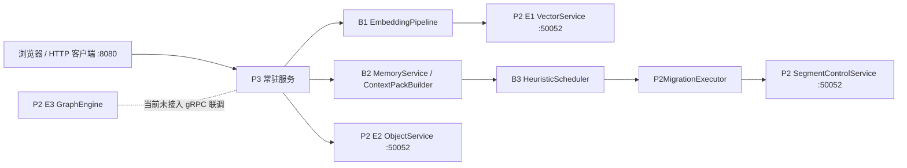

# P2/P3 融合架构与验证

## 运行结构



项目在一个根目录内共同构建与部署：`engine/` 是 Rust P2，`src/aether_agent_memory/` 是 Python P3，接口契约统一为 `engine/proto/aether_engine.proto`。

| 模块 | 当前状态 | 当前联调职责 |
| --- | --- | --- |
| P2 E1 VectorService | 已通过 gRPC 暴露 | 接收 B1 生成的向量 |
| P2 E2 ObjectService | 已通过 gRPC 暴露 | 存储冒烟对象 |
| P2 SegmentControlService | 已通过 gRPC 暴露 | 冻结/解冻分段、完成/失败迁移、维护 route epoch 并从 WAL 恢复 |
| P2 E3 GraphEngine | 工程中存在，未暴露到当前 gRPC 服务 | 不参与当前冒烟链路 |
| P3 B1 | 已接入 | 文本嵌入、向量写入 |
| P3 B2 | 已接入 | 记忆写入与 Context Pack 构建 |
| P3 B3 | 已接入 | 启发式评分、调度动作、调用 P2 迁移控制面并返回幂等执行反馈 |

## Compose 启动

```powershell
docker compose up -d --build
docker compose ps
docker compose logs -f p3 engine
```

Compose 默认启动 `engine` 和常驻 `p3`：

| 服务 | 容器端口 | 主机端口 | 配置 |
| --- | --- | --- | --- |
| `engine` | `50052` | `50052` | `AETHER_P2_DATA_DIR=/var/lib/aether-engine` |
| `p3` | `8080` | `8080` | `AETHER_P2_GRPC=engine:50052`、`AETHER_P2_ENGINE=object/default` |

`p3-demo` 是可选的一次性命令行冒烟服务：

```powershell
docker compose --profile demo up --build --abort-on-container-exit --exit-code-from p3-demo
```

## 验证边界

`POST /api/run-smoke` 成功说明以下链路真实通过：P3 可以经 gRPC 写入 P2 E2 对象和 P2 E1 向量，B2 可持久化并构建上下文，B3 可生成带评分的调度建议，并由 `P2MigrationExecutor` 经 SegmentControlService 完成冻结、逻辑路由提交和执行反馈。

`POST /api/demo/session` 是仅用于本地联调的手动企业知识库场景接口。它会把测试文档、用户问题与所有 B1/B2/B3/P2 事件关联到同一条追踪记录。该接口需要 `AETHER_ENABLE_DEMO=true`，生产部署应保持关闭。

该验证会真实更新 P2 的控制面状态、`route_epoch` 和确定性逻辑块路由，并验证重复请求幂等与 WAL 恢复；它不证明对象字节已在物理介质之间搬运，也不覆盖 E3 图数据 API、生产嵌入模型、分布式容错和容量基准。物理 Promote/Demote 仍需外部迁移组件执行。

## 自动化验证

```powershell
# Python 单元与集成测试
uv run pytest

# P2 Rust 工作区测试
cargo test --manifest-path engine/Cargo.toml --workspace

# Docker 端到端一次性冒烟测试
uv run pytest tests/integration/test_compose_stack.py -m integration
```

浏览器与 API 用法请见 [WEB_DASHBOARD.md](WEB_DASHBOARD.md)。
