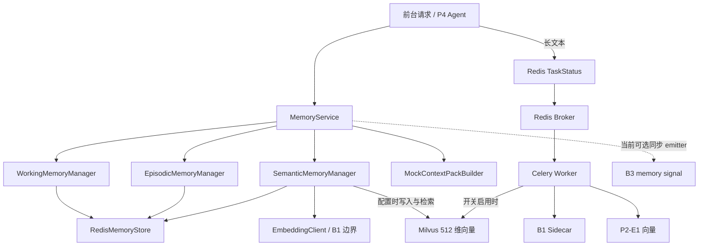
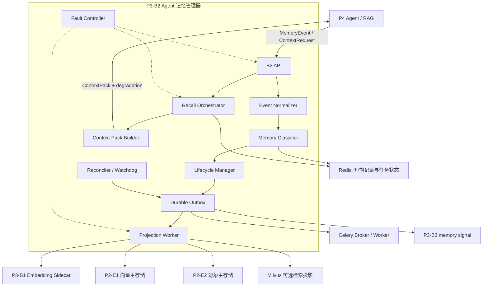
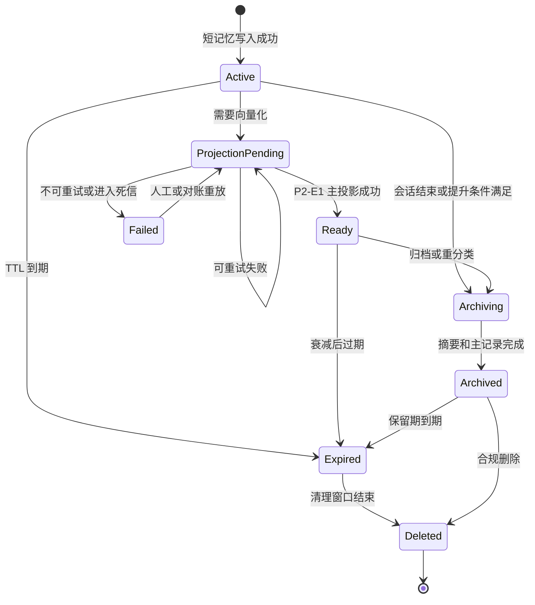
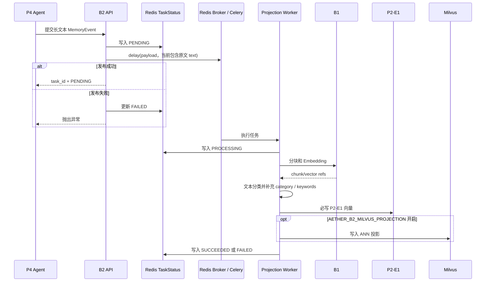
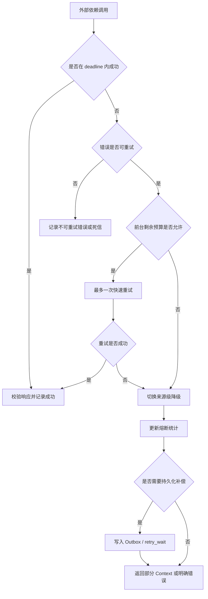

# P3-B2 Agent 记忆管理器技术方案文档

**版本**：v0.2  
**适用范围**：P3-B2 Agent 记忆写入、生命周期管理、联合召回、Context Pack 构建、P3 内部联调、P2/Milvus 投影、Celery 异步任务及异常治理  
**设计重点**：以 B2 记忆管理算法为核心，同时覆盖 B1/B2/B3、Redis、Milvus/P2、Celery 等依赖异常下的故障识别、超时隔离、降级、重试、熔断、补偿和自动恢复，确保单一模块异常不会拖死 Agent 核心服务。  
**技术基线**：《P3 B2 当前技术方案》（2026-08-10）为当前能力和实验数据的第一事实来源；附件未涉及的实现细节以本代码库检索结果为准。  
**修订说明**：v0.2 参考《P3-B3 语义智能分层调度器技术方案文档》的组织方式，将内容整理为“目标约束—架构设计—接口设计—算法设计—一致性设计—容错设计—部署测试—演进设计”。文中使用“当前已实现”“当前局限”“目标设计”三类标识；代码未实现的 Outbox、租约、完整熔断、Durable Spool、自适应策略等均按后续建设项表述，不作为既有能力。

---

## 1. 背景、目标与设计原则

### 1.1 背景

P3 是语义与智能管理层，B2 是其中的 Agent 记忆管理器。按照当前技术基线，B2 负责 Agent 记忆的写入、分层、检索、归档和异步长期记忆处理；B1 模型实现和 B3 智能调度策略不属于 B2 内部实现。B2 接收 Agent 运行过程中产生的记忆事件，将其组织为 Working、Episodic、Semantic 三类记忆，维护生命周期和访问状态，并在推理前构建 Context Pack。

B2 处在 Agent 主链路与多个基础模块之间。当前普通记忆路径由 Redis 保存完整 Memory 和元数据；Semantic Memory 在配置 Milvus 时保存 512 维向量并通过 `memory_id` 回查 Redis 原文。当前长文本路径由 Redis 记录任务状态、Celery 执行、B1 完成分块与向量化、P2-E1 保存向量，Milvus 投影由开关控制。P2-E2 对象引用由集成调用方传入，B2 Worker 当前并不自行持久化原文对象。B2 还可以通过 `SignalEmitter` 向 B3 发出 memory signal，但现有运行链路尚未形成可靠异步投递闭环。

因此，B2 的设计不能只描述记忆分类、召回和淘汰算法。若 B1、B3、Redis、Milvus、P2 或 Celery 任一模块出现超时、不可用、返回脏数据或发生局部积压，B2 必须能够快速识别、局部隔离、按依赖语义降级，并通过持久化任务和对账机制恢复最终一致性。任何非关键投影失败都不能无限占用 Agent 请求线程或连接池。

### 1.2 建设目标

B2 第一阶段目标是完成 **V1 Rule-based Memory Manager MVP**，形成以下最小闭环：

```text
记忆事件输入
  用户消息 / Agent 响应 / 工具结果 / 文档片段
        ↓
标准化与预过滤
        ↓
按事件类型映射 Working / Semantic，归档生成 Episodic
        ↓
Redis 保存 Memory 主记录和任务状态
        ↓
B1 Embedding；普通 Semantic 可写 Milvus
        ↓
长文本异步写入 P2-E1，可选写入 Milvus
        ↓
推理前联合召回与 Context Pack 构建
        ↓
访问反馈、生命周期更新、B3 memory signal
```

第一阶段具体目标如下：

1. 统一三类记忆的数据模型、状态机、幂等键和可追溯标识。
2. 支持短文本同步写入、长文本异步处理和会话归档。
3. 支持 Working、Episodic、Semantic 多源召回及 token 预算内的 Context Pack 组装。
4. 在不改变当前 Redis 主记录语义的前提下，明确普通 Semantic、长文本 P2-E1、P2-E2 对象引用和 Milvus 投影的边界。
5. 建立 Outbox、任务状态、补偿对账和死信处理，保证异步写入可恢复。
6. 对 B1/B2/B3、Redis、Milvus/P2、Celery 建立超时、重试、熔断、舱壁和降级策略。
7. 为后续自适应召回、记忆压缩、个性化遗忘和图记忆预留训练数据。

### 1.3 设计原则

1. **主链路优先**：推理链路有硬超时预算，非关键依赖失败时返回部分 Context Pack，不无限等待完整结果。
2. **边界清晰**：B1 负责 Embedding，B2 负责记忆语义与生命周期，B3 负责分层决策；当前普通 Semantic 以 Redis 完整记录配合 Milvus 检索，当前长文本向量以 P2-E1 为落点。目标态再逐步统一事实源和投影语义。
3. **事实源唯一**：同一类数据只定义一个权威事实源，其他存储均视为缓存或投影。
4. **先持久化、后扩散**：需要跨模块传播的数据先形成可恢复事实，再异步投影，避免半成功不可追踪。
5. **部分结果可用**：联合召回允许来源级失败，Context Pack 必须携带完整性和降级信息。
6. **有界失败**：所有外部调用必须有超时、有限重试、并发上限和熔断，不允许无限排队或重试风暴。
7. **幂等与可补偿**：写入、投影、归档、信号发送均使用幂等键；失败通过 Outbox/Reconciler 补偿。
8. **可观测、可解释**：每次召回输出来源、得分、裁剪原因、依赖状态和 trace_id。
9. **演进兼容**：V1 产生的 memory_log、recall_log、feedback 和 state snapshot 应能直接服务 V2/V3 策略训练。

### 1.4 技术事实分层

| 标识 | 含义 | 本文处理方式 |
|---|---|---|
| 当前已实现 | 附件明确给出且代码能够对应 | 使用确定语气，并保留真实参数和测试数据 |
| 当前局限 | 附件明确列为待补，或代码检索确认存在缺口 | 说明实际影响，不包装成已完成能力 |
| 目标设计 | 为满足跨模块容错要求新增的方案 | 使用“应、建议、目标态”等表述，并进入实施与验收项 |

---

## 2. 总体技术架构

### 2.1 当前实际架构



当前架构有两条需要避免混淆的语义路径：

1. 普通 Semantic Memory：Redis 保存完整 Memory；若配置 Milvus，则向量写 Milvus，查询先在 Milvus 找候选，再按 `memory_id` 回 Redis。
2. 长文本异步路径：Redis 记录四态任务，Celery 调用 B1 后必须写 P2-E1；`AETHER_B2_MILVUS_PROJECTION=true` 时再写 Milvus。传入的 `content_ref` 可指向 P2-E2，但 Worker 当前不负责创建该对象。

### 2.2 目标容错架构



### 2.3 逻辑组件划分

| 组件 | 职责 | 当前状态 | 目标补充 |
|---|---|---|---|
| MemoryService | 事件写入、归档、推理前召回 | 已实现 | 增加幂等和故障边界 |
| 三类 Manager | Working/Episodic/Semantic 写入与召回 | 已实现 | 规则配置化、来源级降级 |
| RedisMemoryStore | Memory、TTL、访问数据 | 已实现连接池、自适应写并发、单字段 scope 索引、0.5s 操作超时与分批读取 | 组合索引、旧数据索引迁移、熔断、本地降级边界 |
| ContextPackBuilder | 并行召回、排序、去重和预算选择 | 已实现来源级失败隔离、`complete/degraded/degradation_reasons` 协议 | 总 deadline、来源配额和超时治理 |
| Celery Worker | B1、P2-E1、可选 Milvus 长任务 | 已实现基础版本 | 队列隔离、任务时限、租约和死信 |
| RedisTaskStatusStore | PENDING/PROCESSING/SUCCEEDED/FAILED | 已实现 | retry_wait、lease、dead_letter |
| Durable Outbox | 保存待投影、待信号事件 | 未实现 | 数据库表或本地 WAL |
| Reconciler/Watchdog | 卡死任务、投影缺口自动补偿 | 未实现 | 周期对账与受控重放 |
| Fault Controller | 健康、熔断、降级级别 | 未实现统一控制器 | 组件级状态机和指标 |
| Observability | 基础 task error、部分健康接口 | 部分实现 | OpenTelemetry、组件健康、验收证据 |

### 2.4 当前数据落点与目标事实源

| 数据类型 | 当前实际落点 | 当前局限 | 目标定义 |
|---|---|---|---|
| Working/Episodic/Semantic 完整记录 | Redis；本地开发可使用 SQLite | 新写入记录按 tenant/user/agent/session 单字段索引读取；旧记录或缺失索引时仍会回退全局集合；缺少明确降级提交语义 | Redis/持久数据库保存主记录，缓存不得伪装为持久化成功 |
| 普通 Semantic 向量 | Memory 内 embedding；配置 Milvus 时写 Milvus | Milvus 失败会向上冒泡 | Redis 主记录先成功，Milvus 作为可补偿检索投影 |
| 长文本向量 | P2-E1 必写；Milvus 可选 | 两条 Semantic 路径语义不同 | P2-E1 作为长文本向量主落点，Milvus 可重建 |
| 长文本原文 | 当前任务传入 text，并携带外部 `content_ref` | B2 Worker 不创建 P2-E2 对象，Celery 消息体仍含原文 | 原文先可靠落 P2-E2/对象存储，任务只传引用 |
| 异步任务状态 | Redis 四态 TaskStatus | Redis 与 broker 之间非原子，无租约/死信 | Durable Outbox 为任务事实，Redis 服务状态查询 |
| B3 memory signal | 可选 `SignalEmitter` 同步调用 | 未形成可靠真实链路 | Outbox 异步投递，B3 故障不阻塞 B2 |

---

## 3. 模块边界与接口依赖

### 3.1 P3 内部模块边界

| 模块 | 负责 | 不负责 | 与 B2 的关系 |
|---|---|---|---|
| B1 | 文本切分、Embedding、向量引用生成 | 记忆分类、生命周期、Context Pack | B2 的可降级异步依赖 |
| B2 | 记忆语义、状态、召回、上下文构建、反馈 | Embedding 模型推理、物理迁移 | 本方案主体 |
| B3 | 消费 memory signal，计算分层调度动作 | 记忆写入、向量化、主链路召回 | B2 的异步下游，不能反向阻塞 B2 |

### 3.2 外部模块边界

| 模块 | 当前使用能力 | 当前故障表现 | 目标业务语义 |
|---|---|---|---|
| Redis | 三类完整 Memory、TTL、访问计数、全局 ID 集合、任务状态、Celery broker/backend | 异常通常直接向上抛出；没有统一 timeout/熔断/本地降级 | 召回返回其他来源/空包；写入进入可靠 spool 或明确失败 |
| P2-E1 | 长文本向量写入与集成检索 | Worker 中为必经步骤；失败进入有限重试或 FAILED | 投影保持 pending，前台核心服务继续 |
| P2-E2 | 集成场景提供 `content_ref/object_id` | B2 Worker 不负责创建对象 | 目标态原文先可靠落对象存储，任务只传引用 |
| Milvus | 普通 Semantic 向量检索；长文本可选投影 | 普通 Semantic 异常可向上冒泡；长任务开启投影后异常会使任务 FAILED | 直接绕过并返回 Redis Working/Episodic；后台补偿投影 |
| Celery | 长文本异步任务和结果执行 | broker 发布失败会把 TaskStatus 改为 FAILED；无 Outbox | Outbox 保留任务，API 不等待 broker 恢复 |

### 3.3 目标调用方向与反向依赖约束

1. P4 调用 B2；B2 不反向同步调用 P4。
2. B2 可调用 B1，但调用必须带截止时间；B1 不决定 B2 记忆状态。
3. B2 向 B3 发送信号采用异步 Outbox；B3 不得进入 B2 写入提交条件。
4. Redis、P2、Milvus、Celery 均通过适配器访问，业务层不直接持有客户端实现。
5. Milvus 只是检索投影，不能成为写入成功的必要条件。
6. Celery 是执行通道，不是任务事实源；消息发布失败由 Outbox 重发。
7. 健康检查只影响路由和降级，不在每个业务请求中同步探测全部依赖。

### 3.4 当前关键路径与目标成功条件

| 场景 | 当前必经调用 | 当前风险 | 目标成功条件 |
|---|---|---|---|
| Working 写入 | Redis write；配置 emitter 时同步发 signal | signal 失败可能出现“数据已写但请求报错” | 主记录成功即可返回，signal 异步补偿 |
| 普通 Semantic 写入 | Embedding -> Redis -> 可选 Milvus -> 可选 signal | B1/Milvus/signal 任一失败可中断或造成部分成功 | Redis 主记录或可靠事实先成功，向量和 signal 独立 pending |
| 会话归档 | 全量查询 Working -> Episodic embedding/write -> Working 标记 ARCHIVED -> signal | 循环中途失败可能形成部分归档 | 每条幂等、可重放，失败条目单独补偿 |
| Context Pack | Working/Episodic/Semantic 并行召回；选中记忆仍会同步 touch/write/signal | 召回已可来源级降级，但尚无统一总 deadline；反馈写入仍可能拖慢或降级请求 | 总预算内返回部分 Context 和缺失来源 |
| 长文本接收 | Redis PENDING -> broker publish | 两步非原子；payload 含原文 | 原文和任务事实可靠持久化后返回 task_id |
| 长文本 Worker | Redis PROCESSING -> B1 -> P2-E1 -> 可选 Milvus -> Redis 终态 | 状态首写失败在 try 外；没有租约/硬软时限 | 有租约、幂等、死信和对账，投影故障可恢复 |

---

## 4. B2 数据模型与接口设计

### 4.1 当前 MemoryEvent

```python
class MemoryEvent(BaseModel):
    event_type: Literal["after_turn", "task_update", "rag_result", "tool_result", "user_memory"]
    agent_id: str
    session_id: str
    user_id: str | None = None
    tenant_id: str | None = None
    task_id: str | None = None
    request_id: str | None = None
    trace_id: str | None = None
    source_id: str | None = None
    object_id: str | None = None
    content: str
    source: str = "user"
    importance: float = 1.0
    evidence_refs: list[str] = []
    metadata: dict[str, Any] = {}
```

当前 `MemoryEvent` 没有独立 `event_id/idempotency_key`，也没有 `memory_type_hint`。目标态应补充稳定幂等键、内容引用和发生时间，但不应在文档中把这些扩展字段描述为当前接口。

目标约束：

1. `idempotency_key` 在同一 tenant/agent 作用域内唯一。
2. `content` 进入日志前必须脱敏，原文只进入授权存储。
3. 大文本不直接经过 Redis/Celery 消息体传递，消息中只携带 `object_id`。
4. 不可信的 `memory_type_hint` 只能作为分类特征，不能绕过服务端规则。

### 4.2 当前 Memory 与目标扩展

```python
class MemoryRecord(BaseModel):
    memory_id: str
    memory_type: Literal["working", "episodic", "semantic"]
    state: str
    session_id: str
    agent_id: str
    user_id: str | None
    tenant_id: str | None
    task_id: str | None
    request_id: str | None
    trace_id: str | None
    source_id: str | None
    object_id: str | None
    content: str
    embedding: list[float] | None
    created_at: datetime
    updated_at: datetime
    expires_at: datetime | None
    last_accessed_at: datetime | None
    access_count: int
    importance: float
    tags: list[str]
    metadata: dict[str, Any]
    p2_ref: dict[str, Any] | None
    superseded_by: str | None
```

以上字段对应附件和当前代码中的核心 Memory。目标态在保持兼容的基础上增加 `content_ref/content_preview/chunk_ids/vector_ids/version/projection_status`；`projection_status` 至少区分 `p2_e1`、`milvus` 和 `b3_signal`，状态取值为 `not_required/pending/running/succeeded/retry_wait/failed/dead_letter`。主记录成功与投影成功必须分开表达。

### 4.3 当前 ContextRequest/ContextPack 与目标扩展

```python
class ContextRequest(BaseModel):
    tenant_id: str | None
    user_id: str | None
    agent_id: str
    session_id: str
    query: str
    max_tokens: int
    max_candidates: int = 100
    memory_types: list[str] = ["working", "episodic", "semantic"]
    filters: dict[str, Any] = {}
    trace_id: str | None

class ContextPack(BaseModel):
    memories: list[MemoryRecord]
    total_tokens: int
    budget_tokens: int
    recall_scores: dict[str, float]
    assembled_text: str
    summary: str
    memory_refs: list[str]
    evidence_refs: list[str]
    budget_info: dict[str, int]
    status: str = "ok"
    trace_id: str | None
```

当前协议还没有 `deadline_ms/complete/degraded/missing_sources/degradation_reasons/source_latency_ms/policy_version`。这些字段应作为兼容扩展加入；其中 `complete=false` 不等于请求失败，只要 B2 在截止时间内返回结构合法的部分结果，Agent 即可继续推理。

### 4.4 AsyncTaskStatus

```python
class AsyncTaskStatus(BaseModel):
    task_id: str
    task_type: Literal["archive", "embed", "p2_projection", "milvus_projection", "b3_signal"]
    aggregate_id: str
    state: Literal[
        "pending", "leased", "processing", "retry_wait",
        "succeeded", "failed", "dead_letter", "cancelled"
    ]
    attempt: int
    max_attempts: int
    next_retry_at: datetime | None
    lease_until: datetime | None
    last_error_code: str | None
    last_error_detail: str | None
    trace_id: str
    created_at: datetime
    updated_at: datetime
```

与当前四态 `PENDING/PROCESSING/SUCCEEDED/FAILED` 相比，目标模型增加租约、重试等待和死信状态，用于识别 Worker 丢失、任务卡死和不可重试错误。

### 4.5 OutboxEvent

```python
class OutboxEvent(BaseModel):
    outbox_id: str
    event_type: str
    aggregate_type: str
    aggregate_id: str
    payload_ref: str
    idempotency_key: str
    state: Literal["pending", "publishing", "published", "retry_wait", "dead_letter"]
    attempt: int
    next_retry_at: datetime | None
    lease_until: datetime | None
    created_at: datetime
```

Outbox 写入必须与主记录/任务事实处于同一可恢复提交边界。若 Redis 无法提供事务边界，生产环境应使用数据库 Outbox；单机开发可使用 SQLite WAL，但要限制容量并监控磁盘。

### 4.6 B2 -> B1 当前边界与目标请求

```python
class EmbeddingRequest(BaseModel):
    request_id: str
    text: str
    source_type: str
    tenant_id: str
    source_id: str
    memory_id: str | None
    object_id: str | None
    trace_id: str | None
    input_type: Literal["passage", "query"] = "passage"
    metadata: dict[str, Any] = {}
```

当前 B1 客户端把原始 `text` 直接发送给 Sidecar，固定网络超时为 60 秒，并校验 chunk、offset、有限数值向量等返回内容。目标态应改为配置化 deadline；长文本优先传 `content_ref` 或由 B1/P2 协商读取，避免大文本在 Celery 消息和 HTTP 请求中重复复制。

### 4.7 B2 -> B3 当前 MemorySignal 与目标投递语义

```python
class MemorySignal(BaseModel):
    memory_id: str
    memory_type: str
    session_id: str
    agent_id: str
    user_id: str | None
    tenant_id: str | None
    signal_type: str
    heat: float
    importance: float
    use_count: int
    last_used_time: datetime | None
    ttl_seconds: int | None
    state: str
    context_used_flag: bool
    source_id: str | None
    trace_id: str | None
    timestamp: datetime
    metadata: dict[str, Any]
```

当前 `MemoryService._emit()` 在写入、访问和归档流程中直接 `await emitter.emit()`，未配置 emitter 时跳过。目标态必须改为异步、幂等、可重放；B3 超时或不可用时，B2 只更新 `b3_signal=pending/retry_wait`，不得回滚记忆写入或拖慢推理请求。

### 4.8 组件级健康接口

```json
{
  "status": "degraded",
  "components": {
    "b2": {"status": "up"},
    "redis": {"status": "up", "latency_ms": 4},
    "b1": {"status": "open_circuit", "retry_after_ms": 23000},
    "p2_e1": {"status": "up"},
    "p2_e2": {"status": "up"},
    "milvus": {"status": "down", "optional": true},
    "celery": {"status": "backlog", "queue_depth": 18000},
    "b3": {"status": "unknown", "optional": true}
  },
  "degradation_level": "L1"
}
```

健康状态来自后台探测和业务调用统计，不在 `/health` 请求内串行调用所有依赖。`/live` 只判断进程是否可服务，`/ready` 判断是否可接收新流量，`/health/components` 提供详细诊断。

---

## 5. 当前 V1 与增强版 Agent 记忆管理算法设计

### 5.1 算法目标

当前 V1 已具备固定事件映射、显式基础状态、三类独立召回评分和 Context token 预算选择。增强版继续采用规则分类、显式生命周期、加权召回和约束选择，优先保证可解释、可调试和故障下行为确定。算法目标包括：

1. 将新事件稳定映射到三类记忆，不因模型不可用而停止写入。
2. 在低延迟预算下优先保留当前会话信息，同时召回少量高价值长期记忆。
3. 控制重复、过期、低置信度和超预算内容进入提示词。
4. 通过访问反馈、重要度和时间衰减更新记忆状态。
5. 为每次选择提供得分明细和排除原因。

### 5.2 当前算法实现

#### 5.2.1 当前写入映射

`MemoryService.ingest()` 当前会执行文本分类并把 `category/keywords/classification_confidence` 写入 metadata，但该分类结果不决定 MemoryType。实际映射为：

```text
event_type == USER_MEMORY  -> Semantic Memory
其他事件                    -> Working Memory
archive_session()           -> Working 复制为 Episodic，原记录标记 ARCHIVED
```

Semantic 和 Episodic 在写入 Redis 前会先调用 EmbeddingClient；Working 直接写 MemoryStore。若配置 `SignalEmitter`，写入后同步发送 creation/archival signal。

#### 5.2.2 当前三类召回评分

Working Memory 只保留当前 session、匹配 agent/user/tenant 且 `ACTIVE` 的候选：

```text
age_seconds = max(now - updated_at, 0)
recency = 1 / (1 + age_seconds / 60)
working_score = importance * recency
```

Episodic Memory 对 `ACTIVE/ARCHIVED` 且 scope 匹配的候选计算：

```text
decay = 0.5 ^ (age_hours / 168)
episodic_score = cosine_similarity(query, memory.embedding) * decay
```

Semantic Memory 先生成 query embedding。配置 Milvus 时由 Milvus COSINE search 返回候选，再按 `memory_id` 回 MemoryStore 获取完整 Memory；未配置 Milvus 时，对 MemoryStore 中全部 Semantic 候选在进程内计算 cosine similarity。

#### 5.2.3 当前 Context Pack 组装

当前 `MockContextPackBuilder` 按 `request.memory_types` 顺序逐个 await 召回，合并后按 score 降序，截取 `max_candidates`。内容去重采用规范化空白并转小写后的完全匹配；token 估算为 `max(len(content) // 4, 1)`，超过 `max_tokens` 的条目直接跳过。最终生成 assembled_text、前 3 条内容组成的最多 1000 字符 summary、memory_refs、evidence_refs 和 budget_info。

`before_inference()` 已并行执行各类记忆召回，并在单一来源异常时返回部分 Context，写入 `complete/degraded/degradation_reasons`。随后对每个已选 Memory 执行 `touch()`、同步回写 Store，并同步发送 access signal；因此反馈阶段仍处于请求链路中，尚缺统一总 deadline 和完全异步化的反馈投递。

#### 5.2.4 当前生命周期

当前 Memory 状态只有 `ACTIVE/ARCHIVED/EXPIRED/SUPERSEDED`，允许转换为：

```text
ACTIVE -> ARCHIVED / EXPIRED / SUPERSEDED
ARCHIVED -> EXPIRED
EXPIRED / SUPERSEDED -> 终态
```

下面的 `projection_pending/ready/failed/deleted` 等状态属于目标扩展，不是当前代码状态。

### 5.3 目标记忆分类规则

分类顺序如下：

1. 当前轮消息、临时计划、工具中间结果默认进入 Working Memory。
2. 已结束会话、完成任务的过程与结果经摘要后进入 Episodic Memory。
3. 跨会话稳定事实、用户偏好、可复用知识候选进入 Semantic Memory。
4. 安全策略、租户规则、系统提示不作为普通记忆写入，由独立配置管理。
5. 密钥、令牌、明确禁止保存的数据直接拒绝或脱敏，不进入任何记忆层。

规则打分：

```text
score_working = w_session * same_session
              + w_recent * recency
              + w_transient * transient_feature

score_episodic = w_task_end * task_completed
               + w_event * event_density
               + w_summary * summary_available

score_semantic = w_stable * stability
               + w_reuse * cross_session_reuse
               + w_fact * factuality
               - w_sensitive * sensitivity
```

取最高分类型；若最高分低于阈值，保守进入 Working 并设置较短 TTL。服务端规则与用户显式配置优先于模型建议。

### 5.4 目标预过滤与标准化

写入前依次执行：

1. 校验租户、Agent、session scope 和内容大小。
2. 规范化空白、编码、时间和来源类型。
3. 敏感信息检测与脱敏。
4. 计算内容指纹和 `idempotency_key`，做精确重复检查。
5. 对近似重复内容只提高访问/置信信息，不重复生成向量。
6. 根据长度选择同步短文本路径或异步大文本路径。

### 5.5 目标生命周期状态机



状态转换使用 `memory_id + version` 乐观锁。重复事件只允许产生相同结果；乱序事件通过版本号和发生时间拒绝覆盖新状态。

### 5.6 目标召回候选生成

召回来源分为：

1. Redis Working：按 `tenant_id/agent_id/session_id` 精确索引获取近期候选。
2. Redis Episodic：按 Agent、任务和时间窗索引获取候选；当前版本没有物理压缩摘要。
3. P2-E1/Milvus Semantic：查询向量候选；查询向量由 B1 在严格超时内生成。
4. 降级关键词召回：B1 或向量检索不可用时，对近期/高重要记忆执行有限关键词匹配。

各来源独立设置候选上限，禁止继续沿用当前“读取命名空间全部 Redis Memory 后在应用层过滤”的方式。召回任务并行执行，来源超时后立即取消或丢弃迟到结果。

### 5.7 增强版召回评分

对候选记忆 `m` 和请求 `q` 计算：

```text
recency(m) = exp(-lambda_type * age_hours)
frequency(m) = log(1 + access_count) / log(1 + access_cap)

score(m, q) = w_sem * semantic_similarity(m, q)
            + w_lex * lexical_similarity(m, q)
            + w_rec * recency(m)
            + w_imp * importance(m)
            + w_freq * frequency(m)
            + w_scope * scope_match(m, q)
            + w_conf * confidence(m)
            - w_dup * duplicate_penalty(m)
            - w_stale * staleness_penalty(m)
```

若语义来源不可用，则重新归一化剩余权重，而不是将语义分数默认为 0 后误伤所有候选。默认优先级为 `scope_match > semantic/lexical relevance > importance > recency > frequency`。

### 5.8 目标去重与冲突处理

1. 内容指纹完全相同：保留状态更新且证据更完整的一条。
2. 高相似度同义记忆：保留最高分条目，合并 evidence_refs。
3. 同一事实存在新旧冲突：优先可信来源与较新版本，旧版本标记为 superseded。
4. 用户明确更正高于模型推断；系统规则高于用户偏好记忆。
5. 无法判定的冲突允许同时保留，但必须在 reasons 中标记 `conflict_unresolved`。

### 5.9 目标 Context Pack 预算选择

先为 Working Memory 预留最低配额，再对其他候选执行约束选择：

```text
maximize Σ selected_i * score_i

subject to:
  Σ selected_i * token_i <= max_tokens
  working_tokens >= min_working_tokens, when working candidates exist
  source_count[type] <= quota[type]
  duplicate_group_count <= 1
  evidence_required(memory_i) = true
```

V1 可使用“按单位 token 价值排序 + 类型配额修正”的贪心算法。超长条目优先截取有证据定位的摘要；禁止无标记截断造成语义歧义。

### 5.10 目标访问反馈与重要度更新

召回后只对实际进入 Context Pack 的条目记录 `selected`；上层可回传 `used/helpful/corrected/rejected`。V1 更新规则：

```text
importance_new = clamp(
    alpha * importance_old
  + beta * helpful_feedback
  + gamma * repeated_cross_session_use
  - delta * rejected_or_corrected,
  0, 1
)
```

访问计数采用异步批量更新，不阻塞 Context 返回。反馈丢失不影响主链路，但应通过本地缓冲或 Outbox 尽力投递。

---

## 6. 长文本、多存储投影与一致性策略

### 6.1 当前长文本异步流程



当前实现细节：

1. TaskStatus 为 `PENDING/PROCESSING/SUCCEEDED/FAILED` 四态，默认保留 7 天。
2. Worker 对 `B1EmbeddingUnavailableError/P2UnavailableError/grpc.RpcError` 最多重试 3 次，退避为 1/2/4 秒；其他异常直接 FAILED。
3. P2 gRPC 默认超时 10 秒，B1 HTTP 客户端固定超时 60 秒。
4. 前台集成等待函数有明确 60 秒默认 deadline，不会无限轮询；这不等于 Celery Worker 已配置 soft/hard time limit。
5. Worker 首次写 PROCESSING 在 `try` 之外；若 Redis 此处失败，任务会直接异常退出且不一定留下可查询终态。
6. `PENDING` 状态写入和 broker publish 非原子；当前没有 Durable Outbox。
7. `content_ref` 可指向上游已保存的 P2-E2 对象，但当前 Celery payload 仍携带完整 `text`，Worker 也不会自行读取/写入 P2-E2。

### 6.2 目标可靠接收与提交边界

短文本写入的最小确认条件是：

1. MemoryRecord 已保存，或已保存到明确受限、可恢复的 Durable Spool。
2. 需要异步处理时，OutboxEvent 已持久化。
3. 返回的 `memory_id/task_id` 可用于幂等查询。

B1、P2-E1、Milvus、B3 和 Celery broker 的即时成功均不应成为 Working 主记录的确认条件。普通 Semantic 当前必须先生成 embedding，目标态应改为“Redis 原始 Memory 先提交，向量 projection_pending”。长文本则必须先保证原文进入 P2-E2/对象存储或 Durable Spool，再让消息只携带引用。

### 6.3 当前与目标 Celery 可靠性配置

| 参数 | 当前实现 | 目标建议 | 目的 |
|---|---:|---:|---|
| `task_track_started` | true | true | 记录任务已启动 |
| `max_retries` | 3 | 5 | 提高短暂故障恢复概率 |
| retry countdown | 1/2/4s，无 jitter | 指数退避，最大 60s，加 jitter | 避免重试风暴 |
| `task_acks_late` | 未显式配置 | true | Worker 完成后确认 |
| `task_reject_on_worker_lost` | 未显式配置 | true | Worker 丢失后重新入队 |
| `worker_prefetch_multiplier` | 未显式配置 | 1 | 避免单 Worker 占用大量长任务 |
| soft time limit | 未显式配置 | 150s | 允许任务清理和写回状态 |
| hard time limit | 未显式配置 | 180s | 杀死卡死任务 |
| visibility timeout | 未显式配置 | 600s | 覆盖最长任务与回收窗口 |

当前只有一个 `b2.process_long_text` 任务通道。目标态队列至少按 `archive/embed/p2_projection/milvus_projection/b3_signal` 分离，Milvus 或 B3 的积压不得占满归档和 P2 主投影 Worker。

### 6.4 当前双路径与目标投影一致性

当前普通 Semantic 由 SemanticMemoryManager 写 Redis，并可同步写 Milvus；长文本 Worker 则先写 P2-E1，再按开关写 Milvus。目标态应统一投影状态：

1. 普通 Semantic 的 Redis 主记录先成功，B1/Milvus 失败进入 `projection_pending/retry_wait`。
2. 长文本 P2-E1 成功后才标记主向量投影完成；Milvus 写入失败不回滚 P2-E1。
3. 查询优先策略可配置为 Milvus -> P2-E1；Milvus 熔断时直接跳过。
4. 通过 `memory_id/chunk_id/vector_id` 幂等 upsert，重复执行不产生重复向量。
5. 删除流程先写 tombstone，再异步删除各投影；查询必须过滤 tombstone。

### 6.5 目标 Outbox 发布与租约

Outbox Publisher 使用租约领取事件：

```text
pending/retry_wait
  -> publishing with lease_until
  -> published
  -> retry_wait when retryable failure
  -> dead_letter when non-retryable or attempts exhausted
```

Publisher 崩溃后，Watchdog 将租约过期的 `publishing` 事件重新置为 `retry_wait`。发布成功但状态回写失败时，消费者依靠 `idempotency_key` 去重。

### 6.6 目标对账与自动恢复

Reconciler 周期检查：

1. `projection_pending` 超过阈值但没有活动任务。
2. TaskStatus 为 processing 且 lease 已过期。
3. P2-E1 已存在而 MemoryRecord 未 ready，或反向缺失。
4. Milvus/P2 映射数量不一致。
5. B3 signal 长期 pending。
6. Outbox、Celery 队列和 Worker 执行状态不一致。
7. tombstone 已写但物理投影仍存在。

自动修复只执行幂等 upsert、重新入队或状态对齐；涉及数据冲突、权限和不可逆删除时进入人工队列。

---

## 7. memory_log、召回快照与策略演进预留

### 7.1 memory_log

记录每次状态变化：

```python
class MemoryLog(BaseModel):
    log_id: str
    memory_id: str
    event_type: str
    before_state: str | None
    after_state: str | None
    reason: str
    policy_version: str
    actor: str
    trace_id: str
    occurred_at: datetime
```

### 7.2 recall_log

每次 Context 构建至少记录：

- 请求范围、query 指纹和 token 预算；
- 各来源候选数、耗时、错误码与是否熔断；
- 候选的分项得分、最终排名和排除原因；
- Context Pack 的选择结果、裁剪方式和完整性；
- `policy_version`、特征版本和 trace_id。

原始敏感文本不得直接进入 recall_log，可记录脱敏摘要或内容哈希。

### 7.3 feedback 与训练样本

```python
class RecallFeedback(BaseModel):
    request_id: str
    memory_id: str
    outcome: Literal["used", "helpful", "ignored", "rejected", "corrected"]
    value: float
    correction_ref: str | None
    occurred_at: datetime
```

可形成如下训练样本：

```text
state_snapshot
  + candidate_features
  + selected_action
  + context_position
  + dependency_health
  + user/agent feedback
  + latency/token cost
  = future policy training sample
```

### 7.4 指标

| 指标 | 含义 |
|---|---|
| `b2_context_latency_ms` | Context Pack 总耗时分位数 |
| `b2_context_degraded_total` | 降级返回次数，按原因分组 |
| `b2_recall_source_latency_ms` | 各来源召回耗时 |
| `b2_recall_source_timeout_total` | 来源超时次数 |
| `b2_memory_write_total` | 按类型和结果统计写入 |
| `b2_projection_pending_age_seconds` | 最老待投影任务年龄 |
| `b2_outbox_backlog` | Outbox 积压量 |
| `b2_task_stalled_total` | 租约过期任务数 |
| `b2_circuit_state` | 组件熔断状态 |
| `b2_spool_bytes` | 本地降级 spool 占用 |
| `b2_context_token_utilization` | token 预算利用率 |

### 7.5 当前 Working Memory 基线

附件记录的测试条件为：固定 1 KiB 文本、每场景 10,000 次、预置 256 条记忆、并发 1/8/32。

| 并发 | 写 P99 | 读 P99 | 50/50 混合 P99 |
|---:|---:|---:|---:|
| 1 | 0.415 ms | 0.622 ms | 0.583 ms |
| 8 | 1.634 ms | 2.015 ms | 1.938 ms |
| 32 | 5.598 ms | 7.917 ms | 8.368 ms |

本地 Docker 环境最大 P99 为 `8.368 ms`，低于 Working Memory `<10 ms` 的单项目标。该结果是本地基线，服务器环境仍需使用同一脚本复测，不能外推为完整 Context SLO。

### 7.6 当前真实数据集回放

当前已整理的数据集：

```text
datasets/p3/acceptance_v0.1/locomo.jsonl
datasets/p3/acceptance_v0.1/longmemeval.jsonl
```

数据规模及附件记录结果：

| 项目 | 规模/结果 |
|---|---:|
| LoCoMo | 10 条样本，4,466 个轮次 |
| LongMemEval | 100 条样本，3,094 个轮次 |
| Working 写入 | 7,560 次，P99 0.455 ms |
| Episodic 写入 | 7,560 次，P99 0.471 ms |
| Semantic 写入 | 110 次，P99 4.760 ms |
| 完整 Context 召回 | P99 1,330.968 ms |

完整 Context P99 包含多路 Redis 查询、Milvus 检索和上下文组装，不属于 Redis Working Memory 单项指标。当前 Redis Store 通过全局 ID 集合执行 `SMEMBERS + MGET` 后在应用层过滤，数据量扩大后该路径会放大延迟和内存占用，因此建立 tenant/user/agent/session 组合索引是性能与故障隔离的共同 P0 项。

仓库中的 `artifacts/p3_b2_local_replay.json` 还明确标注该结果为 **B2 only**，不包含 B1 HTTP Embedding 和 B3 调度。因此 `1330.968ms` 不能作为 B1/B2/B3 全闭环性能结果，也不能证明依赖故障时仍满足相同延迟。

附件记录原有 B2 单元测试结果为 `34 passed`。该数字是既有回归证据，后续故障治理功能需要新增专项测试，不能用这 34 项替代。

### 7.7 当前物理压缩状态

当前状态为 **`NOT_IMPLEMENTED`**。现有链路会分块、向量化、分类和持久化，但不会生成摘要、token pruning 或 compressed artifact；不得使用 chunk 数、向量数或分类结果冒充压缩率。

正式指标定义：

```text
compression_ratio = original_utf8_bytes / persisted_compressed_utf8_bytes
```

当前可用于 B2 的数据集为 LoCoMo 和 LongMemEval；仓库中没有 BEAM、Mem2Act，本阶段也不以 B3 数据集测试作为 B2 验收条件。

### 7.8 基线复现命令

Working Memory 基线：

```bash
python benchmarks/p3/b2_working_latency.py \
  --redis-url redis://redis:6379/0 \
  --samples 10000 \
  --preload 256 \
  --output artifacts/p3_b2_working_latency.json
```

真实数据回放：

```bash
python scripts/run_b2_dataset_replay.py \
  --locomo datasets/p3/acceptance_v0.1/locomo.jsonl \
  --longmemeval datasets/p3/acceptance_v0.1/longmemeval.jsonl \
  --output artifacts/p3_b2_local_replay.json
```

---

## 8. 故障识别、降级、重试、熔断与补偿设计

### 8.1 总体容错原则

1. 超时是首要隔离手段，所有外部调用必须小于上层剩余 deadline。
2. 同步请求只重试低成本、幂等、短暂性错误；异步任务承担大部分恢复重试。
3. 组件熔断器相互独立，Milvus 故障不能打开 P2 或 Redis 熔断器。
4. 降级结果必须显式返回，不能将“未查询到”和“查询失败”混为一谈。
5. 非关键模块故障不能改变主链路成功语义；关键持久化不可用时不得假成功。
6. 限制并发、队列深度、spool 容量和单租户配额，防止故障扩散为资源耗尽。

### 8.2 当前故障能力核验

| 能力 | 附件结论 | 代码核验与边界 |
|---|---|---|
| Celery 任务状态 | 当前已具备 | Redis 保存四态，默认 TTL 7 天；没有 retry_wait、租约和死信 |
| Celery 异常重试 | 当前已具备 | 仅 B1 unavailable、P2 unavailable、gRPC 错误重试；最多 3 次，1/2/4 秒 |
| 任务超时 | 当前已具备 | 前台轮询默认 60 秒有严格 deadline；Worker 未显式配置 Celery soft/hard time limit |
| 失败错误记录 | 当前已具备 | FAILED 保存异常类型和消息；状态首写失败可能无法落终态 |
| Milvus 连接和集合缓存 | 当前已具备 | collection 采用进程内缓存和 Lock；未配置调用 timeout/熔断 |
| Redis 连接池 | 当前已具备 | MemoryStore 最大连接数默认 1024，并带 AdaptiveConcurrency；无显式 socket/connect timeout |
| 异步任务隔离普通写入 | 当前已具备 | 长任务由 Celery 执行，不直接阻塞普通 Working 写入 |
| Redis 失败降级 | 仍需补充 | 当前异常直接传播，无重试/只读/本地缓存提交语义 |
| Milvus 失败降级 | 仍需补充 | 普通 Semantic recall/write 可整体失败；没有返回空 Semantic 的保护层 |
| P2 失败补偿 | 仍需补充 | 当前仅有限重试并最终 FAILED，没有保留事实后的自动补写任务 |
| 连续失败熔断 | 仍需补充 | 未发现统一熔断器和 half-open 探测 |
| 恢复后自动追赶 | 仍需补充 | 未发现 Reconciler、Watchdog、Outbox 重放闭环 |
| Context 部分成功 | 附件未定义，代码补查 | 已实现来源级并行召回及 `complete/degraded/degradation_reasons`；尚缺 `missing_sources` 标准字段、统一 deadline 和来源级配额 |
| B3 故障隔离 | 附件未定义，代码补查 | emitter 为同步 await，异常可在主记录写入后向上冒泡 |
| broker 发布原子性 | 附件未定义，代码补查 | Redis PENDING 与 `.delay()` 两步非原子，无 Outbox |

### 8.3 目标模块级故障矩阵

| 故障模块 | 识别信号 | 主链路降级 | 重试/恢复 | 防拖死措施 |
|---|---|---|---|---|
| B1 | 连接失败、超时、5xx、返回维度错误 | 写入保留文本并置 `projection_pending`；查询改用关键词/近期记忆 | 异步指数退避；恢复后补向量 | 独立连接池、2s 超时、熔断、并发舱壁 |
| B2 实例 | 事件循环卡顿、5xx、内存/FD 高水位 | 网关摘除异常实例；其他实例继续；必要时只读 | 实例重启，Outbox/租约恢复任务 | `/live` 与 `/ready` 分离、进程资源限制 |
| B3 | signal 超时、拒绝、积压 | 不影响写入和召回，signal 保持 pending | 独立低优先队列重试 | 禁止同步调用；队列隔离；可直接暂停发送 |
| Redis | 超时、连接池耗尽、READONLY、OOM | 召回返回其他来源/空包；写入进 Durable Spool 或 503 | 同步最多 1 次短重试；恢复后回灌 | 200~300ms 超时、池上限、熔断、spool 容量上限 |
| P2-E1 | gRPC deadline、UNAVAILABLE、校验失败 | 语义召回改走 Milvus或关键词；投影 pending | Celery 异步重试与对账 | 2s 查询超时、独立队列、熔断 |
| P2-E2 | 保存超时、容量/权限错误 | 有可靠 spool 则 202 degraded；否则 503 | 暂时性错误重试；人工处理权限/容量问题 | 3s 超时、请求体限制、spool 高水位拒绝 |
| Milvus | search/upsert 超时、集合不可用 | 直接绕过，使用 P2-E1/Redis；主写仍成功 | 独立投影队列重试，可整库重建 | 1s 超时、快速熔断、非关键线程池 |
| Celery/Broker | 发布失败、无 Worker、积压持续增长 | Outbox 保留任务；短写入仍成功；长任务状态 pending | Publisher 重发；Watchdog 回收；扩容 Worker | 队列深度限额、任务时限、prefetch=1、背压 |

### 8.4 降级级别

| 级别 | 条件示例 | 行为 |
|---|---|---|
| L0 正常 | 关键依赖健康 | 完整多源召回和全部异步投影 |
| L1 局部降级 | B1、Milvus、B3 单点不可用 | 返回部分 Context；投影/信号延后 |
| L2 核心存储降级 | Redis 或 P2 某主能力不可用 | 限制写入；启用受限 spool；召回只用可用来源 |
| L3 保护模式 | 多依赖异常、队列或 spool 高水位 | 只保留最小 Working 路径；拒绝长文本和低优先任务 |
| L4 不可安全服务 | 无任何可靠持久化且无法提供最小召回 | 快速 503/429，保留存活和诊断接口 |

### 8.5 当前超时与目标预算

目标预算为初始建议，需经压测校准：

| 调用 | 当前代码 | 目标前台 | 目标异步 | 备注 |
|---|---:|---:|---:|---|
| Redis 单次读写 | 未显式配置 | 200~300ms | 1s | 连接超时应更短 |
| B1 HTTP | 固定 60s | 2s | 30~120s | 查询失败立即降级关键词 |
| P2 gRPC | 默认 10s | 2s | 10s | 当前值不适合前台 Context |
| P2-E2 对象写入 | B2 Worker 不执行 | 3s | 30s | 大对象通过引用传递 |
| Milvus search/upsert | 未显式配置 | 1s | 5s | 可选来源，快速失败 |
| Celery publish | 未显式配置 | 1s | 5s | 失败由 Outbox 后台重发 |
| B3 signal | emitter 未显式配置 | 不进入前台 | 3s | 独立低优先队列 |
| Context Pack 总预算 | 无 | 1.5s | - | 每个子调用使用剩余 deadline |

### 8.6 重试策略

重试分类：

- 可重试：连接重置、超时、限流、UNAVAILABLE、临时主从切换。
- 不可重试：鉴权失败、参数错误、内容超限、模型维度不兼容、数据校验失败。
- 条件重试：容量不足需先降载；版本冲突需重新读取后判断。

当前仅 Celery Worker 对指定 B1/P2/gRPC 异常最多重试 3 次，倒计时为 `1s、2s、4s`，没有 jitter。目标态前台只允许至多 1 次快速重试，退避约 `50ms + jitter`，且必须满足剩余 deadline；异步任务最多 5 次，采用指数退避并加随机抖动，单次上限 60s，超过次数进入 dead letter。

禁止以下行为：

1. 在同一调用栈的 HTTP/gRPC 客户端、业务层和 Celery 三层同时重试。
2. 对非幂等写入无幂等键重试。
3. 在熔断器 open 状态继续积累同步请求。
4. 无上限重试权限、格式、维度或配额错误。

### 8.7 熔断器

组件级熔断状态为 `closed -> open -> half_open -> closed/open`。建议初始参数：

| 参数 | 建议值 |
|---|---:|
| 最小样本数 | 10 |
| 连续失败快速阈值 | 5 |
| 统计窗口 | 30s |
| 失败率阈值 | 50% |
| open 时间 | 60s |
| half-open 探测数 | 3 |

熔断动作：B1 open 时禁止同步向量化；Milvus open 时不创建检索请求；B3 open 时只积压 Outbox；Redis/P2 open 时进入相应 L2/L3 策略。健康探测成功不能单独关闭熔断，必须由真实轻量业务探针验证。

### 8.8 Bulkhead、限流与背压

1. Context、写入、归档、投影使用独立线程池/协程 semaphore。
2. Celery 按任务类型使用独立队列和 Worker 并发上限。
3. 每个 tenant 设置写入速率、并发召回、长文本大小和待处理任务配额。
4. Outbox、队列、spool 达到 70%/85%/95% 时依次告警、降级、拒绝低优先任务。
5. Context Pack 候选数、单项 token 和总 token 均设置硬上限。
6. 对迟到结果不再合并，避免请求完成后继续占用 CPU。

### 8.9 故障决策流程



### 8.10 幂等、补偿与错误码

| 错误码 | 含义 | 是否重试 | 对外行为 |
|---|---|---|---|
| `B2_INVALID_EVENT` | 请求格式/范围错误 | 否 | 400 |
| `B2_DUPLICATE_EVENT` | 重复事件 | 否 | 返回既有结果 |
| `B2_REDIS_UNAVAILABLE` | Redis 不可用 | 条件 | 降级或 503 |
| `B2_B1_TIMEOUT` | B1 超时 | 是 | projection_pending |
| `B2_P2_UNAVAILABLE` | P2 不可用 | 是 | 降级或异步补偿 |
| `B2_MILVUS_UNAVAILABLE` | Milvus 不可用 | 是 | 主链路继续 |
| `B2_CELERY_UNAVAILABLE` | Broker/Worker 不可用 | 是 | Outbox pending |
| `B2_B3_UNAVAILABLE` | B3 不可用 | 是 | signal pending |
| `B2_CONTEXT_PARTIAL` | Context 来源不完整 | 可选 | 200 + degraded |
| `B2_STORAGE_UNSAFE` | 无可靠持久化位置 | 是 | 503，禁止假成功 |
| `B2_OVERLOADED` | 队列/资源高水位 | 是 | 429/503 + Retry-After |

---

## 9. 部署与运行方案

### 9.1 第一阶段部署形态

| 进程/服务 | 部署建议 | 隔离要求 |
|---|---|---|
| B2 API | 多副本无状态部署 | 与 Worker 分离 CPU/内存配额 |
| Outbox Publisher | 1~N 副本，租约竞争 | 独立于 API，不阻塞请求线程 |
| Celery Archive/Embed Worker | 独立队列 | 长任务低并发 |
| P2 Projection Worker | 独立队列 | P2 故障不占用其他 Worker |
| Milvus Projection Worker | 独立低优先队列 | 可整体暂停 |
| B3 Signal Worker | 独立低优先队列 | 可丢弃过期 access 信号，但不可静默丢失关键状态信号 |
| Reconciler/Watchdog | 单活或分片 | 使用分布式锁/租约避免重复扫描 |

### 9.2 配置分组

配置应按以下层次管理：

- `memory_policy`：TTL、重要度阈值、分类规则、归档条件；
- `recall_policy`：来源权重、候选上限、token 配额、去重阈值；
- `timeouts`：Redis/B1/P2/Milvus/Celery/B3；
- `retry`：最大次数、退避、jitter、不可重试错误；
- `circuit_breaker`：窗口、阈值、open 时间；
- `capacity`：连接池、并发、队列、spool、租户配额；
- `feature_flags`：Milvus、B3 signal、关键词降级、V2 shadow 等。

每次策略变更生成 `policy_version`，支持灰度和一键回退。密钥和认证信息不得进入普通配置文件。

### 9.3 当前 Redis 并发控制

`RedisMemoryStore` 当前使用连接池和 `AdaptiveConcurrency` 控制写入：

| 参数 | 当前默认值 |
|---|---:|
| Redis 最大连接数 | 1024 |
| 自适应初始并发 | 8 |
| 自适应最大并发 | 128 |
| 最小并发 | 1 |
| 目标写入延迟 | 10ms |
| 采样窗口 | 16 |

窗口平均耗时低于目标的 80% 时并发加 1，高于目标的 120% 时并发减 1。这里的 elapsed 包含等待 slot 的时间，因此在拥塞时也会促使控制器降并发。固定基线测试通过锁定并发上限复现并发 1/8/32 的实验口径。

该能力只保护 Redis 写入并发，不能替代读取隔离、断路器、租户配额和全局 Context deadline。

当前 Redis 读取端还实现了以下 P0 改造：单次 Redis 操作超时为 0.5s，最多重试 2 次；Memory 主记录除全局 ID 集合外，还按 `tenant_id`、`user_id`、`agent_id`、`session_id` 写入单字段 scope 索引。Working Memory 召回优先按 session 索引读取；Episodic/Semantic 的 Redis 回退路径按 agent/user/tenant 范围读取。每次 `MGET` 最多读取 256 条，避免无界单命令读取触发 Redis 超时。

该实现是第一版性能与兼容性改造，不等同于完整的安全隔离：索引不是组合索引，旧记录尚未回填索引时会按需回退全局集合；正式 API 必须稳定传递并校验 tenant、agent、user、session 等范围字段。后续应提供旧数据回填任务、组合索引或集合交集查询，以及每个 tenant 的配额和授权校验。

### 9.4 可用性目标

建议第一阶段 SLO：

1. Context Pack API 月可用性不低于 99.9%。
2. Context Pack、Milvus 召回等长路径持续记录 P50/P95/P99、超时率和降级率；合同当前未冻结 Context Pack 的硬延迟阈值，最终阈值应随验收数据集、并发模型和硬件环境由甲方确认。
3. 已确认写入的 MemoryEvent 丢失率为 0；异步投影最终完成率不低于 99.99%。
4. Milvus/B3 单点故障不得显著降低 B2 API 可用性。
5. Outbox 与卡死任务恢复时间目标小于 10 分钟。

---

## 10. 测试、联调与验收方案

### 10.1 单元测试

1. 三类记忆分类边界和优先级。
2. TTL、归档、提升、过期、删除状态转换。
3. 召回评分、权重重归一化、去重和冲突处理。
4. token 预算、类型配额和超长条目裁剪。
5. 幂等写入、版本冲突和乱序事件。
6. 可重试/不可重试错误分类。
7. 熔断状态机、租约回收和 dead letter。

### 10.2 P3 内部联调

| 联调对象 | 验证内容 |
|---|---|
| B1 | request_id/memory_id 透传、超时、维度错误、幂等重放 |
| B3 | memory signal schema、异步积压、恢复重放、过期信号处理 |
| P4/Agent | degraded Context Pack、空包、引用和 trace_id 处理 |

### 10.3 存储与任务联调

1. Redis TTL、索引范围、连接池耗尽、READONLY 和主从切换。
2. 范围隔离回放：至少构造两个 tenant、多个 user/agent/session；验证写入后只从同一授权范围召回，且不存在跨 tenant、跨 user 或跨 agent 泄露。
3. 旧数据兼容：分别验证已回填和未回填 scope 索引的历史记录；未回填记录的回退读取必须有监控和迁移完成期限。
4. P2-E2 大对象落盘、P2-E1 映射一致性和 gRPC deadline。
5. Milvus 集合不存在、search 超时、upsert 部分失败和重建。
6. Celery broker 短暂断开、Worker 被杀、visibility timeout 和任务重复执行。
7. Outbox 发布成功但状态回写失败的重复消费。

### 10.4 故障注入测试

必须覆盖：

| 场景 | 验收结果 |
|---|---|
| B1 连续超时 | Context 使用关键词/近期记忆；写入为 projection_pending；无请求堆积 |
| B3 完全不可用 | B2 写入和 Context 指标无明显退化；signal 可恢复重放 |
| Redis 断网 5 分钟 | API 快速降级或明确 503；连接池不耗尽；spool 有界 |
| P2-E1 不可用 | 语义投影 pending；Milvus/关键词可用时返回部分 Context |
| P2-E2 不可用 | 有 spool 时降级接收，无 spool 时拒绝且不丢原文 |
| Milvus 不可用 | 主写成功；查询绕过；熔断后不再持续建连 |
| Celery broker 不可用 | Outbox 积压但 API 不等待；恢复后任务重发 |
| Worker 处理中被 kill | 租约/visibility 到期后任务重跑且结果幂等 |
| 多模块同时失败 | 进入 L2/L3，仍保持有限资源和诊断能力 |
| 慢依赖而非硬失败 | deadline 生效，迟到结果被丢弃，无尾延迟放大 |

### 10.5 性能与稳定性验收

1. 正常、单依赖故障、半数依赖慢响应三种模式分别压测。
2. 验证 P50/P95/P99、超时率、降级率、连接池等待和事件循环 lag。
3. 运行 24~72 小时稳定性测试，观察内存、FD、队列、Outbox 和 spool 是否持续增长。
4. 验证单租户突发流量不会挤占其他租户。
5. 验证熔断后恢复不会触发探测洪峰和重试风暴。
6. 范围索引性能必须分两组报告：真实多范围隔离的召回性能，以及全部样本共用 tenant/agent 的最坏情况性能；后者不得被表述为 scope 索引的收益。

### 10.6 第一阶段验收标准

1. B1/B3/Milvus/Celery 任一单独异常时，B2 核心写入或 Context 主链路不被拖死。
2. Redis/P2 等关键存储异常时，系统能区分“可安全降级”和“必须拒绝”，不存在假成功。
3. 所有跨模块调用均有明确 deadline、有限重试、熔断和并发上限。
4. 异步任务具备 Outbox、租约、Watchdog、死信和幂等重放。
5. Context Pack 对部分结果、缺失来源和降级原因有明确协议。
6. 故障注入报告、指标截图/原始数据和 trace 可作为验收证据。

---

## 11. 后续演进：V2 自适应召回与 V3 图记忆

### 11.1 演进前提

在进入学习型策略前，必须先满足：

1. V1 的候选特征、选择结果、依赖健康和用户反馈可稳定采集。
2. `policy_version/feature_version/model_version` 全链路可追踪。
3. 能在离线数据上重放 Context 构建并比较不同策略。
4. V1 规则始终可作为 fallback，模型不可用时不影响核心服务。
5. 训练数据完成脱敏、权限和租户隔离审查。

### 11.2 V2：Contextual Bandit 自适应召回

V2 不直接替换 V1 过滤和安全规则，而是在合法候选集合内学习来源权重、候选配额和保留策略。

#### 11.2.1 State

```text
query_features:
  query_type, query_length, task_stage, session_depth

memory_features:
  memory_type, similarity, recency, importance, confidence,
  access_count, token_cost, source_reliability

system_features:
  dependency_health, source_latency, queue_backlog,
  remaining_deadline, remaining_token_budget
```

#### 11.2.2 Action

- 调整 Working/Episodic/Semantic 来源权重；
- 调整各来源候选数和 token 配额；
- 对候选执行 select/skip；
- 对记忆建议 retain/archive/promote，但最终仍经过规则守卫。

#### 11.2.3 Reward

```text
reward = a * helpful_feedback
       + b * evidence_usage
       + c * task_success
       - d * latency_cost
       - e * token_cost
       - f * stale_or_wrong_memory
       - g * dependency_failure_amplification
```

奖励必须同时考虑效果和成本，避免模型只追求召回数量。纠错、错误引用和泄露敏感信息应给予高额负奖励。

#### 11.2.4 训练与上线

1. 使用 V1 日志离线评估 IPS/DR 等反事实指标。
2. 先运行 shadow 模式，只产出建议不影响实际 Context。
3. 小流量 A/B，设置延迟、错误率和质量 guardrail。
4. 持续监控租户、任务类型和记忆类型的偏差。
5. 模型服务超时或置信度低时立即回退 V1。

#### 11.2.5 风险

- 反馈稀疏和延迟导致奖励偏差；
- 高活跃用户主导策略，损害长尾租户；
- 位置偏差使被选记忆更容易得到正反馈；
- 故障期间数据分布变化导致策略误判。

### 11.3 V3：记忆压缩、个性化遗忘与图记忆

V3 将线性记忆列表演进为可压缩、可关联、可学习的长期记忆图。

#### 11.3.1 图模型

节点类型：`Memory/Session/Task/DocumentChunk/Evidence/Entity`。  
边类型：`derived_from/same_task/co_accessed/corrects/supersedes/supports/refers_to`。

每个节点保留租户、权限、时间、置信度和事实源引用。图存储只保存关系和摘要，原文仍由权威存储管理。

#### 11.3.2 GNN 预测目标

GNN 可预测：

- 未来时间窗内被召回概率；
- 记忆与当前任务的关联价值；
- 可安全压缩的记忆簇；
- 冲突或过期事实风险；
- retain/archive/compress/expire 建议。

#### 11.3.3 个性化遗忘

```text
retention_value = expected_future_use
                + long_term_importance
                + evidence_uniqueness
                - storage_cost
                - privacy_risk
                - staleness_risk
```

删除前必须经过合规保留、用户固定、证据唯一性和可恢复窗口检查。学习模型只能提出建议，不直接执行不可逆删除。

#### 11.3.4 语义压缩

1. 聚合同一主题且证据一致的历史记忆。
2. 生成摘要时保留 evidence_refs 和版本链。
3. 新摘要通过事实一致性校验后才替换召回入口。
4. 原始记录在保留窗口内可回溯，压缩失败不影响 V1 召回。

#### 11.3.5 部署和回退

图特征和模型推理采用离线/异步路径，不能进入必须依赖。在线召回可将图结果作为额外候选来源；图服务超时、版本不兼容或效果劣化时，依次回退 V2 和 V1。

### 11.4 演进路线汇总

| 阶段 | 核心能力 | 上线条件 | 回退策略 |
|---|---|---|---|
| V1 | 规则分类、生命周期、加权召回、故障治理 | 接口和容错闭环 | 固定安全规则 |
| V2 | Bandit 自适应来源权重和配额 | 日志/反馈完整、shadow 通过 | 回退 V1 |
| V3 | 图记忆、压缩、个性化遗忘 | 图数据质量与隐私审查通过 | 回退 V2/V1 |

---

## 12. 关键结论与修改建议

1. 当前代码已经具备 Working/Episodic/Semantic 基础模型、Redis/SQLite 存储、Context 构建、B1/P2/Milvus 调用和 Celery 长任务骨架，但尚未形成完整的跨模块故障闭环。
2. 当前事件映射是 `USER_MEMORY -> Semantic`、其他事件 -> Working，会话归档复制为 Episodic；文本分类结果只写 metadata。增强分类评分属于目标设计。
3. 当前 Context 召回已按类型并行，并可在单一来源失败时返回部分结果；选中 Memory 的 touch/write/signal 仍在返回前同步执行。下一步应补充统一总 deadline、来源配额和异步反馈投递。
4. 当前普通 Semantic 由 Redis 保存完整 Memory、Milvus 提供可选向量检索；长文本 Worker 则必写 P2-E1、按开关写 Milvus。两条路径应分别记录 projection_status，再逐步统一事实源语义。
5. 当前 Celery 只对部分 B1/P2/gRPC 错误进行 3 次重试，任务状态只有四态；前台等待有 deadline，但 Worker 没有显式 soft/hard time limit。应增加 Durable Outbox、任务租约、Watchdog、死信和 Worker 丢失重投。
6. 当前 Redis 客户端具备连接池和初始 8、最大 128、目标 10ms 的自适应写并发；已补充 0.5s 操作超时、最多 2 次重试、单字段 scope 索引和 256 条分批读取。尚缺组合索引、旧数据索引迁移、熔断和本地降级边界；其中组合索引与迁移是下一项 P0。
7. 当前 B2 的 `SignalEmitter` 是同步 await，B3 异常可能在 Memory 已写入后使请求报错；应改为 Outbox 异步信号，B3 不得成为 B2 主链路依赖。
8. 当前 `/health` 主要聚合 B1/P2，尚不能反映 Redis、Milvus、Celery、B3 和熔断状态；应拆分 liveness、readiness 和组件诊断接口。
9. 当前 Working 本地基线最大 P99 为 8.368ms；最新完整 LoCoMo、LongMemEval、BEAM 回放在 130 个样本、约 2 万条 Working/Episodic 写入下，Context 回放 P99 为 2442.773ms。此前 Redis 全量 `MGET` 的 0.5s 超时已消除，但该回放的 tenant/agent 基本共用，不能作为 scope 索引性能收益证据；两类基线均不能替代完整链路性能与故障压测。
10. 当前物理压缩为 `NOT_IMPLEMENTED`；压缩算法、compressed artifact 和 compression_ratio 均属于后续演进。
11. 建议实施顺序为：先补 deadline/部分召回/Redis 组合 scope 索引、旧数据迁移与连接池隔离，再补 Outbox 与任务租约，再完成 Milvus/P2 投影状态和 B3 异步信号，最后进行多模块故障注入验收。
12. 增强分类、Outbox、Reconciler、完整熔断、Durable Spool、V2/V3 属于目标设计，需按里程碑开发并以测试证据确认完成。

---

## 13. 最终结论

B2 的核心价值不仅是把记忆分成 Working、Episodic 和 Semantic 三类，而是为 Agent 提供一条低延迟、可追溯、可恢复的记忆服务链路。V1 应以显式规则和确定性状态机建立可工作的记忆闭环，同时把跨模块故障治理作为核心设计，而不是算法之外的附加项。

按照本方案实施后，B1、B3、Milvus 或 Celery 等非关键模块发生故障时，B2 可通过来源级降级、异步补偿和队列隔离继续提供核心服务；Redis、P2 等关键事实源异常时，系统也能在“可靠降级接收”和“明确拒绝”之间做出可解释选择，避免假成功、无限等待和资源耗尽。由此形成的 memory_log、recall_log、feedback 和 state snapshot 又可为 V2 自适应召回与 V3 图记忆演进提供稳定基础。
