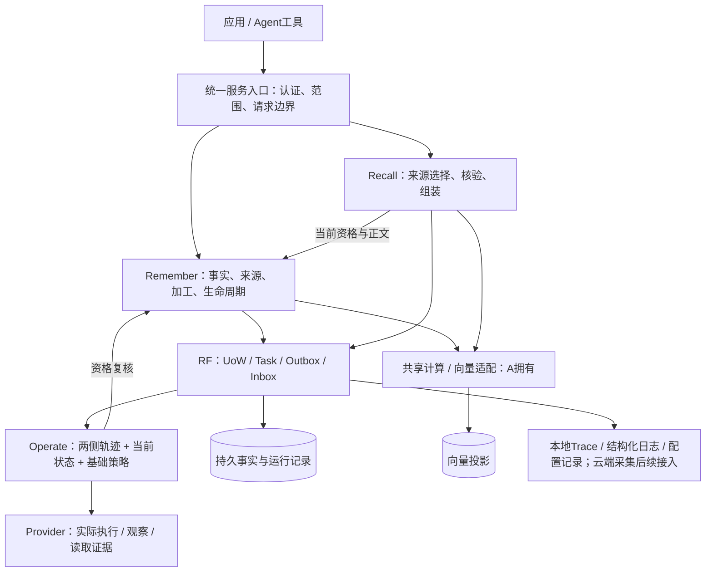

# 02 总体架构与模块职责

## 结构

这是逻辑图，不要求每个框成为微服务。目标部署在Azure VM上按API、Worker、计算适配器和Provider拆分运行单元；当前已实现单机Python Host/CLI，尚未完成该云部署；构建业务时仍采用端口注入。Observe/Trace传输失败不改变权威业务状态。

## 唯一责任与写入权

| 责任人 | 拥有并判定 | 不代替的职责 |
|---|---|---|
| B | Memory／Source／Artifact／ProjectionState；保存、版本、来源依赖、归档删除和ready | A的向量机制，C的调度结果 |
| A | Recall／ContextPack／候选排除理由／计算及向量操作证据 | B的记忆资格，模型生成答案 |
| C | 输入视图、策略、计划、Action、观察关联、对账结论 | 外部执行事实，不回收唯一权威正文 |
| RF | 身份、UoW、Task、Attempt、Outbox、Delivery、Inbox、恢复登记、诊断与维护记录 | 记忆有效、压缩质量、上下文正确、动作成功 |
| Provider | 物理存储、向量查询或层级执行及真实状态证据 | P3权限与领域状态 |

## 依赖规则

公共契约不导入任何领域契约。Remember契约只依赖公共；Recall与Operate契约可引用Remember的MemoryRef、来源等只读类型。B在实现里消费A的EmbeddingPort／VectorPort；为避免循环，B自身公共契约不反向导入A。Host和应用装配层负责将实现连接起来。

共享表由RF提供同一UoW访问，领域Repository分别维护字段语义；禁止A/C绕过B的读取与final_guard接口查改记忆。ProjectionResult.verified是A的机制证据，B确认来源、版本、分块全部合格后才设置ready。

## 框架采用

- LangMem Core由B适配为ExtractionPort；默认关闭模型自主正式更新／删除，输出候选，经来源和质量校验再提交。
- LlamaIndex用于Retriever、融合、后处理的设计参考。P3的公共字段和ContextPack不继承框架Node类，不引入完整答案生成引擎。
- controller-runtime借鉴当前状态驱动的Reconcile；C用Python实现，业务Task/Memory不默认映射为K8s CRD。
- SQLite／Milvus／ONNX是F1/B1目标真实依赖；Temporal仅独立实验，不与Task形成两个权威调度器。
- 当前自有Trace/Span与持久传播借鉴OTel和W3C标识格式，SDK/OTLP和跨HTTP传播尚未接通；Prometheus/Azure Monitor保留为后续指标与集中监测选型，当前先交运行状态查询。关键事实与维护记录独立持久化。

## 扩展点

源文档获取、候选提取、向量机制、执行端和授权适配均从端口替换；替换前跑同一消费者契约及真实集成验收。P1预测输出进入C的既有约束和执行路径，不绕过授权或另造一套恢复系统。
