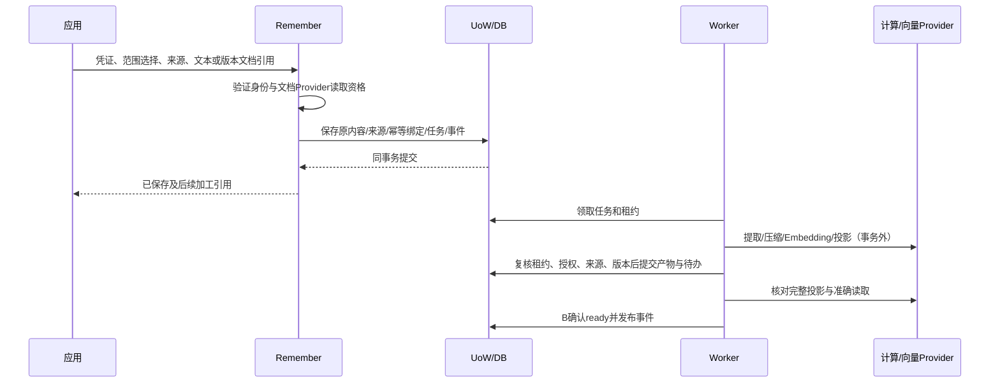
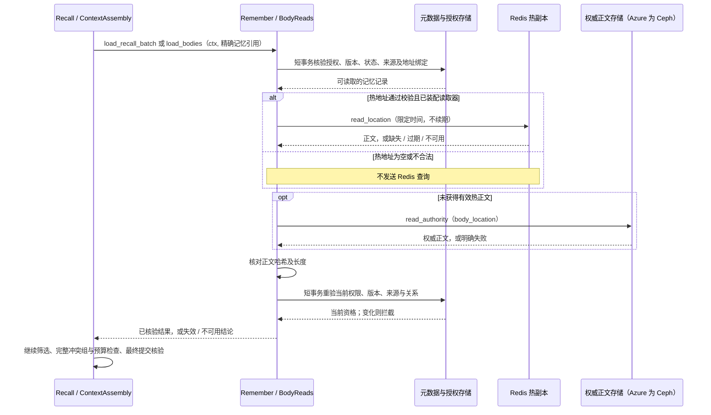
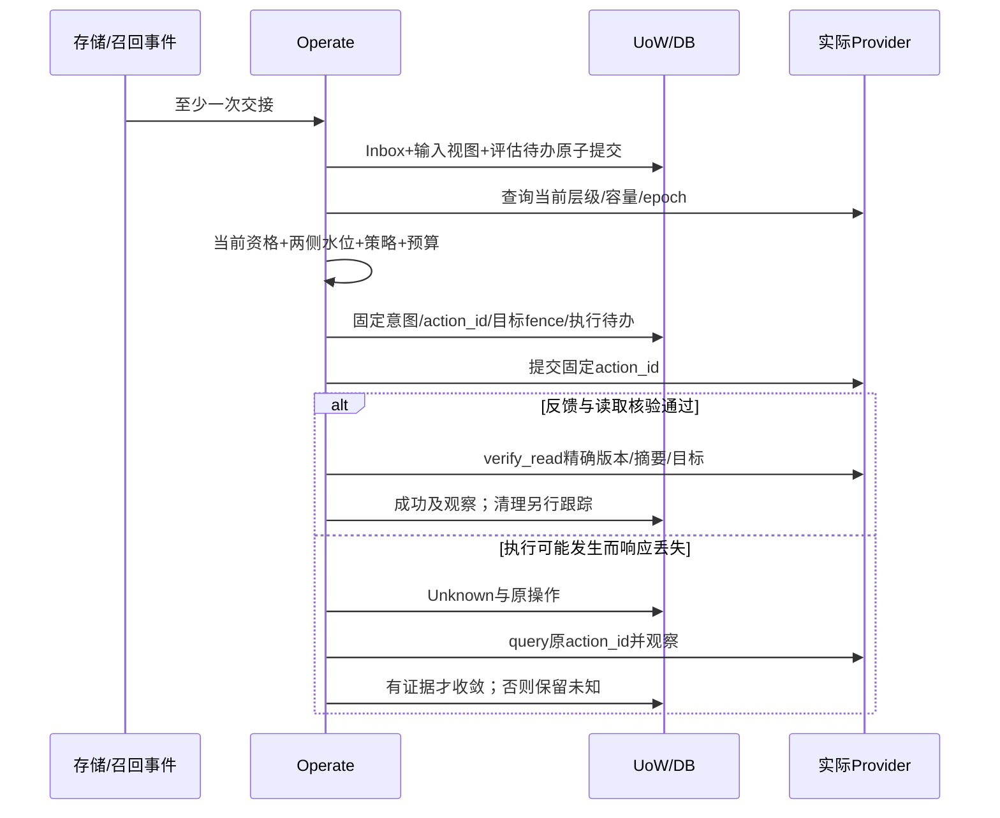

# 03 三流程与异常时序

2026-10-08 更新：Recall 正文读取已接入“有合法热地址先读 Redis，不可用再读权威正文”的公共入口，详见[冷热地址读取契约](../development/17_Recall冷热地址读取契约.md)。新增时序描述当前源码，不表示云端已经发布或验收。

2026-10-01 Working / Lite 阶段记录保留在[流程图](Working与Milvus_当前流程.svg)、[开发指南](../development/Working与Milvus_本地开发指南.md)和[本地 Lite 验收](../development/Working与Milvus_验收报告.md)；其环境和测试结论仅适用于当时阶段。

## Remember：确认原内容，再异步加工

文本原文直接进入可恢复事实存储。文档引用由白名单Provider获取指定版本，核对原文件摘要，得到SourceAcquisition；可靠接收后才给已保存回执。解析使用已保存原文件，不重新读取可能变化的远程“最新版”。解析、提取、压缩和索引各自有持久阶段及结果，失败不删除已确认原文。

每项候选绑定SourceRef和片段定位；来源文本匹配不自动证明语义推断成立。否定、引述、假设、数字与条件进入质量用例。压缩Artifact记录原／输出摘要、实际保存字节、质量规则、正文及原文关系；只有当前来源有效且质量通过的产物参与读取。

## Recall：统一选择与有证据的交付

1. 认证及限制范围；固定recall_id、幂等绑定、截止和策略版本。
2. `sources=working/long_term/both`严格使用指定来源；`auto`由A选择并记录原因。F1采用确定性规则：有会话／任务上下文时选择both；没有时选择long_term。来源故障后不修改selected_sources掩盖缺失。
3. Working 与长期均按所选来源执行 Query Embedding／向量检索；scope、模型空间和来源过滤先于 Top K 截断。候选经 B 核验 generation、版本、正文指纹及当前资格后，精确加载正文。索引 pending/failed 与正常空分别处理。按已知 ID + 精确版本直接读正文是独立能力，不能用作语义 Recall 的绕行路径。
4. 核验后的候选按范围内的memory_id+version合并，保留独立来源；固定RRF k=60、一基排名。相关性不是事实真实性。
5. 按完整条目／完整冲突组装入预算；正文、引用和冲突说明全部计数。首组超长继续尝试后组；全部合格组装不下返回BUDGET_TOO_SMALL，不返回empty。
6. 最终UoW中通过B.final_guard与RF当前授权检查，再保存实际渲染结果、终态及packed事件。事务中不调用远程Provider。
7. 实际交给传输层后记录delivered；网络失败不回滚已提交事实，不声称客户端已阅读或模型已采用。

首次读取和历史结果获取使用同样授权规则。`GET .../result`不重新检索；原Pack任一条目、来源或冲突组失效时返回RESULT_INVALIDATED和新请求提示，不裁剪后冒充原结果，不替换成新版正文。全部仍有效时才返回原Pack；维护诊断可以保留历史引用，但不能绕过正文权限。

### 当前正文读取时序

上面第 3 步中的候选加载、冲突成员补读，当前由 `ContextAssembly` 调用 `load_recall_batch`；正式正文读取调用 `load_bodies`。两者均进入下面的公共流程。向量检索负责找到记忆引用，这个时序负责按引用取回正文。“热地址”是记忆记录的 `cache_location`，“冷地址”是 `body_location`，在 Azure 中分别指 Redis 热副本和 Ceph 权威正文。

Redis/Ceph 正文网络读取在元数据事务外进行。缓存读取失败可以回源，但授权失败、主记录损坏、总期限耗尽不能当作普通缓存未命中。批量加载还会在返回前整体复核；直接正文读取返回实际 `path/location`。

普通读取不填充缓存、不续期、不写回地址；热地址为空时，即使 Redis 中碰巧有相同哈希，也不能绕过本条记忆的地址登记。地址发布和升降温继续由 Remember/Operate 的显式写入与维护流程负责，Recall 读取不经过 Operate 执行器。成功读取仍按原 `recall.access` 规则计热并去重。

网页展开“来源原文”使用独立的 `SourceAccess.read`。记忆正文热命中不意味着整次网页请求完全不访问 Ceph。

## Operate：自动执行与真实核验

存储事件、实际读取和周期评估都触发C；无新Recall也要能处理存储变化。候选、read、packed和delivered分别记录；一次recall对同一记忆版本的成功read只计一次热度，后续阶段不重复累加，模型采用不作为前置条件。当前执行 Ceph 权威正文 / Redis 热副本两层调度；warm 仅保留历史兼容，不产生新的温层动作。keep和defer只保存决策，不生成无用外部动作，详见[现行总流程](../../flow_architecture.md)。

Provider操作身份和实例标识必须可查。发生实例变化或404不能直接推断旧动作未执行；不能仅因观察“看起来已在目标层”就归因原动作成功。目标状态、对应内容和读取证据都核对，旧副本清理状态单独记录。

## 横切异常

| 注入位置 | 必须保持的事实 | 恢复路径 |
|---|---|---|
| 模型返回后、提交前退出 | 原输入和原任务存在 | 检查批次提交标记及当前资格，必要时重新提取，正式提交去重 |
| 事实提交后、事件投递前退出 | 事实与Outbox同时存在 | 扫描未确认Delivery，重投原event_id |
| 消费效果提交后丢Ack | Inbox与效果同事务 | 重发后返回确认，不再次计热 |
| Worker失租后迟到 | 新租约和新revision不可被旧结果覆盖 | 旧提交拒绝；远端残留由领域对账清理 |
| Milvus中断 | 来源覆盖保持真实 | Working 与长期语义检索均依赖所选向量后端；按实际来源失败返回，不改用词法或直接列举伪装成功 |
| Redis地址为空／失效／内容不符／限时内不可用 | 权威正文和当前资格仍是依据 | 空地址不查Redis；其他缓存失败安全回源，不填缓存、不改地址 |
| 正文读取中撤权／删除／来源或关系改变 | 已取到字节不等于可以交付 | 返回前复核并拦截；不能以缓存命中绕过当前资格 |
| 权威正文不可用／请求总期限耗尽 | 未成功读取就不能记成功read | 保留失败或不可验证结论，不伪装正常空结果 |
| final_guard前发生删除／撤权 | 当前状态决定资格 | 重组完整安全结果或拒绝；不返回旧Pack |
| 原结果提交后HTTP中断 | Pack及packed事实保留 | 查询原请求并在重取正文时重新核验 |
| Provider执行后丢响应 | 原动作和已有有效读取能力保留 | Unknown，查原ID，不生成冲突新意图 |
| 进程重启 | 已保存配置、任务与未决动作 | 扫描后分类恢复，启动不代表任务完成 |

详细故障设计使用[验收场景目录](../acceptance/01_验收场景与证据要求.md)。冷热地址改造的已执行范围见[读取契约](../development/17_Recall冷热地址读取契约.md)，Working / Lite 历史范围见上方报告；两者均不能证明本页所有设计场景已通过真实云端验收。
