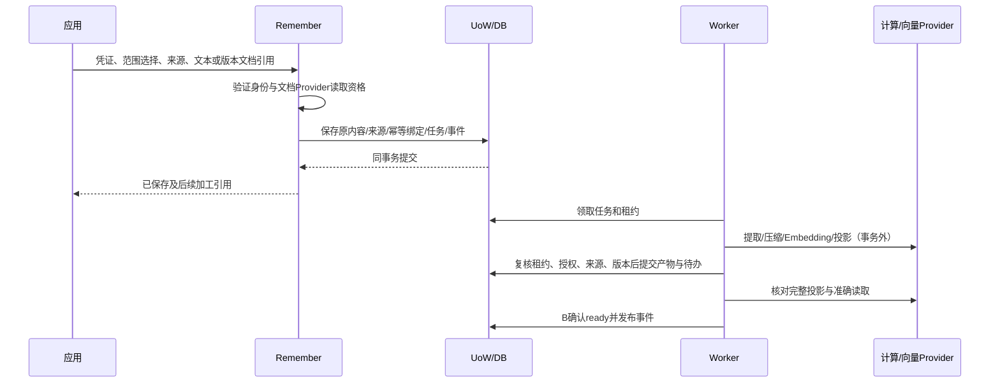
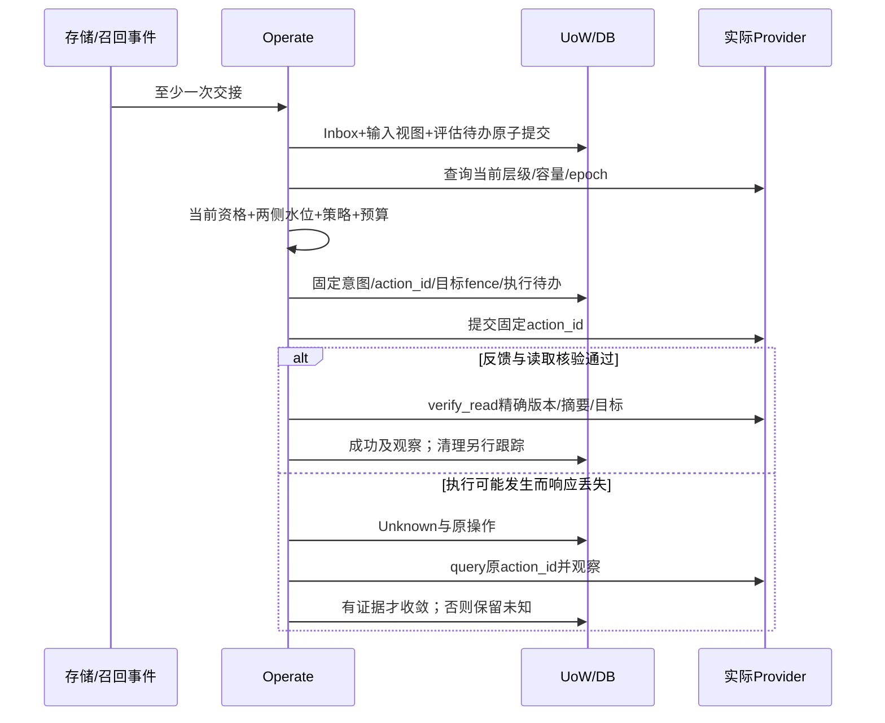

# 03 三流程与异常时序

## Remember：确认原内容，再异步加工

文本原文直接进入可恢复事实存储。文档引用由白名单Provider获取指定版本，核对原文件摘要，得到SourceAcquisition；可靠接收后才给已保存回执。解析使用已保存原文件，不重新读取可能变化的远程“最新版”。解析、提取、压缩和索引各自有持久阶段及结果，失败不删除已确认原文。

每项候选绑定SourceRef和片段定位；来源文本匹配不自动证明语义推断成立。否定、引述、假设、数字与条件进入质量用例。压缩Artifact记录原／输出摘要、实际保存字节、质量规则、正文及原文关系；只有当前来源有效且质量通过的产物参与读取。

## Recall：统一选择与有证据的交付

1. 认证及限制范围；固定recall_id、幂等绑定、截止和策略版本。
2. `sources=working/long_term/both`严格使用指定来源；`auto`由A选择并记录原因。F1采用确定性规则：有会话／任务上下文时选择both；没有时选择long_term。来源故障后不修改selected_sources掩盖缺失。
3. Working通过B读取；长期经Query Embedding／向量检索获取版本引用，再通过B精确加载正文、来源及冲突。查不到正文与正常空分别处理。
4. 核验后的候选按范围内的memory_id+version合并，保留独立来源；固定RRF k=60、一基排名。相关性不是事实真实性。
5. 按完整条目／完整冲突组装入预算；正文、引用和冲突说明全部计数。首组超长继续尝试后组；全部合格组装不下返回BUDGET_TOO_SMALL，不返回empty。
6. 最终UoW中通过B.final_guard与RF当前授权检查，再保存实际渲染结果、终态及packed事件。事务中不调用远程Provider。
7. 实际交给传输层后记录delivered；网络失败不回滚已提交事实，不声称客户端已阅读或模型已采用。

首次读取和历史结果获取使用同样授权规则。`GET .../result`不重新检索；原Pack任一条目、来源或冲突组失效时返回RESULT_INVALIDATED和新请求提示，不裁剪后冒充原结果，不替换成新版正文。全部仍有效时才返回原Pack；维护诊断可以保留历史引用，但不能绕过正文权限。

## Operate：自动执行与真实核验

存储事件、实际读取和周期评估都触发C；无新Recall也要能处理存储变化。候选、read、packed和delivered分别记录；一次recall对同一记忆版本的成功read只计一次热度，后续阶段不重复累加，模型采用不作为前置条件。语义层级普通调整仅cold↔warm↔hot相邻移动；keep和defer只保存决策，不生成无用外部动作。

Provider操作身份和实例标识必须可查。发生实例变化或404不能直接推断旧动作未执行；不能仅因观察“看起来已在目标层”就归因原动作成功。目标状态、对应内容和读取证据都核对，旧副本清理状态单独记录。

## 横切异常

| 注入位置 | 必须保持的事实 | 恢复路径 |
|---|---|---|
| 模型返回后、提交前退出 | 原输入和原任务存在 | 检查批次提交标记及当前资格，必要时重新提取，正式提交去重 |
| 事实提交后、事件投递前退出 | 事实与Outbox同时存在 | 扫描未确认Delivery，重投原event_id |
| 消费效果提交后丢Ack | Inbox与效果同事务 | 重发后返回确认，不再次计热 |
| Worker失租后迟到 | 新租约和新revision不可被旧结果覆盖 | 旧提交拒绝；远端残留由领域对账清理 |
| Milvus中断 | 来源覆盖保持真实 | Working独立可用时允许有说明的降级，否则失败 |
| final_guard前发生删除／撤权 | 当前状态决定资格 | 重组完整安全结果或拒绝；不返回旧Pack |
| 原结果提交后HTTP中断 | Pack及packed事实保留 | 查询原请求并在重取正文时重新核验 |
| Provider执行后丢响应 | 原动作和已有有效读取能力保留 | Unknown，查原ID，不生成冲突新意图 |
| 进程重启 | 已保存配置、任务与未决动作 | 扫描后分类恢复，启动不代表任务完成 |

详细故障测试使用验收场景目录；本轮没有执行这些运行测试。
