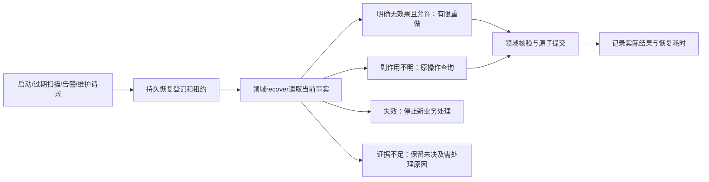

# 03 追溯检测与恢复接入

## 记录的四个层次

| 层次 | 保存内容 | 可用于什么结论 |
|---|---|---|
| 领域事实 | Memory、Source、Artifact、Recall、Action、观察证据 | 是否保存/有效/交付/实际生效 |
| 运行事实 | Task、Attempt、Lease、Delivery、Inbox、Recovery | 谁领取、如何重试、是否确认、凭什么恢复 |
| 技术可观测数据 | Trace、结构化日志、Metrics | 阶段耗时、依赖异常、积压和资源 |
| 必要维护记录 | 操作者、对象、scope、原因、配置版本、受理与结果 | 配置/删除/恢复可追踪，不建设专用审计平台 |

技术Trace可能因保留清理或写入失败而缺失；当前本地实现不采样，未来导出可配置采样，但不能让关键事实依赖它保存。DiagnosticRecord只保存关联和阶段；正文从业务API按权限读取。保留策略按类别配置，必要记录与业务正文的删除要求分开。

## 各组必须接入

- B记录原输入、形成批次、来源片段、每个加工阶段、投影核验、版本及删除影响；提取器失败仍保留已保存输入。
- A记录来源选择、候选、排除、实际读取、冲突组、预算、最终提交及传输交付。未入Pack不等于未实际读取；查询/读取/交付各有明确事件。
- C记录两侧输入水位、当前资格、策略版本、资源观察、决策、意图、Provider实例/操作、读取证据和清理状态。
- RF记录request/operation/task/attempt/event/action关联、租约变化、恢复判定证据、配置及人工维护记录。

## 检测要求

当前先提供运行状态查询：能力健康区分保存、Working、长期检索、Context和调度；保留Worker最后心跳、任务及事件待办、租约过期、投影未就绪、Unknown与恢复记录，使问题可定位。按用户最新要求，暂不建设指标体系、指标面板或指标达标门禁。

后续启用指标时，标签只用有限类别/流程/结果/依赖；业务ID进入受控日志和Trace。不要默认逐tenant打无限标签。目标跨网络OTel传播遵循W3C；当前仅本地及持久任务关联，认证仍由可信凭证提供；外部traceparent不能扩大权限。

异常记录关联Owner、影响能力、查询方式、允许动作和恢复判据。后续告警复用这些信息；当前不引入告警阈值验收。监测缺失显示unknown/partial，不能显示绿色正常。

## 恢复闭环

RF只安排恢复和保护租约；B判断记忆版本/来源，A判断是否允许重新交付，C判断动作是否发生。Recall是短请求：重启后有已提交Pack保留事实；无已提交结果则failed/EXECUTION_INTERRUPTED，调用者提交新请求，不能拿过期缓存冒充当前结果。

维护入口通过部署身份、内部命令或已有运行设施接入TaskPort.request_recovery。必须提供reason、原对象和expected_revision；运行中有效租约拒绝重复接管。恢复权限不授予跨租户正文读取或人工单条升降层权。维护暂停新工作可以是部署配置，但不停止原未知动作对账和失效清理。

## 已有可复用示例与验证入口

1. 保存样例：`runtime/foundation/sample.py`与`scripts/p3/demo_foundation.py`演示业务记录+任务+事件同事务，故障验证见`tests/runtime/p3`。
2. 读取样例：`recall/basic/service.py`与`tests/runtime/flows/test_recall_pipeline.py`覆盖范围、阶段、截止、最终授权与删除变化。
3. 副作用样例：`operate/basic`及`tests/runtime/flows/test_flows.py`覆盖执行后丢响应、原操作对账、实例丢历史时保留Unknown。

样例使用正式公共机制，但业务对象明确标为工程验证。它们通过不代表真实提取、检索质量或实际迁移通过。
