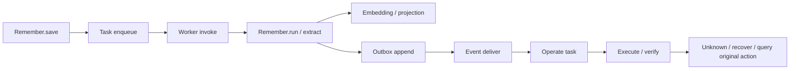

# 日志、Trace 与健康检测

2026-09-20基线更新：当前按PRD V1.3开发，见[基线与租户增量](../../../contracts/p3/prd-baseline.yaml)。下文V1.2条款及批次说明保留原出处，不代表当前仍采用旧版本，也不证明V1.3增量已经实现。

交付范围：现有 P3 单机底座和三个基础流程。以 PRD V1.2 为需求依据；本批补运行可诊断性，不引入容器、指标平台或新的身份系统。公共实现属于 RF，各流程负责人负责阶段含义和业务结果。

**后续增量：** 默认 Embedding 已接入原生 BGE，native 模式健康检查执行真实 Query/Passage 推理。本页本地词法探测说明适用于显式 lexical 测试模式。见[真实 Embedding 接入](07_真实Embedding接入与旧实现清理.md)。

## 1. 入口和代码归属

| 入口 | 职责 |
|---|---|
| `runtime/foundation/telemetry.py` | 结构化节点日志、父子 Span、独立持久化、脱敏、保留与分页 |
| `runtime/foundation/diagnostics.py` | 当前授权校验、按 trace_id 查询及关联持久任务和事件状态 |
| `runtime/foundation/storage.py` | 在实际事务结束后记录 committed 或 rolled_back |
| `runtime/foundation/tasks.py` | 将生产节点上下文保存在 Task；处理、恢复和结果应用分别追踪 |
| `runtime/foundation/events.py` | 将生产节点上下文保存在 Outbox；追踪消费、确认及失败 |
| `runtime/flows/health.py` | 有截止时间的依赖探测、Worker 活性、任务和未知动作检测 |
| `runtime/flows/host.py` | 注册三流程、提供方追踪和实际本地探测，维护 Worker 心跳 |
| `runtime/flows/__main__.py` | `health`、`trace` 查询和 JSONL 导出 |

这些功能已在 Python Host 和 CLI 接通。没有新增 HTTP 服务、Azure 资源或监控面板，原有 HTTP 契约也未被宣称为已上线。

## 2. 一个 trace_id 能看到什么

一个入口请求及其派生后台处理共享 trace_id。每次函数执行获得新的 span_id；重试不会覆盖上次 Span。request_id、operation_id、task_id、event_id、memory_id、recall_id、action_id 通过上下文和脱敏摘要关联。



Task 保存生产节点的 span_id，Worker 从持久记录恢复父节点；Outbox 同样保存生产上下文。ContextVar 负责同一进程内异步调用的父子关系。身份始终来自服务端可信上下文，trace_id 不能授权。

独立的 Remember 请求和后来的 Recall 请求拥有不同 trace_id；它们通过 memory_id/version 关联。一次 Recall 的检索、ContextPack 和派生 Operate 工作共享该 Recall 的 trace_id。不会把所有用户或所有会话强行合成一条 Trace。

查询结果包括：

- `records`：当前页日志，按数据库 sequence 排序；含 parent_span_id，可还原调用树。
- `overview`：保留范围内的节点数、失败节点数及缺少结束记录的节点。
- `durable_facts`：当前已提交 Task 和 Delivery 状态，每类最多 100 条并声明是否截断；它们独立于日志保留期。
- `next_after`：下一页游标；`coverage=retained_records_only` 明确保留范围。

只有 started 的节点表示“仍在运行或已中断”，不能推断失败，更不能推断成功。丢响应时，executor.submit 可以有失败记录，Operate 仍可通过原 action_id 查询后收敛成功；原失败记录不被删除。

## 3. 节点和输出规范

日志 schema_version 为 1，实现以 `Telemetry.emit` 为准。每条包含 UTC 时间、service、instance_id、process_id、trace_id、span_id、parent_span_id、request_id、operation_id、node、phase、level。

| phase | 含义 |
|---|---|
| started | 已进入节点，含输入摘要 |
| returned | 节点返回，含输出摘要和 elapsed_ms；不等同于业务成功 |
| failed | 出现异常或投递失败，含 error_code、error_type；未捕获异常记录堆栈位置 |
| cancelled | 协作式取消；不意味着外部动作已撤销 |
| committed | SQLite 事务实际提交，附写入命名空间和数量 |
| rolled_back | SQLite 事务回滚；节点此前返回不构成持久成功 |

业务 outcome、state、effect_status 单独保留。例如 Degraded 的 Recall 是 returned，但输出 outcome 为 degraded；Task Handler 返回并不意味着 Action succeeded。

Remember 覆盖保存、来源及资格读取、纠错、生命周期、删除、提取、投影、清理和恢复。Recall 覆盖入口、阶段切换、Embedding、向量检索、正文加载/资格核验、结果提交和历史结果读取；rank/assemble/finalize 记录候选数、排名摘要、选中数、预算及覆盖。Operate 覆盖策略、任务、动作意图、提交、反馈核验、观察和对账。公共层覆盖任务、事件和事务节点。

`recall.stage` 是状态切换节点，它的耗时是记录该切换的耗时，不能当作上一阶段算法耗时；依赖调用和 retrieve 等包围节点拥有自身实际耗时。

### 具体内容与隐私

日志默认不复制原始对话、正文、模型提示词、API Key、向量数组或异常 message。正文保存字符长度；候选和结果保留正式对象 ID、版本、状态、分数、数量等白名单元数据。异常保留错误码、异常类型、文件名、函数和行号，不保存局部变量和源码行。

单条上限 32 KiB，递归深度和数组摘要数量有上限；过大时标记 detail_truncated。需要原始业务内容时，使用日志中的对象 ID，通过已有授权读取接口获取当前允许的内容。删除后不能从技术日志重新读取旧正文。

SAFE_FIELDS 是公共代码中的白名单。新增字段须评审其敏感性；禁止在 ID、reason_code 或其他白名单字段中塞正文、密钥、外部服务任意错误文本。

## 4. 存储和保留

默认配置由 Foundation/ThreeFlows 构造参数管理：

| 参数 | 默认值 | 说明 |
|---|---|---|
| log_path / CLI --log-db | 与 p3.db 同目录的 p3.logs.db | 必须与业务数据库分开 |
| log_retention_days | 14 | UTC 时间保留窗口 |
| log_max_records | 200000 | 全库记录数量上限，不是租户配额 |

日志库使用 SQLite WAL、synchronous=FULL，独立连接提交。业务事务回滚不会删除失败日志。支持同机多个进程写入，按 trace_id、发起主体、scope、sequence 建索引。

启动、查询及每 100 次写入清理过期/超量记录。两次写入清理间单进程最多暂存额外 99 条，多进程并发有相应浮动。清理按记录执行，可能使 Trace 不完整；结果始终声明 retained_records_only。删除腾出页面供后续复用，不承诺文件立即缩小；本批不自动 VACUUM，也不提供容量 SLA。

JSONL 是授权查询的导出格式，不维护另一份无限增长的日志文件。导出文件由操作者保管，数据库保留策略不会自动删除已导出的文件。

部署方须将数据库及 WAL/SHM 文件放在服务账户控制的目录；本地 CLI 权限校验不替代操作系统文件权限。本批未引入透明加密或远端不可篡改日志库。

日志写入中断时不把已成功业务强行回滚或重新执行外部动作。进程 stderr 输出固定错误码 P3_LOG_WRITE_FAILED；累计丢失数进入健康结果，readiness 降为 not_ready。累计值为当前进程生命周期，重启后的完整性不能据此证明。健康状态供 Host/维护工具使用，本批没有 HTTP admission gate 自动拒绝请求。

## 5. 健康检测的实际边界

| 检测项 | 本批实际执行 |
|---|---|
| liveness | 当前进程可以响应；不检查外部依赖、不触发自动重启 |
| database | 打开已有 SQLite、读取 schema、写入探针并回滚 |
| logs | 独立日志数据库读写探针及当前进程丢日志计数 |
| executor | 执行端数据库读写探针；cold/warm/hot 各目录临时文件写入、fsync、读回、清理 |
| extraction | LiteralExtraction 固定输入实际调用；真实模型未注册探测时 unknown |
| embedding | 默认原生 BGE 实际执行固定 Query/Passage；显式 lexical 模式用词法样本 |
| vectors | SQLite 模式检查实际可访问性；Milvus 配置检查服务调用与集合存在性，不等于完整检索验收 |
| tokenizer | 实际计数固定中文样本 |
| reranker | 已加载/未加载/关闭状态检查；未启用为 disabled，不在每次探针运行完整推理 |
| Worker | 两类 Worker 的持久心跳；超过 max(10 秒, 2×lease_seconds) 视为不可用 |
| 运行异常 | 当前授权范围内的任务积压、最老任务年龄、过期租约、未确认事件、attention 任务及 Unknown 动作 |

每个依赖默认截止时间 2 秒，可设为 (0,10]；依赖并发探测。SQLite 自身锁等待上限 250ms。自定义异步探针必须支持协作取消，不得吞掉取消或执行无界阻塞操作。后台线程中的同步探测被上层超时后可能仍短暂执行，探针不得操作真实业务资源。

readiness 只表示数据库和日志存储允许服务接收请求；Worker 状态及各能力另行报告。向量故障不影响 liveness，也不必阻断保存，但 long_term 会 degraded。没有 Worker 时，保存仍可入队，scheduling 显示 degraded。

查询需 maintenance:diagnose，并重新校验当前身份。Trace 仅允许发起主体且 home_scope 相同的查询；知道另一个用户的 trace_id、拥有某条共享记忆权限，都不等于可读取对方整条 Trace。健康状态的任务和动作信息按对象授权过滤；Worker 是共享基础设施信息。

健康检测不调用恢复 Handler、不重启 Worker、不重试 Action。租约扫描与原有恢复机制负责触发，领域 Handler 判断重做、查询、停止或人工处理。恢复决定继续由 Task、Inbox、Action、业务版本和执行端证据支持，不能靠日志文字判断。

## 6. 使用方式

沿用已有运行目录和 P3_API_KEY，先设置 PYTHONPATH=src。全局参数放在命令名前：

```text
python -m aether_agent_memory.runtime.flows --db <运行目录>/p3.db --cache-root <运行目录>/cache health
python -m aether_agent_memory.runtime.flows --db <运行目录>/p3.db --cache-root <运行目录>/cache trace --trace-id <32位ID> --limit 100
python -m aether_agent_memory.runtime.flows --db <运行目录>/p3.db --cache-root <运行目录>/cache trace --trace-id <32位ID> --after <next_after> --jsonl
```

正常业务命令保持原 stdout 结果格式，stderr 补充 trace_id 和 request_id。Python 调用方直接保存服务端 ctx.trace_id；不是让调用者任意自报身份。JSONL 最后一行含 page 元数据，next_after 不为空时需继续导出。

当前是本地 Span 存储和查询，没有接 OpenTelemetry SDK/OTLP、Application Insights 或 Azure Monitor。将来接入这些系统可复用 ID 和节点边界，但需要单独实现传播/导出并验证；本批不声称已经完成分布式跨网络追踪。

## 7. 团队接入及验收

流程类通过 `@observed(component)` 自动追踪显式 ctx 方法；依赖在 Host 中 attach_provider。三位负责人新增处理节点时保留 ctx，不另起随机 trace_id，不直接 print 输入或异常。带 tx 的方法 returned 只是返回，最终提交看 committed 及持久事实。

真实提供方另行通过 `app.health.register(name, async_probe, replace=True)` 注册只读或隔离探测。async_probe(ctx) 返回 state；外部返回的任意 reason 不直接写入日志。健康检查不能调用有副作用的模型写入、向量投影或迁移动作。

测试覆盖跨重启追踪、Unknown 原动作对账、跨用户/租户查询隔离、回滚仍有失败日志、进程 kill 只留下未完成节点、异步取消、依赖中断与降级、探测超时、心跳过期、日志故障与保留清理。完整回归入口仍是 scripts/p3/validate_flows.py。

排障顺序：拿到 trace_id → 查失败/未结束节点 → 看节点输入输出摘要 → 查看 durable_facts 和对象当前版本 → 查看 Worker/依赖健康 → 根据领域恢复规则操作 → 用新恢复尝试的 Span 核验收敛。保留原失败证据。
