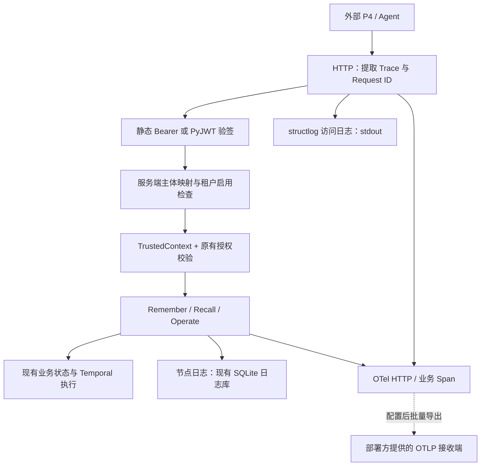

# P3 租户入口、日志和 Trace 接入说明

2026-10-02：当前本地 P3 租户状态、节点日志和页面 Trace 数据已改存 PostgreSQL。Keycloak 原有账号库保留。当前存储和验收见 [PostgreSQL 接入说明](16_PostgreSQL接入与数据迁移.md)，下文保留阶段历史。

更新日期：2026-10-01。本文保留第一阶段三项组件接入及当时的测试记录。

**后续进展：同日已补充 Keycloak、专用 PostgreSQL 和网页 PKCE 登录。当前身份平台实现与测试结果见 [Keycloak 本地接入与验证](13_Keycloak本地接入与验证.md)。下文“本轮”及 97 项测试指第一阶段，不代表后续版本仍未部署身份平台。**

## 1. 本轮改了什么

沿用现有 P3 公共底座，在 HTTP 身份入口接入 PyJWT，在请求日志接入 structlog，在节点追踪接入 OpenTelemetry SDK 和可选 OTLP/HTTP 导出。Remember、Recall、Operate 共用这套入口和上下文。

| 组件 | 为什么采用 | 本轮实际实现 | 不包含的能力 |
|---|---|---|---|
| PyJWT（带 crypto） | 复用签名、有效期和签发方验证，不自行实现 JWT 密码学 | 验证 JWT；从受信任 JWKS 获取公钥；验签后按服务端配置映射 Principal | 登录页面、账号注册、令牌签发和刷新、单个 JWT 撤销列表 |
| structlog | 用统一 JSON 字段关联一次请求，便于机器采集 | 每个 HTTP 请求输出一条访问日志，包含关联 ID、路由模板、状态和耗时 | 日志平台、长期检索服务、告警看板 |
| OpenTelemetry | 复用标准 Trace/Span 和 W3C 传播，允许更换追踪后端 | HTTP Server Span、业务节点 Span、共享 ID、可选批量 OTLP/HTTP protobuf 导出 | Collector/Jaeger/Tempo 部署，以及所有外部服务的端到端传播 |

P3 的租户注册、权限规则、业务数据过滤仍由原有身份与授权代码负责，PyJWT 不代替多租户隔离。已有静态 Bearer 凭证继续可用。

本轮没有新增 P2 数据库。身份配置及身份状态继续使用现有 P3 配置文件和 P3 业务库；节点日志继续使用现有独立日志库。第一阶段未新增 PostgreSQL、Keycloak、Loki 等服务；后续已新增 Keycloak 及其专用 PostgreSQL，仍未新增 Loki。Temporal 的执行和恢复实现未修改。

## 2. 一次请求如何经过公共底座




1. 外部 Agent 向 P3 HTTP API 发送 Bearer 凭证，可携带 `traceparent` 和 `X-Request-ID`。
2. HTTP 中间件提取合法的 W3C 上下文；无上下文或格式不合法时创建新的 Trace。同时验证或生成 Request ID。
3. 认证入口先匹配已有静态凭证。仅在静态认证返回 UNAUTHENTICATED 时尝试 JWT；不会绕过租户禁用或权限拒绝。
4. JWT 先按配置的 issuer、算法和 JWKS 公钥验签，再检查 exp、aud、iss、sub。令牌中的 tenant_id、role、permissions 不用来授予权限。
5. 通过服务端的 `(issuer, subject) → principal_id` 映射，取得 P3 中登记的租户、用户和权限，构造 TrustedContext。
6. 业务节点复用 TrustedContext，继续通过原有授权校验访问数据；节点日志和 OTel Span 共享 ID。
7. HTTP 响应带回 `X-Request-ID` 和 `X-Trace-ID`，控制台输出 JSON 访问日志；如已配置 OTLP，SDK 批量发送追踪数据。

例如，JWT 的 subject 对应租户 A 的主体，即使令牌中额外写了 tenant_id=B，P3 仍按服务端租户 A 的配置执行。知道租户 B 的 Trace ID，也不能据此查询 B 的节点日志。

## 3. 配置身份入口

可参考 [JWT 身份配置示例](../../../configs/identities.jwt.example.yaml)。示例使用保留的无效域名，必须替换后才能接入真实签发方。

- 在 tenants 中注册业务租户；在 identities 中登记 Principal、home_scope、permissions、auth_epoch。
- 在 jwt_issuers 中配置 issuer、jwks_url、audience、algorithms，以及 subject_mappings。
- 仅采用 JWT 的主体可以省略 credential_sha256；原有静态凭证主体可以保留该字段。
- 将服务配置中的 identity_file 指向实际部署身份文件。不要把私钥或明文 Bearer 凭证写入仓库。

以示例为例，签发方颁发的 JWT 必须含有对应的 iss、aud=aether-p3、sub=external-agent-account-a、尚未过期的 exp；Header 带有被配置允许的 alg 和匹配公钥的 kid。P3 将它映射为 p4_agent_a，再使用该主体的 tenant_a 范围及权限。

P3 负责业务身份入口和授权，第一阶段没有提供签发 Token 的接口。后续本地方案已使用 Keycloak 作为受信任签发方，签发接口由 Keycloak 提供；既有静态 Bearer 仍可用于联调。

### 配置更新和失效规则

| 变更 | 要求及行为 |
|---|---|
| 修改身份文件内容 | 增加 revision；现有服务按 identity_reload_seconds 周期加载，默认 2 秒 |
| 修改权限、范围、凭证、JWT 映射或 issuer 验证策略 | 增加受影响 Principal 的 auth_epoch；旧 TrustedContext 在重新校验时失效 |
| 禁用租户 | 修改 enabled=false 并增加 revision；新认证拒绝，已有上下文在授权复核时拒绝 |
| 重新启用租户 | 除增加 revision 外，还需增加相关主体的 auth_epoch，不能复活旧上下文 |
| 只升级代码，保持旧静态配置不变 | 兼容既有配置指纹，无需仅为新增可选字段强行改变 revision |

auth_epoch 用来隔离旧的 P3 授权上下文，**不是单个 JWT 的撤销列表**。重新启用主体后，如果外部 JWT 仍有效且映射仍成立，它可能重新认证为当前 Principal。需要立即撤销某一 Token 时，应由签发方配合短有效期或另行设计撤销机制。

### 验签和依赖故障

- 只允许配置白名单中的 RS256、ES256；不接受 HS256、none 或令牌指定的任意公钥 URL。
- JWKS 地址来自服务端配置，要求 HTTPS；仅回环开发地址允许 HTTP。取公钥不跟随重定向，不接受私钥材料，并限制响应大小和 key 数量。
- 有效公钥缓存默认 300 秒。未知 kid 可以触发刷新，但命中未过期缓存时，未知 kid 触发的再次成功刷新至少间隔 5 秒；过期缓存仍按到期策略刷新。
- 令牌无效、签名错误、过期、未知主体或未知 kid 返回 401；租户被禁用等授权拒绝返回 403；需要刷新公钥但 JWKS 不可用或公钥集非法返回 503。
- 缓存有效期间可以继续验证对应公钥；缓存过期后不能因为签发方故障而无限沿用旧公钥。JWT 身份接入失败不自动切换成 Mock 成功。

## 4. 日志和 Trace 各记录什么

| 输出 | 内容与位置 | 用途 |
|---|---|---|
| HTTP 访问日志 | structlog 单行 JSON，输出到 stdout | 看哪个请求何时进入、状态和耗时，按 Request/Trace ID 关联 |
| 节点日志 | 继续写入 P3 独立 SQLite 日志库 | 看业务节点开始、返回、异常、实际事务提交及回滚，并按授权查询 |
| OTel Trace | HTTP 父 Span 与业务子 Span；可选发往 OTLP 接收端 | 在追踪系统还原调用关系和耗时 |

访问日志与节点日志记录不同阶段；Trace 用相同的 ID 将这些记录关联起来。本轮没有部署两套集中日志平台。HTTP 根 Span 在 OTel 中，SQLite 日志接口主要返回业务节点记录。

访问日志包含 method、route、status_code、elapsed_ms、request_id、trace_id、span_id；认证成功后补充 tenant_id、principal_id、operation_id。route 使用路由模板，不记录实际路径参数或查询字符串。

默认不采集请求正文、Authorization、完整 URL、异常消息正文。节点日志沿用原有有界摘要与脱敏；OTel 关闭自动异常正文记录，仅记录错误类型及错误状态。调用者不要把秘密填进 Request ID、Operation ID 等标识字段。

本地 Trace 查询继续按当前主体及 home_scope 过滤，需要 maintenance:diagnose 权限；Trace ID 仅用于定位，不能授权。HTTP 使用 GET /p3/traces 和 GET /p3/logs/{trace_id} 查询。原有 CLI 查询保持可用。

已有日志保留策略继续生效，服务默认 log_retention_days=14、log_max_records=200000。stdout 日志的轮转、保存期限和集中检索由部署环境管理。

如果启用共享 Collector，导出的数据已经离开 P3 本地查询接口；Collector 和追踪平台必须另行配置访问控制。本轮没有为外部平台实现租户隔离。

## 5. 开启或关闭 OTLP 导出

服务配置可以添加：

```yaml
# 填写完整的 trace 接收地址，不会自动启动 Collector。
otlp_traces_endpoint: http://127.0.0.1:4318/v1/traces
```

也可以使用标准环境变量：

```powershell
# trace 专用地址必须包含 /v1/traces
$env:OTEL_EXPORTER_OTLP_TRACES_ENDPOINT = 'http://127.0.0.1:4318/v1/traces'
$env:OTEL_EXPORTER_OTLP_TRACES_PROTOCOL = 'http/protobuf'
```

使用 OTEL_EXPORTER_OTLP_ENDPOINT 时，它是公共基地址，HTTP exporter 自动补 trace 路径。显式服务配置地址优先于环境变量。鉴权 Header、证书、超时、压缩等沿用 HTTP exporter 的标准配置。

- 未提供任何出口地址：不发送 Trace 到外部，仍生成关联 ID、节点日志和请求日志。
- OTEL_TRACES_EXPORTER=none：关闭导出。
- 本次出口仅支持 http/protobuf；配置其他协议会在启动时明确报错。
- 采用 BatchSpanProcessor 的有界队列；外部导出失败不回滚业务，也不触发业务重试。未接入独立的丢弃量看板或持久导出队列。
- 服务正常退出时关闭 provider 并刷新待发送 Span；进程强退仍可能丢失未导出的记录。

沿用现有运行方式，在已安装项目依赖的环境中执行 `aether-p3 serve --config <服务配置.yaml>`。服务仍依赖原有 Temporal 配置，身份或追踪组件不会替你启动 Temporal、P2 或模型服务。

## 6. 已验证的情境

新增测试位于 [test_tenant_observability.py](../../../tests/runtime/flows/test_tenant_observability.py)，在独立环境运行，不需要真实 P2 或 Temporal 服务。2026-10-01 本地结果：新增 39 项测试、原有底座与契约 58 项回归，共 97 项全部通过；改动 Python 文件通过 Ruff 和 Mypy。测试出现 1 条第三方 Starlette/httpx 弃用提示，不影响本次通过结果。

| 情境 | 验证结果 |
|---|---|
| 外部 Agent 自报其他租户或更高权限 | 使用服务端映射，不能越权 |
| JWT 错误签名、过期、错误 audience/issuer、未来 nbf、缺 exp | 拒绝认证 |
| 公钥轮换、未知 kid、JWKS 故障、非法或含私钥的 JWKS | 缓存/限频生效，依赖故障时拒绝放行 |
| 租户禁用、重新启用、revision 回退、策略变更 | 配置和 epoch 校验生效，旧上下文失效 |
| 静态 Bearer 继续访问、授权拒绝时存在 JWT 后备 | 兼容旧入口，403/503 不被 JWT 回退绕过 |
| HTTP 父子 Span、SQLite 节点记录、JSON 请求日志 | ID 可关联，跨租户节点日志不可读取 |
| 请求正文、查询参数、异常消息含测试秘密 | 访问日志和导出内容不包含测试秘密 |
| 本地 HTTP 接收端接收 OTLP protobuf | 真正收到导出数据，Trace/Span ID 与本地记录一致 |
| 日志输出失败、初始化失败、Worker 停止失败 | 响应/资源清理符合测试预期，目录锁可释放 |
| 持久化上下文重新加载 | 新执行 Span 继续使用原 Trace 和生产节点父 ID |

本轮不把这些测试表述为真实 P4、身份签发方、P2、集中追踪平台或 Temporal 集群的生产联调验收。测试中的 JWT 使用真实 RSA 签名与验签，JWKS 网络响应由 MockTransport 提供；OTLP 测试使用真实本机 HTTP 收发；执行/恢复底座没有进行完整集群回归。

可复验：

```powershell
python -m pytest tests/runtime/flows/test_tenant_observability.py tests/runtime/p3/test_foundation.py tests/contracts/p3/test_foundation_contracts.py -q
```

## 7. 本轮涉及的文件

| 文件 | 用途 |
|---|---|
| runtime/flows/config.py | JWT issuer、主体映射和可选 OTLP 配置校验 |
| runtime/flows/jwt_auth.py（新增） | JWT 验签、公钥获取和缓存、认证结果映射 |
| runtime/foundation/identity.py | 主体映射持久化、租户授权复核、版本兼容 |
| runtime/flows/observability.py（新增） | structlog 请求日志、HTTP Server Span、导出配置 |
| runtime/foundation/telemetry.py | 将现有节点与 OTel Span 关联，保持本地日志能力 |
| runtime/flows/http.py | 认证适配、关联 ID 响应头、中间件和生命周期 |
| runtime/flows/application.py | 组件装配、身份配置重载、资源关闭 |
| pyproject.toml | 新增 PyJWT、OTLP HTTP exporter 和 YAML 类型检查依赖 |
| scripts/p3/requirements.txt、requirements-flows.txt | 同步独立底座/流程检查所需的组件依赖，避免只安装这些清单时缺包 |
| configs/identities.jwt.example.yaml（新增） | JWT 身份配置样例 |
| configs/p3.*.example.yaml | 注释说明可选 OTLP 和 JWT 配置；补齐生产示例已有服务必需的 temporal 配置字段 |
| tests/runtime/flows/test_tenant_observability.py（新增） | 本轮认证与可观测性场景验证 |

上述 runtime 路径均相对 src/aether_agent_memory。文档同步修订了日志追踪说明、ADR-P3-003 和部署安全页。

## 8. 接入边界

跨 HTTP 入站 W3C 上下文已接通；内部节点和持久任务恢复可以延续 Trace/Span ID。目前持久上下文没有保存完整 tracestate 和 sampling flags，后台恢复可能按新的采样状态记录；也没有自动给每个 P2、模型或其他出站调用注入 Trace Header。因此不能宣称所有跨服务链路已经完整贯通。

租户配额、独立资源隔离、计费、登录管理后台、日志防篡改和集中监控平台不属于本轮新增。日志与 Trace 用于排障；Temporal 执行历史、业务事务、任务/事件/动作记录才是相应执行和恢复的事实依据。
