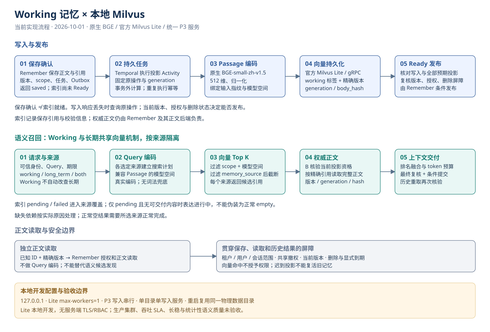

# Working 向量化与本地 Milvus 开发指南

2026-10-04 退役说明：下文保留 2026-10-01 的开发与验收背景，旧 Milvus Lite 启动器、测试脚本和配置已删除，命令不再作为当前入口。新环境从 [当前 Azure 开发入口](../../../README.md#快速启动) 阅读完整 AI 配置指南，在 AKS 连接真实 Azure Milvus；历史报告结论不改写。

日期：2026-10-01。适用：统一 P3 服务、Python 3.13、原生 BGE 与官方 Milvus Lite。本指南中的路径均为可替换示例；命令在 `AgentJYS-main` 执行，环境、模型、数据库和验证记录放 Git 仓库之外。

Working 现已接入与长期记忆一致的模型空间和向量投影机制。真实 BGE + 官方 Lite 的五项必选功能验证均通过，详见[验收报告](Working与Milvus_验收报告.md)。这覆盖本地数据库的真实写入、搜索及进程重启，不代表生产 Milvus 集群验收。



[可编辑 draw.io](../architecture/Working与Milvus_当前流程.drawio) · [PNG](../architecture/Working与Milvus_当前流程.png)

## 流程和状态

1. Remember 同事务保存 Working 正文引用、版本、任务和 Outbox，然后返回已保存。保存成功与向量索引 Ready 是两个状态。
2. Temporal 执行投影任务。共享 Passage 编码器使用 BGE-small-zh-v1.5 生成 512 维归一化向量；向量引用绑定 tenant/scope、`memory_source=working`、精确版本、generation、body_hash 和模型空间。
3. 投影接口幂等写入 Milvus。Remember 核验完整投影、当前版本、授权和删除屏障后发布 Ready。响应丢失时按原操作核对，迟到结果不能复活已删除记忆。
4. `working`、`long_term` 和 `both` 按选择构造各自的向量搜索计划。Working 也执行 Query 编码与向量搜索；来源、范围、模型空间过滤发生在各来源 Top K 截断前。`auto` 有会话/任务时选 both，否则选 long_term。
5. 候选经过 Remember 资格核验、精确正文读取和内容指纹核对，再完成排名融合、预算组包及事务内最终复核。向量库 payload 不替代权威正文，历史结果重取也重新授权和复核。

索引 pending/failed 会计入来源覆盖；仅有 pending 且没有可交付正文时表达进行中，不能报告正常 empty。有效部分结果是否降级取决于实际覆盖与策略。指定 Working 不自动改查长期，也没有词法兜底。已知记忆 ID + 精确版本的授权正文读取独立于语义搜索，不要求为了读正文再做 Query 编码；它不能替代 Recall 的候选发现。

默认 `expires_at` 仍为空。本次未新增默认 TTL；显式到期、纠错、删除和撤权沿用现有生命周期规则。

## 准备独立环境

将下面三个变量换成实际路径。`P3Work` 必须在整个 Git 仓库之外；Windows 数据目录采用 ASCII 末级目录名，例如 `milvus/data`。

```powershell
$P3Work = 'D:/p3-work'
$P3Python = "$P3Work/venv/Scripts/python.exe"
$P3Temporal = "$P3Work/tools/temporal/temporal.exe"
$env:PYTHONUTF8 = '1'
$env:PYTHONDONTWRITEBYTECODE = '1'
$env:TIKTOKEN_CACHE_DIR = "$P3Work/cache/tiktoken"
$env:PIP_CACHE_DIR = "$P3Work/cache/pip"
$env:TEMP = "$P3Work/tmp"
$env:TMP = $env:TEMP
New-Item -ItemType Directory -Force $env:TEMP, $env:TIKTOKEN_CACHE_DIR | Out-Null
py -3.13 -m venv "$P3Work/venv"
& $P3Python -B -m pip install -r scripts/p3/requirements-milvus-local.txt
& $P3Python -B -m pip install -e .
& $P3Python -B -m pip check
```

若环境已准备好，直接选择该解释器。依赖入口固定 Lite 3.2.1、PyMilvus 2.6.17，并组合现有流程/原生模型依赖；它不是整个已测环境逐项一致的锁文件，具体已测版本见验收报告。

准备官方 [Temporal CLI](https://docs.temporal.io/cli/setup-cli)，将可执行文件路径赋给 `P3Temporal`。准备 BGE 的兼容 ONNX 模型包，保存下列 JSON 为 `$P3Work/native-embedding.json`，将 `model_path`、`cache_dir` 改为实际外部绝对路径：

```json
{
  "backend": "onnx",
  "model_name": "BAAI/bge-small-zh-v1.5",
  "model_path": "D:/p3-work/models/bge-small-zh-v1.5",
  "cache_dir": "D:/p3-work/cache/embedding",
  "precision": "fp32",
  "threads": 2,
  "max_input_tokens": 512
}
```

在线下载与离线模型部署遵循[原生模型接入说明](07_真实Embedding接入与旧实现清理.md)。原始 Hugging Face PyTorch 权重目录不能直接当作 ONNX 模型包。Query/Passage 的用途前缀由现有模型配置控制，不因维度相同而允许混用不同空间。

## 首选：一键真实功能验收

继承上面的父进程环境，在业务目录执行：

```powershell
& $P3Python -B scripts/p3/validate_working_milvus.py `
  --directory "$P3Work/validation" `
  --embedding-config "$P3Work/native-embedding.json" `
  --temporal-cli $P3Temporal
```

脚本自行为测试启动独立的 Milvus 和 Temporal 进程，并在结束或失败时清理自己启动的进程；无需预先手动启动服务。每次生成唯一 `working-milvus-*` 目录。它不覆盖源模型配置；省略 `cache_dir` 时写入本次运行的外部缓存，显式缓存落入业务目录或父 Git 仓库时拒绝启动。生成的 `native-embedding.effective.json` 保留模型、后端和用途设置；相对模型/缓存路径按业务工作目录解释。

通过条件为进程退出码 0、`summary.json` 中 `passed=true`、五个必选测试各执行一次，且 failure/error/skip 全为 0。**skip 不等于通过**；遗漏、重复、执行失败和缺少 JUnit 都不能形成验收成功。测试的逐项范围见验收报告；原始日志、JUnit 与逐例 JSON 留外部验证目录供追溯。

## 在 PyCharm 中运行

打开项目，选择外部虚拟环境解释器；新建 Python Run Configuration：

| 字段 | 值 |
|---|---|
| Script path | `<repo>/AgentJYS-main/scripts/p3/validate_working_milvus.py` |
| Working directory | `<repo>/AgentJYS-main` |
| Parameters | `--directory <external>/validation --embedding-config <external>/native-embedding.json --temporal-cli <external>/tools/temporal/temporal.exe` |
| Environment variables | `PYTHONUTF8=1`；`PYTHONDONTWRITEBYTECODE=1`；`TIKTOKEN_CACHE_DIR=<external>/cache/tiktoken` |

路径含空格时给参数值加双引号。父进程必须设置 `PYTHONDONTWRITEBYTECODE=1`：脚本在构造 pytest 子进程环境之前就会导入配置类。此设置避免导入阶段在源码树写入字节码。

若使用 PyCharm 的 pytest 配置直接定位 `tests/integration/test_working_milvus.py`，除上面的父进程环境外，需设置 `P3_TEST_MILVUS_LITE=1`、`P3_TEST_NATIVE_CONFIG`、`P3_TEMPORAL_CLI`、`P3_MILVUS_EVIDENCE`，并把 `TEMP/TMP` 和 `--basetemp`、`--junitxml` 指向外部的新目录，关闭 pytest 缓存（`-p no:cacheprovider`）。直接 pytest 不包含专用脚本的完整性判定和缓存边界校验；正式复验使用上一节脚本。

## 手动运行持久 Milvus 与 P3

本节用于持续开发；与前面的隔离验收数据库分开。用前台终端启动：

```powershell
& $P3Python -B -m aether_agent_memory.runtime.local_milvus `
  --directory "$P3Work/milvus/data" --port 19530
```

当时同一个物理目录只允许一个数据库写入服务。旧启动器固定 `127.0.0.1` 和 `max-workers=1`；旧 `recall.milvus-lite.json` 配置固定 `milvus_serialize_writes=true`，避免 Lite 集合并发写入风险。该配置现已退役，当前开发入口见顶部 Azure 指南。

Windows Unicode 路径通过 `GetShortPathNameW` 取得别名后，仍须通过 ASCII 和同目录身份检查。短名并非总存在，纯中文末级短名也可能不是 ASCII；遇到报错应明确选用有可用别名或 ASCII 的外部数据路径。启动器不会悄悄搬库、修改第三方包或创建盘符映射。

独立 Temporal 和 P3 的当前初始化、身份凭据及 HTTP 使用见[业务 README](../../../README.md#快速启动)。以下是旧 Lite 环境当时的配置背景：native 模式、外部模型配置与旧 `recall.milvus-lite.json`。该文件已退役，请按顶部 Azure 指南创建新的 PostgreSQL/Milvus 数据范围；相对配置路径仍以 `service.yaml` 所在目录为基准。历史运行命令：

```powershell
& $P3Python -B -m aether_agent_memory check-config --config "$P3Work/deploy/service.yaml"
& $P3Python -B -m aether_agent_memory serve --config "$P3Work/deploy/service.yaml"
```

先等待 `/p3/readyz` 就绪，再使用部署凭据调用 HTTP 接口。已有数据库绑定模型与向量后端，不能从 lexical/SQLite 直接改配置当作迁移完成；使用新的部署数据库，或设计并执行明确的数据迁移。

## 适用依据与边界

| 官方依据 | 本项目适用点 |
|---|---|
| [BGE-small-zh-v1.5 模型说明](https://huggingface.co/BAAI/bge-small-zh-v1.5) | 中文模型、512 维及检索用途；真实测试使用兼容 ONNX 包 |
| [FastEmbed 0.8.0](https://github.com/qdrant/fastembed/tree/v0.8.0) | Query/Passage 原生推理；项目仍核验输入绑定和模型空间 |
| [PyMilvus 2.6.17](https://github.com/milvus-io/pymilvus/tree/v2.6.17) | 实际 SDK 写入、搜索、集合加载和索引契约 |
| [Milvus Lite 已核实源码](https://github.com/milvus-io/milvus-lite/tree/43d1257774e629bc9f66873977ab7c320d5bf5a7) | 安装版 3.2.1 官方 CLI/gRPC；本地写串行，不外推集群能力 |
| [Temporal Python SDK 1.33.0](https://github.com/temporalio/sdk-python/tree/1.33.0) | 可恢复 Activity 与幂等副作用，投影仍按原操作核对 |
| [Windows 短路径 API](https://learn.microsoft.com/en-us/windows/win32/api/fileapi/nf-fileapi-getshortpathnamew) | API 成功不保证路径变为 ASCII，需再次验证 |
| [OWASP 授权指引](https://cheatsheetseries.owasp.org/cheatsheets/Authorization_Cheat_Sheet.html) | 每请求、每对象重新授权，索引范围过滤不替代正文权限 |

Lite 的服务端未提供本配置可依赖的 TLS/RBAC；仅用于回环地址上的本机开发。真实集群、生产耐久性、吞吐与长稳、统计性语义质量、真实摘要/抽取模型不在本轮验收范围。
