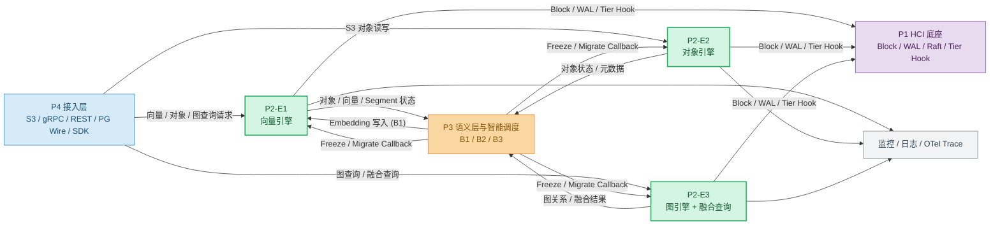
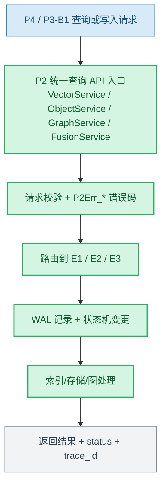
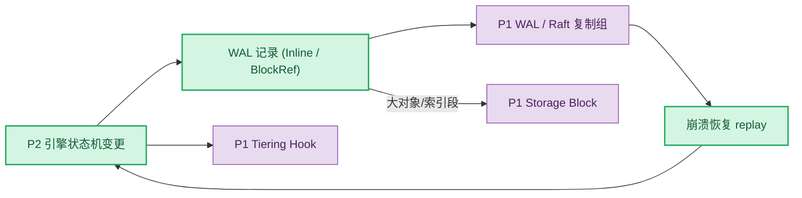
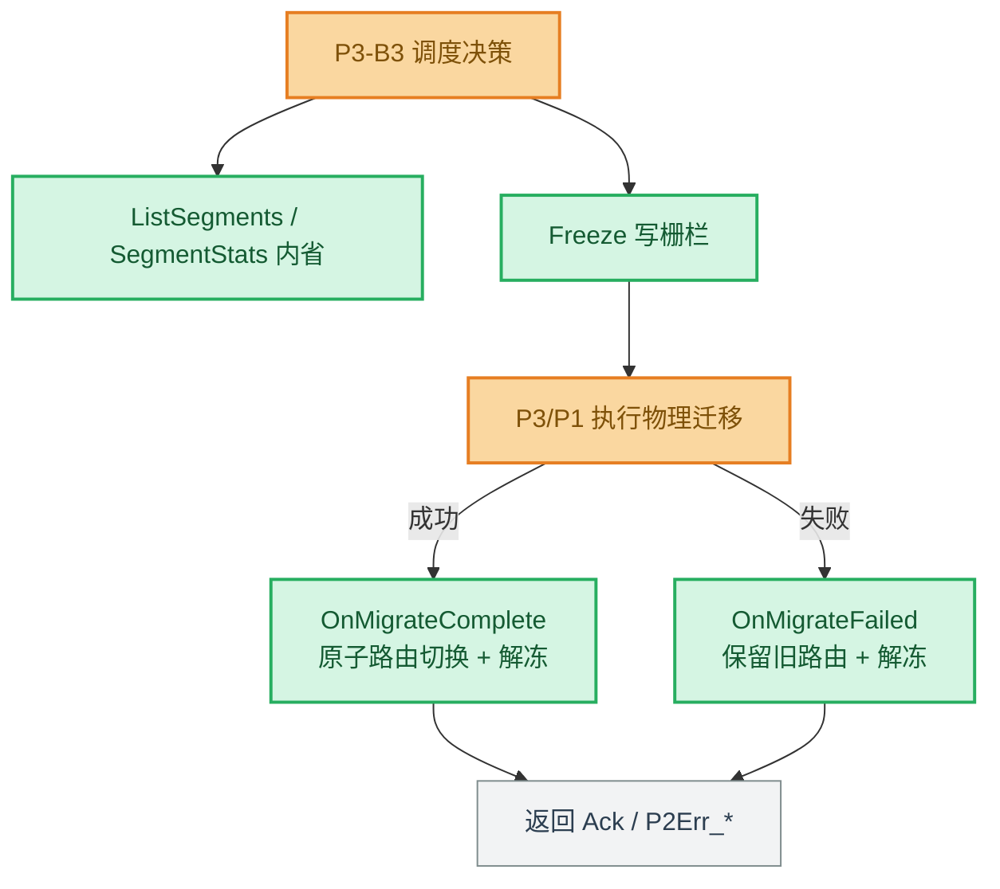

# P2 AetherEngine 六态存储引擎需求文档（v1.0）

## 1. 文档说明

### 1.1 编写目的

本文档用于明确 P2 AetherEngine 存储引擎模块在捷云盛 AetherStore AI 原生统一存储项目中的定位、接入方式、输入输出、核心功能、外部依赖、阶段交付内容和待确认问题。

本文档重点回答以下问题：

1. P2 在整体项目中以什么形式接入；
2. P2 与 P1 存储底座、P3 语义层与智能调度、P4 接入网关之间的关系；
3. P2 从哪些模块获取数据与底层原语；
4. P2 对外输出什么能力和结果；
5. P2 当前阶段需要实现哪些功能需求；
6. 哪些内容需要项目经理、甲方或其他模块负责人确认。

本文档不是详细设计文档，不展开具体索引算法参数、存储编码实现和分布式协议细节。文档中的接口字段为需求评审阶段的最小字段集合，用于对齐模块边界和接口 owner，不代表最终接口协议。

### 1.2 文档适用范围

本文档适用于 P2 AetherEngine 存储引擎相关需求分析，包括：

- E1：向量引擎（Collection / Vector）；
- E2：对象引擎（Bucket / Object）；
- E3：图引擎（Property Graph）与向量-图融合查询；
- P2 与 P1/P3/P4 之间的接口关系；
- P2 当前阶段需求边界和验收关注点。

> 范围说明：AetherEngine 的完整愿景为六态统一存储（向量 / 对象 / 图 / 文件 / 块 / 时序）。依据横向合同与项目分解方案，本阶段聚焦 **E1/E2/E3 三态**；E4 文件、E5 块、E6 时序引擎当前阶段仅作调研，不纳入实现与验收。

---

## 2. 行业痛点与建设价值

当前 AI 原生应用（Agent、RAG、模型训练）在统一存储层普遍面临以下问题：

1. **多模态数据被割裂在不同系统中，缺少统一底座。**
   向量检索用 Milvus、对象用 MinIO/Ceph、图用 Neo4j，各系统独立部署、独立运维、数据无法在同一命名空间内关联，向量与图、对象之间难以做融合查询。

2. **存储引擎与 AI 原语脱节，数据需要反复搬运。**
   ANN 检索、图遍历、向量-图融合等 AI 原语通常在应用侧实现，数据在存储与计算之间来回搬运，带宽和延迟成本高。

3. **冷热分层与迁移缺少统一的内省与回调接口。**
   上层调度器（P3）无法稳定获知存储引擎内部的 Segment 状态、索引状态和访问热度，也缺少标准化的"冻结—迁移—切换"回调，难以实现语义感知的智能分层。

因此，P2 的建设价值在于：在 P1 提供的超融合底座之上，按差异化数据模型与索引结构实现共享底座的多态存储引擎，把 ANN / 图遍历 / 向量-图融合等 AI 原语下沉到存储侧，并向 P3 暴露统一的 Segment 内省与 Tier 迁移回调接口，形成"统一查询 API ↔ 引擎内部状态 ↔ 智能分层"的闭环。

---

## 3. 术语与缩略语

| 术语 | 说明 |
|---|---|
| P1 | 底层 HCI 超融合底座，提供 Storage Block、WAL、Raft 复制组、Tiering Hook 四类共享原语 |
| P2 | 六态存储引擎层（本课题），在 P1 之上实现差异化数据模型与索引 |
| P3 | 语义层与智能调度模块，消费 P2 的查询能力、Segment 内省与迁移回调 |
| P4 | 网关、SDK、Agent/RAG 入口与控制台接入层 |
| E1 | 向量引擎，Collection/Vector 数据模型，HNSW/IVF-PQ 索引 |
| E2 | 对象引擎，Bucket/Object 数据模型，S3 兼容子集 |
| E3 | 图引擎，Property Graph 数据模型，节点/边/属性与图遍历 |
| Collection | 向量集合，定义维度与索引策略 |
| Segment | 引擎内最小可管理/可调度的数据分段单位 |
| Segment 生命周期 | Growing → Sealing → Sealed → Frozen → Archived 统一状态机 |
| WAL | Write-Ahead Log，统一日志结构与崩溃恢复路径 |
| HNSW | 分层可导航小世界图，近似最近邻（ANN）主索引 |
| IVF-PQ | 倒排文件 + 乘积量化，向量第二索引，面向规模化与召回 |
| ANN | 近似最近邻检索 |
| Hybrid Search | BM25 + 向量 RRF 融合检索 |
| VectorAnchoredSubgraph | 向量-图融合算子，一次调用完成锚点检索 + 子图扩展 |
| Tier | 存储资源层级（热/温/冷/归档） |
| Tier Migrate Callback | P2 暴露给 P3 的 Segment 冻结/解冻/迁移完成/迁移失败回调 |
| Segment 内省 | P2 向 P3 暴露的 Segment 列表与状态统计能力 |
| P2Err_* | P2 统一线稳定错误码体系 |
| OTel | OpenTelemetry，全链路可观测标准 |

---

## 4. P2 模块定位

P2 是整个项目中的存储引擎层，位于 P1 超融合底座之上、P3 语义层与 P4 接入层之下。

P2 不直接承担节点级资源调度、物理介质管理、Raft 复制实现（由 P1 负责），也不直接承担语义化、记忆管理与智能调度决策（由 P3 负责），而是在 P1 提供的共享原语之上，按差异化数据模型与索引实现多态存储引擎，并把 AI 原语下沉到存储侧。

P2 的核心目标是：

> 在 P1 共享底座上实现向量、对象、图三态存储引擎，每个引擎共享 WAL、Segment 生命周期、迁移与监控原语，仅在数据模型与索引上做差异化；对外提供统一查询 API、Segment 内省接口和 Tier 迁移回调，支撑 P4 协议接入与 P3 智能分层。

P2 的三个核心子模块为：

| 子模块 | 模块名称 | 核心职责 |
|---|---|---|
| E1 | 向量引擎 | Collection/Vector 数据模型，HNSW/IVF-PQ 索引，Segment 分段，ANN/Hybrid 检索，删除与 tombstone |
| E2 | 对象引擎 | Bucket/Object 数据模型，S3 兼容子集（PUT/GET/HEAD/DELETE/LIST/Range/Multipart），对象元数据与存储路径处理 |
| E3 | 图引擎 | Property Graph 数据模型，节点/边/属性管理，基础图查询与遍历，向量-图融合查询 |

---

## 5. P2 总体接入架构

P2 不作为独立孤岛运行，而是向下消费 P1 的存储底座原语，向上为 P4 提供统一查询协议、为 P3 提供查询能力、Segment 内省与迁移回调。

**数据存储和查询的数据流图、它与大模型各个环节的关系，参考百度的文档**

图中颜色说明：蓝色表示 P4/接入层，绿色表示 P2 存储引擎层，橙色表示 P3 语义层与智能调度，紫色表示 P1 资源底座，灰色表示监控、日志和 OTel。

---

## 6. P2 在整体项目中的接入形态

P2 以三种形态接入整个项目：统一查询服务接入、P1 底座原语消费、P3 内省与迁移回调接入。

### 6.1 统一查询服务接入

对应对象：P4 接入层 / P3-B1 写入。

P2 通过六态统一查询 API（v0.1 冻结）对外暴露能力：E1 向量服务（建集合/写入/删除/检索/Segment 统计）、E2 对象服务（S3 子集）、E3 图服务与融合服务。P4 将 S3 / gRPC / REST / PG Wire 协议路由到对应引擎；P3-B1 通过向量写入接口下推 Embedding。

### 6.2 P1 底座原语消费

对应对象：P1 HCI 底座。

P2 各引擎不重复实现分布式底座，而是统一消费 P1 提供的四类原语：Storage Block（可持久化字节块）、WAL & Recovery（统一日志与崩溃恢复）、Replication Group（Raft 复制组）、Tiering Hook（分层钩子）。当前阶段以 Mock P1 客户端打通接口契约，后续接入真实 P1。

### 6.3 P3 内省与迁移回调接入

对应对象：P3-B3 智能分层调度器。

P2 向 P3 暴露统一的 Segment 内省接口（列出 Segment、查询 Segment 状态统计）和 Tier 迁移回调（Freeze / Unfreeze / OnMigrateComplete / OnMigrateFailed）。P3 据此感知引擎内部冷热状态并下发分层调度动作；P2 负责写栅栏、原子路由切换与状态返回，但不执行物理迁移本身。

---

## 7. P2 与外部模块关系

### 7.1 P2 与 P1 的关系

P1 提供 HCI 超融合底座与四类共享原语。P2 不实现分布式底座，而是依赖 P1 完成块持久化、统一日志与崩溃恢复、复制组一致性和分层钩子。

| P2 从 P1 获取 | P2 向 P1 输出 |
|---|---|
| Storage Block 读写/sync/fence | 状态机变更（写入 WAL） |
| WAL & Recovery SDK | 大对象/索引段 BlockRef |
| Raft 复制组 SDK | Tier Hook 实现（promote/demote/pin/hint） |
| Tiering Hook 规约 | 引擎侧迁移就绪/完成信号 |
| 介质层级与容量状态 | 复制组状态机事件 |

### 7.2 P2 与 P3 的关系

P3 是语义层与智能调度层。P2 为 P3 提供查询能力、Segment 内省与迁移回调；P3-B1 向 P2 下推 Embedding 写入。

| P3 从 P2 获取 | P3 向 P2 输出 |
|---|---|
| 向量检索接口（ANN/Hybrid） | Embedding 写入（B1） |
| 对象读写与元数据 | 向量写入请求 |
| 图查询与图遍历 | Freeze / Unfreeze 请求 |
| 向量-图融合查询结果 | OnMigrateComplete / OnMigrateFailed 回调 |
| Segment 列表与状态统计（内省） | Segment 调度建议 |
| Segment 索引类型 / 行数 / 大小 / 访问计数 | 对象关联调度需求 |

### 7.3 P2 与 P4 的关系

P4 是网关、SDK 与业务接入层。P2 通过六态统一查询 API（v0.1）向 P4 暴露协议适配所需的 gRPC 服务契约，P4 负责 S3 / gRPC / REST / PG Wire 协议转换。

| P4 向 P2 提供 | P2 向 P4 返回 |
|---|---|
| 协议化的向量/对象/图请求 | 检索结果 / 对象数据 / 子图 |
| tenant_id / namespace | 对象元数据（etag/size/md5/blake3） |
| 认证与多租命名空间上下文 | Segment 统计（管理面） |
| trace_id | status / P2Err_* 错误码 / trace_id |

### 7.4 P2 与监控/日志系统关系

P2 通过 OTel 对齐的 `tracing` span 接入统一监控，span 命名 `ae.<engine>.<operation>`，用于记录：

- 向量写入/检索/删除耗时与调用量；
- 对象 PUT/GET/DELETE 耗时与吞吐；
- 图节点/边写入与融合查询耗时；
- Segment 冻结/迁移回调调用与结果；
- 索引构建耗时与 Segment 状态分布；
- 错误码分布与异常降级情况。

真实 OTel 导出经 `tracing-opentelemetry` 桥接到 P1 OTel 总线（接口 IF-07），随真实 P1 接入。

---

## 8. P2 内部模块关系

P2 内部三个引擎共享统一底座（Segment 生命周期、WAL、错误码、迁移回调、OTel），仅在数据模型与索引上差异化。E1 与 E3 之间存在向量-图融合的数据流。

### 8.1 共享底座

| 共享能力 | 说明 | 适用引擎 |
|---|---|---|
| Segment 生命周期 | Growing/Sealing/Sealed/Frozen/Archived 状态机 | E1/E2/E3 |
| WAL & Recovery | 统一日志结构（magic/length/CRC32）与重放恢复 | E1/E2/E3 |
| P2Err_* 错误码 | 线稳定错误码与 `AetherError::code()` 映射 | E1/E2/E3 |
| SegmentControl | Freeze/Unfreeze/OnMigrateComplete/OnMigrateFailed | E1/E2/E3 |
| OTel 可观测 | `ae.<engine>.<op>` span + 关键指标 | E1/E2/E3 |

### 8.2 E1 与 E3 的融合关系

E3 的向量-图融合算子 `VectorAnchoredSubgraph` 采用单读路径：向量投影（Fusion Vector Projection）落在 E3 内部，融合查询时先在 E3 内做余弦锚点检索，再做 k-hop 子图扩展，不在线回调 E1，避免跨引擎往返。

| E3 内部能力 | 说明 |
|---|---|
| project_vector | 将向量投影到图节点，使融合查询在 E3 内闭环 |
| 锚点检索 | 余弦相似度选出 anchor_top_k 个锚点节点 |
| k-hop 扩展 | 从锚点做有界 BFS，受 fanout_cap / max_nodes / max_edges 约束 |
| GraphFilter | 边标签下推过滤 + 节点属性谓词过滤 |
| truncated 标记 | 命中扩展上限时返回截断信号 |

---

## 9. P2 数据来源

| 数据类型 | 主要来源 | 使用引擎 | 用途 |
|---|---|---|---|
| 向量记录（id/values/metadata） | P4 / P3-B1 | E1 | 建集合、写入、ANN 检索 |
| 删除请求（ids） | P4 / P3 | E1 | tombstone 软删除与查询过滤 |
| 对象数据与 key | P4 / 训练任务 | E2 | 对象写入、读取、分片上传 |
| 对象 Range / 分页请求 | P4 | E2 | 部分读、大列表分页 |
| 图节点/边/属性 | P4 / 业务建模 | E3 | Property Graph 写入与遍历 |
| 向量投影 | P3-B1 / 内部 | E3 | 向量-图融合锚点检索 |
| 融合查询请求（query + 参数 + filter） | P4 / P3 | E3 | VectorAnchoredSubgraph |
| Storage Block / WAL | P1 | E1/E2/E3 | 持久化与崩溃恢复 |
| Tier 状态与迁移指令 | P1 / P3 | E1/E2/E3 | Segment 冻结与迁移回调 |

---

## 10. P2 输出结果

| 输出结果 | 输出对象 | 作用 |
|---|---|---|
| ANN/Hybrid 检索结果（SearchHit） | P4 / P3 | 支撑语义检索与记忆召回 |
| 对象数据与元数据（ObjectMeta） | P4 / P3 | 支撑对象读写与训练数据分发 |
| 子图结果（SubGraph） | P4 / P3 | 支撑图查询与关系分析 |
| 融合查询结果（anchors + subgraph + truncated） | P4 / P3 | 支撑向量-图联合分析 |
| Segment 状态统计（SegmentStat） | P3-B3 | 支撑冷热分层与调度对象建模 |
| 迁移回调 Ack | P3 | 支撑分层迁移闭环 |
| status / P2Err_* / trace_id | P4 / 监控 | 支撑异常处理与可观测 |
| OTel span 与指标 | 监控 / P1 OTel 总线 | 支撑全链路 Trace 与效果评估 |

---

## 11. 核心功能需求

### 11.1 E1 向量引擎功能需求

#### 11.1.1 模块目标

E1 建设面向 Collection/Vector 数据模型的向量存储与检索引擎，支持基于 Segment 的分段存储、索引构建与索引更新，接入 HNSW 与 IVF-PQ 双索引，提供 ANN 与 Hybrid 检索。

#### 11.1.2 功能需求

| 编号 | 需求项 | 需求描述 | 优先级 |
|---|---|---|---|
| E1-FR-01 | 数据模型 | 支持 Collection/Vector 模型，可创建集合并定义维度 | P0 |
| E1-FR-02 | 写入与存储 | 支持向量写入，经 WAL 落地并按 Segment 分段存储 | P0 |
| E1-FR-03 | Segment 生命周期 | 支持 Growing→Sealing→Sealed 分段与索引构建 | P0 |
| E1-FR-04 | HNSW 索引 | 接入 HNSW 近似最近邻索引，支撑 ANN 检索 | P0 |
| E1-FR-05 | IVF-PQ 索引 | 接入 IVF-PQ 第二索引，参数随集合规模自适应 | P0 |
| E1-FR-06 | 删除处理 | 支持删除 + tombstone（delete bitmap）+ 查询过滤 + WAL 恢复 | P0 |
| E1-FR-07 | 检索能力 | 支持 ANN 检索；Hybrid（BM25+向量 RRF）检索（M1） | P0/P1 |
| E1-FR-08 | Segment 内省 | 向 P3 输出 Segment 列表与状态统计 | P0 |
| E1-FR-09 | DiskANN | 引入 DiskANN，支撑亿级向量（M1） | P1 |

#### 11.1.3 输入数据

- collection、dimension；
- 向量记录（id、values、graph_node_id、metadata_json）；
- 删除 id 列表；
- 检索查询向量、top_k；
- request_id / trace_id。

#### 11.1.4 输出数据

- SearchHit（id、score、graph_node_id）；
- inserted / deleted 计数；
- SegmentStat（segment_id、state、row_count、size_bytes、index_type、access_count）；
- status、P2Err_*、trace_id、latency。

#### 11.1.5 外部依赖

E1 依赖甲方或其他模块提供：P1 Block/WAL 写入接口、向量样例与维度规范、规模化压测数据集（5 千万向量）、统计口径与性能基线环境、P3-B1 的 Embedding 写入约定。

### 11.2 E2 对象引擎功能需求

#### 11.2.1 模块目标

E2 建设面向 Bucket/Object 数据模型的对象存储引擎，完成对象的创建、写入、读取和删除，支持对象元数据记录、对象数据存储路径处理及对象读写流程，提供 S3 兼容子集。

#### 11.2.2 功能需求

| 编号 | 需求项 | 需求描述 | 优先级 |
|---|---|---|---|
| E2-FR-01 | 数据模型 | 支持 Bucket/Object 模型，可创建桶并管理对象 | P0 |
| E2-FR-02 | S3 子集 | 支持 PUT/GET/HEAD/DELETE/LIST | P0 |
| E2-FR-03 | 对象元数据 | 记录 etag(MD5)、size、md5、blake3 等元数据 | P0 |
| E2-FR-04 | 存储路径处理 | object key 不直接映射本地路径，安全映射存储路径 | P0 |
| E2-FR-05 | Range GET | 支持 S3 Range（inclusive end）部分读 | P0 |
| E2-FR-06 | 分页 LIST | 支持 max_keys / continuation_token 分页（LIST v2） | P0 |
| E2-FR-07 | Multipart | 支持分片上传 create/upload_part/complete/abort/list_parts | P0 |
| E2-FR-08 | 后端抽象 | ObjectBackend 抽象，LocalFS 可生产、SeaweedFS 可适配 | P0 |
| E2-FR-09 | 吞吐与 EC | 顺序读吞吐目标；EC 12+4 编码（M1，副本为 MVP 默认） | P0/P1 |

#### 11.2.3 输入数据

- bucket、key、对象数据 bytes；
- Range（start、end）、分页（prefix、max_keys、continuation_token）；
- Multipart（upload_id、part_no、data）；
- request_id / trace_id。

#### 11.2.4 输出数据

- ObjectMeta（bucket、key、etag、size、md5_hex、blake3_hex）；
- ObjectBytes（data + meta）、ListPage（objects、is_truncated、next_continuation_token）；
- upload_id、etag、PartInfo 列表；
- status、P2Err_*、trace_id、latency。

#### 11.2.5 外部依赖

E2 依赖：P1 Block 写入接口、SeaweedFS/对象后端适配规范、大文件（≥1GB）上传与吞吐压测环境、S3 客户端兼容性测试用例（boto3/aws-cli/MinIO Client）。

### 11.3 E3 图引擎功能需求

#### 11.3.1 模块目标

E3 建设面向 Property Graph 数据模型的图引擎，完成节点、边及属性数据的创建、存储和查询，支持基于邻接关系的图数据存储方式与节点/边/属性关联处理，支持基础图查询、图遍历及与向量检索相关的融合协同功能。

#### 11.3.2 功能需求

| 编号 | 需求项 | 需求描述 | 优先级 |
|---|---|---|---|
| E3-FR-01 | 数据模型 | 支持 Property Graph，节点/边/属性创建与存储 | P0 |
| E3-FR-02 | 邻接存储 | 基于邻接关系组织图数据，WAL 可恢复 | P0 |
| E3-FR-03 | 基础查询 | 支持节点查询、k-hop 邻居遍历、子图合并 | P0 |
| E3-FR-04 | 向量投影 | 支持 Fusion Vector Projection（节点向量列） | P0 |
| E3-FR-05 | 融合查询 | 支持 VectorAnchoredSubgraph 单路径融合算子 | P0 |
| E3-FR-06 | 图过滤 | 支持边标签下推 + 节点属性谓词过滤 | P0 |
| E3-FR-07 | 扩展控制 | 支持 fanout_cap / max_nodes / max_edges 与 truncated | P0 |
| E3-FR-08 | OpenCypher 子集 | 支持 MATCH/WHERE/RETURN/LIMIT 文本查询子集（M1） | P1 |
| E3-FR-09 | 持久化后端 | RocksDB/Kùzu 邻接表替换内存结构（M1） | P1 |

#### 11.3.3 输入数据

- 节点（id、properties_json）、边（id、src、dst、label、properties_json）；
- 向量投影（node_id、vector）；
- 融合查询（collection、query、FusionParams、GraphFilter）；
- 遍历请求（start_node_id、depth）。

#### 11.3.4 输出数据

- NodeRecord / EdgeRecord / SubGraph；
- 融合结果（anchors、subgraph、truncated）；
- status、P2Err_*、trace_id。

#### 11.3.5 外部依赖

E3 依赖：图业务建模样例、向量-图融合的典型查询场景、规模化压测数据（1 亿节点）、RocksDB/Kùzu 选型确认、OpenCypher 子集语法范围确认。

---

## 12. 外部接口需求

本章仅定义 P2 与外部模块交互所需的最小字段集合，对齐 `proto/aether_engine.proto`（v0.1 冻结）。字段类型、枚举值、必填规则、错误码以接口设计阶段最终确认为准。

### 12.1 E1 向量查询接口（VectorService）

| 类型 | 最小字段 |
|---|---|
| 写入输入 | collection、records[id, values, graph_node_id, metadata_json] |
| 删除输入 | collection、ids[] |
| 检索输入 | collection、query[]、top_k |
| 检索输出 | hits[id, score, graph_node_id]、status、trace_id |
| 内省输出 | segments[segment_id, state, row_count, size_bytes, index_type, access_count] |

### 12.2 E2 对象接口（ObjectService）

| 类型 | 最小字段 |
|---|---|
| 写入输入 | bucket、key、data |
| 读取输入 | bucket、key、(start、end for Range) |
| 分页输入 | bucket、prefix、max_keys、continuation_token |
| Multipart 输入 | upload_id、part_no、data |
| 输出 | ObjectMeta / ObjectBytes / ListPage / PartInfo[]、status、error_code、trace_id |

### 12.3 E3 图与融合接口（GraphService / FusionService）

| 类型 | 最小字段 |
|---|---|
| 节点/边输入 | NodeRecord / EdgeRecord |
| 投影输入 | node_id、vector[] |
| 融合输入 | collection、query[]、FusionParams[anchor_top_k, hop, fanout_cap, max_nodes, max_edges]、GraphFilter[edge_labels, node_property_key, node_property_value_json] |
| 融合输出 | anchors[SearchHit]、subgraph[SubGraph]、truncated、trace_id |

### 12.4 Segment 内省与迁移回调接口（SegmentControlService）

| 类型 | 最小字段 |
|---|---|
| 列出输入 | engine（vector/object/graph 实例范围） |
| 列出输出 | segment_ids[] |
| 冻结/解冻输入 | segment_id |
| 迁移完成输入 | segment_id、new_block_ids[] |
| 迁移失败输入 | segment_id、reason |
| 输出 | Ack（ok）/ P2Err_*（Conflict/NotFound/SegmentFrozen） |

---

## 13. 非功能需求

### 13.1 性能需求

P2 应关注以下性能指标（最低门槛结合甲方硬件与测试口径最终确认）：

| 维度 | 目标门槛 | 里程碑 |
|---|---|---|
| E1 HNSW 检索 P99（1 千万向量，单节点） | < 20 ms | M-MVP |
| E1 IVF-PQ 召回率（5 千万向量） | ≥ 92% | M-MVP |
| E2 对象顺序读吞吐（集群） | ≥ 20 GB/s | M-MVP |
| E1 向量集群 P99（亿级，DiskANN） | < 10 ms | M1 |
| E3 图 3 跳遍历（1 亿节点） | < 50 ms | M1 |
| E2 对象吞吐（EC 启用） | ≥ 50 GB/s | M1 |

### 13.2 可用性需求

- 引擎崩溃后可通过 WAL replay 恢复，重启后状态一致；
- 任意时刻可创建/回滚 COW 快照，无数据丢失；
- Segment 冻结期间读请求继续服务（只读），写请求返回 P2Err_SegmentFrozen；
- 迁移失败时保留旧路由，自动解冻，不影响在线查询；
- 外部接口失败返回可识别 P2Err_* 错误码。

### 13.3 可追溯性需求

P2 处理的写入、检索、删除、迁移动作均应可追溯，至少支持：request_id、trace_id、collection/bucket、segment_id、block_id、route_epoch、operation kind。

### 13.4 安全与权限需求

- 多租命名空间隔离，避免跨租户数据混用；
- object key 不直接映射本地路径，防目录穿越；
- 索引/对象数据与元数据访问受 P4 鉴权（mTLS+SPIFFE）约束；
- 测试与联调使用脱敏样例数据。

### 13.5 可观测性需求

P2 应向监控系统输出：向量写入/检索/删除调用量与耗时、对象读写吞吐与耗时、图查询/融合耗时、Segment 冻结/迁移回调调用与结果、索引构建耗时、Segment 状态分布、错误码分布、异常降级次数；并通过 OTel span 串联全链路。

---

## 14. 阶段交付与验收关注

### 14.1 当前阶段交付内容

1. P2 需求分析文档（本文档）；
2. P2 总体接入关系说明；
3. E1 向量引擎需求与技术方案；
4. E2 对象引擎需求与技术方案；
5. E3 图引擎需求与技术方案；
6. 六态统一查询 API v0.1（含 Segment 内省、Tier 迁移回调）；
7. P1/P2/P3 接口依赖清单；
8. 甲方需提供材料清单；
9. P2 待确认问题清单。

### 14.2 验收关注表

| 模块 | 验收项 | 验收方式 | 交付材料 |
|---|---|---|---|
| E1 | Collection/Vector 写入、存储、ANN 检索可用 | 联调演示、单测、检索日志 | 接口样例、测试报告 |
| E1 | HNSW + IVF-PQ 双索引可用，IVF-PQ 召回 ≥ 92% | 召回率对照测试 | 召回率测试报告 |
| E1 | 删除 + tombstone + 查询过滤 + WAL 恢复 | 删除后检索 + 重启恢复验证 | 测试用例与日志 |
| E2 | PUT/GET/HEAD/DELETE/LIST 通过 S3 客户端测试 | aws-cli/boto3/MinIO Client | 兼容性测试报告 |
| E2 | Range GET + 分页 + Multipart 可用 | 分片上传与部分读验证 | 接口样例、测试报告 |
| E3 | Property Graph 节点/边/属性创建与遍历 | 图遍历样例测试 | 图查询样例 |
| E3 | 向量-图融合查询可用并可控（truncated） | 融合查询 + 过滤 + 上限验证 | 融合查询样例 |
| P2 共享 | Segment 内省 + Tier 迁移回调可用 | 冻结/迁移生命周期测试 | SegmentControl 测试报告 |
| P2 共享 | WAL/Tier Hook/OTel 接入 P1 | 联调演示、Trace 检查 | 接入说明、Trace 样例 |
| P2 整体 | 六态统一查询 API v0.1 冻结 | 接口评审 | proto v0.1 + 镜像 |

---

## 15. 甲方需提供材料清单

### 15.1 E1 所需材料

- P1 Storage Block / WAL 写入接口与协议；
- 向量样例数据集与维度规范；
- 5 千万向量规模化压测数据与统计口径；
- 召回率基线与对照方法；
- P3-B1 Embedding 写入字段约定；
- 测试环境与部署权限。

### 15.2 E2 所需材料

- 对象写入入口与命名规范；
- SeaweedFS / 对象后端适配规范；
- 大文件（≥1GB）上传与吞吐压测环境；
- S3 客户端兼容性测试用例；
- EC 编码策略与副本策略要求。

### 15.3 E3 所需材料

- 图业务建模与典型查询场景；
- 向量-图融合的典型用例；
- 1 亿节点规模化压测数据；
- RocksDB/Kùzu 选型意见；
- OpenCypher 子集语法范围。

---

## 16. 待项目经理确认问题

| 类别 | 待确认问题 | 期望确认对象 | 责任人 | 状态 |
|---|---|---|---|---|
| 范围 | 本阶段是否严格限定为三态 E1/E2/E3，E4/E5/E6 仅调研？ | 项目经理 / 甲方负责人 | 待定 | 未确认 |
| P1 依赖 | P1 Storage Block / WAL / Raft SDK 的 v0.1 接口何时冻结可用？ | P1 负责人 / 架构负责人 | 待定 | 未确认 |
| P1 依赖 | 当前阶段是否允许以 Mock P1 打通，真实 P1 接入节点在何时？ | P1 负责人 | 待定 | 未确认 |
| P3 依赖 | Segment 内省接口字段与粒度（Segment vs chunk）是否对齐 P3-B3？ | P3 负责人 / 架构负责人 | 待定 | 未确认 |
| P3 依赖 | Tier Migrate Callback 是建议式还是执行式接口，迁移由谁执行？ | P1/P3 负责人 | 待定 | 未确认 |
| P3 依赖 | P3-B1 的 Embedding 写入走 E1 向量写入接口的字段是否对齐？ | P3-B1 负责人 | 待定 | 未确认 |
| P4 依赖 | S3 / gRPC / PG Wire 协议映射由 P4 完成，P2 仅提供 gRPC 契约是否确认？ | P4 负责人 | 待定 | 未确认 |
| 性能口径 | E1 检索 P99、E2 吞吐、IVF-PQ 召回率是否包含网络/编码耗时？ | 测试负责人 | 待定 | 未确认 |
| 性能口径 | 5 千万向量召回率 ≥ 92% 的数据集与 ground truth 由谁提供？ | 测试负责人 / 甲方 | 待定 | 未确认 |
| 验收口径 | 本阶段是否需要原型演示，还是以文档 + 测试报告验收？ | 项目经理 / 甲方负责人 | 待定 | 未确认 |
| 选型 | E3 持久化后端 RocksDB 还是 Kùzu？OpenCypher 子集范围？ | 架构负责人 / P2 负责人 | 待定 | 未确认 |

---

## 17. 需求边界说明

P2 当前阶段负责：

- 向量引擎 E1（Collection/Vector、Segment、HNSW/IVF-PQ、ANN/Hybrid、删除）需求与实现；
- 对象引擎 E2（Bucket/Object、S3 子集、元数据与路径处理）需求与实现；
- 图引擎 E3（Property Graph、图遍历、向量-图融合）需求与实现；
- 六态统一查询 API、Segment 内省与 Tier 迁移回调；
- WAL/Tier Hook/OTel 接入 P1；
- P2 非功能需求与验收关注说明。

P2 当前阶段不负责：

- HCI 节点底座、Raft 复制实现、物理介质管理（由 P1 负责）；
- 语义化、记忆管理、智能调度决策（由 P3 负责）；
- 网关、SDK、控制台与协议网关实现（由 P4 负责）；
- E4 文件 / E5 块 / E6 时序引擎实现（仅调研）；
- Checkpoint 高吞吐通道与跨引擎事务（仅调研/实验特性）；
- 完整产品级稳定性测试与生产部署承诺。

---

## 18. 总结

P2 AetherEngine 存储引擎模块的核心定位是：在 P1 超融合底座之上实现共享底座的多态存储引擎，把 ANN / 图遍历 / 向量-图融合等 AI 原语下沉到存储侧，并向上为 P4 提供统一查询协议、为 P3 提供 Segment 内省与 Tier 迁移回调。

E1 负责向量数据的分段存储、双索引检索与删除处理；E2 负责对象数据的 S3 兼容读写、分片上传与分页列举；E3 负责 Property Graph 的节点/边/属性管理、图遍历与向量-图融合查询。三者通过统一的 Segment 生命周期、WAL、错误码、迁移回调和 OTel 形成共享底座，并在 2026 年里程碑节点（M0 接口冻结 → M-MVP 三态可生产 → M1 融合与规模化增强 → 三态 GA）逐步收口为可演示、可验收、可观测的多态存储引擎。
