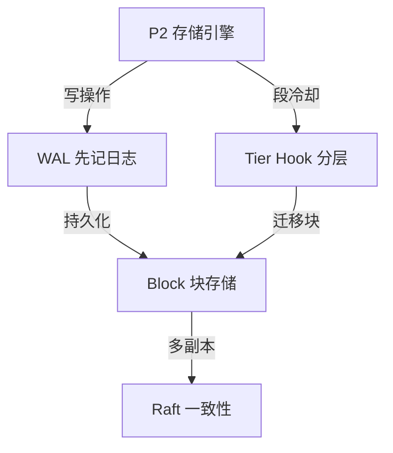
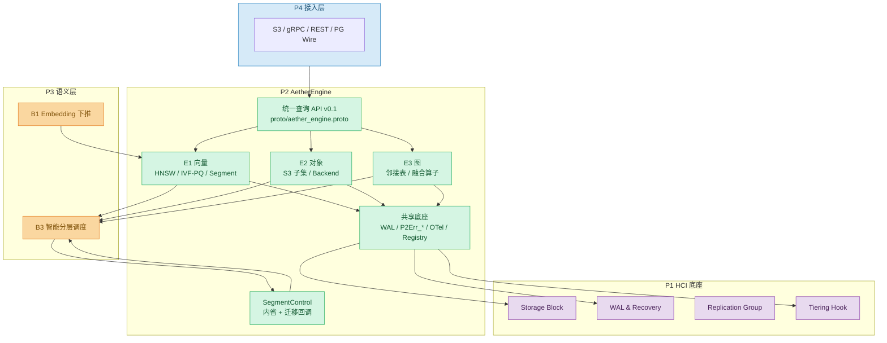
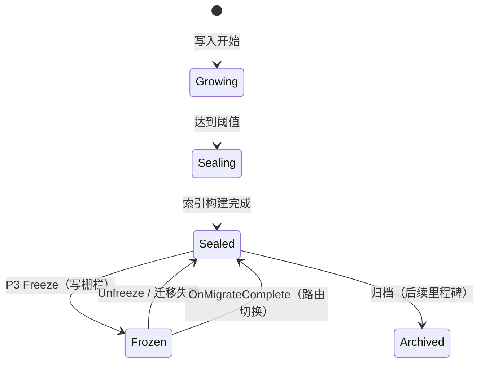

# P2 AetherEngine 总体架构设计文档（v1.0）

> 合同依据：横向合同 第二条（1）2026-06-05 ~ 2026-07-31「总体架构设计」  
> 里程碑：M0（2026-07-31）  
> 版本：v1.0 | 状态：评审稿

---

## 1. 文档说明

### 1.1 编写目的

本文档描述 P2 AetherEngine 在 AetherStore 整体架构中的位置、分层关系、模块划分、共享底座与外部接口，作为 M0 阶段「总体架构设计」交付物，供甲方评审与 P1/P3/P4 联调对齐。

### 1.2 适用范围

- E1 向量引擎、E2 对象引擎、E3 图引擎（本阶段实现范围）；
- E4 文件 / E5 块 / E6 时序引擎（本阶段仅调研，见《P2_E4E5E6三态引擎调研报告_v1.0》）；
- 六态统一查询 API v0.1、Segment 内省、Tier Migrate Callback。

---

## 2. 架构定位

P2 是 **存储引擎层**，位于 P1 HCI 超融合底座之上、P3 语义调度层与 P4 接入层之下。

| 层级 | 项目 | 职责 | P2 关系 |
|---|---|---|---|
| L4 | P4 AetherGate | 协议网关、SDK、控制台 | 消费 P2 gRPC 契约 |
| L3 | P3 AetherBrain | 语义化、记忆、智能分层 | 消费 P2 查询 + 内省/迁移回调 |
| **L2** | **P2 AetherEngine** | **六态存储引擎（本阶段 E1/E2/E3）** | **本课题** |
| L1 | P1 AetherFabric | Block块存储原语/WAL预写日志原语/Raft复制组原语/Tier Hook分层存储钩子原语 | P2 消费四类原语 |
| L0 | 物理介质 | NVMe/SSD/HDD/对象存储 | 由 P1 管理 |

P2 核心设计原则：**共享底座、差异化引擎** —— Segment 生命周期、WAL、错误码、迁移回调、OTel 三引擎共用；Collection/Vector、Bucket/Object、Property Graph 数据模型与索引各自实现。



---

## 3. 总体架构图

P2职责	引擎逻辑、索引管理、Segment 生命周期

P1职责	物理存储、复制、分层、日志

P2 不感知底层介质，只调用 P1 抽象接口



---

## 4. 模块划分（Rust Monorepo）

```text
aether-engine/
├── crates/
│   ├── ae-common/       # EngineKind、ID、SegmentState、P2Err_*、Tier
│   ├── ae-wal/          # WalRecord v1、MemoryWal、FileWal（magic/CRC/截断）
│   ├── ae-kernel/       # AetherEngine trait、EngineRegistry、SegmentControl
│   ├── ae-p1-client/    # Mock P1 Block/WAL（M0 契约打通，M-MVP 换真实 P1）
│   ├── ae-proto/        # proto v0.1 手写 Rust 镜像
│   └── ae-telemetry/    # OTel 对齐 tracing span + SpanCounter
├── engines/
│   ├── e1-vector/       # Collection/Vector、Segment、HNSW/IVF-PQ/Flat
│   ├── e2-object/       # Bucket/Object、ObjectBackend、Multipart
│   └── e3-graph/        # Property Graph、融合算子、GraphFilter
├── services/
│   ├── ae-server/       # 本地 demo / registry / 融合演示
│   └── ae-cli/          # CLI smoke
└── proto/
    └── aether_engine.proto   # FROZEN v0.1
```

---

## 5. 共享底座设计

### 5.1 Segment 生命周期（三引擎统一）



| 状态 | 读 | 写 | P3 可见 |
|---|---|---|---|
| Growing | 精确/Flat | 允许 | row_count 增长 |
| Sealed | 索引检索 | 新 Growing 段 | index_type、access_count |
| Frozen | 允许（只读） | 拒绝 P2Err_SegmentFrozen | state=frozen |

**Segment 粒度**：E1 = `{collection}/seg_NNNNNN`；E2 = bucket 名；E3 = 单图实例 `graph/default`。

### 5.2 WAL & Recovery

- 帧格式：`magic(4) | length(4) | payload | crc32(4)`；
- `WalRecord v1` 含 `EngineKind`、`EngineInstanceId`、`OperationKind`、`Inline/BlockRef` payload；
- 崩溃恢复：顺序 replay，CRC 损坏截断到最后有效记录。

### 5.3 统一错误码 P2Err_*

线稳定错误码（`ae-common::P2ErrorCode`），gRPC/HTTP 映射由 P4 网关完成。M0 已定义：InvalidArgument、NotFound、Conflict、SegmentFrozen、ResultTooLarge、Unsupported、Upstream 等。

### 5.4 Tier Migrate Callback

`ae_kernel::SegmentControl` trait，与 `SegmentControlService` proto 一一对应：

| 方法 | 语义 |
|---|---|
| list_segments | P3 枚举可调度段 |
| freeze | 写栅栏，Sealed→Frozen |
| unfreeze | 取消迁移，Frozen→Sealed |
| on_migrate_complete | 原子换 block_ids + route_epoch |
| on_migrate_failed | 保留旧路由，仅解冻 |

物理迁移由 P1/P3 执行；P2 只负责栅栏与路由切换。

### 5.5 可观测（OTel） 作用：统一 Trace/Span 命名规范，便于全链路追踪（P4 网关 → P2 引擎 → P1 存储）

Span 命名：`ae.<engine>.<operation>`，tag `engine=vector|object|graph`。M0 以 `tracing` + `SpanCounter` 自测；M-MVP 经 `tracing-opentelemetry` 接入 P1 OTel 总线。

Span 命名约定
ae.<engine>.<operation>
示例：

ae.vector.insert - E1 向量插入
ae.object.put - E2 对象上传
ae.graph.k_hop - E3 图 k 跳查询

---

## 6. 三引擎差异化设计摘要

| 维度 | E1 向量 | E2 对象 | E3 图 |
|---|---|---|---|
| 数据模型 | Collection / Vector | Bucket / Object | Property Graph |
| 分段单位 | Segment（多段/集合） | Bucket | 单逻辑 Segment |
| 主索引 | HNSW + IVF-PQ    后续disANN | — | 邻接表 |
| AI 原语 | ANN / Hybrid(M1) | S3 子集 | k-hop + VectorAnchoredSubgraph |
| 持久化(M0) | WAL + 内存索引 | SQLite 元数据 + LocalFS | WAL + 内存邻接 |
| P3 内省 | SegmentStats | list_buckets | list_segments(单段) |

---

P3 内省：P3 语义调度层向 P2 存储引擎查询内部状态信息，用于智能分层决策。 

哪些 Segment 该从 NVMe 迁移到 SSD？
哪些冷数据该下沉到对象存储？
哪些热数据需要保留在内存？

SegmentStats:

// proto 定义（伪代码）
message SegmentStats {
  string segment_id = 1;           // "seg_000042"
  SegmentState state = 2;          // Growing/Sealed/Frozen
  EngineKind engine = 3;           // Vector/Object/Graph
  string instance_id = 4;          // "collection_A"

  // 关键决策字段
  uint64 row_count = 5;            // 数据量
  uint64 size_bytes = 6;           // 占用空间
  uint64 access_count = 7;         // 访问次数（热度）
  int64 last_access_time = 8;      // 最后访问时间（冷热判断）
  string index_type = 9;           // "HNSW" / "IVF-P

## 7. 外部接口（M0 冻结）

| 接口 | 协议 | 消费方 | 文档 |
|---|---|---|---|
| 三态统一查询 API | gRPC（proto v0.1） | P4 / P3-B1 | 《P2_AetherEngine_API接口文档_v0.1》 |
| Segment 内省 | SegmentStats + ListSegments | P3-B3 | 同上 IF-04 |
| Tier Migrate Callback | Freeze/Unfreeze/OnMigrate* | P3-B3 | 同上 + ae-kernel |
| P1 原语 | Block/WAL SDK | P2 内部 | 《P2_P1P2P3接口依赖表_v1.0》 |

**冻结规约**：字段号与 RPC 签名稳定；仅允许向后兼容新增。

---

## 8. 非功能架构约束

| 维度 | M0 要求 | 后续里程碑 |
|---|---|---|
| 可用性 | WAL replay 一致；Frozen 只读可服务 | 复制组 HA（P1） |
| 安全 | object key 哈希映射，防目录穿越 | mTLS + SPIFFE（P4） |
| 性能 | 单测 + 小规模 recall 门禁 | M-MVP 压测指标 |
| 可维护 | workspace 单测 31+、clippy 零警告 | CI 接入 |

## 

---

---

## 9. 总结

P2 总体架构以 **P1 原语 + 共享底座 + 三态差异化引擎 + 统一 API/内省/迁移回调** 为核心，在 M0 完成接口冻结与架构评审，在 M-MVP/M1/GA 逐步兑现性能与生产可用性目标。
