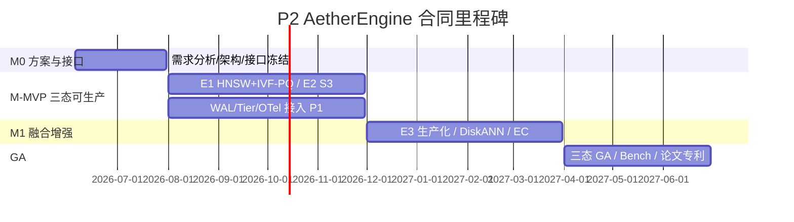

# P2 AetherEngine 技术路线与实施计划（v1.0）

> 合同依据：横向合同 第二条（1）「技术路线论证及实施计划制定」  
> 里程碑：M0 ~ 三态 GA | 版本：v1.0

---

## 1. 技术路线总览

---

## 2. 技术路线论证

### 2.1 为什么「共享底座 + 三态引擎」

| 方案 | 优点 | 缺点 | 结论 |
|---|---|---|---|
| A. 三系统拼装（Milvus+MinIO+Neo4j） | 成熟 | 无统一 Segment/迁移/融合；运维割裂 | ❌ 不符合 AetherStore 愿景 |
| B. 单库强行统一 schema | 部署简单 | 向量/对象/图索引差异大，性能难兼顾 | ❌ 扩展六态困难 |
| **C. P1 底座 + P2 共享 Segment/WAL + 差异化引擎** | 对齐合同；P3 统一调度；AI 原语下沉 | 需严格接口冻结 | ✅ **选用** |

### 2.2 关键技术选型（M0 冻结 / M-MVP 实现）

| 领域 | 选型 | 理由 |
|---|---|---|
| 语言 | Rust | 内存安全、性能、与 P1 底座一致 |
| E1 主索引 | 纯 Rust HNSW | M-MVP 1 千万 P99 目标；无外部 C++ 依赖 |
| E1 第二索引 | 纯 Rust IVF-PQ + 自适应参数 | 合同 5 千万 recall ≥ 92% |
| E2 元数据 | SQLite → 可换 | M0 轻量可演示；生产可换分布式 meta |
| E2 数据面 | ObjectBackend trait + LocalFS | SeaweedFS 适配预留（M1） |
| E3 存储 | 内存邻接 → RocksDB/Kùzu | M0/M-MVP 功能验证；M1 持久化 |
| 融合查询 | E3 单读路径 VectorAnchoredSubgraph | 避免 E1↔E3 跨引擎往返（设计 §5） |
| 接口 | proto3 gRPC v0.1 + ae-proto 镜像 | M0 不阻塞 tonic  toolchain |
| P1 接入 | MockP1Client → 真实 SDK | M0 契约先行 |

### 2.3 明确不纳入 M0/M-MVP 的路线

- E4 文件 / E5 块 / E6 时序：**仅调研**（合同第一条（5））；
- DiskANN、Hybrid Search、EC 12+4：**M1**；
- Checkpoint 高吞吐通道、跨引擎事务：**GA 调研/实验**。

---

## 3. 分阶段实施计划

### 3.1 第一阶段 M0（2026-06-05 ~ 2026-07-31）— 本阶段

**目标**：方案收敛 + 接口冻结 + 评审材料齐套。

| 工作包 | 内容 | 交付物 | 状态 |
|---|---|---|---|
| WP0-1 | 需求分析 | 《P2_AetherEngine六态存储引擎需求文档_v1.0》 | ✅ |
| WP0-2 | 总体架构 | 《P2_AetherEngine总体架构设计文档_v1.0》 | ✅ |
| WP0-3 | 阶段方案 | 《P2_AetherEngine第一阶段阶段方案文档_v1.0》 | ✅ |
| WP0-4 | 技术路线 | 本文档 | ✅ |
| WP0-5 | API 冻结 | `proto/aether_engine.proto` FROZEN v0.1 | ✅ |
| WP0-6 | 接口文档 | 《P2_AetherEngine_API接口文档_v0.1》 | ✅ |
| WP0-7 | 依赖对齐 | 《P2_P1P2P3接口依赖表_v1.0》 | ✅ |
| WP0-8 | E4/E5/E6 调研 | 《P2_E4E5E6三态引擎调研报告_v1.0》 | ✅ |
| WP0-9 | 自测与清单 | 《M0_阶段交付清单与自测报告_v1.0》 | ✅ |
| WP0-10 | 原型骨架 | workspace 可构建 + SegmentControl 三引擎 | ✅（超前） |

**甲方评审入口**：《M0_阶段交付清单与自测报告_v1.0》

### 3.2 第二阶段 M-MVP（2026-08-01 ~ 2026-11-30）

| 工作包 | 内容 | 验收指标 |
|---|---|---|
| WP1-1 | E1 生产化 | HNSW P99 < 20ms（1 千万）；IVF-PQ recall ≥ 92%（5 千万） |
| WP1-2 | E2 生产化 | S3 子集客户端兼容；顺序读 ≥ 20 GB/s（集群） |
| WP1-3 | P1 真实接入 | WAL/BlockRef replay 落地；Tier Hook 回调 |
| WP1-4 | OTel 生产导出 | tracing-opentelemetry → P1 总线 |
| WP1-5 | P4 联调 | S3/gRPC 网关对接 |

### 3.3 第三阶段 M1（2026-12-01 ~ 2027-03-31）

- E3 RocksDB/Kùzu 持久化；OpenCypher 子集；
- DiskANN；Hybrid Search；E2 EC + 吞吐升级；
- 1 亿节点 3-hop < 50ms 等规模化指标。

### 3.4 第四阶段 GA（2027-04-01 ~ 2027-06-30）

- 三态全部生产可用；AetherBench；pgvector 兼容；
- 专利 2 项 + SCI 论文 1 篇；E4/E5/E6/Checkpoint 调研结项。

---

## 4. 人力资源与分工（对齐合同技术服务人员表）

| 角色 | 人员 | M0 重点 |
|---|---|---|
| 项目负责人 | 蒋明敏 | 评审组织、甲方对接 |
| 架构/技术负责人 | 程勇 | 架构、接口冻结、P1/P3 对齐 |
| 系统实现 | 吴立俊、杨飞宇 | E1/E2/E3 引擎与共享底座 |
| 开发支持 | 陈晔、张晋、徐博文、刘佳正、胡孝阳 | 单测、文档、demo、联调 |

---

## 5. 风险与缓解

| 风险 | 阶段 | 缓解 |
|---|---|---|
| P1 SDK 延迟 | M-MVP | M0 Mock 契约；接口依赖表跟踪 owner |
| P3 内省字段变更 | M0 | v0.1 已冻结；变更走 v0.2 兼容扩展 |
| 性能指标环境不足 | M-MVP | 提前向甲方申请压测环境与数据集 |
| 范围蔓延至六态 | 全周期 | 合同边界：E4/E5/E6 仅调研 |

---

## 6. 总结

P2 技术路线采用 **M0 冻结接口 → M-MVP 三态可生产 → M1 融合与规模化 → GA 完整交付** 四段推进；M0 以文档 + proto 冻结 + 原型验证为主，为后续 40% 合同款对应的开发阶段奠定基础。
