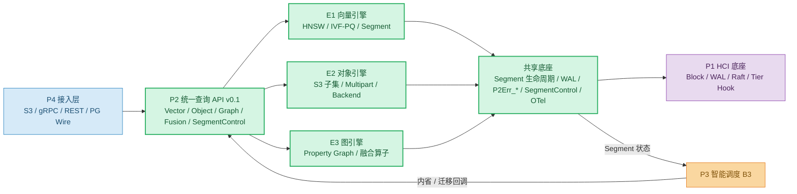
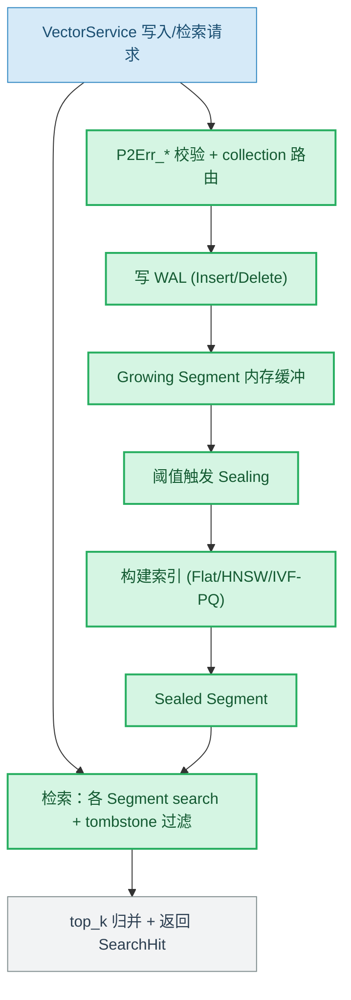
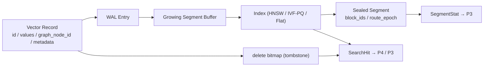
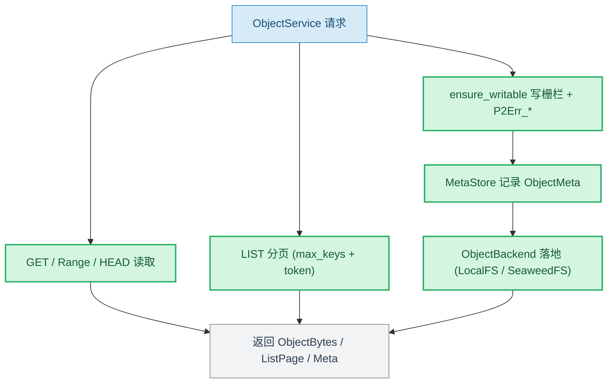
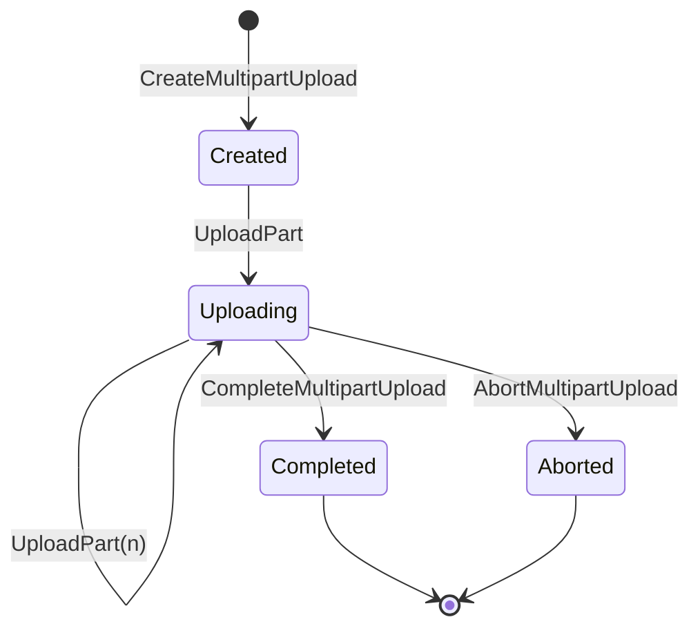
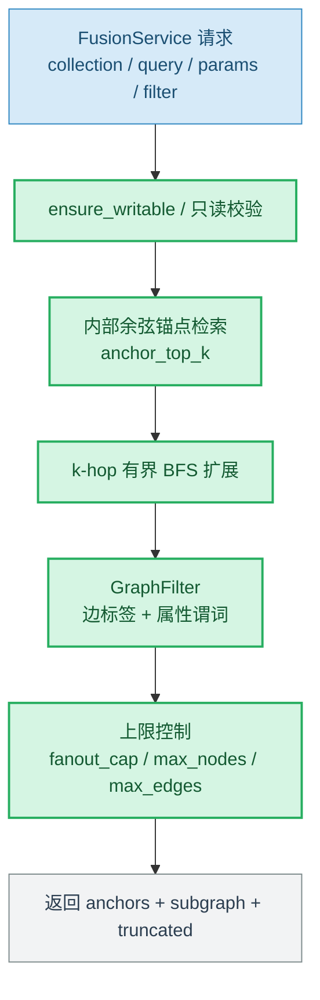
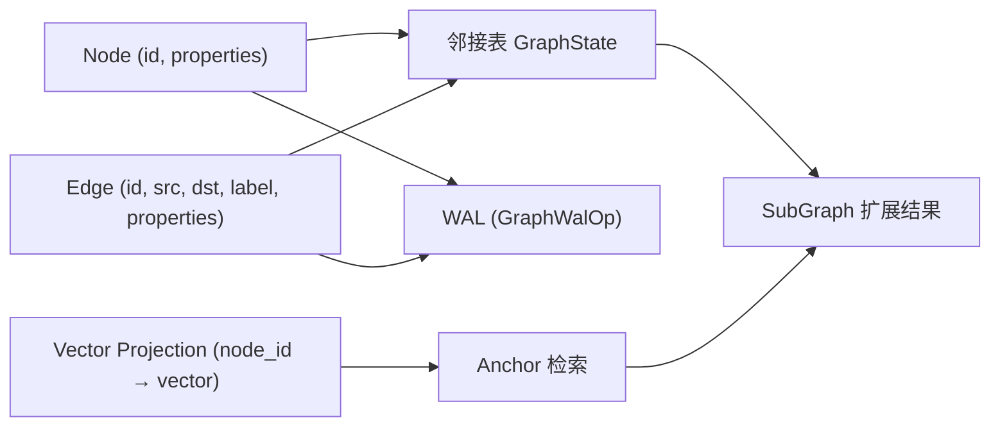
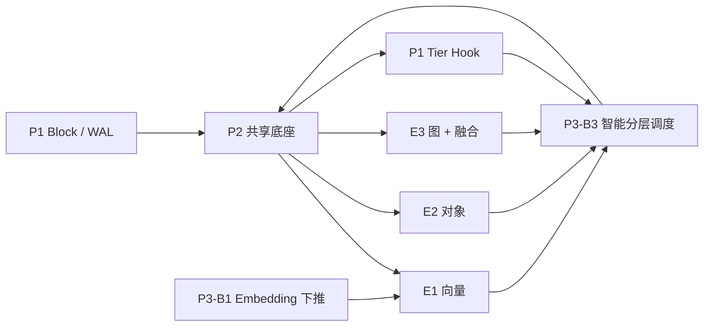

# P2 AetherEngine 第一阶段阶段方案文档（v1.0）

## 1. 项目背景与阶段定位

### 1.1 项目背景

随着 Agent、RAG、模型训练与多模态应用在企业级场景中的落地，系统中持续产生大量向量、对象、图、文件、块和时序数据。如果这些数据继续分散在 Milvus、MinIO/Ceph、Neo4j 等独立系统中，会出现以下问题：

1. 多模态数据被割裂在不同系统，缺少统一命名空间和统一底座；
2. ANN 检索、图遍历、向量-图融合等 AI 原语在应用侧实现，数据反复搬运，带宽与延迟成本高；
3. 各引擎冷热分层各自为政，上层调度器无法稳定获知引擎内部 Segment 状态，缺少统一的迁移回调；
4. 向量与图、对象之间难以在同一系统内做融合查询。

因此，P2 需要在 P1 超融合底座与 P3 语义层、P4 接入层之间，建设共享底座的多态存储引擎，把 AI 原语下沉到存储侧，并对上暴露统一查询 API、Segment 内省与 Tier 迁移回调。

### 1.2 P2 第一阶段定位

P2 第一阶段以 **三态可用、接口冻结、共享底座成型** 为目标，而非完整六态系统上线。

第一阶段主要完成：

- E1 向量引擎技术方案与实现（Segment + HNSW + IVF-PQ + 删除）；
- E2 对象引擎技术方案与实现（S3 子集 + Range + 分页 + Multipart）；
- E3 图引擎技术方案与实现（Property Graph + 图遍历 + 向量-图融合）；
- 六态统一查询 API v0.1 冻结（含 Segment 内省、Tier 迁移回调）；
- P1/P2/P3 接口依赖说明；
- WAL / Tier Hook / OTel 接入说明；
- 三态可生产 MVP 路径说明。

> 范围约束：本阶段聚焦三态 E1/E2/E3，E4 文件 / E5 块 / E6 时序引擎仅作调研，不纳入实现与验收。

### 1.3 第一阶段关键节点（对齐横向合同里程碑）

| 阶段 | 时间窗口 | 阶段重点 | 主要交付 |
|---|---|---|---|
| 需求与接口冻结 | 6–7 月 | 明确 P2 定位、E1/E2/E3 边界、P1/P3 依赖；冻结查询 API | 阶段方案、需求文档、proto v0.1 |
| M0 接口冻结 | 2026-07-31 | 六态统一查询 API、Segment 内省、Tier 迁移回调冻结 | proto v0.1 + Rust 镜像 + 接口依赖表 |
| 引擎原型成型 | 8–9 月 | E1/E2/E3 各自最小可运行链路 + 共享底座 | 单引擎 demo、单测、Segment 生命周期 |
| P1/P2/P3 联调 | 10 月 | WAL/Tier Hook/OTel 接入、内省/迁移链路联调 | 联调记录、问题清单 |
| M-MVP 集成 | 11 月 | 三态可生产、性能门禁达标、演示与报告 | MVP 演示、性能报告 |
| 三态可生产 MVP | 2026-11-30 | E1(HNSW+IVF-PQ)+E2(S3 子集) 生产可用 | MVP 验收版本 |
| M1 增强 | 2027-03-31 | E3 图引擎、DiskANN、融合算子、EC、Hybrid | M1 验收版本 |
| 三态 GA | 2027-06-30 | 三态全部生产可用、AetherBench、pgvector 兼容 | GA 版本、专利/论文 |

---

## 2. 第一阶段目标与范围

### 2.1 阶段目标

1. 明确 P2 在整体项目中的接入位置（P1 之上、P3/P4 之下）；
2. 明确 P2 与 P1/P3/P4 的接口边界；
3. 明确 E1/E2/E3 三个引擎的职责边界；
4. 明确共享底座（Segment 生命周期、WAL、错误码、迁移回调、OTel）；
5. 明确 P2 向 P3 暴露的 Segment 内省与 Tier 迁移回调；
6. 明确 P2 向 P4 提供的统一查询 API；
7. 明确三态可生产 MVP（2026-11-30）的最小路径；
8. 形成阶段评审材料和待确认问题清单。

### 2.2 阶段内范围（In Scope）

| 范围 | 说明 |
|---|---|
| P2 总体接入方案 | 明确 P2 与 P1/P3/P4 的关系 |
| E1 技术方案与实现 | Collection/Vector、Segment、HNSW/IVF-PQ、删除 |
| E2 技术方案与实现 | Bucket/Object、S3 子集、Range、分页、Multipart |
| E3 技术方案与实现 | Property Graph、图遍历、向量-图融合 |
| 共享底座 | Segment 生命周期、WAL、P2Err_*、SegmentControl、OTel |
| 六态统一查询 API v0.1 | 含 Segment 内省与 Tier 迁移回调，M0 冻结 |
| P1/P2/P3 接口依赖 | 明确 Block/WAL/Tier Hook 与内省/迁移回调关系 |
| 里程碑与计划 | 对齐 M0 / M-MVP / M1 / GA 节点 |
| 风险和待确认问题 | 为项目经理分派 owner 提供依据 |

### 2.3 阶段外范围（Out of Scope）

| 不包含内容 | 说明 |
|---|---|
| HCI 节点底座 / Raft 实现 | 由 P1 负责 |
| 物理介质管理与迁移执行 | 由 P1 负责 |
| 语义化 / 记忆管理 / 调度决策 | 由 P3 负责 |
| 协议网关 / SDK / 控制台 | 由 P4 负责 |
| E4 文件 / E5 块 / E6 时序引擎 | 当前阶段仅调研 |
| Checkpoint 高吞吐通道 / 跨引擎事务 | 当前阶段仅调研/实验 |
| 完整生产部署 | 当前阶段不做生产级部署承诺 |

---

## 3. P2 总体方案

### 3.1 P2 总体定位

P2 是存储引擎层，在 P1 共享原语之上实现差异化数据模型与索引，对上为 P4 提供统一查询协议、为 P3 提供内省与迁移回调。P2 不实现分布式底座，也不做语义调度决策，而是负责：

1. 在 Segment 生命周期、WAL、错误码、迁移回调、OTel 等共享底座上构建三态引擎；
2. 将 ANN / 图遍历 / 向量-图融合等 AI 原语下沉到存储侧；
3. 向 P3 暴露 Segment 内省与 Tier 迁移回调，配合智能分层。

### 3.2 P2 总体架构图

> 本图由 P2 总负责人维护，E1/E2/E3 负责人需确保本模块输入输出与该图一致。

### 3.3 P2 最小闭环

三态可生产 MVP（2026-11-30）至少需要跑通以下链路：

---

# 4. E1 技术方案：向量引擎

> 责任人：E1 负责人
> 本章为 E1 完整技术方案正文区，覆盖定位、目标、总体方案、流程图、数据流、输入输出、依赖、异常、MVP 支撑与交付物。

## 4.1 E1 技术方案摘要

E1 是 Collection/Vector 数据模型的向量存储与检索引擎。写入经 WAL 落地后进入 Growing Segment；Segment 达到阈值后 Sealing→Sealed 并构建索引；检索时对各 Segment 索引做查询并按 tombstone 过滤已删除项后归并。E1 接入 HNSW（ANN 主索引）与 IVF-PQ（规模化第二索引，参数随集合规模自适应：nlist≈√n、nprobe≈nlist/2、m≈dim/2），并通过 SegmentControl 向 P3 暴露 Segment 内省与 Tier 迁移回调。MVP 阶段提供 1 千万向量 P99 < 20ms 的 HNSW 检索与 5 千万向量召回率 ≥ 92% 的 IVF-PQ 检索。

## 4.2 E1 模块定位与职责边界

### 4.2.1 模块定位

E1 接在 P2 统一查询 API 的 VectorService 后，向下消费 P1 Block/WAL，向上为 P4 提供向量检索、为 P3-B1 接收 Embedding 写入、为 P3-B3 提供 Segment 内省。E1 与 E3 通过 graph_node_id 关联，支撑 E3 内部的向量-图融合。

### 4.2.2 E1 负责内容

| 负责内容 | 说明 | 第一阶段是否交付 |
|---|---|---|
| Collection/Vector 数据模型 | 建集合、定义维度、写入向量 | 是 |
| Segment 分段与索引构建 | Growing→Sealing→Sealed + 索引 | 是 |
| HNSW / IVF-PQ 双索引 | ANN 主索引 + 规模化第二索引 | 是 |
| 删除与 tombstone | delete bitmap + 查询过滤 + WAL 恢复 | 是 |
| Segment 内省 | 向 P3 输出 Segment 状态统计 | 是 |
| DiskANN / Hybrid | 亿级与 BM25+向量融合 | M1 |

### 4.2.3 E1 不负责内容

| 不负责内容 | 原因 | 依赖/归属模块 |
|---|---|---|
| Block 持久化与复制 | 由底座提供 | P1 |
| Embedding 生成 | 由语义层旁路下推 | P3-B1 |
| 物理迁移执行 | 由资源执行层处理 | P1/P3 |
| 协议网关与鉴权 | 由接入层处理 | P4 |

## 4.3 E1 第一阶段目标

| 目标编号 | 阶段目标 | 验收方式 | 交付材料 |
|---|---|---|---|
| E1-G01 | Collection/Vector 写入 + Segment 存储 + ANN 检索 | 单测 + 检索日志 | 接口样例、测试报告 |
| E1-G02 | HNSW 索引可用，1 千万向量 P99 < 20ms | 性能压测 | 性能报告 |
| E1-G03 | IVF-PQ 自适应参数，5 千万向量召回率 ≥ 92% | 召回率对照测试 | 召回率报告 |
| E1-G04 | 删除 + tombstone + 查询过滤 + WAL 恢复 | 删除后检索 + 重启恢复 | 测试用例与日志 |
| E1-G05 | Segment 内省 + Tier 迁移回调 | 冻结/迁移生命周期测试 | SegmentControl 报告 |

## 4.4 E1 总体技术方案

E1 按"写入 → 分段 → 封存建索引 → 检索归并 → 删除过滤 → 迁移回调"展开：

- **写入**：向量记录先写 WAL（VectorWalOp::Insert），再进入当前 Growing Segment 的内存缓冲；
- **分段**：Segment 达到行数/大小阈值触发 Sealing，构建索引后转 Sealed；
- **索引**：依据 IndexKind（Flat / HNSW / IvfPq）构建对应索引，Flat 作为精确检索与回退；
- **检索**：对各 Segment 索引并行 search，按 tombstone（deleted HashSet）过滤后做 top_k 归并；
- **删除**：写 VectorWalOp::Delete + delete bitmap，查询期过滤，恢复期 replay；
- **迁移回调**：SegmentControl 处理 Sealed→Frozen、原子路由切换（block_ids + route_epoch）与冲突。

## 4.5 E1 写入与检索链路流程图

### 图说明

写入与检索可并发；Growing Segment 用 Flat/精确路径保证可查，Sealed 后由 HNSW/IVF-PQ 提供高性能 ANN；tombstone 在查询期统一过滤，保证删除语义。当前真实 P1 以 Mock 客户端打通，BlockRef 落地随真实 P1 接入。

## 4.6 E1 数据结构流转图

### 图说明

graph_node_id 用于与 E3 关联；route_epoch 在迁移完成时原子递增以做路由切换；SegmentStat 是 E1 向 P3-B3 暴露的内省视图。

## 4.7 E1 输入输出定义

### 4.7.1 输入字段表

| 字段 | 来源 | 是否必需 | 字段说明 |
|---|---|---|---|
| collection | P4/P3 | 必需 | 集合名 |
| records[id, values, graph_node_id, metadata_json] | P4/P3-B1 | 必需 | 写入向量记录 |
| ids[] | P4/P3 | 删除时必需 | 待删除向量 id |
| query[], top_k | P4/P3 | 检索时必需 | 查询向量与返回个数 |
| trace_id | P4/监控 | 建议 | 链路追踪 |

### 4.7.2 输出字段表

| 字段 | 去向 | 是否必需 | 字段说明 |
|---|---|---|---|
| hits[id, score, graph_node_id] | P4/P3 | 必需 | 检索结果 |
| inserted / deleted | P4/P3 | 必需 | 写入/删除计数 |
| segments[SegmentStat] | P3-B3 | 必需 | Segment 内省 |
| status / P2Err_* / trace_id | P4/监控 | 必需 | 状态与错误码 |

## 4.8 E1 外部依赖与接口关系

| 依赖对象 | 依赖内容 | 当前状态 | 待确认问题 | 期望 owner |
|---|---|---|---|---|
| P1 | Block / WAL 写入 | Mock 打通 | 真实 P1 接入时间 | P1 |
| P3-B1 | Embedding 写入字段 | 待确认 | 写入字段是否对齐 VectorService | P3-B1 |
| P3-B3 | Segment 内省消费 | 待确认 | Segment 粒度是否对齐 | P3-B3 |
| 测试环境 | 5 千万向量数据集 | 待确认 | ground truth 由谁提供 | 测试/甲方 |

## 4.9 E1 异常与降级方案

| 异常场景 | 影响 | 第一阶段处理方式 | 是否阻塞 MVP |
|---|---|---|---|
| 索引未构建（Growing） | 无法 ANN | 回退 Flat 精确检索 | 否 |
| Segment 冻结期写入 | 写被拒 | 返回 P2Err_SegmentFrozen | 否 |
| 迁移失败 | 路由不切换 | 保留旧 route_epoch + 解冻 | 否 |
| WAL 损坏帧 | 恢复中断 | CRC32 校验跳过/截断 | 否 |

## 4.10 E1 对 MVP 的支撑

| MVP 能力 | E1 支撑方式 | 是否必须 | 验证方式 |
|---|---|---|---|
| 向量写入与存储 | WAL + Segment | 是 | 单测 |
| ANN 检索 P99 < 20ms（1 千万） | HNSW | 是 | 性能压测 |
| 召回率 ≥ 92%（5 千万） | IVF-PQ 自适应 | 是 | 召回率对照 |
| 删除与一致性 | tombstone + WAL 恢复 | 是 | 重启恢复测试 |
| Segment 内省/迁移 | SegmentControl | 是 | 生命周期测试 |

## 4.11 E1 第一阶段交付物

| 交付物 | 形式 | 是否必需 | 完成状态 |
|---|---|---|---|
| E1 技术方案 | Markdown | 必需 | 已完成（本章） |
| Collection/Vector + Segment + HNSW | 代码 + 单测 | 必需 | 已完成 |
| IVF-PQ 自适应索引 + 召回门禁 | 代码 + 测试 | 必需 | 已完成 |
| 删除 + tombstone + WAL 恢复 | 代码 + 测试 | 必需 | 已完成 |
| SegmentControl（内省 + 迁移回调） | 代码 + 测试 | 必需 | 已完成 |
| DiskANN / Hybrid | 代码 + 测试 | M1 | 未开始 |

## 4.12 E1 待确认问题

| 问题 | 影响 | 期望确认对象 | 状态 |
|---|---|---|---|
| 5 千万召回率数据集与 ground truth 由谁提供 | 召回率验收 | 测试/甲方 | 未确认 |
| P3-B1 Embedding 写入字段是否对齐 VectorService | 写入链路 | P3-B1 | 未确认 |
| DiskANN 选型与亿级压测环境 | M1 规划 | 架构/测试 | 未确认 |

---

# 5. E2 技术方案：对象引擎

> 责任人：E2 负责人

## 5.1 E2 技术方案摘要

E2 是 Bucket/Object 数据模型的对象存储引擎，提供 S3 兼容子集（PUT/GET/HEAD/DELETE/LIST），并支持 Range GET、分页 LIST（max_keys + continuation_token）和 Multipart 分片上传（create/upload_part/complete/abort/list_parts）。E2 通过 ObjectBackend 抽象数据面，MVP 以 LocalFsBackend 生产可用，并预留 SeaweedFS 适配。对象 key 经安全映射存储路径（防目录穿越），元数据记录 etag(MD5)/size/md5/blake3。Bucket 级冻结/迁移通过 SegmentControl 暴露给 P3，冻结期写请求被写栅栏拒绝。MVP 目标为顺序读吞吐 ≥ 20 GB/s（集群）。

## 5.2 E2 模块定位与职责边界

### 5.2.1 模块定位

E2 接在 ObjectService 后，向下消费 P1 Block，向上为 P4 提供 S3 子集协议契约、为训练任务提供数据分发、为 P3-B3 提供 Bucket（逻辑 Segment）内省。

### 5.2.2 E2 负责内容

| 负责内容 | 说明 | 第一阶段是否交付 |
|---|---|---|
| Bucket/Object 数据模型 | 建桶、对象读写 | 是 |
| S3 子集 | PUT/GET/HEAD/DELETE/LIST | 是 |
| Range GET + 分页 LIST | 部分读 + v2 分页 | 是 |
| Multipart | 分片上传全流程 | 是 |
| ObjectBackend 抽象 | LocalFS 生产 + SeaweedFS 预留 | 是 |
| EC 12+4 / 吞吐升级 | 纠删码与高吞吐 | M1 |

### 5.2.3 E2 不负责内容

| 不负责内容 | 原因 | 依赖/归属模块 |
|---|---|---|
| 块持久化与复制 | 底座提供 | P1 |
| 协议网关 / 鉴权 | 接入层处理 | P4 |
| 物理迁移执行 | 资源层处理 | P1/P3 |

## 5.3 E2 第一阶段目标

| 目标编号 | 阶段目标 | 验收方式 | 交付材料 |
|---|---|---|---|
| E2-G01 | S3 子集通过标准客户端测试 | aws-cli/boto3/MinIO Client | 兼容性报告 |
| E2-G02 | Range GET + 分页 LIST 可用 | 部分读 + 分页验证 | 接口样例 |
| E2-G03 | Multipart 分片上传全流程 | 大文件上传验证 | 测试报告 |
| E2-G04 | 顺序读吞吐 ≥ 20 GB/s（集群） | 吞吐压测 | 性能报告 |
| E2-G05 | Bucket 冻结/迁移回调 | 写栅栏 + 路由切换测试 | SegmentControl 报告 |

## 5.4 E2 总体技术方案

E2 按"建桶 → 写入（含 Multipart）→ 读取（含 Range）→ 列举（分页）→ 删除 → 冻结/迁移"展开：写入前经 ensure_writable 写栅栏校验，对象数据经 ObjectBackend 落地并记录 ObjectMeta；Multipart 以 upload_id 聚合分片，complete 时合并；LIST 以 continuation_token 分页；Bucket 级 SegmentControl 在迁移完成时原子切换 BucketRoute。

## 5.5 E2 对象读写链路流程图

### 图说明

写路径强制经写栅栏；读路径不受冻结影响（只读可服务）；object key 不直接拼接本地路径，由 backend 做安全映射。

## 5.6 E2 Multipart 状态流程图

### 图说明

upload_id 贯穿整个分片生命周期；complete 时按 part_no 顺序合并并生成最终 etag；abort 清理已上传分片。

## 5.7 E2 输入输出定义

### 5.7.1 输入字段表

| 字段 | 来源 | 是否必需 | 说明 |
|---|---|---|---|
| bucket / key | P4 | 必需 | 桶与对象键 |
| data | P4 | 写入必需 | 对象字节 |
| start / end | P4 | Range 时必需 | inclusive 区间 |
| prefix / max_keys / continuation_token | P4 | 分页时使用 | LIST v2 |
| upload_id / part_no | P4 | Multipart 时必需 | 分片标识 |

### 5.7.2 输出字段表

| 字段 | 去向 | 是否必需 | 说明 |
|---|---|---|---|
| ObjectMeta[etag, size, md5_hex, blake3_hex] | P4/P3 | 必需 | 对象元数据 |
| ObjectBytes / ListPage / PartInfo[] | P4 | 必需 | 数据/列表/分片 |
| status / error_code / trace_id | P4/监控 | 必需 | 状态与错误码 |

## 5.8 E2 外部依赖与接口关系

| 依赖对象 | 依赖内容 | 当前状态 | 待确认问题 | 期望 owner |
|---|---|---|---|---|
| P1 | Block 写入 | Mock 打通 | 真实 P1 接入时间 | P1 |
| 对象后端 | SeaweedFS 适配规范 | 待确认 | 后端选型与接口 | 架构/P2 |
| 测试 | 大文件吞吐压测环境 | 待确认 | ≥1GB 上传环境 | 测试/甲方 |
| P4 | S3 协议映射 | 待确认 | 协议网关归属 | P4 |

## 5.9 E2 异常与降级方案

| 异常场景 | 影响 | 第一阶段处理方式 | 是否阻塞 MVP |
|---|---|---|---|
| Bucket 冻结期写入 | 写被拒 | 返回 P2Err_SegmentFrozen | 否 |
| backend 落地失败 | 写失败 | 返回 error_code，不记元数据 | 否 |
| Range 越界 | 读异常 | 返回 P2Err 范围错误 | 否 |
| Multipart 分片缺失 | complete 失败 | 返回缺失 part_no | 否 |

## 5.10 E2 对 MVP 的支撑

| MVP 能力 | E2 支撑方式 | 是否必须 | 验证方式 |
|---|---|---|---|
| S3 子集读写 | PUT/GET/HEAD/DELETE/LIST | 是 | 客户端兼容测试 |
| 大文件上传 | Multipart | 是 | ≥1GB 上传 |
| 部分读 | Range GET | 是 | Range 验证 |
| 顺序读吞吐 ≥ 20 GB/s | backend + 集群 | 是 | 吞吐压测 |
| Bucket 内省/迁移 | SegmentControl | 是 | 生命周期测试 |

## 5.11 E2 第一阶段交付物

| 交付物 | 形式 | 是否必需 | 完成状态 |
|---|---|---|---|
| E2 技术方案 | Markdown | 必需 | 已完成（本章） |
| S3 子集 + Range + 分页 | 代码 + 单测 | 必需 | 已完成 |
| Multipart 上传 | 代码 + 测试 | 必需 | 已完成 |
| ObjectBackend 抽象 + LocalFS | 代码 | 必需 | 已完成 |
| Bucket 冻结/迁移回调 | 代码 + 测试 | 必需 | 已完成 |
| EC 12+4 / 吞吐升级 | 代码 + 测试 | M1 | 未开始 |

## 5.12 E2 待确认问题

| 问题 | 影响 | 期望确认对象 | 状态 |
|---|---|---|---|
| 对象后端 SeaweedFS 还是自研 | 数据面 | 架构/P2 | 未确认 |
| 吞吐口径是否含网络与编码 | 性能验收 | 测试 | 未确认 |
| EC 策略与副本默认值 | M1 规划 | 架构 | 未确认 |

---

# 6. E3 技术方案：图引擎与向量-图融合

> 责任人：E3 负责人

## 6.1 E3 技术方案摘要

E3 是 Property Graph 数据模型的图引擎，支持节点/边/属性的创建、存储与查询，基于邻接关系组织图数据（MVP 内存邻接表，M1 替换为 RocksDB/Kùzu）。E3 提供基础图查询、k-hop 遍历与子图合并，并实现单读路径的向量-图融合算子 VectorAnchoredSubgraph：通过 project_vector 将向量投影到图节点，融合查询时在 E3 内部先做余弦锚点检索，再做有界 k-hop 扩展（受 fanout_cap/max_nodes/max_edges 约束并返回 truncated），配合 GraphFilter 做边标签下推与节点属性谓词过滤。整个图实例建模为单一逻辑 Segment，通过 SegmentControl 做实例级写栅栏与迁移回调。

## 6.2 E3 模块定位与职责边界

### 6.2.1 模块定位

E3 接在 GraphService/FusionService 后，向下消费 P1 Block/WAL，向上为 P4 提供图查询与融合查询、为 P3 提供图关系与融合结果。E3 与 E1 通过 graph_node_id 形成向量-图关联。

### 6.2.2 E3 负责内容

| 负责内容 | 说明 | 第一阶段是否交付 |
|---|---|---|
| Property Graph 模型 | 节点/边/属性创建与存储 | 是 |
| 邻接存储 + WAL 恢复 | 邻接表组织 + 重放 | 是 |
| 基础图查询/遍历 | k-hop + 子图合并 | 是 |
| 向量投影 | project_vector | 是 |
| 融合算子 | VectorAnchoredSubgraph | 是 |
| GraphFilter | 边标签 + 属性谓词 | 是 |
| OpenCypher 子集 / 持久化后端 | MATCH/WHERE/RETURN + RocksDB/Kùzu | M1 |

### 6.2.3 E3 不负责内容

| 不负责内容 | 原因 | 依赖/归属模块 |
|---|---|---|
| 块持久化与复制 | 底座提供 | P1 |
| Embedding 生成 | 语义层下推 | P3-B1 |
| 物理迁移执行 | 资源层处理 | P1/P3 |

## 6.3 E3 第一阶段目标

| 目标编号 | 阶段目标 | 验收方式 | 交付材料 |
|---|---|---|---|
| E3-G01 | 节点/边/属性创建与遍历 | 图遍历样例 | 图查询样例 |
| E3-G02 | 向量投影 + 融合查询可用 | 融合查询测试 | 融合样例 |
| E3-G03 | GraphFilter 过滤 + truncated 可控 | 过滤 + 上限测试 | 测试报告 |
| E3-G04 | 实例级写栅栏 + 迁移回调 | 冻结/迁移测试 | SegmentControl 报告 |
| E3-G05 | 1 亿节点 3 跳 < 50ms | 规模化压测 | 性能报告（M1） |

## 6.4 E3 总体技术方案

E3 按"建模 → 写入 → 投影 → 融合检索 → 过滤扩展 → 迁移回调"展开：节点/边写入经 WAL（GraphWalOp）落地到邻接表；project_vector 将向量挂到节点；融合查询先在内部按余弦相似度选 anchor_top_k 个锚点，再从锚点做有界 BFS k-hop 扩展，沿途用 GraphFilter 做边标签与属性过滤，命中上限时置 truncated；整个图实例视为单一逻辑 Segment，写操作经 ensure_writable 校验冻结状态。

## 6.5 E3 融合查询链路流程图

### 图说明

融合采用单读路径，锚点检索在 E3 内部完成、不在线回调 E1，避免跨引擎往返；truncated 用于向上层标识结果被扩展上限截断。

## 6.6 E3 数据结构流转图

### 图说明

向量投影使融合查询在 E3 内闭环；GraphWalOp 覆盖节点/边/投影三类操作，保证崩溃恢复。

## 6.7 E3 输入输出定义

| 类型 | 字段 |
|---|---|
| 输入 | NodeRecord / EdgeRecord / (node_id, vector) / 融合(collection, query, FusionParams, GraphFilter) |
| 输出 | NodeRecord / EdgeRecord / SubGraph / 融合(anchors, subgraph, truncated) / status / P2Err_* / trace_id |

## 6.8 E3 外部依赖与接口关系

| 依赖对象 | 依赖内容 | 当前状态 | 待确认问题 | 期望 owner |
|---|---|---|---|---|
| P1 | Block / WAL | Mock 打通 | 真实 P1 接入时间 | P1 |
| 持久化后端 | RocksDB/Kùzu 选型 | 待确认 | 后端选型 | 架构/P2 |
| 业务 | 图建模与融合用例 | 待确认 | 典型场景 | 甲方/P4 |
| 测试 | 1 亿节点压测数据 | 待确认 | 数据来源 | 测试/甲方 |

## 6.9 E3 异常与降级方案

| 异常场景 | 影响 | 第一阶段处理方式 | 是否阻塞 MVP |
|---|---|---|---|
| 图实例冻结期写入 | 写被拒 | 返回 P2Err_SegmentFrozen | 否 |
| 锚点无命中 | 子图为空 | 返回空 anchors | 否 |
| 扩展超上限 | 结果不完整 | 置 truncated=true | 否 |
| 属性谓词缺字段 | 过滤异常 | 视为不匹配 | 否 |

## 6.10 E3 对 MVP 的支撑

| MVP 能力 | E3 支撑方式 | 是否必须 | 验证方式 |
|---|---|---|---|
| 图节点/边/属性管理 | 邻接表 + WAL | 是 | 遍历样例 |
| 向量-图融合查询 | VectorAnchoredSubgraph | 是 | 融合测试 |
| 过滤与可控扩展 | GraphFilter + truncated | 是 | 上限测试 |
| 实例内省/迁移 | SegmentControl | 是 | 生命周期测试 |

## 6.11 E3 第一阶段交付物

| 交付物 | 形式 | 是否必需 | 完成状态 |
|---|---|---|---|
| E3 技术方案 | Markdown | 必需 | 已完成（本章） |
| Property Graph + 邻接存储 + WAL | 代码 + 单测 | 必需 | 已完成 |
| 向量投影 + 融合算子 | 代码 + 测试 | 必需 | 已完成 |
| GraphFilter + truncated | 代码 + 测试 | 必需 | 已完成 |
| 实例级写栅栏 + 迁移回调 | 代码 + 测试 | 必需 | 已完成 |
| OpenCypher 子集 / 持久化后端 | 代码 + 测试 | M1 | 未开始 |

## 6.12 E3 待确认问题

| 问题 | 影响 | 期望确认对象 | 状态 |
|---|---|---|---|
| 持久化后端 RocksDB vs Kùzu | M1 实现 | 架构/P2 | 未确认 |
| OpenCypher 子集语法范围 | M1 解析器 | 架构/甲方 | 未确认 |
| 融合算子是否需在线回调 E1 | 性能/一致性 | P2/P3 | 未确认（当前单读路径） |

---

# 7. P1 / P2 / P3 接口与依赖统一说明

> 本章由 P2 总负责人维护，E1/E2/E3 负责人与 P1/P3 接口 owner 共同确认。

## 7.1 接口总表

| 接口方向 | 数据内容 | 使用模块 | 第一阶段目标 | 期望 owner | 状态 |
|---|---|---|---|---|---|
| P1 → P2 | Block / WAL / Raft / Tier Hook SDK | E1/E2/E3 | 共享原语接入（先 Mock 后真实） | P1 | 未确认 |
| P2 → P1 | 状态机变更 WAL / BlockRef / Tier Hook 实现 | E1/E2/E3 | 持久化与分层钩子 | P2 | 进行中 |
| P4 → P2 | 向量/对象/图查询请求 | E1/E2/E3 | 统一查询 API v0.1 | P2/P4 | M0 冻结 |
| P2 → P4 | 检索/对象/子图结果 + 错误码 | E1/E2/E3 | 协议契约 | P2 | M0 冻结 |
| P3-B1 → P2 | Embedding 写入 | E1 | 向量写入字段对齐 | P3-B1 | 未确认 |
| P2 → P3-B3 | 对象/向量/Segment 状态（内省） | E1/E2/E3 | Segment 内省接口 | P2 | M0 冻结 |
| P3-B3 → P2 | Freeze/Unfreeze/迁移回调 | E1/E2/E3 | Tier 迁移回调 | P2/P3 | M0 冻结 |

## 7.2 P1/P2/P3 递进关系图

## 7.3 当前需项目经理协调的接口 owner

| 接口/能力 | 期望 owner | 当前状态 | 备注 |
|---|---|---|---|
| P1 Block/WAL/Raft SDK | P1 负责人 | 未确认 | 影响 E1/E2/E3 真实接入 |
| Tier Hook 规约 | P1 负责人 | 未确认 | 影响迁移回调闭环 |
| Segment 内省字段 | P2 + P3-B3 | 未确认 | 影响 B3 调度对象建模 |
| Tier Migrate Callback 语义 | P1/P3 | 未确认 | 建议式 vs 执行式 |
| P3-B1 向量写入字段 | P3-B1 | 未确认 | 影响 E1 写入链路 |
| S3/gRPC/PG Wire 协议网关 | P4 | 未确认 | 影响 P2 对外暴露范围 |

---

# 8. 第一阶段计划与里程碑

## 8.1 阶段计划

| 阶段 | 时间窗口 | 主要工作 | 交付物 |
|---|---|---|---|
| 需求与接口冻结 | 6–7 月 | 定位、边界、依赖、查询 API 冻结 | 阶段方案、需求文档、proto v0.1 |
| 引擎原型成型 | 8–9 月 | E1/E2/E3 最小可运行链路 + 共享底座 | 单引擎 demo、单测 |
| P1/P2/P3 联调 | 10 月 | WAL/Tier Hook/OTel、内省/迁移联调 | 联调记录、问题清单 |
| M-MVP 集成 | 11 月 | 三态可生产、性能门禁、演示报告 | MVP 演示、性能报告 |
| 三态可生产 MVP | 2026-11-30 | E1(HNSW+IVF-PQ)+E2(S3 子集) 生产可用 | MVP 验收版本 |

## 8.2 M-MVP（2026-11-30）最小验收

| 模块 | MVP 最小要求 |
|---|---|
| E1 | Collection/Vector 写入、存储；HNSW 检索 P99 < 20ms（1 千万）；IVF-PQ 召回 ≥ 92%（5 千万）；删除一致性 |
| E2 | S3 子集（含 Range/分页/Multipart）通过客户端测试；顺序读吞吐 ≥ 20 GB/s |
| E3 | Property Graph 读写遍历；向量-图融合查询可用且可控 |
| 共享底座 | Segment 内省 + Tier 迁移回调可用；WAL/Tier Hook/OTel 接入 P1 |
| API | 六态统一查询 API v0.1 冻结 |
| 监控 | OTel span 串联向量/对象/图/迁移关键路径 |

---

# 9. 风险与应对

| 风险 | 影响模块 | 影响 | 应对措施 |
|---|---|---|---|
| P1 SDK 未及时提供 | E1/E2/E3 | 无法真实落地 Block/WAL | 先用 Mock P1 打通契约，预留真实接入点 |
| Segment 内省字段未对齐 P3 | 共享底座 | B3 调度对象缺状态 | M0 提前冻结内省字段并联调 |
| 召回率数据集缺失 | E1 | IVF-PQ 召回无法验收 | 先用合成数据集 + 对照，待甲方提供真实集 |
| 对象后端选型未定 | E2 | 吞吐目标难落地 | MVP 用 LocalFS 生产，SeaweedFS 适配预留 |
| 图持久化后端未定 | E3 | M1 实现受阻 | MVP 用内存邻接表，M1 评估 RocksDB/Kùzu |
| MVP 范围扩大到六态 | P2 整体 | 影响按期交付 | 严格限定三态，E4/E5/E6 仅调研 |
| 迁移回调语义不清 | 共享底座 | 迁移闭环无法闭合 | M0 明确建议式/执行式与回退责任 |

---

# 10. 第一阶段评审材料清单

| 材料 | 责任人 | 是否必需 | 说明 |
|---|---|---|---|
| P2 第一阶段阶段方案 | P2 总负责人 | 必需 | 本文档 |
| P2 需求文档 | P2 总负责人 | 必需 | 同期交付 |
| E1 技术方案 | E1 负责人 | 必需 | 第 4 章 |
| E2 技术方案 | E2 负责人 | 必需 | 第 5 章 |
| E3 技术方案 | E3 负责人 | 必需 | 第 6 章 |
| 六态统一查询 API v0.1 | P2 总负责人 | 必需 | proto + Rust 镜像 |
| P1/P2/P3 接口依赖表 | P2 + P1/P3 接口 owner | 必需 | 用于 PM 分派 owner |
| 风险与待确认问题清单 | P2 总负责人 | 必需 | 用于阶段评审 |
| 评审结论表 | 项目经理 / 评审负责人 | 必需 | 会后记录 |

---

# 11. 阶段评审检查清单

| 检查项 | 是否通过 | 备注 |
|---|---|---|
| P2 总体定位是否清楚 | 待评审 |  |
| E1/E2/E3 职责是否清楚 | 待评审 |  |
| 三个引擎是否都有独立技术方案 | 待评审 |  |
| 每个引擎是否有流程图和输入输出表 | 待评审 |  |
| 共享底座（Segment/WAL/错误码/迁移/OTel）是否明确 | 待评审 |  |
| 六态统一查询 API v0.1 是否冻结 | 待评审 |  |
| P1/P2/P3 接口依赖是否明确 | 待评审 |  |
| M-MVP（2026-11-30）路径是否明确 | 待评审 |  |
| 三态范围是否控制合理（E4/E5/E6 仅调研） | 待评审 |  |
| 风险是否有应对措施 | 待评审 |  |
| 待确认问题是否可分派责任人 | 待评审 |  |

---

# 12. 附录：各引擎边界与禁止事项

## 12.1 E1 禁止事项

- 不实现 Block 持久化与复制（依赖 P1）；
- 不生成 Embedding（由 P3-B1 下推）；
- 不执行物理迁移（仅做路由切换与回调）；
- 不绕过 WAL 直接改 Segment 状态。

## 12.2 E2 禁止事项

- 不把 object key 直接拼接为本地路径（防穿越）；
- 不实现协议网关与鉴权（由 P4）；
- 不在冻结期接受写入；
- 不绕过 ObjectBackend 抽象直写介质。

## 12.3 E3 禁止事项

- 不在融合查询中在线回调 E1（保持单读路径）；
- 不实现底层向量索引（复用 E1 能力/投影）；
- 不在冻结期接受图写入；
- 不绕过 GraphWalOp 直接改邻接表。

---

# 13. 总结

P2 AetherEngine 第一阶段阶段方案的核心，不是直接交付完整六态系统，而是明确 E1、E2、E3 三个引擎的技术方案、共享底座、接口依赖和三态可生产 MVP 路径。

E1 负责向量分段存储与 HNSW/IVF-PQ 双索引检索；E2 负责对象 S3 兼容读写、分片上传与分页列举；E3 负责 Property Graph 管理、图遍历与向量-图融合查询。三者通过统一的 Segment 生命周期、WAL、错误码、Tier 迁移回调和 OTel 形成共享底座，向下消费 P1 原语、向上为 P4 提供统一查询 API、为 P3 提供 Segment 内省与迁移回调，并在 2026 年里程碑节点（M0 接口冻结 → M-MVP 三态可生产 → M1 融合与规模化增强 → 2027 三态 GA）逐步收口为可演示、可验收、可观测的多态存储引擎。
