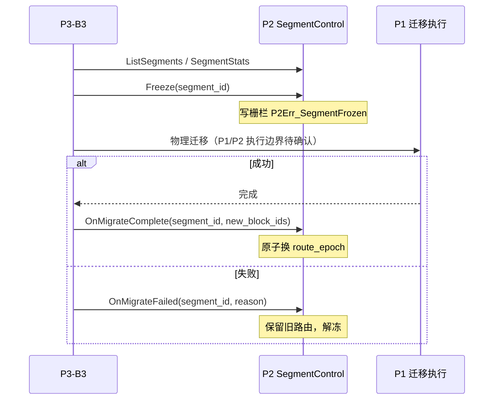

# P2 / P1 / P3 / P4 接口依赖表（v1.0）

> 合同依据：M0 交付「接口冻结」配套材料  
> 维护人：P2 技术负责人（程勇）| 版本：v1.0 | 状态：待 P1/P3/P4 联合确认

---

## 1. 使用说明

- 本表用于项目经理分派 **接口 owner** 与 M0 评审；
- 「最小字段」对齐 `proto/aether_engine.proto` FROZEN v0.1 与 `ae_kernel::SegmentControl`；
- 状态：`已冻结` = P2 侧 v0.1 已定；`待确认` = 需跨项目评审。

---

## 2. 接口总表

| ID | 方向 | 接口名称 | 数据内容 | 消费/提供方 | M0 目标 | Owner | 状态 |
|---|---|---|---|---|---|---|---|
| IF-01 | P1→P2 | Storage Block API | block 读写/sync/fence | P2 引擎 | SDK v0.1 契约 | P1 | 待确认 |
| IF-02 | P1→P2 | WAL & Recovery SDK | 统一 WAL 帧、replay | P2 引擎 | Mock 打通 | P1 | 进行中 |
| IF-03 | P1→P2 | Replication Group SDK | Raft 复制组 | P2（后续） | M-MVP 预留 | P1 | 待确认 |
| IF-04 | P2→P3 | Segment 内省 | SegmentStats、ListSegments | P3-B3 | **M0 冻结** | P2 | **已冻结** |
| IF-05 | P2→P4 | 六态统一查询 API 子集 | Vector/Object/Graph/Fusion gRPC | P4 网关 | **M0 冻结** | P2/P4 | **已冻结** |
| IF-06 | P3→P2 | Tier Migrate Callback | Freeze/Unfreeze/OnMigrate* | P2 SegmentControl | **M0 冻结** | P2/P3 | **已冻结** |
| IF-07 | P2→P1 | OTel / Trace | span、metrics | P1 监控总线 | M-MVP 导出 | P2/P1 | 进行中 |
| IF-08 | P3→P2 | Embedding 写入 | VectorService.InsertVector | E1 | 字段对齐 | P3-B1 | 待确认 |
| IF-09 | P1→P3 | Tier 执行反馈 | promote/demote 结果 | P3-B3 | M-MVP 闭环 | P1/P3 | 待确认 |
| IF-10 | P4→P2 | 协议化请求 | S3/REST/PG 映射后 gRPC | E1/E2/E3 | M-MVP 联调 | P4 | 待确认 |

---

## 3. IF-04 Segment 内省（P2→P3）

### 3.1 VectorService.SegmentStats

| 字段 | 类型 | 说明 | P3 用途 |
|---|---|---|---|
| segment_id | string | `{collection}/seg_NNNNNN` | 调度对象 ID |
| state | string | growing/sealing/sealed/frozen/archived | 可否迁移 |
| row_count | uint64 | 向量条数 | 大小估算 |
| size_bytes | uint64 | 段大小 | 容量规划 |
| index_type | string | flat/hnsw/ivfpq | 重建成本 |
| access_count | uint64 | 访问计数 | 热度信号 |

### 3.2 SegmentControlService.ListSegments

| 字段 | 说明 |
|---|---|
| engine | `vector/default` / `object/default` / `graph/default` |
| segment_ids[] | 当前引擎全部段 ID |

**E2 语义**：segment_id = bucket 名。  
**E3 语义**：单段 `graph/default`。

---

## 4. IF-06 Tier Migrate Callback（P3→P2）

### 4.1 调用序列

### 4.2 RPC 与 Rust trait 映射

| gRPC (SegmentControlService) | ae_kernel::SegmentControl |
|---|---|
| ListSegments | list_segments() |
| Freeze | freeze() |
| Unfreeze | unfreeze() |
| OnMigrateComplete | on_migrate_complete() |
| OnMigrateFailed | on_migrate_failed() |

### 4.3 错误码

| 场景 | P2Err_* |
|---|---|
| 未知 segment | NotFound |
| 非法状态转换 | Conflict |
| 冻结期写入 | SegmentFrozen |

---

## 5. IF-05 三态查询 API 子集（P2→P4）

| Service | 主要 RPC | M0 冻结 | 引擎实现 |
|---|---|---|---|
| VectorService | CreateCollection, InsertVector, DeleteVectors, SearchVector, SegmentStats | ✅ | E1 |
| ObjectService | Put/Get/Head/Delete/List, Range, PagedList, Multipart 全套 | ✅ | E2 |
| GraphService | CreateNode/Edge, ProjectVector, Traverse | ✅ | E3 |
| FusionService | VectorAnchoredSubgraph | ✅ | E3 |
| SegmentControlService | List/Freeze/Unfreeze/OnMigrate* | ✅ | 三引擎 |

详细字段见《P2_AetherEngine_API接口文档_v0.1》。

---

## 6. IF-08 P3-B1 → E1 向量写入（待确认）

| 字段 | B1 输出 | E1 InsertVector | 对齐状态 |
|---|---|---|---|
| collection | 目标集合 | collection | 待确认 |
| records[].id | chunk_id | id | 待确认 |
| records[].values | embedding | values | 待确认 |
| records[].metadata_json | metadata | metadata_json | 待确认 |
| graph_node_id | 可选 | graph_node_id | 待确认 |

---

## 7. 依赖阻塞矩阵

| 阻塞项 | 影响模块 | 当前缓解 | 期望解除 |
|---|---|---|---|
| P1 Block SDK 未冻结 | E1/E2/E3 持久化 | MockP1Client | 2026 Q3 |
| 迁移执行方未定义 | B3 闭环 | P2 仅栅栏+回调 | M0 评审确认 |
| P4 网关未就绪 | 对外演示 | ae-server demo | M-MVP |
| B1 字段未签字 | 向量写入链 | 手工 InsertVector | M-MVP 前 |

---

## 8. 变更记录

| 版本 | 日期 | 变更 |
|---|---|---|
| v1.0 | 2026-06-25 | M0 初版：IF-04/05/06 冻结，IF-01/07 进行中 |

---

## 9. 联合确认签字区（评审后填写）

| 项目 | 负责人 | 确认日期 | 签字 |
|---|---|---|---|
| P2 接口 | 程勇 | | |
| P1 接口 | 待定 | | |
| P3 接口 | 待定 | | |
| P4 接口 | 待定 | | |
| 项目经理 | 待定 | | |
