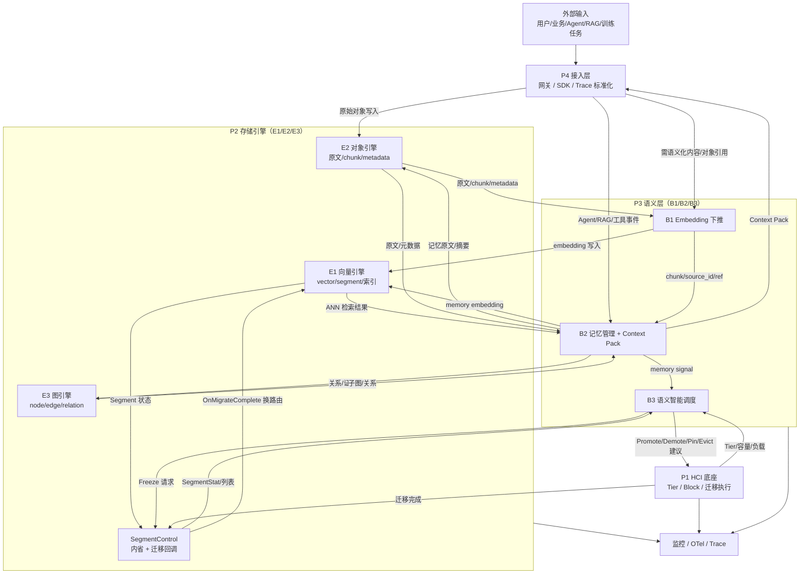
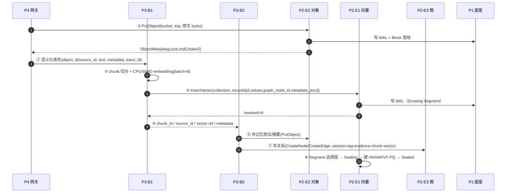
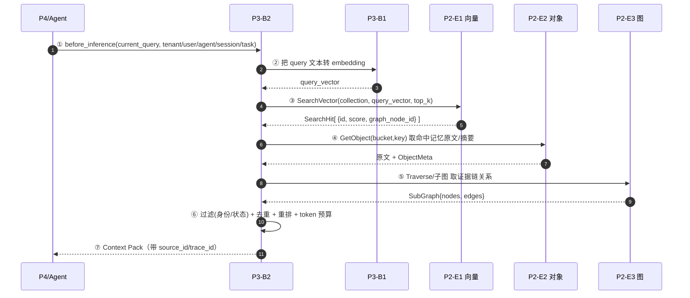
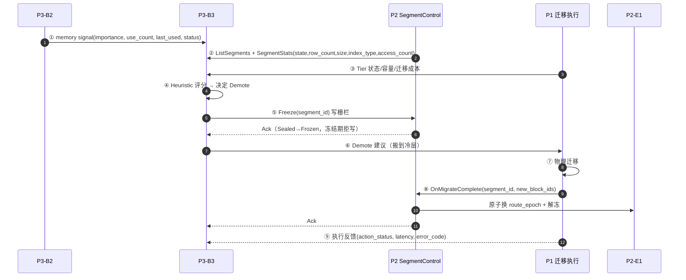

# P2 × P3 数据流转与协作分析（v1.0）

> 编制：P2 AetherEngine 项目组 | 日期：2026-06-27
> 输入依据：
> - P3《P3第一阶段阶段方案文档_公司提交版_v1.1_数据流修订版》
> - P3《P3_语义层与智能调度需求文档_v1.0》
> - P3《P2/P3 关系与接口说明_简明版》
> - P2 `proto/aether_engine.proto`（FROZEN v0.1）+ 三引擎代码实现
> 目的：梳理 P4→P3→P2→P1 全链路数据流，给出**存储**与**查询**两个端到端例子，重点说明 **P2 与 P3、P1 的对接面**，并列出**冲突 / 不协调点**与对齐建议。

---

## 0. 一个必须先澄清的命名问题

很容易混淆，先对齐口径：

| 项目 | 三个子模块 | 各自职责 |
|---|---|---|
| **P3 语义层**（兄弟组） | **B1 / B2 / B3** | B1 Embedding 下推；B2 Agent 记忆管理；B3 语义智能分层调度 |
| **P2 存储引擎**（我们） | **E1 / E2 / E3** | E1 向量引擎；E2 对象引擎；E3 图引擎 |

协作的本质是：**P3 的 B1/B2/B3 调用 P2 的 E1/E2/E3 + SegmentControl**。

对应关系一句话总览：

| P3 模块 | 主要对接 P2 的 | 关系 |
|---|---|---|
| **B1**（Embedding 下推） | **E1**（写向量）、**E2**（取原文/回写 chunk） | B1 只算 embedding，**E1 才是向量库** |
| **B2**（记忆管理） | **E1**（召回）、**E2**（存记忆原文/摘要）、**E3**（存关系/证据链） | B2 组织记忆，**P2 负责存得下、查得出** |
| **B3**（智能调度） | **SegmentControl**（内省 + 冻结/迁移回调）、**P1**（实际迁移执行） | B3 只决策，**P2 给状态 + 换路由，P1 搬数据** |

---

## 1. 三类数据 + 四层角色

P3 数据流修订版明确：系统里**不是只有"文档"一种输入**，而是三类数据在 P4 / P3 / P2 / P1 之间流转。

| 数据大类 | 典型内容 | 生产方 | 主要承载方 | 谁来消费 |
|---|---|---|---|---|
| **原始资产数据** | 文档、知识库、训练数据、模型、checkpoint、工具原文 | P4 / 业务 / Agent | **P2-E2** / P1 | B1 取原文做语义化 |
| **语义派生数据** | chunk、embedding、summary、memory unit、relation、Context Pack | **P3**（B1/B2 生成） | **P2-E1/E2/E3** | B2 召回、B3 建模 |
| **运行/调度状态** | SegmentStat、Tier 状态、访问日志、调度动作、执行反馈 | P2 / P1 / 监控 | P2 / P1 / 监控 | **B3** 决策 + 评审追踪 |

四层角色职责边界（不可越界）：

```text
P4 接入层   ：协议网关 / SDK / Agent 入口 / trace 标准化
P3 语义层   ：B1 语义化  · B2 记忆化  · B3 调度决策（只决策，不搬数据）
P2 引擎层   ：E1 向量  · E2 对象  · E3 图  · SegmentControl（内省+迁移回调）
P1 资源底座 ：Block / WAL / Raft / Tier / 物理迁移执行
```

---

## 2. 全局数据流总图



**三条主干**：
1. **写入流**（B1→E1/E2）：把文本变成向量 + 原文，存进 P2。
2. **召回流**（B2↔E1/E2/E3）：Agent 推理前，B2 从 P2 查回内容，组装 Context Pack。
3. **调度流**（B3↔SegmentControl↔P1）：B3 拿 P2 状态 + 记忆信号做决策，P1 执行迁移，P2 换路由。

---

## 3. 存储例子（端到端）：一段 RAG 证据写入

**场景**：Agent 回答时用到一段检索证据，需要语义化并长期保存，供后续跨会话召回。



**逐环节字段（关键）**：

| 步 | 调用 | P2 实际接口 | 入参要点 | 返回 |
|---|---|---|---|---|
| ① | 存原文 | `ObjectService.PutObject` | bucket、key、data | `ObjectMeta{etag=MD5, size, md5_hex, blake3_hex}` |
| ④ | 写向量 | `VectorService.InsertVector` | collection、`VectorRecord{id, values[], graph_node_id?, metadata_json?}` | `inserted: u64` |
| ⑦ | 写关系 | `GraphService.CreateNode/CreateEdge` | `NodeRecord{id, properties_json?}`、`EdgeRecord{id, src, dst, label?, properties_json?}` | Node/Edge |
| ⑧ | 封段建索引 | E1 内部 `seal()` | 阈值触发，IndexKind=HNSW/IVF-PQ 自适应 | Segment 转 Sealed |

> 说明：P2 当前 `InsertVector` 返回的是**写入条数**，不是 P3-B1 期望的 `embedding_ref`；约定上 ref = `(collection, id)`，详见冲突 §6-④。

---

## 4. 查询例子（端到端）：Agent 推理前构建 Context Pack

**场景**：用户在新会话里追问，B2 需要召回历史记忆 + 证据，拼成 Context Pack 给 Agent。



**逐环节字段**：

| 步 | 调用 | P2 实际接口 | 入参 | 返回 |
|---|---|---|---|---|
| ③ | 向量召回 | `VectorService.SearchVector` | collection、query[]、top_k | `SearchHit[{id, score, graph_node_id}]` |
| ④ | 取原文 | `ObjectService.GetObject` / `GetObjectRange` | bucket、key（、start/end） | `ObjectBytes{data, meta}` |
| ⑤ | 取关系 | `GraphService.Traverse` | start_node_id、depth | `SubGraph{nodes[], edges[]}` |

> ⚠️ 第 ③ 步是**最大的不协调点**：P2 的 `SearchVector` 只接受 `(collection, query, top_k)`，**不支持按 tenant/user/agent/status 过滤**；而 B2 的"安全召回"要求必须按身份和状态隔离。详见冲突 §6-①。

---

## 5. 调度闭环例子：B3 让一个冷 Segment 降冷

**场景**：B3 判断某向量 Segment 长期低热，建议下沉到冷层。



**关键边界**：
- **B3 不搬数据**，只输出 Promote/Demote/Pin/Evict/Prefetch/Keep 建议；
- **P1 执行物理迁移**；
- **P2 只做两件事**：① 通过 SegmentControl 暴露状态（内省）；② `Freeze` 写栅栏 + `OnMigrateComplete` 原子换路由。
- P2 当前 `SegmentControl` 只有 `Freeze/Unfreeze/OnMigrateComplete/OnMigrateFailed` 四个方法，**没有 Promote/Demote/Pin/Evict 这些动词**——这是设计取舍，不是缺陷，但需双方书面确认（见冲突 §6-⑤）。

---

## 6. 冲突与不协调点（重点）

按严重程度排列。🔴=阻塞 MVP 联调，🟡=需对齐字段/约定，🟢=理解偏差需澄清。

### 🔴 ① 向量检索不支持元数据/多租过滤（最严重）

| | 内容 |
|---|---|
| **P3 要什么** | B2 安全召回要求 `SearchVector` 能按 `tenant/user/agent/status` 过滤（需求文档 §13.4、简明版 §8） |
| **P2 现状** | `SearchVector(collection, query, top_k)`，**无 filter 参数**；`metadata_json` 是不透明字符串，不可查询 |
| **后果** | B2 无法做"按身份+状态隔离召回"，存在跨用户/跨租户误召回风险，且无法过滤 expired/disabled/deleted 记忆 |
| **建议** | proto v0.2 给 `SearchVectorRequest` 增加 `filter`（结构化谓词或 metadata kv），E1 检索时按 metadata 过滤 + tombstone 已支持。**向后兼容新增，不破坏 v0.1** |

### 🔴 ② 对象引擎无自定义元数据字段

| | 内容 |
|---|---|
| **P3 要什么** | B2 要把记忆的 `tenant/user/status/version/source_id/memory_type` 等挂在对象上（Memory Schema §5.9） |
| **P2 现状** | `ObjectMeta` 只有 `bucket/key/etag/size/md5_hex/blake3_hex`，**没有用户自定义 metadata/tags 字段** |
| **后果** | 记忆元数据只能塞进对象 body 或另建表，P2 侧无法按元数据列举/过滤对象 |
| **建议** | `PutObjectRequest` + `ObjectMeta` 增加 `metadata: map<string,string>`；或明确"记忆元数据由 B2 自管，E2 只存字节"。需 PM 拍板归属 |

### 🔴 ③ SegmentStat 缺 `hit_rate` / `tier`，且只有 E1 暴露

| | 内容 |
|---|---|
| **P3 要什么** | B3 调度输入信号要 `segment_id, engine, state, row_count, size, index_type, access_count, hit_rate, tier`（B3 §6.8） |
| **P2 现状** | `SegmentStat` 只有 `segment_id/state/row_count/size_bytes/index_type/access_count`，**无 hit_rate、无 tier**；且 `SegmentStats` RPC **只在 VectorService（E1）**，E2/E3 没有等价富状态接口 |
| **后果** | B3 拿不到命中率和当前层级，冷热判断退化；对象/图对象无法纳入统一调度视图 |
| **建议** | ①`SegmentStat` 增 `hit_rate`、`tier`；② E2/E3 提供等价 stats（或 SegmentControl 统一返回富状态）。tier 也可由 P1 提供，需明确归属 |

### 🟡 ④ Embedding 写入返回值不是 `embedding_ref`

| | 内容 |
|---|---|
| **P3 期望** | B1 写入后拿到 `embedding_ref`（供 B2 引用召回） |
| **P2 现状** | `InsertVector` 返回 `inserted: u64`（条数） |
| **建议** | 约定 `embedding_ref = (collection, id)`，B1 写入时自带 id 即为 ref；或 InsertVector 返回 refs 列表。属轻量约定，不阻塞 |

### 🟡 ⑤ 调度动作语义：P2 不收 Promote/Demote，只收迁移回调

| | 内容 |
|---|---|
| **P3 表述** | `B3 → P1/P2: Promote/Demote/Pin/Prefetch/Evict/Keep`（含 P2 作为接收方之一） |
| **P2 现状** | SegmentControl 只有 `Freeze/Unfreeze/OnMigrateComplete/OnMigrateFailed`，**不接受 tier 动词** |
| **本质** | 这其实是**合理分工**：P3=策略，P1=物理执行，P2=写栅栏+换路由。但 P3 文档把 P2 也写成动作接收方，易误解 |
| **建议** | 书面确认：**tier 动作只发 P1；P2 只参与 Freeze + OnMigrateComplete 回调**。在接口表里把 IF-B3-P1P2-01 拆成 "B3→P1 动作" 和 "B3/P1→P2 SegmentControl" 两条 |

### 🟡 ⑥ 调度粒度不匹配（对象级 vs Segment 级）

| | 内容 |
|---|---|
| **P3 想要** | B3 想对**单个对象/单条记忆/单个 chunk**做冷热调度 |
| **P2 现状** | E1 冻结/迁移是 **Segment 级**；E2 是 **bucket 级**；E3 是**整图单段**（whole-instance fence） |
| **后果** | B3 想降冷某个冷对象，但 P2-E2 只能整桶冻结；E3 一冻全冻 |
| **建议** | 明确 MVP 调度对象粒度 = **Segment/bucket**（粗粒度），单对象级冷热推迟到 M1；或 E2 引入对象分组段。需写入接口表 |

### 🟡 ⑦ 全局 ID 体系未统一（source_id/chunk_id/memory_id/object_id）

| | 内容 |
|---|---|
| **P3 依赖** | 全链路追溯强依赖统一的 `source_id` 贯穿 object/chunk/vector/memory/relation |
| **P2 现状** | E1 用 `id`、E2 用 `bucket/key`、E3 用 node `id`，靠 `graph_node_id` 关联向量↔图；**无统一 source_id 概念**，只能塞 `metadata_json` |
| **建议** | 联合定义 ID 规范：`source_id` 作为跨引擎贯穿键，约定 `vector.id`、`object.key`、`graph node.id` 与 source_id 的映射规则。属 M0 接口冻结收尾项 |

### 🟢 ⑧ 融合查询方向不同（理解差异）

| | 内容 |
|---|---|
| **P2 提供** | `VectorAnchoredSubgraph`：**向量→图**单读路径（先向量锚点，再 k-hop），且要求向量已 `project_vector` 投影进 E3 节点 |
| **P3 实际用** | B2 主要要的是**证据链/关系追溯**（图关系查询），用 `Traverse` + 关系即可，不一定走 VectorAnchoredSubgraph |
| **结论** | 不冲突，但**侧重点不同**。P2 的融合算子是加分项；P3 MVP 用基础 `Traverse`/关系查询就够。需告知 P3：用融合算子要额外做向量投影 |

### 🟢 ⑨ 距离度量 / 归一化

| | 内容 |
|---|---|
| **P3 问** | "P2 用 cosine / inner product / L2？要不要 normalize？"（B1 §4.12） |
| **P2 答** | **统一 cosine**（向量 L2 归一化后算）。B1 输出向量需归一化，维度需与 collection 一致 |
| **结论** | 直接回复即可，无冲突 |

---

## 7. B1/B2/B3 × E1/E2/E3 配合矩阵

| | **E1 向量** | **E2 对象** | **E3 图** | **SegmentControl** |
|---|---|---|---|---|
| **B1** Embedding | ✅ 写 embedding（InsertVector） | ◻ 取原文/回写 chunk | △ 可选写 object-chunk-vector 关系 | — |
| **B2** 记忆 | ✅ 召回（SearchVector）⚠️无过滤 | ✅ 存/取记忆原文摘要 ⚠️无自定义元数据 | ✅ 存证据链/取子图 | — |
| **B3** 调度 | ◻ 读 Segment 状态 ⚠️缺 hit_rate/tier | ◻ 读对象状态 ⚠️无富 stats | ◻ 读关系 | ✅ Freeze + 迁移回调；动作发 P1 |

✅=核心链路 ◻=读状态 △=可选 ⚠️=有冲突点（见 §6）

---

## 8. 对齐建议与待确认清单（给 PM / 联调）

| # | 待确认 | 关联冲突 | 期望 owner | 优先级 |
|---|---|---|---|---|
| 1 | 向量检索是否支持 tenant/user/agent/status 过滤？v0.2 是否加 filter | ① | P2 向量 + P3-B2 | 🔴 P0 |
| 2 | 记忆元数据由 E2 存（加 metadata 字段）还是 B2 自管？ | ② | P2 对象 + P3-B2 | 🔴 P0 |
| 3 | SegmentStat 是否加 hit_rate/tier？E2/E3 是否提供富 stats？tier 谁给 | ③ | P2 + P1 + P3-B3 | 🔴 P0 |
| 4 | embedding_ref 约定为 (collection,id) 还是 InsertVector 返回 refs | ④ | P2 向量 + P3-B1 | 🟡 P1 |
| 5 | tier 动作只发 P1，P2 仅 Freeze+回调——书面确认 | ⑤ | P1/P2/P3-B3 | 🟡 P0 |
| 6 | MVP 调度粒度 = Segment/bucket（粗）还是对象级 | ⑥ | P2 + P3-B3 | 🟡 P1 |
| 7 | 统一 source_id 规范及与 vector.id/object.key/node.id 映射 | ⑦ | P2 + P3 总 | 🟡 P0 |
| 8 | 是否使用 VectorAnchoredSubgraph？需 project_vector 投影 | ⑧ | P2 + P3-B2 | 🟢 P2 |
| 9 | 确认距离=cosine，B1 输出归一化、维度对齐 collection | ⑨ | P2 向量 + P3-B1 | 🟢 P1 |
| 10 | MVP 是否允许 P2 部分接口 mock（B1/B2 先用测试库） | 全部 | PM | 🟡 P0 |

---

## 9. 一页结论

1. **命名先对齐**：P3=B1/B2/B3，P2=E1/E2/E3；配合 = B1→E1、B2→E1/E2/E3、B3→SegmentControl+P1。
2. **三条数据流清晰**：写入（B1→E1/E2）、召回（B2↔E1/E2/E3）、调度（B3↔SegmentControl↔P1），整体设计自洽，能在 12-01 MVP 跑通最小闭环。
3. **3 个 🔴 阻塞点必须 M0/联调前解决**：①向量检索缺过滤、②对象缺自定义元数据、③SegmentStat 缺 hit_rate/tier 且仅 E1 暴露——都可以用 **v0.2 向后兼容新增**解决，不破坏已冻结的 v0.1。
4. **2 个 🟡 边界点需书面确认**：调度动作只发 P1（P2 只做 Freeze+换路由）、调度粒度先粗（Segment/bucket）。
5. **2 个 🟢 是理解差异**：融合算子方向、距离度量，澄清即可。
6. **核心共识**：P2 管"存得下、查得出、状态暴露得出、路由换得了"；P3 管"语义化、记忆化、调度决策"；P1 管"物理执行"。三方边界没有根本矛盾，主要是**字段级接口尚未对齐 + ID 体系未统一**。
