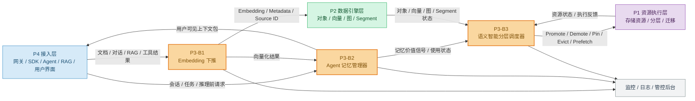
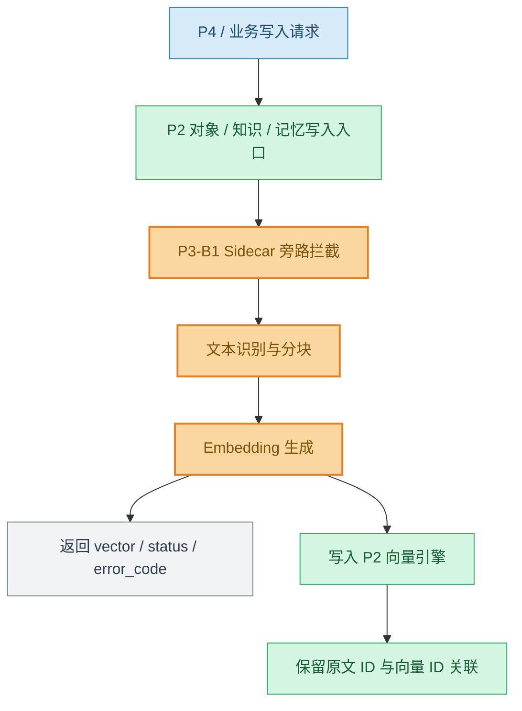
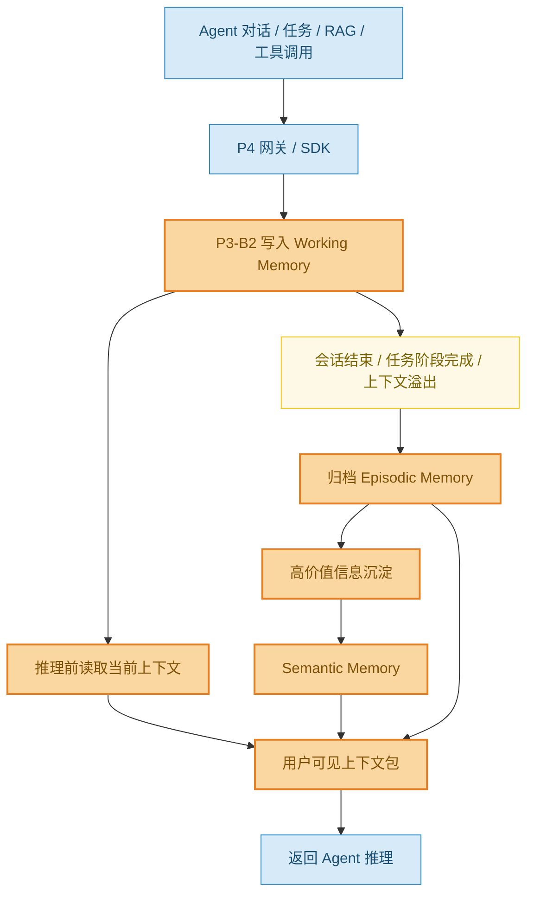
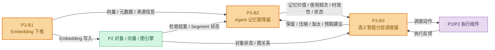
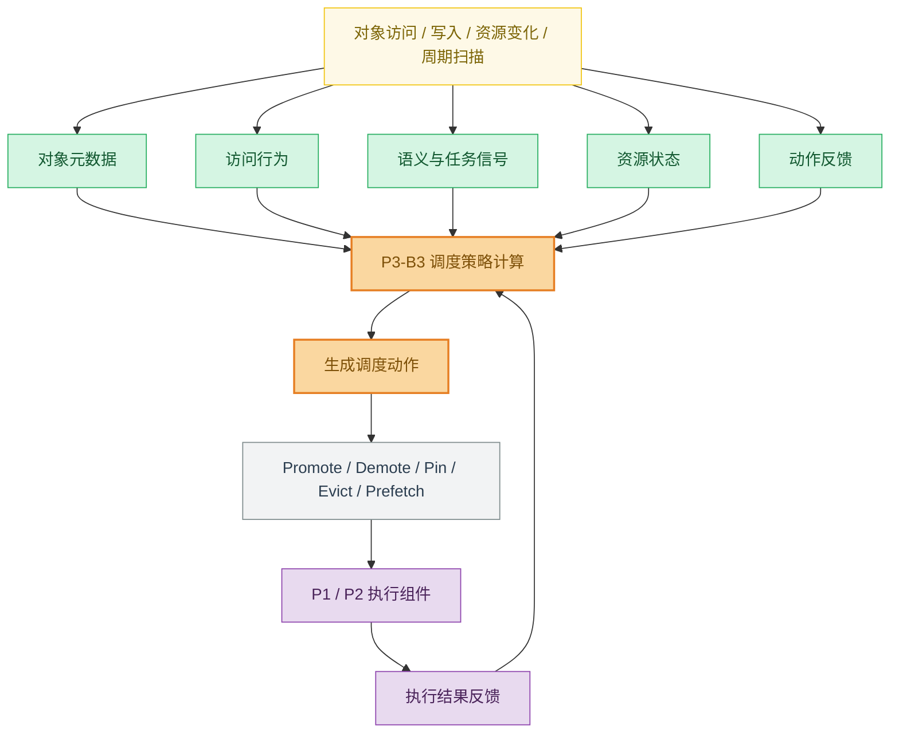
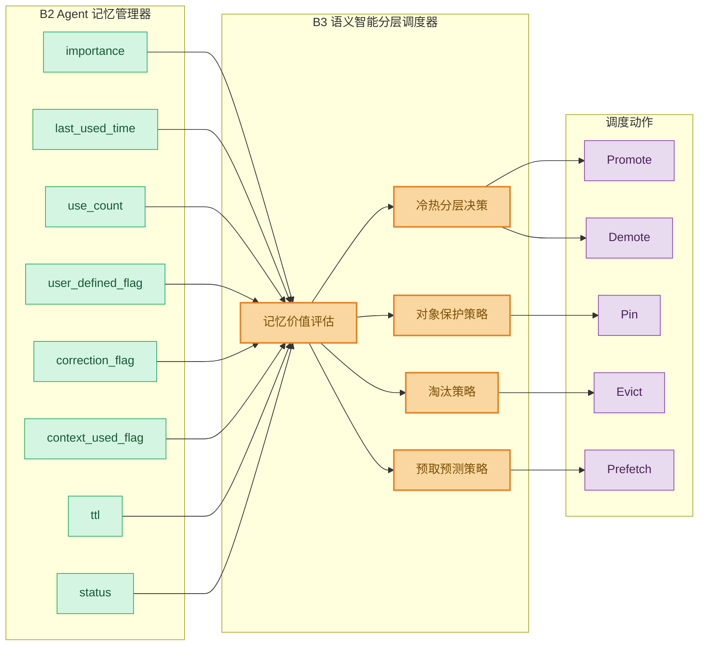

# P3 语义层与智能调度需求文档（v1.0 修订版）

## 1. 文档说明

### 1.1 编写目的

本文档用于明确 P3 语义层与智能调度模块在捷云盛多智能体项目中的定位、接入方式、输入输出、核心功能、外部依赖、阶段交付内容和待确认问题。

本文档重点回答以下问题：

1. P3 在整体项目中以什么形式接入；
2. P3 与 P1 存储底座、P2 数据引擎、P4 接入网关及 Agent/RAG 业务流程之间的关系；
3. P3 从哪些模块获取数据；
4. P3 对外输出什么能力和结果；
5. P3 当前阶段需要实现哪些功能需求；
6. 哪些内容需要项目经理、甲方或其他模块负责人确认。

本文档不是详细设计文档，不展开具体算法参数、模型结构、代码实现方式和底层存储实现细节。文档中的接口字段为需求评审阶段的最小字段集合，用于对齐模块边界和接口 owner，不代表最终接口协议。

### 1.2 文档适用范围

本文档适用于 P3 语义层与智能调度相关需求分析，包括：

- B1：Embedding 下推；
- B2：Agent 记忆管理器；
- B3：语义智能分层调度器；
- P3 与 P1/P2/P4/Agent/RAG/工具调用流程之间的接口关系；
- P3 当前阶段需求边界和验收关注点。

---

## 2. 行业痛点与建设价值

当前 Agent 和 RAG 系统在企业级落地过程中，普遍面临以下问题：

1. **长上下文持续膨胀，推理成本高，有效信息难筛选。**  
   多轮对话、文档片段、工具调用结果和 RAG 证据不断累积，如果缺少统一的上下文管理机制，容易导致 Prompt 变长、成本上升、关键信息被稀释。

2. **历史对话、任务过程、工具结果和知识证据缺少统一记忆管理。**  
   Agent 在跨会话、长任务和多步骤执行过程中，需要恢复历史状态、复用任务经验和追溯证据来源。若只依赖当前上下文窗口，难以支撑长期任务连续执行。

3. **底层存储调度缺少语义感知能力。**  
   传统 LRU/LFU 等策略主要依据访问时间和访问频率，难以判断某段记忆、某个向量 Segment 或某类知识片段对当前任务是否重要，也难以体现业务优先级和语义价值。

因此，P3 的建设价值在于：在 Agent/RAG 业务流程与底层对象、向量、图和存储资源能力之间，引入语义化、记忆化和智能调度能力，形成“用户可见态 ↔ 向量库态”的上下文闭环。

---

## 3. 术语与缩略语

| 术语 | 说明 |
|---|---|
| P1 | 底层存储资源与执行层，负责存储资源、冷热层级、迁移执行等能力 |
| P2 | 数据引擎层，提供对象、向量、图、Segment 状态等能力 |
| P3 | 语义层与智能调度模块，负责语义化、记忆管理和分层调度决策 |
| P4 | 网关、SDK、Agent/RAG 入口、用户界面和业务接入层 |
| B1 | Embedding 下推模块，负责写入链路中的语义化与向量化处理 |
| B2 | Agent 记忆管理器，负责三层记忆管理和用户可见上下文构建 |
| B3 | 语义智能分层调度器，负责语义资源调度决策 |
| Working Memory | 当前会话和当前任务的短期记忆 |
| Episodic Memory | 历史事件型记忆，如历史对话、任务轨迹、工具调用记录等 |
| Semantic Memory | 长期语义记忆，如用户偏好、长期规则、领域知识、任务经验等 |
| 用户可见态 | Agent 推理前可直接使用的上下文包，包含摘要、记忆、证据和任务状态 |
| 向量库态 | 已完成切分、向量化、索引和元数据绑定后的语义资源状态 |
| Segment | 向量或对象引擎中的分段、分片或可调度管理单元 |
| Tier | 存储资源层级，例如热层、温层、冷层等 |
| Promote | 将对象、记忆或 Segment 升温到更高性能层级 |
| Demote | 将对象、记忆或 Segment 降温到更低成本层级 |
| Pin | 对高价值对象进行固定或保护，避免被淘汰 |
| Evict | 淘汰或释放低价值对象 |
| Prefetch | 根据预测提前加载可能被访问的对象或记忆 |

---

## 4. P3 模块定位

P3 是整个项目中的语义层与智能调度层，位于上层 Agent/RAG 业务流程与底层对象、向量、图、存储资源能力之间。

P3 不直接承担底层对象存储、向量索引、图存储、物理迁移和网关接入能力，而是围绕 AI Agent 和 RAG 场景中的上下文、记忆、语义资源和冷热调度提供语义处理能力。

P3 的核心目标是：

> 对进入系统的文本、记忆、知识片段和任务上下文进行语义化处理，形成可管理、可召回、可追溯、可调度的记忆与语义资源，并基于访问行为、语义价值、任务上下文和资源状态生成分层调度决策。

P3 的三个核心子模块为：

| 子模块 | 模块名称 | 核心职责 |
|---|---|---|
| B1 | Embedding 下推 | 在存储侧或写入链路旁路完成文本、记忆、知识片段的向量化处理 |
| B2 | Agent 记忆管理器 | 管理当前会话记忆、历史事件记忆、长期语义记忆，并构建 Agent 推理前可用上下文 |
| B3 | 语义智能分层调度器 | 基于对象价值、访问行为、语义任务和资源状态生成放置、迁移、淘汰、预取等调度动作 |

---

## 5. P3 总体接入架构

P3 不作为独立孤岛运行，而是通过 P4 获取业务入口和 Agent/RAG 上下文，通过 P2 获取对象、向量、图和 Segment 状态，通过 P1/P2 执行组件完成实际资源调度动作。

图中颜色说明：蓝色表示 P4/业务入口，橙色表示 P3 语义层与智能调度模块，绿色表示 P2 数据引擎层，紫色表示 P1 资源执行层，灰色表示监控、日志和管控后台。

---

## 6. P3 在整体项目中的接入形态

P3 不是单一功能点，而是以三种形态接入整个项目：写入旁路接入、Agent 运行流程接入和调度决策服务接入。

### 6.1 写入旁路接入

对应模块：B1 Embedding 下推。

P3 在文档、记忆、知识片段或其他文本类对象写入系统时，通过 Sidecar、Node Agent、SDK Hook、旁路代理或消息链路接入写入流程，对需要语义化的数据进行识别、拦截、向量化和结果回传。

该接入形态的目标是让文本类数据在进入存储系统时即可形成向量表示，为后续语义检索、Agent 记忆管理和分层调度提供基础。

### 6.2 Agent 运行流程接入

对应模块：B2 Agent 记忆管理器。

P3 接入 Agent 多轮对话、推理前上下文构建、会话结束归档、任务执行、RAG 调用和工具调用流程，负责记录、归档、召回和整理 Agent 运行过程中产生的上下文信息。

#### 6.2.1 记忆写入、归档与上下文构建流程

#### 6.2.2 B2 与 B1/B3 的衔接关系

该接入形态的目标是支撑 Agent 当前会话连续性、跨会话信息恢复、长期知识沉淀和用户可控记忆管理。

### 6.3 调度决策服务接入

对应模块：B3 语义智能分层调度器。

P3 作为独立调度服务或平台组件接入上层业务、Agent 记忆管理器与底层对象、向量、图及资源执行组件之间。调度器负责汇聚对象状态、访问行为、语义任务、资源状态和动作反馈，生成标准化调度动作。

该接入形态的目标是让系统不再只依赖 LRU、LFU 等传统策略，而是能够根据语义价值、业务优先级、任务阶段和资源成本进行智能分层调度。

---

## 7. P3 与外部模块关系

### 7.1 P3 与 P4 的关系

P4 是网关、SDK、业务入口、用户界面和 Agent/RAG 调用入口。P3 通过 P4 获取用户请求、会话上下文、Agent 任务信息、RAG 调用记录、工具调用结果和用户记忆操作请求。

| P4 向 P3 提供 | P3 向 P4 返回 |
|---|---|
| 用户请求 | 向量化处理状态 |
| tenant_id | 记忆写入结果 |
| user_id | 记忆召回结果 |
| session_id | Agent 推理前用户可见上下文 |
| agent_id | 记忆查看、修改、删除结果 |
| task_id | 调度状态 |
| 文档写入请求 | 错误码和日志标识 |
| 记忆写入请求 |  |
| RAG 调用记录 |  |
| 工具调用结果 |  |
| 用户查看、修改、删除记忆请求 |  |
| trace_id |  |

### 7.2 P3 与 P2 的关系

P2 提供对象引擎、向量引擎和图引擎能力。P3 不负责实现这些底层引擎，而是依赖 P2 完成原始数据保存、向量写入、向量检索、图关系查询和 Segment 状态获取。

| P3 从 P2 获取 | P3 向 P2 输出 |
|---|---|
| 对象元数据 | embedding 结果 |
| 原始文档或知识片段 | 记忆元数据 |
| chunk 信息 | 向量写入请求 |
| 向量写入接口 | 语义检索请求 |
| 向量检索接口 | 记忆检索请求 |
| Segment 状态 | Segment 调度建议 |
| 图节点和图关系 | 对象关联调度需求 |
| 对象访问记录 |  |
| 索引状态 |  |
| 当前数据所在层级 |  |

### 7.3 P3 与 P1 的关系

P1 提供底层存储、资源层级、冷热介质、数据迁移和资源执行能力。P3 不直接执行物理迁移，不直接管理硬件资源，而是通过调度接口向 P1/P2 资源执行组件输出调度建议或动作。

| P3 从 P1/P2 获取 | P3 向 P1/P2 输出 |
|---|---|
| Tier 层级定义 | promote |
| 各层容量 | demote |
| 各层访问时延 | pin |
| 当前负载 | unpin |
| 迁移成本 | prefetch |
| 资源状态 | evict hint |
| 迁移执行结果 | migration hint |
| 异常与失败反馈 | 调度原因 |
|  | 优先级 |
|  | trace_id |

### 7.4 P3 与监控/日志系统关系

P3 需要接入统一监控和日志系统，用于记录：

- Embedding 请求耗时；
- Sidecar 拦截成功率；
- 记忆写入延迟；
- 记忆召回命中率；
- 上下文构建耗时；
- 调度决策耗时；
- 调度动作分布；
- 迁移执行结果；
- 异常和降级情况。

这些日志和指标用于联调、验收、问题定位和后续策略优化。

---

## 8. P3 内部模块关系

P3 内部三个模块之间存在明确的数据流和控制流关系。

### 8.1 B1 到 B2

B1 负责将文本、记忆、知识片段等对象转成向量化结果，并保留原文 ID、chunk ID、来源类型和元数据。B2 使用 B1 的输出结果建立和管理记忆体系，包括 Working Memory、Episodic Memory 和 Semantic Memory。

| B1 输出项 | B2 使用方式 |
|---|---|
| chunk_id | 作为记忆片段、文档片段的最小关联单位 |
| source_id | 追溯原始文档、会话、任务或工具调用来源 |
| source_type | 区分对话、文档、RAG 证据、工具结果等来源 |
| embedding | 支撑记忆召回、相似检索和语义相关性判断 |
| metadata | 支撑权限、时间、租户、任务和状态管理 |
| 处理状态 | 判断是否进入记忆归档和后续重试流程 |

### 8.2 B2 到 B3

B2 是 B3 的主要语义信号来源之一。B2 记录记忆是否被使用、是否有帮助、是否被纠错、是否为用户显式设定、是否进入当前上下文，并将这些信息作为记忆价值信号提供给 B3。

B3 使用 B2 输出的记忆价值信息，结合访问行为、资源状态和对象元数据，判断对应记忆或底层数据是否需要升温、降温、压缩、淘汰或保护。

| B2 输出项 | B3 使用方式 |
|---|---|
| memory_id | 标识被调度或评估的记忆对象 |
| memory_type | 区分 Working、Episodic、Semantic 等记忆类型 |
| importance | 判断记忆价值和保护优先级 |
| last_used_time | 判断时效性和冷却程度 |
| use_count | 判断访问热度和复用价值 |
| user_defined_flag | 判断是否为用户显式记忆，避免误删误淘汰 |
| correction_flag | 判断该记忆是否被用户纠错、禁用或降权 |
| context_used_flag | 判断该记忆是否进入过当前推理上下文 |
| ttl | 判断生命周期和过期策略 |
| status | 判断记忆是否有效、归档、禁用或删除 |

### 8.3 B3 对 B1/B2 的反馈

B3 不直接改变 B1 的向量化逻辑，但可以通过调度结果影响记忆和向量化资源的保存位置、优先级和生命周期。

B3 对 B2 的反馈包括：

- 哪些记忆应保留；
- 哪些记忆应降权；
- 哪些记忆应压缩；
- 哪些记忆应淘汰；
- 哪些记忆应提前加载；
- 哪些用户显式记忆应保护。

---

## 9. P3 数据来源

P3 的数据来源包括业务输入数据、Agent 运行数据、语义处理数据、资源状态数据和反馈数据。

| 数据类型 | 主要来源 | 使用模块 | 用途 |
|---|---|---|---|
| 文档/知识片段 | P4/P2 对象写入链路 | B1、B2 | 向量化、知识记忆沉淀 |
| 多轮对话 | Agent 对话流程/P4 | B2、B3 | 当前会话记忆、历史归档、上下文构建 |
| 任务执行过程 | Agent 任务流程 | B2 | 任务恢复、跨会话续接 |
| 工具调用结果 | Agent 工具链 | B2 | 任务复盘、上下文恢复 |
| RAG 调用记录 | RAG 流程/P4/P2 | B2 | 问题—证据—回答追溯 |
| 用户显式设定 | 用户界面/P4 | B2、B3 | 高可信长期记忆和保护规则 |
| 外部语义结果 | B1/P2 向量检索 | B2、B3 | 记忆召回、语义相关性判断 |
| 对象元数据 | P2 对象引擎 | B3 | 调度对象建模 |
| Segment 状态 | P2 向量引擎 | B3 | Segment 级调度 |
| 图关系数据 | P2 图引擎 | B3 | 关联调度、预取 |
| 访问日志 | P4/P2/监控系统 | B3 | 访问热度、命中率评估 |
| 资源层级状态 | P1/P2 | B3 | 调度动作可行性判断 |
| 调度执行反馈 | P1/P2 执行组件 | B3 | 策略评估和闭环更新 |

---

## 10. P3 输出结果

P3 对外输出包括语义处理结果、记忆管理结果、上下文构建结果和调度结果。

| 输出结果 | 输出对象 | 作用 |
|---|---|---|
| embedding 结果 | P2 向量引擎 / B2 记忆管理器 | 支撑向量检索和记忆召回 |
| 向量化处理状态 | P4 / 写入链路 / 管控后台 | 表示向量化是否成功、失败或排队 |
| 记忆写入结果 | Agent / P4 / 系统后台 | 表示当前信息是否成功进入记忆体系 |
| 用户可见上下文包 | Agent 推理流程 | 推理前提供可用上下文 |
| 记忆查看/修改/删除结果 | 用户界面 / 后台 | 支撑用户可控记忆 |
| 记忆价值信号 | B3 调度器 | 支撑冷热分层和保护策略 |
| 调度动作 | P1/P2 执行组件 | 触发升温、降温、迁移、淘汰、预取 |
| 调度状态与反馈指标 | 监控/后台/验收系统 | 支撑效果评估和问题定位 |

---

## 11. 核心功能需求

### 11.1 B1 Embedding 下推功能需求

#### 11.1.1 模块目标

B1 建设一套部署在存储侧或写入链路旁路的向量化能力，在数据写入或进入记忆、知识库流程时完成文本识别、拦截、Embedding 生成、结果返回或落地。

#### 11.1.2 功能需求

| 编号 | 需求项 | 需求描述 | 优先级 |
|---|---|---|---|
| B1-FR-01 | 写入拦截 | 能在存储写入链路中识别需要向量化的文本、记忆和知识片段 | P0 |
| B1-FR-02 | 向量化处理 | 能在存储侧完成 Embedding 生成，并返回向量或写入约定位置 | P0 |
| B1-FR-03 | 节点绑定 | Sidecar 能与存储节点绑定运行，参与真实或准真实读写链路 | P0 |
| B1-FR-04 | 向量结果关联 | 向量结果应保留与原始文本、文档块、记忆对象之间的关联 ID | P0 |
| B1-FR-05 | SIMD 预研支撑 | 完成基础矩阵乘法 SIMD 指令集预研，支撑后续 CPU 向量化性能优化 | P0 |
| B1-FR-06 | 吞吐性能支撑 | 在压测环境下，旁路拦截与向量化整体吞吐稳定达到合同目标 | P0 |
| B1-FR-07 | 长文本适配 | 支持极端长文本、不同文本长度和不同输入类型的处理验证 | P1 |
| B1-FR-08 | 异常降级 | 支持异常断连、吞吐抖动、节点宕机、网络延迟等场景下的可用性验证 | P1 |

#### 11.1.3 输入数据

- 文档文本；
- 记忆文本；
- 知识库片段；
- Agent 对话片段；
- RAG 证据片段；
- 工具调用返回文本；
- 原始对象 ID；
- chunk ID；
- metadata；
- request_id。

#### 11.1.4 输出数据

- embedding vector；
- status；
- error_code；
- latency；
- source_id；
- chunk_id；
- request_id；
- metadata；
- trace_id。

#### 11.1.5 外部依赖

B1 依赖甲方或其他模块提供：

- 存储写入入口；
- 请求协议和字段样例；
- 存储节点清单；
- CPU/指令集信息；
- 部署权限；
- 向量落地接口；
- 压测环境；
- 测试数据；
- 日志权限。

### 11.2 B2 Agent 记忆管理器功能需求

#### 11.2.1 模块目标

B2 面向大模型智能体的多轮对话、知识库调用和长期任务执行过程，负责将当前会话上下文、历史交互记录和长期语义知识沉淀为可管理、可追溯、可压缩、可召回的记忆体系。

B2 支撑 Agent 在当前会话中保持上下文连续，在跨会话场景中恢复历史信息，并在长期运行中沉淀可复用的用户偏好、领域知识和任务经验。

#### 11.2.2 记忆数据来源

B2 的数据来源包括：

- 多轮对话；
- 任务执行过程；
- 工具调用结果；
- RAG 调用记录；
- 用户显式设定；
- 外部语义结果；
- 运行反馈。

每类数据进入记忆体系后，应保留来源信息，便于后续追溯、纠错和删除。

#### 11.2.3 接入流程需求

| 编号 | 接入流程 | 需求描述 | 优先级 |
|---|---|---|---|
| B2-FR-01 | Agent 对话流程 | 每轮对话自动写入当前上下文 | P0 |
| B2-FR-02 | Agent 推理前流程 | 推理前返回整理后的可用上下文 | P0 |
| B2-FR-03 | 会话结束流程 | 会话结束后自动归档有效信息 | P0 |
| B2-FR-04 | 任务执行流程 | 记录任务目标、步骤、结果和未完成事项 | P1 |
| B2-FR-05 | RAG 调用流程 | 记录问题—证据—回答的关联关系 | P0 |
| B2-FR-06 | 工具调用流程 | 记录工具调用结果、错误和关键返回值 | P1 |
| B2-FR-07 | 用户产品界面 | 支持用户查看、添加、修改、删除记忆 | P1 |
| B2-FR-08 | 调优师后台 | 支持配置 Agent 级长期知识和记忆策略 | P1 |
| B2-FR-09 | 系统管理后台 | 展示记忆延迟、归档状态、压缩效果和异常情况 | P1 |
| B2-FR-10 | 外部调度/存储环节 | 输出记忆重要性、时效性、使用频次等价值信号 | P0 |

#### 11.2.4 记忆分层需求

B2 应支持以下四类核心能力：

| 功能部分 | 保存或处理内容 | 触发时机 | 主要能力 |
|---|---|---|---|
| Working Memory 当前会话记忆 | 当前多轮对话、任务状态、临时上下文、最近工具结果 | 每轮对话、任务执行中 | 快速读写、短期保存、自动过期、上下文恢复 |
| Episodic Memory 历史事件记忆 | 历史对话、任务轨迹、RAG 调用记录、工具调用结果 | 会话结束、任务阶段完成、上下文溢出 | 自动归档、跨会话检索、来源追溯、时间衰减 |
| Semantic Memory 长期语义记忆 | 用户偏好、长期规则、领域知识、任务经验、核心事实 | 高价值历史信息沉淀、用户显式设定、运营配置注入 | 长期保存、压缩去重、用户可改可删、长期知识复用 |
| 用户可见态构建 | 当前会话内容、相关历史记忆、长期语义知识、证据片段 | Agent 推理前、用户查看记忆时、任务恢复时 | 多层记忆组装、容量控制、来源追溯、摘要化输出、异常降级 |

#### 11.2.5 用户可见上下文包需求

B2 在 Agent 推理前应返回用户可见上下文包。上下文包应包括：

- 当前会话摘要；
- 当前任务状态；
- 相关历史记忆；
- 长期语义知识；
- RAG 证据片段；
- 工具调用关键结果；
- 来源标识；
- 更新时间；
- 可信度或优先级；
- 长度或 token 控制信息。

当长期记忆检索、历史归档或语义召回异常时，B2 应保证当前会话记忆仍可用，避免影响前台对话。

### 11.3 B3 语义智能分层调度器功能需求

#### 11.3.1 模块目标

B3 是 P3 中面向多层语义资源的决策与编排模块，主要完成调度对象统一抽象、调度信号聚合、调度策略计算和调度动作生成。

B3 重点解决传统 LRU、LFU 等策略只依赖最近访问时间或累计访问频率，难以体现语义价值、任务上下文和业务优先级的问题。

B3 不直接负责底层数据读写、物理迁移和资源释放。B3 负责判断何时调度、调度哪个对象、执行何种动作；具体执行由 P1/P2 或资源执行组件完成。

#### 11.3.2 调度对象需求

B3 应支持对以下语义资源进行统一抽象：

- 短期上下文；
- 历史记忆；
- 长期知识；
- 文档片段；
- 向量条目；
- 向量 Segment；
- 图实体关系；
- 可复用语义资源。

每个调度对象应具备基本状态，包括：

- 对象标识；
- 对象类型；
- 当前层级；
- 大小；
- 生命周期；
- 访问特征；
- 语义热度；
- 业务优先级；
- 有效期限；
- 当前状态；
- 可调度状态。

#### 11.3.3 调度信号需求

B3 需要聚合以下信号：

| 信号类别 | 主要内容 | 主要来源 |
|---|---|---|
| 对象属性信号 | 类型、大小、层级、生命周期、有效期限、可迁移状态 | P2/B2 |
| 访问行为信号 | 最近访问时间、访问频次、访问间隔、命中情况、热点变化 | P4/P2/监控 |
| 语义价值信号 | 语义类别、任务相关度、实体重要性、业务价值、语义热度 | B2/Agent/语义服务 |
| 任务上下文信号 | 请求类型、任务阶段、会话状态、业务优先级、时延要求 | P4/Agent/B2 |
| 资源状态信号 | 各层容量、负载、访问时延、网络状态、迁移成本 | P1/P2 |
| 关联与预测信号 | 对象语义关联、共同访问、任务依赖、未来访问概率 | P2 图引擎/历史日志 |
| 动作反馈信号 | 动作结果、迁移耗时、后续访问、资源变化、预取命中 | P1/P2/监控 |

#### 11.3.4 调度动作需求

B3 应输出标准化调度动作或建议，包括：

- 分层放置；
- 提权；
- 降权；
- 跨层迁移；
- 对象淘汰；
- 预测预取；
- 保持当前状态；
- 反馈与策略更新。

每个调度动作应至少包含：

- action_type；
- object_id；
- target_tier；
- priority；
- reason；
- expire_time；
- trace_id；
- policy_version；
- expected_effect；
- callback_required。

#### 11.3.5 分阶段策略需求

B3 策略建设分为三个阶段：

| 阶段 | 策略形态 | 需求重点 | 当前阶段交付判断 |
|---|---|---|---|
| V1 | Heuristic 冷启动 | 接通对象、访问和资源基础信号，完成规则评分、动作输出和基础监控 | 当前阶段重点交付 |
| V2 | Contextual Bandit | 接入动作反馈和在线指标，增加策略版本管理、探索比例和灰度开关 | 后续演进方向，当前阶段仅预留 |
| V3 | Deep RL + GNN | 接入对象关联图、拓扑状态和预测特征，支持模型推理与周期训练更新 | 后续演进方向，当前阶段不纳入验收 |

当前阶段重点交付 V1 Heuristic 冷启动策略所需的对象、信号、动作、接口和验收口径；V2/V3 仅作为后续策略演进方向和接口预留，不纳入当前阶段验收。

---

## 12. 外部接口需求

本章仅定义 P3 与外部模块交互所需的最小字段集合，用于需求评审和接口 owner 对齐，不代表最终接口协议。字段名称、字段类型、枚举值、必填规则、错误码和调用方式需在后续接口设计阶段由 P1/P2/P3/P4 相关负责人共同确认。

### 12.1 B1 写入旁路接口

该接口用于将需要向量化的文本、记忆或知识片段提交给 B1，并返回向量或处理状态。

| 类型 | 最小字段 |
|---|---|
| 输入 | request_id、source_type、text/chunk_text、doc_id/memory_id/chunk_id、metadata |
| 输出 | vector、status、error_code、latency、trace_id |

### 12.2 B2 记忆写入接口

该接口用于 Agent、RAG 或工具调用流程将上下文信息写入记忆系统。

| 类型 | 最小字段 |
|---|---|
| 输入 | request_id、user_id、tenant_id、agent_id、session_id、task_id、memory_source、content、source_reference、metadata |
| 输出 | memory_id、status、memory_type、error_code、trace_id |

### 12.3 B2 上下文召回接口

该接口用于 Agent 推理前获取整理后的用户可见上下文包。

| 类型 | 最小字段 |
|---|---|
| 输入 | request_id、user_id、tenant_id、agent_id、session_id、task_id、current_query、context_budget、retrieval_scope |
| 输出 | context_package、memory_refs、evidence_refs、summary、status、trace_id |

### 12.4 B3 调度决策接口

该接口用于提交对象状态和上下文信息，获取调度动作或建议。

| 类型 | 最小字段 |
|---|---|
| 输入 | request_id、object_id、object_type、current_tier、metadata、access_stats、semantic_signals、task_context、resource_state、trace_id |
| 输出 | action_type、target_tier、priority、reason、expected_effect、policy_version、status、trace_id |

### 12.5 调度反馈接口

该接口用于 P1/P2 执行组件向 B3 返回调度动作执行结果。

| 类型 | 最小字段 |
|---|---|
| 输入 | action_id、object_id、action_type、execute_status、execute_latency、resource_change、error_code、trace_id |
| 输出 | feedback_status、update_status、trace_id |

---

## 13. 非功能需求

### 13.1 性能需求

P3 应关注以下性能指标：

- Embedding 下推吞吐；
- Sidecar 请求处理延迟；
- 记忆写入延迟；
- Working Memory 读写延迟；
- 上下文召回和组装延迟；
- 调度决策耗时；
- 调度反馈处理耗时。

具体性能指标需结合甲方提供的硬件环境、测试数据、统计窗口和合同指标进一步确认。

### 13.2 可用性需求

P3 应满足以下可用性要求：

- B1 Sidecar 异常时不应导致主写入链路长期阻塞；
- B2 长期记忆异常时，当前会话记忆仍应可用；
- B3 调度服务异常时，系统应可回退到默认策略或保持当前状态；
- 外部接口失败时应返回可识别错误码；
- 关键异步任务应具备重试和失败记录。

### 13.3 可追溯性需求

P3 处理的上下文、记忆、向量和调度动作均应具备可追溯能力。

至少应支持：

- request_id；
- trace_id；
- user_id；
- tenant_id；
- session_id；
- source_id；
- memory_id；
- object_id；
- action_id。

### 13.4 安全与权限需求

P3 需保证记忆和上下文不发生跨用户、跨租户、跨 Agent 的错误混用。

应支持：

- 用户边界；
- 租户边界；
- Agent 边界；
- 记忆查看权限；
- 记忆修改权限；
- 记忆删除权限；
- 删除或禁用后的记忆不得继续进入上下文；
- 脱敏样例数据用于测试和联调。

### 13.5 可观测性需求

P3 应向监控系统输出以下信息：

- 向量化成功率；
- 向量化失败率；
- 记忆写入数量；
- 记忆召回数量；
- 上下文构建耗时；
- 调度动作数量；
- 调度成功率；
- 调度失败率；
- 异常降级次数；
- 策略版本和配置变更记录。

---

## 14. 阶段交付与验收关注

### 14.1 当前阶段交付内容

当前阶段建议交付以下内容：

1. P3 需求分析文档；
2. P3 总体接入关系说明；
3. B1 Embedding 下推需求说明；
4. B2 Agent 记忆管理器需求说明；
5. B3 语义智能分层调度器需求说明；
6. P3 外部接口需求清单；
7. P3 数据来源清单；
8. P3 甲方需提供材料清单；
9. P3 待确认问题清单。

### 14.2 验收关注表

| 模块 | 验收项 | 验收方式 | 交付材料 |
|---|---|---|---|
| B1 | 写入链路可识别文本、记忆或知识片段并返回向量化状态 | 联调演示、请求日志、接口样例 | Sidecar 接入说明、接口样例、日志样例 |
| B1 | Sidecar 能与存储节点绑定，并具备压测口径 | 准真实环境验证、压测报告 | 节点绑定说明、压测脚本或压测记录 |
| B1 | 异常场景下不长期阻塞主写入链路 | 异常注入、日志检查 | 异常处理说明、错误码样例 |
| B2 | 多轮对话可写入 Working Memory | 多轮对话样例测试 | 记忆写入样例、trace 记录 |
| B2 | Agent 推理前可返回用户可见上下文包 | 对话测试、上下文包检查 | 上下文包样例、召回日志 |
| B2 | 会话结束、RAG 调用和工具调用可归档追溯 | 样例流程验证 | Episodic Memory 样例、来源追溯说明 |
| B2 | 用户可查看、修改、删除长期记忆 | 产品/后台流程演示 | 用户操作样例、权限说明 |
| B3 | 可识别调度对象、信号来源和动作边界 | 模拟输入、策略日志检查 | 调度对象清单、信号清单、动作清单 |
| B3 | 可输出标准化调度动作 | 模拟对象状态输入、调度动作日志 | 调度动作样例、策略版本说明 |
| B3 | 调度失败或服务异常时可回退默认策略 | 异常流程验证 | 回退策略说明、异常日志样例 |
| P3 整体 | B1/B2/B3 数据流闭环可解释 | 端到端流程演示或流程评审 | 总体架构图、数据流图、接口清单、待确认问题表 |

---

## 15. 甲方需提供材料清单

### 15.1 B1 所需材料

- 存储系统架构与写入链路；
- 存储写入接口协议；
- 脱敏请求样例；
- 存储节点清单；
- CPU、内存、操作系统、指令集信息；
- 向量落地接口；
- 测试环境和部署权限；
- 压测数据集和统计口径；
- 异常场景要求；
- 日志和监控要求。

### 15.2 B2 所需材料

- 多轮对话样例；
- 长上下文对话样例；
- 跨会话追问样例；
- RAG 调用材料；
- 工具调用记录样例；
- 任务执行样例；
- 用户显式记忆样例；
- 记忆保留规则；
- 用户与权限信息；
- 记忆查看、修改、删除规则。

### 15.3 B3 所需材料

- 典型业务流程；
- 语义资源使用方式；
- 当前时延、命中率或资源利用问题；
- 调度对象及元数据；
- 资源层级与约束说明；
- 历史访问与运行日志；
- 现有策略与基线指标；
- 验收目标与测试口径；
- 任务与语义信息；
- 对象保护和业务规则；
- 平台接入与安全资料；
- 对象关联、迁移与反馈数据。

---

## 16. 待项目经理确认问题

正式评审时，建议将以下问题以确认表形式提交项目经理，由项目经理协调架构、P1、P2、P4、Agent/RAG、测试和运维等相关负责人给出确认结论。

| 类别 | 待确认问题 | 期望确认对象 | 责任人 | 状态 |
|---|---|---|---|---|
| 接入形态 | P3 是统一部署为独立服务，还是 B1/B2/B3 分别部署？ | 项目经理 / 架构负责人 | 待定 | 未确认 |
| 接入形态 | B1 是否必须部署在每个存储节点旁路？ | P1/P2 负责人 | 待定 | 未确认 |
| 接入形态 | B2 是否直接接入 Agent 运行流程，还是通过 P4 网关转发？ | P4/Agent 负责人 | 待定 | 未确认 |
| 接入形态 | B3 是同步决策服务、异步调度服务，还是两者都需要？ | 架构负责人 / P1/P2 负责人 | 待定 | 未确认 |
| 数据来源 | 文档、记忆、知识片段的写入入口由哪个模块提供？ | P2/P4 负责人 | 待定 | 未确认 |
| 数据来源 | Agent 对话、任务过程、工具调用、RAG 调用记录是否能够提供脱敏样例？ | P4/Agent/RAG 负责人 | 待定 | 未确认 |
| 数据来源 | 用户、租户、Agent、session、task 的标识体系是否已经统一？ | 架构负责人 / P4 负责人 | 待定 | 未确认 |
| 数据来源 | 访问日志和 trace 数据由 P4、P2 还是监控平台提供？ | P2/P4/监控负责人 | 待定 | 未确认 |
| P2 依赖 | 向量结果最终写入哪个向量引擎或测试向量库？ | P2 负责人 | 待定 | 未确认 |
| P2 依赖 | Segment 内省接口由谁负责定义和实现？ | P2 负责人 / 架构负责人 | 待定 | 未确认 |
| P2 依赖 | 图引擎在当前阶段是否提供可用关系数据？ | P2 图引擎负责人 | 待定 | 未确认 |
| P2 依赖 | 对象元数据和 chunk 信息是否已有标准字段？ | P2 对象引擎负责人 | 待定 | 未确认 |
| P1/P2 执行边界 | Tier 层级如何定义？ | P1/P2 负责人 | 待定 | 未确认 |
| P1/P2 执行边界 | promote、demote、pin、prefetch、evict 等动作由哪个模块实际执行？ | P1/P2 负责人 | 待定 | 未确认 |
| P1/P2 执行边界 | Tier Migrate Callback 是建议式接口还是执行式接口？ | P1/P2 负责人 / 架构负责人 | 待定 | 未确认 |
| P1/P2 执行边界 | 调度失败、迁移失败或执行超时时，由谁负责回退？ | P1/P2/运维负责人 | 待定 | 未确认 |
| 验收口径 | 当前阶段是否只交付需求和方案文档，是否需要原型演示？ | 项目经理 / 甲方负责人 | 待定 | 未确认 |
| 验收口径 | B1 的吞吐指标是否包含网络耗时和向量写入耗时？ | 测试负责人 / P2 负责人 | 待定 | 未确认 |
| 验收口径 | B2 的记忆检索准确率、压缩比、上下文构建延迟是否有明确指标？ | 项目经理 / 测试负责人 | 待定 | 未确认 |
| 验收口径 | B3 的调度效果与哪个基线对比，LRU、LFU 还是现有策略？ | 项目经理 / 测试负责人 / P1/P2 负责人 | 待定 | 未确认 |

---

## 17. 需求边界说明

P3 当前阶段负责：

- Embedding 下推需求分析；
- Agent 记忆管理需求分析；
- 语义智能分层调度需求分析；
- P3 接入关系说明；
- P3 数据来源说明；
- P3 外部接口需求说明；
- P3 非功能需求与验收关注说明。

P3 当前阶段不负责：

- 实现底层对象引擎；
- 实现底层向量引擎；
- 实现底层图引擎；
- 实现物理数据迁移；
- 实现网关和控制台；
- 完成 Deep RL 或 GNN 生产级上线；
- 完成完整产品级稳定性测试。

---

## 18. 总结

P3 语义层与智能调度模块的核心定位是连接 Agent/RAG 业务流程与底层对象、向量、图和存储资源能力。

B1 负责在写入链路中完成文本、记忆和知识片段的语义化向量处理；B2 负责将对话、任务、RAG、工具调用和用户设定组织为可管理、可召回、可追溯的记忆体系，并在 Agent 推理前构建用户可见上下文；B3 负责基于对象价值、访问行为、语义任务和资源状态生成冷热分层、迁移、淘汰和预取等调度动作。

P3 不直接替代 P1/P2/P4，而是通过接口接入整体项目：从 P4 获取业务与 Agent 上下文，从 P2 获取对象、向量、图和 Segment 状态，从 P1/P2 获取资源状态并输出调度动作或建议。后续需求确认的重点应放在接入位置、数据来源、接口 owner、执行边界和验收口径上。
