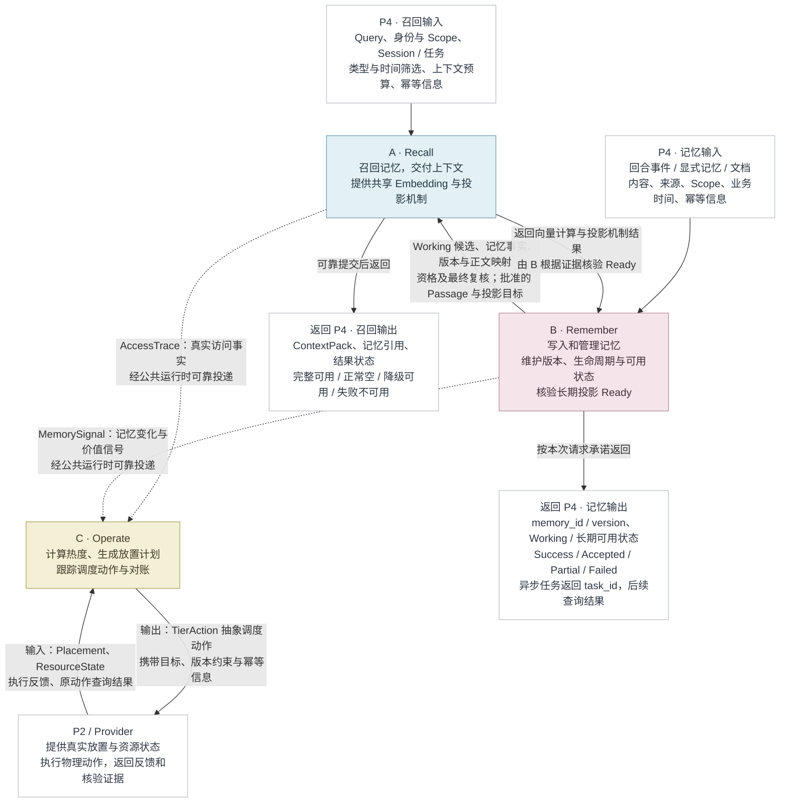

# P3 框架研读与工程能力验证计划

按你补充的条件，学习路线确定为：**先在 Azure 上做单实例 Demo，再迁移 AKS；按已有后端经验，重点研究源码机制、失败边界和适配方式。**

建议选择三个业务研究对象：**Remember 看 LangMem，Recall 看 LlamaIndex，Operate 看 Kubernetes Controller / controller-runtime。** 系统公共能力另外研究 Temporal、OpenTelemetry，以及 Azure 的身份、监测和 AKS 架构规范。

目标不是通读这些项目，而是能够解释：一条请求如何执行、事实在哪里保存、失败后凭什么恢复，以及哪些保证需要我们自己实现。

## 1. 三个业务流程，分别学习什么

| 业务流程 | 主研究对象                                         | 选择理由                                                     | 我们的采用方式                                               |
| -------- | -------------------------------------------------- | ------------------------------------------------------------ | ------------------------------------------------------------ |
| Remember | **LangMem**                                        | 提供对话到结构化记忆的提取与更新机制，Core API 可以接自有存储 | 接入提取能力；事实、版本、来源、删除和事务由我们管理         |
| Recall   | **LlamaIndex**                                     | 检索器、向量适配、候选融合、后处理的分层适合研究             | 重点参考模块设计；保留已有 Embedding/Milvus 能力和我们的 Recall 编排 |
| Operate  | **Kubernetes Controller 模式、controller-runtime** | 有成熟的“读取当前状态→计算差异→执行→重新核验”机制            | 学习控制循环与对账设计；业务控制器先用 Python 实现           |

这三个对象不是三个可以拼起来直接交付的产品。它们分别帮助我们解决记忆提取、候选检索、状态收敛的问题。

**A. Remember：把 LangMem 的提取与持久化边界看透**

源码入口：[LangMem extraction.py](https://github.com/langchain-ai/langmem/blob/main/src/langmem/knowledge/extraction.py)。

按以下顺序阅读：

| 顺序 | 模块或符号                                               | 必须弄清的问题                                     |
| ---- | -------------------------------------------------------- | -------------------------------------------------- |
| 1    | `create_memory_manager`                                  | 输入消息、已有记忆、自定义 Schema 如何进入提取器？ |
| 2    | `MemoryManager.ainvoke`                                  | 如何调用模型、汇总候选、处理多轮结果？             |
| 3    | `_prepare_existing`、`_filter_response`                  | 已有记忆 ID 如何参与更新？哪些结果被保留或过滤？   |
| 4    | `MemoryStoreManager`                                     | 如何检索已有记忆、调用提取器，再执行存储修改？     |
| 5    | `create_manage_memory_tool`、`create_search_memory_tool` | Agent 主动操作记忆与后台提取有什么区别？           |

目前核对的源码中，Core manager 的 `enable_updates` 默认开启，`enable_deletes` 默认关闭。**学习实验第一版显式关闭自动更新与删除**，先观察纯候选提取，再单独研究更新机制。

我们可以直接用：

- 模型接口适配和结构化候选输出。
- 自定义记忆 Schema、提取指令。
- 已有记忆参与提取的机制。

我们必须补：

- 可信租户与用户上下文。
- 来源真实性校验、正式 ID 和版本。
- 候选提交幂等、显式纠错、删除屏障。
- Memory、Task、Outbox 的原子提交。

特别注意：目前 `MemoryStoreManager` 中存在并行调用多个 `aput/adelete` 的路径。**这些调用不能直接视为符合我们要求的“业务事实＋任务＋事件”原子事务。**

学习实验固定为：

1. 输入明确偏好、否定、引述他人、假设四类中文样本。
2. 打印模型输入、候选输出和来源引用。
3. 同一输入重复执行，观察候选是否变化。
4. 在模型返回后、正式提交前模拟退出。
5. 证明重新提取不会生成第二批正式记忆。

完成标志：能准确说明“LangMem 已完成的工作”和“Remember Service 仍需完成的工作”。

---

**B. Recall：把检索拆成可独立验证的步骤**

源码入口：[LlamaIndex](https://github.com/run-llama/llama_index)，重点看 `BaseRetriever`、`VectorIndexRetriever`、`QueryFusionRetriever` 和后处理接口。

阅读顺序固定为：

> Query 输入 → Embedding → VectorStore 查询 → 候选引用 → 正文加载 → 融合/后处理 → 上下文组装

| 模块                   | 值得学习的内容                                  | 我们要增加的约束                         |
| ---------------------- | ----------------------------------------------- | ---------------------------------------- |
| `BaseRetriever`        | 检索入口、同步/异步接口、候选返回类型           | 可信上下文、统一截止时间、来源覆盖信息   |
| `VectorIndexRetriever` | 查询向量、过滤条件、Top K、候选与正文加载的关系 | scope 强制过滤、模型空间绑定、精确版本   |
| `QueryFusionRetriever` | 多路候选融合、RRF、去重                         | 按 memory_id＋version 去重、固定排序语义 |
| 后处理接口             | 排序与筛选的独立组织方式                        | 当前有效性、来源、删除和最终资格核验     |

**不要直接把完整 Query Engine 当成我们的 Recall。** 我们的交付结果是受授权、有效且符合预算的 ContextPack，生成自然语言回答可以在下游完成。

源码中已经看到两个需要特别研究的差异：

- `QueryFusionRetriever` 默认会配置多查询生成，可能引入额外模型调用。
- 当前 RRF 实现按节点 hash 合并，名次从零开始；我们的契约按记忆版本去重、名次从一开始。

因此复用时必须用输入输出测试确认，不能因为名称都叫 RRF 就认为行为完全一致。

学习实验固定为：

1. 用固定中文记忆集建立真实 Milvus 检索。
2. 同时检索 Working 与长期记忆，记录各路原始候选。
3. 展示融合前后名次及去重原因。
4. 把旧版本向量故意保留在检索结果里，证明最终被排除。
5. 中断 Milvus，分别验证有 Working 时的降级和没有有效来源时的失败。
6. 使用固定 tokenizer 验证上下文预算。

LlamaIndex 当前官方 README 已说明其业务重心向文档解析方向调整。因此本轮将其作为**检索模块与源码参考**，不把整套框架作为项目必需运行平台。

---

**C. Operate：学习成熟的控制循环，而不是寻找“自动分层万能框架”**

源码入口：[controller-runtime 的 Reconciler 契约](https://github.com/kubernetes-sigs/controller-runtime/blob/main/pkg/reconcile/reconcile.go)。

源码明确说明它采用 **level-based reconciliation**：事件触发重新检查对象，动作依据重新读取的当前状态决定。

映射到我们的系统：

| Kubernetes 控制器概念 | P3 对应内容                                |
| --------------------- | ------------------------------------------ |
| 期望状态              | 策略决定某条记忆应该具有怎样的模拟缓存副本 |
| 观察状态              | 执行端返回的实际放置、容量、epoch          |
| Reconcile             | 比较期望与观察，推进或核验动作             |
| Work queue            | 待评估、待执行、待对账对象                 |
| Status / Conditions   | Action 状态、原因、观察证据                |
| Finalizer 思路        | 删除涉及外部资源时，需要可追踪的清理过程   |

需要重点理解：

- 为什么重复事件不能重复产生业务效果。
- 为什么事件里的旧状态不能直接当作执行依据。
- 为什么超时之后需要查询原动作。
- 为什么控制器重启后仍能根据持久状态继续收敛。
- 为什么队列去重不等于业务幂等。

**controller-runtime 是 Go 的 Kubernetes 控制器库，不能作为普通 Python 库直接接入。** 当前 Demo 学习其设计，用 Python 实现业务 Reconcile；迁入 AKS 后，也不默认把每条 Memory、Task 都做成 Kubernetes CRD。

学习实验固定为：

> 一条记忆达到热度阈值 → 生成固定动作 → 模拟端执行成功但丢失响应 → Operate 保持 Unknown → 查询原 action_id → 根据观察收敛。

再追加重复事件、旧版本事件、模拟端重启三个变体。模拟端失去历史证据时必须保留未知。

这里复用的是成熟控制机制；热度策略、容量预算、删除资格和模拟执行协议仍由我们定义。

## 2. 公共能力：研究对象和实现边界

**可恢复性：重点研究 Temporal，但先不替换现有运行基础**

入口：[Temporal Python SDK](https://github.com/temporalio/sdk-python)、[Activity Execution](https://docs.temporal.io/activity-execution)。

优先研究：

| 机制                        | 要回答的问题                                 |
| --------------------------- | -------------------------------------------- |
| Workflow 与 Activity        | 哪部分是编排，哪部分真正调用外部系统？       |
| Event History 与 Replay     | Worker 消失后，执行依据如何保留？            |
| Timeout / Retry             | 哪种超时发生了？允许重试什么？               |
| Heartbeat / Cancellation    | 如何检测进展，取消为什么不等于外部动作撤销？ |
| Workflow ID / Activity 幂等 | 如何关联原操作，避免业务效果重复？           |

不需要先研究 Temporal 服务端全部源码。先跑 Python 示例，观察 History，再停止 Worker、恢复 Worker、制造 Activity 超时。

同时研究 [Transactional Outbox](https://microservices.io/patterns/data/transactional-outbox.html)。这是成熟设计模式，不是某个产品或正式协议标准。

我们的恢复路径应当是：

> 同事务保存业务事实与待办 → Worker 领取租约 → 执行 → 记录结果 → 失败或租约过期 → 领域 Handler 判定重做、查询、取消或人工处理。

必须保留四个区别：

- 持久记录存在，不代表流程会自动继续。
- 流程会继续，不代表外部副作用只执行一次。
- Pod 被重启，不代表原业务成功恢复。
- 有数据库备份，不代表任意时间点的数据都能恢复。

当前默认：**Temporal 用于独立学习实验；单实例 Demo 继续使用已设计的 SQLite 任务、Outbox 和恢复机制。** 不同时引入两套权威任务系统。以后若迁入 Temporal，须明确替换范围，而不是在旧 Task 外再套一层。

LangGraph 可以补读 Checkpointer 与 Store 的区别，但不把图检查点当成整个系统的业务恢复保证。

---

**租户设计：先区分四种身份和隔离边界**

| 概念                   | 在我们项目中的含义               |
| ---------------------- | -------------------------------- |
| 业务 tenant            | 客户或组织的数据、权限、配额边界 |
| user / agent / session | 租户内主体、应用身份及会话范围   |
| Microsoft Entra tenant | Azure 身份目录边界               |
| Kubernetes Namespace   | 集群资源组织及策略作用范围       |

这些概念可以映射，但不天然一一对应。

例如，一个 Entra 目录管理的 AKS 集群，可以运行服务多个业务租户的应用。不能用“请求来自同一个 Azure 目录”证明用户有权读取某条记忆。

学习材料：

- [Azure 多租户架构指南](https://learn.microsoft.com/en-us/azure/architecture/guide/multitenant/overview)：隔离方式、共享资源、配额与运维取舍。
- [OWASP Authorization Cheat Sheet](https://cheatsheetseries.owasp.org/cheatsheets/Authorization_Cheat_Sheet.html)：默认拒绝、最小权限、每次访问校验。
- [OpenFGA 建模指南](https://openfga.dev/docs/modeling/getting-started)：未来出现团队共享、委托、对象关系授权时的参考实现。

单实例 Demo 仍使用服务端凭证映射和对象级 scope 校验；OpenFGA 先学习，不必立即部署。

验证必须覆盖 API、SQLite、Milvus、缓存键、后台任务、事件、管理查询和日志。尤其要测试**同租户不同用户越权**，不能只测试不同租户。

---

**可监测性：采用标准采集接口，接 Azure 运维体系**

入口：[OpenTelemetry Signals](https://opentelemetry.io/docs/concepts/signals/)、[Prometheus Instrumentation](https://prometheus.io/docs/practices/instrumentation/)、[Azure Kubernetes 监测指南](https://learn.microsoft.com/en-us/azure/azure-monitor/containers/kubernetes-monitoring-overview)。

推荐分工如下：

| 数据           | 工具与目标                                                  | 解决的问题                               |
| -------------- | ----------------------------------------------------------- | ---------------------------------------- |
| Trace          | OpenTelemetry → Application Insights                        | 一次请求卡在哪个阶段、依赖调用如何关联   |
| Metrics        | Prometheus 指标；AKS 阶段接 Azure 托管 Prometheus / Grafana | 错误、延迟、积压、资源和长期趋势         |
| 技术日志       | 结构化日志；AKS 阶段接容器日志采集 / Log Analytics          | 错误细节和运行诊断                       |
| 业务事实与审计 | 数据库中的 Task、Outbox、Action、Audit                      | 是否提交、是否执行、由谁操作、凭什么恢复 |

业务事实不能依赖采样 Trace 保存。`memory_id`、`action_id` 适合进入受控日志和 Trace 属性，不作为无限增长的 Prometheus 标签。

除请求延迟与错误率，还必须监测：

- 最老待处理任务年龄、积压数量。
- 租约过期次数、恢复耗时。
- 未确认事件投递年龄。
- 投影未就绪年龄。
- Unknown 动作数量与持续时间。
- Recall 的 empty、degraded、failed 比例。

Trace 传播参考 [W3C Trace Context](https://www.w3.org/TR/trace-context/)。Trace 上下文只用于关联，不能充当授权凭证。

## 3. Azure 与 Kubernetes 的学习边界

按照你的选择，第一阶段默认在 **Azure Linux VM 上用容器运行单实例 Demo**，再研究并迁入 AKS。

| 阶段         | 要实际掌握的内容                                             |
| ------------ | ------------------------------------------------------------ |
| 单实例 Demo  | 容器化、配置与密钥分离、持久磁盘、进程拆分、优雅退出、健康检查、日志和备份恢复 |
| AKS 学习实验 | Deployment、Service、ServiceAccount、探针、requests/limits、RBAC、NetworkPolicy、滚动更新 |
| AKS 迁移     | Workload Identity、外部持久化、并发任务领取、多副本正确性、集中监测、发布与回退 |

主线资料采用 [AKS Baseline Architecture](https://learn.microsoft.com/en-us/azure/architecture/reference-architectures/containers/aks/baseline-aks)，具体身份机制看 [AKS Workload Identity](https://learn.microsoft.com/en-us/azure/aks/workload-identity-overview)。

需要建立的工程判断包括：

- `liveness` 检测进程是否失去正常工作能力；依赖短暂不可用不应轻易触发重启风暴。
- `readiness` 控制是否接收流量；后台任务资格仍由应用处理。
- VM 阶段可以使用 Managed Identity，AKS 阶段使用 Workload Identity 访问受支持的 Azure 服务。
- Key Vault 管理密钥，不承担业务用户对 Memory 的授权。
- 优雅退出要停止领取新任务、处理在途工作；强制退出仍必须由持久恢复机制兜底。

**迁往 AKS 多副本前，不能把 SQLite 文件放到共享卷上就认为完成改造。** 默认迁移方向是 PostgreSQL，并重新验证事务、CAS、幂等、任务领取及删除竞态；Milvus 的存储、备份与部署方式也单独验证。容器能运行只证明部署成功的一部分。

## 4. 按八个学习工作日推进

这是开发前的学习与验证窗口，**不计入原先十天 Demo 开发排期**。四位负责人各自深入，项目负责人掌握所有交接边界。

| 时间     | 重点                                                         | 必须产出                              |
| -------- | ------------------------------------------------------------ | ------------------------------------- |
| 第1天    | 全员走通输入→记忆→检索→调度；区分三种身份边界                | 数据流图、存储归属表、待验证问题      |
| 第2～3天 | B读 LangMem；A读 LlamaIndex；C读控制器；你研究事务与 Temporal | 每组一张调用链图、一份复用/自研边界表 |
| 第4天    | 运行三个业务最小实验                                         | 原始输入输出、关键状态、实际依赖记录  |
| 第5天    | 幂等、Outbox、租约、Unknown 与恢复实验                       | 故障时间线及数据库证据                |
| 第6天    | 租户隔离、撤权、监测与告警                                   | 权限矩阵、监测面板与排障记录          |
| 第7天    | Azure 单实例部署；AKS 探针与滚动更新学习实验                 | 部署图、身份路径、持久化路径          |
| 第8天    | 四人交叉讲解与设计复核                                       | 修订后的技术选型和正式开发准入结论    |

每个框架都按同一方法研究：

> 先运行最小样例 → 跟踪调用链 → 标出持久化与副作用 → 注入故障 → 对照我们的需求 → 决定复用边界。

每项研究固定保存：版本/tag 或 commit、源码入口、调用链、正常结果、失败结果、不能提供的保证。不能只交一份功能介绍或几张截图。

## 5. “已经吃透，可以开发”的验收标准

不用以读过多少源码衡量，而用能否独立解释并验证下列场景衡量：

1. 模型调用成功，但正式记忆提交前退出，会发生什么？
2. 数据库提交成功，但事件尚未发出，如何继续？
3. 消费成功但确认丢失，为什么不会重复计热？
4. 旧向量仍在，为什么纠错或删除后不会返回旧内容？
5. 模拟执行成功但响应丢失，如何查证而不重复执行？
6. Worker 失去租约后继续返回，为什么不能覆盖新结果？
7. Pod 重启和业务恢复分别由谁负责？
8. 某个租户制造大量任务，如何限制影响其他租户？
9. 从备份恢复时，能够恢复到什么时间点，可能丢失什么？
10. 只给出一个 recall_id 或 action_id，能否查清执行过程与当前结论？

网络故障实验可以使用 [Toxiproxy](https://github.com/Shopify/toxiproxy)；精确的“执行完成后丢响应”还需由模拟端故障开关保证触发位置。

完成这轮学习后，保留我们已有的业务接口边界；针对框架适配和 Azure 部署修改设计。**只有在机制已经理解、失败实验已有证据时，才把某个框架纳入正式运行依赖。**