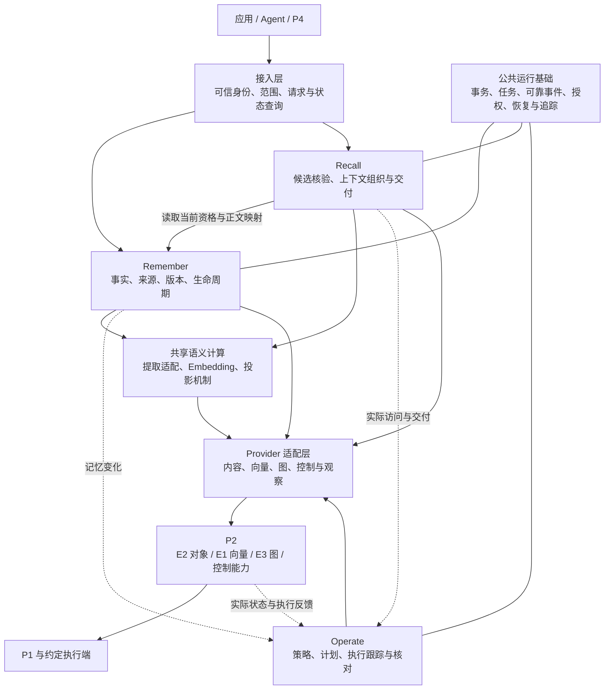

# ADR-P2P3-001 P3 总体架构与框架选型设计

日期：2026-09-19。状态：**Proposed，待联合评审**。本文件以 P3 为主体，说明与 P2 的职责和接口边界；P2 引擎内部设计另见其需求与工程文档。本轮保留一份主 ADR，原 D01～D08 决策编号继续有效。

2026-09-20评审口径修订：依据用户最新指示，本轮开发及评审采用PRD V1.3；新增租户要求纳入当前范围，实施状态和甲方评审结论分别记录。已更新tokenizer、重排序及本地Trace的实现状态；目标设计和待评审结论保持区分。现场讲解见[PRD/ADR/Mock沟通指南](../里程碑与交付/甲方评审沟通指南_PRD_ADR_Mock.md)。

**设计结论：P3 围绕记忆形成、上下文使用、访问准备三类业务责任，组织为 Remember、Recall、Operate 三条流程。Remember 管理事实和使用资格，Recall 交付当前可信的上下文，Operate 根据两侧历史和当前状态自动调整访问准备。公共运行基础保证三者可靠协作；P2 提供对象、向量、图及约定控制能力。**

本文回答为什么采用这个结构、开源项目参考什么、哪些能力需要自己实现，以及 PRD 如何落实到模块和业务结果。选型是基于现有需求、源码研读和工程证据的方案，不代表已完成所有备选的性能比较或取得甲方批准。

阅读顺序：先读第 1～3 节理解整体方案，再读第 4～7 节理解各流程和框架，最后用第 9～11 节对照需求、原型和实现。

## 1 从产品问题推导架构

[P3 PRD V1.3](../PRD版本/AetherBrain_P3_PRD_租户补全版_V1.3.docx)规定：应用和 Agent 可以保存对话、任务事件和文档，在后续会话按授权范围取回有效材料；系统内部根据存储与召回历史自动调度。对外是存储和召回两个业务功能，调度由内部持续运行。V1.3租户细化属于当前需求；身份来源、撤权传播窗口等原文待确认参数仍需在接入评审确定。

用项目助手说明：第一次保存“预算 20 万”，下一轮应立即可用；长会议记录随后加工，供跨会话使用；预算更正为 15 万后，旧版本即使仍在索引或旧上下文里，也不能继续作为当前事实交付。频繁使用的材料可以改善访问准备，但调度不能改变预算事实，删除也不能被晚到的加工或执行回执撤销。

这个场景提出了五项直接影响架构的要求：

| 产品要求 | 架构必须解决的问题 |
|---|---|
| 保存后能继续当前任务，长文可后台加工 | 保存、当前可用、长期就绪分开；前台不等待所有加工 |
| 更正、删除、撤权影响后续使用 | 有唯一的事实与资格管理者，索引和缓存服从当前有效性 |
| 多来源、冲突、长度预算与故障表达 | 有完整的上下文构建流程，不能直接交付向量 TopK |
| 调度自动执行并影响后续访问 | 决策、执行、观察反馈构成持续循环，不能只输出建议 |
| 重启、重试和结果不明可恢复 | 业务提交与后台待办可靠衔接，副作用可按原操作追踪 |

PRD 中的 Working、Episodic、Semantic 是记忆的业务类型；热、温、冷是访问准备层级。两者是不同维度。Semantic 可以位于不同访问层级，降层也不代表事实失效或删除。

## 2 D01 为什么设计为三条流程

**选择：按业务结果拆成 Remember、Recall、Operate 三个逻辑模块，共享运行基础。** 这种划分不是为了对应三个开源框架，也不要求拆成三个独立微服务。

Remember 回答“什么内容已经可靠保存，当前哪个版本可以使用”；Recall 回答“对这次问题，哪些材料可以安全且完整地交付”；Operate 回答“根据历史和当前资源，怎样准备这些内容以供后续访问”。它们的触发条件、完成标准和失败处理都不同。

| 流程 | 主要触发 | 对结果负责 | 为什么需要独立边界 |
|---|---|---|---|
| Remember | 新事件、任务状态、文档、更正、删除 | 来源、事实版本、生命周期、加工结果与长期就绪资格 | 一条事实被多次使用，不能在每次检索时重新决定其真假与版本 |
| Recall | 应用或 Agent 发起上下文请求 | 来源覆盖、候选核验、冲突组织、预算及最终 Context | 一次请求组合多条事实，需要请求级截止时间和结果状态 |
| Operate | 两侧业务变化、实际访问、状态变化、周期检查 | 基础策略、放置计划、动作跟踪和状态核对 | 调整可能跨越多次请求，不能绑在某次召回的响应里 |

只拆“写入、读取”两条流程，会把长期运行的访问调整塞进业务请求或零散后台脚本，难以统一处理重试和未知结果。把所有步骤放进一条大链，会使当前读取依赖长文加工和调度完成，故障范围也随之扩大。直接照搬通用 RAG 的“入库—检索—生成”，则缺少本项目的事实维护、使用阻断和访问调度责任。

三流程的代价是需要清晰的领域对象、接口及可靠事件。通过公共契约和单机模块化装配先控制复杂度，再按负载和隔离需要独立部署，比一开始引入多个远程服务更符合当前工程阶段。

## 3 整个 P3 为什么采用这种框架

图表示目标关系，虚线表示变化或反馈，当前是否接通见第 11 节。共享语义计算是图上的能力集合：Remember 拥有提取业务及候选审核，Recall 侧维护共享 Embedding/向量机制，不能据此理解为新增一个统一拥有所有事实的服务。

采用这四层有具体目的：接入层统一应用与 Agent 的调用规则；领域层保留业务责任；公共运行基础解决三流程反复需要的可靠交接；Provider 层隔离 P2 实际协议，使开发时可以替换测试实现，而不改变业务完成标准。

| 对象 | 唯一业务责任 | 其他模块如何使用 |
|---|---|---|
| Memory、Source、版本、生命周期、ProjectionState | Remember | Recall 和 Operate 查询当前资格，不绕过 Remember 修改事实 |
| Recall 请求、ContextPack、排除理由 | Recall | 应用读取；再次获取时仍核验当前权限和内容 |
| 历史输入视图、PlacementPlan、Action | Operate | 使用业务事件和 Provider 观察形成决策，不自行宣布物理状态 |
| Task、Attempt、Outbox、Inbox、恢复记录 | 公共运行基础 | 提供可靠机制；任务完成不自动等于业务目标完成 |
| 对象内容、索引、图关系、真实执行状态 | P2 / 相应 Provider | 按契约返回准确版本和证据，不决定 P3 事实的业务有效性 |

同一数据可以有多个表示，但“谁能判定它有效”“谁能证明物理结果”必须唯一。这是该框架能够支持更正、删除和失败恢复的基础。

## 4 D02 Remember 怎样实现可靠记忆

Remember 承接 FR01～FR07，并拥有 FR17 删除和生命周期规则。它的内部结构是接入校验、事实维护、内容处理、派生结果管理，后台加工以任务驱动。

正常路径是：验证身份及来源 → 按业务幂等身份接收 → 可靠保存必要正文与事实 → 同时登记后续待办 → 返回已确认的保存结果 → 后台完成适用的提取、压缩和语义表示 → 核验可查询性与准确回读 → 授予长期就绪资格。

并非每条记忆都要依次经过提取和压缩。当前任务状态可以直接进入 Working；长文需要获取固定版本、解析分块，再选择适用加工；稳定事实必须保留支持来源。压缩产物关联原内容及版本，只有质量规则通过后才能参与适用读取。解析器、压缩策略和质量样本仍需专门设计与验证，LangMem 不能替这些需求自动兜底。

**为什么分开 saved 和 ready：**保存确认回答原内容是否可靠存在；ready 回答当前版本是否已能长期查询并准确读取。向量服务故障时，原内容和合法 Working 应继续存在，长期能力则如实未就绪。同步等全部加工会扩大前台依赖；返回后只启动内存任务又会在崩溃时丢失待办。

本地选择 SQLite 事务配合持久任务和 Outbox/Inbox，保证业务变更及后续交接可恢复。远程 P2 副作用不属于这一本地事务，因此要单独持久化操作身份、查询原结果并恢复；不假设跨系统天然拥有一个大事务。

更正时形成新版本并撤销旧版的默认使用资格；旧索引无需完全清理才生效。删除先阻断使用，再持续清理来源和派生内容。Worker 提交结果前复核当前版本及状态，避免晚到结果重新激活已删除内容。

验证重点：重复保存、加工失败但事实保留、更正后旧候选排除、删除与在途加工竞争、重启继续处理。已有对应 TC-P3-01～05/09/15，文档、语义提取与压缩还需 TC-P3-18～20。

## 5 D03 Recall 为什么是一条上下文流水线

Recall 承接 FR08～FR11。应用直接调用和 Agent 工具调用进入同一业务入口；自然语言答案由调用方继续生成，P3 交付记忆材料、来源和结果状态。

内部顺序为：授权与来源选择 → Query 表示 → 当前/长期候选检索 → 当前资格核验 → 精确正文读取 → 去重排序与冲突组织 → 预算装配 → 最终资格复核 → 记录结果及实际访问 → 返回 ContextPack。

显式指定来源时遵守请求，未指定时才自动选择。每路来源保留是否完成及失败原因，因此能够区分完整可用、正常空、降级可用和不可用。检索超时不能被当作“没有相关记忆”。

**为什么不能直接返回 TopK：**相似度只反映候选相关性，不能证明权限、有效版本和来源可靠；不同索引还可能同时返回同一记忆的多个分块或旧版本。需要先确定可用资格，再按记忆与版本组织材料。

对明确更正，旧版退出默认使用；对仍有效但矛盾的独立来源，保留必要冲突与限定。完整条目或冲突组是预算装配单元，一组放不下继续尝试后续组，不能截去否定词、数字或冲突另一侧以凑长度。目标预算应按目标模型 tokenizer 计入正文、引用和说明。

前置检查之后仍可能发生删除，所以交付前及旧 Context 再次获取时都要复核。这个业务保证由 P3 实现，不能由框架的检索后处理一次性代替。

采用分步流水线使检索、排序、冲突和预算可以分别替换和验证。代价是要维护每一步的数据与失败语义；收益是某个来源故障时，仍可判断是否存在独立可信的可用材料。

验证重点：TC-P3-04～08/21/22 和 UAT-02～05。2026-09-20已实现实际tokenizer预算与可配置真实CrossEncoder，默认o200k_base；下游模型匹配仍须校准。完整语义冲突组仍是目标，当前单条组不能视为完整冲突处理已完成。

## 6 D06 Operate 为什么采用持续核对的控制循环

Operate 承接 FR12～FR14，并为 FR16 后续预测保留扩展点。它同时消费 Remember 的存储变化和 Recall 的实际访问历史，再结合当前有效性、层级、容量和已有动作判断。

基本结构为：可靠接收并去重 → 汇总可追溯输入 → 读取当前状态 → 策略提出升层/降层/保持 → 有效性与资源检查 → 持久化计划及动作身份 → 执行 → 观察实际结果 → 更新下一轮依据。普通升降层遵守 PRD 的相邻层级规则，依据不足或有冲突操作时暂缓。

**选择控制循环的原因：**事件可能重复或乱序，执行可能耗时，回执可能丢失。只收到某个事件就执行固定搬运，容易重复动作或依据旧状态操作。每轮读取当前事实并核对预期与实际状态，才有机会在故障恢复后继续处理同一业务。

控制循环负责可靠执行，具体热度、衰减、重要性权重、容量阈值和防抖规则由策略承担。这些参数需要结合约定负载形成可验证的算法规格；当前 Mock 的“两次交付后升层”只是样例，不是正式算法论证。

desired 表示策略希望达到的状态，observed 表示有证据的实际状态。底层受理不等于生效；只有目标、代际、内容及准确读取满足条件才能确认。回执丢失时保留 Unknown 并查询原动作；无证据就继续核对，不盲目发起冲突动作。目标确认前保留有效读取路径，旧副本清理可以作为独立待办。

预测阶段只新增策略输入和预测判断，继续使用同一授权、容量保护、执行与反馈过程；预测失效时可回到基础策略，不另造一套调度系统。

验证重点：TC-P3-10～14、TC-P2-04 及存储侧单独触发、乱序事件、容量不足、晚到回执等场景。物理分层的本期范围仍需联合决议，见 D08。

## 7 D04 为什么参考这些开源框架

选型顺序是先明确 PRD 责任，再寻找可复用机制。以下区分运行依赖、候选适配与设计参考；安装一个框架不等于获得完整的产品保证。

### 7.1 Remember 参考 LangMem

LangMem 的结构化记忆提取、自定义 Schema、已有记忆参与提取等机制，适合用来实现“事件内容到候选事实”。相比从模型请求、结构化输出和既有事实输入全部自写，它提供了可研究和适配的起点。

拟采用 Core 提取能力，经 ExtractionPort 输入获准内容及上下文，输出候选及来源，再由 Remember 校验和提交。研究依据是已保存源码中的 `create_memory_manager`、`MemoryManager` 和 `MemoryStoreManager`；具体见[框架研读计划](../../P3_框架研读与工程验证_V1.0/P3%20框架研读与工程能力验证计划.md)。

不让框架直接成为主事实存储者：它自己的存储更新调用不能自动保证本项目的事实、版本、任务和事件在同一事务提交。候选更新、删除也不等同于用户授权的正式更正和删除。首次接入应显式约束模型自主修改能力，质量不满足时保留原始事件和失败信息，不强行发布稳定事实。

主要代价是模型质量、费用、重复提取稳定性和来源审核。是否采用真实提取，需要在中文否定、引述、假设、冲突及重复输入上验证；当前默认 LiteralExtraction 不代表 LangMem 已完成接入。框架质量不适合时可替换提取适配器，Remember 的事实契约保持不变。

### 7.2 Recall 参考 LlamaIndex

LlamaIndex 的 Retriever、VectorStore 适配、Fusion 和 Postprocessor 提供了清晰的候选检索组织方式，适合参考如何拆分查询、向量后端、候选融合和后处理。具体机制与实验见[Recall 源码导读](../../P3_框架研读与工程验证_V1.0/docs/02_Recall_源码导读.md)。

本项目采用其分层思路，按需要选用局部组件；P3 的 ContextPack、权限和业务对象不继承框架 Node 作为唯一模型。完整 Query Engine 还承担答案生成，与 P3 的上下文交付边界不同。

已研读快照还显示：Fusion 的节点 hash 去重、名次口径及默认多查询行为，与 P3 的记忆版本去重、排序契约和请求成本边界并不完全一致。因此不能直接拿默认值作为设计。P3 需自己负责来源覆盖、当前资格、冲突整组、完整预算和最终交付复核。

相较于全栈接管，这种方式需要自己维护编排，却能稳定业务契约；相较于完全不参考框架，可以复用已分离的接口思想和局部机制。此前 LlamaIndex 实验使用合成候选和 MockEmbedding，只证明局部框架行为；当前主运行链不能据此标为“已用 LlamaIndex 全面实现”。

### 7.3 Operate 参考 Kubernetes Controller 模式

controller-runtime 的关键价值是基于当前状态进行 Reconcile，而不是把收到的每条事件机械地翻译为动作。已保存的[Reconcile 接口说明](../../P3_框架研读与工程验证_V1.0/sources/controller-runtime/pkg/reconcile/reconcile.go)明确区分事件触发与当前状态判断，这与 P3 的执行反馈和恢复需求吻合。

我们参考这种控制循环，以 Python 实现领域控制器，不直接采用 Go controller-runtime，也不把每条 Memory 和 Task 变成 Kubernetes CRD。这样能在单实例环境验证业务，不要求先建设集群控制面。

代价是重试、持久动作、并发约束和恢复需要自己实现与测试。Kubernetes 的机制不会自动给出记忆热度算法或 P2 迁移协议；这些仍由 P3 策略及 Provider 契约承担。

### 7.4 公共能力的采用与暂缓

| 技术或模式 | 使用方式和选择理由 | 备选、代价及重评条件 |
|---|---|---|
| SQLite UoW、Outbox/Inbox | 当前直接实现事务与可靠交接，便于单机验证崩溃与重试 | 多副本和写并发要求提高时评估 PostgreSQL 等；迁移需保留业务身份、版本和待办 |
| BGE + FastEmbed/ONNX Runtime | 当前真实本地向量计算；Query/Passage 绑定同一模型空间 | 不能凭模型名称证明检索质量或吞吐；换模型需重建投影并验证版本兼容 |
| Sentence Transformers / CrossEncoder | 可配置的真实候选重排序；本地模型链路已验证，默认未启用 | 额外计算和输入长度限制；required/fallback明确配置，质量收益与部署负载需另验 |
| Milvus | 已有工程适配和研读路线，可作为明确标注的独立验证候选 | 联合交付的正式向量路径需与 P2 E1 统一，不能自动替换甲方 P2 范围 |
| Temporal | 参考持久工作流、历史与失败恢复，暂不接管当前 Task | 立即接入增加服务与在途任务迁移；复杂长流程超出自有任务能力时再评估 |
| OpenTelemetry / W3C Trace Context | 当前借鉴Trace/Span及标识格式，自有本地记录与跨任务传播已接通 | 尚未接通OTel SDK/OTLP或跨HTTP传播；业务事件独立持久化，技术Trace丢失不改变事实 |
| Prometheus / Azure Monitor | 后续指标和部署监测候选 | 先保证必要运行状态可查询，再按环境接入；不另建专用监控产品 |
| OpenFGA | 作为关系授权方案参考，当前不强制采用 | 目前服务端明确资源与操作授权；复杂共享关系增长后再评估，避免超出 PRD 的角色平台范围 |

以上依据本地研读材料和现有工程 ADR，未宣称最新开源版本或行业最优性能。正式引入时锁定版本、核对许可证和接口，通过业务契约及质量验证；引用设计思想与直接依赖、复制源码分别记录。

## 8 D05 D07 D08 集成与运行边界

### D05 P3 为什么通过 Provider 接入 P2

Remember 保存/读取正文主要依赖 P2 E2，长期投影及候选检索主要依赖 P2 E1，来源关系或需要图能力的路径依赖 E3；Operate 使用经确认的控制和观察能力。并非每次 Recall 必须顺序调用所有三个引擎。

Provider 把 P3 需要的精确正文、稳定引用、检索可见性、授权过滤、目标解析和原动作查询，映射到 P2 的具体方法。相比直接读取引擎内部库，这增加一层适配，却能明确双方承诺、独立测试及故障责任。

统一交付优先围绕 P2 契约落实。当前 SQLiteVectors 只用于本地业务验证；Milvus 路线不能未经确认变成另一套正式权威。Query 和 Passage 必须绑定同一模型、预处理及版本，维度相同不足以说明空间兼容。

2026-09-20 按用户要求明确检索范围：长期记忆采用稠密向量检索；Working 与长期记忆的多来源候选汇总、去重和排序继续保留，研读与实现围绕该范围展开。

接口调用、字段、错误与适配细节引用[协作接口目录](../../AgentJYS-main/docs/p3/contracts/01_协作接口与事件目录.md)和[P2 外部集成计划](../../项目资料/分工与项目理解/总设计/AetherStore_P3_External_Integration_P2对接计划_V0.1.md)。实际方法与版本、ready 保证、Graph/Fusion 远程入口和完整执行链仍需双方确认与实测。

### D07 为什么把授权和恢复放进公共基础

同一条记忆会经历保存、加工、检索、旧结果获取及调度。若每个模块独立解释租户和权限，后台或缓存很容易出现例外通道。因此可信身份、资源范围、操作类型和追踪封套采用共同规则，各业务操作在实际读取或提交时复核。

**租户与 Azure 身份接入的建议决策：**采用 Microsoft Entra ID 提供获准用户或应用的身份，P3 保留业务租户映射、主体状态、资源授权及当前资格判断。对应产品行为见 [PRD-ADD-07](../PRD版本/PRD补充_租户与身份接入.md)。这是待评审的接入方案，当前代码仍使用部署配置的凭证，没有完成 Entra 接入。

请求路径为：取得面向 P3 的访问令牌 → 接入层验证 → 查询已批准身份与业务租户映射 → 形成可信调用上下文 → 领域操作检查资源及读写权限 → P2 按约定限制范围 → P3 交付前复核。验证至少覆盖签名、获准签发者、接收对象、有效期及适用调用权限，不接受仅解码的声明或任意身份目录。网关验证结果若传给后端，必须通过不可由普通调用方伪造的可信通道。

外部身份映射使用获准身份源和稳定主体标识，不能使用可变显示名或把邮箱当作唯一授权依据。Entra 目录 ID 不直接等于业务 tenant_id；未经业务开通的有效外部身份仍拒绝。每次请求只在明确获准的业务范围内处理，是否支持一个主体切换多个业务租户需另行明确，不因采用多租户身份应用而自动开放。

| 责任 | 采用方式 | 必须保留的边界 |
|---|---|---|
| Azure 身份设施 | 身份认证和令牌签发 | 不自动决定哪条 P3 记忆属于谁、允许谁删除 |
| P3 接入与业务层 | 最小租户配置、主体映射、Grant、启用状态及授权版本 | 请求、缓存、任务、事件和历史结果执行相同归属规则 |
| Managed Identity / Workload Identity | P3 服务访问支持的 Azure 资源，减少长期密钥管理 | 云端服务身份不能替代原调用者的业务范围 |
| P2 / 数据存储 | 按联合契约过滤、定位和隔离对象、索引、图及控制操作 | 共享连接与服务凭证不意味着跨租户业务访问获准 |

选择这个分工，可以复用公司身份设施，同时保留 PRD 所需的细粒度数据边界。自行建设完整身份平台会增加账户和安全维护范围；仅依赖云资源权限则无法表达当前记忆、共享许可及删除资格。独立数据库或独立部署可以按实际隔离要求选择，但不能自动替代应用授权。

初期租户和映射通过受控配置维护，至少有稳定业务编号、启用状态、获准身份源/主体、许可及配置版本，不新增管理后台。停用先限制使用，数据删除按保留规则另行处理。后台任务携带业务归属与主体引用，实际提交时复核，不持久化用户令牌代替业务授权。

本地授权撤销通过当前资格复核生效；外部身份平台的撤销存在令牌和缓存传播边界，需要确认传播方式及最大生效时间，不能承诺立即影响所有既有令牌。身份源、应用注册、接收对象、共享规则、撤权传播及 P2 过滤由接入评审明确。测试见[租户与身份接入测试及回归方案](../测试与验收/租户与身份接入测试及回归方案.md)，通过真实接入和隔离验收后再确认采用。

**落实到代码的方案。** 在公共基础增加 Tenant 配置（稳定编号、enabled、revision）、ExternalIdentityBinding（获准 issuer、稳定 subject、主体、业务租户及有效状态），复用现有 Principal、Scope、AuthorizationGrant。云目录 ID 仅参与身份来源校验，不直接成为业务租户。新增 Entra 认证适配器验证面向 P3 的访问令牌，再查当前映射生成 TrustedContext；生产配置不得静默回退到本地演示凭证。

现有 Identity.revalidate 应扩展为复核当前主体、租户启用状态和配置版本；对象级 permits/authorize 继续检查当前 Grant。请求接收、后台副作用发起、结果提交和旧 Context 再取都执行相应检查。后台保存原主体与业务范围，租户停用后阻止新的受影响工作；已经发生的外部副作用由受控恢复处理，不通过伪造用户授权继续业务。恢复旧配置不能复活已失效状态。

Recall 需要独立的服务端获准候选集合：本人范围与同租户有效共享资源的并集，再与调用方限制相交；P2 适配器使用这个受信集合过滤，最终交付再次检查版本和授权。不得通过把调用者 home_scope 改为资源所有者来实现共享。记忆、投影、正文和来源依赖的许可应明确关联，避免 Grant 自动开放整个来源。共享是否随记忆新版本延续需定义并测试。

本次代码核查发现：Scope、主体凭证、显式同租户 Grant、auth_epoch 和资格复核已存在；独立 Tenant 停用、外部映射和 Entra 接入尚缺。共享探查中，按编号读取授权成功，但默认长期 Recall 返回空，原因是候选仍受原 home_scope 限制。故上述候选集合是待实现工作，不是已有能力。已有 10 项专题测试通过，范围与探查结果见[租户功能实现核查](../测试与验收/代码核查_2026-09-19/租户功能实现核查.md)。

Task、事件、日志都能关联业务对象，但技术 Trace、业务历史和审计记录用途不同。重启时从持久事实及待办恢复，不靠内存日志推测是否完成；监测导出失败不应让已提交事实消失。

当前以单机 Host/CLI/Worker 装配，后续补真实 HTTP 接入，再接公司环境。Azure VM、AKS 属部署演进选项；扩大副本前要重新验证数据并发、任务竞争和恢复，不把上集群本身当作正确性保障。

### D08 哪些范围需要保留为待决

P2 当前评审聚焦 E1/E2/E3，其他引擎按其阶段计划处理。P3 PRD 把基础算法和真实执行列为 MVP P0，后续预测为产品优先级 P1；9 月会议对冷热实际分层范围另有待确认要求。

本设计保留内部决策—执行—反馈的结构，通过[冷热分层范围决策单](../甲方整改答复/冷热分层范围决策单.md)明确本阶段实际承诺的动作及底层支持。不能用本地目录复制替代物理分层验收，也不能因范围未决擅自删掉 PRD 的承诺。这里的 P1 优先级与 P1 存储底座是不同概念。

## 9 PRD 的需求如何落实到设计

此表回答设计覆盖关系，不宣称所有能力已实现。具体 Feature、用例及结果继续由配套索引维护。

| PRD | 实现位置及关键机制 | 需要观察到的产品结果 |
|---|---|---|
| FR01 保存事件与任务信息 | Remember 接入、幂等、事实与可靠交接 | 已保存内容与来源可查，重复提交不制造额外效果 |
| FR02 当前任务记忆 | Working、范围隔离、当前版本读取 | 下一轮可用，不等待全部长期加工 |
| FR03 长文本与文档处理 | 固定版本获取、解析分块、持久任务及检查点 | 受理、加工、失败恢复和长期就绪可区分 |
| FR04 分类与生命周期 | Remember 类型、版本、归档/到期与资格规则 | 能解释为什么参与或退出默认使用 |
| FR05 稳定事实与更正冲突 | 提取候选、来源审核、明确替代与未决冲突关系 | 新事实有依据，更正与冲突得到不同处理 |
| FR06 提纯与压缩 | 内容处理适配、版本化 Artifact、质量校验与回退 | 数字、否定、条件和来源保持，失败如实可见 |
| FR07 长期检索就绪 | 共享向量机制、投影证据、Remember 授予 ready | 标为可检索的当前版本确实可查、可准确读取 |
| FR08 来源选择与查询 | 统一 Recall、自动/显式来源选择及来源结果记录 | 指定来源得到遵守，来源故障不伪装正常空 |
| FR09 排序去重与冲突 | 资格筛选、记忆版本归并、融合和冲突组 | 不重复占预算，必要分歧完整保留 |
| FR10 上下文交付 | 完整组装、tokenizer、最终资格复核 | 预算内返回可信材料及准确结果状态 |
| FR11 查询与再次获取 | 原请求/任务/结果查询，重新授权和资格核验 | 断线可跟进，失效旧结果不重新交付 |
| FR12 存储与召回轨迹 | 业务事件、可靠投递、去重和关联 | 两侧真实历史可核对并进入内部调度 |
| FR13 基础算法 | 当前输入视图、策略、资源检查、相邻层级和暂缓规则 | 无需调用方触发或逐项审核，决策依据可解释 |
| FR14 执行与确认 | 持久 Action、Provider 执行、原操作查询与准确回读 | 受理与生效分开，下一次访问使用真实状态 |
| FR15 隔离与授权 | 公共身份及资源规则，领域读写和后台复核 | 跨租户及同租户未授权访问被拒绝 |
| FR16 预测与预热 | 后续预测策略接入既有执行循环及独立资源约束 | 预测、准备、实际访问顺序可证，支持回退 |
| FR17 删除与阻断 | 当前资格屏障、派生清理、迟到任务/结果复核 | 新旧请求不再获得删除正文，清理可跟进 |
| FR18 运行与恢复 | 状态查询、任务恢复、动作核对、配置和维护记录 | 故障可解释，恢复后业务再次可用 |

非功能需求也影响结构：前台与后台资源分开约束；当前状态路径减少额外依赖；后台任务有节流与恢复；模型和数据版本可定位。PRD 中 P99、吞吐、压缩、规则正确性和长稳指标仍需按约定负载验证。PRD 规定 MVP 至少 24 小时、Final 72 小时；当前先建设系统不改变最终验收目标，也不表示本结构已证明达到指标。

## 10 用同一个场景检查架构是否讲得通

| 业务进展 | P3 内部协作 | Mock 应让评审人看到 |
|---|---|---|
| 保存预算 20 万 | Remember 保存事实、来源和待办，Working 可用 | 保存结果与后台状态分开 |
| 立即继续当前任务 | Recall 读取有效 Working | 未长期就绪时仍可获得当前材料 |
| 会议记录长期化 | 内容加工、共享向量机制、P2 投影，Remember 核验 | 处理状态、来源及长期就绪变化 |
| 跨会话询问预算 | Recall 检索、核验和组装 | 预算、引用、版本、查询来源和结果状态 |
| 改为 15 万 | Remember 建新版，Recall 排除旧版并复核旧 Context | 新请求用 15 万，旧结果不能继续当有效结果获取 |
| 历史与访问触发调度 | Operate 自动判断，经 Provider 执行并核对 | 判断依据、受理/执行/生效区别、后续访问状态 |
| 调度回执丢失 | 保留同一 Action 查询结果 | 正在核对，不凭超时宣布失败或另建冲突动作 |
| 删除来源后再问 | 资格阻断贯穿 Recall、加工和调度 | 正文不再交付，清理进度单独展示 |

Mock 展示预期行为，ADR 解释为什么能实现这些行为，TC 再在真实系统验证。对应的页面组织和现有场景入口见[原型 Mock 设计与演示说明](../原型Mock/原型Mock设计与演示说明.md)。

## 11 从设计到实现的工程路径

先建立业务契约与公共可靠底座，再完成“保存—当前读取—更正—删除”的小闭环；随后补齐文档、真实提取、压缩和长期就绪；接通统一 Recall 的完整冲突/预算及真实 P2；最后完善正式策略、执行、性能和运行验收。授权、版本、删除和失败表达随每个环节一起验证。

当前实现快照与目标区别如下。本次未修改业务代码；已重跑 10 项租户相关测试并执行共享 Recall 探查，具体范围与缺口见[租户功能实现核查](../测试与验收/代码核查_2026-09-19/租户功能实现核查.md)。

| 能力 | 已有依据 | 仍需实现或验证 |
|---|---|---|
| 三流程与公共基础 | 本地 Host、SQLite 持久化、任务事件、基础更正/删除/恢复 | 新 HTTP 入口、公司环境接入及完整产品行为 |
| Remember 加工 | 提取适配接口、默认逐字保留、基本生命周期 | 真实 LangMem 质量、文档链路、压缩及完整事实形成 |
| Recall | 原生 BGE、RRF、版本资格、实际tokenizer、可配置CrossEncoder和单条组（2026-09-20更新） | Milvus真实联调、完整冲突组、下游模型预算校准 |
| Operate | 事件与基础动作、本地文件操作及 Unknown 查询 | 正式算法规格、真实 P2/P1 执行及收益与安全验证 |
| P2 集成 | 引擎源码、逻辑契约、接口交接计划 | 正式方法映射、Graph/Fusion 远程入口及真实联合运行 |

详见[当前实现程度](../测试与验收/代码核查_2026-09-19/当前实现程度.md)和[当前验证记录](../测试与验收/TCR当前证据.md)。未来变更框架或数据库，应先证明新实现满足同一业务契约，再处理已有对象、任务和投影迁移，不能只替换依赖名称。

## 12 评审应形成的结论

评审首先确认：三流程及数据责任是否满足 PRD；框架参考和自行实现的边界是否清楚；保存、更正、删除、召回及调度故事能否连续解释。然后落实正式 Provider、物理动作范围、提取/压缩质量规则、基础算法参数及部署条件。

一份主 ADR 中的决策可由多个 Feature 共同引用：D01 流程与责任；D02 事实与派生；D03 可信上下文；D04 框架采用；D05 向量与 Provider；D06 动作与物理状态；D07 授权、追踪与恢复；D08 阶段范围。每个 Feature 仍需说明其适用决策、具体补充、原型和测试，而不是只填一个公共文档链接。

联合评审记录应带版本、参与角色、实际结论及未决事项。本文件保持 Proposed，不代填批准；性能选型、真实集成和最终验收以相应证据为准。

主要依据：[P3 PRD V1.3](../PRD版本/AetherBrain_P3_PRD_租户补全版_V1.3.docx)、[历史V1.2](../PRD版本/AetherBrain_P3_PRD_框架修订版_V1.2.docx)、[P2 需求](../../AgentJYS-main/engine/docs/P2_AetherEngine六态存储引擎需求文档_v1.0-0624.md)、[工程选型说明](../../AgentJYS-main/docs/p3/adr/ADR-P3-001_V1.2产品基线与框架采用.md)、[总体架构与流程](../架构设计/总体架构与流程.md)、[甲方新反馈核查](../甲方整改答复/新问题汇总_设计覆盖核查.md)。
