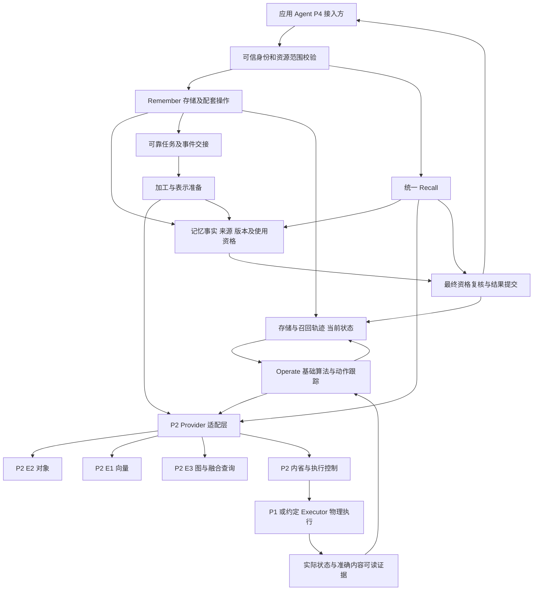

# P2 P3 总体架构评审设计

日期：2026-09-18。状态：建议稿，与 REVIEW-001 至 REVIEW-008 配套。本设计说明产品实现需要的结构及一致性边界，不代表真实部署或技术选型已经批准。Mock 实现为单页本地状态机，以下是待开发系统的架构建议。

## 产品目标与设计约束

P3 对外提供存储记忆和统一 Recall；Operate 在后台自动消费两条流程的轨迹及当前状态，执行基础调度并确认结果。系统必须让已保存、长期就绪、上下文交付与调度生效分别可验证。P2 提供对象、向量、图及控制面能力，P1 或约定 Executor 承担相应底层物理执行。

本期不新增独立管理后台和账号角色平台。Mock 的接入面代表外部调用方，内部观察窗仅用于评审与诊断设计。

## 逻辑架构



图中的 Facts 与 Jobs 是逻辑能力，不等于已经决定创建两套独立数据库。必须先确定其原子交接机制。P3 事实记录的唯一写入者是 Remember；共同机制提供可靠任务和事务支持，不替领域模块判定 Memory Ready 或 Action Succeeded。

## 模块责任

| 模块 | 唯一职责和权威事实 | 消费的外部能力 |
| --- | --- | --- |
| Remember | 内容来源、记忆当前版本、生命周期、可检索资格及加工目标 | 对象保存、表示计算、索引准备、可靠任务 |
| Recall | 本次来源、候选筛选、预算、上下文及结果语义 | 当前资格、准确正文、向量/图候选及可用读取路径 |
| Operate | 基础算法、Representation 调度决策、动作意图与核对状态 | 两侧历史、当前有效性、资源约束、执行目标与真实结果 |
| 公共可靠机制 | 身份上下文、幂等、任务租约、事件投递、恢复与关联记录 | 可靠持久化及事务/提交能力 |
| P2 E1/E2/E3 | 引擎内对象、向量、图、索引与查询状态 | P1 存储底座及相应原语 |
| 执行 Provider | 实际目标存在性、当前层级、物理执行与路由事实 | P1/P2/约定执行组件 |

P3 不把检索命中视为可交付，也不把目标层级写入本地表视为已经物理迁移。Memory 类型 Working/Episodic/Semantic、表示类型和热温冷层级独立变化。

## 首版实现组织建议

可以复用现有服务入口组织 A/B/C 的模块边界，将耗时的加工任务和调度循环放入后台 Worker，在线 Recall 和离线加工使用独立的资源预算。先保证清楚的领域接口、事实写入归属和可靠交接，避免因每个模块都部署成独立服务而提前增加跨服务事务成本。

这是实现组织建议，不强制全部模块永久同进程。需要根据当前工程验证结果确认 Host、Worker、共享持久机制和 Provider Adapter 的实际部署。若采用协同开发基线中的单机 SQLite 原子事务，它只能支持该部署边界下的证明；切换到不同数据库或多服务事务后，必须重新证明最终资格复核与提交的隔离保证。

Embedding 的在线 Query 与离线 Passage 计算应共享明确的模型语义身份，并拥有独立配额；仅按向量维度命名无法区分语义空间。模型、分块、内容、版本和投影证据的正式 Schema 在 A/B/P2 契约中确认。初版不以演示脚本中的词匹配作为正式检索算法。

## 核心一致性边界

| 边界 | 必须成立的保证 | 失败或未知时 |
| --- | --- | --- |
| 内容受理到可靠保存 | 输入、身份、幂等和后续处理意图可追踪；“已保存”有真实持久证据 | 只受理则保持受理状态，不能报告保存成功 |
| 加工结果到 Ready | 当前内容版本、表示、必要分块与准确回读匹配 | 保留事实，长期资格不就绪或撤销 |
| 更正提交 | 期望版本匹配；旧版撤销资格，新版重新处理 | 并发冲突拒绝，不自动覆盖 |
| 删除提交 | tombstone 生效后新交付受阻，清理另行跟踪 | 清理失败不恢复已删除对象 |
| Recall 最终提交 | 资格复核与结果提交有明确隔离边界 | 无法安全形成结果则不可用，不交付旧候选 |
| 动作受理到完成 | 原动作身份、版本、路由和实际读取证据一致 | 保持核对原动作，不创建相互冲突的替代动作 |

Mock 单线程执行只演示这些结果，不证明并发保证。尤其“最后再读一次”不足以证明读完到提交间没有删除或撤权竞态；需要明确事务、读屏障或等价的 Provider 能力。

## 数据与状态模型建议

```text
Input / source_event
  → Memory(memory_id, version, scope, state, source_ref)
  → Representation(representation_id, content/model binding, readiness)
  → ProviderRef
  → ActuationTarget(mapping generation, target generation, route epoch)

Recall(request identity, fixed sources, budget, result references, outcome)
Action(original identity, target binding, intent, observation, outcome)
```

其中 memory version、映射代际、目标代际和路由版本承担不同约束。执行结果迟到时，必须核对当前版本和 tombstone；旧动作完成不能让新版本直接获得旧的缓存或索引资格。

业务状态与机制状态不能混用。队列投递成功只是机制进度；Memory 是否 Ready 由 Remember 校验；Recall 是否可交付由本次最终结果规则决定；调度是否完成由实际目标结果确认。

## 正常与异常流程

正常链路：调用方提交内容，Remember 保存来源与事实，生成可靠加工目标；当前可用记忆可先服务。后台完成表示及准确回读核对后授予长期资格。Recall 绑定来源和预算，核验、去重、保留必要冲突并整组装入，最终检查后提交结果。存储和召回轨迹异步进入 Operate，算法在资源及有效性约束下自动执行。

更正链路：显式期望版本通过后，旧版本退出资格，新版本绑定新证据并重新准备长期表示。已经生成的历史 Context 不得无限重用，再次获取仍检查当前资格。跨来源的语义冲突需要单独规则，不能仅按相似度覆盖其他事实。

删除链路：提交逻辑删除与后续清理目标；新召回和历史重放均受阻。迟到加工和动作结果重新检查资格。物理清理需要覆盖在途写、旧表示和副本，备份及日志的保留不由浏览器内的对象删除推断。

未知执行：P3 记录原操作，保留当前可靠读取路径，通过查询与观察核对结果。目标已生效但旧副本未清理时，分别记录目标可用与清理待办。不能把达到重试上限当作确定失败，也不能把未收到回执当作没有执行。

## 架构评审应保留的未决项

1. P2 正式 PRD 与实际 Provider 能力版本；当前旧基线和新 P3 要求的差异。
2. 可靠持久化交接与最终提交屏障的部署边界和实现证据。
3. 模型、分块、内容绑定及 Ready 的完整查询/回读证明。
4. Representation 到物理目标的解析及 P1/P2/Executor 责任。
5. 真实认证、共享、撤权传播和删除级联范围。
6. 正式 tokenizer、排序及基础调度规则，真实性能和质量负载。

每项可落到具体 ADR 中继续评审。相关记录见 [ADR 索引](ADR/README.md)，契约字段和样例见 [接口交接说明](P2_P3接口交接说明.md)。
