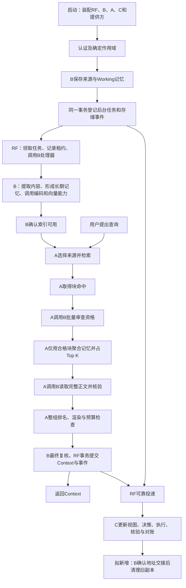

> 2026-09-22职责拆分已落代码，当前入口见[投影与搜索职责调整](12_投影与搜索职责调整_20260922.md)。本文历史批次说明不代表新多块业务已接通。

# P3 完整框架：对象、接口与运行流程

日期：2026-09-22。本文把已有部分和新增设计放进同一条流程，解释“谁产生什么、交给谁、接下来做什么”。查某个对象的全部字段或某个方法的准确输入输出，使用[全量对象与接口索引](10_P3全量对象与接口索引_20260922.md)。

**2026-09-22更新：RF统一监测、任务附件、处置引擎、配置和本地备份恢复及HTTP入口已有实现，详见[11实现与接入](11_RF公共底座实现与接入_20260922.md)。B/A/C新业务契约仍有待接入部分。** 此前“46个对象、13个接口”的讲解主要说明增量，没有完整呈现既有底座。本文纠正这个阅读范围；本文现已按本轮RF实现同步状态。

## 1. 先看系统由谁负责

| 角色 | 负责的事实 | 主要向其他角色提供什么 |
|---|---|---|
| RF：公共底座 | 身份、事务、任务、事件投递、诊断和执行证据 | 可信上下文；可靠的本地提交、后台执行与恢复机制 |
| B：Remember | 来源、记忆版本、正文、生命周期、索引发布资格 | 保存入口；精确记忆读取；最终资格判断；拟新增正文与地址交接接口 |
| A：Recall及共享编码能力 | 候选检索、排名、上下文计划与结果 | Query/Passage共享编码；只读检索；完整Context；拟新增按记忆聚合和整组提交 |
| C：Operate | 存储/访问视图、放置决策、迁移动作和执行证据 | 事件消费、调度、动作执行与对账；拟新增保护释放和清理回执 |

例如，“这条记忆是否已经删除”由B确认；“向量现在是否可搜”由向量提供方给证据；“新位置是否读得到正确正文”由执行器核验；“事件是否已交给C”由RF记录。一个模块不能凭自己的局部成功替另一个模块宣布成功。

本次全量目录的范围是四模块的P3契约层：

| 类别 | 已有 | 新增 | 总量 |
|---|---:|---:|---:|
| 对象类 | 72 | 46 | 118 |
| 接口方法 | 55 | 13 | 68 |
| Protocol接口组（读写拆分后） | 17 | 7 | 24 |

这68个方法主要是模块内部调用，不是68个HTTP地址。对象类定义信息格式；对象实例是一份具体信息；字段是其中一项信息；接口方法规定向谁提交什么、拿回什么。对象通过校验，不等于已经持久保存或完成外部操作。

Host、配置类、数据库内部字典、分词器等不在上述计数内，但它们同样参与运行，见第12节。本文采用三种状态：**已有本地实现**、**已有定义但部分实现/占位**、**新增契约待接入**。“本地实现”不等于生产环境验收。

## 2. 用一份会议记录串起全过程

假设调用者保存：“项目预算为30万元，10月交付。负责人为张某。”以后再询问“预算是多少，何时交付？”下面的来源ID、记忆ID只是讲解用的示例。



图中“多块发布、完整冲突组、地址交接”等是目标流程的一部分，尚未全部接入当前Host。下文每一步都同时说明当前运行方式和新增设计的位置。

## 3. 第一步：启动系统，给每次操作确定身份

实际入口是[ThreeFlows](../../AgentJYS-main/src/aether_agent_memory/runtime/flows/host.py)。它先创建Foundation，再装配Remember、Recall、Operate，以及编码器、向量存储、分词器和执行器。

| 时机 | 出现的对象/方法 | 应包含或完成的内容 | 当前状态 |
|---|---|---|---|
| 本地身份准备 | `Identity.provision` | 主体、归属范围、权限和凭据登记；属于运行辅助方法 | 已有本地实现 |
| 接收请求 | `IdentityPort.authenticate` → `Principal` | 验证凭据，得到`principal_id / home_scope / permissions / auth_epoch` | 已有本地实现 |
| 建立调用上下文 | `Identity.context` → `TrustedContext` | 主体、`request_id / operation_id / trace_id / span_id / deadline_at` | 已有本地实现 |
| 确定操作范围 | `ScopeSelector`、`Scope`、`select_scope` | 调用者指定应用/用户/会话等限制；RF与可信范围核对，不能靠请求扩大权限 | 已有本地实现 |
| 读写具体记录前 | `RecordRef`、`IdentityPort.authorize / revalidate` | 目标所属模块、对象类型、ID、scope、版本；重新检查权限及授权代次 | 已有本地实现 |
| 共享访问 | `AuthorizationGrant` | 对哪一记录、给哪个主体、授予什么权限、有效期与修订 | 已有契约及本地授权检查；不代表外部租户平台全链完成 |
| 部署及操作注册 | `ConfigurationSnapshot`、`OperationDefinition` | 配置指纹、提供方和策略版本、密钥引用；操作输入输出、权限、副作用、成功证据和恢复方式 | 已有RF服务，部署装配时注册 |

`memory_id`必须结合scope理解；精确读取还要带version。`operation_id`用于定位业务操作和查询原操作效果；`task_id`用于后台工作；`trace_id`连接调用链；`event_id`用于投递去重。它们不能互相代替。

当前身份实现是本地登记及检查机制。仅凭这些对象存在，不能宣布PRD中的外部租户接入、停用传播等全部实现。

## 4. 第二步：B保存输入，同时留下后台工作的入口

调用者将外部来源元信息放进`SourceInput`，将会议正文放进`TextInput`，与范围组成`RememberRequest`，调用`RememberPort.save(ctx, request)`。

当前基础入口支持文本，正文上限64KiB。`DocumentInput`虽然早已定义，basic保存入口目前会拒绝并说明文档适配器未配置。

| 顺序 | 对象与方法 | 内容及交接 | 当前状态 |
|---|---|---|---|
| 1 | `SourceInput / TextInput / RememberRequest` | 外部来源ID、版本、发生时间；正文；请求范围 → B.save | 已有本地文本入口 |
| 文档分支 | `DocumentReaderPort.acquire / parse` | `DocumentInput` → 原件获取证据`SourceAcquisition` → 解析正文`DocumentContent` | 已有契约，基础入口未接入 |
| 2 | `UnitOfWork.transaction`、幂等检查、授权检查 | 已有相同请求应识别重复；新请求在事务内登记来源与记忆 | 已有本地实现 |
| 3 | `SourceRef`、`MemoryRef`、`MemorySnapshot` | 来源版本与指纹；记忆scope/ID/version；内联正文、状态、来源与索引状态 | 已有本地实现 |
| 4 | `TaskSpec` → `TaskPort.enqueue` → `TaskRecord` | 登记`remember.extract`及其输入引用、幂等键、发起主体、期限和尝试预算 | 已有本地实现 |
| 5 | `StorageChanged` → `EventEnvelope` → `EventPort.append` | 将“已保存”的领域变化及其对象修订登记进待投递事件 | 已有本地实现 |
| 6 | `RememberReceipt` | 返回`saved / source / memories / task_ids / phase` | 已有本地实现；确认保存不等于长期索引已就绪 |
| 新权威记录 | `SourceRecord / MemoryRecord / ResourceLocation` | 原件与正文地址、内容指纹、对象/关系修订、后台任务和已发布索引 | 新增契约待接入 |

当前原文保存在SQLite的来源记录中，记忆快照也内联`content`；尚未整体改成新`MemoryRecord.body_location`。因此，“正文已经统一由P2存储并通过地址读取”不能作为当前实现的描述。

### 事务到底在哪里提交

`UnitOfWork.transaction()`提供事务上下文。内部用`Transaction.get / put_if_revision / remove_if_revision / scan_page`等方法读写；成功离开上下文后提交，异常时回滚。条件更新必须匹配旧修订，防止并发覆盖。

来源、Working记忆、后台任务和存储事件需要共同成立：不能保存成功却丢掉加工任务，也不能记录了事件却没有对应业务记录。耗时的文档读取、模型计算和向量调用在事务外执行，完成后回到短事务核验并落账。

这里没有一个名为`Transaction.commit`的公共契约方法。后面新增的`ContextAssemblyPort.commit`是“提交Recall业务结果”，它依赖这个通用事务机制。

## 5. 第三步：RF领取任务，B进行后台提取

| 时机 | 对象与方法 | 含义 | 当前状态 |
|---|---|---|---|
| 启动 | `TaskPort.register` | 注册任务类型、执行类别和`TaskHandler`；RF才知道交给哪个处理器 | 已有 |
| 有任务可执行 | `TaskPort.claim` → `TaskRecord + Lease` | Worker领取执行权；记录owner、token、到期时间、attempt和revision | 已有 |
| 正在执行 | `TaskHandler.run`、`AttemptRecord`、`TaskPort.renew` | 调用B/C处理器，记录本次尝试；RF的invoke循环为协作式异步处理器续租 | 已有本地实现 |
| B准备加工 | `ExtractionRequest` | 原文、SourceRef、待比较的已有记忆`existing`、策略版本 | 已有；当前existing为空 |
| 提取器返回 | `ExtractionPort.extract` → `ExtractionResult / CandidateFact` | 候选正文、来源、证据状态；模型和策略版本 | 已有基础提取 |
| B作事实判断 | `ExtractionDecision` | 对候选选择新增、纠正、保持或拒绝，绑定目标和预期修订 | 新增契约待接入 |
| 记录加工进展 | `ProcessingRecord / DerivedArtifact` | 关联RF任务、来源、阶段、已生成记忆/产物及质量 | 新增契约待接入 |
| 提交阶段结果 | `RunResult`、`TaskPort.complete` | 返回结果引用及副作用状态；完成任务要有可确认的输出 | 已有 |
| 等待/恢复 | `TaskWaitRecord / CheckpointRecord` | 保留原操作、依赖、下次检查时间；记录已提交输出及输入指纹 | 已有RF接口，复用既有任务引擎 |

默认提取器是`LiteralExtraction`：把原文作为基础Episodic内容处理。`LangMemExtraction`已有可注入适配，但当前基础任务没有完整接上“搜索旧事实 → 比较 → 语义纠正/新增Semantic”的链路，不能把演示中的一句话自动拆成多条高质量事实当作现成能力。

在目标流程中，B可用新增`MemoryCandidatePort.search`检索已有记忆作为提取上下文，再产生`ExtractionDecision`。它使用内部候选能力，不需要先生成一份给用户的Recall Context。

### 5.1 “领取任务”具体改变了哪些对象和字段

RF负责可靠地安排和记录执行，B负责提取和记忆处理。Worker是运行后台任务的执行循环，可以与RF、B在同一进程中；不是额外的业务流程。

| 顺序 | 谁产生、谁使用 | 对象及字段 | 字段在这一步的作用 |
|---|---|---|---|
| B登记工作 | B → RF.enqueue | `TaskSpec.task_id / owner_flow / kind` | 这项工作叫什么、业务归谁、调用哪类处理器；例如owner_flow为remember（B）、kind为remember.extract |
| 绑定输入 | B → RF，执行时再交给B | `TaskSpec.subject / input_ref / input_hash` | subject是被处理对象；input_ref定位已持久输入；input_hash供RF检查输入未变。它们不是RF理解业务正文的依据 |
| 约束重复与权限 | B → RF | `TaskSpec.idempotency_key / initiator_id / initiator_auth_epoch` | 重复登记识别；保留发起者及授权代次，执行时重新检查 |
| 限制执行 | B → RF | `TaskSpec.deadline_at / max_attempts` | 截止时间和最大执行尝试数；已有默认max_attempts=3，还须满足运行配置限制 |
| 保存待办 | RF创建，Worker读取 | `TaskRecord`继承TaskSpec全部字段；增加`state / revision / attempt / effect_status` | 初始pending、revision=1、attempt=0、effect_status=not_started |
| 普通领取 | Worker调用RF.claim，RF更新 | `TaskRecord.state / revision / attempt / lease` | 变为running，修订及执行尝试推进，附加Lease。恢复领取单独维护query_attempt，不等于再次正常执行 |
| 记录执行权 | RF生成，执行与提交时核对 | `Lease.owner_id / token / until` | 哪个Worker持有、这次领取的令牌、到何时有效；过期或令牌不符的旧执行者不能照常提交 |
| 调用B处理器 | RF → B.run | `TrustedContext.principal / request_id / operation_id / trace_id / span_id / deadline_at`及整个TaskRecord | 告诉B以谁的身份执行、追踪链是什么、截止时间与任务输入在哪里 |
| 留下本次证据 | RF登记，诊断与恢复读取 | `AttemptRecord.task_id / attempt / lease_token / request_id / trace_id / started_at / finished_at / effect_status / error_code` | 一项任务可有多次尝试，逐次保留运行身份、时间及结果。当前内部attempt字典还记录recovery等运行信息 |
| B准备业务输入 | B → ExtractionPort.extract | `ExtractionRequest.source / text / existing / policy_version` | 这是提取器真正需要的来源、原文、已有记忆和策略；RF不决定提取什么 |
| 返回业务候选 | 提取器 → B | `ExtractionResult.candidates / model_id / policy_version`；每个`CandidateFact.text / sources / evidence_status` | B据候选及证据形成记忆；默认LiteralExtraction并未完成完整语义比较链 |
| 提交业务结果与任务终态 | B在业务事务内调用RF.complete | `TaskRecord.result_ref / state / effect_status` | 结果引用与任务成功状态要共同提交；RF核对任务、租约和输出证据 |
| 从处理器返回 | B → RF.apply_result | `RunResult.outcome / effect_status / result_ref / operation_id / reason` | 成功时outcome=committed并带持久结果引用；RF检查是否已经原子完成，而非仅凭返回值标成功 |
| 等待重试/恢复 | RF维护，处理器参与判定 | `TaskRecord.query_attempt / next_run_at / required_outputs / error_code` | 查询尝试预算、下一次执行时间、必须确认的输出引用、失败码；required_outputs是RecordRef序列 |

`RecordRef`本身包含`owner / object_type / object_id / scope / version`。因此TaskSpec可以引用B保存的输入，RF只需知道如何定位、授权和校验它，不必把提取逻辑搬进RF。

下面仅示意普通领取前后会变化的字段，不是一份可直接提交的完整请求：

```text
领取前 TaskRecord：
  task_id = task_extract_01
  owner_flow = remember
  kind = remember.extract
  state = pending
  revision = 1
  attempt = 0
  lease = None

领取后，同一条 TaskRecord：
  task_id / owner_flow / kind 保持不变
  state = running
  revision = 2
  attempt = 1
  lease.owner_id = worker_01
  lease.token = 本次领取的唯一令牌
  lease.until = 本次执行权到期时间
```

RF随后根据kind找到已注册的B处理器，调用`B.run(ctx, task)`。当前实现位于[任务执行引擎](../../AgentJYS-main/src/aether_agent_memory/runtime/foundation/tasks.py)，B的业务及完成调用位于[Remember服务](../../AgentJYS-main/src/aether_agent_memory/remember/basic/service.py)。

发生异常时还会用到`RecoveryDecision.action / effect_status / reason / evidence / original_operation_id`：B判断可继续、仅查询原操作或需要人工关注，RF据此推进任务。`TaskWaitRecord`和`CheckpointRecord`现已有任务附件接口；完成断点自动记录，中间断点和依赖等待由B/C处理器按实际业务调用。

## 6. 第四步：同一套Embedding支持建库与查询

Embedding做的是把文本变成向量；保存和召回的用途不同，但必须使用兼容的模型空间。B负责投影写入、核验、清理与发布；A向B提供编码。B传`usage=passage`，A传`usage=query`。共享接口`EmbeddingPort.embed`已存在，输入`EmbeddingRequest`，输出`EmbeddingResult`，每个`EmbeddingItem`带输入序号、指纹和向量。

新增`EmbeddingSpace`把模型ID/修订、维度、tokenizer、Query/Passage前缀、归一化、距离算法与最大输入token显式放在一起。编码分词器与最终Context预算分词器各有用途，不能混用预算。

| 索引阶段 | 当前基础链路 | 新多块设计放在哪里 |
|---|---|---|
| 确定输入 | 一条记忆的整段content作为passage编码输入 | B从完整正文切块，生成`ChunkDescriptor`：编号、字符区间、vector_id、input_hash |
| 说明完整预期 | `ProjectionTarget`定位记忆版本和投影；基础路径使用单目标 | `ProjectionManifest`记录精确MemoryRef、generation、body_hash、空间、预期块数和全部块 |
| 写向量 | `ProjectionRequest` → `ProjectionPort.project` | `ChunkProjectionRequest` → `GenerationProjectionPort.project`，逐块绑定清单与批次 |
| 核查真实效果 | `VectorPort.inspect` → `ProjectionResult` | `GenerationVectorPort.inspect` → `ChunkProjectionResult`，用原请求查询而非另起操作 |
| 对外可用 | B核验旧投影后更新Ready | 全部预期块满足绑定和可搜条件后，B用`MemoryFoundationPort.publish_projection(tx, …)`按修订发布 |

右栏是新增契约，尚未取代左栏。仅有“块写入已受理”不足以发布完整批次；A只能接受B当前认可的版本及已发布批次，不能把新旧generation的块混成一条记忆。

这也是Recall与Embedding衔接的关键：**块用于找到相关记忆，记忆用于候选计数，完整正文用于Context。** 存储、向量索引和最终返回的粒度不必相同，但必须靠MemoryRef、批次和指纹建立明确对应。

## 7. 第五步：A按记忆召回，再向B取完整正文

当前公开入口是`RecallPort.recall(ctx, RecallRequest)`。A建立`RecallRecord`，选择来源并检索；调用者以后可以用`status`查阶段，用`result`取已提交结果。当前`result`还会重新检查资格。

| 阶段 | 参与对象与方法 | 核心内容 | 当前状态 |
|---|---|---|---|
| 接收查询 | `RecallRequest / RecallRecord` | 查询、范围、来源、token预算；记录ID、阶段、修订、期限和结果可用性 | 已有 |
| 读Working | `MemoryReadPort.working`、`PageRequest` → `MemoryReadBatch` | 受控分页读取快照与资格；Working-only可绕过长期向量检索 | 已有 |
| 编码Query | `EmbeddingPort.embed` | Query必须与已建索引空间兼容 | 已有 |
| 查长期向量 | `VectorSearchRequest` → `VectorSearchPort.search` → `VectorSearchResult / VectorCandidate` | 当前按命中target向B读取，检查Ready和指纹，并有界扩大limit去重 | 已有基础链路 |
| 新候选入口 | `MemorySearchRequest` → `MemoryCandidatePort.search` | 独立给`memory_top_k / chunk_page_size / max_chunk_hits / max_rounds / deadline_at` | 新增待接 |
| 新分页取块 | `ChunkSearchRequest` → `GenerationSearchPort.search` → `ChunkSearchResult / ChunkHit` | 命中带MemoryRef、generation、body_hash、块编号、输入指纹、排名和分数 | 新增待接 |
| 新候选资格审查 | 拟新增 `MemoryQualificationPort.qualify(ctx, targets, purpose)` → `CandidateQualificationResult` 列表 | A 传精确命中身份；B 核验权限、版本、来源、正文指纹及已发布批次，返回判定、权威清单与修订戳，不读取正文 | 文档设计，待补代码契约及实现 |
| 新聚合结果 | `MemoryCandidate / MemorySearchResult` | 只有 B 审查通过的块才能聚合；同记忆一个名额，取最高有效块分数，记录工作量、覆盖和停止原因 | 新增待接 |
| 当前正文读取 | `MemoryReadPort.load(refs)` → `MemoryReadBatch` | B 在 load 内先 final_guard，再返回允许读取的内联正文；审查和读取合并，当前冲突列表为空 | 已有基础读取 |
| 新正文读取 | `MemoryFoundationPort.load_bodies(refs)` → `FullBodyReadResult` | 每项返回完整正文、来源、地址、实际路径及`GuardStamp`；不可读则明确原因 | 新增待接 |

候选阶段只能使用 B 返回 allowed 的命中；excluded 明确排除，unverifiable 表示无法确认，不能算作普通空结果。不足 K 时 A 有界补取并逐轮重新审查。前置审查不会替代读取时核验和最终提交复核。拟新增资格接口及两个对象尚未写入代码目录，不计入当前正式对象/方法数量。输入输出完整字段见[B 候选审查流程](../测试与验收/测试人员交接包_20260922/03_对象与接口/02_三个业务流程_对象与接口.md#b-4)。

例如K=2，三个命中均经 B 审查通过，块命中顺序是`m1/块2`、`m1/块5`、`m2/块1`。前两个命中共同占m1的一个名额，m2占第二个名额。A随后要求B读取m1、m2的完整正文，不把这三个片段直接拼成最终答案。

去重键要带scope；验证时使用精确版本和已发布generation。同一记忆的不同版本不能各占一个名额。补取达到K、候选耗尽、块预算/轮数耗尽或截止时间后停止，并给出准确原因；“允许返回不足K”与“没有相关记忆”不是同一个结论。

这里的K是**长期主候选记忆数**。Working、必需冲突关系补全成员不占这个K，但全部进入最终token预算。K也不保证最终返回K条：正文不可读、资格变化和预算不足都可能使最终条数更少。

## 8. 第六步：把候选变成可提交的Context

当前A已经能基于`MemorySnapshot`进行记忆级融合，按实际分词器计数，构造单条原文`ContextGroup`并形成`ContextPack`；超预算的条目跳过。当前主链还没有完整接上冲突组、压缩表示及新增plan/commit服务。

下面是新契约要求接入的位置：

| 顺序 | 对象/方法 | 应完成什么 |
|---|---|---|
| 1 | `RecallPlanRequest` → `ContextAssemblyPort.plan` | 使用已明确的来源、截止时间、预算与Context分词器；有长期来源才带`long_term_search` |
| 2 | `MemorySearchResult`、Working结果 | 获得候选；按记忆/来源排名融合，`RankingEvidence`记录source_rank及RRF贡献 |
| 3 | `FullBodyReadResult / GuardStamp` | 向B取完整正文；记下对象修订、关系修订、授权代次和正文指纹 |
| 4 | `ConflictGroup` → `ContextPackUnit` | 无冲突是一条完整记忆；有必需冲突关系则补齐全部成员，作为整体单元 |
| 5 | `ContextAssemblyPlan` | 整组尝试加入，渲染正文及附加文本，以实际分词器核算整包token；记录跳过组和降级原因 |
| 6 | `ContextCommitRequest` | 为全部入包成员取得最终GuardStamp，绑定原计划及Recall预期修订 |
| 7 | `ContextAssemblyPort.commit(tx, ctx, request)` | 在同一短事务内重验权威状态，保存结果、Recall状态及对应outbox，返回结果RecordRef |
| 8 | `ContextItem / ContextGroup / ContextPack` | 对外输出正文、出处、表示、范围、覆盖、预算/实用token和提交时间 |

这8步中的新接口仍待实现。模型validator能检查传入凭据是否齐全、一致，但不会主动查询数据库，也不会自行调用tokenizer。真实资格核验、真实token计数及事务提交必须由服务补齐。

旧`MemoryReadPort.final_guard`返回的是`EligibilityBatch`，没有直接返回新`GuardStamp`所需的全部关系修订和正文绑定信息。接入新提交流程时，要补齐B侧凭据生成和事务内重验，不能只把旧返回值改名就交给commit。

组包应遵循以下规则：

1. 同一记忆在某来源只贡献一次排名，不因为命中多个块就多次加分。RRF的`rrf_k`是平滑常数，和`memory_top_k`无关。
2. 无冲突时一条完整记忆就是一个单元；必需冲突组必须整体呈现。不能只保留其中更容易读取或排名更高的一方。
3. 若一个来源不可用，但其他独立来源有可信完整内容，可以降级交付；若某冲突组残缺，排除该组，其他合格完整组仍可评估交付。准确结论依赖覆盖与失败原因。
4. token预算针对最终渲染文本，包含正文、出处和组说明等实际输出。装不下就跳过整个单元；当前新计划要求保留完整正文，不能偷偷截成命中片段。
5. 从读正文到提交期间，若对象、关系、授权或正文指纹变化，需要重建计划或结束本次尝试，不能用旧凭据宣告成功。

`ArtifactRecord`已有压缩表示及质量字段，`DerivedArtifact`新增了来源级加工产物定义，但当前新`FullBodyReadResult`/`ContextAssemblyPlan`要求完整权威正文。若以后要把压缩表示作为可选输出，仍需补齐表示选择、权威来源核验和预算规则，不能认为字段存在就已经接通。

## 9. 第七步：RF把事件可靠交给C

B写`StorageChanged`，A写`AccessObserved`，C写`ActionChanged`。这些是不同领域的载荷，共用`EventEnvelope`：事件ID、类型、生产者、对象引用/修订、发生时间、追踪/因果标识、发起主体及载荷指纹。

| 环节 | 方法与对象 | 作用 |
|---|---|---|
| 注册 | `Events.register_type / subscribe` | 运行辅助方法：登记载荷校验及订阅者，当前已有 |
| 生产 | `EventPort.append(tx, ctx, envelope)` | 与业务写入同事务持久保存事件及投递待办 |
| 投递 | `Events.dispatch_once`、`DeliveryRecord` | 逐消费者跟踪待投递、尝试和确认状态；当前已有 |
| 消费 | `EventPort.consume(tx, consumer_id, event, apply)` | 通过inbox去重，并在同一消费事务内更新视图 |
| C应用 | `SchedulingPort.consume` | 读取领域载荷，更新存储/访问事实及待调度项 |

因此，“事件投递”也不只是两行接口定义：还有订阅注册、投递循环、持久outbox、inbox去重和逐消费者投递状态。确认丢失时可以重投，消费者应避免重复应用。

`AccessObserved`包含`stage / outcome / access_key / memory / representation / elapsed_ms`。C要按成功读取等有效事实累计热度并去重；“被选中”和“已读正文”和“已放入Context”不能各自都当作一次新的成功读取加热。

这里是允许有延迟的异步协作。C的视图可能落后，所以后续动作还要看水位、精确版本及B的当前资格；不能把“事件最终会到”当作当前状态一定新鲜。

## 10. 第八步：C调度、执行、核验，并交回地址

| 阶段 | 对象与方法 | 应提供的内容 | 当前状态 |
|---|---|---|---|
| 汇总输入 | `SchedulingInput`、`ExecutorPort.resources` → `ResourceSnapshot` | 精确记忆/修订、存储与访问水位、热度、当前层、容量、策略及覆盖 | 已有本地实现 |
| 新显式视图 | `SchedulingRound / BufferEntry` | 轮次、截止时间、动作预算；驻留地址、容量、访问和保护引用 | 新增契约待接入；当前使用内部字典 |
| 决策 | `SchedulingPort.decide` → `PlacementDecision` | 保持或迁移、当前/目标层、理由、策略和输入水位；普通迁移受相邻层约束 | 已有 |
| 准备动作 | `ActionIntent` | action_id、决策、内容表示和指纹、Provider实例与预期epoch | 已有 |
| 执行 | `SchedulingPort.execute` → `ExecutorPort.submit` → `ExecutionFeedback` | 提交精确动作并登记执行反馈，不把受理直接当成功 | 已有LocalCacheExecutor |
| 对账 | `ExecutorPort.query / observe / verify_read` | 原动作反馈、`PlacementObservation`、`ReadProof`；核对内容、实例和位置 | 已有 |
| 记录 | `ActionRecord / ActionChanged` | 动作状态、修订、反馈、清理状态和原因；产生事件 | 已有 |
| 串接完整迁移 | `MigrationPlan / ProtectionReference` | 先保护旧资源，再记录新地址核验、交接及旧副本清理进度 | 新增契约待接入 |
| 交给B改权威地址 | `ReferenceHandoff` → `MemoryFoundationPort.accept_handoff` → `ReferenceHandoffReceipt` | 原地址、新地址、预期对象修订、读证明引用；B核验后条件更新 | 新增契约待接入 |

目标流程顺序为：**保护旧资源 → 写/移到新位置 → 读回核验 → B按修订确认权威地址 → 清理旧副本 → 释放相应保护并完成对账。** 具体保护释放时机要与所保护目标及正在执行的清理动作对应，不能只因超时就假定没人再使用。

当前执行器确实执行本地文件操作，但不等于真实P2/生产介质分层已经验收。当前成功动作的`cleanup_state=completed`仅能说明现有本地路径，不证明新设计的地址交接和逐目标清理回执已全部实现。

## 11. 第九步：纠正、删除、故障恢复与健康检测

### 纠正与删除怎样进入同一框架

| 操作 | 已有入口与对象 | 新增设计的接续 |
|---|---|---|
| 纠正正文 | `RememberPort.correct`接`CorrectionRequest`，核对expected_version，返回`RememberReceipt` | 新版MemoryRecord与ProjectionManifest须重新绑定；旧版本/批次不能继续进入候选 |
| 归档/激活 | `RememberPort.lifecycle`接`LifecycleRequest`，返回MemorySnapshot | 正文、索引和关系资格应一同由B判断 |
| 删除记忆/来源 | `RememberPort.delete / delete_source`接`DeleteRequest`，返回DeleteReceipt | 逻辑阻断后生成CleanupRequest，列出精确目标与保护引用 |
| 取历史/来源 | `MemoryReadPort.history / source` | history返回带资格的MemoryReadBatch；source只返回SourceRef |
| 清理保护 | 现有RF任务及C恢复机制承载后续工作 | `LifecycleCleanupPort.release_protection`按预期修订确认释放，返回ProtectionReference |
| 核实物理清理 | 当前已有向量逐版本删除和本地缓存清理路径 | `LifecycleCleanupPort.cleanup`返回CleanupReceipt，包含每个CleanupTargetResult及释放确认 |

`DeleteReceipt.blocked=true`说明已不可召回；物理清理是否完成还要看`cleanup_state`与剩余目标。新增`CleanupRequest`绑定逻辑阻断时间，不能直接拿来表示“仍有效记忆迁移后的普通旧副本清理”。来源原件保留策略也不能因向量已删就默认完成。

### 故障后有哪些信息帮助继续

RF已有`TaskRecord / AttemptRecord / Lease / RunResult / RecoveryDecision`。未知副作用要沿原`operation_id`查询，不能直接重新创建操作并重复执行。运维可提交`RecoveryRequest`给`TaskPort.request_recovery`，得到可查询的`OperationRecord`。

`TaskHandler.recover`给出恢复证据，C的`SchedulingPort.reconcile`沿原action_id向执行器查询并对账。`TaskWaitRecord / CheckpointRecord`已接入RF：等待绑定领取令牌并影响下一次调度，阶段断点与输出同事务保存；具体业务是否能续作仍由领域处理器判断。

诊断有`DiagnosticRecord`和`MaintenanceRecord`：前者说明哪个对象在哪个阶段发生了什么，后者记录谁因何执行维护、采用什么配置以及结果引用。已有`DiagnosticsPort.record / record_maintenance / related / operation / task`负责记录和查询；通用分页用`PageRequest / RecordPage / RelatedRecords`。`ErrorResponse`规定结构化错误字段，但不同入口还需要落实异常映射。

### 日志、健康及其他公共能力现在到哪一步

| 能力 | 当前实现 | 尚需接入或验证的部分 |
|---|---|---|
| 节点日志 | Telemetry现有节点同时生成NodeLogRecord，MonitoringPort.emit绑定可信span，新格式查询保留身份和scope过滤 | 云端集中采集与OTLP尚未接通 |
| 统一健康 | Health.report将真实探针映射为HealthObservation及RuntimeHealthSnapshot；MonitoringPort.health检查有效期和配置，Diagnostics.health输出兼容旧格式 | 未采集、过期、授权或配置变化时不能视为可用；仍需目标环境探针验证 |
| 任务与心跳 | 原Tasks引擎接入WorkerHeartbeat、TaskWaitRecord和CheckpointRecord；任务完成自动记录断点 | 中间阶段断点和依赖等待由具体业务处理器按需调用 |
| 监测处置 | SignalDefinition、SignalObservation、OperationDefinition、DispositionRule、IncidentRecord已有持久注册、采样约束、共享任务派发与独立复验 | 部署方需注册真实依赖采样器、维护处理器和业务验证回调，不默认重启任意Provider |
| 配置与备份 | ConfigurationSnapshot条件激活及历史；BackupManifest记录SQLite在线备份和实际隔离恢复证明 | 快照不执行Provider热切换；外部向量/原件、模型与独立日志需各自备份 |
| 运行入口 | Python Host/CLI及鉴权HTTP入口已可运行，共用原任务循环 | 外部身份、生产数据库、多副本、云部署仍待对应环境实现或验证 |

健康与恢复的对象链是：HealthObservation → RuntimeHealthSnapshot；SignalObservation → DispositionRule → IncidentRecord → 原Tasks中的维护任务 → 独立业务验证。维护任务结束不会直接关闭异常；未决异常不会因持续故障自动另起新操作。

**公共底座已补入上述本地服务，但仍不能说整个产品和部署全部完成。** 健康快照的production_acceptance固定false；本地SQLite恢复证明也不等于外部存储和生产系统恢复验收。源码、用法及本轮验证见[RF实现与接入](11_RF公共底座实现与接入_20260922.md)。

## 12. 不在118个对象、68个方法计数内，但实际运行必需的支撑

这些是运行类、适配器、辅助方法或内部持久记录。下表按职责呈现，不把仓库所有私有函数都列成公共接口。

| 支撑 | 何时出现、包含什么、交给谁 | 源码 |
|---|---|---|
| `ThreeFlows / Foundation` | 启动时保存uow、identity、tasks、events、diagnostics、telemetry及B/A/C和Provider实例 | [业务Host](../../AgentJYS-main/src/aether_agent_memory/runtime/flows/host.py)、[底座Host](../../AgentJYS-main/src/aether_agent_memory/runtime/foundation/host.py) |
| `ThreeFlows.tick / drain`、`Foundation.worker` | 推进心跳、过期Recall恢复、事件投递及任务执行；tick可选触发周期调度。drain用于本地推进待办 | 同上 |
| `Tasks.run_once / sweep / apply_result / apply_recovery` | 执行领取、到期检查、处理器调用、返回结果和恢复建议落账 | [任务引擎](../../AgentJYS-main/src/aether_agent_memory/runtime/foundation/tasks.py) |
| `Events.subscribe / register_type / dispatch_once` | 启动注册消费者与事件类型，运行时投递并确认 | [事件运行](../../AgentJYS-main/src/aether_agent_memory/runtime/foundation/events.py) |
| `SQLiteTransaction.read / write / rows / revision / page` | 内部存储辅助；供本地实现读写记录和分页，不是额外对外领域接口 | [事务实现](../../AgentJYS-main/src/aether_agent_memory/runtime/foundation/storage.py) |
| `Identity.context / permits`及请求辅助 | 构造可信上下文；做权限判断；`select_scope / request_key / event_context / text_hash`处理范围、幂等、异步上下文及指纹 | [身份](../../AgentJYS-main/src/aether_agent_memory/runtime/foundation/identity.py)、[请求辅助](../../AgentJYS-main/src/aether_agent_memory/runtime/foundation/requests.py) |
| `RecallSettings` | 启动配置Context分词器、候选上限、输出条数、发现上限、超时、重排及Milvus。当前默认candidate_limit=20、max_items=5、max_discovery=100；这些不等于新memory_top_k已接入 | [召回配置](../../AgentJYS-main/src/aether_agent_memory/recall/basic/config.py) |
| `Sources / SourceResult` | Working/长期检索运行：source、候选快照列表、coverage、reads、rejected、reason交给Recall融合 | [来源检索](../../AgentJYS-main/src/aether_agent_memory/recall/basic/retrievers.py) |
| `RankedMemory / fuse / assemble` | memory与score、按记忆融合、构造单条原文分组；是当前Context基础实现 | [组包组件](../../AgentJYS-main/src/aether_agent_memory/recall/basic/components.py) |
| `TokenCounter / ModelTokenizer` | 最终渲染预算检查；默认o200k_base或注入/配置的分词器 | [分词器](../../AgentJYS-main/src/aether_agent_memory/recall/basic/tokenization.py) |
| `Reranker / CrossEncoderReranker` | 候选重排；默认disabled，启用需模型和策略配置 | [重排器](../../AgentJYS-main/src/aether_agent_memory/recall/basic/reranking.py) |
| `NativeP3Embedding / LexicalEmbedding` | 默认native；lexical作为显式测试选择。落实同一EmbeddingPort协议 | [原生编码适配](../../AgentJYS-main/src/aether_agent_memory/recall/embedding/p3.py)、[本地适配](../../AgentJYS-main/src/aether_agent_memory/recall/basic/adapters.py) |
| `SQLiteVectors / MilvusVectors` | 默认SQLiteVectors；配置Milvus后可选其适配。落实旧VectorPort，尚非新GenerationVectorPort | [本地向量](../../AgentJYS-main/src/aether_agent_memory/recall/basic/adapters.py)、[Milvus适配](../../AgentJYS-main/src/aether_agent_memory/recall/basic/milvus.py) |
| `LiteralExtraction / LangMemExtraction` | 默认原文提取；模型提取可注入，不因此自动启用完整旧事实更新/删除链 | [基础提取](../../AgentJYS-main/src/aether_agent_memory/remember/basic/extraction.py) |
| `LocalCacheExecutor.ensure / purge` | 本地资源准备/清理辅助，配合submit/query等执行器方法 | [本地执行器](../../AgentJYS-main/src/aether_agent_memory/operate/basic/executor.py) |
| `Operate.periodic / run / recover` | 根据事件待办或周期安排有界决策，承接RF任务与恢复 | [调度服务](../../AgentJYS-main/src/aether_agent_memory/operate/basic/service.py) |
| `Recall.recover_expired` | Host推进时处理过期未完成Recall，保留可查询失败阶段 | [召回服务](../../AgentJYS-main/src/aether_agent_memory/recall/basic/service.py) |
| `Telemetry / Node`与`Health` | 节点日志、真实探针和运行查询已适配新监测契约 | [日志实现](../../AgentJYS-main/src/aether_agent_memory/runtime/foundation/telemetry.py)、[健康探针](../../AgentJYS-main/src/aether_agent_memory/runtime/flows/health.py) |

当前还持久保存一些内部记录字典：RF的任务/尝试/outbox/inbox/投递状态；B的来源、记忆与加工输入；A的Recall请求/结果与向量记录；C的视图、待办和任务动作关系。它们装的是运行状态或序列化的对象，并不都拥有单独的Pydantic类。新对象接入时需要明确这些内部记录的映射或迁移，不能再叠一套互不更新的权威状态。

## 13. 三条流程相互交接时，重点核对什么

| 交接 | 上游必须提供 | 下游如何使用 | 当前仍需完成的部分 |
|---|---|---|---|
| B → 向量存储适配器 → B | 精确记忆、正文指纹、编码空间、完整预期块清单 | 向量侧逐块给真实写入/可搜证据，B发布一个批次 | 新Manifest与GenerationVectorPort未接入 |
| A命中 → B资格 | scope/记忆ID/version、generation、正文与输入指纹 | 只接纳B当前认可的有效版本和批次 | 候选契约已有待接；独立 B 审查接口仍为文档设计；当前 load 内先核验，再由 A 检查旧 target 与快照 |
| B正文 → A组包 | 完整正文、出处、资格/关系修订、必需冲突成员 | 补全整体单元，计入真实预算；提交前重验所有成员 | 新正文接口待接；basic.load目前不提供实际冲突组 |
| A提交 → RF → C | 已提交结果对应的访问事实及稳定去重键 | RF投递，C按阶段和结果去重更新热度 | 已有基础事件机制；新plan/commit仍待连接 |
| C新位置 → B权威地址 | 旧地址、新地址、预期对象修订、原动作及读证明 | B验证并条件更新，回执确认后C才处理旧副本 | 新handoff与MigrationPlan未接入 |
| B删除 → C清理 → B | 逻辑阻断、精确目标、保护引用；逐目标执行证据 | 明确区分不可召回、清理中、部分失败、全部完成 | 新CleanupRequest/Receipt未接入；普通迁移清理另有语义 |
| 任一流程 → RF健康/恢复 | 可关联日志、原操作ID、证据有效期、输出及副作用状态 | 查询、恢复、独立业务验证后关闭异常 | 统一契约已适配；具体依赖维护策略及目标部署仍需接入 |

当前流程图的一些表述仍需要与PRD对齐，详见[流程图与PRD V1.3一致性检查](../架构设计/P3_流程图与PRD_V1.3一致性检查_20260921.md)：来源故障/冲突组残缺时的降级范围、压缩表示的读取路径、来源选择和调度细节等。本轮整理没有修改用户流程图或PRD，也没有因为图里缺一项就断言代码里完全没有这项能力。

接下来实现时，可以复用现有身份、事务、任务、事件、日志和基础三流程。需要新增接线的主干是：多块索引发布 → 记忆级候选 → 权威正文读取 → 完整组包与提交；迁移保护 → B地址交接 → 清理回执；按部署配置启用已实现的监测处置与业务复验。每条主干都应明确输入来源、持久记录及提交边界。

## 14. 如何查阅与本次校核范围

先读本文理解时序，再查[全量索引](10_P3全量对象与接口索引_20260922.md)：118个对象逐一列用途、产生/消费时机、状态及799个字段条目，68个方法逐一列调用目的、准确签名、提供/消费方和实现状态。799按“对象里的字段条目”统计，包含在不同对象中重复出现的字段名。

本文及全量索引已合并替代此前的增量讲解和新增对象字段字典，重复旧文件已清理。[对象搭建与接入说明](06_P3底座与三流程对象搭建_V0.1.md)继续保留工程接入要求和原契约验收关联。

本次依据四模块模型、Protocol、目录、Host装配和本地服务源码核对，校验对象/方法覆盖、字段提取和文档链接。本轮RF代码与验证结果见11实现说明；生产验收未执行。接口catalog里的统一`implemented: false`是历史契约目录标记，本地实现状态以本文列出的源码及适用边界判断。
