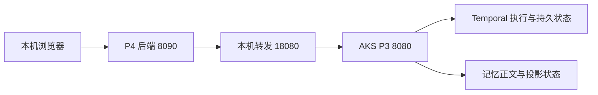

# P4 接入当前 P3 与业务闭环验证 Implementation Plan

> **For agentic workers:** REQUIRED SUB-SKILL: Use superpowers:executing-plans to implement this plan task-by-task. Steps use checkbox (`- [ ]`) syntax for tracking.

**Goal:** 让一个最小 P4 Web 客户端实际调用 Azure 上的 P3，完成多业务场景的跨会话召回、更正、删除与范围隔离，并留下可复查的业务证据。

**Architecture:** 先在本机启动 P4，由 P4 后端通过端口转发调用 AKS 的 P3；网页只调用 P4 后端。闭环通过后，将同一个 P4 部署到现有 AKS，通过集群内 Service 调用 P3。第一阶段回答直接展示真实 ContextPack 的正文与来源，后续再接真实 LLM 验证回答质量。

**Tech Stack:** Python ≥3.13、httpx、Pydantic、现有 P4 HTTP Server、同源 HTML/JavaScript、AKS/ACR。

**Spec:** [设计验证方法与判定矩阵](../测试与验收/P3_设计验证方法与判定矩阵_20261001.md)的“P4 真实使用与项目完整性”；具体字段以[当前 Remember 契约](../../AgentJYS-main/src/aether_agent_memory/remember/contracts/models.py)、[Recall 契约](../../AgentJYS-main/src/aether_agent_memory/recall/contracts/models.py)及部署中的 `/openapi.json` 为准。

日期：2026-10-01。状态：**P4接入计划，以下P4代码实施与Web联合测试尚未执行。** 已核对源码、部署资源和云端API/readyz，没有新建或部署P4。随后独立HTTP客户端已执行[多场景跨会话云端验证](../测试与验收/P3_多场景跨会话验证方案与实测_20261001.md)，18项执行15通过、3未通过；不能代填为P4 Web通过。按[用户已确定的分工](15_会后五项整改任务分配与验收_20260930.md)，P4 Web验证由陈天驰负责，测试人员负责用例、自动化与结果；本文不改变分工。

## 全局约束

- 当前 P3 为 `aether-p3-demo` namespace 的 `p3:8080`；本机转发地址为 `http://127.0.0.1:18080`。不需要新虚拟机或公网 IP。
- 当前云端使用 local + lexical、literal 加工和 SQLite；第一阶段不能据此宣布真实 LLM、P2、Milvus或语义质量验收通过。
- 身份来自 P3 Bearer 凭据。当前测试身份的 home scope 为 tenant=`local`、application=`app`、user=`local_admin`、agent=`agent`；浏览器提交的租户/用户/Agent 字段不能授予权限。
- `ScopeSelector` 只收窄授权范围，没有 `tenant_id` 字段。长期跨会话可在同一可信身份的home scope内用 `selection: {}`；多项目场景使用共同的可信 `task_id`，去掉 `session_id` 限制，防止不同项目混入。Working 测试保留对应会话/任务限制。
- P3 token 留在 P4 后端环境或 Kubernetes Secret；不放进 HTML、浏览器存储、源码、镜像、日志或测试报告。ACR 拉取密码与 P3 token 是两种不同凭据。
- 每个原始业务命令有稳定 `X-Operation-ID`，格式为 `[A-Za-z0-9_-]{1,128}`。同一命令重试保留 ID、原始正文、来源和时间戳；Recall、Remember、更正、删除分别使用不同 ID。
- `saved` 表示保存已确认；后台加工与可召回状态另查。失败、未就绪、空结果、部分覆盖分别显示。
- P4 第一阶段会话可暂存进程内存。P4 重启丢失本机会话是已知限制，不据此宣称上层会话已经持久化；刷新或重启后不自动重发未确认的写入。
- 必要源码和页面依赖放 `AgentJYS-main`；可运行部署文件及正式结果放 `交付成果`。构建上下文、原始响应和过程日志放项目外工作区。

## 重点检查的五种情况

1. 请求返回 `REQUEST_IN_PROGRESS` 时仍可能在云端执行；保留操作句柄，查询原操作，避免重复写入。（任务 2）
2. Remember 已保存但尚未合并/投影时，页面不得显示“已可长期召回”。（任务 2、3）
3. 新会话用自己的 `session_id` 限制长期 Recall，会把旧会话材料排除；跨会话测试应使用获准的长期范围。（任务 3）
4. 更正/删除后，旧 ContextPack 或页面缓存仍可能含旧正文；再次获取结果必须经过 P3 最终复核。（任务 4）
5. 参考回答写回会产生另一条旧事实，干扰更正/删除判断；第一阶段只明确保存用户新材料，提问和参考回答不自动入库。（任务 3）

## 现在先做什么

在本机 PowerShell 执行现有脚本，保持端口转发运行：

```powershell
& 'E:/projects/codex/aether/交付成果/部署运行/打开P3接口文档.ps1'
```

打开 [P3 接口文档](http://127.0.0.1:18080/docs)，并检查 [readyz](http://127.0.0.1:18080/p3/readyz) 返回 `readiness: ready`。2026-10-01 本次核对中，四个 Deployment 均 1/1 Ready，当前 API 路由存在；这只是接入前提，不是 P4 联调结果。

接下来完成任务 1～3，再运行本机 P4。**仓库旧 P4 不能只换地址就直接启动联调**：它调用 `/api/v1/context`、`/api/v1/memory/events` 等旧接口，未发送当前 Bearer 凭据，返回值解析也不兼容。



## 旧 P4 与当前 P3 的接口映射

这里的“旧接口”指 P4 客户端调用的 P3 路径。P4 自己对网页提供 `/api/v1/...` 路径可以继续保留。

| 旧 P4 调用/解析 | 当前应接入 | 必须同步改变的行为 |
|---|---|---|
| `GET /health` | `GET /p3/live`、`GET /p3/readyz` | 连通和就绪分别判断；503 不算业务就绪 |
| `POST /api/v1/context` | `POST /p3/recall` | 使用 `selection`、`sources`、`token_budget`；携带 Bearer 和命令 ID |
| `context.memories` / `memory_refs` | `groups[].items[]` | 读取 `content`、`memory`、`sources`；保留冲突组、coverage 和降级原因 |
| `POST /api/v1/memory/events` | `POST /p3/remember` | 使用 `source`、`selection`、`content`；保存回执中的 `memories`、`task_ids`、`phase` |
| `POST /api/v1/b2/long-text` | 第一阶段文本使用 `POST /p3/remember` | 先验证短文本；旧 200 万字节上限不代表当前请求一定支持，文件上传另按实际契约接入 |
| `GET /api/v1/b2/tasks/{id}` | `GET /p3/operations/{job_id}` 及 `/result` | 用 `X-P3-Job-ID` / `Location`，不能把外部命令 ID 当作 job_id |
| 无就绪查询 | `GET /p3/remember/{memory_id}/processing` | 必要时先 `POST /p3/remember/consolidate`，再等待原记忆处理和派生记忆投影 |
| 无明确更正/删除 | `POST /p3/remember/{memory_id}/correct`、`/delete` | 先取当前快照获取版本与 object_revision；不能仅再保存一条新金额冒充更正 |

保存示例；示例 ID 和时间仅用于解释，实施时在首次命令创建后固定原值：

```json
{
  "source": {
    "kind": "conversation",
    "external_id": "p4_mem_demo_20261001_a",
    "external_version": "1",
    "occurred_at": "2026-10-01T08:00:00.000Z"
  },
  "selection": {"session_id": "p4_session_a"},
  "content": {"kind": "text", "text": "项目预算为20万元，每周五汇报。"}
}
```

长期跨会话 Recall 示例，同一可信身份的新会话使用获准的长期范围：

```json
{
  "query": "项目预算和汇报安排是什么？",
  "selection": {},
  "sources": "long_term",
  "token_budget": 1000
}
```

所有业务请求带 `Authorization: Bearer <P3 token>`；上述两个 POST 分别带不同的 `X-Operation-ID`。Swagger 当前是普通 Authorization Header 依赖，不假设存在可用的全局 Authorize 按钮。

## 任务 1：适配当前 HTTP 契约与可信范围

**文件：** 修改 [client.py](../../AgentJYS-main/src/aether_p4_simulator/client.py)、[server.py](../../AgentJYS-main/src/aether_p4_simulator/server.py)、[models.py](../../AgentJYS-main/src/aether_p4_simulator/models.py)；新增 `AgentJYS-main/tests/unit/test_p4_current_p3_client.py`。

**接口：** 在 `P3MemoryClient` 中增加 `bearer_token: str` 构造参数；提供 `recall(payload: dict[str, Any], *, operation_id: str) -> dict[str, Any]`、`remember(payload: dict[str, Any], *, operation_id: str) -> dict[str, Any]`、`get_memory(memory_id: str) -> dict[str, Any]`、`get_processing(memory_id: str) -> dict[str, Any]`。在 `server.build_service()` 读取新配置 `AETHER_P3_BEARER_TOKEN`，保留现有 `AETHER_P3_BASE_URL`。

- [ ] 先写 `test_recall_uses_current_route_and_headers`：MockTransport 收到 `/p3/recall`、正确 Bearer 与稳定命令 ID、准确的 `selection/sources/token_budget`，请求体无旧 `tenant_id/max_tokens` 字段。
- [ ] 写 `test_remember_freezes_source_and_content`：同一命令的第二次发送保持完整请求体和时间戳相同。
- [ ] 写 `test_browser_identity_cannot_expand_p3_scope`：测试身份只使用服务端允许的 application/user/agent；伪造其他身份拒绝或被明确排除，不能生成扩大权限的 selector。当前 P4 默认 `company-assistant` 要与 P3 允许的 `agent` 匹配。
- [ ] 运行新增测试，确认旧实现因缺少接口/鉴权而失败；实现当前字段映射和服务器配置后再运行，全部通过。

此任务只建立真实接口适配；MockTransport 通过是客户端契约证据。

## 任务 2：保留异步操作与就绪状态

**文件：** 修改 `client.py`、`models.py`、`server.py`；新增 `AgentJYS-main/tests/unit/test_p4_current_p3_operations.py`。

**接口：** 增加 `get_operation(job_id: str) -> dict[str, Any]`、`get_operation_result(job_id: str) -> dict[str, Any]`、`consolidate(selection: dict[str, Any], *, operation_id: str) -> dict[str, Any]`。增加 `P3OperationPending`，包含 `job_id`、`location`、`payload`、`status_code`，供 P4 返回操作句柄。扩展 `P3ClientError` 保留 `code/retryable/job_id/location`；任何错误不得带 token。

- [ ] 先写 `test_400_in_progress_preserves_operation_handle`：P3 HTTP 400 + `code=REQUEST_IN_PROGRESS` 时保留 `Location` 和 `X-P3-Job-ID`。当前 P3 没有统一返回 202；P4 可将这种待完成状态转换成自己的 202 响应。
- [ ] 写 `test_pending_poll_does_not_repeat_write`：页面轮询期间只查询原操作，Remember POST 次数仍为 1；GET `/result` 返回原回执。
- [ ] 写 `test_failed_task_with_null_error_is_not_success`：`failed/attention_required/cancelled` 均不能显示完成；即使 `error_code` 为空也显示真实失败状态。
- [ ] 写 `test_saved_and_ready_are_distinct`：`awaiting_consolidation/processing` 不显示 ready；关闭当前测试会话批次后，检查原记忆 `state=completed`，并逐一核对 `derived_memory_ids` 的 `projection_state=ready`；没有符合条件的长期派生记忆时显示未产出，不假装可召回。
- [ ] 实现 HTTP 单次请求超时 40 秒，以容纳当前 P3 约 30 秒同步等待。浏览器查询从 1 秒退避至最多 5 秒，观察预算 120 秒；到期显示“仍在处理/待确认”及操作 ID，停止自动轮询。提高 HTTP 超时不能替代修复已发现的 Recall 重试耗尽问题。
- [ ] 请求断线且无句柄时记录未确认命令，保留原 ID 和原请求体；不得另造 ID 重发写入。同 ID 不同正文应返回/展示 `IDEMPOTENCY_CONFLICT`。
- [ ] 运行新增测试，确认先失败后通过；对返回句柄的 Location 只允许当前 P3 的 `/p3/operations/...` 相对路径，不盲目跟随任意地址。

## 任务 3：完成最小 P4 页面与业务链

**文件：** 修改 [service.py](../../AgentJYS-main/src/aether_p4_simulator/service.py)、`models.py`、`server.py`、[现有 P4 测试](../../AgentJYS-main/tests/unit/test_p4_simulator.py)、[P4 运行文档](../../AgentJYS-main/docs/P4_SIMULATOR.md)；新增 `AgentJYS-main/src/aether_p4_simulator/static/index.html`、`app.js`、`style.css`。需要打包页面时在 `AgentJYS-main/pyproject.toml` 声明这些 package data。

**接口：** 保留 P4 会话创建和 `POST /api/v1/sessions/{session_id}/messages`，将其用于提问与 Recall；增加 `POST /api/v1/sessions/{session_id}/memories` 用于明确保存用户材料。两种命令都接收 `client_operation_id`，由服务端绑定当前会话和原始请求。增加 `GET /api/v1/operations/{job_id}`、`/result`、`GET /api/v1/memories/{memory_id}/processing` 和 `POST /api/v1/sessions/{session_id}/consolidate` 代理当前获准资源。页面同源由 P4 提供。

- [ ] 写 `test_new_session_recalls_authorized_long_term_memory`：会话 A 保存，B 提问；长期 Recall 不带会话 B 的限制；返回的具体正文、MemoryRef 和 SourceRef 被展示。另写 Working 限定会话测试，不能通过取消范围限制获得 Working 跨会话成功。
- [ ] 写 `test_reference_answer_is_derived_from_contextpack`：回答直接引用 `groups[].items[].content`；来源来自实际 `sources`。空包显示“没有找到记忆”，降级包显示具体原因；不存在任何 Mock 填充路径。
- [ ] 写 `test_question_and_reference_answer_are_not_saved_as_new_facts`：提问只 Recall；点击“保存记忆”才 Remember，未将参考回答重复保存成独立旧事实。
- [ ] 页面提供：新建会话、输入、保存记忆、提问、加工状态、正文与来源、最近命令/任务 ID。遇到冲突展示完整组，不能只取其中一个值。更正/删除按钮在任务 4 接入后启用。
- [ ] 增加 `AETHER_P4_HOST`：本机默认 `127.0.0.1`，容器配置 `0.0.0.0`；P4 `GET /health` 用 P3 readyz 判断业务连通；本机页面不开放任意跨域调用。
- [ ] 更新旧测试对 P3 路由与字段的断言，保留有意义的失败测试；运行 P4 测试集及修改文件的 Ruff 检查。

完成以上任务后，本机启动方式如下。两个新增变量必须先完成对应实现；下面不是旧代码已经可用的启动承诺：

```powershell
Set-Location -LiteralPath 'E:/projects/codex/aether/AgentJYS-main'
$env:PYTHONPATH = 'E:/projects/codex/aether/AgentJYS-main/src'
$env:AETHER_P3_BASE_URL = 'http://127.0.0.1:18080'
$env:AETHER_P4_HOST = '127.0.0.1'
$env:AETHER_P4_PORT = '8090'
$env:AETHER_P4_P3_TIMEOUT_SECONDS = '40'
$env:AETHER_P3_BEARER_TOKEN = [IO.File]::ReadAllText('E:/projects/codex/.agent-work/aether/workspace-support/aks-demo-20261001/credential').Trim()
& 'E:/projects/codex/.agent-work/aether/workspace-support/temporal-migration-20260930/venv/Scripts/python.exe' -B scripts/p4_simulator.py
```

在当前电脑可复用上述 Python 环境；其 editable 安装可能指向旧工作树，因此必须设置当前 `PYTHONPATH`。其他电脑由负责人创建 Python ≥3.13 环境并按当前 `pyproject.toml` 安装依赖，不复制本机凭据路径。启动后打开 `http://127.0.0.1:8090`，保存测试材料、等就绪，再在新会话提问。

## 任务 4：更正、删除与旧结果复核

**文件：** 修改 `client.py`、`service.py`、`server.py` 与 P4 页面；新增 `AgentJYS-main/tests/unit/test_p4_current_p3_lifecycle.py`。

**接口：** 增加 `correct_memory(memory_id: str, payload: dict[str, Any], *, operation_id: str) -> dict[str, Any]`、`delete_memory(memory_id: str, payload: dict[str, Any], *, operation_id: str) -> dict[str, Any]` 和 `get_recall_result(recall_id: str) -> dict[str, Any]`。P4 对网页提供 `POST /api/v1/memories/{memory_id}/correct`、`/delete` 及 `GET /api/v1/recalls/{recall_id}/result`。

- [ ] 写 `test_correction_uses_current_version_and_source`：先 GET 当前 MemorySnapshot；更正 POST 使用 `expected_version=ref.version`、`expected_object_revision=object_revision`、新 `content`、新 `source` 和 `reason`。正文预算改为15万；源事件和命令 ID 是新的，不能复用原保存命令。
- [ ] 写 `test_delete_uses_object_revision`：先取当前快照，删除请求的 `expected_revision` 使用 **object_revision**，不是 `ref.version` 或快照 `revision`。发生版本冲突显示冲突并刷新，由用户明确再次操作。
- [ ] 写 `test_old_recall_is_revalidated_after_mutation`：更正/删除后重取旧 Recall 走 `/p3/recalls/{recall_id}/result`，不直接返回缓存包；遇到 410 或其他真实失效响应撤下旧正文。
- [ ] 实现并运行测试。删除回执的 `blocked=true` 表示交付阻断，不等于物理擦除完成；清理状态另展示，保留来源策略也不能显示为“所有数据已擦除”。

更正应针对当前已召回的、包含预算的长期记忆。原 Working 记录、派生长期记忆及可能的独立来源分别列出；删除一条记忆不能假定所有衍生记录都已同步清除。若其它获准记录仍能召回，先确定来源关系和业务删除范围，再按当前删除/来源删除契约验证；不要把这些记录忽略后宣布测试成功。

## 任务 5：本机真实联调，然后部署现有 AKS

**文件：** 新增 `AgentJYS-main/tests/integration/test_p4_current_p3.py`、`AgentJYS-main/Dockerfile.p4`、`交付成果/部署运行/P4_AKS联调部署.yaml`；执行完成后才创建正式测试结果。报告引用证据编号，原始执行记录保存项目外。

- [ ] 先运行下表 CL-01～03，再按[多场景跨会话方案](../测试与验收/P3_多场景跨会话验证方案与实测_20261001.md)执行CS-01～13与CS-17～21；普通业务场景使用独立可信 `task_id`，CS-17～20必须在同一任务下混合四主题。新查询不携带旧正文。测试调用真实P4 HTTP服务，由P4调当前云端P3；用例使用唯一 `p4_test_*` 来源/会话ID，仅操作本次测试创建的材料。
- [ ] 完成任务 4 后运行 CL-04～05。CL-06～08 独立记录；没有独立身份或测试环境时标注依赖阻塞/未执行，不以默认 local_admin 冒充多租户验收。
- [ ] 使用现有 ACR 构建独立 P4 镜像；`Dockerfile.p4` 只复制 P4 Python 模块及 static 页面，安装其 httpx/Pydantic 依赖，入口为 `python -m aether_p4_simulator.server`。构建上下文不含 credential、kubeconfig、项目资料和部署数据。
- [ ] `P4_AKS联调部署.yaml` 包含单副本 P4 Deployment 与 ClusterIP Service：namespace=`aether-p3-demo`，Service/容器端口=`8090`，`AETHER_P3_BASE_URL=http://p3:8080`、`AETHER_P4_HOST=0.0.0.0`，P3 token 由独立 `p4-p3-client` Secret 注入，镜像拉取使用已有 `acr-pull`。不把 Secret 明文写进交付 YAML。
- [ ] 仅新增 P4 资源，保持 P3/Temporal 执行身份与原 PVC。部署后检查 P4 health，再通过本机 `18090:8090` 转发复跑同一业务场景。

P4 在不同 namespace 时，P3 地址使用 `http://p3.aether-p3-demo.svc.cluster.local:8080`。本机部署后访问命令：

```powershell
kubectl --kubeconfig 'E:/projects/codex/.agent-work/aether/workspace-support/aks-demo-20261001/kubeconfig' -n aether-p3-demo port-forward service/p4 18090:8090 --address 127.0.0.1
```

公网 HTTPS 放在公司远程演示阶段，为 P4/Web 设置入口和接入认证即可；P3/Temporal 保持集群内访问。当前不存在 `service/p4`，完成部署后才执行上述命令。

## 业务场景与通过判断

以下CL是最小操作闭环；用户要求的多业务场景与跨会话范围以[CS-01～21及EXT业务样例](../测试与验收/P3_多场景跨会话验证方案与实测_20261001.md)为准。本轮独立HTTP客户端的Azure结果不能代填P4页面联调结果。已发现CS-11/19/20相关性失败，P4不得以HTTP200或ContextPack available直接显示“问题已回答”，应展示实际材料/来源与能力限制，复验保留原失败输入。

| 编号 | 操作 | 通过条件 |
|---|---|---|
| CL-01 保存 | 会话 A 保存“项目预算为20万元，每周五汇报” | 真实 P3 回执 `saved=true`；能查到对应正文、来源、版本、命令/任务 ID |
| CL-02 加工 | 关闭该测试会话批次并查处理状态 | 原记忆 `completed`，相关长期派生记忆投影 ready；页面没有提前报 ready；未产出或失败如实显示 |
| CL-03 新会话使用 | 相同可信身份新建 B，长期提问预算与汇报时间 | P4 从真实 ContextPack 读出20万和每周五，来源指向 CL-01 材料；无需浏览器保存会话 A 文本才能回答 |
| CL-04 明确更正 | 对预算记忆调用 correct，改15万，等新版本就绪，再开 C 提问 | 当前版本使用15万；旧20万不得作为该事实的当前值；独立来源冲突如实展示；旧 Recall 重取不交付已失效正文 |
| CL-05 删除 | 根据实际 MemoryRef/来源关系明确删除范围并执行，再查询新/旧结果 | 被删除/阻断材料不交付；其它独立记忆及来源范围逐一记录；清理中不冒充物理擦除完成 |
| CL-06 身份与范围 | 缺/错 token；另一个真实受限身份；Working 两会话 | 允许路径成功、禁止路径无正文泄漏；单个管理员身份不算多租户通过 |
| CL-07 等待与重试 | 即刻查未就绪、同命令重试、同 ID 改正文、请求断线 | 未就绪/失败真实显示；原命令不重复副作用；冲突不覆盖；记录当前 Recall 重试耗尽缺陷，不伪装为空结果 |
| CL-08 重启恢复 | 在独立测试环境按明确故障点重启，再查原结果与新请求 | 已确认保存不丢；新请求成功；报告恢复用时及人工步骤；P4 会话持久化与 P3 持久化分别判断 |

每个场景记录：环境/镜像 Digest、真实或替身依赖、输入、预期、实际状态、P4命令ID、P3 job_id、recall_id、MemoryRef/SourceRef，以及 `GET /p3/operations/{job_id}` 返回的 `temporal.workflow_id` 与 `temporal.binding`。截图辅助展示，正文/版本/来源及实际操作结果用于判定。

当前已知失败须进入结果：立即长期 Recall 可能耗尽重试；Temporal 单独重启后 P3 自动就绪恢复未通过，需要受控重启 P3。等待就绪和受控恢复是当前测试安排，不能把它们记成缺陷已经修复。详见[AKS实际部署与验证](../部署运行/P3_AKS部署进度_20261001.md)。不要在现有演示 PVC 上直接进行故障注入或清空数据。

## 实施时的验证命令与交付门槛

在业务目录中使用当前 `PYTHONPATH` 和选定 Python 环境：

```powershell
python -B -m pytest -q -p no:cacheprovider tests/unit/test_p4_current_p3_client.py tests/unit/test_p4_current_p3_operations.py tests/unit/test_p4_simulator.py tests/unit/test_p4_current_p3_lifecycle.py
python -B -m ruff check --no-cache src/aether_p4_simulator tests/unit/test_p4_current_p3_client.py tests/unit/test_p4_current_p3_operations.py tests/unit/test_p4_current_p3_lifecycle.py tests/unit/test_p4_simulator.py
```

这些是**待实施测试命令**，新增文件当前尚不存在。集成测试默认不连接云端；显式配置 `P4_E2E_BASE_URL` 和 `P4_E2E_ENABLE=1` 后才运行 `tests/integration/test_p4_current_p3.py`，凭据留在 P4 后端。所有测试缓存/原始报告输出指向项目外工作区。

交付时分别给出三项状态：客户端契约测试；真实 Azure P3 的 P4 业务闭环；真实模型/P2/身份、故障、性能和公司 UAT。第一项通过不能代填第二项，前两项通过也不能代填完整产品验收。

## 相关入口

- [服务、API 和 Temporal 页面](../部署运行/P3_AKS查看服务与Temporal页面_20261001.md)
- [当前 AKS 部署进度与已知失败](../部署运行/P3_AKS部署进度_20261001.md)
- [设计验证矩阵](../测试与验收/P3_设计验证方法与判定矩阵_20261001.md)
- [现有职责分工](15_会后五项整改任务分配与验收_20260930.md)
