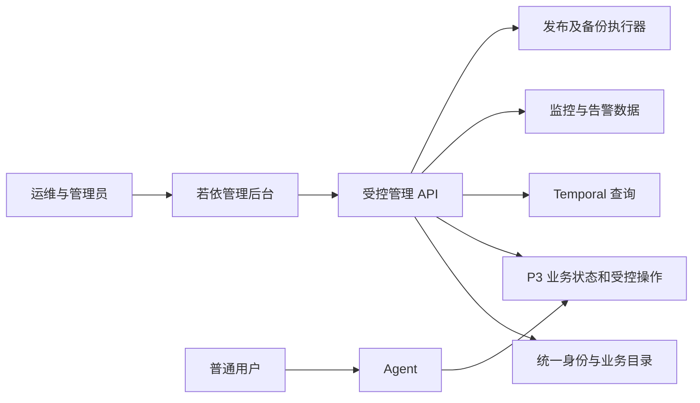

# Aether 后台运维需求与若依适配评估

日期：2026-10-06。性质：需求与框架适配评审，未实施迁移。先独立定义运维后台需求，再评估框架能力。P0/P1/P2 是本文建议的后台建设优先级，不改变现有 PRD 的产品阶段。

## 一、评判结论

我们的后台应帮助运维人员完成“发现异常 → 判断业务影响 → 定位原因 → 授权处置 → 验证恢复 → 留下记录”。账号表格只是其中一部分。

按这一目标，ruoyi-vue-pro（芋道）适合成为长期运维管理后台的开发底座：复用权限、菜单、表单、审计、租户管理等通用设施，承载 Aether 专属的运行、任务、记忆和故障页面。但它不自带 P3/Temporal 运维能力，接入后仍须建设业务观测和受控操作接口。

当前不据此立即替换 Budibase。是否值得迁移，取决于完整运维工作台的长期需求和接入成本，不能用自带菜单数量衡量。若只维护少量账号，继续当前方案成本较低；若要长期维护下列业务工作台，芋道值得作为主候选验证。

## 二、从运维人员的工作定义需求

### 1. 角色与可操作范围

以下是建议的职责划分，可由同一人兼任，但权限应分别授予；不声称现有系统已经具备这些角色。

| 职责 | 需要看到、能够处理 | 权限边界 |
|---|---|---|
| 平台运维 | 全局健康、依赖、工作流、发布版本、容量、备份、受控恢复 | 默认查看元数据；不因运维身份自动获得所有聊天和记忆正文 |
| 平台管理员 | 租户开通、账号、角色、启停用、权限同步 | 不自动获得数据库清空、集群管理或 P3 恢复权限 |
| 租户管理员 | 本租户用户、使用情况、任务摘要、异常与支持请求 | 后端限制租户范围；不进入全局基础设施管理，也不默认读取成员私有内容 |
| 审计／支持人员 | 授权范围内的事件、操作记录和请求追溯 | 默认只读；查看正文另行授权、记录用途及范围 |

### 2. 必需功能与优先级

| 编号／优先级 | 运维问题 | 后台应提供的功能 | 最低验收结果 |
|---|---|---|---|
| O01／P0 运行总览 | 今天系统能否正常服务，影响了谁？ | Agent、P3、身份服务、Temporal、各存储与模型依赖状态；异常租户数；回答、保存、可检索三个独立业务状态；数据采集时间 | 能区分进程存活、依赖可用与业务成功；采集失败或过期显示未知，不显示正常 |
| O02／P0 请求诊断 | 用户说“很慢／失败／没有记住”，从哪里查？ | 按时间、用户或请求编号查一次对话；关联 turn、operation、job、workflow、trace；拆分鉴权、排队、Recall、来源复核、LLM、保存耗时 | 运维不依赖聊天正文也能定位失败阶段；首字、完整回答、记忆保存耗时分别展示 |
| O03／P0 任务与积压 | 哪些任务卡住了，能否恢复？ | 受理、等待转交、已启动、执行、重试、未知结果和终态；最老等待时长；前后台任务积压；原任务查询及受支持的控制动作 | 查询到原操作，不因超时创建重复写入；控制请求显示受理与完成的区别 |
| O04／P0 记忆处理与有效性 | 保存了为什么召回不到，更正／删除是否生效？ | 原文保存、提炼、投影、索引资格、Recall 结果状态；版本、来源和失败原因；更正、失效、删除处理进度 | saved 不冒充可检索；检索不到能区分未就绪、无相关结果、权限限制和依赖故障；删除处理各阶段可追溯 |
| O05／P0 故障与告警 | 无人打开后台时能否发现问题？ | 错误率、耗时、最老任务、投影失败、依赖中断、身份同步失败等规则；级别、去重、认领、维护静默、恢复与关闭 | 告警记录影响范围与负责人；关闭有恢复依据；通知渠道投递失败可见 |
| O06／P0 租户与访问治理 | 给谁开通、谁被停用、权限是否真正生效？ | 租户及用户创建维护、角色、启停用、身份映射；Keycloak 与 P3 同步状态、失败重试和读回结果 | 普通用户无租户选择；租户管理员不能越界；停用后新请求和旧结果读取遵守最新权限 |
| O07／P0 变更与操作审计 | 谁改了什么，失败后怎样追查？ | 操作者、目标、原因、前后值摘要、命令编号、时间、结果；受控任务恢复与配置变更；日志脱敏 | 无法绕过后端权限；命令失败不显示完成；审计能关联执行结果且不记录密码、令牌或默认正文 |
| O08／P0 基础视图、P1 自动化 配置与发布 | 线上实际跑哪个版本，变更生效了吗？ | 环境、实际调用目标、代码／制品摘要、配置版本、发布时间；差异和回退记录；配置校验及读回 | 能区分同基础镜像下不同挂载源码，区分新旧服务；可追溯变更目标及当前生效版本 |
| O09／P0 基础视图、P1 自动化 备份与恢复 | 数据出问题后能恢复到哪里？ | 按平台库、身份库、P3、正文存储、向量数据及 Temporal 列出备份范围、最近成功、保留期和恢复演练证据 | 能看到遗漏及过期；恢复到隔离目标验证业务；RPO/RTO 由演练测量，不由“备份成功”推定 |
| O10／P1 容量、用量与成本 | 是否快满了、谁占资源、费用为何上涨？ | PostgreSQL、Redis、Milvus、Ceph、PVC 容量及趋势；模型调用量、tokens、失败／重试；按租户聚合和预算提示 | 成本估计标注价格与计量口径；租户套餐菜单权限不冒充 tokens／存储配额 |
| O11／P1 服务与资源台账 | 哪些资源还在用，旧服务能不能下线？ | 业务用途、实际路由、负责人、工作流命名空间、数据卷、依赖与退役状态 | 能发现退出入口但仍执行周期任务的服务；删除前保留数据与回退条件 |
| O12／P1 运营支持，P2 扩展 | 如何处理重复工单和计划维护？ | 支持记录、维护公告、故障复盘、导出摘要；需要时加入审批和周期报告 | 支持记录关联真实故障；审批范围由操作影响确定，不先引入复杂流程引擎 |

首期可合并成六个入口：运行总览、请求与任务、记忆状态、故障告警、租户与权限、配置与运维记录。菜单数不等于需求数；配置与运维记录中先提供发布、备份和审计的最小视图。

### 3. 对首页的具体判断

首页首先显示需要处理的异常：受影响用户／租户、失败和过久等待、记忆不可用、依赖异常、身份同步失败、备份过期。其次显示业务成功率和分阶段耗时，再下钻到基础设施。

CPU、内存、在线人数可作为辅助信息。它们无法解释“回答成功但保存失败”“Pod 正常但 Recall 慢”“旧服务没有入口却仍运行周期任务”。

成功率须固定分母和窗口，排队等待与执行耗时分别统计；unknown 与失败、成功分别计数。指标采集本身失联应有独立检测。告警采集／投递应避免全部依赖后台页面服务存活。

## 三、现有工程资产与实际缺口

本轮读到的平台源码 HEAD 为 `70be04d7efb67858cc4f6442c54a11d4b99801ab`，位置见证据 E04。默认项目目录与平台工作树不同，不混用。

| 已有证据 | 能复用什么 | 仍缺什么 |
|---|---|---|
| Azure 发布记录已记载 Agent、后台、身份、平台库迁移，仍为单实例测试部署 | 现有用户、业务链路、统一身份、部署基础 | 不应因换框架重复建设核心对话；完整管理与生产运维仍需补齐 |
| 当前管理代码提供用户／租户列表、审计、显示名维护和停用 | 目录、身份校验、租户范围、管理 API 的已有行为 | 完整开通、角色分配、重启用、跨系统一致性和运维角色 |
| P3 有 health、runtime、traces、tasks、progress、incidents、control 等接口 | 运维后台的服务侧基础 | 聚合视图、全链路关联、指标历史与告警闭环；接口覆盖与权限仍须逐项验证 |
| Temporal UI 已有受控入口 | 深入查看工作流历史 | 业务请求到工作流的关联与受支持控制；不必重做完整 Temporal UI |
| 延迟排查与后续优化报告 | 证明分阶段观测的必要性 | 旧排查中的排队问题已在后续样本中改善，不能冒充当前仍未修复；持续分位数与负载监测尚需建设 |
| 2026-10-06 旧工作负载审查 | 证明资源台账与退役流程的必要性 | 后台长期记录路由、历史工作流、数据卷和退役依据 |

特别核对：P3 虽注册 `/p3/backups`、`/p3/restore-drills`，当前 `lifecycle.py` 的实现明确拒绝在线备份／替换，并要求 `pg_dump` 与隔离 `pg_restore`。因此不能把这两个现有路由直接做成“一键备份恢复完成”。需要真实运维执行器、产物校验及恢复演练。

## 四、再看若依能做到什么

### 1. 评估对象与证据等级

主要对象是本机已有 **ruoyi-vue-pro（芋道）**，非所有名为若依的项目。后端分支 `master-jdk17`，HEAD `3a6150f544444495a39a14087389fad278be5844`，POM 标记 `2026.09-SNAPSHOT`、Java 17。本轮后端 `git diff --stat` 无输出；未验证完整供应链或部署制品一致性。

当前 POM 启用 system、infra，AI、BPM 等模块被注释。源码存在不代表本机实例已启用。下表中的“原生基础”指本地源码可证的框架设施，不代表已经接通 Aether 或完成业务验收。

### 2. 按需求映射

| 需求 | 芋道提供的基础 | Aether 仍需完成 | 判断 |
|---|---|---|---|
| O01 运行总览 | 页面、图表接入；Spring Boot Admin 等集成基础 | Python、Temporal、存储、模型指标接入；业务状态汇总与影响面 | 能承载，核心内容定制 |
| O02 请求诊断 | API 访问／错误日志含 traceId；日志与追踪集成 | 跨 Java/Python/Temporal 的关联编号与时间线、分阶段耗时；敏感字段裁剪 | 部分复用，不能自动全链路追踪 |
| O03 任务与积压 | 定时任务 CRUD、日志、触发，底层 Quartz | P3／Temporal 原任务查询、状态映射、幂等控制与授权 | 任务页面需专门开发；Quartz 不接管现有工作流 |
| O04 记忆治理 | 表格、详情、表单、代码生成 | Remember/Recall/Operate 状态、版本、来源、投影、更正／删除资格 | 主要为领域开发；通用 AI/RAG 模块不能等同 P3 |
| O05 故障告警 | 通知、邮件／短信模板和日志等设施 | 指标采集、规则、去重、认领、静默、恢复判断；接现有或选定监控告警系统 | 通知基础可用，告警系统不自动具备 |
| O06 租户与访问 | 租户、套餐、用户、角色、菜单按钮权限、数据库租户拦截 | Keycloak／平台目录衔接、唯一归属、P3 授权投影、撤销传播 | 通用设施匹配度高，接入改造仍大 |
| O07 操作审计 | 操作日志、登录日志、接口权限 | 业务命令结果、前后值摘要、统一操作编号、留存／访问保护 | 值得复用，不能默认等同完整审计闭环 |
| O08 配置与发布 | 配置 CRUD、表单校验、权限 | Aether 配置契约、版本校验、生效确认、AKS／制品状态、回退执行 | 配置页面可复用，发布能力需接入 |
| O09 备份恢复 | 页面和任务展示设施 | 各系统备份执行器、一致性、隔离恢复、RPO/RTO 测量 | 没有已核实的一站式原生能力 |
| O10 容量与成本 | Redis 统计、数据库连接池等局部监控，报表开发基础 | Azure PostgreSQL/Milvus/Ceph/PVC、模型计量与成本、配额执行 | 局部复用；报表模块另核启用与依赖 |
| O11 资源台账 | CRUD、树表、筛选、导出 | Kubernetes/Azure 只读采集、实际依赖与退役规则 | 页面开发适合，资源事实需接入 |
| O12 运营支持 | 通知公告、表单；可选 BPM | 工单业务模型、故障关联；按需要启用审批 | 可逐步扩展，不是首期依赖 |

### 3. 不能因功能名称相似而直接替代

- **Java 监控与全平台监控**：Spring Boot Admin 面向 Spring Boot 应用；Python P3、Temporal 和云存储必须另接指标、探针或监控查询 API。
- **Redis 监控与记忆系统监控**：核对的 RedisController 使用其注入的 StringRedisTemplate 读取 INFO、DBSIZE 和 commandstats；不能证明已覆盖 Aether 的 Redis，更不能说明记忆与向量的一致性。
- **Quartz、Flowable 与 Temporal**：Quartz 管周期调度，Flowable 可用于人员审批；现有 P3 的持久执行、原操作恢复继续由 P3/Temporal 负责。
- **菜单／行权限与记忆资格**：若依权限管后台功能及其数据访问；P3 仍须校验对象归属、私有／共享、版本、来源有效性、删除状态和授权撤销。
- **套餐与资源配额**：租户套餐的菜单权限不能直接限制模型 tokens、并发、记忆容量或费用；这些需要业务计量与服务端执行。

### 4. 身份接入与日志的两处具体改造

本地前端 LoginForm 在启用多租户时显示 tenantName，并按租户名称／网站解析租户；这不符合普通用户无感知租户的目标。后端 TenantSecurityWebFilter 已会在认证后补取用户租户，或拒绝请求租户与认证租户不一致，因此不能误判为“只信请求头”。真正需要改造的是统一身份接入和目录映射，并检查忽略租户的路径；不能只隐藏输入框。

平台目录、Keycloak、若依用户表不能成为三套独立可修改的业务权限来源。首个验证阶段保留现有目录权威，验证可信身份到若依权限的适配；若以后让若依接管目录，应单独制定迁移、主体 ID 保留、投影与撤销方案。只复用前端可降低身份冲突，但会减少 system 模块的复用收益。

ApiAccessLogDO 含 requestParams 和 responseBody 字段。接 Aether 时必须按端点裁剪／脱敏，不能把完整聊天、记忆正文或令牌自动写入后台日志。MIT 许可文本要求保留版权和许可声明，不能照搬 README 中“不用保留 Copyright 信息”的宣传描述；第三方组件许可另核。

## 五、推荐接入边界与决策门槛

建议让若依承载管理交互，通过受控管理 API 查询状态和提交命令；P3、Temporal、监控系统、备份／发布执行器各自保有事实和执行职责。普通用户继续使用 Agent。

这表示职责边界，不要求每个框都是独立微服务。早期可在现有服务中增加适配模块。Java 后台的新增运行、构建、数据库升级和运维成本要纳入选择；仅增加一个若依实例并不会减少现有系统复杂度。

推荐先验证一条可评审的运维闭环：**从失败／超时请求进入原任务详情，查看分阶段耗时和错误，执行已获授权且契约支持的恢复，读回原操作的业务结果并留审计**。同时验证租户隔离和日志脱敏。该闭环需要的新接口、代码量、依赖和维护成本，比框架演示页面更能决定是否迁移。

首期不重写 Agent/P3，不让后台直接改业务表、任意删 Redis Key 或直接执行任意云命令。已有受控接口可复用；不存在或不支持的动作不做成可点击的成功按钮。上线切换前保留原后台及数据，验证登录、管理范围、业务链路和撤销行为，再决定入口替换及旧服务退役。

## 六、证据与限制

本轮完成需求文档、交付记录及本地源码静态核查；没有启停服务、运行若依与 Aether 集成测试或复验当前云端。历史故障只用于提炼需求；最新修复与发布记录优先于早期报告。没有声称 P0 工作台已实现，也不以页面存在证明业务能力。

- E01：[租户与身份需求 TEN-01～08](../PRD版本/PRD补充_租户与身份接入.md)。
- E02：[此前平台替换方案](Agent平台与低代码管理后台替换方案_20261005.md)，用于恢复业务范围，不把其早期“尚未实施”沿用为最新状态。
- E03：[Azure 发布记录](../部署运行/Agent平台Azure发布记录_20261005.md)、[首字优化验收](../测试与验收/Agent首字优化实施与验收_20261005.md)、[旧工作负载退役审查](../测试与验收/AKS旧工作负载退役审查_20261006.md)。
- E04：[当前平台源码](C:/Users/27921/.codex/worktrees/agent-platform/aether/AgentJYS-main/src/aether_platform/management.py)、[目录](C:/Users/27921/.codex/worktrees/agent-platform/aether/AgentJYS-main/src/aether_platform/directory.py)、[P3 HTTP](C:/Users/27921/.codex/worktrees/agent-platform/aether/AgentJYS-main/src/aether_agent_memory/runtime/flows/http.py)、[生命周期管理](C:/Users/27921/.codex/worktrees/agent-platform/aether/AgentJYS-main/src/aether_agent_memory/runtime/foundation/lifecycle.py)。
- E05：[芋道本地 README](../部署运行/ruoyi-vue-pro本机体验/source/backend/README.md)、[POM](../部署运行/ruoyi-vue-pro本机体验/source/backend/pom.xml)、[LICENSE](../部署运行/ruoyi-vue-pro本机体验/source/backend/LICENSE)。
- E06：芋道本地 `TenantSecurityWebFilter.java`、`TenantDatabaseInterceptor.java`、`TenantServiceImpl.java`、`JobController.java`、`RedisController.java`、`ApiAccessLogDO.java` 和前端 `LoginForm.vue`，核实范围见正文。
- E07：[上游项目](https://github.com/YunaiV/ruoyi-vue-pro)。此链接用于项目归属，能力结论以本次本地固定快照为准，未声称核验上游最新发布。
