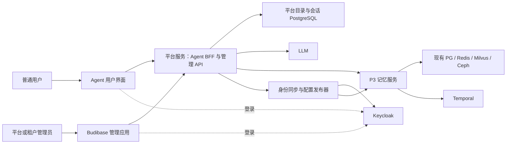

# Agent 平台与低代码管理后台替换方案

日期：2026-10-05；状态：供评审的整体设计与分阶段实施方案，尚未实施。

本方案对应用户要求：替换现有 P4，提供登录后即可对话的简易 Agent 平台；用开源低代码平台替换管理界面；普通用户唯一租户、后端自动绑定；平台管理员与租户管理员分权；接替验证完成后清理旧实现。第一阶段不建设工作流画布、插件市场、多 Agent 编排。

## 1. 推荐决策

采用 **React 用户界面 + Python/FastAPI 平台服务 + Keycloak + Budibase 开源自托管版 + 现有 P3**。

- 用户界面只提供登录、会话列表、新建会话、对话、回复来源及必要的记忆状态。
- 平台服务同时包含 Agent BFF、管理 API、身份目录和同步任务，模块隔离、初期同进程部署，避免立即拆成很多微服务。
- Keycloak 管理认证、密码、OIDC 会话；平台身份目录管理业务租户、唯一账号归属、业务角色及启停用。Keycloak 组织/应用角色及 P3 身份是目录的受控投影，不是第二套可随意修改的业务目录。
- Budibase 负责管理表格、表单、页面和筛选。所有业务读写经过管理 API；它不直接改 P3 数据表、Keycloak 数据库或业务身份目录。
- P3 继续负责记忆写入、提炼、向量投影、授权检索、版本、删除和后台任务；Agent 负责对话组织与最终回答。
- 默认使用开源免费能力，不把商业插件列为 MVP 必需依赖。Budibase 的用户组、强制 SSO、PKCE OIDC 等付费能力单独列明。

**明确推荐 Budibase，而非把低代码平台作为 Agent 执行引擎。** 选择依据是本项目需要账号集成和 CRUD 后台，Budibase 的开源自托管版已有基础 SSO、RBAC、表单和 REST 接入。租户级授权仍由我们实现。它并不能让完整身份治理变成零代码配置。

MVP 假设：账号由管理员创建或邀请，普通用户不自主选择租户；一个固定 Agent、一套默认模型配置；同租户不同普通用户的对话和记忆默认私有；管理员管理账号不自动获得阅读聊天正文的权限。

## 2. 本轮代码核对与现状

核对目录为 `E:/projects/codex/aether/AgentJYS-main`。本轮开始时根仓库分支为 `codex/azure-source-cleanup-20261004`，HEAD 为 `1d5a4ef644820554d2dd8d411fb7077bbd38b113`，存在未提交修改；该 SHA 不是完整工作目录的内容指纹。实施前需重新冻结源码、配置和部署镜像基线，不能直接使用旧工作树记录作为当前状态。

| 已核对代码 | 实际能力 | 对新方案的意义 |
|---|---|---|
| `web/src/App.tsx` | demo / monitor 两个一级视图 | 用户端入口整体替换 |
| `web/src/demo/` | 固定故事、步骤检查、原运行查询、证据展示 | 不作为通用聊天主界面；保留有效契约测试 |
| `web/src/monitoring/Console.tsx` | 总览、依赖、任务、Trace、异常 | 对应管理 API 的只读运维页面，逐页迁移 |
| `src/aether_p4_simulator/server.py`、`service.py`、`demo/` | 模拟器和场景驱动服务 | 由新 Agent 服务接替 |
| `src/aether_p4_simulator/validation/` | 当前 P3 HTTP 客户端、请求确认、结果读取和恢复工具 | 被大量集成测试引用，先迁出再删旧包 |
| `runtime/flows/http.py` | Bearer/JWT 身份、Remember、Recall、任务与原请求查询 | 新 BFF 复用现有接口 |
| `runtime/flows/jwt_auth.py` | 验签、issuer/audience/expiry，映射 issuer + subject | 保留；JWT 的租户/角色声明不直接成为 P3 权限 |
| `runtime/flows/keycloak_directory.py` | 组织与组角色读取、授权快照、失效期限、撤销屏障 | 保留为下游投影适配器，补齐与平台目录的同步闭环 |
| `runtime/foundation/identity.py` | 自有 scope、授权、再校验、显式共享 grant | 保留对象级授权；改进唯一归属约束 |
| `runtime/flows/application.py::reload_identity` | 读取 identity 文件，校验 revision 后配置身份和目录 | 动态租户需要身份发布器；不是前端改字段即可生效 |

### 必须正面处理的缺口

1. `Identity.authenticate_subject` 当前可能匹配多个组织，未指定租户时排序取第一个。新平台必须对普通用户验证**恰好一个有效业务租户**；零个拒绝，多个视为目录异常，不能静默选第一个。
2. `configs/identities.keycloak-organizations.example.yaml` 的 `organization-admin` 示例包含 `maintenance:configure` 和 `maintenance:recover`。不能把这套示例权限直接赋给新租户管理员。账号管理角色与 P3 运维权限分开配置。
3. P3 的租户及组织映射仍受 identity 文件控制，已有新建租户业务后台并不存在。需要新增受控的目录同步和配置发布，不向浏览器开放 P3 身份配置。
4. 现有 P4 客户端在构造时配置固定 credential，不适合直接作为多用户生产客户端。新客户端必须按每次请求使用正确用户上下文，禁止共享可变的 Authorization header。
5. 当前“管理后台”主要是监测台和跳转 Keycloak 的入口，并不是已有完整租户 CRUD 平台。因此本次既包含界面替换，也包含管理 API 和身份同步的新增开发。
6. 最新源码验收仍记录本机 Working Recall 失败及 AKS 全量 13 项失败。新界面不解决这些后端问题，正式验收前需按当前源码复核并关闭相关失败。

参考：[本机 Docker 验收](../测试与验收/P3_本机Docker运行验收_20261004.md)、[最新源码清理验收](../测试与验收/P3_源码清理与部署就绪验收_20261004.md)。这些是历史测试证据，本轮只读查阅，没有重跑业务测试。

## 3. 系统结构与职责

| 部件 | 负责 | 不赋予的职责 |
|---|---|---|
| 用户界面 | 对话输入、会话导航、流式展示、来源和失败提示 | 租户判定、直接调用存储、保管模型密钥 |
| Agent BFF | 登录会话、对话记录、P3 调用、提示词组装、LLM、流式输出 | 重做 P3 检索/投影引擎、信任模型决定权限 |
| 管理 API | 租户/用户 CRUD、角色规则、启停用、审计、同步状态 | 直接删除业务数据库、开放任意 SQL/任意目标 URL |
| 平台身份目录 | 唯一业务租户、账号归属、业务角色、授权版本 | 保存密码或独立实现密码认证 |
| Keycloak | 账号认证、凭据、OIDC、认证会话 | 让普通用户选择组织；把 realm-admin 下放给租户管理员 |
| Budibase | 可视化管理页面、表格、表单 | 充当租户隔离的唯一执行点 |
| P3 | 记忆、来源、版本、授权检索、投影和任务 | 生成通用聊天回答、管理平台账号 UI |

一套数据库服务器可以承载不同数据库，但建议平台、Keycloak、P3、Temporal 各自独立 database 和运行角色；不为了复用而把所有表写进 P3 的 `agent` 业务 schema。Budibase 自己的配置存储按官方依赖部署并单独备份。

## 4. 登录、租户归属与统一身份

### 4.1 唯一权威与投影

| 数据 | 权威来源 | 其他系统中的记录 |
|---|---|---|
| 密码、MFA、认证 subject、OIDC 会话 | Keycloak | 平台只记录 `(issuer, sub)` 与本地 user_id 的映射 |
| 业务租户、用户归属、业务角色、业务启停用 | 平台 PostgreSQL 身份目录；仅管理 API 写入 | Keycloak 组织/组角色、P3 principal 为受控投影 |
| P3 对象授权、记忆版本和 grant | P3 | Agent 保存引用，不能自行扩大 |
| Budibase 编辑器/应用使用权限 | Budibase 平台权限 | 只决定谁可搭建/打开后台，不成为 Aether 业务角色权威 |

Keycloak 账号记录和平台 user 记录并存是“认证身份 + 业务档案”，不是两套密码和两套独立业务归属。平台主键映射使用 `(issuer, sub)`，不得以可修改邮箱作为唯一身份。

建议目录表：`tenants`、`users`、`memberships`、`role_bindings`、`identity_commands`、`identity_projection_status`、`audit_events`。普通用户的 `memberships` 对 user_id 设唯一有效归属约束。平台管理员可以是无业务租户的管理主体；若兼任普通用户，也只能绑定一个业务租户。

Keycloak 或 Budibase 中的手工业务权限修改不是正常入口。同步器发现与目录不符时记录漂移并拒绝使用异常映射，按权威目录修复；应保留独立、受控的应急管理账号，其操作必须进入审计。

### 4.2 普通用户登录

1. 用户只看到用户名/邮箱和密码或统一登录按钮。MVP 账号由管理员创建或邀请；不开放无归属的自由注册。
2. Agent BFF 使用 OIDC Authorization Code + PKCE、state、nonce；服务端换 token。浏览器使用 HttpOnly、Secure、SameSite 的会话 Cookie，写请求校验 CSRF。
3. BFF 验证 issuer、audience、签名、有效期，以 `(issuer, sub)` 查询目录。
4. 检查账号启用、唯一归属、租户启用、角色有效、目录与 P3 投影版本已就绪。缺失或矛盾时显示“账号尚未开通/暂不可用”，不让用户填 tenant_id 修复。
5. 普通用户 `/me` 返回展示名和可用功能；不需要返回租户选择列表。后端持有 tenant_id、user_id、固定 application_id / agent_id。
6. 访问会话、消息、记忆引用时都再次检查记录归属。前端即使提交其他 tenant/user/session ID，也不能改变身份。

调用 P3 时由 BFF 携带对应用户的 Keycloak Access Token（配置独立的 `aether-p3` audience），并根据已验证目录设置 `X-P3-Tenant`。P3 再验签、映射 principal 并检查 selector。严禁用全租户高权限静态 token 加一个客户端可改的 tenant header 代表用户。

### 4.3 管理操作与同步一致性

创建用户：先建立 `provisioning` 业务记录及幂等命令 → Keycloak 创建/绑定身份 → 写入唯一租户与业务角色 → 同步组织/角色 → 发布 P3 租户映射 → 读回相应 principal 与版本 → 标记 `active`。管理员应能看到“处理中/同步失败/已生效”。

禁用用户或租户：先在平台目录置为禁用、使 BFF 会话失效，停止新请求及后续输出 → 撤销 Keycloak 会话并更新目录投影 → P3 快照撤销旧授权 → 读回确认后管理操作显示完成。同步失败时保持禁用，不能因为 Keycloak 暂不可达又放行。

跨租户调整账号归属仅平台管理员可执行：先停用并撤销旧授权，再变更唯一归属，确认新投影后重新启用。**历史会话和记忆仍属于原租户，不跟随一次账号字段修改自动迁移。** 数据迁移不在本次 MVP 范围内。

这涉及数据库和外部系统，不能承诺一个跨系统 ACID 事务。使用事务 outbox、稳定 command_id、重试与读回对账。失败不得显示“已完成”。

复用 P3 identity 热加载，但新增发布器作为唯一配置写入方，使用 schema 校验、revision/CAS、原子替换，保留其他既有 identity/grant。P3 将发布文件只读挂载。`PUT /p3/configuration` 当前接收配置快照元数据，不应当作用户/租户 CRUD API。需新增最小、内部授权的同步状态读取能力，报告已加载 revision 和目录快照状态；不能返回凭据。

目录快照本身有延迟。初始验收目标：管理 API 禁用成功落库后，平台下一请求立即拒绝；P3 的授权收敛目标不超过 20 秒，并测试处理中任务与结果重取。该数字是新方案的验收目标，不是已有实测保证。未收敛时禁止发布“禁用已全链路完成”。

## 5. Agent 对话与 P3 调用流程

### 5.1 一轮对话

1. `POST /api/conversations/{id}/messages` 只接收文本及本轮幂等键等业务输入。后端检查 conversation 属于当前 tenant + user，服务端生成 message_id 和稳定操作 ID。
2. 在平台数据库提交用户消息及本轮任务记录，返回可恢复的 turn_id。会话历史是聊天记录；P3 记忆是经过处理的记忆，两者生命周期分别管理。
3. 读取当前用户最近的本会话历史，并向 P3 查询授权记忆。MVP 首选 `sources=long_term`、不带当前 session 限制的 Recall，用户/租户边界由已认证 principal 和后端固定范围保证。
4. P3 返回 `ContextPack`；校验 scope、来源、版本、outcome 和 coverage。将 system 指令、近期对话、授权记忆和本轮问题组成有预算的提示词。
5. BFF 调用配置中的真实 LLM。对话模型与 P3 内部提炼模型是两种职责，可复用同一 Azure OpenAI 资源，但分别配置用途、预算和错误处理。
6. 通过 SSE 展示回答。最终提交前再次检查用户/租户/授权版本；来源变更或撤销时重新核验 P3 Recall 结果，失效内容不能作为最终可信回答发布。已经送达的字节无法撤回，因此每段发送前也检查停用/授权屏障，发现撤销后立即终止后续输出。
7. 完成回答后，平台事务 outbox 为本轮用户原文提交 `POST /p3/remember`，使用稳定 `X-Operation-ID`，跟踪回执和后台提炼/投影。默认不把 LLM 自己编写的答案当作用户事实存入长期记忆。
8. UI 区分“回答完成”“记忆已保存”“记忆处理中/可检索”；不得以保存回执冒充向量 READY。失败可恢复原 turn/job，不重新提交一个未知效果的写入。

LLM 失败时保留用户输入和失败状态；重试该 turn 沿用记忆写入键，最终回答只发布一个确认版本。SSE 断线后查询同一 turn 的已保存结果，不能自动重新调用一次 LLM 或 Remember。

### 5.2 现有接口映射

| 目的 | 当前 P3 接口 | 调用约束 |
|---|---|---|
| 核对认证映射 | `GET /p3/auth/me` | 仅 BFF/内部诊断使用完整 scope |
| 获取历史记忆 | `POST /p3/recall` | `RecallRequest`；处理 available / empty / degraded 及错误 |
| 保存用户原文 | `POST /p3/remember` | `RememberRequest` 包含 source、selection、content；内容可用 `kind=text` |
| 找回超时原请求 | `GET /p3/operation-requests/{operation_id}?kind=...` | kind 使用契约枚举，保留原幂等键 |
| 查询已受理任务 | `GET /p3/operations/{job_id}` | 同一用户上下文，检查归属 |
| 获取任务结果 | `GET /p3/operations/{job_id}/result` | 不凭 HTTP 200 推断业务终态 |
| 重新核验 Recall | `GET /p3/recalls/{recall_id}/result` | 410 表示结果失效，禁止直接复用缓存包 |
| 记忆目录/处理状态 | `GET /p3/memories`、`GET /p3/remember/{memory_id}/processing` | 元数据列表不等同于正文读取 |
| 更正/删除（后续接替原功能时） | `POST /p3/remember/{memory_id}/correct`、`.../delete` | 使用已有版本、撤销、回执语义，不直接改表 |

短期上下文默认使用平台自己的本会话消息，不重做 Working 存储。需要检索 Working 时，另用 `sources=working` 且由后端传当前 session_id。当前 P3 `both` 对两类来源使用同一个 selection；将当前 session_id 放进去可能同时限制长期记忆，不能据此承诺跨会话召回。若组合两次 Recall，分别保留两个结果的 scope、来源、冲突组及 token 预算，不在 Agent 中改写 P3 的授权或相关性判断。

跨会话场景必须等 P3 现有长期化/提炼链路完成后测试。先核对当前 Remember 后台处理策略；如果部署未自动触发所需长期化，则由服务端按现有 consolidate/distill 契约显式编排并追踪任务，不把原文保存视为长期记忆完成。

### 5.3 故障与数据范围

- `empty`：明确无可用历史记忆，LLM 可根据当前输入回答。
- `degraded`：说明记忆仅部分可用；使用范围由明确配置决定，MVP 默认要求用户知情。
- P3 不可用：MVP 默认停止本轮记忆增强回答并提供重试；不悄悄退化成无记忆聊天后宣称全链路成功。
- `REQUEST_IN_PROGRESS`、`Location` 或 `X-P3-Job-ID`：继续查询原任务。P3 当前不保证所有异步接受都返回统一 HTTP 202，客户端必须按实际错误与回执契约处理。
- 提示词中的记忆正文是不可信内容，不能授权工具调用或覆盖系统指令；LLM 无权选择租户、principal 或调用管理 API。
- 后台重试以 user_id、授权版本和服务端 token 引用恢复上下文；refresh token 受控加密保存，不写日志、outbox 正文或 Temporal 历史。用户失效后停止重试和结果发布。
- 会话默认按 `(tenant_id, user_id)` 私有；同租户不等于默认共享。聊天记录删除与 P3 记忆删除分别处理，不把隐藏聊天当作完成记忆删除。

## 6. 开源低代码平台选型

官方页面和仓库实时核查日期：2026-10-05。下列维护活跃度以 release 发布记录为依据，不等同于长期维护 SLA。价格和功能分层会变化，实施时固定镜像摘要并复核版本。

| 维度 | Budibase：推荐 | Appsmith | ToolJet |
|---|---|---|---|
| 易用性 | 表格、表单、CRUD 应用上手直接，适合账号/租户后台 | API 驱动页面与 JavaScript 控制强，技术团队灵活 | 拖拽、数据源与内部工具能力丰富 |
| 开源许可 | 总体 GPLv3；生成应用相关客户端/组件 MPL 2.0；付费 packages/pro 为 BSL，按包核对 [B1] | CE Apache-2.0；商业能力另行授权 [A1] | CE AGPL-3.0；商业能力另行授权 [T1] |
| 近期维护 | v3.47.0，2026-09-28 [B2] | v2.4.3，2026-09-30 [A2] | v3.20.237-lts，2026-10-02 [T2] |
| 自托管 | 开源自托管版免费；Docker/Kubernetes [B3,B7] | CE 自托管 [A3] | CE 自托管；提供 Azure 容器文档 [T3,T4] |
| Azure 适配 | VM 上 Docker 可行，需管理其自身持久化；AKS 需存储与配置适配 | VM 容器可行，维护自身数据库/缓存/卷 | 有 Azure 部署路线；仍需核验目标套餐和持久化 |
| REST API | 原生 REST、动态请求参数；OAuth2 文档是 Client Credentials [B6] | 原生 REST，认证 API 和动态参数 [A6] | 原生 REST 数据源 [T5] |
| 开源版登录 | 基础 SSO；OIDC 与 Keycloak 官方接入指南 [B3,B4] | 预定义 Google/GitHub OAuth；通用 OIDC 不在 CE [A3,A4] | 免费层预定义登录；通用 OIDC 等在付费 Self-hosted Team/Enterprise [T3] |
| 开源版权限 | 基础 RBAC、表/屏幕访问；不能代替外部业务 API 的行权限 [B3,B5] | 三种标准角色；可自定义细粒度 GAC 属 Business 及以上 [A3,A5] | 预定义角色；自定义组、动态访问等按付费等级 [T3] |
| 需我们开发 | 单租户业务目录、管理 API、可信管理员身份传递、撤销同步、审计 | 同样需要业务隔离；Keycloak 原生 SSO还需商业版或独立维护集成 | 同样需要业务隔离；通用 SSO 和组功能存在付费成本 |
| 商业版边界 | 强制 SSO、PKCE OIDC、用户组、SCIM 等属于当前企业功能；本方案不依赖它们 [B3,B8] | OIDC/SAML 属 Enterprise；GAC、审计等按商业套餐 [A3–A5] | OIDC/LDAP/SAML、组、审计在 Team 等套餐；动态权限/SCIM 等更高层，不能归入 AGPL CE [T3] |

### 推荐理由与实际代价

Budibase 能让我们在不购买通用 OIDC 插件的前提下连接已有 Keycloak，且后台不需要用自由编排能力实现 Agent。它的劣势是自身配置存储和运行依赖增加；还必须开发安全的管理 API 接入，不能把低代码页面当作隔离保证。

本轮同时筛查了 NocoBase：当前 `LICENSE.txt` 是包含额外条件的协议，引用 Apache-2.0 但额外条款优先，并限制特定公共低代码/AI SaaS/PaaS 用途；OIDC 与 REST API 数据源也有商业插件边界 [N1–N3]。因此没有将它作为本次“标准开源许可 + 简易 Agent 平台”的推荐，不能沿用过时资料把当前版本简单写成纯 Apache 或 AGPL。

### Budibase 管理员身份如何可靠到达管理 API

“Budibase OIDC 登录成功”和“REST 请求代表当前管理员”是两件事。官方 REST OAuth2 文档明确主要使用 Client Credentials，不能拿一个机器 token 再拼前端传入的 user_id 当用户授权。

MVP 采用以下**需要开发的接入层**，不假定 Budibase 自动转发用户 token：

1. 管理域名通过平台 Admin BFF 建立自己的 Keycloak 登录会话（独立 OIDC client，复用同一 Keycloak 登录状态）。Budibase 使用原生 OIDC 登录；用户通常不重复输入密码。
2. 在同源管理页面增加小型 session-bridge 组件。组件通过 HttpOnly BFF Cookie 和 CSRF 校验获取一个最长 60 秒的随机、作用域受限的管理委托凭据。它只引用服务端已认证会话，不接受浏览器指定 actor/tenant/role。
3. 该短期凭据仅保存在运行内存，作为 REST 查询 Authorization 参数传给管理 API。API 每次验证凭据、管理员身份、当前业务角色和资源归属。外部修改 tenant_id 只能成为待校验的目标参数。
4. REST 查询只可访问固定管理 API 地址和路由；禁用公共应用/公开查询，禁止将动态 token 保存为连接共享凭据、写入查询日志或导出应用配置。身份相关数据不使用跨用户响应缓存。
5. Budibase 的本地身份和 BFF 的 `(issuer, sub)` 映射必须核对一致。核对只能采用 Budibase 服务端验证会话后给出的身份映射，不能信任页面绑定的 email/user_id；固定版本是否存在可复用的服务端接口或需要自有适配器，在 P0 验证。映射无法可信核对时不签发委托凭据。切换账号清空查询结果和委托凭据；即使 Budibase 显示权限尚未同步，业务 API 仍拒绝未授权访问。

这是一项需在第一阶段独立验证的工程集成，而非已有实现。若选定版本的组件/查询无法安全传递并清除短期凭据，就不进入生产，改用显式的服务端会话桥接适配，不退回共享管理员密钥。MVP 不修改厂商付费许可证判断来启用强制 SSO/PKCE 等功能；Agent/Admin BFF 自己的 OIDC 安全控制与 Budibase 商业开关分别实现。

普通用户不会被分配 Budibase 管理应用。租户管理员和业务平台管理员都仅作为发布后应用的使用者，不给 Builder/Creator、实例超级管理员或数据源编辑权限。只有受控开发/运维人员能修改低代码应用与查询。

## 7. 管理后台功能和角色边界

| 操作 | 平台管理员 | 租户管理员 | 普通用户 |
|---|---|---|---|
| 创建/维护/启停租户 | 全部业务租户 | 仅查看自己租户的必要信息 | 不显示 |
| 创建、撤销租户管理员 | 可以 | 不可以自行提权或任命同级管理员 | 不可以 |
| 创建、维护普通用户 | 可指定合法租户 | 后端强制本租户 | 不可以 |
| 停启普通用户、发起密码重置 | 可跨租户操作并审计 | 仅本租户普通用户 | 自己修改密码走 Keycloak |
| 分配普通业务角色 | 可配置允许范围 | 仅授予白名单中的普通用户角色 | 不可以 |
| 修改账号租户归属 | 可按停用—撤销—重绑定流程 | 不可以 | 不可以 |
| 查询用户列表/详情 | 授权管理范围内 | 本租户；含分页、搜索、导出、统计 | 仅自己的必要档案 |
| 查看聊天/记忆正文 | 默认无此权，需另行明确授权功能 | 默认无此权 | 自己的会话与授权记忆 |
| P3 配置、恢复、备份、全局运维 | 另设运维权限，不能由账号管理角色自动获得 | 不允许 | 不允许 |
| Budibase 搭建器与系统配置 | 仅另行授权的开发运维身份 | 不允许 | 不允许 |

管理页面：租户列表与详情、租户管理员、用户列表与详情、角色分配、启停用、身份同步状态、操作审计、授权范围内的服务/任务/异常只读视图。不能用“隐藏导航”代替 API 权限。

管理 API 采用端点权限 + 对象归属 + 字段白名单。租户管理员提交创建用户时后端覆盖 tenant_id；修改别人 user_id、filter、排序、分页、统计、批量 ID、导出参数、嵌套对象和 role 数组都必须通过同一授权层。禁止修改保留角色、给自己加平台管理员、禁用最后一个平台管理员。

平台 PostgreSQL 的业务查询统一携带 tenant/user 条件；建议对新会话与目录表增加 PostgreSQL RLS 作为第二层。应用角色不得是表 owner 或 BYPASSRLS，连接池使用事务内 `SET LOCAL` 并测试上下文复用。不要为了这一改造未经验证就给 P3 现有所有表套 RLS。

## 8. 新接口和代码边界（拟新增）

以下是规划路径，不代表已经实现：

| 路径/模块 | 职责 |
|---|---|
| `web/src/agent/` | 用户会话和聊天 UI，替代 demo 首页 |
| `src/aether_platform/auth/` | OIDC/BFF 会话、主体映射、CSRF、短期管理委托 |
| `src/aether_platform/identity/` | 目录、唯一归属、管理命令、同步/发布器 |
| `src/aether_platform/chat/` | 会话、消息、turn 状态、SSE、LLM 适配、记忆 outbox |
| `src/aether_platform/admin/` | 租户/用户/角色/审计/运维只读 API |
| `src/aether_p3_client/` | 从旧 validation 提取的通用契约客户端；每请求身份 |
| `admin/budibase/` | 明确授权导出的低代码应用定义、配置说明和自有 session-bridge 源码；必要成品资源不是临时文件 |
| `deploy/platform/` | 本机/VM 的 Compose、反向代理、配置模板、迁移与备份入口 |

拟定用户 API：`/auth/login`、`/auth/callback`、`/auth/logout`、`GET /api/me`、`/api/conversations`、`POST /api/conversations/{id}/messages`、`GET /api/turns/{id}`、`GET /api/turns/{id}/events`。普通用户接口不接受用于授权的 tenant_id/user_id。

拟定管理 API：`/admin-api/tenants`、`/admin-api/users`、`/admin-api/users/{id}/roles`、`.../status`、`.../tenant-transfer`、`/admin-api/identity-commands/{id}`、`/admin-api/audit-events`、授权后的只读运维接口。请求/响应的实际 schema 在接口冻结阶段明确，不使用任意透传 Keycloak Admin API。

Budibase 应用定义的导入导出及发布自动化需按当前开源版实际能力验收；官方部分 import/export 管理 API 标为商业功能，不能把这些 API 当作免费 CI 依赖。MVP 使用已核实可用的发布/备份方式，完整保留自身数据卷与配置恢复方案。

## 9. 旧实现的接替与清理

| 对象 | 处理方式 | 删除前门槛 |
|---|---|---|
| `web/src/demo/`、五场景导航 | 用户功能由 Agent 页替代；有效场景变为集成测试 | 登录/对话/记忆闭环通过 |
| `web/src/monitoring/Console.tsx` 及旧连接弹窗 | Budibase 管理页逐项接替；Trace 等复杂展示可用小型自定义组件 | 五类监测功能有替代入口，权限验证通过 |
| `web/src/monitoring/api.ts`、状态/错误格式工具 | 逐个审查复用，移到共享客户端或新 UI | 新旧引用清单闭合 |
| `IdentityActions.tsx` 的账号/组织入口 | 普通用户登录由新 BFF 接替；租户管理由后台接替 | 用户页没有组织选择、手填 token、Keycloak 管理后台跳转 |
| `aether_p4_simulator/validation/` | 提取 P3 契约客户端、错误/幂等/恢复工具；场景专属代码移入 tests | 现有集成测试改用新客户端并保留有效断言 |
| `aether_p4_simulator/demo/`、server/models/service/client | 新 Agent 接替后删除旧业务入口；旧协议客户端不直接照搬 | 功能替换通过、无生产调用和包引用 |
| `pyproject.toml` 的 simulator script/package | 删除旧入口，加入新平台与共享客户端包 | wheel 安装、启动和脚本测试通过 |
| `web/nginx.p4-local.conf`、`nginx.p4-disabled.conf`、`/p4-api` | 改为 Agent/Admin BFF 路由；旧路由退役 | 代理、SSE、登录 callback、私有路由测试通过 |
| 旧 Compose 服务、P4 环境变量、Docker CMD、启动脚本 | 按发布清单替换；只停止被接替服务 | 新入口通过并具备可恢复发布包 |
| P3 `runtime/flows/client_*` 与 foundation 运行登记/恢复 | 保留。这些是 P3 的公共契约，并非因名字含 client 就是旧 P4 | 如以后退役，单独做消费者与契约评估 |
| P3 / Temporal / 数据库 / CA / 模型 / 密钥 | 保留并按新环境配置；新密钥受控管理 | 不通过删除 volume/namespace 来清理代码 |
| `交付成果/原型Mock`、历史报告 | 保留历史/原型标识，更新当前入口 | 不再将旧原型当真实新平台入口 |

顺序必须是：盘点消费者 → 提取共享能力 → 建立新实现 → 同一源码和配置验收 → 切换入口 → 回归 → 删除旧代码/配置 → 再构建与扫描残留。上线前保留可回滚的旧发布包，旧包和历史数据不必继续作为新生产镜像的依赖。

## 10. 本机与 Azure 部署

推荐第一阶段使用一台 Azure Linux VM 承载应用容器，复用现有云端 PG/Redis/Milvus/Ceph/OpenAI。既有 AKS 也可部署，不把“必须新建 VM”当技术前提。

| 服务 | 本机开发 | 云端第一阶段 |
|---|---|---|
| Agent UI/BFF、管理 API、同步器 | Docker Compose | 同一镜像/Compose 在 VM |
| Budibase | 自托管容器及持久化卷 | VM 容器及 Azure 磁盘备份；按官方方案管理内置配置存储 |
| Keycloak | 本机容器、独立数据库 | VM 容器 + Azure PostgreSQL 独立库 |
| P3 与 BGE | 本机容器 | 云端容器，BGE 随 P3 执行 |
| P3 业务存储 | 已有 Azure，必要时 relay | VNet 内直连，保留 TLS/SNI |
| 平台目录/会话数据库 | 独立开发库，可在 Azure | Azure PostgreSQL 独立库与角色 |
| Temporal | 本机正式 Server + 本机 PG 可供开发 | 正式 Server + Azure PG；先放开 BTREE_GIN 并升级 schema |
| 对外入口 | 本机地址 | HTTPS 域名，反向代理到用户、后台、认证服务 |

Budibase 并不只依赖现有 PostgreSQL，它有自己的元数据/文件/缓存运行依赖。必须纳入镜像、持久卷、备份、升级和资源预算，不能承诺“直接复用现有四后端即可”。平台扩大后，也不能沿用旧单 P3 的 VM 规格就断言内存够用；按组件实测 RSS、BGE 峰值和并发容量确定规格。

环境差异放在配置：公开 issuer/域名、内部 P3/LLM 地址、数据库名、TLS/CA、Cookie 域、OIDC callback、代理超时、卷和 Secret 路径。分服务认证 audience，禁止全系统共用万能 token。生产 P3、数据库和 Keycloak 管理凭据不公开给用户页面。

根据本会话 2026-10-05 的只读检查记录，Azure 权限尚缺 VM/网络创建和 PG 参数修改；实施时需重新核验权限，不能将该快照视为永久状态。Ceph 现有 HTTP 联调许可不等于生产 HTTPS 就绪。功能开发可以先本机进行，完整云端验收需解决这些前置条件。云端运行后关闭测试电脑，验证系统不依赖本机 relay、模型文件和数据库。

## 11. 分阶段实施与完成判据

| 阶段 | 实施任务 | 可评审产物与进入下一阶段条件 |
|---|---|---|
| P0：冻结与风险验证 | 冻结工作目录/镜像/契约；复核 Recall 失败；用 Budibase 开源固定版核验 Keycloak SSO、REST 短期委托、无商业功能依赖 | A/B 两租户的窄验证通过；身份不能由前端伪造；明确可部署版本和许可清单 |
| P1：统一身份与管理 API | 平台目录迁移、唯一归属、角色矩阵、OIDC、事务 outbox、Keycloak/P3 投影与配置发布、撤销读回 | 两租户用户创建/启停/角色变更/归属调整完成；失败保持拒绝，能恢复原命令 |
| P2：最小 Agent | 提取按请求认证的 P3 客户端；会话/消息/turn；Recall→LLM→Remember；SSE；真实来源和恢复 | 普通用户登录，无租户输入；真实 LLM/P3 保存与跨会话召回、重启恢复通过；相关 P3 缺陷关闭 |
| P3：低代码后台接替 | Budibase 租户/用户/角色/同步/审计页面；管理员 session bridge；只读监测迁移 | 平台/租户管理员正反例全部通过；普通用户不能进入后台；不授予业务管理员 Builder 权限 |
| P4：并行验证与切换 | 新旧在独立端口和范围验证；切换 Web/代理/脚本；完成用户体验核对 | 原操作不重复，来源可追溯，旧监测功能有替代；失败可切回旧发布包 |
| P5：清理旧实现 | 迁移有效测试，删旧 simulator/UI/routes/scripts，清除无用依赖，更新文档 | import、包构建、前端构建、接口契约和真实后端回归通过；旧入口不再可达；P3 数据保留 |
| P6：云端验收 | VM/AKS 目标配置、正式 PG/Temporal、HTTPS、持久化、备份/恢复、重启和网络验证 | 电脑关闭仍能登录聊天和管理；云端原结果恢复；本轮单实例验收报告完成 |

每阶段遵循“失败用例或契约先行 → 最小实现 → 正反例验证 → 检查实际改动”的工程顺序。P0 不要求全项目所有历史失败先完成才能做界面原型，但 P2/P6 不能把真实业务失败或未执行场景记为通过。性能预算另行设定，不能靠延长等待掩盖功能失败。

## 12. 最低验收矩阵

所有通过记录绑定源码 SHA/工作目录指纹、镜像摘要、配置 revision、平台目录 revision 和测试数据范围。至少准备平台管理员 P、租户管理员 A/B、普通用户 A1/A2/B1，以及禁用用户 D；测试不读取其他人的真实聊天内容。

| 编号 | 场景 | 必须满足 |
|---|---|---|
| AU-01 | 普通用户登录、刷新、退出、过期 token | 能登录/恢复会话，退出与过期后受保护请求拒绝；无手填 tenant/token |
| AU-02 | 零租户、多租户或禁用租户 | 拒绝进入业务；不能排序选一个租户继续 |
| AU-03 | 伪造 JWT、issuer/audience 错误、改角色声明 | 登录/BFF/P3 均拒绝，不靠 UI |
| CH-01 | 真实 LLM 对话 | 真实模型请求、会话归属正确、流式/最终答案一致；不使用预设答案 |
| CH-02 | Remember 保存与投影 | 原文、原 operation/job、saved 与 READY 分开；有实际云端后端证据 |
| CH-03 | 新会话召回先前偏好 | 用户只问问题，未把旧事实夹带进请求；P3 返回原记忆来源，回答引用正确 |
| CH-04 | empty/degraded/超时/依赖不可用 | 按设计告知结果；不编造记忆，不假报通过 |
| CH-05 | 刷新、断线、超时重查、服务重启 | 使用原 turn/operation/job；不重复写入或重复发布回答 |
| IS-01 | A1 改 URL/body/header 查询 B1 | 会话、消息、记忆、来源、job/result、SSE 全部拒绝或不可见 |
| IS-02 | A1 查询同租户 A2 的私有内容 | 同样拒绝；证明用户级隔离 |
| IS-03 | 分页、搜索、计数、导出、批量和缓存 | 不泄露其他租户/用户记录或聚合信息；缓存不跨主体 |
| IS-04 | 提示词要求切换用户/读取别租户 | 不改变身份，不调用管理接口 |
| AD-01 | 平台管理员创建租户、管理员、用户 | 操作记录与同步读回一致，用户可正常登录 |
| AD-02 | 租户管理员管理本租户普通用户 | 合法创建/维护/启停/重置流程通过 |
| AD-03 | 租户管理员跨租户、提权、修改归属 | 直接 API 请求也拒绝，包括批量/嵌套 role 参数 |
| AD-04 | 业务管理员试图编辑 Budibase 数据源/进入 Keycloak realm-admin | 拒绝；不能通过搭建器获得共享秘密 |
| AD-05 | 普通用户进入管理应用或请求委托凭据 | 拒绝，即使已登录 Keycloak |
| ID-01 | 禁用时已有 BFF 会话、P3 token、排队任务、SSE | 平台立即阻止后续访问；P3在目标窗口内撤销并回查；停止后续输出 |
| ID-02 | 同步中断、Keycloak 不可用、重复管理命令 | 状态可追踪，重试原命令，无半开通或越权放行 |
| ID-03 | 调整归属、切换账号 | 原租户历史不带入新租户；清空委托和旧结果缓存 |
| LC-01 | Budibase 动态 actor/tenant/token 参数篡改 | 伪造 actor 无效；无合法 BFF 委托则拒绝；无共享高权限账号替代用户 |
| LC-02 | 社区版许可与付费功能检查 | 无 trial 依赖；重启/到期场景不丢失 MVP 必需能力；token 不进日志或导出 |
| RP-01 | 旧入口退役与共享客户端迁移 | `/p4-api`、旧 CLI、旧演示 UI 无生产调用；相关测试保留断言并通过 |
| RP-02 | P3 数据和公共能力 | 原记忆/来源/回执/Temporal 历史可核验；原 P3 公共契约未被误删 |
| AZ-01 | 云端完全独立运行 | 测试电脑关闭后仍可登录、聊天、后台管理；无本机转发依赖 |
| AZ-02 | VM/容器重启、持久卷、备份恢复 | 原用户映射、会话、P3 原结果和后台配置可恢复；记录实际恢复范围 |

## 13. 官方依据

本节链接是本轮实际读取的官方文档/仓库。发布记录是维护活跃度快照；商业价格不作为采购报价。未读取成功的旧文档路径未用作证据。

- **B1** [Budibase v3.47.0 LICENSE](https://github.com/Budibase/budibase/blob/v3.47.0/LICENSE)：GPLv3 总体、MPL 应用组件与 BSL 付费包边界；[backend-core GPL 许可证](https://github.com/Budibase/budibase/blob/v3.47.0/packages/backend-core/LICENSE)。
- **B2** [Budibase v3.47.0 发布](https://github.com/Budibase/budibase/releases/tag/v3.47.0)。
- **B3** [Budibase Pricing](https://budibase.com/pricing/)：本轮核对 Self-host 的 Open-source / Enterprise 表；开源 SSO、RBAC 为 Yes；Enforceable SSO、PKCE OIDC、User Groups 为 No。
- **B4** [OIDC](https://docs.budibase.com/docs/openid-connect)、[SSO with Keycloak](https://docs.budibase.com/docs/sso-with-keycloak)：原生集成、自动建用户、已验证邮箱链接约束。文档介绍 PKCE 不代表开源套餐含该功能，按 B3 区分。
- **B5** [User roles](https://docs.budibase.com/docs/user-roles)：实例/工作区/应用权限及角色继承。
- **B6** [REST API](https://docs.budibase.com/docs/rest)、[REST OAuth2](https://docs.budibase.com/docs/rest-oauth2)、[REST Bindings](https://docs.budibase.com/docs/rest-bindings)：机器 OAuth2 与动态绑定的真实边界。
- **B7** [Docker](https://docs.budibase.com/docs/docker)、[Install methods](https://docs.budibase.com/docs/hosting-methods)、[Security](https://docs.budibase.com/docs/security)：自托管和持久化要求、外部数据源代理。
- **B8** [User groups](https://docs.budibase.com/docs/user-groups)：免费层锁定；[文档索引](https://docs.budibase.com/llms.txt)亦标出部分导入导出 API 的商业限制。
- **A1** [Appsmith v2.4.3 Apache-2.0 LICENSE](https://github.com/appsmithorg/appsmith/blob/v2.4.3/LICENSE)。
- **A2** [Appsmith v2.4.3 发布](https://github.com/appsmithorg/appsmith/releases/tag/v2.4.3)。
- **A3** [Appsmith Pricing](https://www.appsmith.com/pricing)：免费预定义角色、Business GAC、Enterprise 通用 SSO 等。
- **A4** [Appsmith OpenID Connect SSO](https://docs.appsmith.com/getting-started/setup/instance-configuration/authentication/openid-connect-oidc)：页面明确标为 Enterprise。
- **A5** [Appsmith Granular Access Control](https://docs.appsmith.com/advanced-concepts/granular-access-control)：页面明确标为 Business。
- **A6** [Appsmith REST API](https://docs.appsmith.com/connect-data/reference/rest-api)：API 接入；特别说明浏览器求值的 `appsmith.user.email` 可以被修改，不能作为后端身份依据。
- **T1** [ToolJet v3.20.237-lts AGPL LICENSE](https://github.com/ToolJet/ToolJet/blob/v3.20.237-lts/LICENSE)。
- **T2** [ToolJet v3.20.237-lts 发布](https://github.com/ToolJet/ToolJet/releases/tag/v3.20.237-lts)。
- **T3** [ToolJet Pricing](https://www.tooljet.com/pricing)：区分 Cloud 和 Self-hosted，OIDC/组/审计/动态权限按对应付费档位判断。
- **T4** [ToolJet Azure Container Apps 部署](https://docs.tooljet.com/docs/setup/azure-container/)：本轮读取成功，文档要求另行配置 PostgreSQL，多 worker/pod 场景需要外部 Redis；这是官方部署路线，不作为本项目已经部署成功的证据。
- **T5** [ToolJet REST 数据源](https://docs.tooljet.com/docs/data-sources/restapi/)：本轮读取成功，含配置、认证和请求参数等文档入口；套餐能力以 T3 为准。
- **K1** [Keycloak Server Administration](https://www.keycloak.org/docs/latest/server_admin/index.html)：组织、用户、角色和管理授权；Keycloak 组织能力本身不强制本产品“一人一个业务租户”的规则。
- **N1** [NocoBase 当前 LICENSE.txt](https://github.com/nocobase/nocobase/blob/main/LICENSE.txt)：本轮读取的协议更新日期 2026-02-24，包含附加许可条件。
- **N2** [NocoBase 商业版对比](https://www.nocobase.com/en/commercial)、[OIDC 插件](https://docs.nocobase.com/auth-verification/auth-oidc/)。
- **N3** [NocoBase REST API 数据源](https://docs.nocobase.com/data-sources/data-source-rest-api/)：明确标为商业插件。

本轮交付为方案、选型和验收计划。没有安装候选平台，没有修改业务源码、账号权限或 Azure 资源；开源平台兼容性及新身份同步流程仍需按 P0/P1 实测。
