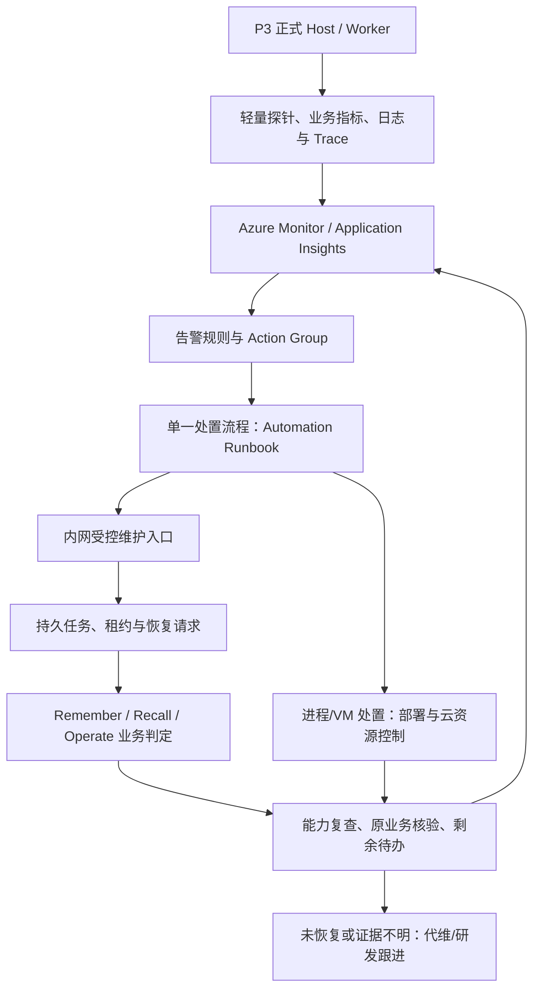

# P3 Azure 监测与恢复接入方案

日期：2026-09-21。状态：建议实施方案，基于指定 Excalidraw、当前部署文档与关键调用链的静态核对。未部署 Azure、未修改业务代码、未执行本轮运行测试。本文件不是生产验收报告。

统一规范配套：[运行、监测与恢复规范 V0.1](../开发协作/05_统一运行监测与恢复规范_V0.1.md)。应用字段与状态继续以现有 Python contracts 为唯一来源；本文候选路径和增量需求须完成契约收敛后实施。

## 1. 结论与范围

**现有架构能够承接 Azure 监测与自动恢复，但当前实现尚未形成云端闭环。** 持久任务、可靠事件、租约、原动作查询和领域恢复可以复用；需要补齐正式运行入口、轻量探针、云端遥测、告警处置、长故障恢复和恢复后的业务核验。

本期建议沿用 Azure Linux VM 容器化单实例。先接 Azure Monitor、Application Insights / Log Analytics、告警 Action Group 和 Azure Automation；按恢复目标配置 Azure Backup。跨区域灾备有明确需求时再采用 Site Recovery。AKS、多副本和事务存储迁移另设阶段。

微软维护托管监控和自动化平台；项目团队定义并实现应用语义；代维商执行约定的巡检、处置和演练。应用缺陷修复、P2 与自建存储组件维护是否包含在代维内，要在服务范围中明确。

## 2. 对照现有图与代码

| 图中位置 | 当前可复用基础 | 达到云端维护还缺什么 |
|---|---|---|
| P3.3a 可靠交接 | 业务事实、Task、Outbox 的本地事务；Inbox 去重与 ACK | 正式 Worker 持续运行与服务守护；真实 Provider 故障验证 |
| P3.3b 恢复 | 租约、尝试记录、有限执行和查询、领域恢复 Handler | 依赖等待、退避与唤醒；人工状态接续；维护请求对外接入 |
| P3.4a Trace | 自有 Span、任务/事件上下文与原请求关联 | OTel 运行接入、W3C 网络传播、云端导出；长周期关联按需补齐 |
| P3.4b 日志 | 独立 SQLite、脱敏摘要、保留与丢失计数 | 云端采集、磁盘预算、跨重启缺失信息与采集失联告警 |
| P3.5a 检测 | 本地依赖探针、Worker 心跳、积压和 Unknown 查询 | startup/live/ready 轻量接口；持续采样；新鲜度、能力映射和告警闭环 |
| P3.5b 故障时间线 | Remember 原投影检查与恢复分支 | 真实 Milvus 中断—恢复演练和实际业务复查 |
| P3.6 部署 | VM、容器、持久化、密钥与备份已有目标设计 | 可执行部署配置、身份与网络、自动化执行路径、备份还原验收 |

关键源码证据：

- [Health.report / runtime](../../AgentJYS-main/src/aether_agent_memory/runtime/flows/health.py)：执行详细探针，查询授权范围内的任务和动作；不触发恢复。
- [ThreeFlows.tick](../../AgentJYS-main/src/aether_agent_memory/runtime/flows/host.py)：更新心跳、投递事件、推进 Remember / Operate，处理到期 Recall；必须由持续运行的 Worker 调用。
- [Tasks.request_recovery / run_once](../../AgentJYS-main/src/aether_agent_memory/runtime/foundation/tasks.py)：已有权限、版本、有效租约、幂等维护操作记录及领域恢复调用。
- [Telemetry](../../AgentJYS-main/src/aether_agent_memory/runtime/foundation/telemetry.py)：当前为自有 SQLite 日志，不是 OTLP exporter。安装 OTel 依赖不代表已导出。
- [现有 HTTP health 路由](../../AgentJYS-main/src/aether_agent_memory/api/routers/health.py)：调用原 MemoryRuntime；不能当作新 ThreeFlows 的完整监测入口。
- [Recall.recover_expired](../../AgentJYS-main/src/aether_agent_memory/recall/basic/service.py)：当前到期处理不等于完整断点续跑。允许恢复失败并给出明确结果，不能承诺所有 Recall 自动续作成功。

## 3. 实际运行关系

Azure 不逐个驱动正常任务。日常任务推进、有限重试和原动作核查仍由应用 Worker 完成；Azure 负责外部观察、异常升级和必要的受控处置。

“发现—处置—验证”应编排在一个流程中。Action Group 的多个动作可以并发执行，不能依靠它们的配置顺序保证先重启、后验证。

## 4. 应用侧需要交付的能力

### 4.1 正式入口与轻量探针

以下路径是建议契约，尚未声明为现有可用接口；实现时与正式 HTTP 契约统一。

| 接口或信号 | 用途与响应原则 |
|---|---|
| `GET /health/startup` | 启动初始化是否完成；模型加载期与运行中故障分开 |
| `GET /health/live` | 进程能否及时响应；不访问 Milvus、不跑模型推理、不依赖业务数据库授权 |
| `GET /health/ready` | 根据入口必需能力及采样新鲜度决定是否接流量，返回对应 HTTP 状态 |
| `GET /ops/health` | 内网、授权后的能力和依赖详情；数据库故障时仍可返回受限诊断或由外部检测识别不可达 |
| 周期指标出口 | 报告 Worker 心跳、任务积压、能力状态、采集时间及丢失情况；可用 OTel 导出 |

将现有详细探针改为低频、有截止时间的采样任务，轻量接口读取有时效的结果。不要让每次存活检测都执行模型推理或数据库写探针。采样陈旧、采集失败和未知状态不能解释成健康。

现有健康数据按调用者权限过滤。生产指标需定义受限的运行身份及无正文的汇总视图，不能用某个普通用户的查询结果代表全系统健康，也不能为采集方便无限扩大用户数据访问权。

按业务能力表达影响：Milvus 故障可使长期检索降级，但不必让保存和 Working 同时退出服务；日志历史丢失应单独报告，明确其是否影响当前入口接流量，避免累计错误让服务长期无法恢复 ready。

### 4.2 遥测接入

首期推荐 Python 接 Azure Monitor OpenTelemetry Distro，并补充三流程的自定义埋点；Azure Monitor Agent 采集 VM 指标和约定日志。现有 SQLite 节点日志不会自动变成云端调用链，需要明确映射与导出方式。

保留现有节点和业务 ID 的含义，处理入口与异步任务的父子上下文，防止双重埋点重复计数。传入的 trace 信息仅用于关联，不能携带或替代授权。导出队列有界，监控失败不能触发已提交业务的重复执行。

优先提供下列指标；名称是建议，不是已部署监控项：

| 指标 | 为什么需要 |
|---|---|
| 接口错误率与响应时间 | 用户请求是否受到影响 |
| Worker 心跳年龄 + 最近完成任务时间 | 区分进程存活与业务仍在推进 |
| 待处理数量 + 最老任务年龄 | 区分正常排队与持续停滞 |
| 各类业务能力可用性 | 区分保存、Working、长期检索与调度影响 |
| Unknown 动作数 + 持续时间 | 发现需要查询原结果的未决副作用 |
| attention 任务数 | 依赖恢复后仍不能自动完成的事项 |
| 遥测上次成功时间、丢失计数、磁盘用量 | 防止监控失联被误判为业务正常 |
| 最近有效备份时间、最近还原演练结果 | 发现备份或恢复能力失效 |

指标标签只保留有界类别，如环境、服务、流程和错误类别。request_id、task_id、memory_id 等高基数字段放日志/Trace，不作为指标标签；正文和密钥不上传。云端查询权限和保留期需另行配置，本地诊断权限不会自动约束云端日志读者。

### 4.3 受控维护契约

建议提供 `POST /ops/recovery-requests` 与 `GET /ops/recovery-requests/{operation_id}`，通过现有任务机制受理和查询。维护请求包含目标 task_id、唯一 operation_id、expected_revision 和原因；采用的规则版本关联维护记录；调用者身份由认证生成。

已有 `request_recovery()` 可复用权限校验、版本检查、有效租约保护和操作去重，但目前只接受规定的未决状态。现有 `RecoveryRequest` 含 operation_id、task_id、expected_revision 和 reason；规则版本应写入维护记录或在正式契约扩展后加入，不能直接给严格模型增加字段。

现有 `OperationRecord` 状态为 accepted、running、completed、failed、unknown；`attention_required` 属 Task 状态。业务验证和需人工处理的情况必须有明确证据与关联，若扩展返回结构需先修改正式契约；受理或维护操作完成不自动证明业务已恢复。

Azure 维护身份须映射到项目允许的维护权限。随后 Worker 继续核验原发起人的当前业务权限、期限、对象版本和删除状态，不能借维护身份复活已失效工作。版本冲突应重新读取再评估，不能强制覆盖。

进程重启通过服务管理或部署控制实施；应用维护入口只发起受控恢复请求。禁止自动化脚本直接修改任务完成状态、删除租约或更新业务事实来“消除告警”。

### 4.4 长时间依赖故障后的恢复

当前默认执行预算为 3 次、查询预算为 6 次、固定等待 1 秒；实际还受任务期限与配置约束。故障期间可能很快进入人工状态，依赖恢复不保证自动续作。

需要补齐：

1. 区分依赖不可达、已知无效果、结果不明和永久业务失败；依赖不可达时保留等待依据，避免反复提交副作用。
2. 用带抖动和上限的退避安排核查；设置整体等待期限、执行/查询预算及告警升级，不能无限等待。
3. 依赖稳定恢复后，按配额唤醒仍有资格的等待任务；唤醒和周期扫描共用同一租约机制。
4. 为 attention 状态增加受控评估与处置流程。人工确认后也需重新检查权限、期限和原结果；保留旧操作证据，不能统一清零次数重跑。
5. 定义每类业务恢复验证：Remember 核验当前版本投影和正文；Recall 核验原请求结果与当前授权；Operate 核验原动作、实际位置和元数据交接。

## 5. Azure 与代维侧需要配置的内容

| 工作 | 实施要求 |
|---|---|
| 部署 | 正式 Host / Worker 命令、启动顺序、持久卷、退出窗口、服务守护和版本化配置；现有 Compose 不能直接等同新三流程生产清单 |
| 采集 | Application Insights / Log Analytics、VM 采集规则、应用 OTel 配置、保留期、费用预算和失联告警 |
| 告警 | 阈值、持续窗口、缺失数据规则、去重、冷却、维护窗口、恢复条件及负责人 |
| 执行 | Action Group 触发处置流程；网络、运行身份和目标权限显式配置 |
| 内网访问 | 需要访问本机或内网维护入口时采用支持的扩展式 Hybrid Runbook Worker，或另行实现受控内网执行路径；不假设云端 webhook 能直接访问私网 |
| 主机级故障 | 在 P3 VM 外部检测不可达，并通过 Azure 控制面或独立执行节点处置；同机 Hybrid Worker 随 VM 停机时无法自救 |
| 权限 | 托管身份/Key Vault 管理云资源与密钥；第三方可用 Lighthouse 委托资源范围；项目维护权限另行映射 |
| 备份 | 应用一致性备份 + Azure 备份策略 + 隔离还原验证；失败或过旧备份触发告警 |
| 值班 | 平台和依赖故障由代维处理；业务状态矛盾或代码缺陷升级应用负责人；明确工单及结案要求 |

具体服务、身份认证方式、价格与区域能力以最终选择的 Azure 公有云/中国区及区域验证为准，不预设全部能力跨云可用。

## 6. 首批处置规则样例

下列时间仅用于联调起始配置，需按模型加载、长任务耗时、负载和恢复目标校准，不是已经承诺的 SLA。

| 场景 | 触发与核查 | 允许的处置 | 结案证据 |
|---|---|---|---|
| Worker 疑似停滞 | 心跳超过 `max(60秒, 2×租约时长)`，并复查进程、任务推进和有效租约 | 先诊断；确属退出或卡死时受控重启，10 分钟内最多自动 1 次，失败升级 | Worker 稳定运行，原待办推进，无重复业务效果；无待办时执行隔离验证 |
| Milvus 中断 | 连续 3 次、间隔 30 秒探测失败，并结合实际请求错误 | 长期能力降级；保留任务并退避；依赖稳定后分批核查原投影 | 原投影核验、当前授权下准确读取，积压收敛；残留 attention 单列 |
| 动作 Unknown | 超过该类动作约定耗时仍未知 | 查询原 action_id；有限重查，证据矛盾转人工 | 原动作终态、实际位置、可读性及元数据交接一致 |
| 应用遥测失联 | 连续多个采集周期无新数据 | 外部核查 VM、采集器和应用；保留失联告警 | 新数据持续恢复，缺失范围可说明，业务状态另行核验 |
| 数据损坏/磁盘丢失 | 读写失败与存储证据确认 | 停止不安全写入，按约定恢复流程选择备份并隔离还原 | 一致性、当前权限、删除记录、未决任务与 P2 对账通过后恢复流量 |

自动重启只适用于已定义的进程故障；依赖故障不应触发所有服务反复重启。备份恢复会改变数据时间点，应走指定负责人控制的还原流程，不能仅凭一条高延迟告警自动回退数据。

## 7. 备份与恢复必须覆盖的业务状态

对 SQLite 使用一致性 Backup API 或协调停写快照，不能只复制活跃数据库主文件并遗漏 WAL。Azure Backup 保管支持的备份资源；P3、P2 对象/索引/关系之间的一致性仍需要应用协议和组件级方法。

备份清单包括：业务库、原始内容及映射、任务/事件/动作记录、授权与删除状态、Schema/配置/模型版本、P2 恢复或重建依据。日志作为诊断资料另定保留策略，不能用它替代恢复事实。

恢复旧快照可能遗漏后来发生的删除、撤权和外部动作，因此需要保留可独立追溯的删除/操作记录，或完成可信外部对账。在隔离环境恢复并核验这些条件之后再接流量。

明确允许丢失的数据时间窗口 RPO、目标恢复时长 RTO，并实际测量。虚拟机启动成功、备份可读取、探针变绿都不能单独证明整个 P3 已恢复。

## 8. 实施顺序与交付验收

| 阶段 | 负责人建议 | 交付与完成条件 |
|---|---|---|
| 1. 固定契约与目标 | RF + A/B/C + 部署方 | 监测字段、业务能力映射、维护动作清单、错误分类、恢复验证、RPO/RTO、云区域及代维范围确定 |
| 2. 接通运行与观察 | RF + 部署方 | 正式新 Host/Worker、轻量探针、OTel/日志采集上线；Azure 能看见请求、积压、心跳和失联 |
| 3. 跑通安全恢复 | RF + B/C，A 提供能力核验 | 维护入口复用任务机制；退避/唤醒/人工接续落地；Worker 中断和 Milvus 中断两个场景闭环 |
| 4. 备份与生产验收 | RF + P2/存储 + 代维 | 隔离还原、跨组件核对、权限/删除验证、恢复时长测量；形成正式验收和运维交接 |

首批故障演练至少覆盖：

- Worker 在提交前后被终止：原任务可追踪，旧执行者不能越权补交，无重复效果。
- Milvus 故障长于普通重试窗口：保留明确状态，恢复后安全推进或进入可处理的人工流程。
- 远端完成但回执丢失：查询原结果，不盲目重复迁移或投影。
- 恢复期间删除、更正或撤权：迟到结果不能重新生效。
- 同一告警重复送达、旧版本维护请求到达：去重或拒绝过时操作。
- 遥测/日志故障和业务库故障：外部能够发现失联，监控失败不导致重复业务。
- VM 停机：同机执行器不可用时，外部告警及主机级处置仍有路径。
- 旧备份还原：当前权限、删除屏障、未决动作及真实正文/索引状态通过验证。

正式验收报告记录结论、证据编号、重要失败和限制；原始运行记录保存在项目外工作区。本次静态检查不替代上述演练。

## 9. 在现有图中的落点

保留 Remember / Recall / Operate 三流程。P3.4 增加云端导出与采集失联；P3.5 增加“周期检测→Azure 告警→受控处置→业务复查→结案/人工”；P3.3b 补依赖等待、唤醒与人工接续；P3.6 补运行身份、内网执行和备份还原。

Azure 运维自动化放在 P3 公共运行基础之外，通过受控接口协作。Operate 继续承担记忆访问准备和分层调度，服务器重启、监控告警与备份不转交给 Operate。本文未改动原 Excalidraw。

## 10. 参考

- [原完整流程图](P3全景流程_Excalidraw/P3_整体架构与完整流程.excalidraw)
- [公共底座详解及故障时间线](P3全景流程_Excalidraw/P3_公共底座详解_故障时间线与代码对应表.md)
- [项目部署安全与演进](../../AgentJYS-main/docs/p3/architecture/05_部署安全与演进.md)
- [Azure Monitor 概览](https://learn.microsoft.com/en-us/azure/azure-monitor/overview)
- [Azure Monitor OpenTelemetry 接入](https://learn.microsoft.com/en-us/azure/azure-monitor/app/opentelemetry-enable)
- [Action Groups](https://learn.microsoft.com/en-us/azure/azure-monitor/alerts/action-groups)
- [Hybrid Runbook Worker](https://learn.microsoft.com/en-us/azure/automation/automation-hybrid-runbook-worker)：采用支持的扩展式 V2。
- [Azure Backup](https://learn.microsoft.com/en-us/azure/backup/backup-overview)
- [Azure Site Recovery](https://learn.microsoft.com/en-us/azure/site-recovery/site-recovery-overview)
- [Azure Lighthouse](https://learn.microsoft.com/en-us/azure/lighthouse/overview)

Azure 文档于本次会话核查；服务接入方式与区域适配仍需在部署环境验证。
