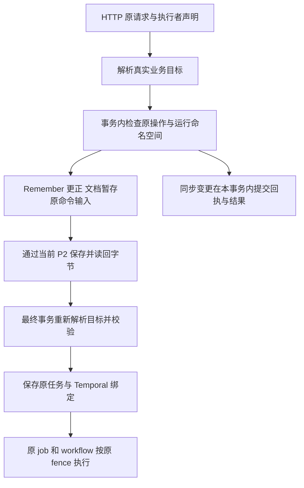

# P4 运行登记与重启恢复补充

本项落实全系统计划 T06/T07。依据 FG-28：P4 进程重启后丢失已完成运行，同 request UUID 会生成新 scope 并重复写入；原 P3/Temporal 任务仍存在。

## 职责与实现选择

P4 通过受认证的 P3 接口读写调用方运行登记，P3 使用既有 `UnitOfWork` / `Transaction.get` / `put_if_revision` 契约。最终由正式 P2 提供该事务能力；不新增数据库驱动，不修改 P2 引擎/proto，不建立 P4 本地权威文件或 SQLite。当前 development/test 的同一 P3 元数据参考库用于组件验证；正文和向量仍真实经过现有 P2。生产门禁保持拒绝缺失的正式 adapter。

不选独立本地日志，因为无法跨实例仲裁；不以已结束 Temporal 历史作为永久去重目录，因为历史保留期后不能证明原 UUID 从未执行。Temporal 保留持久业务编排职责，运行登记保存调用方意图与原 operation/job 的关联。

## 不变量与接口

- 新增 P3 `/p3/client-runs/{run_id}` 登记、读取、checkpoint 接口；身份来自同一可信依赖，不接受客户端 tenant/principal。以 principal、home scope 和 run UUID 定位；auth epoch 固定，变更后拒绝旧登记复用。
- 新运行先原子保存 scenario、初始 snapshot、固定 scope、所有者标识，再允许 P4 执行业务。相同 UUID/场景返回原登记；场景不同冲突。每个调用方同一时刻只有一项 active，未确认项不得解锁。
- 步骤 snapshot 在执行网络副作用之前保存，之后保存原 job/结果；更新按 owner 和 revision CAS，不能修改 UUID、scenario 或 scope。终态不可改写；响应丢失可以读取原 revision 核对，不以新 ID 重做业务。
- 操作登记分为 `prepared` 和 `observed`：前者不能带 HTTP/job 回执，后者必须带实际响应状态；已观测回执不可改写。新登记不能夹带已执行操作，新回执必须有先前已提交的意图。运行不可从 running 倒退 queued；仍有 prepared 操作时，禁止改为 passed/failed/blocked 释放占用，只能保留未确认状态。observed 只说明收到了 HTTP 响应，业务完成仍需核对原任务结果。
- snapshot 有大小上限，禁止凭据/header 进入状态。已有固定演示保留十轮上限，持久登记不因 P4 重启被清空；达到上限明确提示核对，不建议重启解除。
- 完成运行重启后必须可读取并复用同一结果。中断运行保留原阶段及回执；新的 P4 所有者不接管执行，不释放 active，不重发业务。无人更新超过期限时显示 unconfirmed；这是一项明确的恢复状态，不冒充自动续跑完成。

## 验收及未完成范围

当前阶段必须验证原子准入、同 UUID 冲突、所有者/CAS、身份隔离与撤权、终态保护、依赖失败不执行业务、P4 真实进程重启后完成结果复用；相同原 UUID 不得再产生记忆。通过同一 P3 元数据端口使用真实当前 P2 正文/向量，同时单独标明登记存储仍是 development/test 参考组件。

后续继续补全中断步骤的原操作回查、允许续跑的充分条件、旧所有者隔离、正式 P2 事务适配、迁移/备份与真实身份。完整上线目标不因本阶段通过而缩减。

## 已落地的局部验证（2026-10-03）

已把真实 P4 子进程重启探针转为仓库中的集成测试；同 UUID 查询和再次开始均返回 200，原 3 个 Memory、6 个操作/任务和步骤结果保持一致。首次合并回归 25 项通过；原 7 个计数失败来自将登记 POST/PUT 计入故事写入，现按业务写入核对完整请求列表，并保留重复开始前后的原步骤/操作相等断言。

额外复现 5 项未知作用/回执一致性缺陷后修正，登记与回执丢失专项 15 项通过。故障注入让实际 P3 完成登记、checkpoint 或 Remember 接纳后丢弃响应，新的 P4 实例使用原 UUID 不重发业务，新 UUID 仍被 active 占用拒绝。完整 unit 与配置门禁 1023 项通过。这些批次有范围交叉，不累计为唯一用例数。

旧版本没有登记的 UUID 无法凭 404 判断未执行，升级前需要盘点原浏览器记录、scope 和原 job。十轮持久保留上限尚无清退入口，中断自动接管/安全续跑尚未实现。正式 P2 的事务、原操作查询、跨实例隔离和灾备仍是后续接入验收要求，当前参考组件验证不替代这些要求。

最终合并回归 34 项通过，223.81 秒，包含既有参考备份恢复后的原登记/意图/active 占用核对；完整 Ruff、417 源文件 Mypy 通过。详细范围、原失败与限制见[全量工程门禁报告 FG-29—33](../测试与验收/P3_全量工程门禁与上线差距_20261002.md)。本次未提交、合并或发布到 Azure。

## 原 operation ID 回查原任务（2026-10-03 补充）

恢复步骤先补只读查询能力。新增 `GET /p3/operation-requests/{operation_id}?kind=...`，支持 Remember 保存、Recall、正文更正和文档上传四类已有 HTTP→Temporal 入口。它使用原准入算法定位持久 task，不扫描任务目录，不创建第二份权威索引或输入；核对原 principal/home scope/auth_epoch、operation/kind、持久输入描述 hash、部署/namespace/workflow 绑定，并按当前权限授权。

返回 `found` 仅证明原 job 及绑定可读取，包含实际 task_state；失败或 attention_required 的原任务也返回其真实状态。后续通过原 operation/result 接口执行当前权限和结果有效性检查。查不到已准入 task 返回 `unconfirmed`，不能据此判断输入没有上传、远端没有副作用或允许重发。此查询不要求再提交原 POST，不释放 P4 active 占用，不将 prepared 操作伪造成收到原 HTTP 回执。

P4 客户端已消费该接口并校验响应 operation/kind。实际 Remember 接纳后丢回执测试已验证：P4 仅凭原 operation ID 找回原 job，保持原运行未确认并拒绝另一轮。新增查询不等于接管/续跑已实现；其他业务操作类型、原请求完整绑定、原所有者隔离和人工/自动续跑条件仍按后续步骤完成。

首批 6 项测试包含 5 项缺端点失败和 1 项 Working 查询缺少 task/session 的测试输入失败；后者按现有查询契约修正，并保留一个明确失败的原任务回查用例。随后回查/P4 消费 14 项通过；准入、Temporal HTTP、丢回执和 P4 合并 27 项通过（151.46 秒）。真实当前 P2 的正文/向量调用与参考元数据边界保持不变。

最终完整 unit、P2 配置门禁及四类回查/异常场景合并 1033 项通过（87.68 秒）；完整 Ruff 与 Mypy 419 源文件通过。此批不是全量 integration 目录重跑，具体范围及原失败见门禁报告 FG-34—38。

## 同步变更与多任务准入的回执设计

继续补齐十类 Remember/Source 写入口：整合、提炼、重新处理、重建索引、生命周期、保留策略、反思策略、记忆删除、来源删除和来源撤回。在既有业务事务中通过 `Transaction.get` / `put_if_revision` 保存不可变回执，提交失败则回执与业务一同回滚。回执绑定 principal、home scope、auth epoch、原 operation ID、操作类型、具体目标及规范化请求摘要；同类操作复用 ID 而改变目标或意图时明确冲突。内部周期任务的事务方法保留原语义，不把它们伪装成收到 HTTP 请求。

已实现只读查询 `GET /p3/mutation-receipts/{operation_id}?kind=...`。查询只返回提交证据、目标引用、结果摘要、原任务列表和时间，不返回历史正文或完整历史响应。`committed` 仅证明同步事务/任务准入已提交，异步清理、提炼、投影是否完成仍查询原任务。缺少回执返回 `unconfirmed`；旧 `remember_operations` 缺少完整身份绑定，不自动补造新回执。查询不重发命令，不接管运行，不释放 active 槽位。

POST 重复提交在当前权限和参数边界有效时返回原响应，避免按改变后的记忆版本、待处理集合或模型配置重选任务。新回执仅消费 P3 既有事务契约；现有 P2 的正文/向量联调、参考元数据和正式 P2 适配缺口继续分开验收。

生命周期回执不保存正文，也不再为新操作向旧操作表保存完整快照；重放按原版本引用通过 P2 读取并验证正文。`result_basis=metadata_without_content` 表示结果 hash 对应去掉 content 后的元数据，保留原 content_hash；其他九类为规范化完整响应 JSON。任务 ID 只描述本次立即准入的任务，不把后续周期策略产生的任务当成同步完成。

实测已覆盖十类入口的重复提交和 Service 重建、原身份隔离/撤权、真实响应丢失后的 P4 只读查询、空整合不接纳后来输入、更正后重新处理保留原任务、归档后提炼保留原任务、回执写失败与业务同事务回滚、旧记录不补造来源、正文不重复存储。专项 25 项通过；合并 Remember/Recall、Temporal HTTP、P4 故事和恢复回归 421 项通过、5 项外部依赖跳过，685.23 秒。随后补回原提炼输入上限，相关 10 项通过；原失败保留。

这里的重启验证是同一测试进程内重建 P3 Service；丢响应是桥接层在收到真实 P3 响应后注入异常。它们不替代进程宕机、正式 P2 数据库故障、多实例隔离或生产灾备。P4 日志核对与安全续跑、运维配置/备份/恢复原回执、旧记录迁移、十轮容量管理继续待验收。

最终完整 unit、P2 配置、当前 P2 回执/恢复与策略 HTTP 共 1053 项通过，102.80 秒，无失败/报错/跳过。Ruff、421 源文件 Mypy 和差异检查通过；详细证据 FG-39—43。未提交、合并、构建或部署新镜像，也未创建代码导学会话。

## P4 发送请求的具体绑定

原日志只有接口模板和正文 SHA256。例如两次对不同 Memory 执行 reprocess，或者给不同文档版本上传相同正文，模板和正文摘要可能完全相同，不能据此核对恢复对象。现新增版本为 1 的 HTTP 绑定：实际编码路径和查询串、Content-Type，以及包含方法、模板、原 operation ID、正文摘要和上述字段的规范化摘要。绑定在 HTTP request 构造后、网络发送前与 prepared 意图一起持久化；原 request_hash 继续表示实际请求字节的 SHA256。

绑定不保存正文、Authorization、Cookie 或完整请求头。目标必须是匹配接口模板的相对请求目标；固定接口目前只允许 version/start/end 查询参数，拒绝凭据参数、绝对 URL 和 fragment。网关路径前缀与查询串原始编码也纳入摘要。P3 和 P4 共用同一意图比较规则，取得响应时仍保持原绑定不变。

P3 拒绝新登记的无绑定操作，以及原绑定的替换、删除或篡改。旧记录仍按原状态读取；无绑定的旧中断记录只能保留原信息或转为未确认，不能补造具体目标、升级为收到回执或释放运行占用。旧记录迁移仍须依赖原业务证据，不根据接口模板猜测目标。

本轮运维审查确认现有 backup/restore 是参考 SQLite 快照，不能代表正式 P2 灾备。因此先完成独立于底层数据库的请求绑定，不扩展旧快照实现来替代正式方案。配置激活和备份/恢复的原结果查询继续保留在 T07；正式灾备能力仍通过 P2 契约消费。

发送侧绑定本身不能证明 P3 已接纳或业务成功；与独立服务端 HTTP 证据的核对结果见下文。续跑还需要原输入恢复、原结果核对、所有权转移和旧执行者隔离。当前仍不开放自动接管或重发。

兼容性修正：校验新进度之前，先在当前身份和原所有者校验通过后识别完全相同的已提交 snapshot，直接返回原记录，不增加 revision、不写入绑定、不修改 active 占用。已复现旧 passed/failed/blocked 记录原样重试返回 409 的问题；修正后五种旧运行状态及相关请求绑定/登记专项 30 项通过。变化后的请求仍须通过完整进度、回执和版本校验，不能借此补造旧证据或释放未知占用。

服务端核对还有明确的数据差异：P4 的 request_hash 是实际 HTTP 字节摘要；Remember 的 task.input_hash 是持久输入描述摘要；Recall 还包含原截止时间与模型/策略绑定；文档命令引用另存的正文对象；同步变更的 intent_hash 绑定规范化目标与请求。这些摘要不能直接相互比较。后续必须核对各自的原始输入、目标和准入证据，不能从当前故事定义重新生成请求冒充历史输入。

本批完整单元及相关集成 1070 项通过，旧记录兼容修正后的最终 P4/Temporal/当前 P2/实际 P4 进程重启回归 362 项通过，253.98 秒；Ruff、421 源文件 Mypy 和差异检查通过。证据 FG-44—48 保留原失败、各批范围和一条测试框架弃用警告，不合计重复用例。未修改 P2 引擎/proto，未提交或部署新版本，未创建导学会话。

## 服务端请求证据与只读核对（局部验证完成）

本步骤在既有 T06/T07 范围内补齐两端关联，不增加 P2 数据库驱动或改变原任务输入摘要。P3 在受认证 HTTP 入口独立计算实际请求字节 SHA256，记录 HTTP 方法、接口模板、解析后的业务路径/有效查询参数和 Content-Type。凭据、完整请求头和请求正文不进入这份证据。

四类 HTTP→Temporal 命令将证据附在原任务行中，随首次准入同事务提交；十类同步变更将证据附在原变更回执中，随业务同事务提交。原 task/input/workflow/result hash 语义保持不变，内部调用不冒充 HTTP 请求。重复请求返回原证据；旧已存在任务/回执没有此字段时保持缺失，不用本次请求补造历史来源。

现有原操作查询返回可选的服务端请求证据。P4 用持久 prepared 意图与它只读比对：方法、模板、正文摘要、内容类型和有效业务目标须一致。网关前缀属于调用路径，核对时与路由匹配后的业务路径分开；文档 version 等有效参数按路由实际解析值核对。找不到证据保留 unconfirmed，有明确差异报告 mismatch，matched 仅表示原请求与已存在准入/回执相符。原任务失败也可以 matched，不能变成业务成功。

核对不改写 prepared 为 observed，不写 checkpoint、不释放 active、不重新发送命令。验收覆盖四类准入、十类变更、事务写失败回滚、原响应丢失、相同语义不同 JSON 字节的历史证据保留、旧行不补造、目标/正文/内容类型差异、网关前缀、当前身份校验及无写入的消费过程。下面记录本地实测范围；原输入恢复和旧执行者隔离仍是下一步。

实施结果：四类原任务查询和十类变更回执已返回可选 `http_request`；P4 `confirm_operation` 已接入只读核对。专项 62 项通过，包含实际响应丢失后的原持久 P4 意图核对、文档版本差异、删除/重新处理、事务回滚和旧记录不补造。追加复现了任务幂等键命中原任务、但分配 ID 不同时覆盖原 HTTP 证据的问题；修正为仅实际首次创建原任务时保存，单项复验通过。原 workflow/input/result 摘要不重写；P3/P4 使用扩展后的同一响应契约。

验证中发现并独立复现了另一项启动缺陷：存在 accepted/running Recall 时，正常重启被误当成切换 Recall 实现而拒绝。现在启动装配检查原 task ID/kind、持久输入完整摘要和既有 Recall 策略/模型绑定；相符时装配同一 GenerationRecall，原任务继续执行，缺失任务或输入/配置改变仍拒绝。已验证原任务完成且 ID、input hash、workflow ID 保持一致；这是本机 Service 重建与真实测试 Temporal 的证据，不是多实例/主机灾备验收。

全仓 Python 回归已经结束：2142 项中 2134 通过、1 失败、7 跳过，1398.12 秒。唯一失败是 Docker 在基础镜像元数据阶段访问 `auth.docker.io` 超时，容器内业务尚未验证。跳过项为 1 个未启用重启开关的专用 P2 容器场景、5 个未启用 Milvus Lite 的场景和 1 个缺少 Milvus Lite 依赖的场景；不计入通过。

收尾审查另复现两种缺少文档 `version` 的调用方意图使核对抛出 ValueError：红测试 2 失败/2 通过。修正后 4 项通过；存在有效原服务端证据时返回 mismatch，缺少证据仍为 unconfirmed，原任务失败状态、原意图和原版本均不改写。最终 P4 validation 全目录及 HTTP 准入、变更回执、Recall 重启、丢响应集成共 234 项通过，39.76 秒；这批在最终修正后执行，全仓 2142 项是该修正前的证据。完整 Ruff、424 源文件 Mypy 和差异检查通过；详见门禁报告 FG-49—54，分批结果不累加。

续跑输入审查还确认：页面一个步骤可以包含多次业务调用；P4 运行期间的 refs/sources/receipts/episodes/recalls 在内存中，源事件时间会由当前时钟重新生成。后续必须保存版本化执行定义、原始输入和逐次调用的原结果，不能从当前故事常量或页面步骤号重放。原输入恢复、所有权转移、旧执行者/API 准入隔离、迁移、容量和正式 P2 验收继续待完成。

## 已构造请求的原始字节保存（局部验证完成）

新增 `PUT/GET /p3/client-runs/{run_id}/inputs/{operation_id}`。P4 构造请求后先持久化 prepared 意图，再保存完全相同的 HTTP 字节，核对 run/operation/request_hash/binding_digest/size 后才发业务请求；保存失败或丢回执不发送业务，不改写原 operation，不释放未知运行的 active 占用。

P3 复用既有事务和 P2 对象契约，使用独立 `client_request_input` 元数据引用和 `runtime/client-inputs/…` 对象键，与 Temporal 的 `command_input` 分开。首先检查当前身份、原 owner/revision/active、prepared 与字节摘要，原子记录 pending；事务外经 P2 保存并读回字节；再次核对身份和执行者后确认 ready。ready 重试也验证 P2 原对象和当前 owner，不能重建丢失或损坏的 ready 对象。GET 只返回已确认且摘要一致的原字节，重新检查当前身份和原绑定，不据此证明业务尚未执行。

原始 JSON、二进制和空正文按原字节保留；回执及浏览器 snapshot 不增加正文或凭据头。无绑定的历史行、已 observed 但未保存原输入的旧操作不能补造数据；超限输入和缺失 P2 提供方在写入前拒绝。同一原输入并发保存取得同一回执，原登记不变。本地范围验证为 1136 项合并通过，补充输入边界与丢回执 30 项通过；静态检查和 427 源文件 Mypy 通过，证据 FG-55—60。

此处保存的是已经构造、可能尚未发送的请求。尚未构造的后续输入、运行定义版本、执行代码兼容性、原结果和引用映射仍需持久化；所有权转移与 P3 准入隔离仍未实现。元数据和缓存仍是开发/测试参考能力，普通 P2 Put/Get 不提供分布式 CAS。当前不开放自动接管或中断续跑，完整 T06/T07 和上线验收继续执行。

## 版本化运行定义与固定后续输入（局部验证完成）

新 P4 在首次登记前捕获版本 1 定义；登记记录增加可选的格式、SHA256 和大小绑定。旧记录缺少绑定时保持缺失。`PUT/GET /p3/client-runs/{run_id}/definition` 通过独立 `client_run_definition` 元数据与 `runtime/client-definitions/…` P2 对象保存原定义，复用当前身份、owner/revision/active 和 pending→ready 规则。带定义的运行必须 ready 才能进入 running 或登记业务操作；同 UUID 再登记只返回原记录，不替换定义。

定义包含固定步骤文本、上传原文、额外保存与查询文本、策略参数和每步原事件时间。固定演示事件用捕获时的 UTC 基点加步骤毫秒序号，不在恢复时重取时钟。P4 从 P3/P2 读回原字节，核对运行、场景、摘要、必需参数和数值范围，再验证执行源码与请求契约及序列化库摘要。缺少后续必需参数会在任何业务请求之前失败；参数显示从实际定义取值，72 小时策略不会显示为旧的 168 小时。

源码摘要绑定固定控制流程和模型默认值，数据字段绑定可直接保存的固定输入。源码或依赖版本改变须使用匹配版本或显式迁移，不动态执行存储中的代码；该摘要不等于签名镜像或运行时完整性证明。动态 ID、对象版本、原任务结果和引用映射不预先猜测，继续通过原结果与逐副作用恢复方案闭环。

本批主回归 1159 项通过；审查修正后的最终 P4/真实依赖/进程恢复 381 项通过，静态和 431 源文件类型检查通过，证据 FG-61—65。当前 P2 对象为真实调用，元数据和缓存仍属开发/测试参考能力。登记后、定义保存完成前中断的记录仍无法仅靠摘要恢复正文；保存完成后丢回执则能读回原定义。所有权变更和响应丢失测试使用注入，不表示已有接管 API。安全续跑、旧执行者/P3 准入隔离、容量、迁移、正式 P2 和完整上线验收仍未完成。

## 已登记操作的执行者准入（局部验证完成）

新 prepared 操作与 `client_operation` 索引随 checkpoint 原子提交。索引以当前身份、home scope 和原 operation ID 定位原 run UUID 与请求绑定摘要；后续运行不能重新使用该操作 ID。旧 checkpoint 不补造索引，缺少索引的历史执行仍需明确迁移和核对。

P4 的发送顺序增加执行者声明：prepared checkpoint → P2 原字节保存及回执验证 → 读取此时的本地登记修订号 → 携带 run/owner/revision 发送 → observed checkpoint。声明通过三个专用 HTTP 请求头传递，不包含鉴权凭据。P3 在收到 HTTP 后独立取得实际字节证据，并在业务事务内核对权威索引、当前身份、owner/revision、active/running、prepared 以及原字节 ready、方法、路由、目标和 Content-Type。省略请求头仍能通过原操作索引被识别并拒绝。

Remember、更正和文档写入不可变命令输入前先做一次检查，避免拒绝后的错误输入占用原操作 ID。P2 IO 后、最终任务准入事务中再次检查；前置检查不提供跨 IO 的执行权保证。Recall 的接纳记录和任务在同一事务内校验，十类同步业务变更通过 `MutationReceipts.begin` 在变更事务内校验。首次准入的 `http_request.client_run` 保留通过校验的声明；已接纳原任务继续按原 Temporal job/workflow 和 Activity fence 执行，不随调用方登记变化被撤销。

这里的保证依赖原有事务原子性和隔离，当前通过参考元数据组件验证。P2 对象服务保存真实原字节，不由普通 Put/Get 推导分布式 CAS。正式 P2 的事务/缓存能力、PG/Redis/Milvus/Ceph 全链路仍需独立验收。

本项覆盖已登记操作的执行者隔离。未登记的新 operation ID、作用域集合操作、文档命名空间和跨范围写入，还需权威业务范围识别；不能仅靠请求头或操作 ID 前缀完成全部隔离，也不能未经设计就限制整个用户的业务 API。当前继续禁止自动接管；原结果和动态引用映射、执行权转移、容量清退和旧记录迁移仍为必做项。P3/P4 须以配套契约版本升级；声明与源码摘要都不替代正式服务身份或镜像签名。

本项最终合并回归 1233 项通过，509.24 秒；补充受控暂停测试明确在原 Temporal 任务 running 时注入 owner 变化，原 job/workflow/run ID 和输入摘要保持一致，放行后成功。Ruff、433 源文件 Mypy 和两个工作区 P2 职责边界检查通过。门禁报告 FG-66—70 保留初始缺口、修正与证据范围。该结果不证明尚未登记操作、升级前无索引历史记录或正式 P2 分布式事务已经完成隔离。

## 运行作用域与文档命名空间隔离

新 P4 登记声明不可变的 `scope_policy=p4_task_v1`，P3 将 `runtime/client_run_namespace` 引用与原 run、active 槽位在同一事务内保存。名称为 `p4r_<32位摘要>`，同根身份下 task 必须等于该名称，session 可以为空或为该名称加 `_session`。文档 ID 可以是准确名称或其下划线后缀。语法保留而尚未登记的名称也拒绝普通写入，避免提前抢占。

更正入口从 P3 当前元数据指针取得并核对逻辑 MemoryRef，完成授权后返回真实 scope，不为本次范围判断读取远端正文。命令输入暂存前检查，P2 IO 后最终任务准入再次解析当前目标。Recall 与十类同步变更在各自业务事务中检查目标。已接纳任务的 Activity 不引入调用方运行 owner 的新依赖。

省略声明、更换未登记 operation ID、只留下保留 session、伪造其他 session、将托管操作指向普通或另一运行 scope 都不能取得保护范围的写入权。普通授权 GET、其他范围写入和未限定 task/session 的 Recall 保持现有规则；合并和反思策略原本按完整 scope 精确匹配，本次没有扩成用户级锁。

保护在终态后继续保留，P4 不能降级接受旧策略登记或 checkpoint。旧记录可 GET 核对，旧数据不会自动回填保护；正式清退、迁移、所有权转移和动态结果恢复仍未完成。专项 33 项通过，包括登记回滚、重启、P2 IO 后关联变化与十类变更；最终合并回归结果见门禁报告的后续记录。这里仍是当前 P2 对象调用、开发测试元数据/缓存组件和测试 Temporal 的证据，不能外推到正式分布式事务。

最终合并回归 1263 项通过，652.44 秒；Ruff、434 源文件 Mypy、源文件摘要与职责边界核对通过，证据 FG-71—75。未修改 P2 引擎或共享 proto，没有提交/部署，整体上线目标继续进行。
