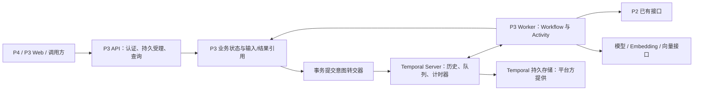

# P3 Temporal 全面接入迁移设计

日期：2026-09-30

状态：用户于 2026-09-30 确认设计，已实施本地 Temporal 接入；验证结果和未验收项以 [工程验收报告](../测试与验收/P3_Temporal接入工程验收_20260930.md) 为准。Azure、生产容器、真实外部服务仍须另行验收。

## 1. 目标与范围

将统一 P3 服务中需要持久执行的业务流程、后台任务、事件消费、定期任务及 P3 自身维护流程交给 Temporal 编排。P3 进程中断后，重新启动的 Worker 根据持久化历史继续执行，已提交的业务结果能够被核对并复用。

用户已经确定：全面使用 Temporal；覆盖整个 P3，而非仅 Recall；先完成本地接入和验证，再部署 Azure AKS；部署后的业务数据及 Temporal 历史留在 Azure。数据库维护、数据库恢复、SQLite/Ceph 存储改造以及 P2 故障修复不属于本次任务。

本设计采用的首版运行约束：一个 P3 应用实例内承载 API 和 Temporal Worker，使用一份持久化业务目录，连接独立 Temporal Server。Worker 使用逻辑任务队列区分执行类型。此约束避免在当前业务状态仍为本地 SQLite 和文件时引入跨 Pod 共享写入。

“全面接入”的验收含义：生产运行路径中，所有已受理的持久任务均有 Temporal 执行归属；RF 不再作为另一套在线任务调度器。普通查询、身份配置加载、健康探针等不必成为 Workflow。Temporal 不负责启动已经退出的操作系统进程，进程重启仍由本地服务管理或未来 Kubernetes 完成。

## 2. 实施前代码核查（保留迁移依据）

设计时依据原工作区进行静态核查，包括尚未提交的 Working 向量召回和 RF 业务修复改动；没有用 Git HEAD 覆盖工作区。下表描述实施前状态；当前启动和迁移方式见 [运行指南](../部署运行/P3_Temporal本地运行与迁移指南_20260930.md)。

| 当前实现 | 迁移影响 | 源码入口 |
|---|---|---|
| 一个 `Service` 装配 Remember、Recall、Operate、Foundation | 在组合入口接入 Temporal，保持同一业务实现 | [application.py](../../AgentJYS-main/src/aether_agent_memory/runtime/flows/application.py) |
| Supervisor 有五条本地执行循环及协调、维护循环 | 替换在线调度循环，保留进程生命周期管理 | [supervisor.py](../../AgentJYS-main/src/aether_agent_memory/runtime/flows/supervisor.py) |
| `Tasks` 自行实现 claim、租约、重试、sweep 和恢复 | 拆开业务接纳/完成证据与调度职责 | [tasks.py](../../AgentJYS-main/src/aether_agent_memory/runtime/foundation/tasks.py) |
| 任务受理、输入哈希、幂等键、业务完成与事务绑定 | 不能直接把 `enqueue(tx, ...)` 改成事务内网络 RPC | [tasks.py](../../AgentJYS-main/src/aether_agent_memory/runtime/foundation/tasks.py) |
| Remember 已持久化压缩、提取、向量等分块结果及策略快照 | 复用有效检查点，分拆 Activity 时保留原有守卫 | [pipeline.py](../../AgentJYS-main/src/aether_agent_memory/remember/basic/pipeline.py) |
| Remember 首次保存、文档上传和更正仍含前台外部 I/O | 这些接纳后的步骤也必须纳入持久执行范围 | [documents.py](../../AgentJYS-main/src/aether_agent_memory/remember/documents.py)、[pipeline.py](../../AgentJYS-main/src/aether_agent_memory/remember/basic/pipeline.py) |
| Recall 在 HTTP 协程中执行，`recover_expired()` 将过期未完成请求转为失败 | 拆开受理、执行和结果读取，加入 Recall Workflow | [service.py](../../AgentJYS-main/src/aether_agent_memory/recall/basic/service.py)、[generation.py](../../AgentJYS-main/src/aether_agent_memory/recall/basic/generation.py) |
| 自研 Outbox/Inbox 和事件投递租约、重试 | 保留业务事务边界，替换事件投递调度 | [events.py](../../AgentJYS-main/src/aether_agent_memory/runtime/foundation/events.py) |
| Operate 已有原始 action ID 与未知结果查询 | Activity 超时后仍须先查询原操作，不能换 ID 重做 | [service.py](../../AgentJYS-main/src/aether_agent_memory/operate/basic/service.py) |
| 自动缓存修复有采样、处置、独立验证 | 用 Workflow 串联，保留业务验证 | [maintenance.py](../../AgentJYS-main/src/aether_agent_memory/operate/basic/maintenance.py)、[disposition.py](../../AgentJYS-main/src/aether_agent_memory/runtime/foundation/disposition.py) |
| 数据目录含 `p3.db`、缓存、正文，任务分工另有人负责存储改造 | 本次只定义存储接口需求，不代替其迁移 | [任务分工](../开发协作/15_会后五项整改任务分配与验收_20260930.md) |

实施前 `pyproject.toml`、统一入口和 `compose.p3.yaml` 尚无 Temporal 接入；现在已加入 SDK 1.33.0、统一 Worker 装配和可选本地开发 Server。源码中其他含 `temporal_score` 的字段与 Temporal 工作流引擎无关。

## 3. 接入方案选择

| 方案 | 优点 | 代价/结论 |
|---|---|---|
| Temporal 编排全部持久任务，首版 P3 单实例、业务状态接口保持现有实现 | 覆盖用户要求；不抢占存储同事的职责；能够先做真实宕机验证 | 推荐。首版不能宣称支持多 Pod 业务执行 |
| 用一个 Activity 调用原 `Tasks.run_once()`，RF 继续扫描、认领和重试 | 改动较少 | 不采用；形成两层调度，不能算全面接入 |
| 同时改造全部业务存储并拆分多个 API/Worker Pod | 可以面向水平扩展设计 | 不纳入本次；需要另一项存储工作和接口验收，不能用网络盘共享 SQLite 替代 |

API、转交器、Worker 在首版属于同一个 P3 应用实例；图中拆开表示职责，不表示已经允许独立多副本部署。Temporal Server 不执行 P3 业务 Python 代码。

## 4. Workflow 覆盖清单

| 业务范围 | Workflow/Activity 边界 | 必须保留的结果和约束 |
|---|---|---|
| Remember 文本保存、文档接纳、正文持久化 | 受理后由输入 Workflow 驱动正文写入/确认、记忆提交、后续任务产生 | 原 operation ID、来源哈希、文档版本；已有 `saved=true` 只能在实际保存成功后返回 |
| Remember 更正、删除、撤销、生命周期变更 | 单事务元数据变更仍在业务事务完成；涉及外部 I/O 的更正纳入 Workflow；清理/重新投影任务由同事务产生 | 撤销/删除必须立即使后续读取校验失效，不能等后台清理结束才生效 |
| `remember.extract` | 输入/来源校验、分块提取、比较与业务提交 | 原始证据、分块结果、模型调用预算、策略版本 |
| `remember.project` | 投影准备、分块 Embedding、索引发布、就绪确认 | Working 与长期记忆、向量 ID/空间、源版本；未完成不得标为 ready |
| `remember.compress` | 分块压缩、质量检查、发布 | 压缩结果及校验报告、原文可追溯性 |
| `remember.summarize` | 总结生成、证据核验、Working 更新、后继提取/投影 | 总结不能替代未保存的原文；后继任务只接纳一次 |
| `remember.distill` | 复用已绑定的回顾输入及提取阶段 | 不吞并不同版本的情景和证据 |
| `remember.revalidate`、`remember.cleanup` | 资格复核、撤销/失效清理、完成核对 | 源撤销、删除和版本变化时使旧执行失效 |
| Recall：Working、长期、双来源 | 接纳、候选检索、资格检查、正文/组包、最终提交 | 不改变 Working 向量召回语义；最终结果每次读取都走授权与版本复核 |
| `operate.evaluate` | 评估、准备 action、提交、查询原 action、业务完成 | 外部结果 unknown 时只查询原 ID 或转人工，不盲重试 |
| `operate_repair_cache` 等明确登记的 P3 维护操作 | 检测、生成处置、执行、独立验证、结案/转人工 | Workflow 完成不等同于修复成功，必须有验证证据 |
| 事件投递 | 每个 event/consumer 对应稳定投递 Workflow，Activity 调用业务消费者 | 保留 Inbox 与消费者业务写入的原子性；丢 ACK 不重复业务效果 |
| 定时合批、保留期、反思/巩固、Operate 衰减/审计、维护采样 | 每部署域唯一的周期 Workflow，用持久计时器生成确定的 tick ID | 业务周期函数由 Activity 调用；重放/重启不重复产生同一周期任务 |

新增任务种类必须注册其 Workflow 路由、输入模式、权限、副作用与恢复策略。未注册任务不得静默落回 RF。

读列表、读配置、读已提交结果和健康探针不产生持久 Workflow；由它们引起的业务写入或后续任务仍须遵守幂等与事务规则。文件上传中尚未完整接收并持久保存的字节无法靠 Temporal 恢复，调用方需重传；不得把未持久接纳的上传宣称为可恢复任务。

## 5. 职责迁移与保留

| 能力 | 迁移后责任方 |
|---|---|
| 工作流历史、执行推进、持久等待、Activity 投递、失败重试机制 | Temporal |
| 周期调度、恢复流程分支、取消请求传递 | Temporal Workflow |
| HTTP 服务和 Worker 进程重新启动 | 本地运行管理；后续 Kubernetes |
| 任务接纳、输入哈希、幂等键、租户/主体授权、版本资格 | P3 业务代码 |
| 外部操作结果判断、原 action ID、完成证据、分块内容与哈希 | P3 业务代码 |
| 业务提交到 Workflow 启动的可靠转交 | P3 事务 Outbox + Temporal 幂等启动 |
| 消费事件与更新业务数据的原子提交 | P3 Inbox + 业务事务 |
| Temporal 数据库供应、可用性与备份 | 平台/数据库负责人 |
| P2 宕机修复、数据库恢复、Ceph 改造 | 不属于本次实现 |

迁移终态移除生产路径中的 `Tasks._claim/sweep/run_once/invoke` 调度、租约续期循环、自研重试定时器、`Events.dispatch_once` 扫描执行、`Recall.recover_expired()` 在线扫描以及旧 Supervisor 业务调度循环。先拆出业务接纳、guard、complete 和证据核验，完成迁移后再删除经引用检查证明确实失去用途的代码。

阶段进度、完成凭据、版本隔离不是 Temporal History 的替代品，保留为业务投影。Celery 属于另一套旧 B1/B2/B3 入口，不因为本次统一 P3 接入就直接全库删除；只有确认没有剩余入口/测试/用户后才能单独清理。

## 6. 事务与可靠受理

### 6.1 受理与启动

1. API 验证调用者、请求大小、原始幂等键及输入合法性。必须先有可持续读取的输入，才能声称“已受理”。
2. 同一业务事务写入任务/请求记录、不可变输入引用、签名和 Workflow 启动意图。禁止在持有 SQLite 事务时调用 Temporal RPC。
3. 提交后立即尝试转交；后台转交器仅扫描尚未确认的启动/控制意图，不认领或执行业务任务。
4. Workflow ID 由部署域 ID、业务任务/操作 ID、工作流种类确定，签名在业务存储核验。外部重试不得换 ID 绕过幂等检查。
5. 已启动但 ACK 丢失时，再次启动返回同一执行归属；配置重复启动为拒绝复用，核对 namespace、Workflow ID、绑定签名和原 Run ID，不能终止旧 Workflow 来“修复”重复请求。
6. Temporal 暂时不可用时，已提交意图保留 pending 并有积压指标；未提交的请求不能返回成功。业务接纳限额仍生效，不能无限缓冲。
7. Workflow 历史超过保留期后，P3 的终态幂等凭据仍阻止同一业务 ID 被当作新业务重复执行。

转交器的连接退避仅负责恢复通信。这一小段事务桥不能扩张为新的 RF 业务任务调度器。进程启动必须恢复 pending 意图，不能只靠内存回调。

### 6.2 Activity 和业务提交

- Workflow 只执行确定性编排，不直接读文件、数据库、模型、网络或宿主机时钟。
- Activity 输入以任务 ID、输入引用、内容哈希、策略版本为主；大段正文、文档字节、向量和密钥不放入 Workflow History。
- 每次业务写入都校验执行归属、原输入和权限；Activity 重复投递时先检查已经提交的结果。
- 业务结果与完成凭据同事务提交。Activity 返回只携带已提交结果引用；若提交后响应丢失，下一次读取该凭据并复核后复用。
- 仍需持久的尝试代次/提交 fencing。旧 Worker 在超时后可能继续运行，Temporal 不保证替应用停止该进程；新代次使旧尝试不能提交本地业务变更。
- 外部系统不受本地 fencing 自动保护。外部写入须有稳定幂等键、条件版本或原操作查询；不存在这些能力时把未知结果转为待确认，不能承诺 exactly-once。
- 现有 `TaskRecord.lease` 的约束不能直接删除：更新为明确的执行绑定模型，并提供历史记录读取兼容；不再由该字段驱动业务调度。

### 6.3 并发与隔离

保留当前每 scope/tenant 的待处理数量限制、执行分类容量和业务互斥语义。首版单进程通过按固定顺序取得的 tenant/scope/class 执行许可控制并发，同时依赖持久提交 fencing 防止旧尝试提交。资源许可只限制正在执行的 Activity，不保存任务队列，不负责重试时机；等待必须服从业务截止时间并正确响应取消。

Worker 总并发限制不等同于每租户限制。首版对业务目录取得操作系统级排他运行锁，并核对持久部署域和执行后端标记，使同机第二个实例拒绝启动；禁止通过复制业务目录启动同一部署域的另一 Worker。这个本地锁不是跨主机锁。未来多 Pod 版本必须由独立的共享状态/并发方案重新验收，不能把首版进程内许可直接当成分布式锁。操作类型不安全并行时保持串行，避免任务等待自己的子任务同时占用同一执行许可。

## 7. 重试、未知结果与截止时间

| 情况 | Workflow 行为 |
|---|---|
| 只读请求/已确认幂等步骤出现暂时故障 | 使用显式 Activity RetryPolicy 和总时间/次数预算 |
| 业务拒绝、输入冲突、权限撤销、版本已过时 | 不作基础设施式无限重试；转为相应业务终态 |
| 写操作 Activity 超时或 Worker 丢失，尚无无副作用证据 | 先调用核对 Activity，查询本地完成凭据和原外部操作 |
| 核对证明确实未发生副作用 | 在原业务 ID 和剩余预算内重试/继续 |
| 核对确认已经提交 | 复核结果并补齐完成确认 |
| P2 不可用，原操作结果未知 | 有界等待/查询；耗尽查询预算后 `attention_required`，不启动 P2 修复 |
| P3 缓存损坏且有合法可读来源 | 运行已授权的 P3 缓存修复 Workflow，并独立验证 |

副作用执行 Activity 默认不允许 SDK 自动把失败写操作直接重发：显式限制其自动重试，由 Workflow 进入核对分支。可安全自动重试的步骤逐个登记；不得依赖 SDK 默认无限重试。

业务截止时间、HTTP 等待时间和 Activity 超时分开。HTTP 断开不自动取消已受理任务。超过业务截止时间不再开展新的业务效果；已提交效果仍可按单独、有界的核对预算查明。权限失效时停止访问或写入受保护数据；无法核对则留待授权人员处理，不扩大发起者权限。

心跳用于故障探测、取消和少量进度提示；可复用阶段结果必须已经持久保存并具备哈希/版本校验，不能只放在最近一次心跳内存中。

## 8. Recall 与 HTTP 兼容

把 Recall 的持久受理、执行阶段、失败收尾拆开；受理后由 Workflow 驱动候选发现、组包及提交。迁移保留当前 Working/长期双来源、generation 资格复核、token 预算、最终提交守卫和读取时复核。

- 已完成请求继续返回现有 `ContextPack`；Remember 已成功保存时继续返回现有 `RememberReceipt`。
- 默认调用在有限 HTTP 时间内等待 Workflow 对应的业务结果。尚在处理则返回既有“处理中”语义，并携带可查询的稳定 operation/recall ID；不得返回伪造成功，也不得因请求连接消失把 Workflow 标记失败。
- 增加授权保护的通用操作状态/结果查询入口，支持 Remember 接纳类工作流；已有 `/p3/recalls/{id}` 和 `/result` 继续使用。
- 同幂等键重试加入原请求并复用有效结果；同键不同输入仍拒绝。
- 不直接把 Temporal 查询结果作为最终业务正文返回。结果必须经当前身份与版本校验，已撤销的历史结果不得重现。
- 增补 P3 Web 对持久处理中、服务重启后重新查询的处理；其他团队的 P4 服务实现不擅自修改，交付新增处理中字段/查询契约。
- `TaskRecord` 保留现有公共状态含义，增加 workflow/run 关联信息用于排障；Temporal 技术状态和业务成功状态分别展示。

## 9. 周期工作、控制意图与维护

每部署域启动一个确定 ID 的周期 Workflow，采用持久计时器和批量 Activity 驱动现有业务周期逻辑。传入确定 tick ID，在业务事务内去重；重启后不会靠进程时钟另起一套周期。错过的普通巡检周期合并为一次最新巡检；具有业务到期含义的操作按持久业务记录补处理，不能只跳过。

周期 Workflow 必须定期 Continue-As-New，携带游标与必要状态，不无限累积 History。处理控制消息后再续接，避免丢失已接收的取消/恢复意图。

人工取消、恢复和重新核验仍需要业务权限与 revision 条件；同事务持久控制意图后可靠转交给原 Workflow。取消表示不再启动新工作，不能把已发生的效果改写为“未发生”。人工恢复不能直接向新旧两套调度器各投递一次。

P3 维护采用明确操作白名单，首版包括现有缓存修复及已登记的 P3 业务验证；数据库备份/还原接口不在本次迁移范围，不能被周期 Workflow 顺带调用。现有生命周期配置能力按原契约保留，不以 Temporal 替代数据库管理。

## 10. 已有任务与切换

提供只读迁移检查，统计任务状态、未知外部操作、事件投递、Recall 请求、业务策略版本以及现有输入/结果引用是否齐全。检查命令不连接生产 Azure，不修改现有状态。

默认切换流程：

1. 为将要切换的本地部署暂停新写请求和周期任务生成，停止旧 RF Worker，确保没有旧实例仍在执行；保留原业务目录，不自动删除或清空。
2. 未完成的外部操作先列为 unknown；不能把旧租约过期等同于“没有副作用”。
3. 完成迁移检查，记录部署 ID、迁移批次、原任务 ID、原操作 ID、策略版本与证据引用。
4. 同事务登记执行后端和 Workflow 绑定。已成功的历史任务只保留历史；待处理任务从原输入继续；运行中/恢复中的任务从核对分支进入。
5. 未完成事件按原 event/consumer ID 转交；已存在 Inbox 的事件只补确认。未完成 Recall 在原截止时间内从可验证阶段继续，过期且无已提交结果的请求明确结束。
6. 先验证 Temporal Server/Worker、输入读取与身份装配，再恢复接纳。数据库中的部署级后端标记必须使本次改造后保留的 RF 兼容入口拒绝启动业务调度。未包含此检查的历史二进制不会自动理解新标记，必须在切换前停机，并在运行配置中禁止再次启动。
7. 按迁移批次核对原任务与新执行的一一对应关系。异常保留清单并使 readiness 失败，不默默跳过未支持任务。

不要求把旧 RF 执行日志伪造成 Temporal History。新 History 从迁移核对点开始，旧证据保留在 P3。

开始接纳 Temporal 任务后不提供“切开关立即退回 RF”。回退同样需要停止接纳、确认在途效果和显式迁移；禁止两套后端同时处理同一任务。历史配置在新版本中必须显式执行迁移或用于隔离的旧版运行，不能无提示自动修改原目录。

## 11. 运行与交付边界

本地提供独立 Temporal 开发服务启动方式及统一 P3 配置示例，开发 Temporal 状态也必须持久化，以便实际测试 Server 重启。开发服务仅作本地工程验证，不当作 Azure 生产高可用方案。

SDK、Temporal Server 和容器镜像版本在实现起始阶段选定兼容版本并固定；不能以未经验证的 `latest` 作为交付基线。未来 Azure 对接通过配置改变 endpoint、namespace、TLS/身份和监测出口，不修改业务 Workflow。

配置必须包含：部署域 ID、业务目录、Temporal endpoint/namespace、任务队列前缀、执行与查询预算、关闭等待时间、历史兼容策略；凭据使用环境变量或文件引用，不写入 History、日志或交付示例。

P3 应用的 API 与 Worker 共生命周期。关闭时先停止接纳，再停止 Worker 拉取并等待在途步骤到期限；未确认任务由 Temporal 接管后续核对。readiness 反映配置加载、Worker 运行、Temporal 连接和业务目录可用性；liveness 不因为 P2 故障触发反复重启。

本次交付：业务代码与回归测试、可执行本地启动配置、旧任务迁移检查/切换工具、任务覆盖清单、运行说明与分层验收记录。正式成果放 `交付成果` 对应分类，运行资源与测试代码保留 `AgentJYS-main`；日志、临时数据库、下载内容和测试工作目录放项目外助手工作区。

Azure AKS、ACR、Key Vault、PostgreSQL 和网络资源保持现状；本次不执行云上发布。未来 AKS 首次部署仍需按单 P3 实例设计持久卷和重建策略，直至共享业务存储接口完成并单独通过多副本验收。

## 12. 代码改造边界

以下是设计模块边界，不表示这些文件已经存在。

| 模块 | 内容 |
|---|---|
| `runtime/temporal/` | 类型化 Workflow 输入/结果、业务编排、Activity 适配、客户端、Worker、错误分类和版本策略 |
| `runtime/foundation/` | 提取持久任务/结果记录、事务启动/控制意图、提交 fencing；去除在线自研调度职责 |
| `remember/basic/`、`recall/basic/`、`operate/basic/` | 抽取阶段函数，保留现有业务规则；禁止从 Workflow 直接调用网络或数据库 |
| `runtime/flows/` | 配置、生命周期、HTTP 接纳/等待/查询、健康状态与唯一调度后端装配 |
| `web/src/monitoring/` 与 API 客户端 | 展示工作流关联和持久处理中，兼容旧历史任务 |
| `scripts/p3/`、本地运行配置 | 迁移检查/显式切换、Temporal 连接检查与可复现恢复演练 |
| `tests/` | 业务回归、Temporal 测试环境、真实进程中断和重启验证 |

不改动 P2 引擎、Ceph 存储实现、独立租户管理平台和外部团队服务。业务存储接口需提供原子提交、按 ID 读取、CAS、不可变输入/结果引用和持久执行绑定；这是交接契约，不是本次承诺完成 Ceph。

## 13. 验收要求

| 编号 | 场景 | 通过条件 |
|---|---|---|
| T01 | 覆盖全部当前持久任务与前台多步骤写入 | 覆盖表每项有真实路由；没有生产 RF 回退路径或漏掉的接纳后外部步骤 |
| T02 | 业务接纳提交后、启动 Temporal 前杀进程 | 重启后启动原 Workflow，输入和任务不丢、不重复 |
| T03 | 启动已成功但 ACK 丢失 | 重试加入原执行；同 ID 不产生另一业务效果 |
| T04 | Remember 分块提取/压缩/向量生成中杀 P3 | 有效已提交分块复用；未确认步骤按副作用规则继续；预算不被重置 |
| T05 | 业务完成提交后、Activity 回报前中断 | 通过完成凭据核验；不重复发布记忆/投影/事件 |
| T06 | Recall 中断、HTTP 断线、重复提交 | 原截止时间内继续；已完成返回经重新授权的结果；未完成不伪装成功 |
| T07 | 旧 Activity 超时后继续返回或提交 | 旧代次无法覆盖新结果；外部动作依赖原 ID 核对 |
| T08 | P2 返回超时且效果未知 | 没有盲重做、没有启动 P2 修复；仅原操作查询或待人工 |
| T09 | 事件消费者提交后丢 ACK | Inbox 阻止重复业务更新；最终投递确认一致 |
| T10 | P3/Temporal 开发服务分别重启 | 历史仍在；Worker 恢复执行；服务不可用期间接纳/等待语义正确 |
| T11 | 任务执行中撤销租户、权限、来源或更新版本 | 后续写入与结果读取拒绝过时权限/数据；恢复不扩大权限 |
| T12 | 周期 Workflow 重放、续接、重启 | 无重复 tick 效果，无无限 History 增长，业务到期项不丢 |
| T13 | 缓存修复动作成功、但独立验证失败 | 不将事件结案为恢复成功；最终明确待处理原因 |
| T14 | 迁移旧 pending/running/unknown/终态任务 | ID/证据保留、单一执行归属；兼容入口识别后端标记，未打补丁的历史旧实例已停止 |
| T15 | Workflow 代码升级并重放旧历史 | 版本兼容用例通过；不兼容历史明确拒绝并保留，不改写为成功 |
| T16 | SDK 自动重试、Workflow 业务重试、模型调用预算 | 无次数相乘导致越界；未知写操作没有未经核对的自动重发 |
| T17 | 全量已有 P3 回归及 Working 向量回归 | 既有业务契约不退化，覆盖租户隔离、删除撤销、投影资格、事件及任务进度 |
| T18 | 首版单实例限制与容量控制 | 重复实例/后端混用被阻止；scope/tenant 限额不被任务队列配置绕过 |

验证分层：普通单元测试证明局部逻辑；Temporal 测试环境证明编排/时间推进；持久 Temporal Server + 独立进程演练证明真实重启恢复。使用 P2/模型替身的结果只能证明 P3 边界行为，不能声称真实 P2 或模型已联调。网络/容器拉取受阻时明确记录未通过项，不用 Mock 替代真实服务验收。

终态一致性不能只靠 Workflow 的 `finally`：工作流达到执行超时、被强制终止或历史损坏时，`finally` 未必执行。使用部署级维护 Workflow/授权诊断 Activity 对照 Temporal 与 P3 未结操作，只核对并记录原因，不重新调度业务写入；短暂投影滞后必须可见，unknown 不得强制改成 failed。

## 14. 设计自检与下一阶段

- 用户范围完整覆盖：Remember、Recall、Operate、事件和 P3 维护；Azure 发布、P2 修复、数据库运维明确排除。
- 业务接纳与 Temporal RPC 分离；启动意图、控制意图、消费者 Inbox、提交凭据均有明确持久边界。
- “全面接入”不以继续运行旧 RF 调度器作为最终实现；保留的是业务不变量与证据。
- 首版单 P3 实例约束明确；没有把本地目录或 SQLite 网络共享宣称为分布式存储。
- 旧任务迁移、权限撤销、超时未知效果、代码版本、历史保留和真实进程中断有明确验收项。

用户已确认书面设计，下一阶段见[实施计划](../里程碑与交付/P3_Temporal全面接入实施计划_20260930.md)。计划明确代码改动、验证命令、隔离工作区基线及切换顺序。设计和实施完成是两个状态；本文件没有把尚未执行的验证标为通过。

参考：[Temporal Python 核心应用](https://docs.temporal.io/develop/python/core-application)、[超时、重试与心跳](https://docs.temporal.io/develop/python/failure-detection)。具体 SDK 调用和版本以实施时安装验证结果为准。
