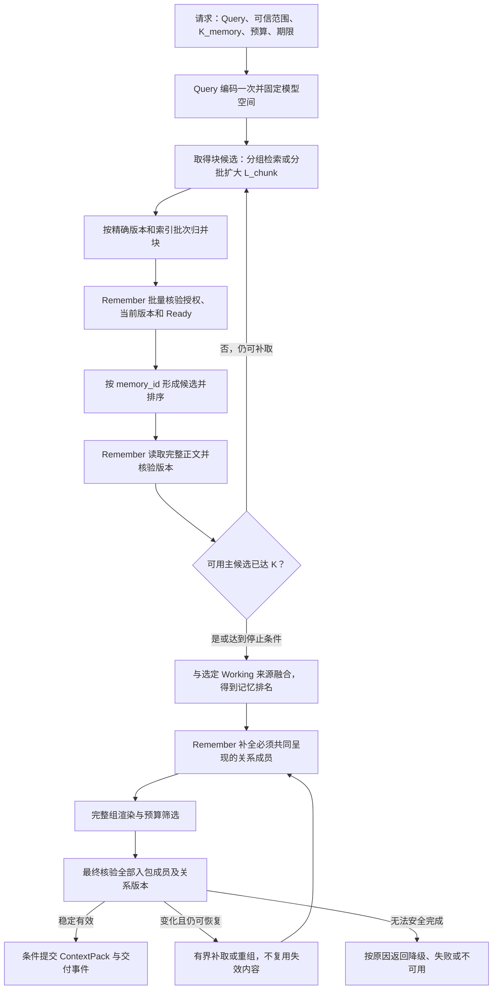

# P3：块命中 → 记忆候选 → 正文组包规则

日期：2026-09-21；2026-09-30 按 Working 向量化决定修订；2026-10-01 同步当前 Working 与 Milvus 路由。本稿包含多块候选/关系组设计与接口规则，不等于全量实现或产品验收。设计基线见 [Working 变更设计](Working记忆向量召回变更设计_20260930.md)；当前 Working 与本地 Lite 已实现范围见[开发指南](../../AgentJYS-main/docs/p3/development/Working与Milvus_本地开发指南.md)、[流程图](../../AgentJYS-main/docs/p3/architecture/Working与Milvus_当前流程.svg)及[验收报告](../../AgentJYS-main/docs/p3/development/Working与Milvus_验收报告.md)。

依据：[用户最新完整图](P3全景流程_Excalidraw/P3_整体架构与完整流程_Working向量化_V1.4.excalidraw)、[闭环检查 F04](P3_框架内部闭环检查_20260921.md)、[协同开发规范](../开发协作/02_协同开发规范.md)，以及用户已确定的“Top K 按记忆 ID 计数，同一记忆的多个 chunk 不重复占位”。本稿沿用整条记忆读取、完整冲突组预算及最终资格核验。

## 1. 核心决策

**chunk 是 Working 与长期向量检索的匹配单位；memory_id 是各所选来源主候选的计数单位；完整记忆或必须共同呈现的关系组是 ContextPack 的装入单位。**

| 概念 | 本稿定义 |
|---|---|
| K_memory | 每个所选来源检索计划最多选取的有效主候选记忆数；同一 memory_id 的多块只占一个名额；最终交付仍受统一条目数与预算限制 |
| L_chunk | 底层一次检索尝试取得的块数量；属于内部取数参数，不向用户解释成 Top K |
| 主候选版本 | 由 Remember 判定当前可用的精确版本；同一 ID 的多个版本不能混合计分或重复占位 |
| 命中块 | 相关性定位依据；保留标识和分数，不代表记忆的完整正文，也不要求命中全部块 |
| 正文模式 | 本版采用完整 Memory 正文。块索引不要求正文物理分块保存，也不通过命中块拼凑全文 |
| 关系组 | Remember 指定必须一起交付的完整分歧/冲突集合；没有此类关系的记忆自成一组 |
| 预算 | 使用 ContextPack tokenizer 计算实际渲染内容；与 Embedding tokenizer 的输入限制分别管理 |

K_memory 约束各所选来源的向量主候选，不等于最终包内记忆总数。Working 同样先向量查询并核验索引；关系补全可能增加成员，分别登记数量并统一受正文预算约束。不得宣称“Top K=20 就保证交付 20 条”，也不得把关系补全伪装成额外独立主候选。

本版不启用自动摘要替代或静默片段交付。完整记忆太长时走明确的整组跳过/不可用规则。未来若新增片段模式，需要独立约定上下文边界、来源位置、冲突完整性及输出标记。

## 2. 总流程

图中“达到停止条件”不自动表示成功或正常空结果；须按第 9 节判定。U 若需补主候选，返回候选阶段；只影响关系时重新展开关系。补取和重组共享原请求期限及次数上限。

## 3. 建库先提供可验证的索引身份：B.6

Remember 为 Working/Episodic/Semantic 的精确版本确定正文指纹；共享 Passage 编码器按照明确的分块策略生成块与向量。索引明确携带 Working/长期来源标签，并至少携带：

| 字段 | 用途 |
|---|---|
| tenant / scope 标识 | 服务端过滤；对象级权限仍由 Remember 核验 |
| memory_id、memory_version | 找到对应正式记忆；不能只用 ID 读取任意最新版本 |
| projection_generation | 区分同一记忆版本的重建索引批次 |
| embedding_space_id | 固定兼容的模型版本、用途配置、维度、归一化和距离规则 |
| chunk_id、chunk_policy_version | 标识本批次中的块及其切分规则 |
| body_fingerprint、chunk_fingerprint | 核对索引对应的正文和分块输入 |
| chunk_range | 正文内可验证的位置；明确偏移单位，不混用字符、字节和 token |

Remember 持有该批次的预期块清单及发布状态。只有全部预期块验证通过，才条件发布该精确版本/模型空间/批次的可召回资格。向量库里存在块不等于该批次已发布；同版本重建期间沿用已发布批次，切换后拒绝旧批次。

新记忆版本产生后，不自动回退旧版本来凑 K；具体可用版本以 Remember 的权威策略为准。Working 与长期记忆的新版本尚未发布投影时均不使用旧版本候选顶替；未就绪必须显式反馈。已知 ID + 精确版本的授权正文读取独立可用，不依赖向量就绪；Working 语义召回仍要求自身的投影资格，不能把正文读取当成隐式语义召回旁路。

## 4. 从块命中形成记忆候选：A.1a

### 4.1 固定查询条件

记录原 recall_id、Query 指纹、可信身份和请求范围、K_memory、来源要求、模型空间、排序策略、期限和检索限额。Query 只编码一次；同次扩量检索复用向量和条件。模型空间不兼容立即按来源故障处理，不能只凭维度相同混查。

### 4.2 获取块候选

优先使用经适配器能力核验的分组向量检索，分组键为租户内 memory_id；每组代表块应按最佳相似度选取。旧版本、未发布批次仍可能占组，因此原生分组之后仍须 Remember 过滤和不足补取。当前是否支持该能力需要实现时核对实际 Milvus/SDK 版本，本设计不假定已经可用。

不支持原生分组时，使用块检索后聚合。建议起始配置为 L_chunk=4×K_memory，未凑够时逐步扩大为 8×、16×、32×、64×。K=20 的请求规模示例为 80、160、320、640、1280。这些是工程起点，不是已验证最优参数。

优先使用适配器真正支持的有序续取/游标；否则扩大查询上限并合并结果。不能假定多次近似检索结果是严格嵌套的，也不能把每次返回长度简单累加当作新增候选数。按完整索引身份去重，最多检查 64×K 个不同块、最多 5 次向量请求，并服从更早到达的全局期限。多个上限独立生效；前几轮累计达到不同块上限时，应提前停止。

### 4.3 先校验版本，再按记忆占位

1. 拒绝格式错误、非有限分数或模型空间不匹配的向量结果，登记来源完整性问题。
2. 将命中按 `(tenant, memory_id, memory_version, projection_generation, embedding_space_id)` 暂时归并。同一块的重复回包只记一次。
3. 调 Remember 批量验证对象权限、当前版本、删除/到期、来源资格、正文指纹和已发布索引批次。依赖故障不能当作资格不通过。
4. 批量核验应返回本次判定采用的记忆/授权/关系修订标识；同 ID 的候选只采用该次权威判定允许的版本和批次。发现同 ID 判定相互矛盾时重验，不能混用不同时间的结果。
5. 只在合格版本内合并命中块，按 tenant + memory_id 计一个主候选名额；其他版本的分数不能加到它身上。
6. 组内保留最佳块和已见命中块，输出 memory_score、精确版本、批次及可追溯的 matched_chunks。命中块集合是已观察集合，不能声称列出了所有相关块。

检索过滤减少无效数据流动；Remember 的权威核验决定实际资格。请求本身无权访问范围时直接拒绝，不进入检索；逐对象被排除的敏感 ID 不对调用方披露。

### 4.4 记忆分数及并列规则

本版采用最佳块相关性：

`memory_score(M) = max(similarity(chunk))，chunk 属于 M 的合格精确版本和已发布批次。`

Vector 适配器输出统一“越大越相关”的比较值，并保留原始分数与度量类型。若底层返回越小越近的距离，先按已绑定度量作单调转换；不同模型空间的分数不直接混排。

按 memory_score 降序；相同时按稳定 memory_id 排序。多块命中不相加，不以命中次数加分。最佳块聚合避免显式累加带来的长度优势，但不宣称完全消除长文偏差。

默认关闭额外重排，以这套规则形成长期记忆名次。以后开启重排时只在已形成的记忆候选层处理，并定义长输入表示与失败策略，不重新把块当作 Top K 单位。近似向量检索得到的是检索器返回范围内的记忆 Top K，不承诺全库数学精确 Top K。

## 5. 不足 K 的补取和完整正文读取：A.1a ↔ A.1b

候选临时池可超过 K；本版最多输出 K 条成功取得完整正文的长期主候选。先按排名处理最前面的 K 个合格 ID，由 Remember 批量读取，再依结果处理空位：

| 情况 | 动作 |
|---|---|
| 多个块对应同一记忆 | 合并为一个候选，其余空位从其他 ID 补齐 |
| 候选过期、旧版本、未 Ready 或被删除 | 排除；从临时池下一条或扩量检索补齐 |
| 对象级权限不满足 | 排除并保护元数据；不足时继续寻找其他获授权候选 |
| 正文完整读取且精确版本一致 | 登记可用主候选及成功 read 事件 |
| 正文读取时版本改变 | 丢弃该次旧读取；在剩余限额内重新检索该请求，不能把旧分数直接赋给新正文 |
| 正文读取超时、存储不可用或校验失败 | 登记读取故障；仅在请求允许部分来源结果时继续补齐并标记降级，否则失败 |
| 候选池不足且仍有检索额度 | 扩大块候选或继续分组检索，再执行核验和排名 |

读取使用权威正文对象引用，与向量索引位置分开。缓存命中时同样核对版本与内容指纹；缓存缺失时由 Remember 按引用回源。长正文可分页/流式读取，但只有全部内容及结束标志验证完成才算本版所需的完整正文。不得用命中的若干 chunk 当作完整正文返回。

设置独立的正文读取字节/耗时上限；超过上限记为读取资源限制，不能伪装成正常无记录。若有可信的、与正文指纹和 tokenizer 绑定的大小信息，可提前判断明显无法装包的内容，但要保留预算排除原因，不计成成功完整读取。

停止条件为：已形成 K 条有效可读主候选；检索器明确报告当前检索结果流结束；达到检索/读取额度；请求期限届满；必需依赖失败。返回 stop_reason，不能只返回短数组。

扩量后新发现的高分记忆可替换低分候选；已读过但落选的记忆仍保留真实 read 事实，不发 packed。没有新命中不自动证明全库已耗尽；若适配器不能证明遍历结束，则记为无进展/受限停止。

## 6. 记忆融合与关系补全：A.1

Working 与长期来源进入融合的都是经当前版本、Ready 和资格核验、按记忆去重后的向量候选列表，原始块排名不直接参与 RRF。当前统一入口为每个选定来源建立 Query 编码与向量搜索计划，获准任务/会话范围、模型空间、memory_source 过滤先于该来源 Top K 截断；最终核验时检查来源标签与权威类型一致。Working 不再以时间排序或直接读取代替语义检索。多来源按记忆名次融合，单来源沿用本路名次，不自动改查其他来源。索引 pending/failed 计入覆盖与原因，不伪装为正常 empty。

融合前同一 ID 的版本冲突交给 Remember 判定；不同来源仅在指向同一合格精确版本时合并来源贡献。同一记忆不能因多个 chunk 获得多份 RRF 贡献。

然后调用 Remember 的关系读取接口：

- 明确被更正/替代、已失效的成员按权威规则排除；不能机械地把全部历史版本装入组。
- 对需要保留完整分歧的关系，补全所有必须共同呈现的成员、各自证据及适用条件。
- 补入成员逐项授权和精确读取；它们不是新增独立 Top K 主候选，也不继承虚构的向量分数。由权威关系定位的成员不要求自己命中过向量，但必须满足关系读取和正文使用资格。
- 由 Remember 返回有限、去重的必需成员集合及 relation_revision；不能沿“所有相关关系”无限展开。设成员/深度/读取额度，超限按无法完整交付处理。
- 两个主候选属于同一个必须完整交付的组时只生成一个组，正文不重复。组排序采用组内主候选的最佳最终名次，稳定组标识破同分。

若必需成员无权读取或不可用，不能只保留可读的一半而掩盖分歧。本版按现图采取保守规则：必需冲突组无法完整核验/读取时返回不可用，不悄悄删除该组后宣称正常成功。输出仅说明授权范围内可披露的原因，不透露受限成员内容或标识。

## 7. 完整组预算和最终交付

### 7.1 预算装包

先确定 ContextPack 专用预算。如果调用方给的是整次模型窗口，先明确扣除系统提示、当前问题、其他输入和输出预留；不能把整个窗口都拿来装记忆。tokenizer 与模板版本必须固定。

按组名次依次尝试，将正文、来源标注、关系说明和分隔符一起渲染到临时包。用固定 tokenizer 对整个临时包重新计数，不能假定逐段 token 数简单相加完全准确。

- 临时包未超过预算：整组接受。
- 超过预算：整组跳过，记录 budget_excluded，继续下一组；不能截断正文或拆散冲突组。
- 扫描完已选候选组即停止。本版不因预算跳过重新无界扩大 Top K；最终少于 K 条是合法结果。
- 存在有效候选，但任何完整组都装不下：返回不可用及预算不足原因，不返回 Empty。
- 正常预算选择造成少装几条，不单独算来源降级；来源故障和搜索受限另行标记。

这使长记忆情形有明确终点，但不会保证任意长度记忆都能交付。后续片段模式是另一项产品/契约设计，不能以组包阶段自动截断来隐式开启。

### 7.2 最终核验与提交

包生成后，由 Remember 对全部入包成员执行 final_guard，检查当前身份、对象版本、删除/到期、来源资格及 relation_revision；Working 与长期主候选均同时核对本次采用的投影资格。关系变化可能新增必需成员，不能只验证原列表是否仍存在。

发现变化时丢弃受影响结果，重读/补关系并重新计算预算；若需替换主候选，回第 4—5 节补取。建议最多重组 2 次，所有恢复共享原 recall_id 和期限；持续变化或无法完整交付则不可用，原依赖故障按来源策略处理。

final_guard 与 RF 结果持久提交之间必须有条件提交协议。本提案在同一权威事务存储可用时，以成员/授权/关系修订号和删除屏障作提交条件，在一个短事务内完成复核、结果及 Outbox 提交；网络读取和模型推理均在事务外完成。若部署无法共享这一事务，必须另行实现 B 可保证的许可/撤销协议，不能声称先远程 guard 再普通保存已消除竞态。

提交后变更不能靠历史快照继续授权：历史重取按现有 A.2 重验；不能保证已发送给调用方的字节在事后撤回。成功 read 和最终 packed 分别记录，chunk 命中不生成正文 read，packed 不重复计热；事件消费沿用公共去重规则。

## 8. 建议的接口结果内容

下列是设计字段，不表示现有 Schema 已有这些字段；落地时按共享契约流程更新。

| 层级 | 至少返回什么 |
|---|---|
| ChunkHit | memory_id、version、projection_generation、space_id、chunk_id/range、输入指纹、原始度量及统一相似度 |
| Qualification | 每项可用/排除/故障类别、有效精确版本和批次、相关修订标识；敏感原因仅用于授权内部诊断 |
| MemoryCandidate | 唯一 ID、精确版本、批次、memory_score、长期记忆名次、已见 matched_chunks、来源及正文读取状态 |
| MemoryBody | 正文、完整性标志、正文指纹、精确版本、来源证据和关系修订；不拿向量库 payload 当权威正文 |
| ContextGroup | 稳定组标识、主候选与补全成员、精确版本集合、必需关系、排序依据、渲染内容与预算结果 |
| RecallResult | 原请求关联、结果状态、包内条目及来源、完整正文模式、tokenizer/模板版本、实际 token 数、停止/降级原因 |

内部诊断另记：请求 K、块返回量/不同块数、资格排除量、选中主候选数、关系补全数、最终记忆数、组数及各类跳过原因。默认不向调用方暴露未授权命中数、对象标识、原始向量或正文日志。

## 9. 结果状态规则

状态名称按现有契约映射；这里定义语义，不直接新增生产枚举。

| 条件 | 结果语义 |
|---|---|
| 取得有效包，所需来源正常且无受限异常 | 正常成功；允许包内少于 K 条 |
| 所选来源索引覆盖已核对，合法向量检索正常结束且无有效匹配 | Empty；向量检索无命中不证明库里没有任何记忆 |
| 获准范围内存在当前版本待索引或索引失败，且影响本次覆盖 | 显式未就绪/降级或依赖错误；无结果不能伪装正常 Empty |
| 请求范围本身无权限，或本次只有权限阻断导致无可用材料 | 权限拒绝/不可用；不伪装 Empty，不披露受限对象 |
| 搜索/读取限额导致未凑够 K，但已有可用包且策略允许 | 降级，标明搜索/读取受限；不承诺凑足 K 或全库最优 |
| 搜索受限且无可用包 | 不可用，记录限额/期限原因 |
| 必需长期来源或完整正文读取发生故障，策略不允许部分结果 | Failed；不得补够数量后隐藏原故障 |
| 可选来源故障，其他来源仍有有效包且明确允许 | 降级；显式仅 Working 的请求仍禁止改查长期 |
| 完整冲突组无法获得全部必需材料 | 不可用，保留完整分歧原则 |
| 所有完整组超出预算 | 不可用，原因是预算不足 |
| 最终核验持续变化或超过重组限额 | 不可用/失败，按实际原因；不得提交旧包 |

正常成功仅表示本次已声明检索范围与策略正常完成，不代表全库穷举检索或绝对相关性最优。

## 10. 一次完整示例

设 K_memory=3，采用同一模型空间的相似度；检索依次出现：

| 块 | 分数 | 处理 |
|---|---:|---|
| M1 v2 / c2 | 0.92 | M1 主候选分数 0.92 |
| M1 v2 / c4 | 0.90 | 归并 M1，不增加名额 |
| M2 v1 / c1 | 0.88 | Remember 判定旧版本，排除；不拿该分数套用新版本 |
| M3 v1 / c2 | 0.86 | M3 主候选分数 0.86 |
| M1 v2 / c5 | 0.84 | 继续归并 M1 |
| 扩量取得 M4 v3 / c1 | 0.81 | M4 主候选分数 0.81 |

读取并核验完整正文后，长期主候选为 M1 v2、M3 v1、M4 v3，正好 3 个 ID。假设本次仅长期，不做 RRF；M3 与 M5 存在必须共同呈现的冲突，Remember 补出并授权读取 M5。

组序为 G1={M1}、G2={M3,M5}、G3={M4}。以下 token 数是说明用假设值，均包含标注和关系说明；实际以整包计数为准。扣除固定包装后可用预算为 1400：

- G1 需 700，接受。
- 加 G2 后累计需 1600，超出预算，整组跳过，不能只装 M3。
- 加 G3 后累计需 1100，接受。

最终包为完整 M1 与完整 M4，选中主候选数为 3，入包记忆数为 2；G2 因预算排除。M1 虽然只命中部分块，交付的仍是完整正文。若预算足够，M5 可作为关系补全成员进入包，包内记忆总数可能超过主候选 K。

## 11. 对现图和接口的改动点

| 位置 | 应表达的规则 |
|---|---|
| B.6 分块和索引写入 | 增加正文/分块指纹、分块策略及索引批次；发布资格绑定精确版本与批次 |
| A.1a “Milvus 返回 Top K” | 改为“取得块命中 → 权威资格核验 → 按记忆聚合 → 不足补取”；区分 K_memory 与 L_chunk |
| A.1a 候选输出 | 唯一记忆 ID、有效精确版本、记忆名次及分数；命中块作为辅助依据 |
| A.1b 正文读取 | 按权威引用读取完整正文，核对完整性和版本；读失败与空记录分开；失效空位有界补取 |
| A.1 RRF | 只接收各来源的记忆排名；同一记忆每来源最多贡献一次 |
| A.1 冲突与预算 | 主候选和关系补全分开登记；完整组排序、装入或跳过；无可装组返回不可用 |
| A.1 最终核验 | 包含关系修订与全部成员；变化时有界重组，提交带条件校验 |

后续图集更新（2026-09-21）：已按本规则更新用户最新完整图、独立 Recall / Remember 图和目录，新增 A.1c 候选聚合、A.1d ContextPack 组装，并展开 A.1b 正文读取。见[最新图集目录](P3全景流程_Excalidraw/README.md)。本规则的运行实现与验收仍待完成；本次未修改业务代码。

## 12. 落地验收场景

以下为待执行的验收设计，本次未运行模型或数据库测试。

1. 一条记忆命中多个块，只占一个 K 名额，正文仍完整读取。
2. 多个版本/重建批次同时留在索引，只有 Remember 允许的版本和发布批次参与计分。
3. 前一批块被同一记忆占满，能扩量找到其他记忆；达到限额仍不足时状态准确。
4. 重复/乱序近似检索结果不会重复占位，固定输入结果集的聚合排名稳定。
5. 未 Ready、删除、撤权及正文读失败分别处理，故障不被凑够 K 的结果掩盖。
6. 命中旧版本后正文更新，不允许旧分数关联新正文；最终核验触发补取或终止。
7. 关系补全不占主候选 K、但计入正文预算；多个主候选共享一组时不重复正文。
8. 冲突组缺少必要成员时不交付半组；所有组超预算时不返回 Empty。
9. Embedding tokenizer 与包预算 tokenizer 不同，包内正文、来源、关系及包装仍全部计数。
10. 关系在组包后新增成员，最终核验能发现并重新预算；持续变化到达限额后停止。
11. chunk 命中不产生正文 read；真实读取和 packed 事件按现有规则分别记录和去重。
12. 仅 Working 请求执行 Query 编码及来源过滤后的向量搜索；索引 pending/failed 和依赖故障不会被伪装为正常空结果，且不自动改查长期。

来源完整图 SHA-256：`bc48619061da4ad5882111c2e571b050a50ff9e5258b48ca389d80660509f011`。
