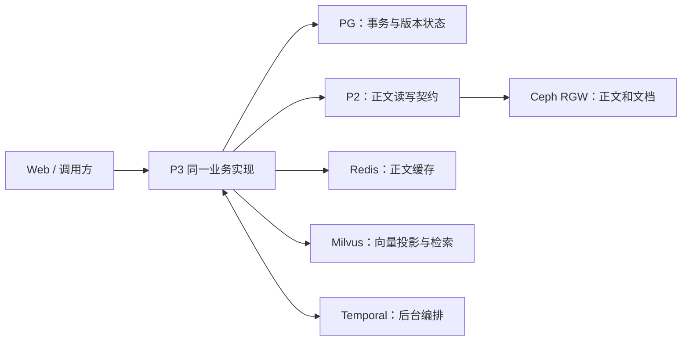

# P3 多环境配置与 AKS 接入设计

日期：2026-10-02

版本：V1.1，按用户“复用已有 Ceph、所有环境取消 SQLite”的要求修订。

状态：供评审的设计；已核查现有 Ceph 的节点、RGW 和健康指标，尚未实现新配置模型、PG 后端或 Ceph 接入，尚未变更云端部署。

## 1. 目标与已确定的边界

同一套 P3 业务代码通过启动配置选择开发、Azure 联调和正式环境。所有环境使用 PostgreSQL、Ceph、Redis、Milvus Server 与 Temporal；配置切换连接地址、凭据、数据范围和容量。联调通过的同一应用镜像再发布到正式环境。

用户已经确定：

- 沿用现有 AKS，复用 `postgresp3`、`redisp3` 和 AKS 内的 Milvus。
- 正文和文档使用 `Ceph-Cluster` 资源组中已有的真实 Ceph，通过 P2 的正文契约接入 RGW。无需另建 Ceph 集群。
- 开发、联调和正式环境全部取消 SQLite、SQLiteP2、lexical、Milvus Lite 及本地持久化替身，运行配置不保留这些兼容模式或故障回退。
- 环境切换由配置完成；开发和测试不能因配置遗漏而访问正式数据。

本设计确定环境配置、后端职责、装配边界和接入验收条件。PG 事务迁移、P2/Ceph 存储适配和现有 Ceph 私网接入分别作为后续工作包实施。既有任务分工保持原文；涉及 P2 或其他负责人的实现以接口协作为边界。

## 2. 当前基线与需要补齐的实现

2026-10-02 核查结果：

| 项目 | 当前事实 | 对本设计的影响 |
|---|---|---|
| P3 启动 | 已有 `serve --config` 和 `check-config --config`；配置类型拒绝未知字段 | 保留统一入口，扩展同一配置模型 |
| 环境选择 | `profile` 目前只有 `local`、`production` | 用明确的开发、联调、正式环境配置替换旧选择逻辑 |
| 事务底座 | Foundation 直接创建 `SQLiteUnitOfWork`，部分查询使用 SQLite 专有 SQL | 替换为 PG 事务和查询实现，移除 SQLite 运行路径 |
| 正文 | 配置 `p2_endpoint` 时使用 P2；缺省使用本地 `SQLiteP2` 替身 | P2 接入既有 Ceph；正文接口必填，移除缺省替身 |
| Redis / Operate | 已有可配置正文缓存；Operate 仍使用文件和 `executor.db` | 热副本接 Redis，控制状态接 PG，物理放置按真实 P2/Ceph 契约执行 |
| 日志与健康检查 | 当前有 SQLite 日志库和 SQLite 探针 | 结构化记录接 PG 独立 schema，运行日志输出标准流/监测系统，探针检查真实依赖 |
| Milvus | 已有共享写入/检索适配器；Lite 有历史本地验收记录 | 运行配置仅使用 Milvus Server，补 Azure 业务及兼容验收 |
| 持久绑定 | 正文 provider、向量 provider 和模型空间会持久绑定 | 切配置不能自动转换旧数据库或重标原向量 |
| 服务所有权 | 当前依靠业务目录锁，HTTP 和 Temporal Workers 默认单实例 | PG 接入需有数据库侧所有权与失锁保护；本轮仍保持单副本 |

现有云端 `aether-p3-demo` 仍运行旧的 `local + lexical`/SQLite 配置。这是待迁出的当前事实，不作为后续开发或回退方案。新后端验收通过后受控切流并退役旧运行入口；已有业务数据先盘点和迁移，不能因取消旧配置而直接删除数据。

## 3. 后端职责与数据流

| 组件 | 权威职责 | 可重建或派生的数据 |
|---|---|---|
| PostgreSQL | 记忆元数据、主体与授权、版本、状态、业务幂等、事务、Outbox/Inbox、远端操作身份 | 不保存依赖日志作为完成事实 |
| Ceph，经 P2 访问 | 不可变版本正文、原始文档、加工产物及其准确字节 | 对象副本由 Ceph 管理 |
| Redis | 有容量限制、TTL 和环境范围的正文缓存 | 缓存丢失可从 Ceph/P2 重建；不能替代正式正文或授权事实 |
| Milvus | 绑定模型空间、记忆版本、来源范围的向量投影与检索 | 可从权威正文和版本状态补索引 |
| Temporal | 工作流历史、重试、异步投影、事件与周期任务编排 | 与 PG 中的业务事实及操作身份共同完成恢复 |
| 结构化日志与诊断 | PG 独立 schema 保存可查询记录；运行日志输出标准流和监测系统 | 日志导出不影响业务事务，运行中不再创建 SQLite 日志库 |

实例本地目录只放临时文件、模型缓存和必要只读运行资源。Operate 的状态和执行记录进入 PG，热正文副本进入 Redis，正式正文位于 Ceph；不再用 `executor.db` 或模拟 hot/warm/cold 目录承担存储行为。

`saved` 表示准确正文已确认保存且 PG 中的对应业务事实已提交；`ready` 表示当前版本的向量投影已经可以按授权范围查询。两者继续分开。PG、Ceph、Milvus 和 Temporal 之间不假设存在一个跨系统 ACID 事务，远端响应不确定时复核原操作或原对象，不生成新身份掩盖未知结果。

## 4. 三种环境配置与切换规则

### 4.1 环境矩阵

| 环境 | 事务 | 正文 | 正文缓存 | 向量与编码 | 用途 |
|---|---|---|---|---|---|
| `development` | 开发专用 PG 数据库 | 真实 P2 + 既有 Ceph 的开发 bucket | 开发键前缀 | 固定 BGE + Milvus Server 开发集合 | 本机开发、自动化测试与调试 |
| `integration` | 现有 PG 的独立联调数据库 | AKS 内 P2 + 既有 Ceph 的联调 bucket | 现有 Redis 的联调键前缀 | 同 BGE + 现有 Milvus 的联调集合 | 真实 Azure 网络和部署验收 |
| `production` | 现有 PG 的正式数据库及专用角色 | 既有 Ceph 的正式 bucket 与专用权限 | 正式键前缀 | 同模型空间的正式集合 | 验收完成后运行正式服务 |

三个环境使用相同 provider 实现、关键业务策略与模型空间。不存在另一种数据库的快速开发配置，依赖不可用时明确报错。

摘要、抽取及重排模型也必须显式配置。正式环境保留真实语言模型的要求；联调中缺少某场景所需模型时报告依赖不足，不填入虚构产物或把 literal baseline 的结果当成模型验收。

开发优先复用既有 Azure 服务的专用开发数据范围，本机通过已配置的 VPN 或经管理的隧道访问私网。需要离线环境时，也必须准备真实 PG、Ceph、Redis、Milvus Server 和 PostgreSQL 持久化的 Temporal，再通过同一份配置模型设置相应地址。单元测试可以隔离接口和时钟，但测试工具不得作为应用可选择的持久化后端。

### 4.2 配置模型与解析

新增配置版本 `schema_version: 2`；部署身份使用 `environment`，取值限定为 `development`、`integration`、`production`。旧 `profile`、SQLite 文件路径、lexical 和 Lite 配置不作为兼容入口接受；加载旧运行配置时明确提示迁移要求。

配置明确区分：

| 配置块 | 字段契约 |
|---|---|
| 事务 | `state_store.dsn_env` 指向 PG DSN，固定 PostgreSQL 实现；独立业务数据库和日志 schema |
| 正文 | `p2_endpoint`、`p2_bucket` 必填；P2 固定配置 `storage.backend: ceph_rgw`，endpoint 与凭据使用对应环境的真实 Ceph |
| 缓存 | `redis_url_env` 和环境键前缀必填；Operate 状态归 PG，正文热副本归 Redis |
| 向量 | `recall_config`、Milvus Server URI、集合名和认证必填；拒绝本地数据库 URI 和 Lite 入口 |
| 编码 | `embedding_profile` 固定 native，`embedding_config` 必填；三个环境绑定同一 BGE 模型空间 |
| 编排 | 保留 `temporal` 的 endpoint、namespace、稳定 deployment ID 和 task queue prefix |

每份环境模板均为可独立校验的完整配置，避免运行时多层覆盖隐藏实际取值。公共模型和业务策略引用固定文件；路径继续相对环境配置所在目录解析。保留启动命令 `python -m aether_agent_memory serve --config <环境配置文件>`，暂不增加自动猜测环境或自动尝试备用数据库的入口。

拟新增模板位于 `AgentJYS-main/configs/environments/`，分别命名为 `development.example.yaml`、`integration.example.yaml` 和 `production.example.yaml`。模板只包含字段和非敏感默认值；实际环境文件和运行数据按既有约定保存在项目外工作区，AKS 则通过挂载配置启动。本设计中的新字段尚不能直接交给当前版本的 CLI 使用。

实现时同步替换旧 `p3.temporal.example.yaml`、`p3.production.example.yaml`、lexical/SQLite 和 Lite 启动配置及其活跃 README 命令，修改启动初始化、备份、恢复和健康检查。不能只修改新模板却继续让旧入口默认装配 SQLite。历史报告保留当时的证据，但不作为当前运行指导。

非敏感配置进入版本控制并由 AKS ConfigMap 挂载；口令、token、PG DSN 和 Ceph key 使用环境变量或只读 Secret。Ceph 管理凭据留在 P2/Ceph，不交给 P3。缺少必需凭据、未知字段或互斥字段冲突时，启动失败并给出脱敏原因。

环境配置在启动时确定。切换环境需要启动另一部署或受控重启；不支持在已有业务请求和工作流运行中热切事务库、正文 provider 或模型。`check-config` 仍是离线配置检查；另设不写数据的依赖检查，区分配置有效、网络可达、契约兼容和业务验收。

### 4.3 数据和身份隔离

| 范围 | 开发 | Azure 联调 | 正式 |
|---|---|---|---|
| AKS namespace | 本机应用；团队 P2 可用 `aether-p3-development` | `aether-p3-integration` | `aether-p3-production` |
| PG 业务数据库 | `p3_dev_<developer>` | `p3_integration` | `p3_production` |
| Ceph bucket | `p3-dev-<developer>` | `p3-integration` | `p3-production` |
| Redis 前缀 | `p3:development:<deployment_id>:` | `p3:integration:<deployment_id>:` | `p3:production:<deployment_id>:` |
| Milvus 集合 | `p3_memories_dev_<developer>` | `p3_memories_integration` | `p3_memories_production` |
| Temporal namespace | `p3-development`，另按开发者隔离任务队列 | `p3-integration` | `p3-production` |
| 部署身份 | `p3-dev-<developer>` | `p3-int-v1` | `p3-prod-v1` |

这些是拟实施的隔离名称，不表示资源已经创建。相同环境内重启、镜像升级和故障恢复保留 deployment ID；本地每个开发者使用自己的部署身份、数据目录、对象范围和集合。

Redis 使用 database 0 和显式环境前缀，保留多键 Lua 操作使用同一 scope hash tag 的约束。现有正文键只有 scope 指纹，需补环境前缀，不能依赖租户名恰好不同。PG 使用专用数据库角色，Ceph 使用 bucket 权限，Milvus 权限按实际 Server 能力配置并验证。共享同一资源服务的命名隔离不提供容量或故障隔离，联调不得执行共享 Redis 清空、共享数据库重置或整个 Milvus 集群的破坏测试。

## 5. AKS 与 Ceph 的部署边界

### 5.1 已有 Ceph 的实时核查

2026-10-02 在 `NUIST-RnD` 订阅中发现独立资源组 `Ceph-Cluster`，位置为 Southeast Asia，与 P3 AKS 同一区域。它不部署在当前 P3 AKS 内。

| 节点 | Azure 可用区 | 私网地址 | VM 状态 |
|---|---|---|---|
| `ceph-node1-zone1` | 1 | `172.16.10.4` | Running |
| `ceph-node2-zone2` | 2 | `172.16.10.5` | Running |
| `ceph-node3-zone3` | 3 | `172.16.10.6` | Running |

三台 VM 均为 `Standard_D4s_v3`，各挂载一块 `ceph-osd` 数据盘。Ceph-Prometheus 当前报告 `ceph_health_status=0`，三个 OSD 均 up/in，三个 MON 的 quorum 指标均为 1。该时点健康和节点分布为复用提供基础，容量、复制池参数、负载和恢复能力仍需针对业务验收。

实时指标报告原始总容量 `412304277504` 字节，约 384 GiB，原始已用约 2.82 GiB，当前 PG 状态指标均 active/clean。原始容量不能直接当作业务可用容量；复制数、池与保留空间需要进一步核对，多个池的 `max_avail` 也不能相加作为剩余容量。

从当前 AKS P3 容器无凭据读取 node1、node2 的公网 8080，均获得 `Ceph Object Gateway (tentacle)` 的 XML 响应，类型为 `ListAllMyBucketsResult`。该证据确认真实 RGW 可达；未执行认证对象读写，也不能由匿名列表响应推断业务权限已经正确。

### 5.2 接入网络与权限

现有 Ceph 位于 `network-SoutheastAsia` VNet 的 `ceph-subnet`，地址空间 `172.16.0.0/16`。P3 AKS 位于 `aks-vnet-23918361`，地址空间 `10.224.0.0/12`；AKS 当前仅与 P3 的 `10.64.0.0/16` VNet 对等，Ceph VNet 没有对等连接。AKS 到 `172.16.10.4:8080`、`172.16.10.5:8080` 的本次请求均超时。

推荐补齐 AKS VNet 与 Ceph VNet 的双向直接对等或经管理的等效路由，验证子网/网卡 NSG 和实际出口地址。VNet 对等不具备自动传递性，不能仅通过第三个 VNet 间接假设已连通。上述地址空间不重叠，但仍需确认现有路由和安全策略。

接入使用稳定私网 RGW endpoint、证书校验和对应环境的最小权限账号。当前核查的是公网 HTTP 连通性，不能把该无凭据探查地址直接写成正式运行配置。需核查 RGW 认证、bucket 策略、匿名访问和 TLS；已有资源并不自动提供这些业务配置。

P2/Ceph 适配配置固定真实 S3/RGW 接口，明确 endpoint、region、bucket、path-style 行为、连接超时和凭据引用。接入前核对现有账号及可用 bucket，不在文档或源码中写入 access key/secret key，不把 anonymous 列表可读视为授权写入完成。

先检查既有入口是否已有双 RGW 故障切换能力，再决定是否需要补稳定入口。本路线不在 AKS 新建 Rook/Ceph、不新增 Ceph VM，也不修改现有 OSD/复制池。开发、联调、正式数据使用独立 bucket 和账号，容量与备份策略由现有集群评估。

现有 Milvus 已配置 Azure Blob 作为其内部对象存储。本设计中的 Ceph 要求针对 P3/P2 正文和文档，保留 Milvus 当前内部存储配置；是否连 Milvus 内部文件一起迁到 Ceph，需要另一项明确范围及迁移设计。

应用通过集群 Service 或已接通的 Azure 私网访问依赖。资源组仅用于管理分类，不自动建立网络连通。本机直连 Azure 私网需要 VPN 或经管理的隧道；配置切换不能代替私网接入。Azure PG、Redis、Milvus 的客户端 TLS、证书校验和认证按对应服务配置验证，不能以关闭证书校验解决连接问题。

Temporal 客户端入口保持统一，三个新环境均使用 PostgreSQL 持久化的真实 Temporal Server，历史/可见性数据库与 P3 业务数据库分开管理。现有 SQLite 开发 Server 是待迁出部署，不作为后续运行选项；迁移 P3 到 PG 不代表 Temporal 已升级。

## 6. 装配与迁移要求

### 6.1 统一装配

- 配置层负责类型、互斥、环境组合、凭据引用和脱敏显示。
- 装配层固定创建 PG 事务库、真实 P2/Ceph 正文端口、Redis 缓存、Milvus Server 和 Temporal 客户端。
- Remember、Recall、Operate 只依赖相同业务契约；环境字符串不进入业务决策分支。
- PG 事务必须保留当前版本比较、幂等、Outbox/Inbox 原子提交、授权复核和提交前 guard；当前 SQLite 专有查询改写为 PG 实现，运行依赖不保留 SQLite 适配器。
- PG 部署使用数据库侧所有权协调和失锁后停止新写入的保护。本轮保持一个 P3 副本；PG 可用不自动授权开启 HPA 或多个 Workers。
- Ceph 接入落在 P2 的对象后端，准确绑定对象 key、版本和正文 hash。Ceph/S3 兼容接口的存在不能代替 P2 的解析、来源、范围读取和不确定结果契约。
- Operate 的执行器接入真实 Redis/P2/Ceph，动作状态与恢复归 PG；日志查询与维护改用 PG，备份/恢复改为 PG、Ceph、Temporal 协同方案，不能遗留 `executor.db`、日志 `.db` 或 SQLite 探针。

### 6.2 首次联调与旧数据迁移

先在新联调数据范围初始化并跑通真实后端链路。旧 SQLite 数据仅作为一次性只读迁移来源：独立备份、明确迁移、逐项核对和受控切流。迁移读取工具位于项目外工作区，不把旧库适配器留在新服务的运行配置或启动入口。

迁移必须保留记忆 ID、业务版本、scope、正文 hash、主体授权、幂等身份和未完成远端操作。更换模型时由权威正文重建向量投影，不把旧 lexical 向量当成 BGE 向量使用。旧服务与新服务不能同时写同一业务数据；新环境写入后，回退要处理新增事实，不能简单把旧镜像指回旧数据库。

## 7. 接入顺序与验收条件

以下是工作包的依赖顺序，具体逐文件实施计划在本设计评审后编制：

1. 三份固定后端的环境配置、脱敏检查和统一装配接口；识别并移除旧启动入口。
2. PG 事务、所有权、日志与 Operate 状态；改写 SQLite 专有查询和维护逻辑。
3. 既有 Ceph 的私网、认证和 P2 存储适配；Redis 热正文缓存和真实动作恢复。
4. Milvus Server 的固定 SDK、模型空间、集合和授权验证；Temporal 使用独立 PG 持久化。
5. 本机开发和 AKS 独立联调数据验证；同一业务实现通过两份配置运行。
6. 业务、故障和备份恢复验收，迁移必要旧数据并退役旧配置；使用同一镜像 digest 发布正式环境。

| 编号 | 验收要求 |
|---|---|
| ENV-01 | 同一代码通过三份配置装配 PG、Ceph、Redis、Milvus Server 和 Temporal；任何环境都没有 SQLite、替身、lexical 或 Lite 回退 |
| ENV-02 | 错误环境标识、漏 Secret、重复/互斥字段、错误模型空间或集合结构均明确拒绝；诊断不泄露 token/DSN/key |
| ENV-03 | 相同租户、用户、对象 key 在两个环境不能交叉读写；验证 PG、Ceph、Redis 和 Milvus 各自边界 |
| ENV-04 | 从启动、正文、向量、Operate、日志、健康检查、备份恢复及活跃部署命令核对 SQLite 已退出运行路径；旧配置明确拒绝 |
| PG-01 | 版本竞争、幂等提交、回滚、授权变更、Outbox/Inbox 和失锁停止写入在真实 PG 中成立 |
| OBJ-01 | 真实 Ceph 中的准确正文持久、固定版本读取、校验及重启恢复通过；远端写成功但响应丢失后能核对原对象恢复 |
| CEPH-01 | AKS 到既有 RGW 的私网访问、TLS、专用账号和 bucket 权限通过；匿名和跨环境访问不能取得受保护正文 |
| CACHE-01 | 清除单个联调缓存范围后可从权威正文恢复；TTL 不改变记忆有效期，旧版本/撤权内容不能被缓存重新授权 |
| VEC-01 | Working 与长期记忆的向量写入、来源过滤、更正、删除、晚到任务和历史结果复核在 Azure Milvus 中通过 |
| RUN-01 | P3 与 Temporal 的分别重启、在途任务和所有权恢复验证通过；不把健康接口 200 当成业务恢复 |
| RELEASE-01 | 本地联调与 Azure 使用固定模型空间；Azure 联调与正式发布使用同一应用镜像 digest；实际 provider 和部署身份可查询 |
| ACCEPT-01 | 跨会话正例、无答案、混合主题召回以及备份恢复单独验收，保留失败，不用换后端替代质量评测 |

阶段结论分别记录：配置已实现、真实本地后端已联调、Azure 已运行、业务验收已通过、生产运行已验收。各阶段不能互相替代。

## 8. 参考与评审重点

- [当前统一服务源码](../../AgentJYS-main/src/aether_agent_memory/runtime/flows/application.py)、[当前配置模型](../../AgentJYS-main/src/aether_agent_memory/runtime/flows/config.py)。
- [当前 Foundation 装配](../../AgentJYS-main/src/aether_agent_memory/runtime/foundation/host.py)、[事务实现](../../AgentJYS-main/src/aether_agent_memory/runtime/foundation/storage.py)。
- [Working 与 Milvus 本地验收及边界](../../AgentJYS-main/docs/p3/development/Working与Milvus_验收报告.md)。
- [现有 AKS 部署进度](../部署运行/P3_AKS部署进度_20261001.md)、[现有任务分配](../开发协作/15_会后五项整改任务分配与验收_20260930.md)。

本次修订替换 V1.0 的四环境与快速 SQLite 方案，以及在 AKS 新建 Ceph 的建议。评审重点为三种环境固定后端、复用独立 Ceph 集群、补私网与认证、完整退出旧运行路径及独立数据范围。原始 Azure 响应与连通性记录留在处理过程，不作为用户运行入口。
