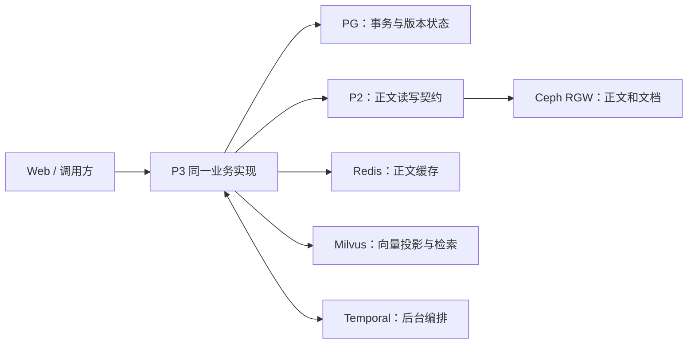

# P3 多环境配置与 AKS 接入设计

日期：2026-10-02

状态：供评审的设计；尚未实现新配置模型、PG 后端或 Ceph 接入，尚未变更云端部署。

## 1. 目标与已确定的边界

同一套 P3 业务代码通过启动配置选择快速开发、本地真实依赖联调、Azure 联调和正式环境。联调通过的同一应用镜像再发布到正式环境，避免为本地和 Azure 维护两套 Remember、Recall、Operate 逻辑。

用户已经确定：

- 沿用现有 AKS，复用 `postgresp3`、`redisp3` 和 AKS 内的 Milvus。
- 正文和文档必须使用真实 Ceph，保留原方案。Azure Blob 不能替代本次要求的 Ceph。
- 环境切换由配置完成；开发和测试不能因配置遗漏而访问正式数据。

本设计确定环境配置、后端职责、装配边界和接入验收条件。PG 的完整事务实现、P2/Ceph 的完整存储实现和 Ceph 的容量部署分别作为后续工作包实施，不把这份设计描述为已经接入。既有任务分工保持原文；涉及 P2 或其他负责人的实现以接口协作为边界。

## 2. 当前基线与需要补齐的实现

2026-10-02 核查结果：

| 项目 | 当前事实 | 对本设计的影响 |
|---|---|---|
| P3 启动 | 已有 `serve --config` 和 `check-config --config`；配置类型拒绝未知字段 | 保留统一入口，扩展同一配置模型 |
| 环境选择 | `profile` 目前只有 `local`、`production` | 新增部署环境身份，不能把已有 `production` 字段当成生产验收 |
| 事务底座 | Foundation 直接创建 `SQLiteUnitOfWork`，部分查询使用 SQLite 专有 SQL | 必须抽出事务接口并实现 PG 后端，不能只新增连接地址 |
| 正文 | 配置 `p2_endpoint` 时使用 P2；缺省使用本地 `SQLiteP2` 替身 | P3 保留 P2 端口，由 P2 接真实 Ceph；集成环境禁止替身 |
| Redis | 已有可配置正文缓存；Operate 执行器仍使用本地文件和缓存元数据 | Redis 接入与 Operate 执行器分别核查，不把配置 Redis 等同于全部缓存已迁移 |
| Milvus | 已有共享写入/检索适配器；Lite 有本地验收记录 | Azure Milvus Server 仍需业务接入和 SDK/Server 兼容验收 |
| 持久绑定 | 正文 provider、向量 provider 和模型空间会持久绑定 | 切配置不能自动转换旧数据库或重标原向量 |
| 服务所有权 | 当前依靠业务目录锁，HTTP 和 Temporal Workers 默认单实例 | PG 接入需有数据库侧所有权与失锁保护；本轮仍保持单副本 |

现有云端 `aether-p3-demo` 继续作为旧演示环境。P3 仍运行 `local + lexical`，正文、业务状态与向量使用 SQLite；其健康状态不能证明 PG/Ceph/Milvus 接入已经完成。

## 3. 后端职责与数据流

| 组件 | 权威职责 | 可重建或派生的数据 |
|---|---|---|
| PostgreSQL | 记忆元数据、主体与授权、版本、状态、业务幂等、事务、Outbox/Inbox、远端操作身份 | 不保存依赖日志作为完成事实 |
| Ceph，经 P2 访问 | 不可变版本正文、原始文档、加工产物及其准确字节 | 对象副本由 Ceph 管理 |
| Redis | 有容量限制、TTL 和环境范围的正文缓存 | 缓存丢失可从 Ceph/P2 重建；不能替代正式正文或授权事实 |
| Milvus | 绑定模型空间、记忆版本、来源范围的向量投影与检索 | 可从权威正文和版本状态补索引 |
| Temporal | 工作流历史、重试、异步投影、事件与周期任务编排 | 与 PG 中的业务事实及操作身份共同完成恢复 |
| 实例本地缓存与日志 | 当前 Operate 执行器的局部准备副本、临时文件、诊断日志 | 不承担正式业务事实；使用实例独立目录 |

`saved` 表示准确正文已确认保存且 PG 中的对应业务事实已提交；`ready` 表示当前版本的向量投影已经可以按授权范围查询。两者继续分开。PG、Ceph、Milvus 和 Temporal 之间不假设存在一个跨系统 ACID 事务，远端响应不确定时复核原操作或原对象，不生成新身份掩盖未知结果。

## 4. 四种配置与切换规则

### 4.1 环境矩阵

| 环境 | 事务 | 正文 | 正文缓存 | 向量与编码 | 用途 |
|---|---|---|---|---|---|
| `dev-fast` | SQLite | SQLiteP2 本地替身 | 可关闭 | lexical + SQLite | 快速逻辑调试、单元测试 |
| `dev-integration` | 开发 PG | 真实 P2 + Ceph RGW 测试集群 | 开发 Redis | 固定 BGE + Milvus Server | 真实依赖的接口、恢复和一致性验证 |
| `azure-integration` | 现有 PG 的独立联调数据库 | AKS 内 P2 + 真实 Ceph 联调 bucket | 现有 Redis 的独立键前缀 | 固定 BGE + 现有 Milvus 的独立联调集合 | 在真实 Azure 网络与部署条件下验收 |
| `azure-production` | 现有 PG 的正式数据库及专用角色 | 正式 Ceph bucket 与专用权限 | 正式缓存范围 | 同模型空间的正式集合 | 在验收完成后发布正式服务 |

`dev-fast` 只降低开发启动成本，其通过结果不能作为云端真实后端验收。`dev-integration` 和 Azure 环境使用相同 provider 实现、关键业务策略与模型空间；地址、凭据、容量和运行拓扑由配置决定。

摘要、抽取及重排模型也必须显式配置。正式环境保留真实语言模型的要求；联调中缺少某场景所需模型时报告依赖不足，不填入虚构产物或把 literal baseline 的结果当成模型验收。

本地真实联调可以在 Linux 开发环境运行 PG、Redis、Milvus Server。Ceph 测试集群使用具有独立测试数据盘的 Linux 开发机或团队共享 Linux 测试机；Windows 开发端调用其 RGW/P2。单主机 Ceph 仅用于接口和功能验证，不作为多节点耐久性证据。Milvus Lite 保留为开发验证工具，不能替代 Milvus Server 的集成门槛。

### 4.2 配置模型与解析

新增配置版本 `schema_version: 2`；部署身份使用 `environment`，取值限定为上表四种。保留现有 `profile` 的兼容语义，但不让它隐式选择后端。旧配置保持原来的 SQLite 本地行为；新集成环境必须显式选择真实后端。

配置明确区分：

| 配置块 | 字段契约 |
|---|---|
| 事务 | `state_store.backend: sqlite/postgres`；SQLite 指定文件路径，PG 指定 `dsn_env`；两者互斥 |
| 正文 | 保留 `p2_endpoint`、`p2_bucket`；集成环境必须配置真实 P2；P2 单独配置 `storage.backend: ceph_rgw` |
| 缓存 | 保留 `redis_url_env`；新增环境键前缀；实例本地 placement cache 单独配置目录 |
| 向量 | 保留 `recall_config`、Milvus URI、集合名和 token 环境变量；集成环境显式要求 Milvus Server |
| 编码 | 保留 `embedding_profile`、`embedding_config`；三个集成/正式环境要求 native 模型空间 |
| 编排 | 保留 `temporal` 的 endpoint、namespace、稳定 deployment ID 和 task queue prefix |

每份环境模板均为可独立校验的完整配置，避免运行时多层覆盖隐藏实际取值。公共模型和业务策略引用固定文件；路径继续相对环境配置所在目录解析。保留启动命令 `python -m aether_agent_memory serve --config <环境配置文件>`，暂不增加自动猜测环境或自动尝试备用数据库的入口。

拟新增模板位于 `AgentJYS-main/configs/environments/`，分别命名为 `dev-fast.example.yaml`、`dev-integration.example.yaml`、`azure-integration.example.yaml` 和 `azure-production.example.yaml`。模板只包含字段和非敏感默认值；实际环境文件和运行数据按既有约定保存在项目外工作区，AKS 则通过挂载配置启动。本设计中的新字段尚不能直接交给当前版本的 CLI 使用。

非敏感配置进入版本控制并由 AKS ConfigMap 挂载；口令、token、PG DSN 和 Ceph key 使用环境变量或只读 Secret。Ceph 管理凭据留在 P2/Ceph，不交给 P3。缺少必需凭据、未知字段或互斥字段冲突时，启动失败并给出脱敏原因。

环境配置在启动时确定。切换环境需要启动另一部署或受控重启；不支持在已有业务请求和工作流运行中热切事务库、正文 provider 或模型。`check-config` 仍是离线配置检查；另设不写数据的依赖检查，区分配置有效、网络可达、契约兼容和业务验收。

### 4.3 数据和身份隔离

| 范围 | Azure 联调 | 正式 |
|---|---|---|
| AKS namespace | `aether-p3-integration` | `aether-p3-production` |
| PG 业务数据库 | `p3_integration` | `p3_production` |
| Ceph bucket | `p3-integration` | `p3-production` |
| Redis 前缀 | `p3:azure-integration:<deployment_id>:` | `p3:azure-production:<deployment_id>:` |
| Milvus 集合 | `p3_memories_integration` | `p3_memories_production` |
| Temporal namespace | `p3-integration` | `p3-production` |
| 部署身份 | `p3-int-v1` | `p3-prod-v1` |

这些是拟实施的隔离名称，不表示资源已经创建。相同环境内重启、镜像升级和故障恢复保留 deployment ID；本地每个开发者使用自己的部署身份、数据目录、对象范围和集合。

Redis 使用 database 0 和显式环境前缀，保留多键 Lua 操作使用同一 scope hash tag 的约束。现有正文键只有 scope 指纹，需补环境前缀，不能依赖租户名恰好不同。PG 使用专用数据库角色，Ceph 使用 bucket 权限，Milvus 权限按实际 Server 能力配置并验证。共享同一资源服务的命名隔离不提供容量或故障隔离，联调不得执行共享 Redis 清空、共享数据库重置或整个 Milvus 集群的破坏测试。

## 5. AKS 与 Ceph 的部署边界

继续复用现有 AKS、ACR、PG、Redis 和 Milvus。新增联调 namespace，先使用独立联调数据验证，不直接改变旧演示环境的 SQLite 数据卷或持久身份。

Ceph 是缺失的真实存储依赖，推荐在现有 AKS 内使用 Rook 管理，RGW 提供 P2 所需的 S3 对象接口。Ceph 需要新建组件和持久数据盘；复用 AKS 不代表 Ceph 不增加资源费用。

Ceph 多节点联调的设计要求是三个独立主机故障域、三个 MON、至少两个 RGW 副本，OSD 使用独立持久块盘；复制池副本数为 3、`min_size` 为 2。Rook 的公开前提包括未格式化的原始设备或 block mode PV，不能把现有 P3/Milvus 的文件系统 PVC 当成 Ceph OSD 磁盘。

部署前必须完成 AKS 1.35 与所选 Rook/Ceph 版本的兼容检查、Azure Disk CSI block volume 验证、节点权限检查，以及当前 Milvus/P3 负载下的容量评估。优先采用独立存储节点池；联调若共用现有节点，需明确资源预留和负载边界。节点规格、盘容量和实际费用由该容量评估给出，资源创建在具体部署方案评审之后执行，不在本配置设计中猜测购买规格。

本次读取的现有三个节点均属于 `nodepool1`，可用区标签为 `0`，没有跨可用区部署证据。三节点 host 隔离只能支持相应节点故障验证，不能宣称已具备可用区或区域容灾。Ceph 副本也不替代异地备份和恢复演练。

现有 Milvus 已配置 Azure Blob 作为其内部对象存储。本设计中的 Ceph 要求针对 P3/P2 正文和文档，保留 Milvus 当前内部存储配置；是否连 Milvus 内部文件一起迁到 Ceph，需要另一项明确范围及迁移设计。

应用通过集群 Service 或已接通的 Azure 私网访问依赖。资源组仅用于管理分类，不自动建立网络连通。本机直连 Azure 私网需要 VPN 或经管理的隧道；配置切换不能代替私网接入。Azure PG、Redis、Milvus 的客户端 TLS、证书校验和认证按对应服务配置验证，不能以关闭证书校验解决连接问题。

Temporal 客户端入口保持统一。现有开发 Server 继续留给旧演示；正式发布需要真实持久 Server、独立历史/可见性数据库和恢复验证。Temporal 数据库与 P3 业务数据库分开管理，不能把迁移 P3 到 PG 等同于 Temporal 已升级。

## 6. 装配与迁移要求

### 6.1 统一装配

- 配置层负责类型、互斥、环境组合、凭据引用和脱敏显示。
- 装配层按明确 provider 选择创建事务库、正文端口、缓存、向量和 Temporal 客户端。
- Remember、Recall、Operate 只依赖相同业务契约；环境字符串不进入业务决策分支。
- PG 事务必须保留当前版本比较、幂等、Outbox/Inbox 原子提交、授权复核和提交前 guard；SQLite 专有查询移入对应适配器。
- PG 部署使用数据库侧所有权协调和失锁后停止新写入的保护。本轮保持一个 P3 副本；PG 可用不自动授权开启 HPA 或多个 Workers。
- Ceph 接入落在 P2 的对象后端，准确绑定对象 key、版本和正文 hash。Ceph/S3 兼容接口的存在不能代替 P2 的解析、来源、范围读取和不确定结果契约。

### 6.2 首次联调与旧数据迁移

先在新联调数据范围初始化并跑通真实后端链路。旧 SQLite 业务数据的迁移另行执行只读盘点、独立备份、明确迁移、逐项核对和受控切流；不能仅修改配置文件重开原目录。

迁移必须保留记忆 ID、业务版本、scope、正文 hash、主体授权、幂等身份和未完成远端操作。更换模型时由权威正文重建向量投影，不把旧 lexical 向量当成 BGE 向量使用。旧服务与新服务不能同时写同一业务数据；新环境写入后，回退要处理新增事实，不能简单把旧镜像指回旧数据库。

## 7. 接入顺序与验收条件

以下是工作包的依赖顺序，具体逐文件实施计划在本设计评审后编制：

1. 统一环境配置、脱敏检查和 provider 装配接口；保留现有快速开发入口。
2. PG 事务后端及单实例所有权；SQLite/PG 跑同一组业务事务和恢复契约。
3. P2/Ceph 对象后端与真实 Redis 正文缓存；补齐版本、来源与环境隔离。
4. 本地真实依赖联调；检查 Milvus Server 与固定 SDK、模型和集合契约。
5. AKS 独立联调部署；复用现有 PG、Redis、Milvus，接入经容量评审的 Ceph。
6. 业务、故障和备份恢复验收；通过后使用同一镜像 digest 发布正式环境。

| 编号 | 验收要求 |
|---|---|
| ENV-01 | 同一代码通过四份配置装配预期 provider；三个集成/正式环境缺少真实依赖时不能退回 SQLite、替身或 lexical |
| ENV-02 | 错误环境标识、漏 Secret、重复/互斥字段、错误模型空间或集合结构均明确拒绝；诊断不泄露 token/DSN/key |
| ENV-03 | 相同租户、用户、对象 key 在两个环境不能交叉读写；验证 PG、Ceph、Redis 和 Milvus 各自边界 |
| PG-01 | 版本竞争、幂等提交、回滚、授权变更、Outbox/Inbox 和失锁停止写入在真实 PG 中成立 |
| OBJ-01 | 真实 Ceph 中的准确正文持久、固定版本读取、校验及重启恢复通过；远端写成功但响应丢失后能核对原对象恢复 |
| CACHE-01 | 清除单个联调缓存范围后可从权威正文恢复；TTL 不改变记忆有效期，旧版本/撤权内容不能被缓存重新授权 |
| VEC-01 | Working 与长期记忆的向量写入、来源过滤、更正、删除、晚到任务和历史结果复核在 Azure Milvus 中通过 |
| RUN-01 | P3 与 Temporal 的分别重启、在途任务和所有权恢复验证通过；不把健康接口 200 当成业务恢复 |
| RELEASE-01 | 本地联调与 Azure 使用固定模型空间；Azure 联调与正式发布使用同一应用镜像 digest；实际 provider 和部署身份可查询 |
| ACCEPT-01 | 跨会话正例、无答案、混合主题召回以及备份恢复单独验收，保留失败，不用换后端替代质量评测 |

阶段结论分别记录：配置已实现、真实本地后端已联调、Azure 已运行、业务验收已通过、生产运行已验收。各阶段不能互相替代。

## 8. 参考与评审重点

- [当前统一服务源码](../../AgentJYS-main/src/aether_agent_memory/runtime/flows/application.py)、[当前配置模型](../../AgentJYS-main/src/aether_agent_memory/runtime/flows/config.py)。
- [当前 Foundation 装配](../../AgentJYS-main/src/aether_agent_memory/runtime/foundation/host.py)、[事务实现](../../AgentJYS-main/src/aether_agent_memory/runtime/foundation/storage.py)。
- [Working 与 Milvus 本地验收及边界](../../AgentJYS-main/docs/p3/development/Working与Milvus_验收报告.md)。
- [现有 AKS 部署进度](../部署运行/P3_AKS部署进度_20261001.md)、[现有任务分配](../开发协作/15_会后五项整改任务分配与验收_20260930.md)。
- [Rook 官方前提](https://rook.io/docs/rook/latest-release/Getting-Started/Prerequisites/prerequisites/)：本次已读取其原始设备/block mode PV 的要求；这不证明当前 AKS 已通过 Rook 安装验收。

评审需要确定本设计是否准确表达四种环境、Ceph 经 P2 的正文边界、现有 Azure 资源复用及独立联调数据范围。具体容量和资源费用属于后续部署方案，不由配置切换自动决定。
