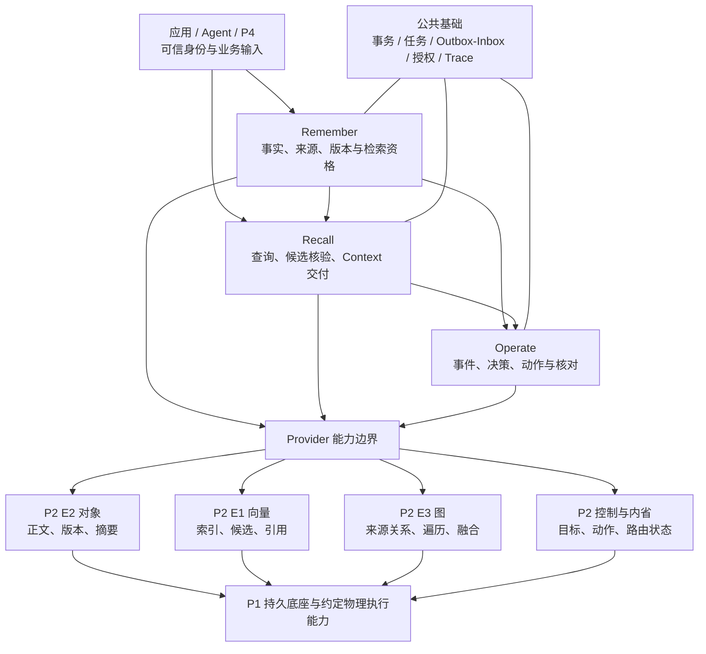

# P2 / P3 总体架构与三流程

2026-09-20实现状态修订：当前能力以[协作状态表](../开发协作/01_当前实现与待办.md)为准；目标流程与实际实现分开。

状态：联合评审稿；当前依据 P3 V1.3 与 P2 v1.0。原2026-09-19代码核查保持历史范围，新增租户要求与已实现状态分别说明。

## 1. 总体关系

箭头表示目标依赖，不表示已经联通。P2 E3 Graph/Fusion 服务尚未在当前 ae-grpc 入口注册，不能据图宣称远程图查询可用。

## 2. 模块、服务和数据归属

| 模块 | 对结果负责 | 权威数据 / 不越界的边界 | 当前实现 |
|---|---|---|---|
| Remember（B） | 事实正确形成、版本与检索资格 | Memory、来源映射、生命周期、ProjectionState；不替 P2 伪造正文落盘证明 | remember/basic/service.py；默认 LiteralExtraction |
| Recall（A） | 有效结果与 Context | 查询与 Context 记录；消费 Remember 权威资格，不自行修改事实 | recall/basic/service.py；RRF、可配置CrossEncoder、实际tokenizer预算、单条组 |
| 共享 Embedding（A） | 同空间的 Query/Passage 向量 | 模型指纹、维度、输入绑定；真实向量不等于语义提取 | 原生 BGE-small-zh-v1.5、512 维 |
| Operate（C） | 决策、动作与 Unknown 收敛 | hotness、placement plan、action；不拥有物理介质事实 | operate/basic；LocalCacheExecutor |
| 公共基础（RF） | 可靠交接、隔离、可恢复性 | SQLite UoW、任务、租约、Outbox/Inbox、授权、日志 | runtime/foundation；本地单机 |
| P2 E1 / E2 / E3 | 候选 / 正文 / 图关系 | 引擎数据、索引、WAL、Segment、路由；不决定 P3 记忆业务有效性 | engine/engines；远程能力逐项待实测 |
| P1 / Executor | 约定物理效果 | 底层持久、目标介质和动作效果 | 现场契约及部署待联调 |

这些是逻辑模块，不要求本期拆成五个独立微服务。当前新流程通过 Host、CLI、Worker 装配。旧 Web/API v1 属于旧装配，Mock 也未接入新 Host。

## 3. 保存与就绪（EP-P3-01/02）

可信身份校验 → 保存来源、正文与 Memory → 同一事务记录后续任务/事件 → 返回 saved → Worker 提取/生成表示 → Query/Passage 空间绑定 → 写投影并核验当前版本、授权及可查询性 → 由 Remember 授予 ready。

失败分支：保存失败不得返回成功；投影失败保留已存事实与可用 Working，但不得 ready；删除/更正发生后，迟到 Worker 必须重新核验，禁止复活旧版。真实 Provider 的持久性与可查询性证明仍需联调。

## 4. 统一召回（EP-P3-04/05）

可信授权与来源选择 → Query 向量 → 获取 Working/长期候选 → Remember 核验版本、状态与来源 → 准确正文读取 → 排序、去重和冲突组织 → 在预算内组装 → 最终资格复核 → 返回 Context 与 complete/empty/degraded/unavailable → 记录读取事件。

当前后端只形成单条 ContextGroup。多来源语义冲突整组输出是尚未完成的设计目标；Mock S08 展示目标。历史 Context 重用也必须复核当前资格，不能直接复用缓存正文。

## 5. 内部调度与执行（EP-P3-07/08）

消费存储/读取事件并去重 → 根据当前观测和策略生成 desired → 解析 representation 对应不透明目标 → 容量/版本/动作冲突检查 → 持久 action ID → 提交执行 → 查询或接收回执 → 核对目标正文可读及版本仍有效 → 更新 observed。

回执丢失：保持 Unknown 并查询原 action ID；查不到证据就继续 Unknown，不能盲目新建动作。删除或更正后到达的旧回执不能恢复旧事实。当前只验证本地目录动作，不证明 P1/P2 物理分层。

## 6. P2 内部路径与交接

E2：对象请求 → bucket/key/版本校验 → 正文落点与元数据 → 摘要/版本返回 → 精确读取核验。
E1：集合与维度校验 → 向量/引用写入 → Segment/索引 → 带过滤检索 → 返回候选稳定引用。P3 仍须核验记忆资格。
E3：节点/边引用写入 → 遍历/融合 → 回传关联对象与版本。当前图源码与远程服务注册应分别验收。
恢复：记录 WAL → 崩溃后恢复 → 校验对象/向量/关系引用一致性 → 对未完成动作按原 ID 查询。

跨引擎不假设共享一个分布式事务；按权威来源、幂等写入、补偿和查询核对处理失败。精确版本读取、授权过滤位置、Provider ready 语义、删除证明、执行目标及路由版本均列入 TC-INT-01 和 P2 TC。

## 7. 运行与演进

当前：单机 Python + SQLite + 本地模型缓存/文件目录。目标：真实 P2/约定 Provider 和部署环境，先完成接口联调与故障恢复，再验证性能、质量和长稳；Azure VM / AKS 是工程演进方案，尚未形成生产部署证据。

字段与事件见 [工程契约](../../AgentJYS-main/contracts/p3/README.md)；细节见 [工程设计](../../AgentJYS-main/docs/p3/README.md)。决策理由见 [唯一主 ADR](../ADR版本/ADR-P2P3-001_总体架构决策.md)。

## 8. 租户和 Azure 身份边界

建议接入顺序：Microsoft Entra ID 身份 → 接入层验证 → P3 业务租户及主体映射 → 资源/操作授权 → Remember、Recall、Operate → P2 范围隔离 → 最终资格复核。Azure 身份目录与 P3 业务租户不是同一对象，需要受控映射，未开通身份不能自动获得业务访问。

记忆、来源、结果、任务、事件和调度操作保持业务租户归属。同租户内的应用、用户和 Agent 仍按明确权限访问。Managed Identity / Workload Identity 用于服务访问云资源，不代替每条请求的业务授权；后台任务和旧结果再次获取继续检查当前许可。

当前已有部署凭证和本地隔离检查；Entra、最小租户配置生命周期及真实 P2 隔离仍需接入实现和验证。业务行为见 [PRD 租户补充](../PRD版本/PRD补充_租户与身份接入.md)，技术取舍和外部撤权边界见 [ADR D07](../ADR版本/ADR-P2P3-001_总体架构决策.md#d07)。
