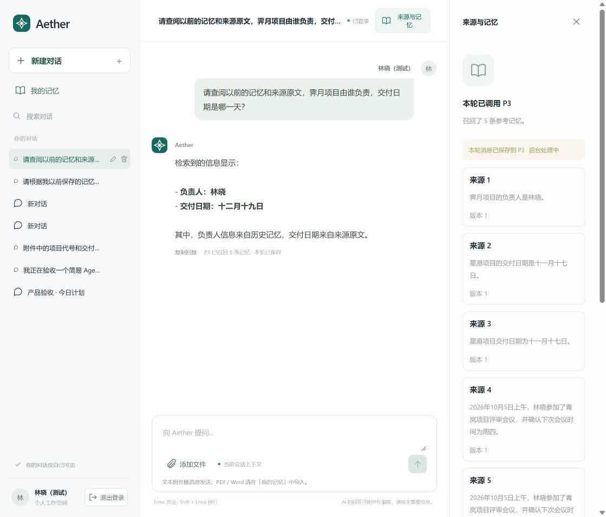

> 界面更新：本报告中的 P3 运维 UI 随后按用户要求删除；相关历史证据不代表当前仍存在该入口。P3 原生接口与服务保留，当前登录和界面见 [使用说明](Agent平台测试包_20261005/使用说明.md)。

# Agent 平台 P3 接入验收记录

> 后续更新（2026-10-05）：用户已要求删除旧 Web，本机旧 18081 页面及其源码、启动配置已移除；下文“旧 P4 保留/退役待完成”是本报告原验收时的状态。P4 后端契约测试工具仍保留，详见 [旧 Web 退役说明](Agent平台测试包_20261005/旧Web退役说明.md)。

日期：2026-10-05。范围：新 Agent 用户平台、P3 业务接口、文档导入、平台管理员运维入口，以及真实依赖联调。

## 1. 结论与使用入口

新 Agent 已实际调用 P3，完成登录身份传递、记忆召回、关联来源原文读取、LLM 回答、当前用户消息保存与可核验回执。普通用户通过“我的记忆”维护自己的记忆；平台管理员通过独立运维权限查看任务并向原执行链提交恢复请求。此次验证使用真实 P3、真实 LLM 和云端 P3 存储依赖。

这是本机用户平台连接云端 P3 的可运行验收版本。用户平台完全迁云、完整账号开通与归属变更、旧 P4 退役、生产可用性验收尚未完成。P3 原生 PostgreSQL 备份/恢复接口本身尚不支持直接执行，不能把对应 UI 入口认定为备份恢复已实现。

- [Agent 用户平台与平台管理员 P3 运维入口](http://localhost:19010/)
- [Budibase 账号管理中心](http://localhost:19000/app/default%20workspace/aether-admin)
- [测试环境与账号使用说明](Agent平台测试包_20261005/使用说明.md)
- [可导入的虚构测试文档](Agent平台测试包_20261005/P3文档导入测试.md)

## 2. 实际调用链与职责

1. 用户通过 Keycloak 登录。BFF 校验身份并从统一 PostgreSQL 业务目录确定用户、角色和租户。普通用户无需输入或选择租户。
2. BFF 使用该用户的访问令牌调用 P3，校验 P3 返回的 principal、tenant、application、agent、user 是否与后端身份一致。前端传入的身份或租户字段不能改变访问范围。
3. 对话先执行长期记忆 Recall。Agent 对最多三个不同的已授权来源读取原文片段，每份最多纳入 3000 字符，并明确记录是否截断；不会扫描其他用户数据。
4. 将召回内容和来源片段作为不可信参考数据交给实际 LLM。未命中、不完整检索和来源变化分别处理，不把错误伪装为完整回答。
5. 将当前用户消息通过 Remember 保存到 P3，保留稳定操作编号及实际回执。在模型调用前、模型调用后和保存后的发布阶段重新校验来源有效性。
6. UI 展示答案、实际召回内容、来源原文、保存状态与任务编号。“已保存”不等于索引“可检索”。

更正、删除、归档、保留策略等主动修改通过“我的记忆”的明确操作执行；普通对话中的模型口头承诺不构成这些操作的执行凭证。任务恢复、取消及配置发布仅放在平台管理员运维入口。

## 3. 接入覆盖与验证

| 能力 | 用户入口或职责 | 本次证据与结论 |
|---|---|---|
| 登录与自动租户归属 | 统一登录、后端目录、P3 身份校验 | E01：真实 Code + PKCE 登录、身份与权限回归通过 |
| Remember 文本保存 | 对话自动保存；我的记忆→保存 | E02、E08：实际保存并显示回执 |
| 工作/长期记忆召回 | 我的记忆→检索；对话自动检索 | E03、E06、E08：工作记忆、长期记忆及跨会话问答通过；混合/自动来源已接入，未单独报告新的完整场景验收 |
| 来源原文及正文分段 | 对话引用来源；记忆详情→正文/分段/来源 | E03、E08：原文读取和范围读取通过；原文补足摘要缺失的日期 |
| 文档输入 | 我的记忆→导入文档 | E04、E09：TXT、PDF、DOCX 真实 API 导入及 Markdown 实际 UI 导入通过；CSV 与 Markdown 共用文本导入链路 |
| 长期整理、知识提炼 | 我的记忆→整理/提炼 | E06：整理产生可检索经历记忆，提炼任务接纳及状态查询通过；不把接纳直接认定为所有语义产物均已完成 |
| 更正、归档、激活、删除 | 选择记忆后执行操作 | E05：真实生命周期通过；版本冲突必须重新读取当前版本 |
| 重新处理、重建索引 | 我的记忆→重新处理/重建索引 | E05：真实操作通过，后续索引仍按任务状态判断 |
| 保留策略、反思设置 | 我的记忆→策略设置 | E05、E07：真实读写通过；Working 保留策略要求事项已完成；周期策略不以修改成功等同于长时间运行验收 |
| 来源撤销与删除 | 选择实际记忆来源后执行 | E06、E07：真实撤销/删除通过；撤销后旧 Recall 结果返回失效 |
| 操作与任务状态 | 操作记录、任务编号、P3 运维 | E06、E10：异步操作查询、原任务恢复与控制状态通过 |
| 运行、健康、任务、调用、异常、周期调度 | 平台管理员 P3 运维控制台 | E10：真实读取与角色边界通过；管理员查看业务任务的原生进度已复测通过；日志范围仍受授权限制 |
| 任务恢复和取消、周期控制 | 平台管理员明确确认后提交 | E10：运行中业务任务恢复实际送达原执行链；取消/周期控制已接通原生契约，未实施破坏性的完整云端场景 |
| 配置发布 | 平台管理员原生契约表单 | 入口与后端校验已接入；未发布改变现有运行策略的云端配置 |
| PostgreSQL 备份、恢复演练 | 运维入口显示依赖和限制 | 未完成：原生 P3 返回 CONTRACT_VIOLATION，要求外部 pg_dump/pg_restore 及独立恢复目标 |

已退役的 `/p3/maintenance/cycle` 不恢复为手工调度；任务执行继续使用现有 Temporal。身份配置来自后端业务目录及部署配置，不能由普通用户页面随意修改。

## 4. 真实 UI 验收

使用 `user_a` 新建对话，提问：

> 请查阅以前的记忆和来源原文，霁月项目由谁负责，交付日期是哪一天？

实际模型回答：负责人林晓，交付日期十二月十九日。来源面板包含先前独立保存的原文“界面验收记录：霁月项目的负责人是林晓，交付日期为十二月十九日。”，并显示本轮消息已保存到 P3。

最初仅使用召回摘要时，负责人能够答出，日期缺失；接入已授权来源原文后上述问题复测通过。此次召回仍混入部分其他项目的同用户资料，说明召回相关性还可优化，不能据一例成功宣称所有问题都能完整命中。

[P3 运维控制台截图](Agent平台测试包_20261005/P3运维控制台.png)记录了平台管理员查询业务任务及自动填写当前版本的界面。

通过“我的记忆→导入文档”上传本测试包的 Markdown 文件，界面返回“已保存到 P3”及两个后台任务编号。无需用户填写 tenant_id。

## 5. 权限、重试及审查修复

- 普通用户不能访问其他用户的会话或私有记忆，包括同租户其他用户。平台管理员和租户管理员都不能通过用户记忆接口读取普通用户正文。
- 运维例外仅针对部署白名单内的平台管理员，要求对应维护权限，覆盖任务元数据、控制接纳、状态查询和投递前再次验证。没有放宽通用记忆读取或跨用户日志读取。
- 管理后台继续使用同一业务账号、租户和权限目录。原有平台/租户管理员的管理范围保持一致，普通用户没有后台访问权限。
- 用户访问令牌支持串行刷新，但登录会话有一小时绝对期限；退出、账号版本变化或会话撤销后，后台请求不能继续续用身份。内存会话在 BFF 重启后失效。
- 异步任务使用原操作与 job 编号查询，不因超时生成另一笔操作。只有确认旧召回因来源变化失效后，对话重试才产生新的召回编号。
- 普通命令的已解析请求持久化在后端。文档上传未确认时，仅在浏览器保存用户相关的上传编号和文件元数据；刷新后重新选择原文件会继续原操作，后端内容指纹阻止替换文件内容。
- 独立代码审查指出的跨租户业务任务运维缺口和上传幂等编号丢失均已修复并验证。后续实测还修复了恢复入口的重复对象权限检查。

## 6. 证据编号与执行边界

以下为分批验证，测试批次有重叠，不相加为一个“总通过数”。原始 XML、日志及私有配置保存在项目外工作区，本文仅保留结论和必要证据。

| 编号 | 证据范围 | 结果 |
|---|---|---|
| E01 | BFF/会话与聊天回归；另测真实令牌刷新和退出撤销 | 15 项通过；另 1 项真实刷新通过；后续会话/命令/网关批次 26 项通过 |
| E02 | 真实用户登录、P3 身份范围、文本保存 | 通过 |
| E03 | 工作记忆召回、正文、范围、来源、处理及保留状态 | 通过 |
| E04 | TXT、PDF、DOCX 真实导入 | 通过 |
| E05 | 保留、更正、归档、激活、重建索引、重新处理、删除 | 通过；执行时处理了真实后台任务带来的 CAS 版本变化 |
| E06 | 整理、可检索经历、知识提炼接纳、长期召回、来源撤销后的失效 | 单独真实链路复测通过 |
| E07 | 反思设置、来源撤销/删除、同租户他人/跨租户/管理员私有记忆拒绝 | 通过 |
| E08 | 浏览器：新对话→真实 P3 Recall→来源原文→真实 LLM→Remember | 实际答案与保存回执通过，截图见上 |
| E09 | 浏览器：Markdown 文件→P3 文档→记忆回执 | 通过 |
| E10 | 运维角色边界、元数据、原任务恢复、状态查询 | 真实只读边界通过；较长独立业务任务恢复通过；本地独立 PostgreSQL 的维护授权和执行记录 6 项通过 |
| E11 | 静态检查与前端构建 | Ruff 通过；Mypy 16 个源文件通过；前端构建通过 |

此前的失败保留在原始记录：5 分钟访问令牌导致会话中断、维护身份受租户检查拒绝、Working 未完成时拒绝保留策略、并发索引导致版本冲突、部署重启中的连接中断、小任务在恢复送达前已结束。最终证据使用修复后的复测；终态任务拒绝属于正确规则，不能算作运行中恢复成功。

## 7. 本机与云端实际分工

| 组件 | 本次运行位置 |
|---|---|
| Agent UI、BFF、会话和命令目录 | 本机；独立 PostgreSQL 业务目录 |
| Keycloak、Budibase 及各自持久化资源 | 本机容器 |
| LLM | 当前配置的远端模型服务 |
| P3、BGE 向量编码 | Azure AKS 独立 `aether-agent-p3` 测试部署 |
| P3 PostgreSQL、Redis、Milvus、Ceph、Temporal | Azure 内已有基础设施；测试使用独立命名空间或 schema |
| 用户平台到 P3 的连接 | 本机 `127.0.0.1:19020` 私有转发；没有为本次 P3 新增公网入口 |

当前 P3 PostgreSQL schema 为 `aether_agent_20261005_aks`。早期本机编码绑定使用的独立 schema 保留，没有重标既有向量或覆盖旧业务数据。

## 8. 尚未完成的原项目事项

1. 将 Agent、业务目录、身份服务和管理平台迁到云端，移除本机转发依赖，配置正式 HTTPS 与共享持久化会话。
2. 完整账号创建、租户创建与维护、重新启用、账号归属及角色调整的开通/撤销流程。
3. PostgreSQL 备份恢复工具接入及独立目标恢复演练；生产监控、容量、长时间运行和高可用验收。
4. 按替换清单切换旧入口，再清理旧 P4 和被替代管理代码。此次保留旧服务、数据与主工作区改动，没有提交、推送、合并或删除旧实现。
5. 检索相关性、长任务响应时间以及所有运维变更的完整场景验收。当前一轮真实对话可能需要几十秒到一两分钟，尚未作为低延迟产品验收。

实现保存在既有独立 `agent-platform` 工作树。测试入口运行该工作树的源码，不应直接覆盖主工作区中其他未提交修改。
