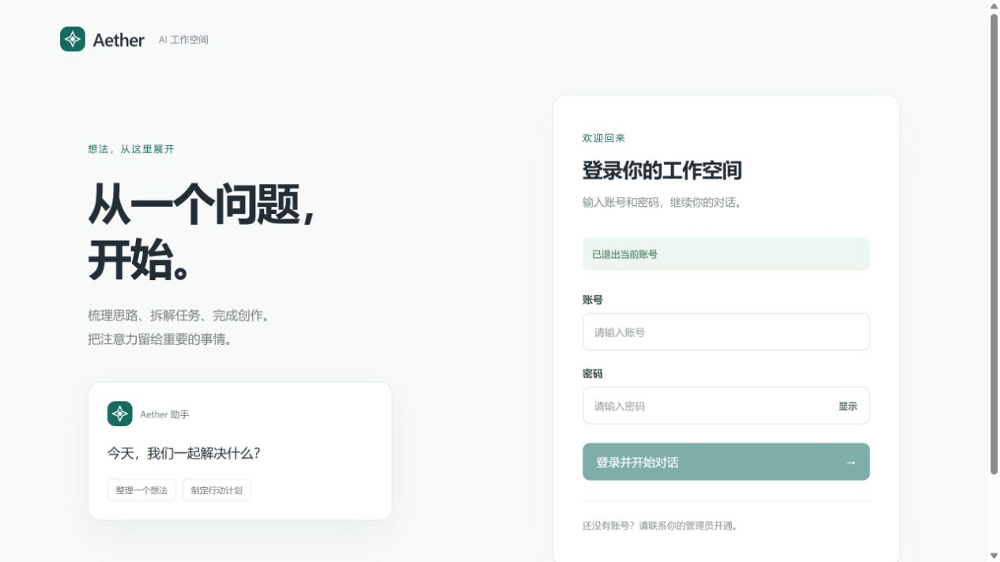
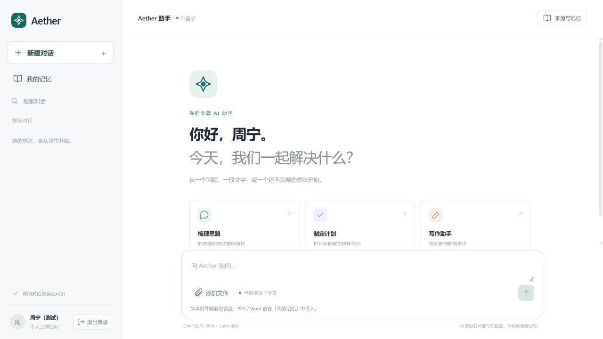

# Agent 登录与管理界面调整验收

日期：2026-10-05。适用范围：本机 Agent / Budibase 验收环境。

## 当前入口与行为

| 页面 | 地址 | 登录方式 |
|---|---|---|
| Agent | http://localhost:19010/ | 当前页面填写普通用户账号、密码，成功后原地进入对话 |
| Budibase 管理后台 | http://localhost:19000/app/default%20workspace/aether-admin | 独立登录，选择 Log in with Aether lab，使用平台或租户管理员 |

管理工作空间中转页、P3 运维控制台及其专属适配器已删除。Agent 页面不再显示管理中心或运维入口，管理员账号不能登录普通用户 Agent。旧 `/management` 收藏仅兼容跳转到独立后台地址，不参与认证。

P3 原生服务、维护接口、用户记忆能力与数据库保留；本次没有调整 Azure 资源或部署镜像。

## 已执行的验收

| 编号 | 场景 | 结果 |
|---|---|---|
| UI-01 | 页面内登录、错误密码、管理员误用普通用户入口、禁用用户及租户 | 后端回归通过；浏览器普通用户登录成功，地址始终为 19010 |
| UI-02 | 同时以 user_a 使用 Agent、以 platform_admin 使用后台 | 通过；两端独立身份 |
| UI-03 | Agent 退出后后台刷新；后台退出后 Agent 刷新 | 双向通过 |
| UI-04 | A 草稿和 Markdown 附件 → 会话失效 → B 同页登录 | 修复前复现草稿残留；修复后草稿、附件、旧列表均清空，B 发送按钮禁用 |
| UI-05 | 后台按账号筛选 user_a2 | 仅返回对应用户；清除筛选可恢复列表 |
| UI-06 | 侧边面板修改并恢复 user_a2 姓名，随后打开 user_b | 保存成功并刷新列表；连续选择时字段正确，测试姓名已恢复 |
| UI-07 | 平台管理员与租户管理员权限边界 | 真实签名身份接口回归通过，跨租户伪造请求被拒绝，普通用户无管理权限 |
| UI-08 | 新登录方式访问真实 Azure P3 | 保存、读取、召回与来源正文检查通过；另一租户访问被拒绝 |
| UI-09 | 运维旧接口与混用身份的旧接口 | `/ops-api/status`、`/admin/users`、`/admin-api/users` 均返回 404 |

新版后台使用原生 Budibase 侧栏导航、数据卡片、账号/姓名/角色/租户/状态筛选、用户编辑侧边面板。不是独立 React 页面伪装为 Budibase；应用仍可在原生设计器编辑。开源版品牌标识保留。

## 自动化结果

- 平台回归：75 项通过、5 项跳过。跳过的是需独立启用的 Budibase/Keycloak 协议套件；本次真实登录与管理员权限测试已在其余通过项执行。
- 真实 Azure P3：另行执行 2 项保存、读取、召回、来源与隔离集成检查，通过。
- 前端：5 项附件与消息重试测试通过；生产前端构建成功。
- Ruff、BFF Mypy 与 Git 空白检查通过。

## 修复与边界

独立审查发现“同页换账号保留旧草稿”的问题，已通过按身份卸载工作区、取消旧异步请求修复，并完成修复前后浏览器复测。租户禁用提示与面板初始化空值问题也已修复。

额外通过浏览器发起的一条完整 LLM + P3 对话在本次收尾时仍处于等待状态，未计入通过项；上述 2 项真实 P3 集成检查已完成。

后台停留期间另观察到既有会话过期提示 `Session not authenticated`，需要从后台重新登录；本次没有完成后台自动续期功能。

这是本机验证版，BFF 重启或一小时会话到期后需要重新登录。完整账号生命周期仍未交付：租户创建维护、用户创建、重新启用、归属调整、角色分配不在当前界面可用范围内。没有将界面调整等同于整体产品验收或生产部署完成。

后台单点登录可继续使用上一次后台管理员身份；需要比较多个管理员时可使用独立浏览器会话。该行为与 Agent 的账号、密码和退出独立。

## 界面截图

