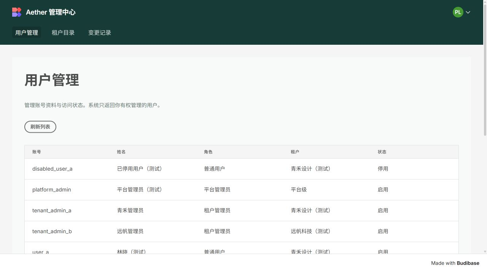

> 历史记录，已被本次独立登录方案替代。下文清除 Budibase Cookie 的方案已移除，请按 [当前使用说明](使用说明.md) 操作。

# 管理员登录修复说明

日期：2026-10-05。

## 原因与复现

`platform_admin` 的业务角色及 Budibase 应用授权正常，独立重新登录可读取全部 8 个测试账号。问题出在登录会话衔接：Agent 切换用户时没有清理浏览器里的 Budibase Cookie，后者仍可能使用先前普通用户的身份。

实际浏览器复现：先以 `user_a` 登录 Budibase，再在 Agent 切换为 `platform_admin`。Agent 显示“平台管理员”，管理后台仍显示 “You don't have permission to use this app”。另观察到过期后台令牌导致数据加载失败；这与缺少业务管理员角色是不同情况。

## 修复

- Agent 成功登录和退出时清除当前浏览器的旧 Budibase 认证 Cookie。
- 新增 [管理中心入口](http://localhost:19010/management)：先校验当前有效账号及管理员角色，再清除旧后台会话 Cookie并进入 Budibase 登录流程。
- Agent 中的“进入管理中心”、启动脚本状态输出及账号说明均改用新入口。
- 普通用户仍无法通过管理入口或管理 API 获取管理员权限；没有修改账号角色或扩大应用授权。

此实现针对当前本机 localhost 同域不同端口环境，清除浏览器 Cookie 不等于撤销其他设备上的服务端会话。

## 验证

- 修复前新增的会话切换与管理员入口测试均失败；修复后登录、退出及签名身份校验共 22 项测试通过。
- 真实后台查询：平台管理员可见 8 个账号，青禾管理员 4 个，远帆管理员 2 个；普通用户被拒绝。
- 真实浏览器沿原失败路径重新验证：平台管理员登录 Agent，点击管理中心并选择 Log in with Aether lab，成功显示全部 8 个测试账号。
- Ruff 和 Git 空白检查通过。重启本机 BFF 后入口返回 HTTP 200；Azure P3、身份和数据库容器保持运行。

