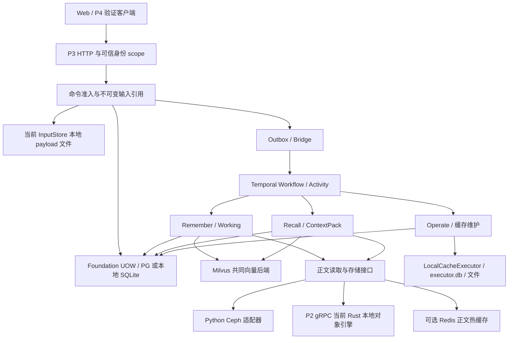

# P3 Temporal 集成后全量变更、系统衔接与 Azure 部署评估

审查日期：2026-10-02（北京时间）。源码范围：Temporal 合并基线至当前本地 HEAD，另审查本地未提交业务改动；云端范围：实际 AKS 集群及其现有 PG、Redis、Milvus、Ceph、网关和持久卷。Git 在报告整理时重新 fetch：当前分支已包含远端最新提交，没有待同步的上游提交。

**结论：各模块已有共同的 Temporal 执行与事务基础，但系统尚未达到完整联调和持续服务验收；满足共享输入、持久执行状态、版本迁移、Worker 恢复等条件后可以分布式部署，当前交付形态仍是单实例 P3 加独立依赖，不能直接扩成多副本高可用。**

建议沿用东南亚的现有 AKS、PG、Redis、Milvus、Ceph，先完成固定后端与持久状态适配，再做真实依赖联调及故障恢复验收。无需为了当前问题新建一台承载所有资源的 VM，也没有证据要求重建 Ceph 集群。

本阶段完成代码审查、隔离环境测试和 Azure 只读取证；没有修改业务源码、运行配置、Azure 资源、仓库规则或职责，没有发布镜像。新增本报告、未提交修改清单及交付入口。原始日志、脚本、凭据和测试环境保留在项目外工作区，不随报告公开。

## 一、提交改动汇总

### 1.1 审查基线与当前版本

| 项目 | 核实结果 |
|---|---|
| 仓库 | csdnk/Ather-AIAgent；本地 E:/projects/codex/aether，业务代码 AgentJYS-main |
| 当前分支 | codex/project-workspace；跟踪 origin/codex/project-workspace |
| Temporal 功能分支 | codex/p3-temporal-migration；原始实现 38f49b395a63ca7f69e27974785c471be996374e，功能分支头 41a96c0817fb9e989247cebe5ed65001facdf0e6 |
| 上一次 Temporal 合并 | PR #11；合并提交 **db81fe0c209885f9a4f6cc6d5f7feb37487d7d3d**；2026-09-30 21:45:42 +08:00 |
| 远端最新合并 | PR #15；**baeee954ebbeacf0ec58e279f8222baccf9a109f**；2026-10-02 17:20:32 +08:00 |
| 当前本地 HEAD | **a106f8383c4b7dc03a8e505f8cff9e1280dfe678**；2026-10-02 17:33:02 +08:00 |
| 同步关系 | 本地 ahead 4、behind 0；额外 4 个是两次环境设计提交与两次本地合并提交 |
| 云端实际版本 | P3 镜像标签 demo-db81fe0c2098-cadence-2d66c573；Web 标签 demo-db81fe0c2098。仍是 Temporal 基线附近的演示版本，不能用来证明 #12—#15 已上线 |

基线通过 Git 提交拓扑与 PR #11 元数据交叉核对。以下是基线之后全部 **16 个提交**，按提交者时间排序：10 个普通提交、6 个合并提交。合并行用于说明进入目标分支的时间，不将相同功能再次计为新增实现。

### 1.2 全量时间线

| 北京时间 | 提交 | 改了什么及前后变化 | 涉及模块、接口、配置、结构或部署 |
|---|---|---|---|
| 10-01 12:36:02 | 022d00d | 从直接按配置连接 Milvus，改为核验已有集合字段、维度、索引等契约；串行化本地写；Working 与 generation 使用共同后端 | Recall 配置、vector_backend、Working provider 接线与测试；不等于跨进程写锁 |
| 10-01 12:46:28 | ddbd11d | 从排队前授权一次，改为队列等待后、实际 SDK 写入前再次核验对象资格 | projection 与 Milvus 队列调用；减少授权撤销后仍写入的风险；保留最终业务授权 |
| 10-01 13:05:18 | 8c0d405 | 新增官方 Milvus Lite 本地启动器、配置、Working 原生验收脚本和测试 | 新 CLI、本地可选依赖与 JSON 配置；提供本地路线，不代表既有 Azure Milvus 联调通过 |
| 10-01 13:11:32 | 1f22b96 | 验收时的模型缓存从项目内移到外部工作区 | 验收工具及缓存路径；无业务接口或 Temporal 协议变化 |
| 10-01 13:56:41 | afa1f76 | 补 Working 向量与 Milvus 的流程图、运行指南、验收说明及架构入口 | 文档和可编辑图源；不增加运行能力 |
| 10-01 16:37:41 | 1567b4b | PR #12 合并上述五个提交 | 将 Working/Milvus 增量纳入目标分支 |
| 10-01 16:48:05 | a1b630d | 增加 P4 五场景 Web、真实 P3 调用客户端、scope/ref 校验与任务轮询；共享缓存样本增加 5 秒采样节奏 | P4 前后端、Processing/Task 客户端、验证脚本；也修改 Temporal 周期维护，具有跨负责人影响 |
| 10-01 20:18:16 | f17faa8 | PR #13 合并 P4 增量 | 增加演示与接口验证入口；不是云端 P4 部署 |
| 10-02 13:41:07 | 847dc19 | 引入 PostgreSQL foundation/log store 与元数据迁移、Python Ceph 适配器；完善 Remember 发生证据核验、压缩、摘要与检查点；分开 IO/model/index/ingress Activity、心跳、正文重放和周期状态缓存 | 事务后端、Remember policy/任务数据、上传与解析、Temporal 活动/Worker 接线及运行配置均改变；存在旧检查点兼容影响 |
| 10-02 13:57:57 | 51b8007 | 增加开发/测试环境切换与 AKS 存储接入设计 | **仅设计文档**；没有创建云资源、没有实现全部环境切换 |
| 10-02 13:58:16 | 32aa2ea | PR #14 合并 Remember/持久化增量 | 纳入 PG/Ceph 代码与任务协议变化 |
| 10-02 14:16:59 | 4984e40 | 修订设计为复用已有 Ceph，固定 PG/Redis/Milvus/Temporal，并要求去掉运行时 SQLite | **仅设计文档**；当前仍存在 SQLite 和本地权威输入，不能称要求已经落实 |
| 10-02 14:34:54 | 9d99216 | 本地合并 #14，并保留两次本地设计提交 | 合并拓扑变化；没有独立新增一套业务功能 |
| 10-02 16:59:27 | db2878e | 接入 JWT/Keycloak 组织成员、登录与账户操作；服务端租户 scope、Trace/OTLP/PG 日志、健康与失败清理；补生产模板、依赖、测试和 PG CI | 身份配置与前端、认证入口、日志/Trace 数据、PG provider 生命周期、部署模板和流水线改变 |
| 10-02 17:20:32 | baeee95 | PR #15 合并租户身份与日志追踪增量 | 当前远端最新；7 个 CI 作业成功，4 个失败，见证据表 |
| 10-02 17:33:02 | a106f83 | 本地合并 #15，继续保留本地设计 | 当前审查 HEAD；业务改动已包含，不表示已部署 |

### 1.3 按能力对照：做成了哪些事，还没有带来什么

| 能力 | 修改前 | 修改后 | 衔接评价 |
|---|---|---|---|
| Working 向量召回 | Working 与 generation 接线、集合契约核验不足 | 共同 Milvus backend，字段/索引校验，排队后再授权，本地 Lite 验收工具 | 基础方向一致；Azure Milvus 的自签名 TLS 和 SDK/服务端版本需实测 |
| P4 真实调用验证 | 缺五场景交互和自动证据展示 | 五场景、实际 memory/source/task/ref 校验与轮询 | 能捕获集成错误；短文档是否需要摘要的生产者/消费者假设不一致 |
| 持久化 | 主要是本地 SQLite、正文与执行缓存 | PG 可承载元数据/日志；有直接 Python→Ceph 适配 | 权威上传输入和执行 journal 仍在本地；Rust P2 的对象存储仍为 SQLite，本方案不能只换环境变量完成 |
| Remember 语义处理 | 较宽松的 event 合并与 provider 检查；旧检查点结构 | 发生证据、provider/rules 绑定与更细 Activity 进度、压缩/摘要边界 | 更保守的绑定保护了旧任务不被错误重跑，同时带来显式升级/迁移需求和旧测试冲突 |
| 身份/可观测性 | 本地身份与本地观测主导 | JWT 验签与服务端 scope、Keycloak 接线、PG logs/Trace、OTLP 与前端登录 | 本地单元/集成与 CI 有证据；Azure 真身份、Keycloak 会话、撤权和完整业务未验收 |
| 生产配置 | 旧模板缺 Temporal、显式 recall 与 PG 元数据段 | #15 模板已经补齐这些关键字段；PG/pymilvus/JWT/OTLP 成为基础依赖 | 旧“模板必然缺 Temporal”“PG 驱动只在 extra 中”的结论已过时；Ceph extra、密钥传递与固定后端约束仍有缺口 |

影响 Temporal 的主要是 a1b630d 的缓存采样，847dc19 的 Activity 分车道、心跳、任务/检查点绑定、输入与正文重放，以及 db2878e 的租户身份、PG UOW 与日志生命周期。#12 的 Milvus 修改不更换 Temporal 执行后端，但改变 Activity 实际调用与失败边界。51b8007/4984e40 没有运行代码变化。

### 1.4 未提交修改单列

审查开始前 Git 有 163 项状态入口：43 修改、67 删除、53 未跟踪入口；展开后 290 个路径，其中 223 个存在、67 个删除。业务代码仅两处未提交改动：

- [periodic.py](../../AgentJYS-main/src/aether_agent_memory/runtime/temporal/periodic.py)：增加 13 行，准备在提交缓存观测前再次检查采样节奏。
- [test_periodic_workflow.py](../../AgentJYS-main/tests/runtime/temporal/test_periodic_workflow.py)：增加 83 行跨 operator 测试；本次仍失败，不能称已验收或已合并。

其他本地状态是 README、设计/验收资料、文件迁移、删除和新交付文件。它们不是上面 16 个提交中的额外云端功能。本次没有提交或恢复这些文件，逐项路径见[未提交修改清单](P3_Temporal审查_未提交修改清单_20261002.md)。

### 1.5 提交完整哈希索引

| 短哈希 | 完整哈希 |
|---|---|
| 022d00d | 022d00d661e7cee2e5c40084a89be310ee7626ca |
| ddbd11d | ddbd11d3acfb5b42c2dbb163fefbcd307efd5ca4 |
| 8c0d405 | 8c0d405815155e01002c0accaba02ae8f72fd7ca |
| 1f22b96 | 1f22b96f88fcb9b8df9e21d4406def0dc7537170 |
| afa1f76 | afa1f76f0abe7b75f3da6a2f23fd8a1dbf46c9b5 |
| 1567b4b | 1567b4bedfb0771feb11a4e6881ebfd6c6279d28 |
| a1b630d | a1b630d064c9a5858feaa31b2966365595e6090f |
| f17faa8 | f17faa85551cb86b6553f52b93d0d13376b40ef1 |
| 847dc19 | 847dc196730eea431792f3d67db988bc96d4cab3 |
| 51b8007 | 51b800732dc683bc714da97f0ad5a8cd78f700aa |
| 32aa2ea | 32aa2ea15ab8b4f1c19610fbb3d5d322b3be0762 |
| 4984e40 | 4984e4079513442bb77c8b5940548e8793516b16 |
| 9d99216 | 9d99216c2762e2911e6fdf8efc7119b1ab83cae3 |
| db2878e | db2878eb4fa09398ce375e002af36abb656d773b |
| baeee95 | baeee954ebbeacf0ec58e279f8222baccf9a109f |
| a106f83 | a106f8383c4b7dc03a8e505f8cff9e1280dfe678 |

## 二、集成问题清单

### 2.1 当前调用链及已成立的基础

当前接口经过可信身份/scope 解析，进入统一命令准入与 Temporal；活动调用三流程，元数据经 foundation UOW。PG 已可作为元数据权威，但部分执行与输入持久化仍在本地。下面实线表示当前代码调用关系；Ceph 与 P2 为互斥配置入口。

下列基础已有实现和对应证据，不建议整体重写：

| 基础 | 已核实内容 | 证据与实际限度 |
|---|---|---|
| 统一执行 | Remember、Recall、Operate、事件、周期任务与缓存维护使用 Temporal；IO/model/index/ingress Activity 已接线 | E02 本地测试；是否跨实例读取相同输入仍受 F04 限制 |
| 准入与幂等 | 命令准入和意图落在共同事务；输入有不可变引用/hash；保留原始 job/workflow/run；完成任务 tombstone 阻止错误重启 | E02、E03；重复请求应查原 operation，不能超时后盲目另发新任务 |
| 重试与最终核验 | Outbox/inbox、epoch fence/CAS、提交前身份/版本/source 复核、有限重试；未知副作用回查原操作 | 本地受控 provider 验证；没有真实全后端故障与模糊提交验收 |
| 本地中断恢复 | 当前源码 6 项真实子进程中断/重启用例通过，其中 T10 重启 Temporal | E03；同一持久业务目录、固定 provider、真实开发 Temporal；不代表 PG/Ceph/多副本恢复 |
| Milvus 资格 | 集合 shape/index 契约，队列等待后再授权，投影前后绑定核验 | E02；真实 Azure 集合与 TLS 尚未完成应用级验证 |
| PG UOW | 原生 UOW 保留 commit hook、CAS、execution guard；事务内 advisory lock 串行化遵守同协议的进程，不在模糊 commit 后盲重放 | E01、E08；保守的并发正确性基础，不等于已验证吞吐与多写入者恢复 |
| 身份与观测 | JWT issuer/key/signature/claims、服务端 scope、租户和身份 epoch；Trace ID、敏感信息过滤、provider 初始化失败清理 | E02/E08；Keycloak 浏览器、真实 Azure 撤权和跨租户业务待验收 |
| 新生产模板 | #15 已补 Temporal、recall 文件与 metadata_backend=postgresql；PG/日志健康使用实际 provider | E05/E08；模板变量和外部文件仍须提供，Ceph 镜像与固定后端约束未补齐 |

### 2.2 优先级与分类

P0 表示在带存量任务升级/切换权威存储前必须关闭的阻断，P1 表示在真实服务发布前必须处理的业务或运维问题，P2 表示阶段性改进或上线范围触发的问题。是否必须以“固定 PG/Redis/Milvus/Ceph、长期提供服务、后续分布式”这一目标为准。

| 编号 | 优先级与是否必须 | 分类 / 处理方式 | 结论及影响 | 主要证据 |
|---|---|---|---|---|
| F01 | P1 必须 | 代码与消费者契约 / 联合修复 | Remember 短文档不建摘要，P4 和旧 demo 仍强制找摘要；实际业务故事失败且报错误导 | E02；summaries:64、demo/execution:203/220 |
| F02 | P0，存量任务升级时必须 | 兼容/迁移缺口 / 代码加运行方案 | 重构后旧检查点 fingerprint 全部冲突，旧任务不能直接接着跑 | E04：7 类旧格式全为 VERSION_CONFLICT；无副作用 |
| F03 | P1 必须 | 运行恢复代码与探针 / 代码加部署 | Worker 退出后 readiness 失败但不重建；liveness 仍 200，现有 K8s 探针不会因此重启 | E06：同一 WorkerHost 连续 refresh 未恢复 |
| F04 | P0，固定后端切换和分布式前必须 | 持久状态实现 / 代码、迁移与部署 | 即使元数据用 PG，上传输入、Operate executor.db/receipt/文件仍在本地；不能仅调副本或拆 API/Worker | E01：host:202、executor:67、ingress:78/126 |
| F05 | P1 必须 | 配置约束与环境隔离 / 代码加配置 | 只有 local/production；允许 file Milvus、HTTP Ceph、不配 Redis；Redis key 缺环境前缀 | E05；设计中的固定后端与隔离未落实 |
| F06 | P1，原 P2→Ceph 方案必须 | 跨模块权威存储缺口 / P2 协调与代码 | Python 可直连 Ceph，但 Rust P2 仍 LocalObjectEngine SQLite；不能据此称原 P2/Ceph 架构打通 | E01：application:120、ae-server main:15、ae-grpc:33 |
| F07 | P1 必须 | 镜像/启动/配置缺失 / 构建和部署调整 | P3 Dockerfile 未装 Ceph extra；Compose 缺存储密钥传递，旧入口含 legacy API/Celery | E01：Dockerfile.p3:8、compose.p3、旧 compose/app |
| F08 | P1，公开 P4 服务时必须 | P4 状态与公网鉴权 / 代码加网关 | P4 run/session 存内存，重启丢失且只接受本地 Origin/Host；Azure 无 P4 backend 路由 | E01/E09；不能通过伪造本地请求头直接公开 |
| F09 | P1 必须 | 依赖就绪、监控、备份缺口 / 代码或部署 | readyz 范围窄；PG snapshot/restore 未实现；未有 PG/Ceph/Temporal/Milvus 一致恢复与长稳证明 | E01/E09/E10；当前 Temporal 还是 SQLite dev Server |
| F10 | P1，多副本前必须 | 跨实例协调 / 代码、配置和并发验收 | 并发限额是进程级、Worker ID 会覆盖、Milvus 首次建集合锁在进程内；PG 全局锁可能瓶颈 | E01；现有幂等 fence 应保留，不可用随机 ID 绕开 |
| F11 | P1 必须 | 回归/类型/CI 配套缺口 / 测试与流水线修复 | 当前 8 项本地未通过，#15 4 作业失败；部分旧测试在前置绑定处退出，实际竞态没有测到 | E02/E08；不能只改断言降标准使其变绿 |
| F12 | P1，真实模型/云资源验收必须 | 尚未验证 / 真实联调与故障实验 | 真实 PG/Ceph/Milvus/JWT/模型、物理删除、重启/滚动/长期运行尚无共同闭环 | E09/E10；Milvus 服务端 3.0.1 与 Python 依赖 <3 版本不同，兼容性要单独验证 |

### 2.3 关键问题的触发、建议与验收条件

**F01：短文档摘要生产与消费冲突。** [WorkingSummaries.needed](../../AgentJYS-main/src/aether_agent_memory/remember/basic/summaries.py:60) 依据解析后 UTF-8 正文长度判断，默认门槛 65536 bytes；“是附件”不再自动表示需要摘要。P4 [finish_summary](../../AgentJYS-main/src/aether_p4_simulator/demo/execution.py:208) 仍要求恰好一个 remember.summarize，否则 [reject_scope](../../AgentJYS-main/src/aether_p4_simulator/demo/execution.py:220)。本次 library-full 和 [summary demo](../../AgentJYS-main/scripts/p3/demo_remember_summary.py:198) 两项真实本地执行失败。建议明确 summary 为可选处理结果，短文档继续走保存/投影、长文档跟踪摘要任务，报错区分“摘要未要求”与“来源/scope 不合法”；最终策略由 Remember 与 P4 原负责人确认。验证应覆盖门槛两侧、附件解析后长度、纠正/删除时摘要版本，以及实际 HTTP/任务/result 对照。

**F02：旧检查点升级阻断。** [checkpoint_binding](../../AgentJYS-main/src/aether_agent_memory/remember/basic/pipeline.py:1351) 的规则/provider/kind 绑定与旧版本不同，[Temporal background](../../AgentJYS-main/src/aether_agent_memory/remember/basic/temporal_background.py:40) 发现不匹配后保守返回 VERSION_CONFLICT。本次从 #13 格式重构 project/cleanup/extract/distill/compress/summarize/revalidate 七类任务，全部 attention_required/no_effect；当前格式对照成功。说明安全拒绝机制成立，但升级兼容尚未完成。[migrate_remember_postgres.py](../../AgentJYS-main/scripts/p3/migrate_remember_postgres.py) 是元数据迁移，不能替代任务规则、正文、向量、模型和身份版本迁移。应在停止旧服务自动重启后先 inspect，排空可完成任务；确需迁移时保留 operation/workflow/input/ref/身份与副作用记录，提供显式兼容转换和回滚。验收要用旧格式任务在各阶段中断，再升级继续执行，证明同一任务只有一次业务作用；不能删除 fence 或批量重开新任务掩盖冲突。

**F03：Worker 不会因自身退出而恢复。** [service.refresh](../../AgentJYS-main/src/aether_agent_memory/runtime/temporal/service.py:173) 检查 runner.done，但异常分支只禁用准入和标为 unavailable，没有清理/重建 workers 与 client。E06 主动停止测试自有 Worker，HTTP 仍存活；连续两次 refresh 保留同一 host，/p3/live=200、/p3/readyz=503。建议可控重建 WorkerHost，或 Worker 内部不可恢复失败时让进程退出，交给容器监督；外部 PG/Temporal 短时故障应退避、暂停接单，避免无限重启。验收分别注入内部 Worker 退出和外部网络中断，检查无新准入、旧任务不复制、恢复可见、恢复时间可测，并验证 SIGTERM 与宽限期。

**F04：PG 元数据不等于所有业务状态共享。** [host.py](../../AgentJYS-main/src/aether_agent_memory/runtime/flows/host.py:202) 固定创建 LocalCacheExecutor；[executor.py](../../AgentJYS-main/src/aether_agent_memory/operate/basic/executor.py:67) 仍使用 executor.db 和本地 action/receipt 文件。[InputStore](../../AgentJYS-main/src/aether_agent_memory/runtime/temporal/ingress.py:32) 仅将输入 hash、长度、引用写入 UOW，payload 在 [本地 root/digest](../../AgentJYS-main/src/aether_agent_memory/runtime/temporal/ingress.py:78)，另一 Worker 从 PG 看到引用仍无法 [read_bytes](../../AgentJYS-main/src/aether_agent_memory/runtime/temporal/ingress.py:126)。[DirectoryLock](../../AgentJYS-main/src/aether_agent_memory/runtime/flows/application.py:44) 保留目录独占。多副本只用 PG 共享元数据，仍可能接到另一实例无法读取的任务输入。建议将命令/上传输入和权威正文放 Ceph、执行 journal/receipt/CAS 在 PG，Redis 只做可丢弃热缓存；本地模型缓存、下载临时文件可以保留，但不得成为重放唯一数据源。验收应让 API A 准入、Worker B 执行并重启 B/C，删除本地缓存后仍恢复相同输入与副作用；按用户固定后端要求扫描运行路径，禁止残留权威 SQLite。

**F05：环境选择和后端约束不完整。** [ServiceConfiguration](../../AgentJYS-main/src/aether_agent_memory/runtime/flows/config.py:204) 支持部分路径/端点切换，production 已要求 PG、native embedding 和模型，但 Milvus 只检查 URI 存在；E05 文件型 Lite URI、HTTP Ceph、Redis 缺省都被接受。必须将 dev/test/Azure 的非敏感配置和 Secret 分开，使用独立 PG DB/角色、Ceph bucket/前缀、Milvus collection/database、Temporal namespace/deployment、Redis 前缀或独立实例。Redis [keys](../../AgentJYS-main/src/aether_agent_memory/remember/basic/content.py:50) 当前只有 scope/hash，应补环境区分；若共用同 scope/摘要，同一缓存/配额可能交叉。51b8007/4984e40 是目标设计，代码没有自动实现三套 profile。验收两环境使用相同用户/task/source 标识，写入、召回、删除、维护和日志都互不影响；错误配置启动必须失败并明确提示。

**F06：Ceph 接入有两条入口，原权威 P2 尚未切换。** [application.py](../../AgentJYS-main/src/aether_agent_memory/runtime/flows/application.py:120) 在 ceph 配置存在时直接注入 Python CephP2，否则用 P2 gRPC；配置两者同时出现会拒绝。直接 adapter 有不可覆盖写、hash/range/读取限制与环境凭据，本次代码测试可证这些规则，但没有真实 RGW 写验收。[Rust HTTP 服务](../../AgentJYS-main/engine/services/ae-server/src/main.rs:15) 和 [Rust gRPC 服务](../../AgentJYS-main/engine/services/ae-server/src/bin/ae-grpc.rs:33) 仍创建 new_with_sqlite。本用户保留原 P2→Ceph 方案时，应协调 P2 原负责人补远端对象引擎，验证 P2 契约、版本/授权与 Ceph range/delete/retry；Python 直连可做阶段性验证，但不能替代原方案落地证明。现有 Milvus 底层对象存储用 Azure Blob，应用正文用 Ceph 是另一个层级；若要求所有对象存储都用 Ceph，Milvus 基础设施迁移需另列方案与验收。

**F07：代码与发布入口还没有形成唯一受支持的运行路径。** [Dockerfile.p3](../../AgentJYS-main/Dockerfile.p3:8) 安装 embedding-onnx/resource-documents，未安装 remember-ceph（boto3），选择 Python Ceph 后会缺依赖；PG 驱动与 pymilvus 已在基础依赖，不能沿用旧的驱动缺失判断。[compose.p3.yaml](../../AgentJYS-main/compose.p3.yaml) 使用新 serve，但只传递 LLM 等有限环境，没有完整 PG/Redis/Milvus/Ceph Secret 映射。旧 [compose.yaml](../../AgentJYS-main/compose.yaml:85) 调 aether_agent_memory.app 并包含 B1/B2/Celery；[app.py](../../AgentJYS-main/src/aether_agent_memory/app.py) 依赖 AETHER_SERVICE_CONFIG 才转向新的 flows host。需要确认唯一支持入口、镜像 extra、Secret/配置文件挂载和退出规则，避免新旧调度同时处理相同资源；不据此擅自删除其他模块。验收使用最终镜像与最终 manifests 起服务，逐项检查实际 provider，不以主机 venv 可运行代替镜像验证。

**F08：P4 演示不能原样公开或多副本。** [demo/service.py](../../AgentJYS-main/src/aether_p4_simulator/demo/service.py:34) 的 _runs 内存字典、单线程队列及最多 10 runs；通用 [P4 service](../../AgentJYS-main/src/aether_p4_simulator/service.py) 的 session/agent 字典重启丢失。[demo/http.py](../../AgentJYS-main/src/aether_p4_simulator/demo/http.py:41) 是本地 loopback/Host/Origin 防护，不能拿网关伪造本地头代替用户鉴权。前端 [api.ts](../../AgentJYS-main/web/src/demo/api.ts:3) 调 /p4-api/api/v1/demo，当前 Azure 网关只代理 /p3，未部署 P4 backend；/api/v1/demo/scenarios 返回 SPA HTML 也不能称 API 可用。建议明确 P4 只作内部验收客户端，或提供授权公网入口和共享 runs/session/task 引用；验收浏览器真实登录、scope 绑定、刷新/重启恢复、跨副本轮询及故障诊断。Processing/Task 客户端还漏用 artifact、recovery、candidate_rejections、physical_erasure、rejected_candidate_count、source_retention、sources 和 terminal_reason；应根据场景解释这些状态，避免“saved/HTTP200”直接判完成。

**F09：健康与恢复链条仍缺完整部署证据。** [readyz](../../AgentJYS-main/src/aether_agent_memory/runtime/flows/http.py:199) 主要判断 Temporal/Worker/identity 与准入；完整 /health 的 provider 探针是诊断，不等于所有依赖故障都已进 readiness 门禁。PG [snapshot](../../AgentJYS-main/src/aether_agent_memory/runtime/foundation/lifecycle.py:124) 与 [restore](../../AgentJYS-main/src/aether_agent_memory/runtime/foundation/lifecycle.py:185) 明确拒绝当前 PG 路线，应采用并实测 pg_dump/PITR 或经审查的备份流程，并考虑 Ceph/Temporal/Milvus/identity/schema/checkpoint 的一致恢复。云端 Temporal CLI start-dev+SQLite 不适合目标长期生产负载；应部署生产 Temporal Server 的 persistence/visibility 存储、迁移工具与监控，数据库可先复用既有 PG 新建隔离 DB，但须核对所选 Temporal 版本对 PG17 的支持，应用 PG CI 不能替代此核对。验收包括依赖故障拒接/降级、告警、全链 trace、日志保留、备份恢复、RPO/RTO 与压测/长稳；HA 另设准入。

**F10：跨实例配额与协调未验收。** [ExecutionLimits](../../AgentJYS-main/src/aether_agent_memory/runtime/temporal/locking.py:47) 是每进程 asyncio 限额，副本翻倍会放大同租户并发；[Worker 心跳 ID](../../AgentJYS-main/src/aether_agent_memory/runtime/temporal/service.py:207) 仅含 deployment/class，多实例会覆盖同一记录，影响存活判断与取证。PG [advisory lock](../../AgentJYS-main/src/aether_agent_memory/runtime/foundation/postgres.py:245) 为全局串行事务，对协作进程有保护但吞吐与锁等待未知；Milvus 初建集合锁也不能跨进程。固定周期 workflow/deployment ID 已有去重，仍要统一 namespace、实例唯一 ID、全局限额/初始化策略及维护对象归属。验收多写入者同 operation、不同租户、撤权、锁超时、队列重投、双 Worker 与滚动升级；既测正确性也测锁等待与延迟。

**F11：回归失败要按触发层拆开。** 除短文档两项外，4 项旧并发/摘要/恢复用例在任务准入后替换 provider，触发新 checkpoint VERSION_CONFLICT，实际竞态回调未进入；不能据此证明纠正/删除竞态已失效，也不能称它们已被覆盖。另一 event 合并用例仍仅按 event key 假设同一发生，而新规则要求 occurrence 证据，应由原负责人确定业务契约。未提交跨 operator 采样测试则在 1 秒后要求第二 operator 已读 shared cache，和已提交的 5 秒采样限制不一致。本次没有改实现/断言，保留失败。建议测试在准入前固定 provider，再构造真实并发边界；确需动态 provider 升级则编写显式升级场景。远端 mypy、环境依赖安装与 recovery harness 问题也应修复并重跑实际 SHA 门禁。

**F12：剩余项为未验证，不能当作自动通过。** AKS→PG/Redis/Milvus 的 DNS/TCP/TLS 与 Ceph 当前健康，仅是连通性/运维快照。本次未往共享 Azure PG/Ceph/Milvus 写业务数据，未做实际 JWT/Keycloak 多身份、物理擦除、依赖 failover、跨 Pod/节点恢复、原生模型与 LLM 质量、持续压测及长期值守。当前 PyMilvus 依赖 >=2.5,<3，既有 Milvus 3.0.1；应核对官方 SDK 版本建议并使用实际镜像验证 create/index/insert/search/delete 与 schema，不根据版本不同直接断言不兼容。必须用授权隔离空间进行真实闭环，模型相关性与业务正确性单列，不将 HTTP200、ContextPack 存在或 task completed 作为正确回答的替代。

### 2.4 本次验证与远端 CI 的准确结果

| 证据编号 | 层次 | 本次结果 | 能证明 / 不能证明 |
|---|---|---|---|
| E01 | 静态审查 | 完整提交拓扑、配置/调用/存储/锁/入口、dirty 清单与行号核验 | 实现接线及限制；不证明真实依赖行为 |
| E02 | 当前源码隔离测试 | **208 个不同用例：199 通过、8 失败、0 errors、1 跳过**；同用例有针对性重跑时保留最新有效结果，不累计重复次数 | 本地 Temporal/身份/PG 接线等规则；大部分 provider 受控、业务存储 SQLite，不是全量回归或云端业务验收 |
| E03 | 本地真实进程恢复 | **T02/T04/T05/T07/T09/T10 共 6/6 通过**，已包含在 E02 的 199 中 | 真正停止子进程和 T10 Temporal 重启、原任务/输入与一次业务作用；同目录、固定 provider，未覆盖真实 PG/Ceph 多副本 |
| E04 | 旧格式升级实验 | **7/7** 旧类任务拒绝，VERSION_CONFLICT、attention_required/no_effect；当前格式对照成功 | 明确升级阻断且未错误执行；没有证明存量迁移已实现 |
| E05 | 配置与 TLS 参数实验 | production 接受 file Milvus/HTTP Ceph/不配 Redis；CA/server_name/secure 新字段均 extra_forbidden | 固定后端/信任配置缺口；未成功连接真实 Milvus 业务 |
| E06 | Worker 退出实验 | live 200、readyz 503，连续刷新不重建 Worker | 当前自恢复缺口；不是长期故障测试 |
| E07 | 工作区保护 | 报告生成前 290 个原路径 hash/存在状态一致、Git 状态与 HEAD 一致；生成后仅允许新报告和入口变化 | 本阶段未改源码/运行配置；未做提交、发布和云资源变更 |
| E08 | GitHub #15 当前合并 SHA | contracts/web/foundation/postgres/adapter/rust/unit 成功；**python/flows/recovery/p3-gate 失败** | 实际合并 SHA 的 CI；不代表绿色门禁或生产验收 |
| E09 | Azure 只读现场 | 正确集群/资源/Pod/配置/探针/网络/证书/Ceph 指标，见第三区域表 | 当前运行版本与可达性；没有存储业务写入/故障实验 |
| E10 | 生产/HA 边界核对 | 对照当前 manifests 与官方生产、探针、TLS、peering 文档 | 部署条件评估；长稳、多副本与恢复演练未执行 |

E02 的 8 项失败按用例保留如下，不能把同一次原因造成的多个失败当成多个独立根因：

| 用例 | 状态与已确定原因 |
|---|---|
| test_periodic_cache_sampling_keeps_signal_cadence_across_operators | 失败；本地未提交测试，在 1 秒要求缓存检查，受 5 秒既有采样门槛限制 |
| test_fixed_story_real_results[library-full-passed-required_calls0] | 失败；P4 短附件仍强制摘要，scope 错误报告误导 |
| test_concurrent_create_detects_space_change_and_reuses_fact | 失败；准入后换 provider，checkpoint 绑定冲突 |
| test_same_event_addition_produces_new_version_not_new_event | 失败；旧 event-key 假设与新 occurrence 核验策略冲突 |
| test_correction_while_summary_runs_cannot_overwrite_new_source | 失败；准入后换 provider，未进入待测实际竞态 |
| test_delete_during_summary_prevents_publication | 失败；同样未进入实际删除竞态，不能称已验证 |
| test_interrupted_extraction_is_recovered_after_restart | 失败；重启时换 provider 导致版本冲突；与 E03 固定 provider 的 6 项恢复通过应分开 |
| test_summary_demo_runs_through_temporal_commands | 失败；短文档没有摘要，旧脚本读取 None |

跳过项是 Windows 的可选真实 Milvus Lite 创建/重开集合测试。其余本地测试中使用 stub 的 Milvus 路径不能替代它，更不能替代 Azure Milvus。初次运行还遇到 Windows 超长临时目录和子进程缺 OTLP 依赖；缩短项目外测试路径、补完整隔离环境后对应重跑通过，已保留原失败日志，但不计为最终代码缺陷。

远端 #15 的失败细节：python 在 mypy 6 项错误停止（local_milvus 的 Windows 动态接口 typing、documents 的 pypdf/lxml typing、summaries 的 Any→bool），未到主 pytest；flows 350 通过/13 失败/7 跳过，其中 8 项缺 pymilvus 的 job 安装路径问题、5 项契约/provider/摘要问题；p3-gate 的 flow 子套件 358 通过/5 失败/7 跳过并有摘要类型检查失败；recovery 145 通过/2 失败，分别是旧摘要 demo 与开发 Server owner restart harness（后者根因未闭环）。这些套件重叠，不与 E02 相加。postgres 作业 **5 通过**，使用 runner-local 真 PostgreSQL17，覆盖租户/log/trace/重启与缺 DSN；不是现有 Azure PG 的完整三流程恢复测试。PR #15 的正式 review 数为 0，本阶段仅记录状态，不推测批准来源、不修改仓库权限。

## 三、Azure 适配方案

### 3.1 实际目标资源与现场状态

账户 NUIST-RnD，订阅 c50c3827-2bb7-43bd-a2e9-76137e2a180e。通过 Kubernetes clusterResourceId 确认本次目标是 **aetherstore-p3 / aks / Southeast Asia**。nuist-20260806 / aks-nuist-dev 是 East US 的另一套集群，不能将其配置或网络当成本项目环境。

| 组件 | 现有资源与实际状态 | 从当前 P3 Pod 的只读验证 | 复用结论与尚缺内容 |
|---|---|---|---|
| AKS | Standard tier；3×Standard_D8ads_v5，每节点 8vCPU/32Gi；Workload Identity 已启用，节点池未配置可用区 | 采样 CPU 约 5%/1%/1%，内存约 7%/6%/6%；瞬时有余量 | 复用；不因控制平面 Standard 自动认定应用 HA；没有真实模型负载容量基准 |
| P3 | aether-p3-demo，1 replica、Recreate、20Gi RWO managed-csi PVC；旧基线镜像 | /p3/live 和 /p3/readyz 200；health 明确 production_acceptance=false | 仅演示服务，必须构建当前提交并替换本地 provider；本次未发布 |
| Temporal | CLI 1.9.1 start-dev，SQLite db，1 replica、Recreate、20Gi RWO PVC | 当前 Ready；与 P3 在同一节点 | 保留迁移证据；长期服务应换生产 Server+persistence，不能直接调成多副本 |
| Web/UI/网关 | Web、Temporal UI、Caddy 各1 replica；公网可信 HTTPS 已有 | 根页面 200、未授权 health 401、维护入口404 | 复用公开 Web/P3 入口；当前没有 P4 backend 路由，Caddy 证书卷与单副本也是 HA 边界 |
| PostgreSQL | postgresp3，PG17、GeneralPurpose D4ds_v5、128Gi；私网10.64.2.5；公网关闭；备份14天，HA/geo backup/autogrow关闭 | DNS 与 TCP5432 可通；未连接共享库写业务或执行迁移 | 复用服务器，建独立 DB/角色；补 SSL 验证、容量告警、备份恢复；HA 视目标启用 |
| Redis | redisp3，Premium P1；私网10.64.2.6；TLS6380，公网关闭 | TCP 可通，TLS1.3与证书验证通过，匿名 PING 要求认证 | 复用；补 rediss 凭据、环境 key 隔离、配额/淘汰策略验收；未测真实 pipeline/失效恢复 |
| Milvus | 现有 v3.0.1 集群；datanode/mixcoord/proxy/querynode/streamingnode各2、etcd3；集群服务 milvus.milvus.svc.cluster.local，私网LB10.224.0.7、milvus.internal | TCP19530可通；配置 authorization=true、tlsMode=1；19530/19531默认信任失败：自签名证书 | 复用；补 CA/服务名/安全连接配置并验 SDK，初始化隔离 collection 与索引；有多 Pod 不代表 P3 joint HA 验收 |
| Ceph | Ceph-Cluster，3×D4s_v3，分别位于zone1/2/3；每台128Gi OSD；私网172.16.10.4/.5/.6 | 私网8080均超时；公网节点1/2的8080返回 RGW200，节点3不开放该端口 | 复用集群；建立 AKS→Ceph 私网/TLS稳定入口，授权bucket/user，再做真实写读删恢复 |
| Ceph 当前健康 | RGW节点1的9283只读指标：health=0，OSD up/in=3，245 PG clean，degraded/incomplete/inconsistent/undersized=0；raw约384Gi、已用约3Gi | 当前监控快照正常，未做故障/副本丢失/恢复演练 | 384Gi 是 raw 容量，不是经复制/配额计算后的可用正文容量；不能当作可靠性验收 |

旧云端 capabilities 明确为 profile=local、embedding=lexical、semantic=literal_baseline、object_storage=local_sqlite、executor=local_filesystem_cache、scheduling=temporal_v1。没有 PG/Redis/Milvus/Ceph/LLM 的业务配置。因此“云里已经有这些资源”与“应用已经用到”是两个独立事实；当前 cloud health available 不能证明固定后端目标完成。Pod 当前0重启也只是存活快照，不表示跑过长期真实工作负载。

### 3.2 Ceph：现有集群可用，优先补私网连接

现有 AKS VNet aks-vnet-23918361 为 10.224.0.0/12，已与存储 VNet 10.64.0.0/16 Connected，PG/Redis 私网 DNS 链接也存在。Ceph 所在 network-SoutheastAsia 为 172.16.0.0/16，没有到上述网络的 peering。地址不重叠，适合评审后增加 AKS↔Ceph 的定向 peering 与必要 NSG/路由/DNS；不应假设现有 AKS↔存储 peering 会自动转发到 Ceph。

Ceph 公网节点1 20.191.146.177:8080、节点2 172.188.34.47:8080 在本次现场可达。此前按7480探测得到的“Ceph不能使用”结论已被正确8080端口证据更新。现在的准确判断是：**集群和 RGW 存在且目前健康，公网技术上可连，私网暂未连通，应用授权与持久业务仍待验证。**

面向持续服务，优先使用私网稳定域名/入口与 TLS，使用专用 bucket 和最小权限用户，并把读写删除、条件写、range、重试/模糊副作用和故障恢复纳入验收。现有 NSG 对部分8080、dashboard、metrics和SSH使用公网任意来源，应在复用前核对实际管理来源并收紧。未签名 root 返回空 ListAllMyBucketsResult 不足以证明匿名可读写；本次没有尝试匿名写入，也没有枚举/泄露凭据。

公网也可以作为批准后的阶段性联调入口，但需要可信TLS、源地址控制、稳定入口、凭据保护与相同业务验收；不能将现有裸 HTTP200 直接当成正式接入配置。不建议为网络连通问题另建 Ceph：会增加 VM/OSD、数据迁移、运维及可靠性验证成本，且不会消除 P3/P2 代码缺口。

### 3.3 最小复用路线与配置/代码的分界

选择同一 AKS；Web/网关继续复用，按隔离环境准备配置和 Secret；PG 承载元数据与执行 journal，Ceph 承载权威正文及输入，Redis 承载可丢弃缓存，Milvus 承载语义向量，Temporal 承载持久编排。应用身份与模型依赖独立配置。阶段一可以保持一套 P3 API+Worker，先验收固定后端、恢复与发布；实现共享状态和协调后再拆服务或增加副本。

| 配置对象 | 可以配置切换的现有入口 | 必须代码/部署补齐的部分 | 验证方式 |
|---|---|---|---|
| 服务入口 | serve --config、AETHER_SERVICE_CONFIG；不同配置文件的 host/port/data_dir/identity_file | 唯一支持启动方式、镜像及 manifest 对齐；保持原任务部署身份，不随意换 deployment ID | 用最终镜像启动、读 capabilities、确认只一套执行入口 |
| PG | metadata_backend=postgresql；postgres_dsn_env=AETHER_POSTGRES_DSN；Secret 注入 DSN，使用 FQDN和 sslmode=verify-full | executor journal/receipt 仍需 PG 实现；输入不因该开关自动共享；Temporal 持久库另建隔离 DB并校验版本支持 | 真实事务/CAS、未知 commit、重启、锁并发、备份恢复；无 SQLite 权威路径 |
| Redis | redis_url_env 指向 Secret 中的 rediss 连接，FQDN:6380、认证与TLS | 环境前缀/空间隔离，缓存准入/配额/失效，compose/AKS Secret 传递 | 写读、Lua/pipeline、删除、容量/TTL、断链回源；不把 Redis 当永久唯一正文 |
| Milvus | recall_config JSON 的 milvus_uri、milvus_collection、milvus_token_env | 当前 constructor 只传 URI/token，CA/server_name/secure字段不接受；需安全 TLS 接线或审核过的信任部署方式；SDK版本/初始化协调 | 最终镜像连接自签名/自建CA服务，验证主机名/错误CA拒绝、权限、集合契约与真实 insert/search/delete |
| Ceph | 直接 Python 分支：ceph.endpoint/bucket/access_key_env/secret_key_env；或原 P2 分支：p2_endpoint/p2_bucket | 两入口互斥；原 P2→Ceph 需 Rust 远端对象引擎；直接分支需 remember-ceph 镜像 extra；输入存储及私网/TLS入口仍要适配 | P3→P2→Ceph 与 range/hash/条件写/授权删除/任务重放；输入由不同 Worker读取 |
| Temporal 客户端 | temporal.endpoint、namespace、deployment_id、task_queue_prefix、tls_ca_file/cert/key_file | 生产 Server/persistence、schema、namespace、监控与升级；Worker恢复、实例ID/限额；共享输入 | 相同 operation 重投、Worker死/Temporal停、旧checkpoint升级、数据库恢复与任务唯一副作用 |
| 身份/Keycloak | identity_file、JWT/JWKS issuer/claims、browser_identity、维护 principal | 实际 Keycloak 或既有OIDC接入，Secret、回调URL/组织权限；P4本地防护不能代替公网鉴权 | 真浏览器登录/刷新/注销、不同租户、邀请权限、撤权时在途任务终止 |
| Embedding/LLM | embedding_config、recall配置的rerank策略、language_model/verifier_model endpoint/model/api_key_env | AKS可达真实模型服务、镜像模型资源、运行内存/并发及质量验证；当前节点无真实性能基准 | 原生向量索引一致性、无答案/混合主题相关性、上下文约束及真实延迟 |
| 可观测性 | otlp_traces_endpoint、日志保留量/时长与 PG store；现有 health routes | collector/告警、关键依赖readiness、Worker监督、关联ID与日志保留/恢复 | 注入故障，追到原job/trace，探针停准入、告警与重启恢复可观察 |
| 环境隔离 | 多份非敏感 YAML/JSON 与独立 Secret 可选择端点/库/集合 | 统一 dev/test/Azure 选择与错误配置校验、Redis前缀等缺口；不能只改 profile 名称 | 同 scope/operation 标识在两环境同时运行，写读删/维护互不交叉 |

这张表是评估清单，不是已经修改过的配置。Milvus CA 与环境前缀列为待实现，不提供会被当前模型拒绝的“可直接运行配置”。已经可配置的字段也要用实际依赖测试，不能因模型校验通过即认定部署完成。

本机开发也应遵守已确定的 PG/Redis/Milvus/Ceph 方案。可以用独立开发实例/库/集合/bucket，或在同 AKS 的开发 namespace 运行应用来连接私网依赖；本机若直接连 Azure 私网需评审 VPN/受控开发接入，不能把公网关闭的 PG/Redis 当作笔记本天然可达。开发、测试、Azure 使用同一业务接口/权威存储契约，端点、身份、规模和调试策略切换。SQLite/lexical 历史测试证据可保留，但不能作为本目标的运行后端或正式验收替代。

### 3.4 新增资源与成本影响（只提出，不创建）

| 项目 | 当前阶段是否需要 | 为什么与复用选择 | 成本影响 |
|---|---|---|---|
| 新 all-in-one VM | 不需要 | 现有AKS和数据库/存储已存在，VM会引入另一套运维和迁移 | 避免新增VM/磁盘/备份支出 |
| 新 Ceph 集群 | 不需要 | 当前集群健康且有RGW，首要解决私网与权威适配 | 避免额外3节点/OSD和双集群维护；以后按容量/隔离需求评估 |
| PG应用/Temporal独立DB与角色 | 必须 | 在现有PG服务器建隔离DB/权限，避免共用 schema；核对Temporal版本支持 | 不必新增PG服务器，增加磁盘、连接/CPU和备份负载；是否升档看实测 |
| Ceph bucket/user、Milvus collection、Temporal namespace、Redis key前缀 | 必须 | 隔离开发/测试/服务数据和授权 | 主要消耗已有存储/内存/CPU，不代表每项新增付费服务器 |
| Ceph网络连接与稳定TLS入口 | 必须 | AKS↔Ceph私网peering、NSG/DNS；RGW稳定接入可用现有入口或现有AKS/VM代理 | Peering流量、负载均衡/入口与证书运维可能增加费用；按最终拓扑估算 |
| 生产Temporal Server工作负载 | 长期服务必须 | 复用AKS运行生产服务，复用PG隔离持久/visibility DB | 增加Pod CPU/内存、数据库存储与IO；当前节点是否够用要压测 |
| Keycloak/OIDC服务 | 选择实际登录方案后必须有真实身份提供方 | 优先复用既有提供方；未核实可复用实例，不宣称已经部署；可在现AKS增加工作负载 | 增加Pod/DB负载；已有提供方时主要是接入配置 |
| Key Vault/Secret CSI | AKS Secret最小方案可用；集中轮换时建议 | 已有Workload Identity，未见KeyVault CSI等相关addon接线；可按运行政策接入 | Key操作/存储及服务接入费用；不必为阶段一强制新建完整平台 |
| Trace collector/告警 | 长期值守必须有，具体产品可选择 | 复用可用观测平台或在现AKS接入；配置OTLP不自动产生collector | 采集/存储/保留、告警与CPU费用；按数据量控制 |
| PG HA、分区节点池、冗余网关与Temporal副本 | 多副本HA目标触发必须 | 当前PG HA关闭、AKS节点无可用区、P3/Temporal同节点、网关单副本 | 增加备用计算/存储、跨区流量与容量保留，不能当作零成本配置切换 |

本次不提供未核价的人民币/美元金额；现有SKU、用量快照只能支持资源复用判断。最终费用应在确定节点数、模型负载、存储/备份/日志量、流量和HA目标后，用对应区域价格与订阅报价估算。

## 四、分布式部署结论

**明确判断：满足特定条件后可以分布式部署。当前是单实例 P3 + 独立依赖，不支持直接把现有 P3/Temporal 部署的 replicas 调大并称为多副本高可用。**

| 层次 | 定义 | 当前是否达到 |
|---|---|---|
| 单实例在云上运行 | 一个应用/Worker进程，外接持久服务；容器或节点故障后可以恢复 | 旧演示版本已在AKS运行；当前固定后端版本和真实业务恢复仍待发布/验收 |
| 分布式部署 | API、Workers、模型、事务库、对象存储、向量库、缓存可在不同进程/主机协作 | 依赖已独立存在；P3仍有本地输入/执行状态和目录独占，完成F04/F10等条件后才能可靠拆开 |
| 多副本高可用 | 各关键组件有冗余，单进程/Pod/节点/可用区故障后服务按SLO继续，任务不会重复或丢失 | 未达到；当前P3/Temporal/网关单副本、PG无HA、节点无跨区、未做多副本故障与长稳验收 |

### 4.1 按组件判断

| 组件 | 独立部署 / 水平扩展判断 | 当前约束 | 达到分布式或HA的必要条件 |
|---|---|---|---|
| 静态Web | 可以独立部署、多副本或静态托管 | 指向正确P3/P4路由和身份回调；当前网关1副本 | 共享/可重建证书入口，冗余代理、真实登录/路由验证 |
| P4演示服务 | 当前单进程，不能原样多副本 | _runs/session/agent内存、单线程及10 runs上限、本地Origin/Host约束 | 持久或可恢复run状态/任务引用、公开鉴权与跨副本轮询；内部工具也要说明重启损失 |
| P3 HTTP准入 | 逻辑上可独立服务，但当前与runtime/Workers共同启动 | 本地InputStore与DirectoryLock、身份快照和本地执行器 | 共享权威输入/执行记录、统一配置/identity版本与准入、实例监督 |
| Temporal Activity Workers | Temporal支持独立Workers；本项目当前嵌入P3 | 本地输入/正文读取、执行文件、进程限额、重复心跳ID、Worker失败不重建 | 共享输入与副作用状态、独立实例ID、全局配额/epoch/CAS、支持启动/停止/滚动升级 |
| Embedding/reranker/LLM | 可做独立服务或每Pod持有不可变模型缓存 | 模型内存/CPU、并发、索引模型版本与质量未验收 | 固定模型与revision，服务接口和超时、压测/相关性验证；本地模型缓存应可重建 |
| PG | 可共享事务存储，当前保守串行锁维持协作进程一致性 | 全局advisory lock可能瓶颈，HA关闭；executor不因此自动远端化 | 多writer/CAS/撤权/模糊commit测试、容量/锁延迟与备份；HA时配置standby并故障演练 |
| Redis | 已是远端缓存服务，可供多实例访问 | 环境key隔离与实际缓存操作/断链未验收；不是权威journal | TLS/auth、隔离/TTL/配额、回源策略、故障恢复；不把丢缓存当丢业务 |
| Milvus | 已有多Pod集群，基础设施具分布式形态 | 自签名TLS、客户端版本、初始化锁、P3真实读写/故障未验收 | 安全连接、集合/索引契约、初始化协调与真实插入/召回/删除/failover |
| Ceph | 已有跨3区的3OSD集群，目前健康 | RGW稳定私网/TLS/auth、可用容量与应用故障恢复未验证 | 复用集群，私网入口冗余、bucket/凭据隔离、真实S3与节点故障/恢复验收 |
| P2对象服务 | 可作为独立服务，但当前权威引擎还是本地SQLite | Python直连Ceph不能证明P2对象引擎迁移 | 原负责人实现Ceph对象引擎、版本/授权/幂等与跨实例读写 |
| Temporal Server | 平台可分布式部署；现场是单实例dev Server | start-dev SQLite/RWO，1副本，与P3同节点 | 生产Server/frontend/history/matching等工作负载，受支持持久/visibility DB、schema/namespace/TLS、备份与HA配置 |
| 周期任务/运维 | 固定workflow/deployment ID有去重基础 | 操作本地缓存/输入、多个实例共享心跳ID与进程配额 | 全局与实例维护分界、统一namespace/部署身份、实例唯一ID、并发/滚动故障实测 |

### 4.2 拆分与多副本前的验收门槛

先关闭权威本地状态：PG持有执行/副作用与准入记录，Ceph持有可重放输入/正文，Redis缓存可丢失。不能通过多进程共享SQLite文件、复制业务目录、让不同Worker各持一份输入或简单改PVC为RWX解决一致性与授权。

然后验证：API A 准入、Worker B 执行，B宕机后C继续同一operation；双Worker并发、身份撤销、模糊commit/网络恢复不复制业务作用；队列重投、旧版本滚动、namespace/deployment规则不会另建同一逻辑任务；全局限额与Milvus初建协调有效。PG全局锁会对吞吐有代价，先测量再细化锁范围，不能为了性能删除事务保护。

HA最后按业务SLO/RPO/RTO评审。至少考虑PG备用/故障切换、生产Temporal服务冗余、跨节点/区调度、网关证书与入口冗余、PDB/反亲和/探针/优雅停机、Ceph RGW与Milvus故障。现场P3/Temporal同节点、RWO/Recreate和无P3/Temporal PDB/HPA/反亲和意味着有单点；Milvus etcd存在PDB不覆盖整个项目。HA配置完成后仍需注入故障证明，不能把“2 replicas”当最终验收。

## 五、下一步行动清单

### 5.1 按先后关闭阻断

下面是审查后的建议顺序。引用现有职责，只说明需协调的接口；没有重新分派人员，也没有开始实施。现有职责见[用户确定的任务分配](../开发协作/15_会后五项整改任务分配与验收_20260930.md)。

| 顺序 | 是否必须 / 对应问题 | 要完成的工作与处理方式 | 建议协调现有职责 | 完成的验证标准 |
|---|---|---|---|---|
| 1 | 必须；F01/F11 | 明确摘要可选、occurrence与provider升级契约；修P4/demo消费与真实竞态测试，修typing/CI依赖与harness | 杨鹏通、陈天驰、陈凯；三位师兄验证 | 门槛两侧与纠正/删除/重启原场景正确；当前SHA相关门禁全绿，失败不删减掩盖 |
| 2 | 存量升级必须；F02 | 清点旧任务/输入/身份/模型/索引版本；排空或显式迁移，保留原operation与副作用，制定回滚 | 陈凯与Remember/向量原负责人；三位师兄验证 | 七类旧格式任务各阶段升级恢复，唯一业务作用，迁移前后hash/ref/授权一致；inspect blockers闭环 |
| 3 | 固定后端与分布式前必须；F04/F05/F06 | PG journal/receipt、Ceph权威输入/正文、Redis热缓存；原P2→Ceph对象引擎；环境隔离和拒绝SQLite/Lite配置 | 杨鹏通、陈凯、王飞涵及P2原负责人；不新增职责 | 两实例交叉执行/恢复，删本地缓存仍成功；开发与测试无串数据；权威运行路径无SQLite |
| 4 | 必须；F03/F07/F09 | Worker监督/重建或退出、探针/优雅停止；最终Docker extra、入口、Secret/config挂载 | runtime/部署原负责人；沈家隆协同trace，三位师兄验证 | 最终镜像启动，内部Worker死与外依赖断分别恢复，拒接和退避可观测，任务不重复 |
| 5 | Azure联调必须；F05/F12 | Ceph私网peering/TLS入口、bucket凭据；Milvus CA/SDK/集合；PG/Redis/Temporal隔离库/配置，真实OIDC与模型 | 各资源及模块原负责人，沈家隆身份/日志，王飞涵向量，杨鹏通正文 | AKS真实写读召回删、正确权限/证书、不同环境/租户隔离；核心业务错误按实际原因报告 |
| 6 | 长期服务必须；F07/F09 | 生产Temporal+persistence；构建当前版本并先单实例发布；监控/告警、PITR/备份恢复、更新runbook | Temporal/部署原负责人、陈凯；沈家隆观测，三位师兄验收 | 当前SHA/provider确实运行；真实PG/Ceph/Milvus/Temporal中断恢复与备份演练达RPO/RTO；回滚可用 |
| 7 | P4对外目标触发必须；F08 | P4公网鉴权/路由与run/session恢复，补terminal_reason/recovery/删除证据展示 | 陈天驰、沈家隆及P4原负责人 | 真浏览器用户调用P3，重启/跨Pod轮询保留状态；失效凭据/跨租户拒绝；五场景全部真实通过 |
| 8 | 分布式与HA触发必须；F10/F12 | 拆HTTP/Workers、实例ID/全局配额/初始化协调；压测后决定PG锁细化；HA资源与调度 | 各组件原负责人，陈凯并发/恢复，三位师兄验证 | 多writer/多Worker、滚动升级、节点/区/依赖故障；延迟/容量/SLO与唯一业务作用同时合格 |
| 9 | 长期运行验收必须 | 按声明负载持续运行、监控队列/锁等待/错误率/资源/日志/恢复；定期故障与恢复演练 | 现有测试与运维负责人 | 在批准的负载和持续时间内满足约定指标；失败、未覆盖与风险保留在正式报告 |

步骤2依赖步骤1明确契约；步骤3/4可分别细化，但单实例正式发布前应共同关闭。步骤5先在授权隔离空间验收，避免直接改共享业务库。HA并非单实例持久版本发布的前置资源要求，单实例版本仍必须关闭本地权威存储、Worker恢复和真实依赖/备份问题后才符合本目标。

### 5.2 建议按证据层签收

1. **代码整合层**：提交、契约、配置/数据迁移与受支持入口一致，CI全绿；不将测试参数变化当业务缺陷修好。
2. **隔离工程层**：当前源码/镜像用真实Temporal和受控provider证明幂等/恢复；真实PG、Ceph、Milvus专项接线分别记录。
3. **Azure共同闭环层**：实际身份、真实模型与PG/Redis/Milvus/Ceph/Temporal共同执行保存、投影、召回、纠正、删除、上传解析和恢复；P4调用真实P3。
4. **恢复与部署层**：真实Worker/Pod/节点/依赖故障、旧任务升级、PITR/备份恢复和回滚，记录RPO/RTO、业务一致性。
5. **长期服务/HA层**：已约定负载、持续时间、SLO、容量和故障范围；单实例长稳与多副本HA分别签收。

本次只满足“审查和方案交付”，不代填上述实施或产品验收。当前199项本地通过与6项恢复是可用工程基础；8项失败、旧格式7类阻断、远端4项CI失败及云端旧演示状态保留，不能描述成完整绿色发布。

### 5.3 审查要求覆盖与证据索引

| 用户要求 | 本报告对应位置 | 覆盖范围与缺口 |
|---|---|---|
| 上次Temporal基线及其后全部提交 | 1.1—1.5 | Git+PR #11基线、16个后续提交、完整hash与本地改动单列 |
| 调用链、接口、配置、执行与持久化 | 2.1—2.3，3.3 | 三流程/身份/P4/事务/输入/正文/执行器/向量/缓存接线；明确权威本地状态与契约问题 |
| 重试/幂等/异常/Worker重启/存量升级 | F02—F04/F09—F11，E02—E06 | 本地真实恢复与升级/Worker故障实测；真实全存储/multiworker故障未验收 |
| 实际Azure资源、网络、密钥、探针、日志 | 3.1—3.4，F03/F05/F07—F09 | 正确集群与现场连接/证书/配置只读取证；未做共享资源写入或破坏性故障 |
| 配置/代码/新增资源与费用 | 3.3—3.4，5.1 | 按字段/缺口/成本性质分类；未创建资源，价格未核定 |
| 分布式与多副本HA明确判断 | 4.1—4.2 | 每组件约束和条件，单实例/分布式/HA分开；多副本与长稳未执行 |
| 不改变代码/运行配置/云资源/职责 | 交付说明、E07、5.1 | 仅新增审查交付和入口；保留审查开始前文件摘要/存在状态 |

E01—E10对应的原始提交差异、JUnit、探针、CI日志、Azure/Kubernetes JSON和源码摘要保存在项目外独立审查工作区，按编号可追溯。报告只保留结论、重要失败、用例/资源标识与必要源码链接；不默认公开执行日志或凭据。需要追查某编号时可提取该项脱敏证据。

方法依据使用Temporal自托管生产部署与Workers官方文档、Kubernetes liveness/readiness/startup probes、Azure AKS tier和Secret CSI官方文档；已读取的生产/探针资料与本次现场manifest交叉核对。部分Ceph/Milvus/PG HA参考页拉取失败，本报告不据失败页面作实现担保；相关CA/SDK/版本、Temporal PG17支持和Ceph故障能力列为下一阶段明确验证项。
