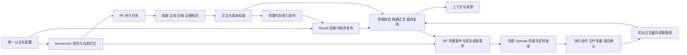

# P3 统一运行整合与工程验收

日期：2026-09-26。分支：`codex/integrate-continuous-p3`。起点：`32487d0290f6560ebe274c086119316856149cf5`，验收对象为该分支当前工作区修改；尚未提交或推送。

## 结论

现有 P0 主链路已经接成一个可启动、持续处理任务、持久化恢复的本地服务。统一入口同时装配 Remember、Generation Recall、RF 和内部 Operate；业务代码位于 `AgentJYS-main`。已完成真实 HTTP、SQLite、文件缓存和 BGE 模型下的验证。真实 LLM/P2/Milvus 环境、生产存储层迁移、24/72 小时长稳及产品指标仍需独立验收。

这份报告替代同日「当前代码实现层级核查」中的当前状态描述；旧报告保留为整合前基线。用户已有 Mock、交接文档等其他工作区修改未作为本次业务代码修改处理。

## 1. 主链路如何接通

主要接线点：

| 接线点 | 实际变化 |
|---|---|
| [统一宿主](../../AgentJYS-main/src/aether_agent_memory/runtime/flows/application.py) | 一次配置装配两个业务入口及内部服务；管理 Provider 生命周期 |
| [持续执行器](../../AgentJYS-main/src/aether_agent_memory/runtime/flows/supervisor.py) | 分离任务执行、事件与定时协调、身份重载和维护采样；关闭后按 RF 租约恢复 |
| [模型接入](../../AgentJYS-main/src/aether_agent_memory/remember/model_provider.py) | JSON 模型协议接到批量抽取、比较、支持性审核、压缩质量审核和工作摘要；限制并发/超时/响应大小 |
| [文档入口](../../AgentJYS-main/src/aether_agent_memory/remember/documents.py) | 原件写入对象存储并读回确认，按固定版本交给已有解析与 Remember 流程 |
| [Recall 装配](../../AgentJYS-main/src/aether_agent_memory/remember/local.py) | 接通真实 B 资格、正文、上下文复核 Provider；统一 BGE tokenizer/模型空间描述 |
| [持续 Operate](../../AgentJYS-main/src/aether_agent_memory/operate/basic/continuous.py) | 复用独立模块的热度/滞回算法，将输入、热度、下次检查时间、动作和恢复交给 RF 持久化 |
| [实际缓存读取](../../AgentJYS-main/src/aether_agent_memory/operate/basic/body_cache.py) | Recall 的正文读取真正使用准备过的缓存文件；scope/hash 校验后仍做业务最终复核 |
| [身份与共享](../../AgentJYS-main/src/aether_agent_memory/runtime/foundation/identity.py) | 显式租户、单调配置版本、停用/重新启用 epoch 栅栏；共享发现、读取和结果重取统一授权 |
| [部署入口](../../AgentJYS-main/compose.p3.yaml) | 新统一服务专用 Dockerfile/Compose、初始化和配置检查、公开 HTTP 冒烟脚本 |

独立 Operate 控制器保留为参考演示，线上入口复用算法并使用 RF 调度，没有同时启动两个控制器。旧 B1/B2/B3、旧 CLI 及其 Compose 保留兼容用途；标准入口见运行指南。

## 2. PRD V1.3 对照

需求来源为 `contracts/p3/prd-baseline.yaml` 指向的 PRD V1.3；流程依据为「P3 整体架构与完整流程」Excalidraw。

| 需求 | 接通结果 | 验证边界 |
|---|---|---|
| FR01 保存事件与任务信息 | HTTP 保存、幂等、正文确认和 RF 任务接通 | 本地端到端已测 |
| FR02 当前任务记忆 | 当前会话/任务读、工作摘要和长期化触发接入 | 工作摘要真实模型质量未验收 |
| FR03 长文本与文档 | 上传原件、不可变版本、解析、后台加工接通 | TXT 新入口已测；PDF/DOCX 复用可选解析依赖 |
| FR04 分类与生命周期 | Working/episodic/semantic、归档/激活、到期与保留策略共用权威记录 | 归档与激活竞争时序已测 |
| FR05 稳定事实、更正冲突 | 模型建议接到原文证据、更正版本、冲突关系及最终复核 | 模型协议和本地规则已测；真实模型判断质量待测 |
| FR06 提纯与压缩 | 压缩和独立质量审核接入后台任务 | 未把 5 倍压缩或语义完整性指标判为通过 |
| FR07 长期检索就绪 | 正文确认、多块完整代际发布、空间一致后才参与召回 | 真 BGE/SQLite 已测；Milvus 协议已测、服务器待联调 |
| FR08 查询记忆来源 | working/long_term/both/auto 接通，授权共享记忆可被发现 | 本地端到端已测 |
| FR09 排序去重与冲突 | 复用已有重排、预算与冲突表达链路 | 实际 CrossEncoder 部署及质量仍独立验证 |
| FR10 上下文交付 | 精确版本正文、token 预算、来源和交付前复核 | 本地端到端与原有领域回归 |
| FR11 查询处理与再次获取 | 请求状态和 Pack 持久化，重启后重取仍做当前权限/版本检查 | 本地 HTTP 和进程重启已测 |
| FR12 存储与召回轨迹 | 事件经 RF 投递，成功 read 才增加调度访问计数，access_key 去重 | 与既有事件/任务回归共同验证 |
| FR13 调度决策 | 持久热度、定时衰减、滞回、容量判断、相邻层调整接通 | 本地持续运行、自动降温与容量恢复已测 |
| FR14 执行与确认 | 原动作持久化、真实文件复制、读回校验、Unknown 查询恢复，读取使用准备结果 | 当前为本地文件缓存执行器；不是 P2 生产物理存储迁移验收 |
| FR15 租户隔离授权 | 租户注册/停用、同租户资源授权、旧配置拒绝、撤权与旧 epoch 阻断 | 本地跨租户/共享/撤权/重新启用已测 |
| FR16 预测预热 | PRD 明确为 P1，本轮不将基础热度调度包装成预测 | 未实现或验收预测预热 |
| FR17 删除与使用阻断 | 先阻断后清理、旧结果失效、缓存清理与生命周期一致 | 本地端到端与领域回归 |
| FR18 运行查询与恢复 | worker、队列、日志、就绪、任务恢复、已有维护规则执行接通 | 本地已测；云端运维及完整灾备待环境 |

## 3. 验证结果

| 编号 | 检查 | 结果 |
|---|---|---|
| E01 | 全仓 Python 回归，显式启用真 BGE，排除 Docker 环境项 | **1305 passed**，172.87 秒 |
| E02 | 收尾统一 HTTP 端到端回归，包含新增生命周期竞争用例 | **16 passed**，41.50 秒；与 E01 有重叠，不相加 |
| E03 | 真实 TCP 启动、保存、后台长期化、召回、再次获取 | 通过；独立进程重启后原 Recall ID 仍可读取，ready 返回 200 |
| E04 | Ruff：src/tests/scripts/benchmarks | 通过 |
| E05 | 严格 Mypy：全部源码 | **356 source files** 通过 |
| E06 | 合约、RF、三流程及协作门禁 | 全部通过：三流程与新增服务用例 227 passed / 1 skipped；RF 46、契约 358、旧 Recall/原生适配 144 项通过（不同组有重叠） |
| E07 | 统一 Compose 配置解析 | 通过；未获得 Docker 引擎可用证据 |

E01 之后补充的旧清理任务/重新激活保护由 E02 和最终门禁覆盖。测试源码包括真实异步 worker，不依赖手动 drain 推进；故障测试同时覆盖模型延迟、任务中断、原动作 Unknown、容量不足、正文 Provider 中断、共享撤权、租户 epoch 和缓存回收再唤醒。

模型 HTTP、Milvus 和 P2 Range 的协议替身测试只证明适配行为；真 BGE 另有实际模型加载与保存/召回证据。测试进程和 TCP 冒烟服务已关闭。原始命令、日志、失败记录及环境材料位于项目外工作区，不混入成果目录。

## 4. 本次发现并修复的重要问题

1. 新 Remember 与 Recall 的 BGE tokenizer 标识不一致，导致已发布索引被资格校验拒绝；现在发布端使用完整模型空间中的 tokenizer ID。
2. 共享授权只在读阶段检查，候选发现原来被 home scope 过滤；现在发现、正文读取与最终重取均遵循当前资源授权。
3. 原身份 epoch 改变后调度仍使用旧事件上下文；现在有效 owner 读取可更新调度上下文，共享读取不会取得 owner 调度权限。
4. 调度准备的文件原来没有进入正文读取路径；现在通过 TieredBodyCache 使用并校验实际准备结果。
5. 冷缓存回收后不能丢弃来源/权限水位；现在仅回收可选缓存和热度，后续读取可重新唤醒。
6. 旧归档清理任务不能把已经重新激活的对象标记为停止调度；现按当前状态及实际清理结果确认。
7. 正文 Provider 不可用原来未影响新服务的 ready 结论；必需依赖现进入类型化健康汇总。
8. Windows 并发重复投递可能在 `os.replace` 竞争时失败；现仅在最终文件精确一致时接受另一写入者的结果，并清理临时文件。
9. CI 补齐 fakeredis Lua 和异步测试依赖，独立 Operate 回归从源码目录归位到 tests；新增统一服务测试纳入三流程门禁。

两次短时间尺度缓存测试在并发回归负载下暴露脆弱假设，已调整测试衰减窗口；未修改业务默认衰减参数来迎合测试。初始失败记录保留。

## 5. 交付与使用

- [完整启动与运行指南](../部署运行/P3_统一服务运行指南_20260926.md)
- [统一配置模型](../../AgentJYS-main/src/aether_agent_memory/runtime/flows/config.py)
- [生产配置样例](../../AgentJYS-main/configs/p3.production.example.yaml)
- [统一服务端到端测试](../../AgentJYS-main/tests/integration/test_continuous_service.py)
- [公开 HTTP 冒烟脚本](../../AgentJYS-main/scripts/p3/smoke_service.py)

默认使用单进程宿主和独立部署数据目录。真实模型、P2 和可选 Milvus/Redis 由配置接入，凭据通过环境变量和受控身份文件管理。

## 6. 尚未验收的边界

真实 LLM 的抽取、冲突和压缩质量；真实 P2/Milvus 集群及生产物理存储层迁移；Docker 镜像构建和新容器完整联调；24/72 小时长稳、多租户规模与性能指标；完整正文/配置/索引灾备；Azure/AKS/P4 真实部署；P1 预测预热。本轮未推送远端，因此没有新的远端 CI 通过声明。

当前 RF 历史证据与业务数据仍需部署侧归档及容量规划，备份 RF 数据库不等于已完成全部 Provider 灾备。这些边界不影响已经验证的本地持续服务运行，但不能据此宣称 PRD 全部产品验收完成。
