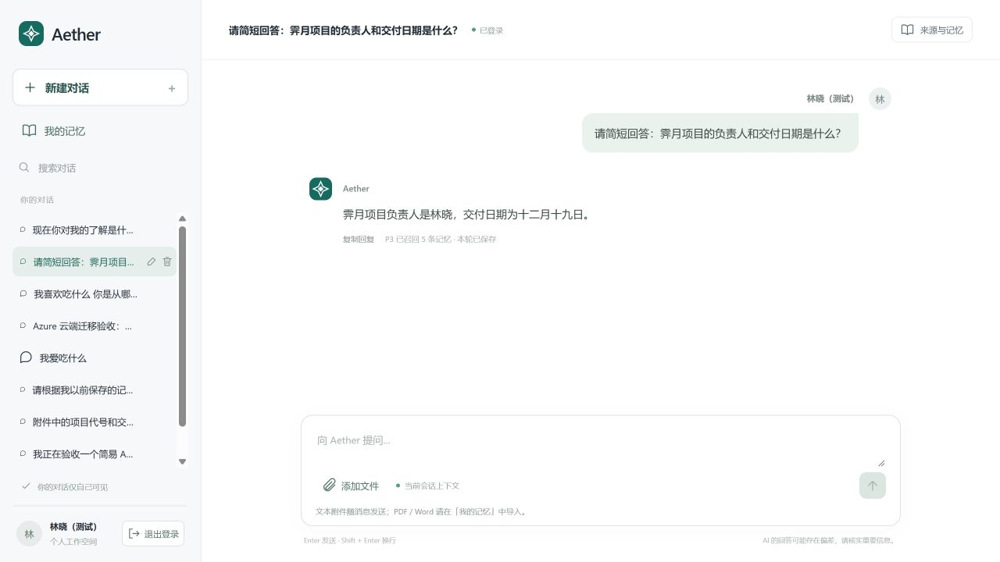
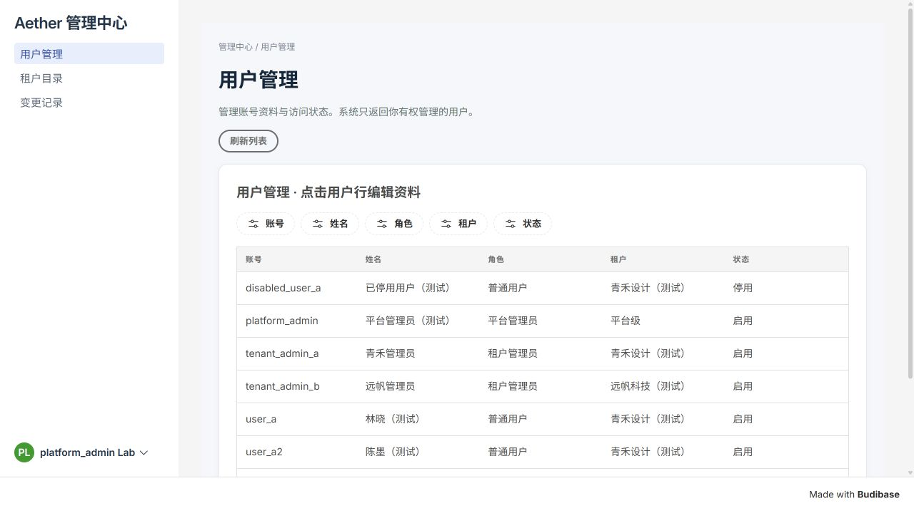
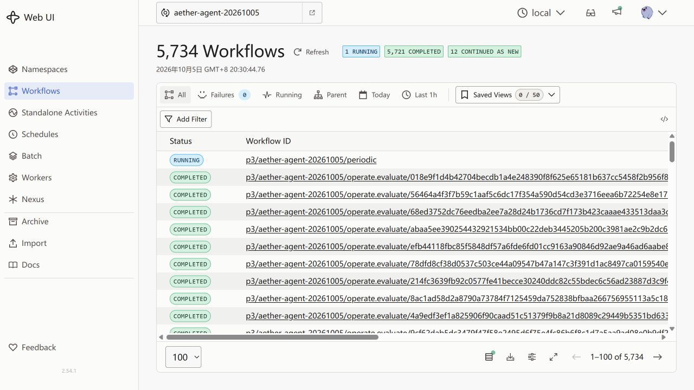

# Agent 平台 Azure 发布记录

日期：2026-10-05。结论：最新 Agent、Budibase 管理后台、Builder、身份认证与平台数据库已迁至 Azure；公网首页已切换至 Agent。旧监测 Web 已缩容至 0，数据卷和旧部署配置保留。当前是单实例测试部署，不等于生产高可用验收。

## 用户入口

同日后续更新：P3 API 接口文档已发布至 [云端 /docs](https://aether-p3-demo-c50c3827.southeastasia.cloudapp.azure.com/docs)，使用平台管理员登录校验。本文中关于初次发布时接口文档未公开的描述保留为阶段记录，当前使用方式见 [接口文档说明](P3_API接口文档云端使用说明_20261005.md)。

| 入口 | URL | 使用身份 |
|---|---|---|
| Agent | [打开](https://aether-p3-demo-c50c3827.southeastasia.cloudapp.azure.com/agent/) | 普通用户 |
| 管理后台 | [打开](https://aether-p3-demo-c50c3827.southeastasia.cloudapp.azure.com/app/default%20workspace/aether-admin) | 平台／租户管理员；Log in with Aether |
| Builder | [打开](https://aether-p3-demo-c50c3827.southeastasia.cloudapp.azure.com/builder) | builder@aether-lab.invalid，邮箱密码登录 |
| Temporal | [打开当前 Agent 工作流](https://aether-p3-demo-c50c3827.southeastasia.cloudapp.azure.com/temporal/namespaces/aether-agent-20261005/workflows) | 先登录管理后台的 platform_admin，再从同一浏览器打开 |

[完整页面与账号说明](项目Web页面与测试账号_20261005.md)；项目负责人另行提供的私有密码清单。原 8 个业务账号、Builder 账号和密码保持不变。

## 原因与改动

原 Azure HTTPS 网关仍指向历史 `web` Deployment，所以本机删掉旧 Web 后，公网仍显示旧监测界面。新 Agent 和 Budibase 当时运行在本机，尚未替换云端入口。原 Temporal 地址依赖本机 8233 端口转发，转发不在运行时浏览器无法连接。

此次增加独立 cloud 配置模式，区分公开 HTTPS issuer 与集群内部认证地址，使用 `/agent/` 路径、Secure/HttpOnly Cookie 和固定 Origin 校验。Agent 与管理后台沿用各自登录流程。Budibase 通过当前管理员的签名令牌访问云端管理 API，后端仍校验角色与租户。P3 身份投影由云端 sidecar 完成，本机同步和私有隧道已退出业务调用链。

Keycloak 改为生产 `start` 模式和 PostgreSQL；平台库与 Budibase 使用新 PVC。初始化管理员配置已从运行 Deployment 的明文环境变量移除，后续启动复用数据库中的已有身份。发布用配置导出不含 Secret。

网关修复了 Budibase 因 `no-referrer` 无法定位应用的问题，改用 `same-origin`。修复 OIDC 登录后返回首页的问题；只有 OIDC callback 的首页 Location 被改为管理应用。首页、Agent 和 Temporal 的跳转使用明确匹配器；旧 P3 公网 API、文档和 Keycloak 管理路径返回 404。Temporal 全路径先验证后台登录和平台管理员角色，UI 保留只读设置。

## 数据与实际验证

| 证据编号 | 已执行检查 | 结果 |
|---|---|---|
| AZ-01 | 迁移前平台 PostgreSQL 与 Budibase /data 备份，保留原用户主体 ID | 原 8 用户、3 租户、18 会话、29 对话轮次迁移；旧数据源保留 |
| AZ-02 | HTTPS 登录全部 8 个业务账号 | 3 个普通用户成功；3 个管理员不能登录 Agent；已停用用户和已停用租户被拒绝 |
| AZ-03 | 真实 OIDC 登录及管理 API | 平台管理员可见 8 用户，青禾管理员 4 用户，远帆管理员 2 用户，普通用户 403 |
| AZ-04 | 浏览器查看管理应用、SSO 返回地址 | 页面实际显示用户数据，SSO 返回管理应用；Builder 原生登录接口成功 |
| AZ-05 | 真实模型回复、P3 召回与保存 | 两条指定验收轮次均 complete / saved，回答负责人林晓、交付日期 12 月 19 日 |
| AZ-06 | 重启后查询数据库、登录与历史 | 原数据保留；最终快照 8 用户、3 租户、21 会话、33 对话轮次（含新增使用与验收） |
| AZ-07 | Temporal 页面、settings、namespaces 与权限 | 平台管理员可查看，匿名要求登录，租户管理员与普通用户 403；浏览器显示真实工作流 |
| AZ-08 | 公网路由与旧 Web | 首页 302 至 /agent/；/agent/ 与 Builder 200；/docs、/p3/readyz、/identity/admin 等 404；旧 web 为 0/0 |
| AZ-09 | 平台自动化测试 | 108 passed、7 skipped；跳过项为依赖专门本机 P3 配置的测试，不计为通过 |
| AZ-10 | 前端构建及测试 | 构建成功；7 项前端测试通过，含真实组件的流式内容渲染 |

验收轮次：`712481f9-f0b0-4151-b4cd-2fd81fbc0097`、`1b694704-6c24-4ffb-bf8c-474c43aab9cd`。首次轮次因发布包遗漏 P3 契约模块而中断；补齐 `aether_agent_memory` 和 rfc8785 后，以原轮次和操作编号恢复，未通过新建消息或修改终态掩盖失败。首次耗时包含故障修复，不作为性能数据。后续独立公网验收首字约 20.6 秒，后台保存异步完成；这只是一条观测，不是性能验收。

修复测试中发现的模拟客户端参数不兼容后，平台套件通过。前端首次完整组件测试缺少 jsdom，安装测试依赖后通过。网关切换阶段发现首页空白，纠正 Caddy 相对跳转的匹配语法后，最终真实 HTTP 检查通过。重启过程存在短暂不可用；最终所列新服务、P3 与 Temporal 的期望副本和就绪副本一致。

## 发布制品与运维

应用制品 SHA-256：`527581392066211177acb96de7bf9188ed438df22325d951878f44d7c4dde3ec`。

平台源代码位于仓库 `AgentJYS-main`。可复用资源、Caddyfile、配置示例、Dockerfile、依赖版本与后续更新脚本见 [部署代码](../../AgentJYS-main/deploy/platform/README.md)。本文记录当时的云端发布；对应源码与使用说明随本次 GitHub PR 一并提交。

当前 Azure 身份不具备 ACR 推送权限，因此使用可拉取基础镜像与校验后的 PVC 发布包。标准 Dockerfile 已提供，尚未验证自建镜像发布流水线。后续更新脚本已检查语法和参数；不能将此次分阶段迁移的执行结果等同于该脚本在空集群上一键重建验证。

原始日志、私有配置、备份和故障证据保存在项目外工作区，未放入交付成果。回退应恢复已保留的上一版应用／网关，复用现有数据库；不能用迁移前备份覆盖云端新增数据。旧 P3 和既有 PVC 仍保留，没有执行破坏性清理。

## 仍然存在的边界

- 云端业务链路已独立于本机运行。关闭本机不会停止云端服务；本机开发环境与云端不双向同步。
- Agent 登录会话在内存中；重启或会话到期后重新登录，历史对话和已保存记忆仍持久化。
- Temporal 继续使用原来的测试服务和持久化方式，尚未迁至正式生产数据库／高可用集群。
- 单实例更新存在中断；多实例、24/72 小时长稳、完整灾备和性能测试未在此次完成。
- 管理后台尚未开放租户创建维护、用户创建、重新启用、归属调整和角色分配。此次发布没有扩大产品功能验收范围。

## 浏览器验收截图

