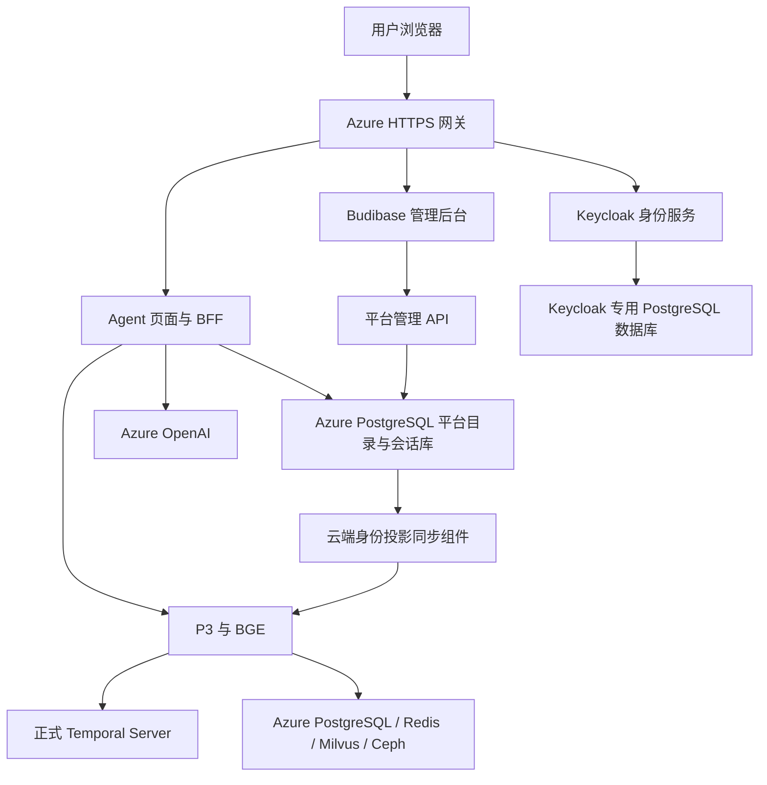

# Agent 平台运行现状与 Azure 全云端部署方案

核查日期：2026-10-05。依据：当前工作树源码、本机 Docker 与进程配置、AKS 实际部署/服务/持久卷、云端运行配置和当前 Azure 登录身份的角色分配。本轮为只读核查及方案，不修改代码、账号、网关或云资源。

## 结论

可以将完整平台运行在 Azure，通过 HTTPS URL 使用，并摆脱测试电脑、Docker Desktop、本机数据库与 kubectl 端口转发。当前尚未达到这一状态：用户入口、管理后台、登录及平台目录/会话数据库仍依赖本机。

推荐复用已有 AKS、Azure PostgreSQL、Redis、Milvus、Ceph、Azure OpenAI 和公网网关。无需先新建虚拟机；VM 是备选，不是通过 URL 访问的必需条件。

## 当前实际运行分布

| 组件 | 当前运行位置 | 说明 |
|---|---|---|
| Agent 页面 | 本机 | 前端构建资源由本机 BFF 提供，入口为 http://localhost:19010/ |
| Agent/BFF、平台管理 API | 本机 Python 进程 | FastAPI/Uvicorn，监听 127.0.0.1:19010；处理身份、聊天编排、会话和管理 API |
| Budibase 管理后台 | 本机 Docker | budibase/budibase:v3.47.0，入口 http://localhost:19000/app/default%20workspace/aether-admin，数据在本机持久卷 |
| Keycloak 身份服务 | 本机 Docker | 26.8.0，start-dev，http://localhost:19080；使用本机数据卷，未配置外部 PostgreSQL |
| 租户/用户/角色、聊天会话数据库 | 本机 Docker PostgreSQL | postgres:17.6，127.0.0.1:19432；与 P3 云端业务数据库不同 |
| 当前 Agent 使用的 P3 | Azure AKS | aether-p3-demo 命名空间的 aether-agent-p3，单副本；storage_mode=azure |
| BGE 向量编码 | Azure P3 容器 | ONNX 后端，模型目录 /work/models/bge，当前不是本机推理 |
| Temporal | Azure AKS | 当前单副本 start-dev，SQLite 文件位于持久卷；有持久化，不等于正式 Server/高可用 |
| P3 业务 PostgreSQL | Azure 托管 PostgreSQL | 使用隔离测试数据库 p3_test_closure_20261002 与 aether_agent_20261005_aks schema |
| P3 缓存 | Azure Redis | redisp3，TLS 6380 |
| P3 向量数据 | 云端私网 Milvus 服务 | 配置地址 milvus.internal:19530；Azure 私有 DNS 指向 10.224.0.7 |
| P3 正文/文件存储 | Azure Ceph 环境 | 当前使用 Ceph-Cluster 资源组相关公网地址的 HTTP RGW 接口和测试 bucket；正式上线需处理 HTTPS/私网访问 |
| LLM | Azure OpenAI | 当前配置 endpoint 为 aether-p3-resource.openai.azure.com，模型配置名 gpt-5.6-luna |
| P3 连接与身份投影同步 | 本机辅助进程 | 本机维护到 AKS 的 19020 端口转发，并将当前身份/JWKS 投影同步到 P3 |

因此，“P3 业务后端已在云端”成立；“所有数据库、登录和页面都已在云端”不成立。测试电脑关闭后，云端 P3/数据库仍可能继续工作，但当前用户平台整体无法独立提供服务。

## 当前 Azure 公网入口与旧部署

已存在 LoadBalancer 公网网关，配置域名为：

https://aether-p3-demo-c50c3827.southeastasia.cloudapp.azure.com

本轮读取的 Caddy 配置仍将请求反向代理到旧 web:80。AKS 中旧 web、旧 p3、public-web 仍在运行；当前新 aether-agent-p3 没有对应的公网接入，依赖本机端口转发。

不能把这个旧公网地址当作当前新 Agent/Budibase 的已发布地址。本轮没有删除旧部署。应在新平台完成迁移与验证后切换入口，再按依赖关系清理旧服务，保留复用的 Temporal、数据卷和数据库。

## 推荐目标结构

浏览器通过三个独立用途的 HTTPS 地址访问：Agent 用户平台、Budibase 管理后台、Keycloak 认证服务。具体域名在部署阶段配置；这里不声称已创建新地址。

数据库、P3、Temporal 等走云端内部网络，不作为普通用户入口。Agent 与后台继续采用独立登录入口及会话，共享统一的业务账号、租户和权限数据；普通用户不填写租户 ID。

## 需要完成的改造

1. **云端配置入口**：现有 create_lab_app 严格限定 localhost issuer 与本机 PostgreSQL；不能直接修改环境变量就上线。增加可配置的云端启动入口，配置公共 URL、内部服务地址、数据库、HTTPS Cookie、CSRF Origin、回调地址和代理信任边界；保留本机测试入口。
2. **部署 Agent/BFF 和 Budibase**：迁移前端资源与后端服务；迁移 Budibase 应用、数据源、账号关联及运行持久数据。Budibase 自身的元数据/缓存/文件依赖需要一并安排，不能仅迁移业务 PostgreSQL。
3. **迁移平台目录与会话数据库**：迁移现有租户、用户、角色、账号主体映射、会话和保存状态至独立 Azure 数据库及角色；保留 ID 和租户归属，校验数据量与关联完整性。不得直接覆盖现有 P3 业务数据库。
4. **正式 Keycloak 与身份同步**：使用生产启动方式及专用 PostgreSQL，配置 HTTPS issuer、允许来源和回调；迁移用户及主体 ID。迁移本机身份投影同步逻辑，P3 在云端读取正确 JWKS 和业务授权投影。不能依赖本机 kubectl 同步文件。
5. **会话持久化**：当前 BFF 会话位于进程内存，重启会退出登录。云端需明确共享会话存储、失效与撤权机制；不得仅通过增加多副本获得不一致的登录行为。
6. **正式 Temporal 与存储接入**：当前 start-dev + SQLite 应替换为正式 Server 和受支持的数据库持久化。已有任务采用排空或明确迁移策略，不能复制 SQLite 文件就宣称完成迁移。Ceph 当前为 HTTP 接入，需完成 HTTPS/私网及实际正文读写验证。测试库/bucket 的转用或独立正式资源迁移必须单独决定。
7. **版本化发布与回退**：当前 P3 是旧基础镜像加持久卷中的更新代码。该方式已能承载测试运行，但正式发布应使用可追溯的镜像/制品版本、配置、依赖、模型和回退记录。

## AKS 与 VM 的选择

| 方案 | 对本项目的适用性 | 判断 |
|---|---|---|
| 复用现有 AKS | P3、Temporal、公网网关与数据网络已有；本轮核查 3 个节点，各约 7.82 可分配 CPU、26.3 GiB 内存，瞬时 CPU 使用约 1%～3%、内存约 7%～9% | 推荐作为本次迁移目标；仍需核对配额、requests/limits、卷与应用峰值，瞬时空闲不是容量验收 |
| 新建 Azure Linux VM，使用 Docker Compose | 单机部署直观，可离线导入镜像；但新增 VM/网络权限与维护工作，并需迁移已有云端服务或管理混合拓扑 | 作为希望统一采用单机运维时的备选；不是当前最快复用路径 |

不建议把所有组件打包成一个容器。全 Azure 是指不依赖用户电脑，组件仍应分服务部署和管理持久数据。

## 当前权限边界

本轮先核对了 Azure CLI 实际登录主体，再查询该主体在资源组及 ACR 作用域的继承/组角色。可见角色包括 Reader、Foundry User、AcrPull、Storage Blob Data Reader、Log Analytics Reader；未见 AcrPush、Contributor 或 VM/网络创建角色。

现有 Kubernetes 凭据的授权检查显示：可创建 Deployment、Service，可修改 ConfigMap。Kubernetes 权限与 Azure 资源管理角色不同，不能据此宣称 Azure 权限已经全部恢复。

可在现有 AKS 范围准备和部署有权使用的制品，复用公网网关。新的 ACR 镜像发布需要已有合法发布 CI/身份或适当授权；新建 VM/网络、需要的 PostgreSQL 参数修改也需对应权限。当前 PostgreSQL azure.extensions 配置为空，正式 Temporal 所需扩展仍需按实际 schema 门禁检查与配置。

## 实施顺序与验收

1. 固定当前可运行版本及数据备份，完成云端配置入口和部署清单。
2. 准备平台/Keycloak 数据库及正式身份服务，迁移账号主体、角色和会话数据。
3. 部署 Agent/BFF、Budibase 与云端身份同步，通过内部 URL 验证。
4. 完成正式 Temporal/存储接入、版本化制品和重启恢复验证。
5. 配置公共 HTTPS 地址，验证用户登录/退出、流式对话、文件导入、P3 召回保存及管理员操作。
6. 从另一台设备访问；测试电脑关闭后平台仍可登录、聊天、保存和管理账号。不得依赖本机端口转发、JWKS 文件、数据库或模型目录。
7. 验证跨租户和同租户不同用户的隔离、平台管理员/租户管理员边界、停用后拒绝访问、重启后数据及原操作恢复、备份恢复。
8. 新入口通过验收后切换流量，再停用/清理被替换的旧 Web 和旧服务；保留共享依赖与数据。先验收单实例可持续服务，再单列多副本、高可用及容量目标。

迁到 Azure 可以消除本机通道和服务依赖，但不会自动消除 P3 召回内部的计算耗时；首字性能仍需要独立测量与优化。
