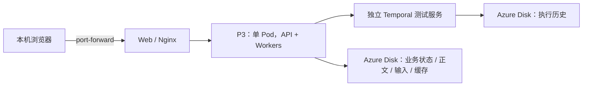

# P3 在现有 AKS 上的联调与演示部署指南

日期：2026-10-01。适用环境：Azure 全球版、Southeast Asia、已有 AKS。目标：先运行可持久保存状态的 P3 测试服务，再接真实模型和 P2。本文提供操作步骤；已执行的云端结果、实际资源名和当前待处理项见 [AKS 部署进度](P3_AKS部署进度_20261001.md)。

**现有基础测试服务已经运行，并提供[公网 HTTPS 网页](https://aether-p3-demo-c50c3827.southeastasia.cloudapp.azure.com)。** 日常访问见[公网使用说明](P3_公网访问说明_20261001.md)，无需本机转发。[本机访问和验证](#5-从本机访问和验证)仍适合诊断。第 2～4 节保留首次部署参考，当前无需重复创建资源、构建镜像或初始化业务目录。

## 1. 当前项目是否完整

**足够运行基础联调与演示；尚未完成完整生产交付。** Remember、Recall、Operate、事件、周期和缓存维护已经接入 Temporal。2026-10-01 在当前源码执行的 11 项定向检查全部通过，包括 6 项真实进程中断与恢复；9 月 30 日完整 Python 回归记录为 1513 项通过。它们不能替代 Linux 容器、真实外部依赖或 Azure 验收。

基础测试镜像已完成 ACR 构建，Temporal、P3 和 Web 已启动。仍待完成真实 P2/LLM/Milvus 联调、生产云端认证与网络、Worker 异常监督、长稳、性能和完整备份恢复。现有 `configs/p3.production.example.yaml` 缺必填 `temporal` 段，不能直接使用。`compose.yaml` / `compose.production.yaml` 是旧入口；当前统一服务入口是 `Dockerfile.p3` 与 `python -m aether_agent_memory serve`。仓库已有 Azure Pipeline 是检查流水线，未包含 AKS 发布。

本次第一阶段使用 **local + lexical**：正文和向量保存在 P3 的本地 SQLite，文本加工使用 literal baseline。无需 P2、LLM、Milvus 或 Redis，能够验证服务与持久任务链路，但不代表语义质量、真实存储接口已通过。



P3、Temporal 均为一个副本，Deployment 使用 `Recreate`，分别使用 Azure Disk PVC。RWO 只限制节点级挂载，不能代替单副本与目录锁。不开启 P3 HPA，不将同一个 SQLite 目录交给多个 Pod。

Temporal 此处运行固定版本的开发 Server，仅用于受控测试，不是生产高可用集群。原服务都使用 ClusterIP；已新增独立 `public-web` LoadBalancer/Caddy，为现有 Web 提供 HTTPS 和令牌认证入口，见[公网访问说明](P3_公网访问说明_20261001.md)。Temporal UI 保留内网：独立只读 UI 2.54.1 连接 `temporal:7233`，本机转发入口 `http://127.0.0.1:8233`，详见[服务与页面查看说明](P3_AKS查看服务与Temporal页面_20261001.md)。下面五份清单为核心服务首次部署参考，独立 UI 与公网代理清单保存在项目外部署工作区。

## 2. 先准备什么

| 项目 | 需要确认的内容 |
|---|---|
| Azure 订阅与权限 | 能读取现有 AKS；能建/使用 ACR、构建镜像并分配镜像拉取权限 |
| AKS | Linux amd64 节点；可用 CPU/内存；Azure Disk CSI 驱动和可用磁盘挂载配额 |
| StorageClass | `managed-csi` 可用；节点区域/可用区与磁盘匹配 |
| ACR | 新建或已有镜像仓库；AKS 能访问镜像与拉取镜像 |
| 本机 | 访问已有服务只需 kubectl 和已有 kubeconfig；首次在本机构建/管理 Azure 资源才需 Azure CLI。Entra 集群按其要求配置 kubelogin/VPN/私网访问 |
| 网络 | 构建侧可访问基础镜像、PyPI、npm；首次运行可下载 tiktoken 词表 |

下面的 CPU/内存和 20Gi 磁盘只是测试起始值，需按节点余量调整，不是性能测量或容量承诺。Azure Disk、ACR 构建和镜像存储会产生费用。

以下首次部署参考命令使用 **Windows PowerShell**。如果选择在本机管理 Azure 资源，先安装 [Azure CLI](https://learn.microsoft.com/en-us/cli/azure/install-azure-cli-windows)；镜像也可在 Cloud Shell 构建。命令中的资源组、集群名、订阅和 ACR 名需替换为实际值。当前访问已有服务无需安装本机 Azure CLI。

```powershell
$P3Subscription = '<订阅 ID>'
$P3ResourceGroup = '<现有 AKS 的资源组>'
$P3Cluster = '<现有 AKS 名>'
$P3Registry = '<现有或拟新建的 ACR 名，全球唯一小写字母数字>'
$P3Namespace = 'aether-p3-demo'
$P3Work = 'E:/projects/codex/.agent-work/aether/workspace-support/aks-demo-20261001'
New-Item -ItemType Directory -Path $P3Work -Force | Out-Null
$P3Kubeconfig = Join-Path $P3Work 'kubeconfig'

az login
az account set --subscription $P3Subscription
az aks get-credentials --resource-group $P3ResourceGroup --name $P3Cluster --file $P3Kubeconfig
$env:KUBECONFIG = $P3Kubeconfig
kubectl get nodes -L kubernetes.io/os,kubernetes.io/arch
kubectl get storageclass
```

私有 AKS 要先接通它的网络；获取凭据不等于能够访问 API Server。这里使用独立 kubeconfig，避免覆盖现有集群操作配置。

## 3. 将镜像放入 ACR

本次实际环境已创建 ACR。Contributor 的 `attach-acr` 角色分配失败后，使用 `acr-pull` Kubernetes Secret；部署 Pod 应引用它。不要重复创建仓库或重复尝试无权限的角色分配。密码修复入口与实际镜像标签见 [部署进度](P3_AKS部署进度_20261001.md)。下面保留通用的新建/角色授权步骤，供有对应权限的环境使用。

已有 ACR 则跳过创建。以下新建方式明确使用传统 RBAC 权限模式，便于 `attach-acr`；已有 ABAC 仓库不能直接照用这一步，需要为 kubelet 身份分配官方要求的 Repository Reader 权限。

```powershell
az acr create --resource-group $P3ResourceGroup --name $P3Registry --location southeastasia --sku Basic --role-assignment-mode rbac
az aks update --resource-group $P3ResourceGroup --name $P3Cluster --attach-acr $P3Registry
$P3RegistryHost = az acr show --name $P3Registry --query loginServer --output tsv
```

使用 Azure ACR Tasks 构建，避免依赖本机 Docker daemon。先确认选定源码包含 Temporal 接入；不要将 `.env`、凭据、部署数据或其他私密文件放进构建上下文。建议用所选 Git 提交的干净检出作为构建上下文，不上传整个项目根目录或项目资料。

```powershell
Set-Location 'E:/projects/codex/aether/AgentJYS-main'
$P3ImageTag = git rev-parse --short HEAD
az acr build --registry $P3Registry --image "aether/p3:$P3ImageTag" --file Dockerfile.p3 .
if ($LASTEXITCODE -ne 0) { throw 'P3 image build failed; stop deployment.' }
az acr build --registry $P3Registry --image "aether/web:$P3ImageTag" --file web/Dockerfile ./web
if ($LASTEXITCODE -ne 0) { throw 'Web image build failed; stop deployment.' }
az acr import --name $P3Registry --source docker.io/temporalio/temporal:1.9.1 --image aether/temporal:1.9.1
if ($LASTEXITCODE -ne 0) { throw 'Temporal image import failed; stop deployment.' }
```

每步成功后再继续。当前历史 Docker 验收停在基础镜像网络阶段；如果云端构建失败，先修复构建/网络问题，不能继续声称镜像可用。无权使用 ACR Tasks 时，由有权限的流水线或 Linux 构建机 build/push 相同 Dockerfile。

## 4. 保存测试部署清单

把下面五个 YAML 块分别保存到 `$P3Work`，文件名与小节标题一致。**将其中 `P3_ACR_HOST` 替换为 `$P3RegistryHost` 的实际值，将 `P3_IMAGE_TAG` 替换为 `$P3ImageTag`。** 这些是测试操作文件，保存于项目外工作区。各步骤完成再执行下一份，不要一次应用全部文件。

### 00-base.yaml

```yaml
apiVersion: v1
kind: Namespace
metadata:
  name: aether-p3-demo
---
apiVersion: v1
kind: PersistentVolumeClaim
metadata:
  name: p3-data
  namespace: aether-p3-demo
spec:
  accessModes: [ReadWriteOnce]
  storageClassName: managed-csi
  resources:
    requests:
      storage: 20Gi
---
apiVersion: v1
kind: PersistentVolumeClaim
metadata:
  name: temporal-data
  namespace: aether-p3-demo
spec:
  accessModes: [ReadWriteOnce]
  storageClassName: managed-csi
  resources:
    requests:
      storage: 20Gi
---
apiVersion: v1
kind: Service
metadata:
  name: temporal
  namespace: aether-p3-demo
spec:
  selector: {app: temporal}
  ports: [{name: grpc, port: 7233, targetPort: 7233}]
  type: ClusterIP
---
apiVersion: v1
kind: Service
metadata:
  name: p3
  namespace: aether-p3-demo
spec:
  selector: {app: p3}
  ports: [{name: http, port: 8080, targetPort: 8080}]
  type: ClusterIP
---
apiVersion: v1
kind: Service
metadata:
  name: web
  namespace: aether-p3-demo
spec:
  selector: {app: web}
  ports: [{name: http, port: 80, targetPort: 80}]
  type: ClusterIP
```

### 10-temporal.yaml

```yaml
apiVersion: apps/v1
kind: Deployment
metadata:
  name: temporal
  namespace: aether-p3-demo
spec:
  replicas: 1
  strategy: {type: Recreate}
  selector:
    matchLabels: {app: temporal}
  template:
    metadata:
      labels: {app: temporal}
    spec:
      nodeSelector: {kubernetes.io/os: linux, kubernetes.io/arch: amd64}
      terminationGracePeriodSeconds: 30
      securityContext:
        runAsUser: 1000
        runAsGroup: 1000
        fsGroup: 1000
        fsGroupChangePolicy: OnRootMismatch
      containers:
        - name: temporal
          image: P3_ACR_HOST/aether/temporal:1.9.1
          args: [server, start-dev, --headless, --ip, 0.0.0.0, --db-filename, /var/lib/temporal/temporal.db]
          ports: [{containerPort: 7233}]
          startupProbe:
            tcpSocket: {port: 7233}
            periodSeconds: 5
            failureThreshold: 60
          readinessProbe:
            tcpSocket: {port: 7233}
            periodSeconds: 5
          resources:
            requests: {cpu: 500m, memory: 1Gi}
            limits: {cpu: '2', memory: 4Gi}
          volumeMounts:
            - {name: data, mountPath: /var/lib/temporal}
      volumes:
        - name: data
          persistentVolumeClaim: {claimName: temporal-data}
```

这里保留 Temporal 镜像默认 ENTRYPOINT，使用 Kubernetes `args`；不是把 `server` 当成可执行文件。实时核对镜像与官方 Dockerfile，其用户为 UID 1000；`fsGroup` 使新 Azure Disk 卷可写，集群存储与安全策略须支持此设置。TCP 探针只说明端口可用，初始化 Job 还会检查 gRPC 健康。

```powershell
kubectl apply -f (Join-Path $P3Work '00-base.yaml')
kubectl apply -f (Join-Path $P3Work '10-temporal.yaml')
kubectl rollout status deployment/temporal -n $P3Namespace --timeout=300s
if ($LASTEXITCODE -ne 0) { throw 'Temporal is not ready; stop before initialization.' }
```

`managed-csi` 常使用 WaitForFirstConsumer。PVC 在使用它的 Pod 创建前处于 Pending 可以是正常状态，不要先独立等待所有 PVC Bound。

### 20-init.yaml

```yaml
apiVersion: batch/v1
kind: Job
metadata:
  name: p3-init
  namespace: aether-p3-demo
spec:
  backoffLimit: 0
  completions: 1
  parallelism: 1
  template:
    metadata:
      labels: {app: p3-init}
    spec:
      restartPolicy: Never
      nodeSelector: {kubernetes.io/os: linux, kubernetes.io/arch: amd64}
      containers:
        - name: init
          image: P3_ACR_HOST/aether/p3:P3_IMAGE_TAG
          env:
            - {name: TIKTOKEN_CACHE_DIR, value: /deployment/tokenizers}
          command: [/bin/sh, -ec]
          args:
            - |
              python - <<'PY'
              import asyncio
              from temporalio.client import Client
              async def check():
                  client = await Client.connect('temporal:7233', namespace='default')
                  if not await client.service_client.check_health():
                      raise RuntimeError('Temporal gRPC health failed')
              asyncio.run(asyncio.wait_for(check(), timeout=30))
              PY
              python -c "import tiktoken; tiktoken.get_encoding('o200k_base'); print('tokenizer ready')"
              python -m aether_agent_memory init --directory /deployment --embedding-profile lexical --host 0.0.0.0 --port 8080 --temporal-endpoint temporal:7233 --temporal-namespace default --deployment-id aks-p3-demo
              python -m aether_agent_memory check-config --config /deployment/service.yaml
          resources:
            requests: {cpu: 500m, memory: 1Gi}
            limits: {cpu: '2', memory: 4Gi}
          volumeMounts:
            - {name: data, mountPath: /deployment}
      volumes:
        - name: data
          persistentVolumeClaim: {claimName: p3-data}
```

先验证 Temporal 和下载 tokenizer，再初始化身份配置。此 Job 只在**新 PVC 且 P3 尚未启动**时执行。不能交给 GitOps 在每次发布时重新初始化。

```powershell
kubectl apply -f (Join-Path $P3Work '20-init.yaml')
kubectl wait --for=condition=complete job/p3-init -n $P3Namespace --timeout=300s
if ($LASTEXITCODE -ne 0) { throw 'Initialization did not complete; retain the Job and inspect its logs.' }
kubectl logs job/p3-init -n $P3Namespace
kubectl delete job p3-init -n $P3Namespace --cascade=foreground --wait=true
```

确认 Complete 后再删除 Job，释放其 Pod，保留 PVC。如果 Failed，先查看日志；不要继续启动 P3。若配置/凭据已经生成，保留它们，单独核查配置或恢复失败步骤，不重复 `init`、不删除 PVC、不重置 deployment ID。

### 30-p3.yaml

```yaml
apiVersion: apps/v1
kind: Deployment
metadata:
  name: p3
  namespace: aether-p3-demo
spec:
  replicas: 1
  strategy: {type: Recreate}
  selector:
    matchLabels: {app: p3}
  template:
    metadata:
      labels: {app: p3}
    spec:
      nodeSelector: {kubernetes.io/os: linux, kubernetes.io/arch: amd64}
      terminationGracePeriodSeconds: 30
      containers:
        - name: p3
          image: P3_ACR_HOST/aether/p3:P3_IMAGE_TAG
          env:
            - {name: TIKTOKEN_CACHE_DIR, value: /deployment/tokenizers}
          ports: [{containerPort: 8080}]
          startupProbe:
            httpGet: {path: /p3/live, port: 8080}
            periodSeconds: 5
            failureThreshold: 60
          readinessProbe:
            httpGet: {path: /p3/readyz, port: 8080}
            periodSeconds: 5
            timeoutSeconds: 3
            failureThreshold: 3
          livenessProbe:
            httpGet: {path: /p3/live, port: 8080}
            periodSeconds: 15
            timeoutSeconds: 3
            failureThreshold: 3
          resources:
            requests: {cpu: 500m, memory: 1Gi}
            limits: {cpu: '2', memory: 4Gi}
          volumeMounts:
            - {name: data, mountPath: /deployment}
      volumes:
        - name: data
          persistentVolumeClaim: {claimName: p3-data}
```

使用 P3 镜像默认命令启动 `/deployment/service.yaml`。这里沿用镜像当前用户权限；若集群策略要求 non-root，需要同步调整初始化 Job、应用 UID/GID 和磁盘文件权限，不能只加 `runAsNonRoot`。

```powershell
kubectl apply -f (Join-Path $P3Work '30-p3.yaml')
kubectl rollout status deployment/p3 -n $P3Namespace --timeout=300s
if ($LASTEXITCODE -ne 0) { throw 'P3 is not ready; inspect Pod events and logs.' }
kubectl get pods,pvc,services -n $P3Namespace
```

### 40-web.yaml

```yaml
apiVersion: v1
kind: ConfigMap
metadata:
  name: web-nginx
  namespace: aether-p3-demo
data:
  default.conf: |
    server {
      listen 80;
      server_name _;
      root /usr/share/nginx/html;
      index index.html;
      client_max_body_size 70m;
      add_header X-Content-Type-Options nosniff always;
      add_header Referrer-Policy no-referrer always;
      add_header X-Frame-Options DENY always;
      location /p3/ {
        proxy_pass http://p3:8080;
        proxy_set_header Host $host;
        proxy_set_header Authorization $http_authorization;
        proxy_read_timeout 65s;
        add_header Cache-Control no-store always;
      }
      location / {
        try_files $uri $uri/ /index.html;
        add_header Cache-Control no-cache;
      }
    }
---
apiVersion: apps/v1
kind: Deployment
metadata:
  name: web
  namespace: aether-p3-demo
spec:
  replicas: 1
  selector:
    matchLabels: {app: web}
  template:
    metadata:
      labels: {app: web}
    spec:
      nodeSelector: {kubernetes.io/os: linux, kubernetes.io/arch: amd64}
      containers:
        - name: web
          image: P3_ACR_HOST/aether/web:P3_IMAGE_TAG
          ports: [{containerPort: 80}]
          readinessProbe:
            httpGet: {path: /, port: 80}
          resources:
            requests: {cpu: 100m, memory: 128Mi}
            limits: {cpu: 500m, memory: 256Mi}
          volumeMounts:
            - {name: nginx, mountPath: /etc/nginx/conf.d/default.conf, subPath: default.conf}
      volumes:
        - name: nginx
          configMap: {name: web-nginx}
```

原 Web 代理超时 20 秒，小于 API 默认等待 30 秒；这里改为 65 秒。上传上限与 P3 默认 64MiB 一并考虑。Service 必须名为 `p3`，转发路径不要重写。更新此 ConfigMap 后，需要重启 Web 才会加载 subPath 内容。

```powershell
kubectl apply -f (Join-Path $P3Work '40-web.yaml')
kubectl rollout status deployment/web -n $P3Namespace --timeout=300s
if ($LASTEXITCODE -ne 0) { throw 'Web is not ready; inspect Pod events and logs.' }
```

## 5. 从本机访问和验证

在本机 PowerShell 5.1 或 7 运行以下成品脚本。它先检查本机 3000 端口上的 P3 就绪状态：已有可用转发时直接复用；没有可用转发时启动前台转发。脚本从项目外的 `credential` 文件读取令牌并复制到本机剪贴板，不显示令牌，也不重新获取或生成云端凭据。

```powershell
powershell.exe -NoProfile -ExecutionPolicy Bypass -File 'E:/projects/codex/aether/交付成果/部署运行/打开P3监测网页.ps1'
```

浏览器打开 [Web](http://127.0.0.1:3000) 后，在密码框按 `Ctrl+V` 粘贴令牌。若脚本新建转发，保持该 PowerShell 窗口运行，看到 `Forwarding` 后刷新网页；按 `Ctrl+C` 只停止本机转发。若复用已有转发，保持原转发窗口运行即可。脚本的 `ExecutionPolicy Bypass` 只作用于本次 PowerShell 进程。

Web 已代理同源 `/p3/`，网页和 API 验证都使用 `http://127.0.0.1:3000`，只需一个 Web 转发。需要手动启动时运行下列命令；已有转发时不用重复启动：

```powershell
kubectl --kubeconfig 'E:/projects/codex/.agent-work/aether/workspace-support/aks-demo-20261001/kubeconfig' -n aether-p3-demo port-forward service/web 3000:80 --address 127.0.0.1
```

在另一个操作终端设置验证所需变量并检查接口。这里复用已有本机凭据文件，不从云端重新读取或覆盖它：

```powershell
$P3Kubeconfig = 'E:/projects/codex/.agent-work/aether/workspace-support/aks-demo-20261001/kubeconfig'
$env:KUBECONFIG = $P3Kubeconfig
$P3Namespace = 'aether-p3-demo'
$P3Credential = 'E:/projects/codex/.agent-work/aether/workspace-support/aks-demo-20261001/credential'
if (-not (Test-Path -LiteralPath $P3Credential -PathType Leaf)) { throw '本机 P3 凭据文件不存在，请保留现有部署并联系助手核查。' }
Invoke-RestMethod 'http://127.0.0.1:3000/p3/live'
Invoke-RestMethod 'http://127.0.0.1:3000/p3/readyz'
```

令牌用于剪贴板和网页凭据框，不在聊天、日志或截图中展示。如果需要重新复制，运行对应打开网页脚本即可。初始化身份是 `local_admin`，仅适合受控测试；公网入口已补 HTTPS 与原有令牌校验，P4/Entra 个人账号和最小身份仍待接入，不作为生产身份验收。

用本机已有 Python 环境运行仓库冒烟脚本。脚本不在 P3 镜像中，不能通过 `kubectl exec` 调用它。

```powershell
Set-Location 'E:/projects/codex/aether/AgentJYS-main'
$P3Python = 'E:/projects/codex/.agent-work/aether/workspace-support/temporal-migration-20260930/venv/Scripts/python.exe'
$P3Smoke = & $P3Python scripts/p3/smoke_service.py --url http://127.0.0.1:3000 --credential-file $P3Credential --timeout 60 | ConvertFrom-Json
$P3Smoke
```

成功应出现 `passed: true`，并返回原 operation/recall ID。此脚本实际写入一条唯一测试记忆，关闭该批次，等待长期召回并读取结果。它证明测试链路通过，不能证明真实模型质量。

2026-10-01 AKS 现场发现此脚本的立即召回存在时序问题：长期投影未完成时，Recall 可能在三次 `REQUEST_IN_PROGRESS` 重试后以 HTTP 400 结束，不能靠提高脚本总超时解决。联调时先查询 `/p3/remember/{memory_id}/processing`，等加工为 `completed`、派生记忆 `projection_state` 为 `ready` 后，再提交新的 Recall。此次按这个顺序通过了完整链路；立即召回的重试语义仍待修复。

随后保持两个 PVC，分别重启并重新查询原结果：

```powershell
kubectl rollout restart deployment/p3 -n $P3Namespace
kubectl rollout status deployment/p3 -n $P3Namespace --timeout=300s
# 若本机 Web 转发已退出，先重新运行打开网页脚本并保持转发。
$P3Headers = @{ Authorization = 'Bearer ' + [System.IO.File]::ReadAllText($P3Credential).Trim() }
Invoke-RestMethod ("http://127.0.0.1:3000/p3/recalls/" + $P3Smoke.recall_id + '/result') -Headers $P3Headers

kubectl rollout restart deployment/temporal -n $P3Namespace
kubectl rollout status deployment/temporal -n $P3Namespace --timeout=300s
kubectl exec deployment/temporal -n $P3Namespace -- temporal --address 127.0.0.1:7233 --command-timeout 10s operator cluster health
if ($LASTEXITCODE -ne 0) { throw 'Temporal is not serving; stop and inspect its logs.' }
# 本次现场未通过 P3 自动重连；Temporal SERVING 后受控重启 P3。
kubectl rollout restart deployment/p3 -n $P3Namespace
kubectl rollout status deployment/p3 -n $P3Namespace --timeout=300s
$P3ReadyDeadline = [DateTime]::UtcNow.AddSeconds(60)
$P3IsReady = $false
while ([DateTime]::UtcNow -lt $P3ReadyDeadline) {
    try {
        $P3ReadyState = Invoke-RestMethod 'http://127.0.0.1:3000/p3/readyz' -TimeoutSec 3
        if ($P3ReadyState.readiness -eq 'ready') { $P3IsReady = $true; break }
    } catch { }
    Start-Sleep -Seconds 2
}
if (-not $P3IsReady) { throw 'P3 has not reconnected; inspect Temporal and P3 logs.' }
Invoke-RestMethod ("http://127.0.0.1:3000/p3/recalls/" + $P3Smoke.recall_id + '/result') -Headers $P3Headers
```

本次现场 Temporal 单独重启后，历史保留，但 P3 持续 `STATUS_STALE`，Web 返回 502。Temporal 恢复 `SERVING` 后再重启 P3，原结果和新召回均通过；不能据此宣称 P3 能自动从 Temporal 中断恢复。不要更换 deployment ID、namespace、队列或 PVC。已完成结果保留与在途任务中断恢复仍须分别验收。

## 6. 第二阶段：接真实语义能力与 P2

基础链路通过后，新建另一套 namespace/PVC 和独立 deployment ID，再按以下顺序联调。不直接把已有 lexical 数据库改为 native；正文 Provider 和向量后端也有持久绑定。

1. 初始化时使用 `--embedding-profile native`。在容器内生成的 `embedding.json` 缓存路径为 `/deployment/models`；预放兼容 BGE 模型或允许模型下载。确认原生 BGE 编码与 Working/长期召回。
2. 模型服务需兼容 `/chat/completions`、JSON object 输出和 `/models` 模型查询。把实际地址/模型填入 `language_model`，密钥通过 Kubernetes Secret 注入 `AETHER_LLM_API_KEY`。Azure 旧 deployment/API-version URL 不能直接套用；新版 `/openai/v1` 也需验证模型参数和健康探测匹配，当前未有直接集成验收。
3. 若接内置 engine，先构建 `engine/Dockerfile` 镜像，部署独立单实例和第三个 PVC，持久目录 `/var/lib/aether-engine`，ClusterIP `engine:50052`，环境 `AETHER_P2_DATA_DIR=/var/lib/aether-engine`。初始化生成数据前就在 P3 配置 `p2_endpoint: engine:50052`。该 engine 为本地文件/SQLite 引擎，不能当作 Ceph/Milvus 生产集群。
4. 若接项目真实 P2，按其团队的 gRPC/存储契约部署并提供私网地址、读取/写入/原操作核查证据；不擅自改造外部团队组件。
5. 若要用 Milvus，另提供部署、持久化和认证，配置 `recall_config` 中的 `milvus_uri`、`milvus_collection`、`milvus_token_env`。`production` 不会自动启用 Milvus。
6. 再将 profile 设为 `production`，补完整 `temporal` 段、身份配置、模型和 P2。配置校验通过仅是入口门槛，仍须执行真实接口联调。

当前公网入口已完成独立 Caddy、Azure 域名、可信 HTTPS 证书和令牌认证读取验证，见[公网接入验证](../测试与验收/P3_公网HTTPS接入验证_20261001.md)。Temporal、P2、数据库与维护入口保持受控访问，代理超时与上传限制对齐现有 Web。后续生产身份与高可用另行验收。

## 7. 常见失败与运行边界

| 现象 | 检查与处理 |
|---|---|
| ImagePullBackOff | ACR hostname/tag、AKS kubelet 拉取权限、ACR 网络/DNS；ABAC 与传统 AcrPull 配置不同 |
| PVC Pending | 是否等待第一个消费者、StorageClass、磁盘配额/区域/可用区、Pod 调度条件 |
| 初始化拒绝覆盖 | 已有配置/credential；保留原身份并检查状态，不清盘重新初始化 |
| P3 CrashLoopBackOff | `kubectl logs`、配置字段、目录权限、绑定、依赖；生产示例缺 temporal 会失败 |
| P3 启动但未就绪 | Temporal 的 DNS/端口/gRPC、身份、Worker；`/p3/live` 只说明 HTTP 存活 |
| Web 502/504 | p3 Service、P3 readiness、Nginx timeout、原 operation ID；超时不代表 Workflow 被取消 |
| Worker 退出但 HTTP 还活着 | 当前不会自行重建 Worker；诊断确认后受控 `rollout restart deployment/p3`，不要将 readyz 直接设成 liveness 导致依赖故障重启风暴 |
| 长期结果为空 | 批次是否关闭、加工/投影是否完成、查询是否具备 session/task 范围 |

诊断命令：

```powershell
kubectl get pods,pvc,services -n $P3Namespace
kubectl get events -n $P3Namespace --sort-by=.lastTimestamp
kubectl logs deployment/p3 -n $P3Namespace --tail=100
kubectl logs deployment/temporal -n $P3Namespace --tail=100
```

readyz 只代表执行接纳就绪；完整业务能力还需鉴权查询 `/p3/ready`、`/p3/health`、`/p3/capabilities` 和实际接口验证。Kubernetes 重建 Pod、Temporal 恢复任务、磁盘备份恢复是三层不同能力。

升级镜像保留两个 PVC 和配置，P3 保持 Recreate；修改 Workflow 命令顺序还需历史重放门禁。停止演示可先将 P3/Web 缩容为 0，再停止 Temporal；数据卷与 ACR 仍可能收费。不要用删除 namespace/PVC 停服务，默认 StorageClass 的回收策略可能删除底层磁盘。

## 8. 本轮上线判断

只有 ACR 构建成功、初始化成功、Pods 就绪、公开 HTTP 保存/召回通过、保留原 ID 的重启检查通过，才记录“AKS 基础测试服务已跑通”。真实模型/P2/Milvus、完整产品验收、长稳与生产可靠性分别记录，不能合并签收。

本文最初完成源码与 YAML 检查后形成；随后已连接现有 AKS、完成镜像构建与基础资源创建。初始化、服务启动和验收的最新状态以 [部署进度](P3_AKS部署进度_20261001.md) 为准。通用命令仍须按实际资源和集群策略填写。

相关材料：[Temporal 工程验收](../测试与验收/P3_Temporal接入工程验收_20260930.md)、[本地运行与迁移](P3_Temporal本地运行与迁移指南_20260930.md)。官方依据：[AKS 与 ACR 集成](https://learn.microsoft.com/en-us/azure/aks/cluster-container-registry-integration)、[ACR Tasks 构建](https://learn.microsoft.com/en-us/azure/container-registry/container-registry-tutorial-quick-task)、[Azure Disk CSI](https://learn.microsoft.com/en-us/azure/aks/azure-csi-disk-storage-provision)、[连接 AKS](https://learn.microsoft.com/en-us/azure/aks/learn/quick-kubernetes-deploy-cli)。官方页面于 2026-10-01 实时核对；具体权限和 StorageClass 以现有集群为准。
