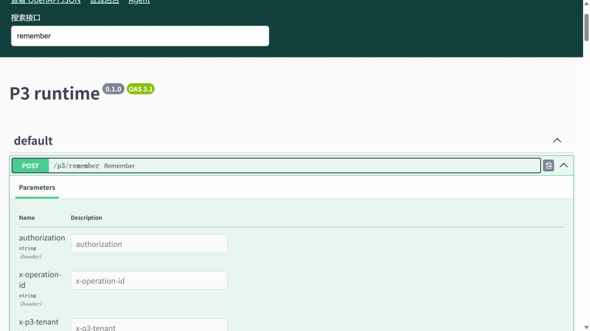

# P3 API 接口文档云端使用说明

发布日期：2026-10-05。接口文档已部署到现有 Azure HTTPS 域名，原开发电脑关机后仍可使用。

| 入口 | 地址 | 登录要求 |
|---|---|---|
| P3 API 接口文档 | [打开文档](https://aether-p3-demo-c50c3827.southeastasia.cloudapp.azure.com/docs) | 平台管理员 |
| OpenAPI JSON | [查看接口定义](https://aether-p3-demo-c50c3827.southeastasia.cloudapp.azure.com/openapi.json) | 相同平台管理员登录会话 |
| 管理后台 | [登录管理后台](https://aether-p3-demo-c50c3827.southeastasia.cloudapp.azure.com/app/default%20workspace/aether-admin) | 点击 Log in with Aether，使用 platform_admin |

先登录管理后台，再在同一浏览器打开文档。当前支持搜索接口、展开请求参数、查看请求体和响应模型；文档读取当前云端 P3 的 OpenAPI 定义。它不提供在线执行接口，实际 API 调用仍使用获准的接入方式和用户令牌。

发布时定义包含 **60 个路径、72 个操作**，版本标识为 `P3 runtime / 0.1.0`。版本标识来自当前服务本身，后续代码更新的具体制品以发布记录为准。

已验证匿名请求跳转管理后台，platform_admin 对文档及 JSON 访问均为 200，tenant_admin_a 和 user_a 均为 403。并检查 Agent、管理后台和 Temporal 仍可访问，P3 实际 API 与 Keycloak 管理路径仍未公开。

浏览器验证已确认：输入 `remember` 可筛选相关接口，展开 `POST /p3/remember` 可查看请求头、请求体及响应结构。示例由 Swagger 根据模型生成，具体测试数据仍应按接口约束填写。

部署只调整现有网关和文档资源，没有重启 Agent、P3 或数据库。网关更新期间存在短暂连接中断。Swagger UI 界面资源来自固定版本公共 CDN；若所在网络无法加载界面资源，可直接打开上面的 OpenAPI JSON。

原清单中的条目可替换为：

| P3 API 与接口文档 | [云端接口文档](https://aether-p3-demo-c50c3827.southeastasia.cloudapp.azure.com/docs) / [OpenAPI JSON](https://aether-p3-demo-c50c3827.southeastasia.cloudapp.azure.com/openapi.json) | 先用 platform_admin 登录管理后台，再在同一浏览器打开；支持查看接口、参数和响应结构，实际 API 调用仍保留访问限制 |
|---|---|---|
