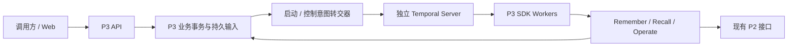

# P3 Temporal 本地运行与迁移指南

本次接入覆盖 Remember、Recall、Operate、事件投递、周期任务和 P3 缓存维护。Temporal 是统一 P3 的在线调度器；业务事务、权限、版本、幂等、原操作 ID、分块检查点和业务 Outbox/Inbox 继续保留。

本指南面向单台主机、单个 P3 应用进程。Azure/AKS 部署、跨 Pod 共享存储、数据库恢复和 P2 故障修复均不在本次交付范围内。P2 调用结果未知时，只核对原操作；不能把超时当作“没有执行”而重提写入。

## 1. 运行组成



API、转交器与 SDK Workers 在同一个 P3 进程内；Temporal Server 独立运行。不同执行类使用不同 Task Queue。一个业务目录只能由一个 P3 进程持有，不要通过增加 Uvicorn workers、多个容器或 Pod 来共享同一目录。默认待处理上限仍为 scope 100、tenant 300；运行并发按 class、tenant/class、scope/class 约束，避免慢模型阶段阻塞同 scope 的 Operate 任务。

已验证的固定版本为 Python 3.13、Temporal Python SDK 1.33.0、Temporal CLI 1.9.1。CLI 内置开发服务器用于本地工程验证，不等于已验收的生产 Temporal 集群。

## 2. 新目录启动

以下在 `E:/projects/codex/aether/AgentJYS-main` 执行。使用项目 Python 3.13 环境，勿使用 PATH 中旧版 Python。示例的运行数据放在项目外；Windows 建议使用较短路径，避免正文/缓存临时文件超过系统路径限制。

```powershell
$P3Python = '<Python 3.13 环境>/Scripts/python.exe'
$P3Run = 'E:/p3-local'
$P3Temporal = "$P3Run/tools/temporal.exe"
$env:PYTHONPATH = "$PWD/src"
$env:PYTHONUTF8 = '1'
& $P3Python -m pip install -e '.[embedding-onnx,resource-documents]'
& $P3Python scripts/p3/install_temporal_cli.py --directory "$P3Run/tools"
& $P3Python scripts/p3/temporal_dev.py start --directory "$P3Run/temporal" --binary $P3Temporal
```

启动器输出实际 `endpoint`，例如 `127.0.0.1:xxxxx`。它校验 CLI 版本并记录二进制 SHA256，开发历史保存在 `temporal.db`；`stop` 保留该文件。控制操作只联系带令牌的本地所有者，不根据过期 PID 终止其他进程。

将输出地址填入下一条命令：

```powershell
& $P3Python -m aether_agent_memory init --directory "$P3Run/deployment" --embedding-profile lexical --temporal-endpoint '127.0.0.1:xxxxx'
& $P3Python -m aether_agent_memory serve --config "$P3Run/deployment/service.yaml"
```

`lexical` 是无需下载模型的本地工程配置。真实语义检索使用 `native` 和已核对的模型配置；生产配置还要求真实模型与 P2。`init` 创建身份配置和 `credential` 文件，不覆盖已有部署文件。客户端使用 `Authorization: Bearer <credential 文件内容>`。不要将令牌写进日志或提交到仓库。

`temporal.deployment_id`、namespace、Task Queue 前缀与业务目录绑定后应保持稳定。迁移机器或重启进程时保留这套身份，不要通过更换 deployment ID 来绕开原任务历史。配置参考：`configs/p3.temporal.example.yaml`。

```powershell
& $P3Python scripts/p3/temporal_dev.py status --directory "$P3Run/temporal"
& $P3Python scripts/p3/temporal_dev.py stop --directory "$P3Run/temporal"
```

先停止接纳并正常关闭 P3，再停止开发 Server。重新启动相同两个目录即可恢复执行。突然终止后的恢复已另做真实进程演练，不依赖正常退出。

## 3. API 与运维行为

| 场景 | 当前行为 |
|---|---|
| Remember/Recall/文档命令完成 | 保持原成功响应结构 |
| HTTP 等待期限已到、任务仍在执行 | 返回原 `REQUEST_IN_PROGRESS` / HTTP 400，并给出 `Location` 与 `X-P3-Job-ID`；Workflow 继续执行 |
| 查询持久操作 | `GET /p3/operations/{job_id}`，结果为该路径加 `/result`；每次重新鉴权 |
| 客户端重试 | 使用相同 `X-Operation-ID` 与相同输入；不同输入不得复用该 ID |
| Temporal 暂时不可用 | readiness 为 503，暂停新接纳；已持久意图保留 |
| 活性探针 | `/p3/live` 只表示进程存活 |
| 就绪探针 | `/p3/readyz` 读取内部状态；不执行 P2 写入；`/p3/ready` 保留业务鉴权 |
| Working 检索 | 必须提供 task 或 session 选择条件 |
| 手工旧周期入口 | `POST /p3/maintenance/cycle` 已退役，鉴权后返回 410；周期工作由 Temporal Workflow 执行 |
| 旧 RF worker/claim/sweep 等入口 | 明确拒绝，不能作为后备调度器启动 |
| 人工恢复/核对 | `POST /p3/recovery`，仍使用原 `operation_id`、`task_id`、`expected_revision`、`reason` 字段；同事务登记控制意图后转交原 Workflow |
| 人工取消 | `POST /p3/tasks/{task_id}/control`，传 `operation_id`、`action: cancel`、`expected_revision`、`reason`；同端点也接受 `action: reconcile` |
| 查看控制进度 | `GET /p3/controls/{operation_id}`；accepted 表示已持久受理，running 表示已转交任务链，最终 completed/failed/unknown 取决于业务事实 |
| 周期控制 | `GET /p3/periodic/control` 获取 revision；POST 同路径提交 `operation_id`、`action: reconcile` 或 `cancel`、`expected_revision`、`reason` |

业务状态和 Temporal 技术状态可能短暂不同。例如业务已提交、Activity 回报丢失时，Worker 读取原完成凭据；技术终止但外部效果未知时，保留待核对状态。任务查询与诊断应同时观察两者。

控制接口要求当前 `maintenance:recover` 权限；跨租户和版本冲突会被拒绝。周期控制另要求调用方列入部署配置 `maintenance_principals`，并具有 `maintenance:configure` 权限。转交前再次检查当前权限；相同控制 operation ID 及内容可重复提交，信号确认丢失不会创建另一条任务链。原链尚未确认绑定时返回 `REQUEST_IN_PROGRESS`；原链已关闭或不存在时，控制记录明确为 failed，不重新启动写任务。

周期控制的 completed 仅表示信号已转交；reconcile 会唤醒下一次有界检查，实际批次完成以周期状态与业务记录为准。cancel 会结束原周期链，不能用重启 P3 自动创建替代周期链；这是维护操作，需先安排后续运行计划。正常 Continue-As-New 后，即使旧 run 历史已清理，重启也会严格核对原链 ID、计划摘要、Workflow 类型和队列，再连接仍运行的后继。

任务进入失败、取消或待处理终态后，旧 Recall 轮询、关联恢复操作、缓存修复事件及事件投递状态会同步收敛。未知外部效果保留 unknown；没有独立核验证据的缓存修复不会被标为 resolved。

SDK Worker 自身异常退出会使 readiness 持续 degraded，本进程不会自动重建已退出的 Worker。部署方须通过进程管理器监测该状态并重启 P3；Docker HEALTHCHECK 标记 unhealthy 本身不会触发 `restart` 策略，不能将其当作自动恢复方案。单纯 P2 故障不应触发循环重启。

## 4. 现有业务目录离线迁移

**本次没有自动迁移用户正在运行的数据目录。** 源码更新和已有业务数据切换是两个步骤。

1. 停止原 P3 服务，并禁用它的自动启动/自动重启。未打补丁的旧二进制不会识别 Temporal 标记；复制目录也不能证明原服务已停止。
2. 按既有运维流程保全原业务目录及配置。数据库备份恢复由相应负责人执行。
3. 在部署配置中填入稳定的 `temporal` 配置，对原数据库执行只读检查。报告目录预先创建，报告文件使用新名称。

```powershell
& $P3Python scripts/p3/migrate_temporal.py --database "$P3Run/deployment/state/p3.db" inspect --config "$P3Run/deployment/service.yaml" --report "$P3Run/migration-report.json"
```

报告包含数据/配置指纹、状态计数、原操作引用和 blockers。有阻断项则不能切换；缺输入、未知种类、活跃旧 lease、缺失原动作、无法映射的未知阶段等不会被静默跳过。检查只使用只读连接，不实例化会写入的 Service。

4. 核对停止条件与报告后显式应用：

```powershell
& $P3Python scripts/p3/migrate_temporal.py --database "$P3Run/deployment/state/p3.db" apply --report "$P3Run/migration-report.json" --deployment-id '<配置中的 deployment_id>' --old-service-stopped-and-autostart-disabled
```

应用阶段取得目录锁、复查完整指纹及静止条件，在一个事务中写入后端标记、迁移批次、原任务绑定和启动意图。报告过期则拒绝；重复应用原批次不重复创建任务。保留原任务 ID、attempt/query_attempt 和截止时间，不重置预算。

5. 启动新版 P3，先等 `/p3/readyz` 就绪，再核对任务映射、待核对原因和结果。新版本拒绝直接打开尚未迁移的旧任务目录。

## 5. 容器与未来 Azure

`compose.p3.yaml` 保持单 P3 实例，可选 `temporal-local` profile 提供独立开发 Server 与持久 volume。将容器使用的 `service.yaml` 中 endpoint 配为 `temporal-dev:7233`、host 配为 `0.0.0.0`，运行：

```powershell
$env:AETHER_DEPLOYMENT_DIR = '<部署目录绝对路径>'
docker compose -f compose.p3.yaml --profile temporal-local up --build
```

开发 Server 没有生产认证，只用于受控本地环境。其他 Server 地址必须从容器内验证 DNS、TCP 和 gRPC 可达性；不假设 `host.docker.internal` 在所有平台都有效。开发镜像固定 `temporalio/temporal:1.9.1`，P3 镜像检查 SDK 1.33.0。当前 Docker Hub 连接超时，镜像拉取、构建和容器验收以验收报告最新结论为准。

后续 Azure 部署必须将 P3 数据、输入文件、缓存、日志及 Temporal History 全部留在 Azure。Temporal 服务端持久化、备份/恢复、高可用、监控、升级与容量由对应基础设施负责人管理；本项目不代替数据库恢复机制。当前本地目录不能直接证明多 Pod 共享可用，首版 AKS 也应保持一个 P3 副本，使用适当的单写存储与滚动更新策略，防止两代进程同时写同一目录。

## 6. 验证与升级

```powershell
$env:P3_TEMPORAL_CLI = $P3Temporal
& $P3Python scripts/p3/validate_temporal.py --directory "$P3Run/checks" --report "$P3Run/unit.json" --level unit
& $P3Python scripts/p3/validate_temporal.py --directory "$P3Run/checks" --report "$P3Run/server.json" --level server
& $P3Python scripts/p3/validate_temporal.py --directory "$P3Run/checks" --report "$P3Run/process.json" --level process
```

unit 不启动真实 Server；server 使用 SDK 和真实开发 Server；process 由父进程在 rendezvous 指定边界终止自己创建的 P3 子进程，再以同目录恢复。报告记录 SDK/CLI、源码哈希、逐项结果和原始证据位置；不通过时非零退出。真实模型、Milvus、外部 P2、Docker 和 Azure 分开验收。

生产输入目前保持 `plan_version=1`。新增任务没有阶段映射时启动失败，执行时也拒绝不支持的 plan version。修改 Workflow 命令顺序前，用 `runtime.temporal.replay.replay_histories()` 对保留 History 做 SDK 离线重放；不能执行 Activity 来“验证旧历史”。增加不影响命令的查询可兼容，新增 Timer/改变命令顺序等可能不兼容。需要新增版本时保留旧实现直到在途任务退出，并添加对应历史样本。

周期控制唤醒使用兼容标记 `p3-periodic-control-wake-v1`，保留旧历史的计时器行为。测试资源包含真实旧版周期历史和普通任务历史；未经迁移与重放验证，不得删除兼容分支。

**回退限制：** 切换后不得把旧 RF 调度器指向已绑定 Temporal 的目录。单纯回退代码或改后端标记不能撤销已发生的外部效果；任何数据回退需按原操作引用与运维保全点制定独立方案。历史被清理时仍依赖业务 tombstone/幂等事实阻止重复执行，不自动创建同 ID 的新写流程。

相关结论见 [工程验收报告](../测试与验收/P3_Temporal接入工程验收_20260930.md)。

测试分层补充：真实 Temporal CLI 开发服务器与 SDK Worker 承载 Server/进程演练；部分外部 P2、模型、网络失败及 ACK 丢失使用测试替身或故障注入。Outbox/Inbox 不是 Temporal 的强制要求，而是当前 P3 业务提交与通知、业务去重的保障；不能用 Temporal 内部历史替代跨系统事务。按用户要求，测试收敛等待上限统一为 60 秒，生产预算仍由部署配置决定。

具体来说，P3 在同一业务事务内保存事件和待启动 Workflow 的意图，提交后再转交 Temporal；如果进程在两者之间中断，持久意图使重启后仍能转交。消费端把业务变更与 Inbox 凭据放在同一事务中；若业务已提交但 Activity 完成回报丢失，重试读取凭据，不重复产生业务效果。Temporal 的历史保证其自身的执行恢复，不能与这笔 P3 事务原子提交。因此保留业务 Outbox/Inbox；原 RF 的在线认领、租约扫描和投递调度已退役。未来若要删除这些业务记录，须先用等价的原子接纳和幂等机制替代，并验证上述两个宕机窗口。
