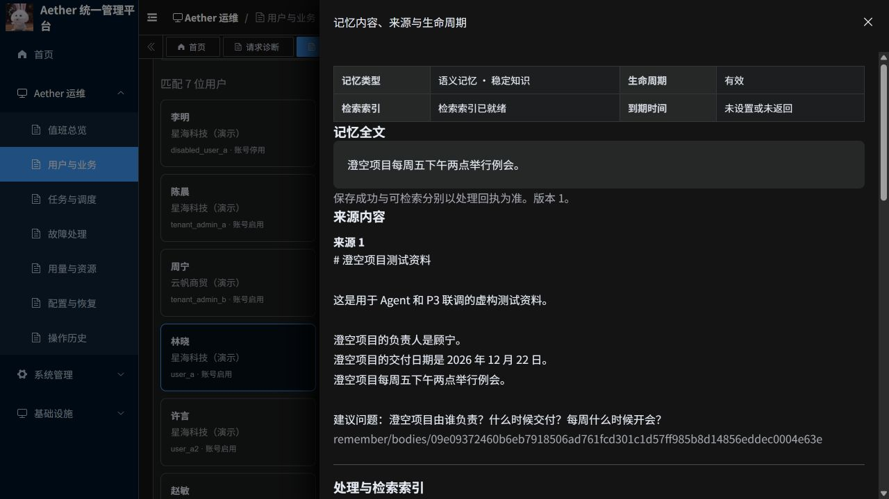
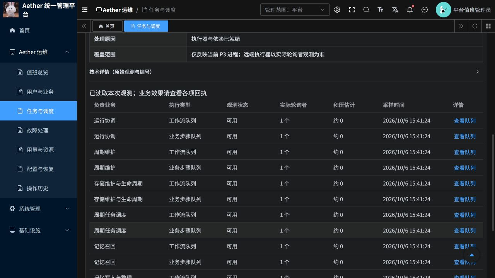

# P3 业务与 Temporal 运维后台：使用说明与验收结果

日期：2026 年 10 月 6 日。范围：若依后台的业务内容查看、P3 运行观测、Temporal 调度观测、菜单整合及云端发布。

## 1. 访问入口

- [若依运维后台](https://aether-p3-demo-c50c3827.southeastasia.cloudapp.azure.com/ruoyi/)
- [Agent 业务入口](https://aether-p3-demo-c50c3827.southeastasia.cloudapp.azure.com/ruoyi-agent/)

继续使用已有账号和密码。平台值班管理员查看跨企业运维信息；企业管理员只能读取授权企业的业务内容；普通业务用户不能进入运维内容接口。页面看不到新菜单时，请退出后重新登录以刷新菜单权限。

这次改造没有重置账号密码，也没有清空用户会话、记忆、停用状态或操作历史。

## 2. 怎样查看用户真正记住了什么

进入 **Aether 运维 → 用户与业务 → 按用户查看**，搜索姓名或账号，点击用户，再选择 **记忆内容与生命周期**。可以按记忆类型和生命周期筛选，点击内容摘要即可打开详情。

详情展示实际记忆正文、来源原文、记忆类型、有效状态、检索索引、处理任务以及已记录的存储维护信息。没有存储位置、热度或维护动作数据时，页面保留缺失说明，不会编造状态。

验收实际打开了“林晓 / 星海科技（演示）”的记忆，正文为“澄空项目每周五下午两点举行例会。”，来源为对应的虚构项目资料。正文来自当前 P3 读取接口，并非把保存回执当成记忆内容。

选择 **会话与召回**，可查看用户的问题、实际回复、保存状态及关联召回结果。召回详情展示返回的记忆、覆盖范围和上下文计量。检索返回一条记忆不等于模型实际采用了它；缺少后续证据时不会作此承诺。

每次正文读取都有独立授权检查与访问审计。即使从历史召回进入，也会重新检查当前权限和记忆生命周期，不能借历史入口读取已删除或已失效正文。

## 3. 七个页面分别做什么

| 页面 | 运维人员用它回答什么问题 | 本次合并内容 |
|---|---|---|
| 值班总览 | 能否接收业务？最近 24 小时请求情况如何？有哪些未恢复告警？ | 原运行总览升级，增加业务与任务入口 |
| 用户与业务 | 哪个用户出了问题？他说过什么？保存了什么记忆？召回了什么？ | 请求诊断、记忆状态合并 |
| 任务与调度 | 业务停在哪一步？Temporal 是否在执行？队列是否有人处理？ | 原任务页整合工作流、队列、周期维护和持续采样 |
| 故障处理 | 哪些告警需要认领？影响哪些业务？处置记录在哪里？ | 告警、支持工单和告警规则合并 |
| 用量与资源 | 企业使用量和配额是多少？已登记哪些依赖资源？ | 用量、配额、资源台账合并 |
| 配置与恢复 | 当前配置和发布是什么？有哪些备份和恢复验证记录？ | 配置发布、备份恢复合并 |
| 操作历史 | 谁查看了内容或做了操作？操作是否完成并产生效果？ | 审计和命令记录合并 |

用户、企业、角色及授权管理继续在“系统管理”。旧业务页面地址保留兼容跳转，旧重复菜单隐藏；历史业务记录和权限映射保留。

## 4. Temporal 可以看什么、操作什么

入口为 **任务与调度**。

| 标签页 | 可见信息 |
|---|---|
| 业务任务 | 业务类别、受影响企业和用户、任务状态、尝试次数、业务效果、处置入口 |
| 工作流执行 | 对应工作流实际状态、任务详情、步骤、等待原因、重试与检查信息 |
| 执行器与队列 | 当前 P3 进程状态、调度连接、队列负责业务、实际轮询者、积压估计、采样时间 |
| 周期维护 | 已绑定周期工作流及实际执行记录；没有可靠调度依据时不显示推算的下次执行时间 |
| 持续业务采样 | 请求失败、请求数量、记忆保存失败、等待保存、长时间未结束请求等持续指标 |

队列使用 Temporal DescribeTaskQueue 的实际返回值。积压是估计值；轮询者反映最近观测到的消费者，不等于完整主机健康监测。任务列表只对有界数量的工作流作实时查询，其余明确标记尚未逐项检查；打开详情会查询对应任务。

受控操作沿用 **申请取消、核对状态/结果**，要求原任务、当前版本和操作原因，并保留幂等与操作历史。结果未知时继续跟踪原操作，不能换编号重复提交。

没有开放任意重试、重置、强制终止或任意信号发送。若依提供统一管理入口，Temporal 仍承担执行调度，Python P3 仍承担记忆业务；这些底层服务不能因管理入口统一而退出。

## 5. 验收证据

| 编号 | 验证层 | 结果与范围 |
|---|---|---|
| E01 | Python 相关测试 | 98 项通过，覆盖内容读取、平台聚合、权限、审计、指标与 P3 管理诊断；包括专用 PostgreSQL 验证 |
| E02 | 前端测试 | 最终 45 项通过，含 22 个 Vue 组件编译及展示、命令、正文权限、分页统计等行为测试；就绪状态误译与可用数据误提示重试的问题已复现并修正 |
| E03 | Java 网关 | 12 项测试通过，网关构建成功；资源、参数和标识符受白名单约束 |
| E04 | 云端业务接口 | 用户查询、会话正文、实际记忆正文及来源、召回结果、任务详情和持续指标可读 |
| E05 | 云端隔离与审计 | 企业管理员可读本企业记忆；跨企业内容和全局诊断拒绝；普通业务用户拒绝；正文访问进入审计历史 |
| E06 | Temporal 实际观测 | 2026-10-06 15:19 左右取得 16 条队列观测，共观察到 16 个轮询者记录；工作流详情可读 |
| E07 | 导航及浏览器 | 七个菜单实际可见；旧请求页跳转到新业务页；真实记忆正文、来源和任务调度页已现场检查 |
| E08 | 发布 | 后端、平台、P3、前端镜像已构建并推送 ACR；部署及实际运行镜像以同目录发布清单为准 |

相关静态检查和生产镜像构建通过。以上是本轮改造的验证范围，不能外推为全仓库、全部 P3 业务或生产高可用验收。

云端查看和权限检查实际执行。本轮没有为演示控制按钮而取消、重跑或重置用户正在使用的业务任务；取消/核对的云端写操作没有新增验收结论，其边界由既有实现及相关测试覆盖。

## 6. 实际业务异常与统计口径

2026-10-06 15:19:40 的任务快照包含 **12,445 条本部署累计任务**：成功 12,121、已取消 251、需要人工处理 40、失败 33。这些是累计历史状态，不能解释为“现在有 73 起活跃故障”。业务效果统计独立显示，工作流结束不能替代业务生效回执。

上线验收期间仍有真实业务进入。只读查询确认：

- 15:14:53 创建的一次请求完成回复，但保存回执为失败，原因码为 `DEPENDENCY_UNAVAILABLE`，即依赖服务不可用。
- 15:16:37 创建的请求曾停留在检索阶段，随后转为失败。
- 15:26:54 创建的新请求已完成回复，观测时记忆仍在保存，回执为 `REQUEST_IN_PROGRESS`。这是一项时点观测，后续状态以页面刷新结果为准。

这些异常没有被清空，也没有通过重跑掩盖。仅凭依赖错误码，不能确定是哪项下游依赖或断言由本次发布造成。后台接入完成与业务异常恢复是两个不同结论。

## 7. 仍需保留的限制

- 全仓库 pytest 在收集阶段因缺少 `aether_agent_memory.p2.generated` 中止；本轮没有全仓库测试通过结论。
- 部分额外 Recall 回归缺少真实状态库等测试前提；未完成全核心回归。本轮没有完整前端 TypeScript 类型检查通过结论。
- 当前存储位置、完整物理容量、部分热度与维护数据尚未全面接入；“用量与资源”不能当作所有数据库和存储的容量监控。
- 部分历史任务的阶段说明缺失，部分原始事件尚无自然语言摘要，仍需展开技术详情辅助定位；本轮已优先完成用户内容和主要业务、调度状态的可读展示。
- 15 分钟业务指标按请求创建时间取窗口，不是按故障发生时间统计；持续采样覆盖平台对话回执，并不覆盖每一种 P3 内部动作。
- 当前是演示云部署，相关组件单副本。高可用、长期压力、灾难恢复及完整生产验收不在本轮完成结论内。

源码分支：`codex/ruoyi-platform-20261006`。主体提交：`e17fdb34`；页面验收修正：`fb441aa1`、`68eb7cb8`、`fd74b9ad`，均已推送。

原始测试、访问验证、镜像构建与菜单迁移备份保存在项目外工作区，正式报告不包含密码、令牌或业务原始日志。
