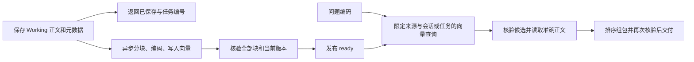

# Working 向量召回与历史补索引

日期：2026-09-30。适用基线：PRD V1.4；实现入口为 `AgentJYS-main` 的 P3 统一服务。部署基础配置沿用[统一服务运行指南](P3_统一服务运行指南_20260926.md)。本次交付更新源码，没有重启现有服务，也没有批量迁移运行中的数据。

## 保存与召回

Working 先保存正文、元数据和持久任务，再异步准备向量。保存回执中的 `saved=true` 或 `phase=saved` 不表示可语义召回。后台对实际交付正文分块、编码、写入并核验完整索引，确认当前版本仍有效后，才发布 `projection_state=ready`。



沿用 `POST /p3/remember`，保存时指定实际业务 `selection.session_id` 或 `selection.task_id`。查询 `GET /p3/remember/{memory_id}/processing` 或获准的 `GET /p3/memories` 目录，查看 `projection_state`；任务详情使用 `GET /p3/tasks/{task_id}`。

| 状态 | 含义与处理 |
|---|---|
| `pending` / `building` | 已保存，索引尚未发布；等待原后台任务推进 |
| `ready` | 当前版本完整索引已经核验；每次召回仍须核验权限、版本及生命周期 |
| `failed` | 索引处理失败；按原任务记录定位依赖或处理问题，再恢复/补索引 |
| `stale` | 旧索引失效，不能作为当前版本使用；更新后的版本需要重新建索引 |
| 历史 `not_required` | 旧 Working 尚未纳入向量就绪管理，需要显式补索引 |

仅 Working 的查询示例：

```http
POST /p3/recall
Authorization: Bearer <已配置凭证>
Content-Type: application/json

{
  "query": "早上的饮品要不要放蔗糖？",
  "selection": {"session_id": "当前会话编号"},
  "sources": "working",
  "token_budget": 1000
}
```

`sources=working` 同样执行问题编码与向量检索；`long_term` 查询长期，`both` 查询两路。Working 必须带当前会话或任务范围。身份与授权由服务端检查，不能通过查询参数扩大租户或资源范围。

存在可信部分结果时，返回覆盖限制；没有可信材料时，未就绪返回明确的 `REQUEST_IN_PROGRESS`，依赖不可用返回相应依赖错误。结构化向量后端失败优先于“索引准备中”，不能用正常空结果或词法匹配掩盖。只有所需范围查询完整且确无匹配时，才属于正常空结果。

需要查看已经保存的内容时，可使用获准的 `POST /p3/remember/body`，提交保存回执中的精确 `MemoryRef`。这条读取能力独立于语义召回，仍遵循权限和版本检查。

## 历史 Working 补索引

1. 按授权查看当前 Working 的版本、生命周期、正文与处理状态，确认它仍属于有效业务范围。
2. 对需要补齐的对象调用 `POST /p3/remember/{memory_id}/reindex`，带现有认证凭证。接口返回 `task_id` 和 `phase=processing`，只登记处理，不表示索引已完成。
3. 查询该任务及 `processing` 状态；当前版本达到 `ready` 后，再发起仅 Working 的语义查询验证。
4. 重复补索引复用当前版本尚未完成的投影任务，不重复抽取长期事实。摘要尚未完成时先恢复原摘要任务；不能直接跳过摘要并把原文索引当作摘要索引发布。

模型空间、维度或向量后端配置变化时，继续遵循现有显式迁移规则；不能给旧向量改标签并声称它属于新空间。Working 与长期通过 `memory_source` 分离，历史缺标签的向量按长期解释。

更正、摘要更新、删除、归档、到期及撤权会使旧资格失效。迟到写入可能留下待清理向量，但不能使失效内容重新进入 Recall。旧 Context 再取同样重新核验。

## 当前验证范围

本地验证覆盖真实 BGE 512 维编码、持久化 SQLite 向量后端、Working 语义召回、会话隔离和重启后召回。SQLite 向量实现用于本地链路验证，不代表 Milvus 的生产索引性能。真实 P2/Milvus、生产规模性能和长稳验证见[本次工程验收记录](../测试与验收/Working向量召回工程验收_20260930.md)的待验收范围。
