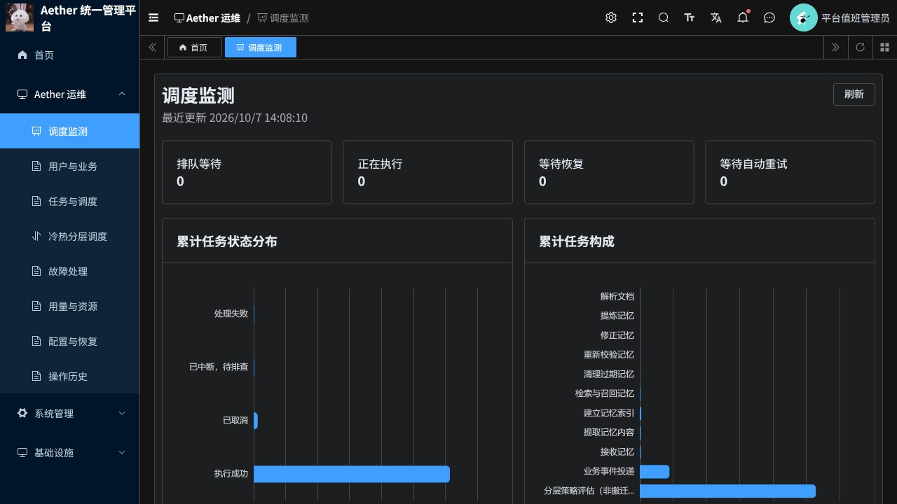
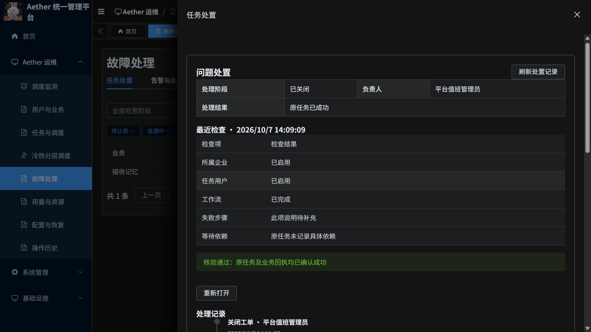
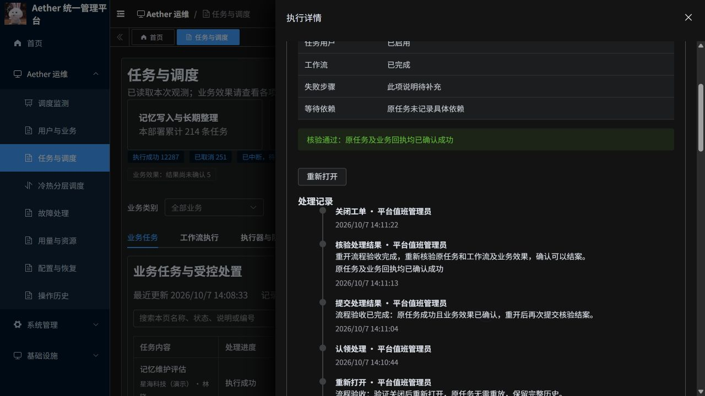
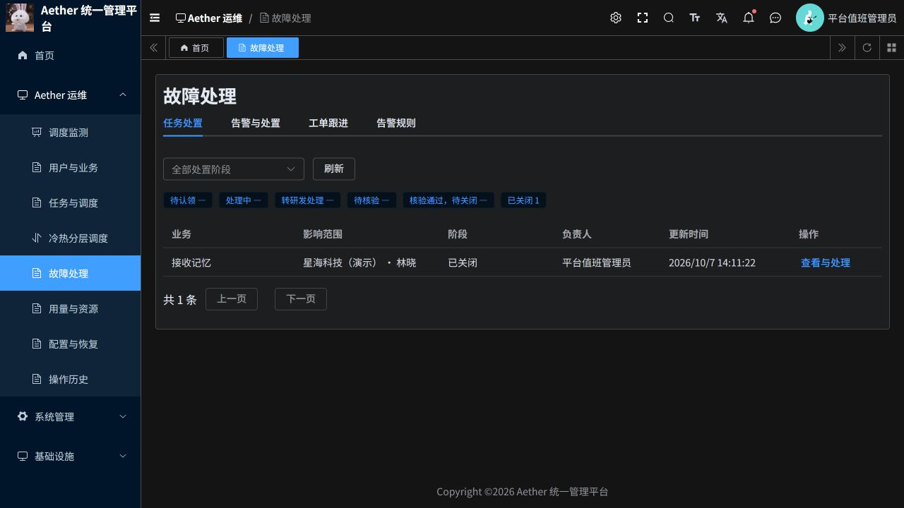

# 任务处置闭环更新与验收说明

日期：2026-10-07。若依前端及 Python 管理服务已发布到 aether-p3-demo，并完成浏览器流程验收。

## 运维怎么使用

1. 从“调度监测”的异常任务点击“查看原因与处理”，或从“任务与调度”打开任务详情。
2. 在“问题处置”建立工单并认领。系统保存负责人；其他人不能覆盖已有认领。
3. 点击“重新检查”读取原任务、工作流、已记录的步骤与依赖、所属企业及用户启用状态。按详情中的处理指引排查，使用“记录处理进展”保存做过的操作和结果。
4. 对有运行中工作流的活动任务，有任务执行权限的管理员可提交取消或核对原执行。对于账号、权限、依赖或代码问题，由相应管理人员修复；不能直接处理的，转研发并由接手人继续跟进。
5. 提交处理结果：原任务已成功；关联符合条件的后续成功任务；或确认无需继续执行并提交人工结案。人工结案必须由另一名有权限的管理员独立复核。
6. 点击“核验处理结果”。服务端重新读取任务、业务回执和工作流；证据不满足条件时不能关闭。核验通过后由核验人关闭，关闭前再次检查证据及核验时效。
7. 在“故障处理 → 任务处置”按阶段查看所有已建立的工单，打开详情查看完整时间线。已关闭工单可以填写原因后重新打开。

“转研发”保存交接状态与记录，由研发人员在后台接手；不会自动发送外部消息。已结束任务不支持通用原地重启。原任务有未知业务效果时不能靠人工说明绕过核验。人工结案仅表示管理上的处置结束，不把业务失败改成成功。

## 本次补齐的能力

- 恢复排队、执行、恢复、自动重试卡片，以及累计任务状态分布、累计任务构成图；保留业务执行情况表和异常任务清单。
- 任务关联工单、认领、处理进展、研发交接、检查、处理结果、核验、关闭、重新打开，以及完整操作历史。
- 前后端均限制权限。当前任务处置面向平台管理员，读取需运维读取权限，修改需工单执行权限，任务控制还需任务执行权限；租户管理员不能经此入口跨租户操作。
- 后续任务必须与原任务属于相同租户、用户、业务及完整对象版本，且工作流启动时间不得早于原工作流结束时间，防止拿旧成功记录结案。
- 提交超时保留原操作编号，查询原结果。控制请求在 P3 明确未接收时才使用同一编号、同一版本与参数恢复提交，避免重复执行业务。

## 验收证据

| 项目 | 结果 | 范围 |
| --- | --- | --- |
| 后端测试 | 58 项通过 | 包含真实独立 PostgreSQL 的状态机、并发认领、权限、作用域、独立复核、过期及变更证据、控制恢复、关闭与重开 |
| 前端测试 | 74 项通过 | 页面编译、状态及权限动作、既有运维展示回归 |
| 格式与变更检查 | 通过 | 修改文件 Ruff、ESLint、Prettier，git diff --check |
| 独立审查 | 阻塞问题修复并复核 | 修复旧任务错误关联及控制提交中断恢复两项问题 |
| 镜像发布 | 前后端均完成 | 工作负载 Ready，实际 imageID 与发布摘要一致 |
| 线上浏览器 | 完整流程通过 | 建单、认领、重新检查、记录进展、提交结果、核验、关闭、重新打开、再次核验关闭，列表与详情一致 |

线上验收使用星海科技（演示）已有成功任务，任务编号：
`67b020ab484e6435b60e3669fa2ce48e32089514e1840dd0ce2a2909a64dcc22`。

2026-10-07 14:08:49 建单，14:10:19 首次关闭，重新打开后 14:11:22 再次关闭。记录中明确标注流程验收。原任务已成功且业务效果已确认；本次没有重放、取消或唤醒该业务。线上活动任务控制、人工独立结案和后续任务关联由后端测试覆盖，未对实际历史失败任务执行这些操作。

当时调度页显示历史中断 40 条、历史失败 33 条。这 73 条历史异常未因本次流程验收而被修复或清零。部分历史记录缺少失败步骤或关联说明，页面仍会显示缺少记录，不能据此推断根因。

## 发布及回滚

命名空间：`aether-p3-demo`。仓库前缀：`aetherp3acr-a0bne7gpetbpdcbq.azurecr.io/aether/`。

| 部署 | 本次镜像 | 发布前镜像（回滚目标） |
| --- | --- | --- |
| aether-ruoyi-platform | ruoyi-platform@sha256:d8926cc20d20576a0a953bfa1b5918013a5364d24851d86fdf60fc280fe84430 | ruoyi-platform@sha256:18a82ac9a0bdd537116ddaf8c4e052a2f4a87224f1821586cf3e9bea8128f643 |
| aether-ruoyi-frontend | ruoyi-frontend@sha256:ad99da9694146d68423dfe06ff53acdf43f575cc7e2f6907227ea8b2a23f2929 | ruoyi-frontend@sha256:e7929acbf58ccb364e024922d42cc2254b7ee5e97254697afa97e8f83487cdd0 |

发布前确认没有待执行对话，按固定摘要滚动发布。数据库仅新增处置表。需要回滚时将上述两个部署恢复到发布前镜像，保留新增表与处置历史，不删除数据。未修改独立旧版系统、Java 网关或 P3 执行器。

代码更新至 [PR #20](https://github.com/csdnk/Ather-AIAgent/pull/20)，目标分支为仓库当前的 `codex/project-workspace`，不自动合并。用户指定暂不修复的两类旧 Python CI 问题不在本次改动范围。
