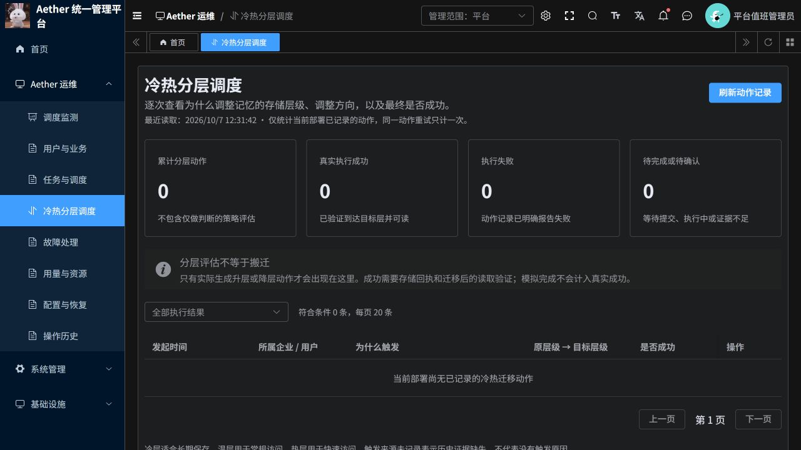

# 冷热分层独立监测更新说明

日期：2026-10-07；云端核对时间约 12:31（北京时间）。

已从“调度监测”删除“周期维护”和原“冷热分层调度”两个独立区块，新增菜单“Aether 运维 → 冷热分层调度”。执行器队列表仍保留原业务队列观测。

入口：[冷热分层调度](https://aether-p3-demo-c50c3827.southeastasia.cloudapp.azure.com/ruoyi/aether/placement)。使用现有平台管理员账号。

## 页面提供什么

| 运维问题 | 页面展示 |
| --- | --- |
| 为什么触发 | 记忆新增或状态变更、成功读取、到期自动检查；另列实际决策依据 |
| 为什么要调整层级 | 记录中的基础缓存策略说明，或当时热度、策略判断的适合层级 |
| 从哪里到哪里 | 原层级 → 目标层级，升降层每次只调整相邻一层 |
| 是否成功 | 成功并已验证可读、失败、等待提交、执行中、结果待确认、模拟完成、取消 |
| 何时执行、用了多久 | 发起时间、最近回执时间、发起至结果确认的间隔；缺少终态回执不填 0 |
| 影响谁、哪条记忆 | 企业与用户名称、记忆编号和版本；可打开关联任务 |
| 后续清理如何 | 旧副本清理状态，与迁移动作结果分别展示 |

列表支持按结果筛选、每页 20 条及前后翻页。同一动作被多个恢复任务引用时只统计一次。

## 当前实际结果与限制

- 云端当前部署查询返回 **0 条已记录的迁移动作**，页面正确显示空状态。没有添加演示迁移记录，也没有主动触发生产迁移。
- 累计 12,611 个任务中，策略评估与真实动作分开统计。评估次数不能解释为发生了同样次数的数据搬迁。
- 新动作开始记录真实触发来源；旧记录缺少来源时显示“触发来源未记录”。不会用当前热度或当前事件补写历史原因。
- “真实执行成功”必须通过现有 ActionRecord 证据校验：原动作、提供方实例、记忆版本与作用域、目标层、内容哈希、读取证明及执行方式一致。模拟证据不计为真实成功。
- 尚无线上动作样本，因此本次线上验收覆盖菜单、查询、空状态、筛选和权限；有动作的成功、模拟、证据缺失、错误目标/哈希/实例、失败、去重和分页以本地测试验证。
- 新查询直接读当前部署动作，不再等待 Temporal 队列描述或周期工作流。四次认证后 HTTP 查询耗时为 0.794、0.825、0.721、1.169 秒；这是本次空记录查询耗时，不是满量数据性能承诺。
- 不调整分层策略、周期频率、现有工作流历史、业务数据或旧版部署。

## 验证证据

| 编号 | 验证 | 结果 |
| --- | --- | --- |
| PM-01 | Python 平台及 AKS runner 单元测试 | 187 passed，74 skipped |
| PM-02 | 前端单元测试及 Vue 组件编译 | 63 passed；修改 Vue 文件 ESLint 与格式检查通过 |
| PM-03 | ACR 镜像发布与 AKS 实际运行镜像摘要 | 三组件均运行对应摘要，Recreate，单实例 Ready |
| PM-04 | 认证后分层接口、筛选和页面菜单 | 返回真实空记录，筛选生效，旧区块删除 |
| PM-05 | 企业管理员访问控制 | 菜单隐藏，直接请求分层诊断返回 403 |
| PM-06 | 完整 Temporal 工作流测试 | 10 项未能启动：补齐 Temporal CLI 后仍缺少 P3_TEST_REDIS_HOST；不计通过 |

74 个环境依赖测试跳过不等于通过。保留既有两项 Python CI 格式问题；未宣称完整 CI、存储迁移端到端、长稳、高可用或合同性能验收通过。

## 发布与回退

分支：`codex/ruoyi-platform-20261006`。PR：[19](https://github.com/csdnk/Ather-AIAgent/pull/19)，目标 `codex/project-workspace`，保持未合并。

命名空间：`aether-p3-demo`。仓库：`aetherp3acr-a0bne7gpetbpdcbq.azurecr.io/aether/ruoyi-<component>`。

| 组件 | 标签 | 摘要 |
| --- | --- | --- |
| p3 | `source-011188ed7dfb8b01` | `sha256:78c1abb70be739d91cfc2b832814c23f26ea4e51390a65773e9e34174f381ffa` |
| platform | `source-bc73e83657a4635e` | `sha256:18a82ac9a0bdd537116ddaf8c4e052a2f4a87224f1821586cf3e9bea8128f643` |
| frontend | `source-b2b298e8c38ea03d` | `sha256:c4aa4e0d80793c2892c83fe5c398ce3d5ec66b12a0172dd365140151877a0055` |

菜单编号 60016，仅授予已有平台管理员角色 51001；初始化与增量 SQL 同步更新。没有新增操作权限。

回退时将对应 Deployment 的镜像依次恢复为下列摘要，保留 Recreate，等待前一个实例结束后再启动。停用菜单 60016 并刷新原生菜单权限缓存；保留全部业务数据和新增触发记录，无需删除数据表或重置工作流。

- p3：`aetherp3acr-a0bne7gpetbpdcbq.azurecr.io/aether/ruoyi-p3@sha256:62cac6e298db1a6fdea36100ba583ed18c124e901b14f01a44e61e3166eb9be7`
- platform：`aetherp3acr-a0bne7gpetbpdcbq.azurecr.io/aether/ruoyi-platform@sha256:54ca12133bc29cbc29a5d1ffdac9cbe646d0dbf33e288f38de4b8180fe5bde6a`
- frontend：`aetherp3acr-a0bne7gpetbpdcbq.azurecr.io/aether/ruoyi-frontend@sha256:7cb412b9a17e94f521196a644c63a198a5bb9bccb6f10ebb475bae6efb46157a`

## 实际页面

