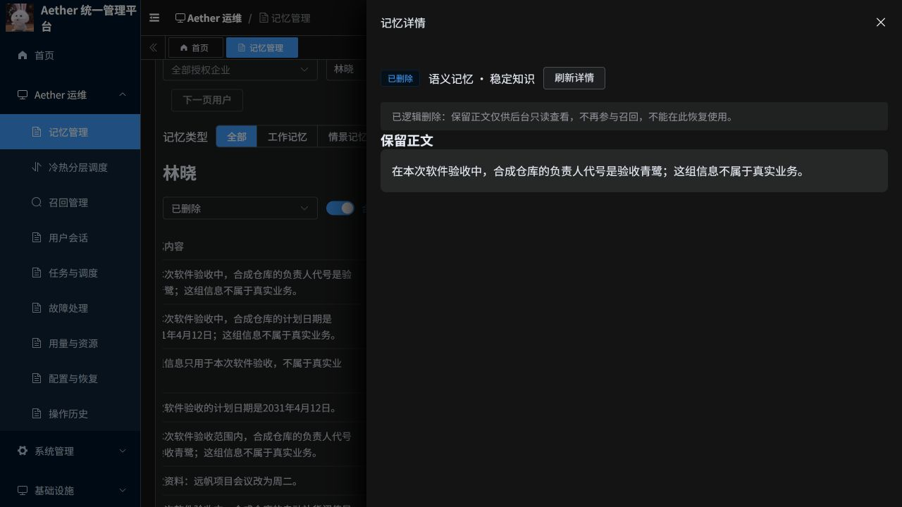

# 归档与逻辑删除记忆查看

日期：2026-10-07。分支：`codex/scheduling-task-triage-20261007`。PR：[20](https://github.com/csdnk/Ather-AIAgent/pull/20)。

## 操作含义

| 操作 | 业务是否继续召回 | 后台正文 | 恢复使用 |
|---|---|---|---|
| 归档 | 暂停 | 有权限的管理员可查看保留正文 | 可通过“恢复使用”重新准备索引；来源撤销或过期时仍受业务校验限制 |
| 逻辑删除 | 停止 | 有权限的管理员只读查看保留正文 | 当前页面不支持恢复已删除记忆 |

归档改变使用状态，不等同于冷热分层中的存储迁移。删除会提交删除标记，并安排清理索引和缓存；当前实现保留正文，不代表已经物理擦除。

## 修复内容

原后台详情明确拒绝已删除记录，又沿用召回资格检查，使归档正文也无法查看。现在增加后台保留正文读取路径：只有具备内容读取权限的管理员才能使用，按企业、用户、应用和 Agent 校验范围，在读取前后重新验证权限及记录版本。

列表可显示归档和逻辑删除记录的正文摘要，详情显示保留全文；逻辑删除记录不显示修改、归档、删除或恢复操作。确认框明确解释两种操作的影响。默认列表仍显示有效记忆，选择“已删除”或“已归档”可查对应记录。

保留正文直接读取原存储对象，不从业务缓存恢复，也不把读取结果重新放入业务缓存。完整正文校验内容哈希，摘要保持有界读取。不返回失效来源的原文，不改变原始删除状态、业务召回资格或历史召回失效结果。正文确实不存在、存储暂不可用、完整性校验失败分别显示原因。

## 验证

- R01：68 项 Python 定向测试通过，覆盖归档及删除正文可读、业务读取仍拒绝、普通账号及缺权限管理员拒绝、跨范围拒绝、权限和版本并发变化拒绝、原正文缺失时不回退缓存。
- R02：87 项前端 Node 测试通过；修改文件 Ruff、格式、ESLint、Stylelint 及 diff 检查通过，生产前端构建成功。
- R03：独立代码审查无待处理发现。
- R04：云端演示用户存在 13 条已逻辑删除记录，13 条均返回摘要；抽查一条完整正文成功，读取约 0.682 秒，状态和对象修订号与读取前一致。同一记忆以另一用户范围请求，业务错误码为 403（HTTP 外层为 200）。
- R05：浏览器已在“已删除”筛选下显示实际摘要，并打开一条已删除记忆，确认有保留全文及只读说明，没有修改或恢复按钮。
- R06：此演示用户没有归档记录，云端未修改数据制造样本；归档路径由本地测试验证。本次未新增、删除、归档或恢复任何线上记忆。没有执行完整系统测试或压力测试。

## 发布与回滚

目标：资源组 `aetherstore-p3`、AKS `aks`、命名空间 `aether-p3-demo`、ACR `aetherp3acr`。本次更新若依 P3 和前端，运行 Pod 镜像摘要核对一致；Java 网关及 Python 管理服务沿用现有版本，独立旧系统未变更。

镜像仓库前缀：`aetherp3acr-a0bne7gpetbpdcbq.azurecr.io/aether/`。

| 组件 | 本次摘要 | 发布前摘要 |
|---|---|---|
| ruoyi-p3 | `sha256:01534f69bfb3ed8a880e3635801f62cb6ddacace176dd5ebda708322a1989d37` | `sha256:47c2d045506dc47f971eb87e133a672b00cf48566d914b6e7c61ea02fac8e7a3` |
| ruoyi-frontend | `sha256:d2c82ed8fbc3318eb19c528d27bd66d68ff54f39cc68629da78a1319783de37a` | `sha256:3797baaaaaa9c5f7fadec3b2767a48e43bf7f0efc076b0c1989b01dbc91179e6` |

发布前已保留部署快照并检查在途业务。此次没有数据迁移，回滚可在核对在途任务和资源归属后恢复两个原镜像摘要，再验证登录和内容读取；不要删除记忆记录或存储对象。构建、部署和接口原始证据单独保存在工作区；测试结果见上表。
