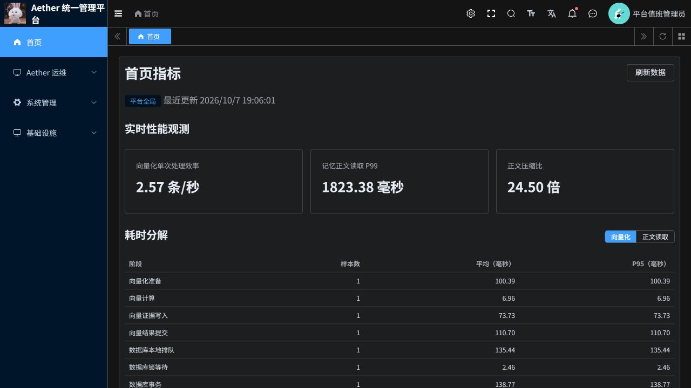
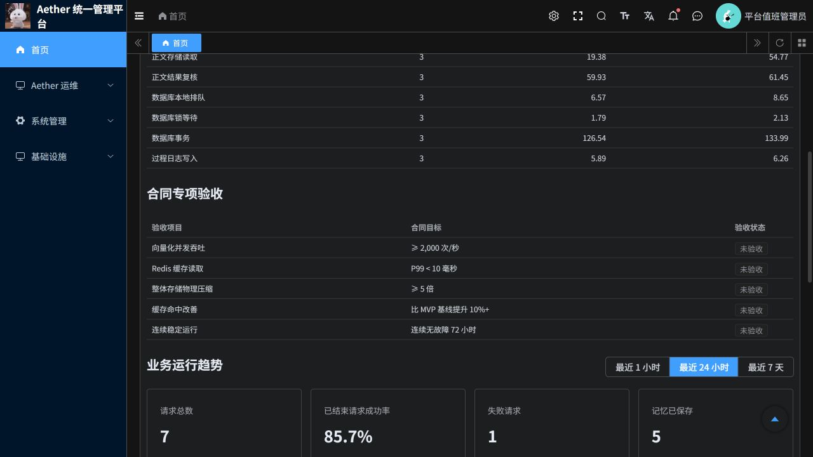

# 性能口径与真实链路优化：发布及验证说明

日期：2026 年 10 月 7 日。范围：若依版本 P3、Python 管理服务与前端。PR：[#20](https://github.com/csdnk/Ather-AIAgent/pull/20)。

## 1. 本次结果

真实阶段耗时、首页口径纠正、正文重复读取优化、处理状态关联查询优化已实现并发布到云端。三次同一条短期记忆的完整详情读取平均缩短约 19%；正文读取与处理状态查询分别缩短约 25% 和 31%。这是小样本路径复测，不是吞吐压测或合同验收。

向量化阶段埋点已定位排队和前后事务的主要开销；本次未改写共享事务、身份撤权或向量证据持久化协议，不能声称向量化收尾开销已经消除。完整长期召回仍需数十秒，属于明确剩余问题。

访问：[若依后台首页](https://aether-p3-demo-c50c3827.southeastasia.cloudapp.azure.com/ruoyi/index)。账号及角色沿用现有配置。

## 2. 实现内容

- 原有总耗时起止点不变，新增向量化准备、实际编码、证据写入、结果提交，以及正文读取准备、存储读取、结果复核等阶段。另记录进程内数据库排队、数据库锁等待、事务和过程日志写入。
- 原生编码线程传递观测上下文；嵌套节点独立采集；取消后停止接收晚到的阶段数据；观测故障不覆盖业务结果。
- 正文读取移除先恢复正文、再重新读取解码的重复过程。同一次请求只调用一次正文存储读取，保留读取前授权与读取后权限、对象修订和来源有效性复核。
- 处理状态查询由拉回所有历史任务，改为数据库筛选与当前记忆相关的任务，再沿批次和衍生记忆关系查找。保留历史失败、批次父任务、传递关系和去重，不将历史任务抹掉。
- 首页展示“向量化单次处理效率”“记忆正文读取 P99”“正文压缩比”，并将五项合同目标独立列为专项验收。耗时分解显示真实样本数、平均值和 P95。
- 历史日志没有阶段信息时保留缺失状态，不能补零。阶段耗时有包含关系，不能逐行求和；数据库事务包含锁等待及事务内业务步骤，不等于纯 SQL 执行时间；过程日志不含最终返回日志自身写入。

## 3. 同一记忆优化前后

证据 R1/R2：同一用户 `demo_user_a`、同一条 90 字符的有效 Working 记忆、三次串行详情读取，均成功且命中缓存。前后样本分别从 UTC 10:55:50、11:03:34 开始。内容不进入报告或通用审计。

| 路径 | 优化前平均 | 优化后平均 | 本次下降 |
|---|---:|---:|---:|
| 完整记忆详情 API | 1924.46 ms | 1559.89 ms | 18.9% |
| P3 正文读取 | 213.75 ms | 159.80 ms | 25.2% |
| P3 处理状态查询 | 831.64 ms | 571.66 ms | 31.3% |

外部 API 包含本机到云端网络、网关、管理服务及详情其他数据读取。该对比无并发压测，不能推算容量或生产 P99。

上线后的三次正文读取分别为 199.53、144.34、135.53 ms。实际缓存正文读取阶段分别为 54.77、1.86、1.53 ms；前后权限和结果复核约占 128–138 ms。首个读存储样本较慢，不能用后两个热读代表所有请求。

页面仍显示历史 P99 1823.38 ms，是因为统计保留最近 24 小时历史成功样本。本次没有删除旧慢请求或重置统计来制造改善。向量化单次处理效率同样保留 24 小时历史数据，页面 2.57 条/秒不是本次模型纯计算速度。

## 4. 向量化与完整召回的真实瓶颈

证据 E1：新版本一次正常长期召回中，向量化节点总耗时 298.479 ms：

| 阶段 | 耗时 |
|---|---:|
| 准备及授权 | 100.390 ms |
| 实际向量计算及校验 | 6.965 ms |
| 向量证据写入 | 73.734 ms |
| 结果提交及授权复核 | 110.696 ms |
| 进程内数据库排队（包含在上述阶段内） | 135.436 ms |
| PostgreSQL 锁等待（包含在上述阶段内） | 2.464 ms |
| 数据库事务（包含在上述阶段内） | 138.768 ms |
| 过程日志写入（部分位于上述阶段内） | 13.930 ms |

这个样本约 2.3% 的节点时间用于实际向量计算。不能把全部剩余时间都归给数据库锁；当前测到的主要问题是同一进程共享数据库连接的排队和授权/提交事务。代码中 `RuoyiAuthenticator.revalidate` 会在调用者事务内访问身份状态 HTTP 接口，事务占用期间其他工作等待，这是结构性串行开销。不同租户也共享底层全局事务锁；本次没有改变其一致性协议。

证据 Q1/Q2：优化前后用相同查询、用户、长期来源及 256 token 预算执行一次正常召回，均沿原命令编号查询到成功，没有重新提交新编号覆盖未知结果。

| 路径 | 优化前 | 优化后 |
|---|---:|---:|
| 管理端召回命令观察时长 | 87.98 s | 82.23 s |
| 候选发现 `recall.assembly.discover` | 42.59 s | 43.86 s |
| 结果组装 `recall.assembly.assemble_discovered` | 28.88 s | 21.24 s |
| 投影就绪检查（包含在发现内） | 8.12 s | 8.07 s |
| 候选搜索（包含在发现内） | 6.31 s | 6.28 s |

命令观察时长包含受理、查询和轮询等待，不等于 Agent 首页 Recall P95。父子阶段不可相加。每侧只有一次召回，不能据此宣称稳定提升 6.5%；结果组装确有下降，但发现阶段没有改善，完整召回慢的问题仍然存在。

下一步需要针对共享事务内远程授权、投影就绪查询和候选发现中的逐项核验设计批量处理及授权版本栅栏，保留撤权即时拒绝、租户隔离、来源与版本复核。应先用相同身份撤权/并发更新用例验证，再以完整召回持续观测验收，不能只去掉校验或缩短计时区间。

## 5. 指标与合同边界

| 当前观测 | 实际含义 | 合同验收仍需 |
|---|---|---|
| 向量化单次处理效率 | 成功向量数 / 成功调用累计耗时，含授权、计算、证据及提交 | 旁路拦截与向量化完整路径的并发吞吐压测，≥2,000 QPS |
| 记忆正文读取 P99 | 完整 Working 正文读取，含授权、存储和结果复核 | 合同约定的前台 Redis 接口 P99 <10 ms；两者口径不同 |
| 正文压缩比 24.50 倍 | 一份此前合成文档的已发布正文从 99,440 字节到 4,059 字节 | 原文、对象存储、索引、向量、元数据等整体物理空间核算，≥5 倍 |
| 缓存命中改善 | 尚无可靠基线比较 | 与 MVP 同数据、同负载对比，提升 10%+ |
| 连续稳定运行 | 本轮发布与短时真实路径验证 | 满足性能要求并连续无故障运行 72 小时 |

五项专项验收均显示“未验收”，不是清零失败数据，也不是宣布指标达标。召回记忆返回图的原始时间边界保持不变：Agent 调用 P3 Recall 前开始，首次取回并核验结果后结束，不含后续来源展开及模型回答生成。

## 6. 验证与证据

- T1：341 项 Python 测试通过，107 项因现有可选测试配置跳过，1 项 Starlette/httpx 弃用警告。包括真实独立 PostgreSQL 的任务关联、事务交付、心跳、阶段采集与原生向量化前后授权测试；无云端业务库测试写入。
- T2：91 项前端 Node 测试通过，覆盖指标展示及既有权限/界面逻辑；前端和两个 Python 镜像构建成功。修改文件静态检查、格式和 diff 检查通过。
- T3：完整 pytest 收集发现 2,758 个测试后，受既有 `aether_agent_memory.p2.generated` 缺失阻断。没有宣称全量测试通过。
- V1：独立代码审查未发现已确认的 P1/P2 阻断问题；确认任务查询仍处于业务事务，未把本次查询优化描述为消除全局锁。
- D1：三个服务运行 Pod 摘要均与推送 ACR 的不可变摘要一致。未改动 Java 网关、独立旧版部署及现有模型绑定、租户、凭证、记忆状态。
- H1：首页性能 API 在本次样本约 2.18 秒返回，三项指标可用，向量化和 Working 阶段数据均非空。平台管理员浏览器验证切换阶段表、历史数值及合同验收表。
- R1/R2、E1、Q1/Q2 的原始脱敏执行记录保留在项目外工作区，报告只保留必要标识与结论。未写入用户正文、凭证或 kubeconfig。

复核标识：正文记忆 `03322a708cbfea038035bc6b61ea7c46cebe8e40675ae48879971036da699b6f`；优化前召回任务 `85a6fef377a216b10a29ca2696d341c223b004e89cec10eebfe8a98316553c47`；优化后召回任务 `e11b856864d7a062a95ab372347a4fe67156a5c832ef8411ab770dda3ea0bd5b`；新向量化 span `15fb674eb687ab32`。这些只是证据索引，不是性能达标声明。

## 7. 发布与回滚

Azure 资源组 `aetherstore-p3`，AKS `aks`，命名空间 `aether-p3-demo`，ACR `aetherp3acr`。本轮无数据库结构迁移；新阶段字段兼容旧日志，缺失时显示无样本。

| 服务 | 本轮运行镜像 | 发布前回滚镜像 |
|---|---|---|
| p3 | `aetherp3acr-a0bne7gpetbpdcbq.azurecr.io/aether/ruoyi-p3@sha256:b4b6ebf64e7aee78bd604f3cd84113f355af52def1657682b13e20bc2ffcea0e` | `aetherp3acr-a0bne7gpetbpdcbq.azurecr.io/aether/ruoyi-p3@sha256:b49a99ad9ffb19537bbb2a8302c8d6f4ea75b0f3624b8e6711ee8af26eb8d52d` |
| platform | `aetherp3acr-a0bne7gpetbpdcbq.azurecr.io/aether/ruoyi-platform@sha256:18bd01b1c2d2b34ca7a9920fa5c78041d4a79bf953f8121b9b42e443a140ad8d` | `aetherp3acr-a0bne7gpetbpdcbq.azurecr.io/aether/ruoyi-platform@sha256:ce7d0d9aa535c531943c8873d9d3350168d60e70389115beae50e400d0417661` |
| frontend | `aetherp3acr-a0bne7gpetbpdcbq.azurecr.io/aether/ruoyi-frontend@sha256:e64b4f270e7e8ed6d0bbf15376b04f7cd733e2b0255af084cd79c8deaf0f4289` | `aetherp3acr-a0bne7gpetbpdcbq.azurecr.io/aether/ruoyi-frontend@sha256:437650a1829d50ee85c4cfc86e1709a2767b8b27924b6e056963305a08ae6583` |

回滚时先确认无运行中业务请求，再将这三个 `aether-ruoyi-*` Deployment 恢复上表镜像并核对实际 Pod imageID。部署策略为 Recreate，回滚存在短暂停服窗口。无需删除新增日志或业务数据，不自动合并 PR。

## 8. 线上页面

