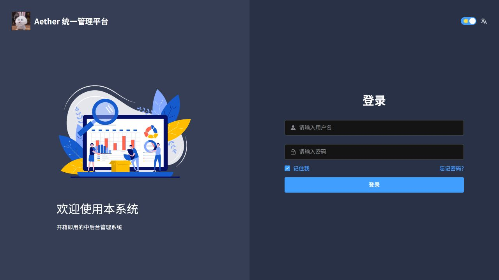

# 登录页精简

已删除手机登录、二维码登录、注册入口、微信/钉钉/GitHub/支付宝登录图标及“其他登录方式”区域。同时删除“萌新必读”及开发指南、视频教程、面试手册、外包咨询链接。

登录页仅保留账号密码登录、记住我和原有忘记密码入口。移除了登录页中加载的其他登录表单和无用社交登录处理代码；本次为前端入口精简，没有修改后端认证协议或账号权限。

2026-10-07 已完成修改文件 ESLint、Prettier、git diff 检查，生产构建成功。新镜像已推送 ACR 并发布到 aether-p3-demo 的 aether-ruoyi-frontend；浏览器确认多余入口不再显示，现有管理员通过账号密码登录成功并进入首页。

本次镜像摘要：`sha256:050165dce02121d942820716527e54b87edbe76dcb3acbcd65bd92a23552f6d2`。
回滚摘要：`sha256:ad99da9694146d68423dfe06ff53acdf43f575cc7e2f6907227ea8b2a23f2929`。
镜像仓库：`aetherp3acr-a0bne7gpetbpdcbq.azurecr.io/aether/ruoyi-frontend`。

