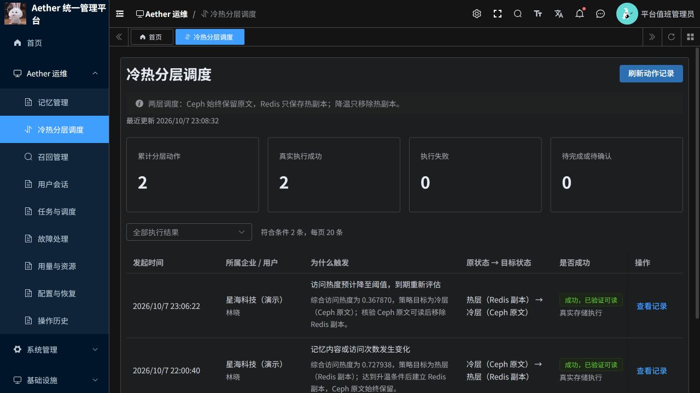
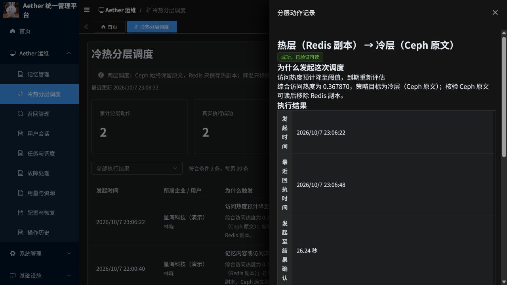

# 真实云端冷热分层部署与验收

验收日期：2026-10-07（北京时间）；最终检查时间见表。

## 结论

已在现有若依云端环境部署 PR21 集成版本，并通过正常保存、召回路径完成真实升温迁移。自然降温已完成，Redis 热副本已移除，Ceph 原文保持完整；后台能查看两个方向的成功记录。

后台：[Aether 运维 → 冷热分层调度](https://aether-p3-demo-c50c3827.southeastasia.cloudapp.azure.com/ruoyi/aether/placement)。使用原平台管理员账号，可点击“查看记录”及“查看关联任务”。

这里的冷热迁移是副本管理：Ceph 始终保留权威原文，升温时创建 Redis 热副本，降温时核验 Ceph 原文后移除 Redis 热副本。

## 真实业务过程

- 企业：星海科技（演示）；用户：林晓（demo_user_a）。独立验收会话：`placement_acceptance_20261007_1357`。
- 通过后台正常命令接口保存一条明确标注“调度迁移验收数据”的记忆，再串行执行 9 次正常 Working Recall。每次均真实返回同一条记忆。未直接写入热度、修改策略阈值、伪造完成状态或手工创建热副本。
- 停止召回后保持默认指数衰减策略，升温阈值 0.70、降温阈值 0.55、衰减尺度 3600 秒、评估合并窗口 60 秒。
- 升温后后台详情读取路径实际变为 cache。为避免重新增加热度，降温等待期间不再调用 Recall；物理核对及后台详情读取不产生 recall.access。
- 发布触发原因显示修复时重启过 P3；热副本、成功记录和持久降温计划均保留。

| 发起时间 | 实际动作 | 决策热度 | 原始触发原因 | 核验结果 | 发起至回执 |
|---|---|---:|---|---|---:|
| 2026-10-07 22:00:40 | 建立 Redis 热副本 | 0.727938 | 记忆内容或访问次数发生变化 | 成功，已通过真实读取验证 | 3.756 秒 |
| 2026-10-07 23:06:22 | 移除 Redis 热副本 | 0.367870 | 热度下降，到期重新评估 | 成功，已通过真实读取验证 | 26.24 秒 |

- 两次业务任务均为 succeeded、effect_status=confirmed，实际 Temporal 工作流均已 completed。升温工作流于 22:00:52 完成；降温工作流于 23:07:34 完成。
- 降温完成后，第 10 次正常 Working Recall 于 23:08:23 成功返回原验收记忆正文；23:08:55 再核对时 Redis 仍无副本，Ceph 原文和缓存位置一致。

## 物理存储与数据库一致性

从实际运行的 P3 Pod 使用现有配置，独立只读检查 Ceph、Redis 与 PostgreSQL。检查只保留对象字节数、摘要、位置和动作证据，不输出连接凭证。

| 检查时间 | Ceph 原文 | Redis 热副本 | MemoryRecord.cache_location |
|---|---|---|---|
| 2026-10-07 21:58:15 | 存在，132 字节 | 不存在 | 未登记 |
| 2026-10-07 22:01:16 | 存在，132 字节 | 存在，132 字节 | 已登记 |
| 2026-10-07 23:07:40 | 存在，132 字节 | 不存在 | 未登记 |
| 2026-10-07 23:08:55 | 存在，132 字节 | 不存在 | 未登记 |

原文及热副本 SHA-256：`ffaa2bb83caf01277d001fe8549a45ec59c193db1f6d888ea554d05b959c3be2`。Ceph 的 body_location 在整个过程中保留。热副本 TTL 为 24 小时，本次降温在 TTL 到期前发生，因此清理不是自然过期造成。

## 后台展示与权限

- 已修复新策略触发原因被旧接口白名单隐藏的问题；页面使用中文说明访问变化、阈值到期、升级重评估及重试原因。仅展示已知原因，未知原始字符串继续屏蔽。
- 云端降温验证发现并修复周期分页遗漏：调度模块最多返回 64 条，周期执行器却把不足自身预算的一批当成已遍历完毕，跳过后续到期项。现在持续从已提交游标读取，直到无记录或达到既有数量/时间预算。保留原任务、热度和到期计划，不通过数据库补写成功状态。修复提交 `96ca4eab`。
- 继续排查发现原管理员登录凭证在 22:29:07 到期，早于预计降温时间 22:30:09；自动调度错误依赖了该交互凭证。现改为服务端为单条记忆、版本及对应任务建立专用分层授权，逐次校验当前账号、租户、角色权限及目标用户。旧到期项通过持久原事件核对和当前授权核验后采用，并记录来源与采用时间；不续期登录、不修改旧热度或到期时间。原交互命令仍受登录有效期限制。授权限制为读取绑定记忆及对应分层任务/动作，禁止借此创建普通记忆、删改正文或运行其他工作流。修复提交 `a0dec572`。
- 专用调度授权回归及原有管理员操作/读取权限检查合计 100 passed；调度触发选集 29 passed，其中新用例使用真实本地 PostgreSQL、TLS Redis 验证专用授权执行副本动作，Ceph 与若依状态使用明确的测试替身。独立代码审查发现跨任务恢复原动作的兼容问题，已修复并复核；必须保留完整原 intent、memory/version、pending 与 task-action 关联，不另造动作重投。
- 云端实测：本企业管理员可读取验收记忆；另一企业管理员读取同一记忆返回业务码 404；两类企业管理员查询平台级迁移监测均返回业务码 403。若依网关的 HTTP 状态为 200，授权结果以响应业务码为准。
- 后端相关检查 67 passed；前端完整 Node 检查 93 passed；修改文件 Ruff、差异检查通过；独立审查无阻断发现。这些检查与真实云端存储验收分别取证。
- 分页修复回归：74 条记录、单批预算 100 的用例在旧代码下遗漏后 10 条，修复后完整且不重复；另覆盖预算 16 的跨批次恢复。扩展选集 42 passed，4 项因缺少本地独立 Ceph 测试配置在环境准备时失败；不宣称这 4 项通过。周期/保留/真实 PostgreSQL 时间预算选集独立复核为 14 passed（与上述 42 项重叠），完整调度触发测试 28 passed。使用真实本地 PostgreSQL、TLS Redis 和 Temporal 测试服务。

## 发布基线与回滚

云资源：资源组 `aetherstore-p3`，AKS `aks`，命名空间 `aether-p3-demo`，ACR `aetherp3acr`。源码包含 PR21，以及集成时修复的旧版本任务阻塞新版本问题；展示修复提交为 `f10b3b68`，到期队列分页修复为 `96ca4eab`，持续调度授权修复为 `a0dec572`。

最终运行镜像：

- p3：`aetherp3acr-a0bne7gpetbpdcbq.azurecr.io/aether/ruoyi-p3@sha256:ca190512cc970ad730b143d45218fa04c051fcde4e8b0352b3af4b9e03651fa4`
- platform：`aetherp3acr-a0bne7gpetbpdcbq.azurecr.io/aether/ruoyi-platform@sha256:a82f8e2a5e105c34adb7e41ea810d94977bd8b833a400018b79313a04d7dac43`
- frontend：`aetherp3acr-a0bne7gpetbpdcbq.azurecr.io/aether/ruoyi-frontend@sha256:1c49486855e9b8b9e85619c59ec13e767382fac2a69374b0991a58b30d43fb74`

本轮开始前回滚镜像（先核查运行中任务与未知副作用，使用不可变摘要；不清空数据库、Redis 或工作流记录）：

- P3：`sha256:b4b6ebf64e7aee78bd604f3cd84113f355af52def1657682b13e20bc2ffcea0e`
- Python 管理服务：`sha256:18bd01b1c2d2b34ca7a9920fa5c78041d4a79bf953f8121b9b42e443a140ad8d`
- 前端：`sha256:e64b4f270e7e8ed6d0bbf15376b04f7cd733e2b0255af084cd79c8deaf0f4289`

Java 网关本轮未更新；未执行数据库结构迁移。独立旧版系统未切换。

## 证据编号与范围

记忆编号：`e28c61a980555ec146bf5ce93cb8b564edf0c5cee9917d425779291bc38bc658`，第 1 版。

- demote：动作 `c358306c502a27e306c62a27b588a313b13b606af259797e5aaf602275601d22`；任务 `05f431f5f7e545c0d1da141a2e0412dd2f63dd67909ff8ec8ff8b344c84b9047`。
- promote：动作 `ea9367bf4e32a114212adc392e7b03e2433a8c48d2bcbb0a9fc0bca40f24c6c0`；任务 `3d7161a8b9551dc0b368aef9f3bc8f13ffd29a2bdaae28a7a1e0b8bca1ba48ac`。

初始保存命令：`placement_acceptance_20261007_1357_create_0`。升温前 9 次召回命令后缀为 `_recall_1` 至 `_recall_9`，降温后可读性验证为 `_recall_10`，均保存了原请求编号和返回结果。

此次证明一条受控验收记忆的真实迁移链路、后台记录、重启后计划保留及租户读取边界。不是高并发容量、跨 Worker 带宽限制、72 小时稳定性或所有历史异常的验收。降温原计划为 22:30:09，实际延迟包含本轮发现分页缺陷和交互登录过期耦合、修复、发布以及等待旧巡检轮次结束的时间，不代表修复后的常态调度延迟。分页跳过已修复，历史 Temporal 状态巡检对下一轮业务调度的排队开销仍需单独优化，预测到期时间不是严格执行 SLA。

保留这条验收记忆及其自动提取的衍生记忆，便于后台追溯。未删除其他用户数据。原始日志、请求和物理核对记录位于项目外处理工作区；本报告只展示结论与关键证据编号。

## 后台现场截图

