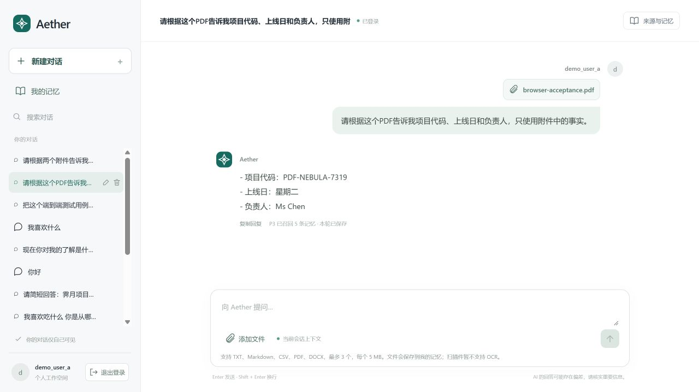
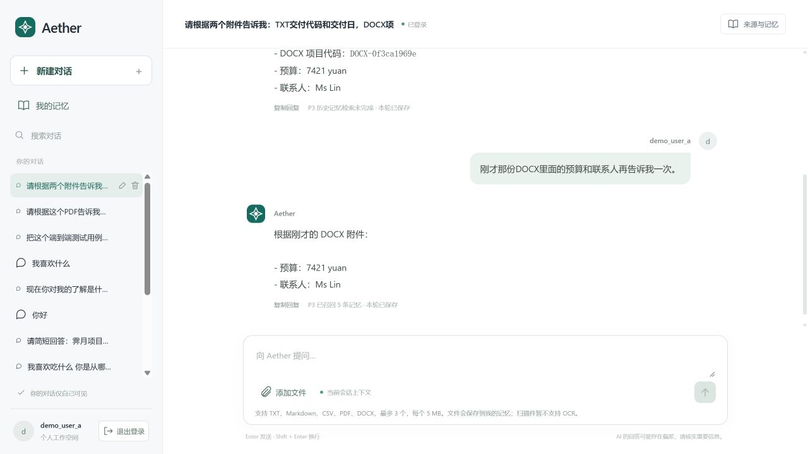

# Agent 聊天附件接入 P3 文档流程

更新日期：2026-10-07。适用若依版本 Agent；入口：https://aether-p3-demo-c50c3827.southeastasia.cloudapp.azure.com/ruoyi-agent/ 。

## 已实现的行为

聊天中选择文件后，浏览器上传原始文件字节到现有文档接口；P3 完成文档接收、解析与记忆保存，再开始聊天回答。消息只保存问题和附件引用，不再把解析正文拼进用户消息。生成回答时直接读取附件解析原文，长期记忆召回没有命中也能使用附件。

- 支持 TXT、Markdown、CSV、PDF、DOCX；每次最多 3 个，每个 5 MiB。扫描 PDF 尚不支持 OCR。
- 同一会话后续追问使用最近 3 份不同附件；附件绑定与文字历史窗口分开。正常摘要升级不会使原附件失效。
- 上传失败或响应不确定时保留原上传编号及消息编号；刷新后已确认的文件无需重新上传，未确认文件需要重新选择相同原件，前端用 SHA-256 核对。
- 服务端只接受当前用户、当前租户的已确认文档回执；不接受客户端传入正文、记忆身份或来源身份。回答前及发布过程中检查记忆状态和原来源，撤销、删除或不匹配会阻断发布。
- 长文档每份最多向模型提供前 12,000 字符，超出时显示部分阅读提示并要求回答明确说明。此版本不等于任意长文全文分析。
- 有附件时，遇到指定的召回执行中断或暂未完成状态，可基于已核验附件回答；明确记录和显示“历史记忆检索未完成”，不伪造空召回或成功回执。身份、权限及来源失效仍阻断回答。

## 验证结果

| 证据 | 验证内容 | 结果 |
|---|---|---|
| L1 | Python 聊天、流式、文档引用及上传命令定向测试 | 38 项通过，包含独立 PostgreSQL 测试，没有因缺少数据库跳过 |
| L2 | Agent 前端与真实 React/JSDOM 交互测试 | 14 项通过，覆盖原件上传、原编号重试、刷新恢复、切换会话及流式显示 |
| L3 | 修改 Python 文件 Ruff、格式与 Git 差异检查 | 通过；Agent 生产包随平台镜像构建成功 |
| C1 | TXT、DOCX 原件通过真实云端接口上传；读取 P3 解析来源 | 三种格式均确认保存，原文内容核对成功 |
| C2 | PDF 从真实浏览器“添加文件”入口上传并提问 | 回答准确包含 PDF-NEBULA-7319、星期二、Ms Chen；刷新后附件标签及答案仍可查看 |
| C3 | TXT、DOCX 联合提问及不再上传文件的连续追问 | 准确返回本轮唯一代码、7421 元预算与联系人；已确认问答完成、问题记忆保存成功 |
| C4 | 同上传编号重试 | TXT/DOCX 返回完全相同回执；数据库每个上传编号仅一条 document 回执，原件字节指纹匹配 |
| C5 | 同租户其他用户、跨租户用户引用这些上传编号 | 两者均拒绝；原用户消息内容仅为问题和引用 |

首次 TXT/DOCX 问答遇到现有长期召回 `EXECUTION_INTERRUPTED`。没有改写原任务终态；补充附件可独立回答后沿原消息编号重试成功。该次界面明确提示历史检索未完成；随后追问真实召回也成功。这并不表示原长期召回故障根因已经修复。

截图：

## 可追溯信息

以下均为本轮合成验收资料；原始请求、响应、日志和部署快照单独保存在助手工作目录中，不混入用户成品。

TXT/DOCX 会话：`14a29772-48ba-4b80-9cb3-7eb3d3eff12f`；首轮：`cbb2e386-7697-420c-b9e5-fac0ba9e337d`；追问：`82b99d06-da60-4cf4-8793-1bc5ffa2cd9f`。

PDF 会话：`a247af07-c79a-4434-b8d7-6d22c91c05b3`；消息：`6ea56d5c-4c4e-47b9-b440-a2d9c22edc0c`。

- **delivery-note.txt**：SHA-256 `6d7b17a6ec5220dcf9e1c22225401e007277d33b517ffa0ba60c87bae64ffcae`；文档保存操作 `docsave_87623642-6e13-4405-abf5-1641f46e8664`；记忆 `03322a708cbfea038035bc6b61ea7c46cebe8e40675ae48879971036da699b6f`。
- **project-plan.docx**：SHA-256 `b9a97712d065916055433dba7259953237ac42f56309a77f50e358e7e6ead80f`；文档保存操作 `docsave_7cbce7f2-c010-4779-b4ce-84f613f571e6`；记忆 `8a9a312aff4634fd032c54c6d7b5c78d5b2eda022734894b872366ef684f114c`。
- **browser-acceptance.pdf**：SHA-256 `52ef4a64e3463acd3a104ae51e5f8e345bc790931f7cb5a70e0818d1f86ecaf6`；文档保存操作 `docsave_ddefb22e-bd06-414c-9de7-9ec4418b4f20`；记忆 `a0db9feba0379569b4e834477aa10a4a3f7999394e9ab3cc5b9ebdb819b9430b`。

## 发布与回滚

只发布若依版本的 Agent/Python 平台镜像，包含浏览器端与 Python 聊天服务。P3、若依 Java 后台及若依管理页面镜像未变更。未切换独立旧版系统。

新镜像：`aetherp3acr-a0bne7gpetbpdcbq.azurecr.io/aether/ruoyi-platform@sha256:c79cfb9f87e5945435e708251fb05e9068645208ed11b40af6ff29ba1a12169a`。

源文件清单摘要：`9484c48159c97dc60d1366cc7a3e404869db0ac3b0380f2943fdaf15713bc115`。

回滚镜像：`aetherp3acr-a0bne7gpetbpdcbq.azurecr.io/aether/ruoyi-platform@sha256:ca5818e7f4bccc67b17ebe682134fab376355e5b29430de7b389c141c99c529c`。

发布前确认无正在生成的聊天请求及待处理/执行中业务任务；部署后核对实际 Pod 镜像摘要。新增 `chat_turns.attachments` JSONB 列，默认空列表。回滚服务时保留该列及全部文档、消息和上传回执，不回退业务数据。当前演示服务更新会使内存中的登录会话失效，用户需重新登录。

代码纳入现有 PR：https://github.com/csdnk/Ather-AIAgent/pull/20 ，不自动合并。没有重跑项目所有测试或宣称生产性能达标；OCR、任意长文全文阅读、长期召回原故障根因修复不属于本次已完成范围。
