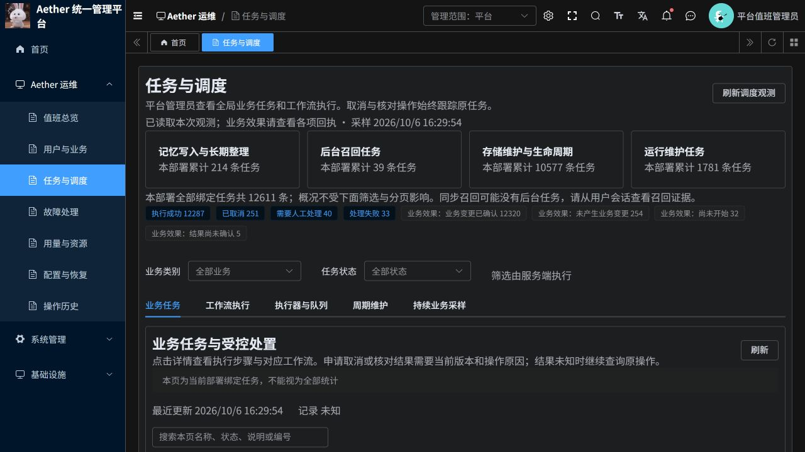
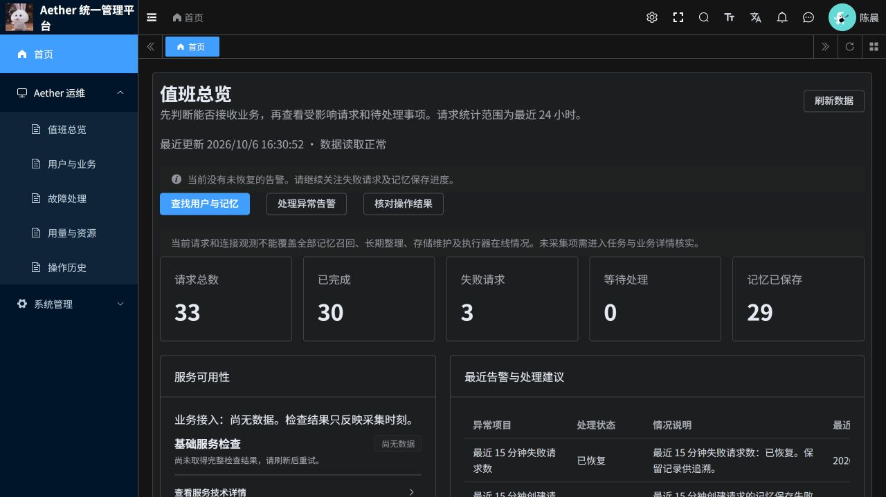

# 若依任务与调度页面修复

2026-10-06，已部署并通过云端账号与浏览器验证。

## 问题与原因

企业管理员被分配了“任务与调度”菜单及首页快捷入口，而该页面调用的是仅供平台管理员使用的全局诊断接口。服务端正确拒绝企业账号，若依返回的业务错误码为 403；前端丢失错误码并把权限问题显示成 `upstream_error` / 服务连接异常。表格同时错误显示“没有记录”。平台管理员访问该接口原本正常。

## 修复结果

- 企业套餐移除全局任务菜单，原有两个企业管理员对应菜单授权同步更新。其他菜单权限不变。
- 首页“检查任务与调度”快捷入口只对平台管理员显示。
- 已打开的旧任务页面先检查当前身份；企业账号看到中文权限说明和“查看本企业用户与业务”入口。
- 运维接口的业务错误码保留到页面，权限不足不再被误报成服务连接故障。
- 任务表格区分正在读取、读取失败、无权读取和确实没有记录。
- 初始化 SQL 同步修正，防止重新初始化时再次授予企业账号全局菜单。

企业范围的独立 P3 后台任务列表不在本次修复范围；企业管理员通过“用户与业务”查看本企业用户、请求与记忆信息。全局工作流、执行器与队列仍由平台管理员查看。

## 验证证据

| 证据 | 验证内容 | 结果 |
|---|---|---|
| TASK-01 | 修复前按账号复现 | 平台管理员诊断成功；企业管理员收到业务码 403 |
| TASK-02 | 前端回归 | 53 项通过；新增覆盖权限阻断、平台查询、业务 403、空表状态 |
| TASK-03 | Python 运维控制台与 P3 诊断 | 51 项通过，包括身份、作用域和诊断读取测试 |
| TASK-04 | 云端授权对比 | 仅移除两个企业角色的菜单 60003；账号、密码、启停状态与其他授权未变化 |
| TASK-05 | 云端平台接口 | 返回真实任务列表，每页 30 条；任务详情和队列可读取 |
| TASK-06 | 云端企业接口 | 两个企业管理员不再取得全局任务菜单；企业业务入口保留，越权诊断仍被拒绝 |
| TASK-07 | 最终版本浏览器 | 平台任务记录与队列可见；企业首页和侧栏无全局任务入口 |
| TASK-08 | 发布核对 | 前端镜像 digest 与运行 Pod 一致 |

生产构建、修改文件的 ESLint 和格式检查通过。额外 Stylelint 检查发现任务页及通用资源页共 19 项既有样式规范问题；对修改前 HEAD 复测得到相同问题，本次未扩大到样式整理。该项不计为通过。

页面观察时，部署历史任务总数为 12,611，包含历史失败及需要人工处理的任务。这只证明诊断页面能读取真实记录，不证明这些业务故障已经解决。本次未执行取消、重试或业务补偿。

## 访问与截图

[打开若依后台](https://aether-p3-demo-c50c3827.southeastasia.cloudapp.azure.com/ruoyi/)

已有会话请退出并重新登录，使侧栏菜单重新加载；浏览器若仍显示旧前端，可强制刷新。

## 发布与回退

- 分支：`codex/ruoyi-platform-20261006`
- 提交：`3ec5c7e2`
- ACR 镜像：`aetherp3acr-a0bne7gpetbpdcbq.azurecr.io/aether/ruoyi-frontend:source-f92658dde8b6e4b6`
- 已运行 digest：`sha256:6285a00ef6ec44714c8767f0999d50cc04c39c8a75eb6accad4d33588f88aa9b`
- 部署：`aether-p3-demo/aether-ruoyi-frontend`

发布前部署配置与企业套餐菜单快照已保存在项目外工作区。需要回退时可恢复此前前端 digest `sha256:c3ce7010ff802c5e0c55982223674350fa819873cadc7fd09737ec8b423036ea`；菜单应通过若依套餐更新接口恢复备份以同步角色与缓存。仅因前端回退无需重新授予企业账号全局任务菜单。
